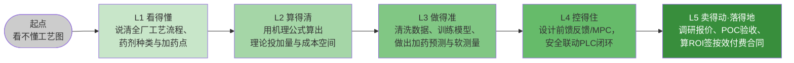

# 00-0 写给小白的话：你将学会什么

> 本章不讲技术，只讲三件事：**这套教程要带你去哪里、路上会经过什么、怎么走才不会学成"纸上谈兵"**。
>
> 阅读时间：约 15 分钟。

---

## 一、先讲一个真实得不能再真实的周一早上

某南方城市，一座 10 万吨/天的市政污水厂。

早上 7 点，早高峰的居民用水连同周末积攒的污水涌进厂门，进水流量从平时的 3500 m³/h 冲到 4800 m³/h，进水总磷从 4 mg/L 涨到 6.5 mg/L。运行班长老王的操作和过去十年一样：

1. 看一眼出水口在线总磷仪表，读数 0.42 mg/L，离一级 A 标准 0.5 不远了；
2. 心里"咯噔"一下，把 PAC（聚合氯化铝，除磷药）计量泵的开度从 40% 拧到 70%；
3. 还是不放心，又顺手把碳源泵开大了两格——"氨氮别再出幺蛾子"；
4. 中午复测，出水总磷 0.18 mg/L，安全了。药呢？**多加了至少 40%，而且那一整天都没往回调**。

月底厂长桌上两张单子：

- 药剂费 38 万，比预算超了 6 万；
- 污泥产量增加，外运处置费多了 4 万（多加的铝盐变成了化学污泥）。

厂长问老王："能不能少加点？"老王说："**少加超标了怎么办？你负责？**"

——这句话，就是全国几千座污水厂加药管控现状的缩影：**宁可多加，不敢少加；凭的是经验，赌的是达标，花的是冤枉钱。**

而隔壁一座同规模的厂，上了"前馈 + AI 预测"的加药系统，同样的进水冲击，机器在流量抬头的第 6 分钟就开始微调 PAC，出水总磷稳稳贴着 0.30 mg/L 走，**当月 PAC 用量下降 23%，碳源下降 18%，污泥减量 7%**，而且运行班长每天的工作从"拧泵"变成了"看屏幕、处理报警"。

这套教程要做的，就是让你**亲手学会隔壁厂那套本事**——并且知道它什么时候管用、什么时候会失灵、失灵了怎么兜底。

---

## 二、为什么"加药"这件事值得专门学

很多人以为污水厂就是"把脏水放进去、干净水放出来"，加药只是顺便撒点药粉。真进了厂你会发现：

| 认知 | 真相 |
|---|---|
| 药是配角 | 药剂费 + 因药带来的污泥处置费，通常占污水厂直接运行成本的 **20%~40%**，是仅次于电费的第二大可控成本 |
| 加药很简单，照着比例加就行 | 进水水质一天内可以波动 2~3 倍，药剂在水里要几十分钟到几小时才见效，等你看到结果再调，永远慢一拍 |
| 多加药总没坏处 | 除磷剂多加→化学污泥增多→脱水药耗增加→处置费上升；碳源多加→出水 COD 反弹、曝气电费上涨；消毒剂多加→腐蚀管道、副产物超标 |
| 上了 AI 就能躺着省钱 | AI 只在"仪表准、数据通、工艺稳、安全兜得住"的厂才省钱；在脏乱差的厂上 AI，等于给一辆漏油的车装自动驾驶 |

所以这门学问是**工艺 + 设备 + 仪表 + 数据 + 算法 + 控制 + 安全 + 商务**的交叉。单点知识网上都能搜到，但**把这条链路从头到尾串起来、并且每一环都知道实际长什么样、坑在哪的中文系统教程，非常少**——这就是本教程存在的理由。

---

## 三、学完以后，你具体能干什么

我们不承诺"七天成为大师"，但请对照下面这张能力阶梯，这是本教程的交付目标。

| 等级 | 对应岗位场景 | 学完的标志 |
|---|---|---|
| L1 看得懂 | 运行工轮岗、新人入职、销售第一次进厂 | 拿到一张工艺图能讲出水从哪来到哪去，指出 5 个以上加药点 |
| L2 算得清 | 工艺员、投标方案、节能改造评估 | 给一份进出水水质，能算出 PAC/碳源理论用量并对照实际值算浪费 |
| L3 做得准 | 数据/算法工程师、智慧水务公司 | 能独立完成数据治理→建模→验证，输出可上线的预测服务 |
| L4 控得住 | 自控工程师、项目经理 | 能画出含安全联锁的控制架构，完成 PLC 联调与灰度投运 |
| L5 落得地 | 产品经理、技术销售、创业者、厂长 | 能完成客户调研、ROI 测算、报价、按效付费合同谈判与验收 |

不同岗位的读者，**不必逐级爬**：运行人员重点到 L1/L2，算法同学可以从 L2 直接进 L3，产品经理可以在 L1 之后直奔 L5。具体路线见 [00-1 教程地图与四条学习路径](./00-1-教程地图与四条学习路径.md)。

---

## 四、本教程的三个"不讲"和三个"一定"

为了不让你学成"纸面专家"，先把规矩立在前面。

**三个不讲：**

1. **不讲没有工程出处的"玄学数字"**。所有投加比、浓度、价格都给区间和适用条件，并标注"典型经验值，现场必须实测校核"。
2. **不讲无法运行的伪代码**。正文代码要么是可以直接复制运行的 Python（合成数据、固定随机种子），要么明确标注"伪代码，仅表达逻辑"。
3. **不讲"AI 万能论"**。每个算法都配一节"什么时候不该用它"。事实上，本教程最推荐的路线是**机理公式打底 + 机器学习修正 + PID/规则兜底**的灰箱方案，而不是一上来就深度学习。

**三个一定：**

1. **一定讲钱**。每一类优化都落到"吨水节省几分钱、一年节省多少万、投资多久回本"。
2. **一定讲现场**。计量泵怎么堵、仪表怎么漂移、PLC 怎么断连、老师傅怎么不配合——这些书上不写的，本教程写。
3. **一定讲安全**。任何自动加药方案都必须回答：仪表坏了怎么办、模型抽风了怎么办、出水要超标了谁来接管。[08-3 安全、联锁与人工接管](../08-落地实施篇/08-3-安全联锁与人工接管.md) 是全套教程的红线章节。

---

## 五、给不同起点读者的三句话

- **如果你是污水厂运行/工艺人员**：你已经拥有最宝贵的东西——现场感。AI 不会取代你，但**会用 AI 的运行工会取代不会用的**。你要补的主要是 05、06 篇的数据和算法概念，把它们当成"新仪表"来理解即可，不用怕数学。
- **如果你是 IT/算法人员**：你最大的风险是"拿着锤子找钉子"，把一个几十分钟滞后、仪表还经常坏的工业过程当成互联网推荐系统来做。请务必老老实实读完 01、02、04 篇，**先对工艺保持敬畏**。
- **如果你是产品/销售/管理者**：你不需要会调参，但必须能在饭桌上回答客户三个问题——"你凭什么能省（机理）"、"省了怎么证明（M&V）"、"出事了怎么办（安全兜底）"。09 篇会逐字教你。

---

## 六、怎么用这套教程，效果最好

1. **边读边对照一张真实工艺图**。如果厂里有，用手机拍下来；没有就用 [01-3](../01-基础篇/01-3-污水处理工艺全流程图解.md) 的图。读到任何构筑物、任何加药点，都在图上找到位置。
2. **公式必须动手算一遍**。教程里的例题数字都可以替换成你厂的数据——这一步做了，L2 就是你的。
3. **代码必须跑一遍**。不用装任何复杂环境，[10-3 工具链与环境搭建](../10-附录/10-3-工具链与环境搭建.md) 提供了十分钟环境搭建脚本。跑通之后把合成数据换成厂内导出的 CSV，你就完成了第一个真实项目原型。
4. **每读完一篇，用一句话给同事讲一遍**。讲不清楚的地方，就是没懂的地方，回去重看。

---

## 七、本章小结

- 加药管控的本质矛盾：**进水在剧烈波动，药剂效果有滞后，人为了保达标只能过量投加**——过量就是钱，还会带来污泥等连锁成本。
- AI 加药的价值不是"替代人"，而是**比人更早看到变化、比人更精细地调节、比人更稳定地贴着达标线运行**。
- 本教程的目标是五级能力：看得懂 → 算得清 → 做得准 → 控得住 → 落得地。
- 学习铁律：现场第一、机理第二、数据第三、算法第四、安全贯穿始终。

下一章，[00-1 教程地图与四条学习路径](./00-1-教程地图与四条学习路径.md)，我们铺开整张地图，告诉你每一篇具体讲什么、怎么按自己的岗位跳着读。
