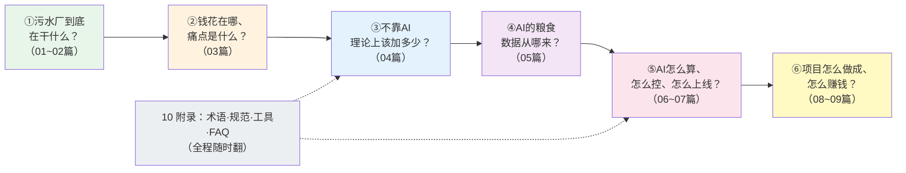
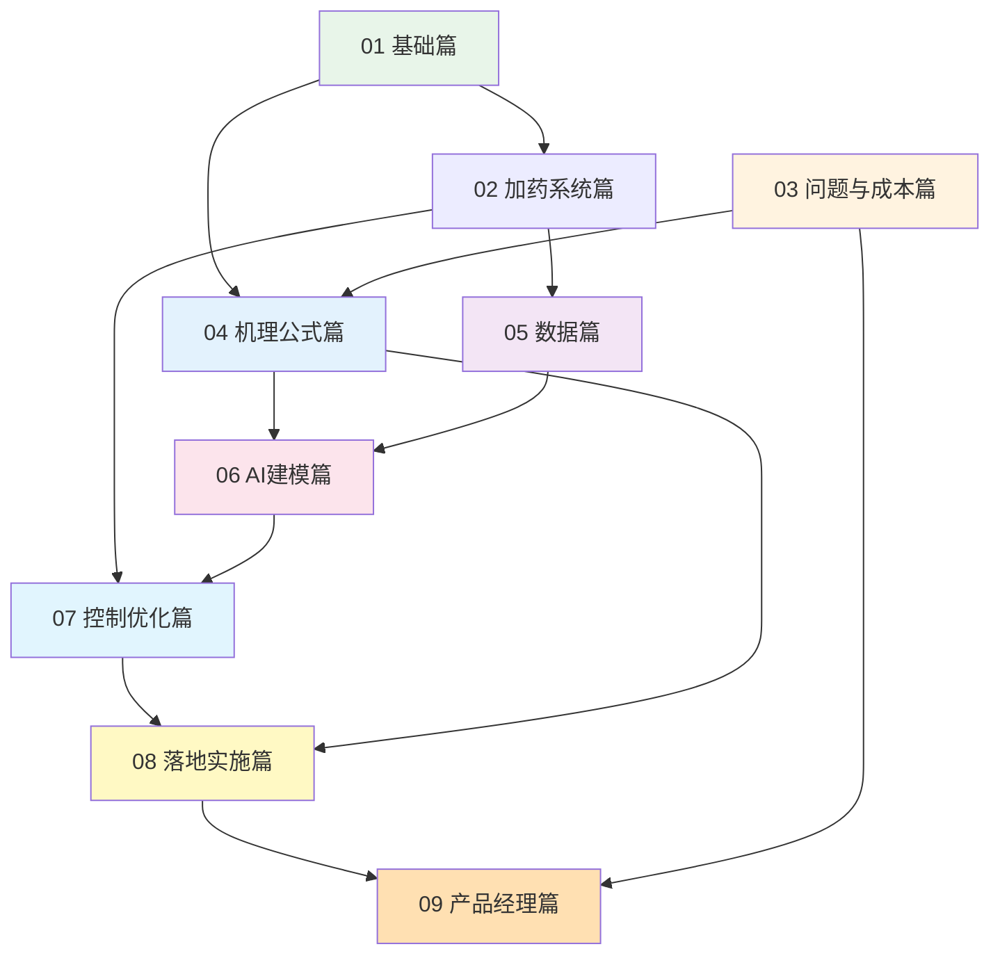

# 00-1 教程地图与四条学习路径

> 本章是全套教程的"导航仪"：每一篇解决什么问题、篇与篇之间是什么关系、不同岗位怎么跳着读、配套图表代码怎么用。
>
> 阅读时间：约 15 分钟。

---

## 一、先记住一条主线：发现问题 → 解释问题 → 解决问题

全套 52 章看起来很多，其实只回答六个问题，环环相扣：

**很多自学失败的人，都是跳过了②③直接学⑤**——算法学得很溜，进厂不知道客户为什么要花钱、也不知道理论投加量是多少，最后做出来的模型要么没法落地、要么省不了钱。请尊重这条主线。

---

## 二、每一篇具体讲什么、解决什么问题

| 篇 | 篇名 | 解决的核心问题 | 学完的标志性产出 |
|---|---|---|---|
| 01 | 基础篇 | 污水、指标、工艺都是什么？药都加在哪？ | 一张能向家人讲明白的全厂流程图 |
| 02 | 加药系统篇 | 药从药袋到水里要经过哪些设备？数据从哪来？ | 加药间设备清单 + 信号流向图 |
| 03 | 问题与成本篇 | 现在的加法浪费在哪？浪费有多大？ | 一份"痛点-损失"对照账 |
| 04 | 机理公式篇 | 科学的投加量应该怎么算？过程为什么有滞后？ | 5 类药剂的手算计算书 |
| 05 | 数据篇 | AI 需要的数据长什么样？脏数据怎么办？ | 点位表 + 数据清洗规则库 |
| 06 | AI 建模篇 | 怎么让机器学会预测加药量和出水指标？ | 可运行的建模 Notebook 级代码 |
| 07 | 控制优化篇 | 怎么把模型变成泵的动作？怎么先在仿真里试？ | 前馈反馈/MPC 控制方案与仿真 |
| 08 | 落地实施篇 | 真实项目怎么交付？安全怎么兜底？怎么验收？ | 实施方案模板 + BOM + M&V 报告 |
| 09 | 产品经理篇 | 卖给谁、卖多少钱、怎么签合同？ | 客户画像 + ROI 表 + 商务打法 |
| 10 | 附录 | 忘了术语、查不到限值、环境装不上？ | 随时翻阅的工具书 |

---

## 三、四条学习路径（按岗位裁剪）

### 路径 A：小白入门路（运行工 / 新人 / 管理者）——2 周

目标：建立完整常识，听得懂工程师和供应商在说什么，能判断"这事靠不靠谱"。

- [x] 00 导读全部
- [ ] [01-1 污水从哪来、到哪去](../01-基础篇/01-1-污水从哪来到哪去-一座污水厂的一天.md)
- [ ] [01-2 污水的体检报告](../01-基础篇/01-2-污水的体检报告-核心指标通俗讲义.md)
- [ ] [01-3 污水处理工艺全流程图解](../01-基础篇/01-3-污水处理工艺全流程图解.md)
- [ ] [01-4 生物处理入门](../01-基础篇/01-4-生物处理-微生物打工仔的食堂与宿舍.md)
- [ ] [01-5 加药点全景](../01-基础篇/01-5-加药点全景-全厂药剂家族图谱.md)
- [ ] [02-1 加药系统硬件全景](../02-加药系统篇/02-1-加药系统硬件全景-从药袋到出水口.md)
- [ ] [03-1 老师傅经验操作](../03-问题与成本篇/03-1-传统加药怎么投-老师傅经验操作全揭秘.md)
- [ ] [03-2 成本账本](../03-问题与成本篇/03-2-污水厂成本账本-药剂到底花了多少钱.md)
- [ ] [03-3 八大痛点](../03-问题与成本篇/03-3-加药管控八大痛点.md)
- [ ] [03-4 事故案例集](../03-问题与成本篇/03-4-真实事故与返工案例集.md)
- [ ] [04-1 化学除磷计算](../04-机理公式篇/04-1-化学除磷机理与投加量计算.md)（算例题即可，推导可跳）
- [ ] [04-2 碳源投加计算](../04-机理公式篇/04-2-生物脱氮除磷机理与碳源投加计算.md)（算例题即可）
- [ ] [06-1 AI 加药能力地图](../06-AI建模篇/06-1-AI加药能力地图-什么活能交给AI.md)
- [ ] [08-4 三个典型厂案例](../08-落地实施篇/08-4-三个典型厂案例-方案BOM与ROI.md)
- [ ] [08-7 现场救火手册](../08-落地实施篇/08-7-现场救火手册-四十个高频故障的临时处置.md)（值班工具书，先读自己岗位那组）
- [ ] [09-2 价值量化与 ROI](../09-产品经理篇/09-2-价值量化与ROI测算模型.md)

### 路径 B：工艺/自控工程师路——4 周

目标：成为项目技术负责人，能独立做方案、画控制逻辑、盯联调。

00-2 → 01-3 / 01-4 / 01-5 → **02 全部** → **04 全部（公式和算例逐个过关）** → **05 全部** → **07 全部** → **08 全部** → 10-2 规范限值。重点动手：跑通 [04-5](../04-机理公式篇/04-5-加药过程动态特性-PID前馈与反馈.md) 的 PID 仿真和 [07-2](../07-控制优化篇/07-2-前馈加反馈控制器设计实例.md) 的除磷控制器仿真，把参数换成自己厂的。

### 路径 C：算法/数据工程师路——4 周

目标：成为 AI 加药建模负责人，知道工业数据的特殊性，模型上线不翻车。

00-2 → 01-2 / 01-5 → 02-3 / 02-4 → **04-1 / 04-2（建立机理先验，这是你区别于"调包侠"的关键）** → **05 全部** → **06 全部（每章代码都跑）** → 07-3 / 07-4 → 08-2 / 08-3 / **08-6（认清模型边界）** → 10-3。重点动手：[06-3](../06-AI建模篇/06-3-加药量预测建模完整实战.md) 的建模全流程，以及 [06-6](../06-AI建模篇/06-6-机理加数据-灰箱混合模型最落地.md) 的灰箱模型。

### 路径 D：产品经理/销售路——10 天

目标：能独立调研、算账、写方案、应对客户灵魂拷问。

00 全部 → 01-1 / 01-5 → 03-2 / 03-3 → 06-1 → 08-4 / 08-5 / **08-6 / 08-8（边界与交付运维）** → **09 全部（逐字读）** → 10-2 / 10-4。重点产出：照 [09-1](../09-产品经理篇/09-1-客户画像与需求调研.md) 的清单做一次真实客户访谈，用 [09-2](../09-产品经理篇/09-2-价值量化与ROI测算模型.md) 的模型算三个不同规模厂的 ROI。

---

## 四、篇章之间的"隐藏依赖"（跳读时注意）

三条最容易被忽视、但实际最值钱的依赖链：

1. **04（机理）→ 06（AI）**：不懂除磷反应的摩尔比，就不知道模型该用哪些特征，也判断不了模型输出是否荒谬。
2. **02（仪表/PLC）→ 07（控制）→ 08（落地）**：控制方案不是写在论文里的，是受仪表测量周期、泵的最小冲程、PLC 扫描周期约束的。
3. **03（成本）→ 09（商务）**：算不清"现在浪费多少钱"，就卖不出"未来能省多少钱"。

---

## 五、怎么用本教程的图表和代码

| 类型 | 在哪 | 怎么用 |
|---|---|---|
| Mermaid 流程图 | 正文内嵌 | VS Code 装 Markdown Preview Mermaid 插件即可看；也可直接贴到 [mermaid.live](https://mermaid.live) 导出图片做汇报 |
| 实算图（PNG） | [images/](../images/) | 由 [scripts/](../scripts/) 同名脚本生成，改参数重跑即可做"假设分析" |
| 场景照片 | 正文内嵌真实污水厂/设备照片（Wikimedia Commons） | 建立现场直观印象，来源与署名见 images/scenes/CREDITS.md |
| Python 代码 | 正文 + scripts/ | 全部使用合成数据、固定随机种子，先跑通再换厂内数据 |

**建议的动手节奏**：每读完一篇带代码的章节，立刻花 20 分钟把代码跑一遍——看懂了和跑通了之间，隔着一整个项目的经验。

---

## 六、高手都在用的三个辅助学习动作

1. **建一个"现场对照本"**（一个笔记本或表格就行）：每读一个构筑物/设备，记录"书上怎么说 → 我厂是什么型号/参数 → 差异与疑问"。坚持 30 天，你对厂的理解会超过大多数老员工。
2. **做一次完整的"加药审计"**：拿 1 个月的运行台账，照 [03-2](../03-问题与成本篇/03-2-污水厂成本账本-药剂到底花了多少钱.md) 的方法算吨水药耗，照 [04 篇](../04-机理公式篇/04-1-化学除磷机理与投加量计算.md) 的方法算理论用量——**实际值除以理论值，就是你厂的"过量倍数"**。这一个数字，胜过十次会议。
3. **画一张你厂的"信号流图"**：从仪表探头到 PLC 到 SCADA 到数据库，每个信号标上量程、单位、采集周期、通讯方式。这是所有 AI 项目的第一张图纸（[05-1](../05-数据篇/05-1-数据从哪来-点位表与数据字典.md) 会给模板）。

---

## 七、本章小结

- 全套教程按"是什么 → 浪费在哪 → 理论该多少 → 数据怎么来 → AI 怎么算怎么控 → 项目怎么赚钱"六问推进。
- 四类岗位有四条裁剪路径，**附录全程可随时翻阅**。
- 最值钱的学习方法不是读完，而是：跑代码、算本厂数据、画信号流图、做加药审计。

准备好接受第一波冲击了吗？最后一章导读，[00-2 五分钟看懂污水厂 AI 加药](./00-2-五分钟看懂污水厂AI加药.md)，我们用一个故事把全书主线走一遍。
