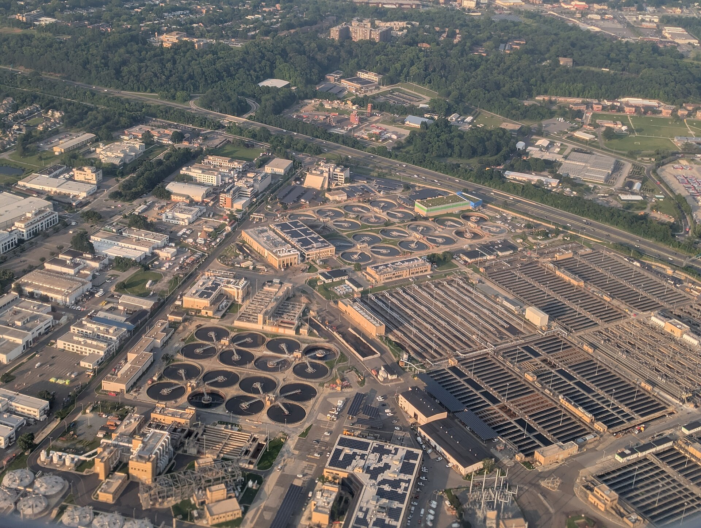
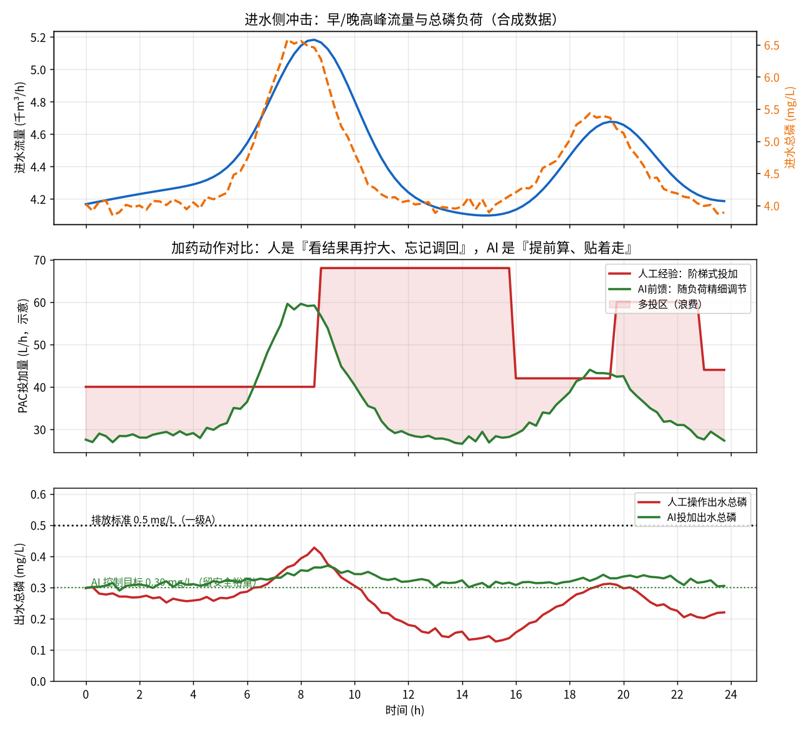
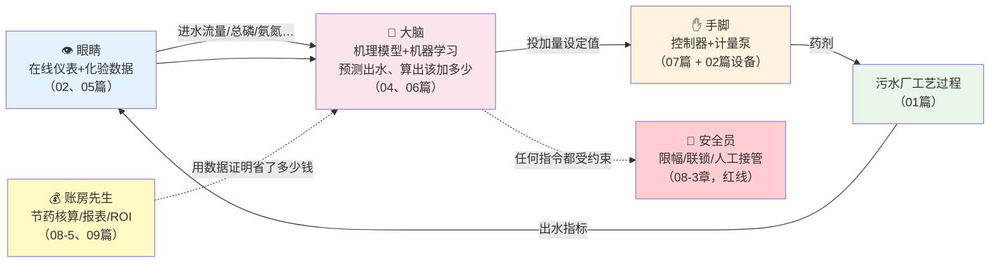

# 00-2 五分钟看懂污水厂 AI 加药

> 不看这章也能往后学，但看了它，你脑子里会先有一张"全息地图"，后面所有章节都是在往这张地图上填细节。
>
> 阅读时间：约 10 分钟。

---

## 一、先看一张"上帝视角"的厂区照片

*真实照片：美国华盛顿 Blue Plains 先进污水处理厂航拍——圆形二沉池、矩形曝气池等构筑物尽收眼底。图片来源：Wikimedia Commons，作者 Sdkb，CC BY-SA 4.0。*

用最直白的话概括污水厂在干嘛：

> **把城市下水道收集来的脏水，用"筛子 + 沉沙 + 细菌吃 + 加药沉 + 消毒"五件套，处理到达标后放回河流。过程中产生的污泥脱水后外运。**

加药，就是五件套中"加药沉"以及辅助环节里投加化学药剂的动作。药加得准不准，直接决定**出水达不达标、一年花多少钱、产多少污泥**。

---

## 二、一个 24 小时故事，看懂全部矛盾

接着 [00-0](./00-0-写给小白的话-你将学会什么.md) 里老王的故事，我们把一整天画出来（下图由本教程脚本实算生成，参数是典型经验量级）：

三行图分别是：

1. **进水侧**（蓝线流量、橙虚线总磷）：早 8 点、晚 7 点各有一次冲击，这是居民生活规律决定的，天天如此、雨天更甚。
2. **加药动作**：红色是人工——看到出水不妙，8:45 一把把泵从 40 拧到 68，然后一整天忘了往回调；绿色是 AI——凌晨就根据历史规律知道早高峰要来，流量一抬头就跟着负荷小幅调节。
3. **出水结果**：红色人工线平时压到 0.25（过度处理、纯浪费），冲击时却冲到 0.43（离超标线 0.5 只差一步）；绿色 AI 线平时稳稳贴着 0.30 的目标值，冲击时峰值只有 0.37。

**算总账（脚本直接输出的数字）：24 小时人工累计投药 1229 单位，AI 833 单位，省 32.2%。**

这个故事浓缩了全书最核心的一个洞察：

> **人工加药的问题不是"不认真"，而是"看不见未来 + 等不起滞后 + 不敢回调"。AI 的价值恰好对症：提前预测、精细调节、永不疲劳、且永远记得回调。**

为什么会有滞后？因为药加进水里，要经过混合、反应、沉淀、二沉池停留，**等出水仪表显示结果时，已经是 2~4 小时前加的药造成的**。这就像洗澡时调水温：你现在感觉到烫，调的是几秒后的水——手忙脚乱就会忽冷忽热。[04-5](../04-机理公式篇/04-5-加药过程动态特性-PID前馈与反馈.md) 会把这个"调水温"问题用控制理论彻底讲透。

---

## 三、AI 加药系统到底由什么组成（五个角色）

把 AI 想成一个"自动驾驶的加药班组"，它有五个角色，对应教程的五个篇：

- **眼睛（仪表与数据）**：进水流量计、COD/氨氮/总磷在线仪、DO/ORP 探头……数据不准，后面全错。这就是为什么 [05-2](../05-数据篇/05-2-数据质量治理-脏数据的九种死法.md) 要花一整章讲"脏数据"。
- **大脑（机理 + AI）**：先用化学公式算出"理论下限"（[04 篇](../04-机理公式篇/04-1-化学除磷机理与投加量计算.md)），再用机器学习根据本厂数据修正系数、预测未来几小时（[06 篇](../06-AI建模篇/06-1-AI加药能力地图-什么活能交给AI.md)）。
- **手脚（控制与泵）**：大脑算出"该加 52 L/h"，通过 PLC 变成计量泵的冲程/频率（[07 篇](../07-控制优化篇/07-1-从开环建议到闭环控制-三种架构.md)）。
- **安全员**：AI 抽风、仪表坏掉时怎么办？泵频限幅、异常联锁、一键切回手动——**宁可系统停机，不可出水超标**。
- **账房先生**：用基线对比证明"这个月真的省了 23%"，这是按效付费合同和验收的依据。

*真实照片：新加坡新生水（NEWater）水厂中控室，SCADA 大屏与操作员坐席——AI 加药系统最终就要融入这样的监盘环境。图片来源：Wikimedia Commons，作者 Z22，CC BY-SA 4.0。*

---

## 四、它到底能省多少钱（先给你一个数量级）

以一座 **10 万吨/天** 的市政厂为例（详细算法在 [09-2](../09-产品经理篇/09-2-价值量化与ROI测算模型.md)，此处只建立直觉）：

| 省钱来源 | 典型优化空间 | 一年的量级（10万吨厂） |
|---|---|---|
| 除磷剂（PAC/PFS）精准投加 | 节药 15%~30% | 20~60 万元 |
| 反硝化碳源按需补加 | 节药 10%~25% | 30~100 万元（碳源往往是最大头） |
| 污泥减量（少加的药变成少产的泥） | 减量 5%~10% | 15~50 万元 |
| 避免超标罚款/生态损害 | 风险事件大幅下降 | 单次罚款即可达数十万，无法用均值衡量 |
| 曝气等联动电耗（部分场景） | 节电 3%~8% | 10~40 万元 |

一套 AI 加药系统的投入（硬件 + 软件 + 实施）对这个规模的厂通常在 **50~150 万元**，**静态回本周期常见 1~2.5 年**；规模越大、管理越粗放，回本越快。这也是为什么市场真实存在、且在加速——但前提是项目真的按 [08 篇](../08-落地实施篇/08-1-项目实施全流程-从调研到验收.md) 的方法做扎实了。

同时泼三盆冷水（后面会反复讲）：

1. **基准线 30%~50% 的厂，仪表数据本身不可信**，这种厂必须先补数据治理的课，AI 才有用；
2. **碳源、除磷的优化空间高度依赖工艺和排放标准**，不是每个厂都有上表这么大空间，必须现场算账；
3. **真正失败的 AI 加药项目，80% 不是算法不行，而是仪表选型、现场施工、安全联锁、运营配合出了问题**。

---

## 五、五分钟到了，记住这五句话

1. 污水厂 = 筛沙 + 细菌吃 + 加药沉 + 消毒，**加药是第二大可控成本**。
2. 人工加药三大死穴：**滞后看不见、冲击保安全只能过量、过量后不回调**。
3. AI 加药 = **眼睛（仪表数据）+ 大脑（机理+模型）+ 手脚（控制器泵）+ 安全员（联锁兜底）+ 账房（效益核算）**。
4. 省钱不只是药费：**碳源、污泥、电耗、超标风险**四本账一起算。
5. 项目成败 80% 在算法之外：**数据、现场、安全、人**。

热身结束。正式进入第一篇——[01-1 污水从哪来、到哪去：一座污水厂的一天](../01-基础篇/01-1-污水从哪来到哪去-一座污水厂的一天.md)。
