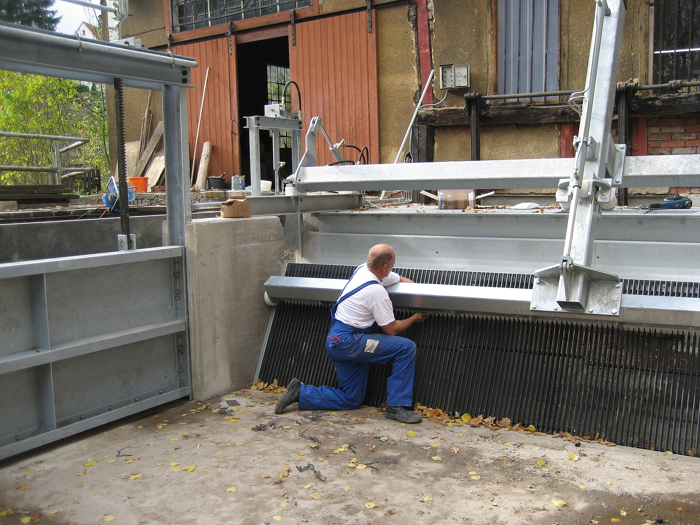
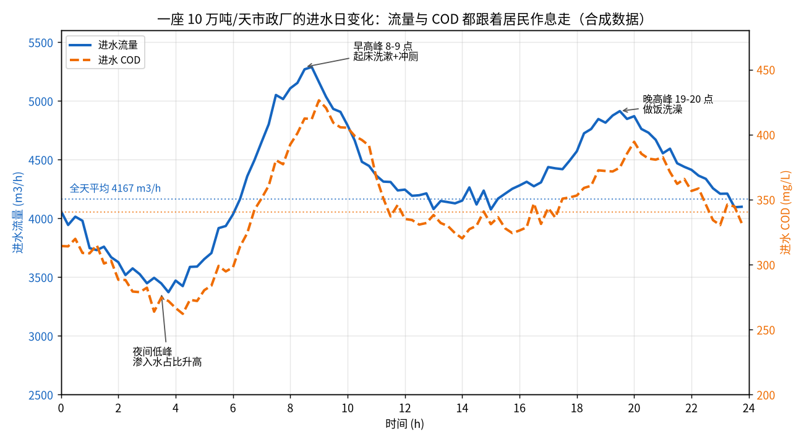
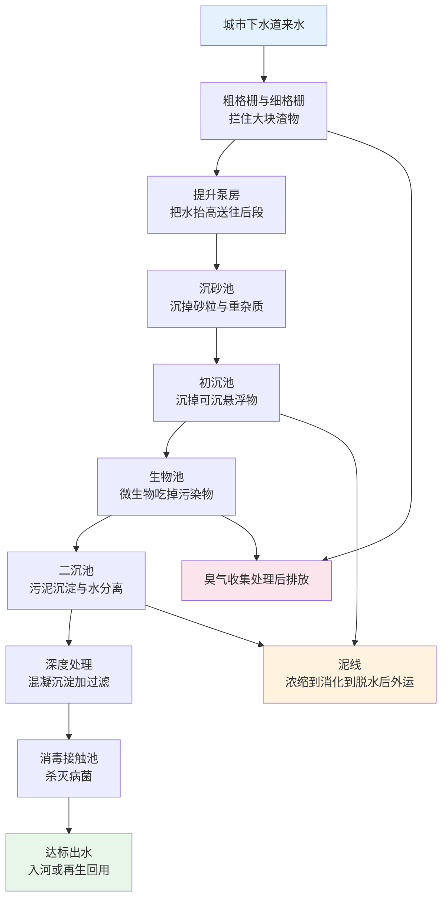

# 01-1 污水从哪来、到哪去：一座污水厂的一天

> **本章讲什么**：不讲任何公式和设备型号，先跟着一户普通家庭用过的水走一趟——从马桶、厨房一路走到污水厂，再跟着水流在厂里走完"一生"。
>
> **读完你能回答**：污水到底是什么水？一座污水厂一天要处理多少水、这数字怎么来的？为什么不处理就不能排回河里？厂里的水线、泥线、臭气线各是怎么回事？什么是一级、二级、深度处理？
>
> **阅读时间**：约 18 分钟。后面四章都是往这一章的骨架上填肉。

---

## 一、一户普通家庭的一天：用掉的水都去哪儿了

早上 7 点，老王家三口人陆续起床。冲马桶、洗脸刷牙、煮面洗碗；晚上回来，洗澡、洗衣机转两筒、再冲几次马桶、洗水果拖地。一天下来，水表走了大概 **0.55 m³**，也就是 550 升，人均约 180 升。

这 550 升自来水，喝下去的只是零头，绝大部分用的时候还是清水，**用完就变脏了**：

- 马桶水带走了粪尿和卫生纸——有有机物、有氮、有磷、有细菌；
- 厨房水带着剩饭渣、油脂、洗涤剂；
- 洗澡洗衣水带着毛发、皮屑、肥皂和洗衣液。

把这家人一天的水大致摊开，是这样一笔账（仅为建立直觉的典型估算，各家差别很大）：

| 用水环节 | 估算水量（3 人家庭一天） | 水变脏时带走了什么 |
|---|---|---|
| 冲厕（约 10~14 次） | 约 200~280 L | 有机物、氨氮、磷、粪大肠菌群 |
| 洗澡洗漱 | 约 120~180 L | 毛发皮屑、肥皂、洗发水 |
| 厨房做饭洗碗 | 约 60~100 L | 油脂、食物残渣、洗涤剂 |
| 洗衣（约一筒） | 约 50~80 L | 纤维、洗衣液里的磷与表面活性剂 |
| 拖地、浇花等杂用 | 约 20~40 L | 灰尘泥沙，部分损耗不进下水道 |

这些脏水顺着楼里的排水立管往下走，进了小区窨井，再汇入市政道路下面的污水管网，中间经过一两座中途提升泵站，最后一个转弯——**进厂了**。

进厂第一眼看到的，就是下面这个地方。



*真实照片：污水厂进水端的机械格栅，运行人员正在检修耙齿（德国某厂）。树枝、塑料袋等大块杂物先在这里被拦截。图片来源：Wikimedia Commons，作者 Ludowingischer，CC BY-SA 2.0 DE。*

注意，老王家用了 550 升，**排进下水道的并不是 550 升**。浇花、拖地蒸发会损耗一点，但小区和管网里又会混进来别的水。污水厂进水的"身世"，比"自来水减一点"要复杂。

---

## 二、进厂的污水里，都有谁

污水厂进厂的水，行话叫**进水**（也叫原水），它不是一种水，而是四类水的"大杂烩"：

| 来源 | 典型占比概念（雨污分流的城市生活厂） | 它带来什么麻烦 |
|---|---|---|
| 居民生活污水 | 约 70%~90% | 有机物、氨氮、总磷、粪便细菌，是污染物基本盘 |
| 小工业与三产排水 | 约 10%~30% | 餐饮油脂、理发店药剂、小工厂的重金属或难降解 COD，可能"投毒" |
| 合流制溢流（CSO） | 平时为 0，雨天大量涌入 | 雨水裹着管道沉积物一起进厂，流量翻倍、浓度被冲淡 |
| 地下水渗入与河水倒灌 | 约占旱季流量 5%~20% | 老管道接口漏进来的清水，夜间占比尤其高，"稀释"进水浓度 |

这里有几个小白最容易忽略、但现场极其关键的点：

> 💡 **经验块 1：占比是"概念"，不是背下来的常数。** 每个厂的进水构成都不一样：老城合流制管道的厂，雨天流量能冲到旱季的 2~3 倍；工业园区配套厂，工业水可能占到一半以上。做加药方案前先问一句"这厂什么体制、收水范围里有什么厂"，比记任何标准数字都重要。

> 💡 **经验块 2：夜里 2~4 点流量不归零，查渗入。** 居民都睡了，生活用水几乎停了，但流量计上还有白天三到五成的水——这部分主要是地下水渗入和管网清水。它会把 COD、氨氮浓度"兑水"兑低，**看着水量不小，污染物负荷却不高**。AI 建模时如果不区分这一点，夜间数据会把模型带偏。

> ⚠️ **经验块 3：小工业排水是"暗雷"。** 进水突然变色、冒泡沫、死泥（活性污泥微生物被抑制）、pH 掉到 5 以下，十有八九是收水范围内某家小厂偷排了超标废水。运行班长有个土办法：**闻味、看色、记时间**——连续几天固定时段来的异常水，顺着管网巡检常能抓到源头。

这里先埋下全书最重要的一个口径：**水量 ≠ 负荷**。

- 水量（m³/h）是"来了多少水"；
- 负荷（kg/h）= 水量 × 污染物浓度，才是"来了多少脏东西"。

夜间渗入的清水让水量表很好看，但 COD 负荷可能只有白天的三分之一；雨天流量翻倍，总磷负荷却未必翻倍。**加药要服务的是负荷，不是水量**——只看流量计调泵，是新手最常见的错误。也就是说，污水厂面对的不是成分稳定的"标准污水"，而是一股**随时间、天气、城市活动不断变脸**的水。这一点决定了后面所有加药故事的基调。

---

## 三、一座厂一天处理多少水：水量是怎么算出来的

### 1. 从人均排水量说起

规划一座厂，第一笔账是人口账。市政设计常用的经验口径：

- 城镇居民**人均日生活用水量**：约 150~220 L/（人·d）；
- 用水不会 100% 变成污水，考虑损耗，**人均日排水量**经验值约 **120~180 L/（人·d）**（具体项目以当地实测和规划为准）。

### 2. 一个完整算例：60 万人的区域该建多大的厂

**公式**：

```
Q设计 = N × q ÷ 1000 × k
```

符号含义与取值：

- `Q设计`：污水厂设计规模，单位 m³/d（立方米每天）；
- `N`：服务人口，单位人；本例取 600,000 人；
- `q`：人均日排水量，单位 L/（人·d），取典型经验值 **150 L/（人·d）**；
- `k`：未预见水量及管网综合系数，规划阶段常取 1.05~1.15，本例取 1.1；
- 除以 1000 是把升（L）换算成立方米（m³），因为 1 m³ = 1000 L。

**一步步算**：

1. 日排水总量 = 600,000 人 × 150 L/人 = 90,000,000 L/d；
2. 换算成立方米：90,000,000 ÷ 1000 = **90,000 m³/d**；
3. 乘系数：90,000 × 1.1 = **99,000 m³/d**；
4. 取工程整数，设计规模定为 **10 万 m³/d（10 万吨/天）**。

这就是行业里常听到的"十万吨厂"的来历——**不是拍脑袋，是人口乘出来的**。一座厂的"服务范围"（行话叫收水范围）就是管网能覆盖、水量汇入本厂的那片街区；范围里人口增长了，厂就可能不够用，需要扩建或再建新厂。同样按 150 L 口径粗算，可以建立一张规模直觉表：

| 设计规模 | 大致对应服务人口（人均 150 L、取整） | 行业里的常见定位 |
|---|---|---|
| 1 万 m³/d | 6~7 万人 | 县城、小城镇厂 |
| 5 万 m³/d | 30 万人上下 | 县级市、城市片区厂 |
| 10 万 m³/d | 60 万人上下 | 中等城市主力厂 |
| 50 万 m³/d | 300 万人上下 | 大城市骨干厂、特大厂 |

### 3. 水量不是一条直线：一天之内有高峰低谷

10 万吨厂是"日均"，真实进水一天 24 小时是波动的。下图是按典型居民作息合成的一座 10 万吨厂 24 小时进水曲线：



*数据为合成/典型参数实算：蓝色实线是进水流量，橙色虚线是 COD 浓度。脚本实算输出——全天来水约 10.3 万 m³，流量最小约 3372 m³/h、最大约 5289 m³/h，时变化系数约 1.23；COD 在 262~426 mg/L 之间起伏。*

读图抓三件事：

1. **早高峰（8~9 点）**：全城起床，冲厕、洗漱集中排放，流量冲到全天最大；
2. **晚高峰（19~20 点）**：做饭、洗澡、洗衣，第二波；
3. **夜间低谷（2~5 点）**：生活排水近乎停止，来水以地下水渗入为主，流量小、浓度也被清水兑低。

工程上用**变化系数**描述这种波动：日变化系数（最大日/平均日，常见 1.1~1.3）、时变化系数（最大时/平均时，常见 1.2~1.8）。**加药为什么难？难就难在药量得跟着这根起伏的曲线走，而水泵不会自己知道早高峰几点来**——这是全书的伏笔。

---

## 四、为什么处理完才能排：河流不是无限大的垃圾桶

处理后的水（行话叫**出水**），99% 的市政厂最终排进附近的河流、湖泊或近海，这些水体叫**受纳水体**。河流其实自己也有"净化能力"，靠的是三件套：

1. **稀释**：大河水量大，污水排进去被摊薄，浓度降下来；
2. **复氧**：流水翻滚、藻类产氧，空气中的氧气溶进水里，鱼和好氧微生物才能活；
3. **土著微生物**：河床、淤泥里本来就住着细菌，能慢慢吃掉一部分有机物和氨氮。

但这个能力是有上限的——能净化一条小河日常来水的能力，扛不住全城几百吨污染物天天往里灌。

超了会怎样？三个后果，一个比一个具体：

| 后果 | 通俗解释 | 现场能看到的现象 |
|---|---|---|
| 黑臭 | 有机物太多，水里的溶解氧被微生物耗光，厌氧菌繁殖，产生硫化氢等臭气 | 河水发黑、冒气泡、腥臭，路人捂鼻子快走 |
| 富营养化 | 氮、磷太多像给水里"施肥"，藻类暴长又死亡，循环耗氧 | 夏天水华、绿漆一样的水面、死鱼漂起来 |
| 病菌传播 | 粪大肠菌群等致病菌随水进入生活接触场景 | 下游有人洗衣、戏水时的公共卫生风险 |

所以国家用 **排放标准**给污水厂划了硬杠杠：最常用的《城镇污水处理厂污染物排放标准》GB 18918-2002，其中**一级 A** 是很多市政厂的现行出厂线（COD ≤ 50 mg/L、氨氮 ≤ 5 mg/L、总磷 ≤ 0.5 mg/L 等，完整数字 [01-2](./01-2-污水的体检报告-核心指标通俗讲义.md) 给全）；水敏感地区（比如湖库上游、缺水城市）还会提标到**准 IV 类**口径（COD ≤ 30、氨氮 ≤ 1.5、总磷 ≤ 0.3）。

> 💡 **经验块 4：标准是"及格线"，不是"奋斗目标"。** 厂长最怕的不是平均值超标，而是**某一个小时**氨氮冲到 6.0、TP 冲到 0.6——在线监测数据是实时上传环保平台的，超标即记录、按次处罚。所以真实运行中大家会留**安全裕量**：标准 0.5，平时控制在 0.3 上下。这也是后面 AI 加药"贴着标准线精控"价值的来源。

---

## 五、一镜到底：污水在厂里走的全程

先不展开任何设备细节，跟着一滴水，一镜到底走完全厂。水走的这条主线叫**水线**；处理过程中分离出来的固体走**泥线**；臭的气体走**臭气处理线**。



每一段先用一句话认识，详细构造和参数都在 [01-3](./01-3-污水处理工艺全流程图解.md)：

1. **格栅**：像巨型篦子，拦下塑料袋、树枝、抹布，防止后面水泵被缠死；
2. **提升泵房**：污水靠重力流进厂，水位低，用水泵把水"举高"，之后才能一路重力自流；
3. **沉砂池**：让砂粒、煤渣这些"啃设备的硬物"沉下来，砂水分离后外运；
4. **初沉池**：慢下来，让水里悬浮的有机污泥颗粒沉掉一部分，减轻生物段负担；
5. **生物池**：全厂的"主餐厅"——成千上万吨微生物絮体在氧气伺候下把污染物吃掉，详见 [01-4](./01-4-生物处理-微生物打工仔的食堂与宿舍.md)；
6. **二沉池**：吃饱的微生物（活性污泥）絮体沉淀下来，清水在上层溢出；大部分污泥泵回生物池"接着上班"，多余的排去泥线；
7. **深度处理**：加药混凝、沉淀、过滤，把生物段没拿干净的磷和悬浮物再榨一遍，提标厂的主阵地，也是本教程加药戏份最重的地方；
8. **消毒接触池**：次氯酸钠或紫外、臭氧杀菌，让粪大肠菌群达标，水在这里停留至少 30 分钟后出厂。

先用一张表把八段水线的"停留直觉"建立起来（详细参数和"如果没有它会怎样"在 [01-3](./01-3-污水处理工艺全流程图解.md)）：

| 工段 | 核心动作（一句话） | 水的大致停留时间（经验量级） |
|---|---|---|
| 格栅 | 物理拦截大块渣物 | 秒级，水一穿而过 |
| 提升泵房 | 抬升水位 | 秒级过泵，带集水池调蓄 |
| 沉砂池 | 沉砂粒、去重杂质 | 旋流约 20~30 s，曝气式约 2~5 min |
| 初沉池 | 沉可沉有机悬浮物 | 约 1~2 小时 |
| 生物池 | 微生物吃碳、硝化、脱氮除磷 | 约 8~16 小时（全厂最久） |
| 二沉池 | 活性污泥沉淀分离 | 约 2~4 小时 |
| 深度处理 | 混凝沉淀 + 过滤 + 化学除磷 | 约 0.5~1.5 小时 |
| 消毒接触池 | 杀菌并保证接触时间 | ≥ 30 分钟 |

看出门道没有？**水在生物池里待的时间最长**，因为微生物吃饭需要时间；而加药之后水还要走过混合、反应、沉淀好几段，**药此刻加进去，出水仪表几小时后才看得到结果**——这个滞后就是加药控制的核心难点，[04-5](../04-机理公式篇/04-5-加药过程动态特性-PID前馈与反馈.md) 会专门讲。

泥线用一句话说：初沉池、二沉池排出的污泥先**浓缩**减体积，部分厂进消化池**厌氧消化**（顺便产沼气），最后机械**脱水**到含水率约 80% 以下装车外运（填埋、焚烧、建材或土地利用，各地不同）。臭气线一句话：格栅、泵房、污泥区加盖收集，经生物滤池等除臭设施处理后排放——**它不处理水，但管着厂界邻居的鼻子和投诉电话**。

---

## 六、处理等级：一级、二级、深度处理、再生水是什么关系

同一条水线，按"处理到什么程度"被人为分成几个等级。注意：**等级是按手段和效果划分的，排放标准是按排到哪儿、排什么定的，两套词，但相互对应**。

| 处理等级 | 核心手段 | 主要去除对象 | 出水大致水平与去向 |
|---|---|---|---|
| 一级处理（物理处理） | 格栅 + 沉砂 + 初沉 | 漂浮物、砂、约 40%~55% 的悬浮物、20%~30% 的 BOD | 远不能直接排放，现代厂只作为预处理 |
| 二级处理（生物处理） | 活性污泥法等生物工艺 + 二沉 | 约 90% 的 BOD/SS、大部分氨氮和部分氮磷 | 对得上一级 B、一级 A 等常规排放要求 |
| 深度处理（三级处理） | 化学除磷、混凝沉淀、过滤、反硝化深床滤池等 | 残存 SS、总磷、总氮，进一步压 COD/氨氮 | 对得上一级 A 稳定达标或准 IV 提标要求 |
| 再生处理（回用） | 深度处理之上再加超滤、消毒，部分加反渗透 | 病菌、盐分等进一步去除 | 绿化、道路冲洗、景观补水、工业冷却等 |

换句话说：**一级 A 基本对应"二级 + 适度深度"，准 IV 对应"二级 + 到位的深度处理"**。等级越高，构筑物越多、加药点越多、运行越精细——AI 加药的舞台，主要就在二级与深度处理段。

---

## 七、新手最容易问的五个问题

1. **污水厂处理的水和自来水厂有关系吗？** 是两个厂、两套管网。自来水厂从河、湖、水库取水，净化后供到家里；污水厂把家里用脏的水处理达标后再放回自然。少数缺水城市把污水深度处理成"再生水"回用，但一般不直接进自来水管。
2. **雨水是不是也进污水厂？** 看管网体制。**雨污分流**制：雨水走雨水管直接排河，污水走污水管进厂；**合流制**：雨水污水共用一根管，雨天全部进厂，装不下的部分通过溢流口排河（CSO），这也是老城市改造的难点。
3. **一天 10 万吨水是什么概念？** 一个 50 m 标准游泳池约装 2500 m³ 水，10 万吨约等于 40 个游泳池——而且是每天、不间断的 40 池，相当于一条小河的常年水量。
4. **污泥算不算污水厂"处理掉"的污染？** 算转移、不算消失。污染物从水里被浓缩到泥里，泥如果乱堆乱放，污染会随雨水重回环境，所以污泥必须合规处置，这也是"泥线"存在的意义。
5. **既然深度处理这么管用，为什么不全部一步到位？** 钱。多一段工艺就多一份投资、电耗和药耗。建到什么等级，取决于受纳水体的环境容量和排放标准，技术上没有"能不能"，只有经济上"该不该"。
6. **污水厂为什么常常建在城市最低洼、最靠河的地方？** 两个原因：污水在管网里靠重力自流，厂建低处才能"收得齐"全城的水；处理完就近排河，省去提升。所以厂区标高往往比周边道路低，进厂后第一道大设备往往就是提升泵房。
7. **"水量负荷率"是什么，厂长为什么盯它？** 实际进水 ÷ 设计规模。长期 50% 以下叫"大马拉小车"，设备效率低、生物池营养不够、污泥老化；长期超过 100% 叫"超负荷"，沉淀停留时间不够、出水告急。60%~90% 是多数厂比较舒服的区间。

---

## 八、老工程师的几个现场经验

> ⚠️ **坑 1：别拿日均水量选泵、算药。** 10 万吨厂的最大时流量可能到 5300 m³/h 以上，早高峰还叠加管网输送时间（小区排出到进厂通常滞后 1~3 小时）。按平均量准备设备和药剂，高峰必被动；按高峰全天过量投，低谷全浪费。正确姿势是"看时变化、按负荷调"，这正是 AI 前馈控制的位置。

> 💡 **坑 2：雨季是另一座厂。** 合流制厂雨天流量冲到 2 倍以上，污染物浓度反被雨水冲淡，此时最容易发生两件事：一是初沉、二沉池表面负荷过大、污泥被冲走导致出水 SS 飙升；二是操作工按"水量大就多投药"猛加药——浓度明明被稀释，药全浪费还多出化学污泥。雨天预案（减量、超越、加药回调）要提前写进运行规程。

> ⚠️ **坑 3：服务范围变了，设计参数就是旧黄历。** 新建小区入住率爬坡、城中村改造、工业园区入驻，都让进水水量水质逐年漂移。五年前按人均 130 L 设计的厂，实际可能跑到 170 L。每年用实测数据复核一次负荷率，是做加药优化前的必备功课。

---

## 本章小结

1. 城市污水是生活污水、小工业排水、雨天合流溢流、地下水渗入四类水的混合物，**随作息和天气波动**是它的本性。
2. 厂的规模来自人口账：人均排水约 120~180 L/（人·d），60 万人对应约 10 万 m³/d 的厂；真实进水有早、晚高峰和夜间低谷。
3. 不处理就排放，河流会黑臭、湖体会富营养化、病菌会传播；一级 A 是常见及格线，准 IV 是提标线。
4. 全厂分三条线：**水线**（格栅→沉砂→初沉→生物→二沉→深度→消毒）、**泥线**（浓缩→消化→脱水→外运）、**臭气线**（加盖收集→生物除臭）。
5. 处理等级对应手段：一级靠物理，二级靠微生物，深度靠加药过滤，再生水是再上一层楼；本教程的加药主战场在生物段之后。

---

**上一章**：[00-2 五分钟看懂污水厂 AI 加药](../00-导读/00-2-五分钟看懂污水厂AI加药.md)
**下一章**：[01-2 污水的体检报告：核心指标通俗讲义](./01-2-污水的体检报告-核心指标通俗讲义.md)
