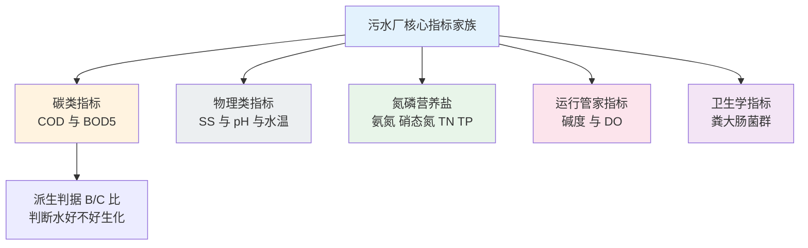
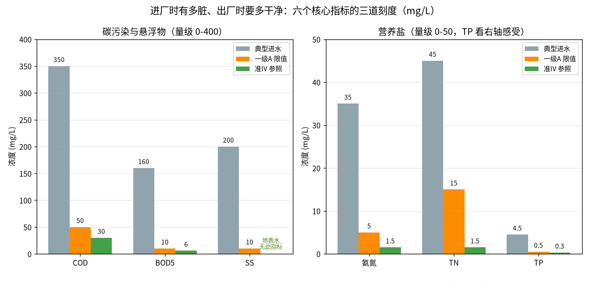

# 01-2 污水的体检报告：核心指标通俗讲义

> **本章讲什么**：污水厂每天看的"化验单"上，COD、BOD、氨氮、总磷……这些三字母缩写到底是什么意思？每个指标都讲透四件事：**生活类比、从哪来、超标会怎样、合格线是多少**。
>
> **读完你能回答**：进厂水有多脏、出厂水要多干净（具体数字）；为什么有的指标看浓度、有的指标看形态转换；B/C 比为什么是工艺工程师的"血常规"；在线仪表和人工化验什么区别。
>
> **阅读时间**：约 20 分钟。这一章的数字全篇都会反复引用，建议边读边记。

---

## 一、先把"化验单"读明白

人年年体检，是因为肝肾功能不正常自己感觉不到；污水厂也一样，**水脏不脏不能靠眼睛看**——看起来清的水，氨氮可能超标好几倍；发黑的水，COD 却未必多离谱。所以厂里有两个"检验科"：

- **化验室**：人工取样、按国标方法做分析，COD、氨氮、总磷的试剂法分析仪 **10~30 分钟出一个数**，结果权威但慢，一天通常做一两个批次；
- **在线仪表**：装在进水管、出水管和生物池上的探头与自动分析仪，DO、pH、ORP、流量是**秒级**连续数，COD/氨氮/总磷在线仪一般也是十几分钟到半小时一个数。

这些数据汇成厂长每天的"体检报告"，而报告里每个指标的**单位绝大多数是 mg/L**。

mg/L 是什么概念？**1 mg/L = 1 立方米水里含 1 克**（因为 1 m³ 水 = 1000 L，重约 1 吨）。所以看到进水 COD 350 mg/L，脑子里换算成"每吨这样的水含有 350 克可氧化杂物"就具体了。一座 10 万吨厂一天 350 mg/L 的 COD 总量 = 350 g/m³ × 100,000 m³ ÷ 1000 = **35,000 kg，即 35 吨脏东西**——这就是"负荷"的实感。

不同指标的"出数速度"天差地别，这张表先建立直觉（仪表选型在 [02-3](../02-加药系统篇/02-3-在线仪表-污水厂的传感器眼睛.md)）：

| 指标 | 常见测量手段 | 典型出数周期 | 数据脾气 |
|---|---|---|---|
| 流量、DO、pH、ORP | 电磁流量计、电极探头 | 秒级连续 | 快，但探头会脏会漂移，要定期校准 |
| 水温 | 热电阻探头 | 秒级连续 | 最皮实，几乎不坏 |
| COD、氨氮、总磷 | 在线自动分析仪（试剂法） | 10~30 min 一个值 | 准但慢，试剂要定期更换 |
| BOD5、B/C、碱度、粪大肠菌群 | 化验室人工分析 | 每天 1 次或数天 1 次，BOD 要等 5 天 | 权威但滞后，用于校准在线仪 |

理解了这张表，你就明白一个关键事实：**加药控制器永远拿不到"此刻的 COD"，拿到的是十几分钟前、甚至是昨天化验的值**。AI 预测要解决的，正是这个"时间差"。

下面按"碳类 → 物理类 → 氮磷 → 运行管家 → 卫生学"的顺序逐个讲。



---

## 二、碳类指标：水里的"口粮"有多少

这里的"碳"不是煤炭，而是**含碳的有机物**——剩饭、粪便、油脂、纸张，本质上都是微生物的"口粮"。

### 1. COD（化学需氧量）

- **生活类比**：假设往水里加强氧化剂（重铬酸钾），把所有能氧化的东西**强行烧一遍**，烧掉的东西折算成消耗了多少氧气，就是 COD。它像"大口袋"，好消化的、难啃的有机物全装进去。
- **从哪来**：粪便、食物残渣、油脂、洗涤剂，以及小厂排来的化工有机物。
- **超标危害**：排进河里就是"黑臭"的主因——微生物分解它们时把水里溶解氧耗尽，鱼虾窒息。
- **数字**：单位 mg/L；市政典型进水 **250~400 mg/L**（南方清水渗入多的城市偏低，北方缺水城市偏高）；一级 A 限值 **50**；准 IV 参照 **30**。

### 2. BOD5（五日生化需氧量）

- **生活类比**：同样是测"口粮"，但用的是**微生物的嘴**：取一瓶水样，接种活性污泥里的细菌，在 20 ℃ 暗处养 5 天，测它们吃掉有机物消耗了多少氧。BOD 装的是"细菌咬得动"的那部分。
- **从哪来**：粪便、食物等**可生物降解**的有机物，和 COD 来源高度重叠但范围小一圈。
- **超标危害**：和 COD 一样消耗水体溶解氧；但它在厂里是"有用的口粮"——生物脱氮除磷恰恰要吃它（后面碳源章节细讲）。
- **数字**：典型进水 **120~200 mg/L**；一级 A **10**；准 IV 参照 GB 3838 IV 类 **6**。

| 指标 | 类比角度 | 测的是什么 | 典型进水 mg/L | 一级 A | 准 IV 参照 |
|---|---|---|---|---|---|
| COD | 化学"大锅烩" | 所有可被强氧化剂氧化的有机物（含难降解部分） | 250~400 | 50 | 30 |
| BOD5 | 微生物"细嚼慢咽" | 5 天内细菌能吃掉的有机物 | 120~200 | 10 | 6 |

> 💡 **经验块：COD 和 BOD 不是两个对手，是"全集"和"子集"。** 同一份水永远 COD ≥ BOD5。化验员拿到数据先扫一眼这个关系：如果 BOD 比 COD 还高，数据必错，要么取样污染要么试剂过期——这种"逻辑错误"在 [05 篇数据治理](../05-数据篇/05-2-数据质量治理-脏数据的九种死法.md) 里叫值域规则报警。

---

#### 三、物理类指标：SS、pH、水温

### 1. SS（悬浮物，悬浮固体）

- **生活类比**：一杯浑水静置后杯底那层渣。用 0.45 μm 滤膜过滤水样，**滤膜截住、烘干称重**得到的就是 SS。
- **从哪来**：粪便残渣、泥砂、纸屑、微生物絮体碎片。
- **超标危害**：水浑、遮挡阳光影响河底植物；SS 还是污染物的"运输车"——磷、重金属、细菌都爱吸附在悬浮颗粒上，SS 高往往其他指标跟着超。
- **数字**：典型进水 **150~250 mg/L**；一级 A **10**；地表水环境质量标准里没有 SS 这项，所以准 IV 没有对应数值。

### 2. pH（酸碱度）

- **生活类比**：尝汤的咸淡。pH 就是水的"酸碱咸淡"，7 为中性，小于 7 酸、大于 7 碱。
- **从哪来**：生活污水本身偏中性（约 6.5~8.5）；异常高或低几乎都是工业排水闹的——酸洗废水、碱性清洗液。
- **超标危害**：pH 低于 6 或高于 9，活性污泥里的微生物"罢工"甚至大批死亡（污泥发白、发泡）；混凝加药也会失效。
- **数字**：**无量纲**；进水正常范围 6.5~8.5；一级 A 与准 IV 排放要求均为 **6~9**。

### 3. 水温

- **生活类比**：微生物的"室温"。活性污泥是一群活物，温度决定它们吃饭快慢。
- **从哪来**：季节气温与居民洗浴，正常进厂水温 **10~25 ℃**（北方冬季约 10~14 ℃，南方夏季可达 26~28 ℃）；异常高温多为工业温排水。
- **为什么关键**：硝化细菌（负责把氨氮转成硝态氮）特别怕冷——**水温低于 12 ℃ 时硝化速率明显下降**，所以标准规定水温 ≤ 12 ℃ 时氨氮限值放宽到 8 mg/L。冬季是北方厂每年的大考。

| 指标 | 单位 | 典型进水 | 一级 A | 准 IV 参照 | 现场最怕看到 |
|---|---|---|---|---|---|
| SS | mg/L | 150~250 | 10 | 无对应指标 | 二沉池跑泥、滤池翻板 |
| pH | 无量纲 | 6.5~8.5 | 6~9 | 6~9 | 半小时内突变 1 个单位以上 |
| 水温 | ℃ | 10~25（季节波动） | — | — | 冬季低于 12 ℃ 叠加高氨氮 |

---

## 四、氮家族：氨氮、硝态氮、总氮

氮在水里会"变身"，三种形态串在一条流水线上：

> 蛋白质、尿素（粪便里）→ 分解成 **氨氮** → 好氧区被硝化细菌氧化成 **硝态氮** → 缺氧区被反硝化细菌还原成 **氮气** 跑掉。

**总氮（TN）= 氨氮 + 硝态氮 + 亚硝酸盐氮 + 有机氮**，是全家的总账。

### 1. 氨氮（NH3-N，也写作 NH₃-N）

- **生活类比**：氮变身的"第一站"，也是对鱼毒性最大的一站。尿里的尿素一两天就水解成氨氮。
- **从哪来**：冲厕水（最大头）、食物垃圾、畜禽与食品加工废水。
- **超标危害**：氨氮在水里直接毒害鱼类；在生物池里被氧化时还要消耗约 **4.57 mg 氧 / mg 氨氮**，耗氧惊人；最终贡献富营养化。
- **数字**：典型进水 **25~40 mg/L**；一级 A **5**（水温 ≤ 12 ℃ 时 **8**）；准 IV **1.5**。

### 2. 硝态氮（NO3-N，硝酸根）

- **生活类比**：氨氮"烧过一遍"后的产物，对鱼毒性低，但它带着氮还没离开水。
- **从哪来**：进水里很少（典型 **0~2 mg/L**），主要是生物池硝化反应生成；出水 TN 超标常常就是硝态氮没被反硝化掉，二沉出水里残留 **5~15 mg/L** 很常见。
- **超标危害**：本身不黑臭，但计入 TN；作为饮用水源时硝态氮过高对婴儿健康有风险。
- **数字**：进水 0~2 mg/L；排放没有单独限值（包含在 TN 里考核）；它是判断"反硝化到底干没干活"的关键运行指标。

### 3. TN（总氮）

- **生活类比**：氮家族的"全家合影总人数"。
- **从哪来**：与氨氮同源，形态随工艺不断转换。
- **超标危害**：富营养化、水华的总开关之一；湖库、海湾对 TN 尤其敏感。
- **数字**：典型进水 **35~55 mg/L**；一级 A **15**；准 IV 常参照湖库 IV 类口径 **1.5**（仅部分地区环评批复采用，具体以当地标准为准）。

> ⚠️ **经验块：氨氮达标 ≠ 总氮达标。** 很多新手厂长出过这个糗：好氧区曝气很足，氨氮硝化得干干净净（氨氮 0.5），但缺氧区没碳源、反硝化进行不动，硝态氮攒到 14，TN 照样 15 以上超标。**脱氮要靠"好氧 + 缺氧"两段配合，还要有口粮（碳源）**，这是 [01-4](./01-4-生物处理-微生物打工仔的食堂与宿舍.md) 和碳源加药的重头戏。

---

## 五、磷家族：TP 与正磷酸盐

磷在污水里主要两副面孔：**颗粒磷**（吸附在 SS 上）和**溶解态的正磷酸盐**（PO₄-P，微生物和化学药剂都能直接利用它）。**TP（总磷）= 正磷酸盐 + 颗粒磷 + 其他有机磷**。

- **生活类比**：磷就是水里的"肥料精"。一把尿素撒进鱼缸，绿水三天就来——总磷对河湖做的就是这件事。
- **从哪来**：人体排泄物 + 洗涤剂（传统含磷洗衣粉，现已限制）+ 食物残渣。典型进水 TP **3~6 mg/L**，其中正磷酸盐约占 **60%~80%**（约 2~4 mg/L）。
- **超标危害**：磷往往是淡水湖库藻类生长的"短板营养"，TP 超 0.1 mg/L 量级就可能触发水华；所以提标对 TP 压得最狠。
- **数字**：一级 A **0.5 mg/L**；准 IV **0.3 mg/L**。正磷酸盐没有单独排放限值，但它是除磷加药最盯的形态——PAC、铁盐抓的就是它。

除磷有两条路线，后面会反复出现：**生物除磷**靠聚磷菌在厌氧区"释磷"、好氧区"过量吸磷"，最后随剩余污泥排出；**化学除磷**靠铝盐、铁盐与正磷酸盐反应生成沉淀。两条腿一起走才稳。

---

## 六、运行管家指标：碱度与 DO

这两个指标**不考核出水**，却是运行班长每天最关心的"内务数据"。

### 1. 碱度

- **生活类比**：水体的"抗酸缓冲垫"。硝化反应会产酸，碱度就是池子里和酸中和的储备。
- **从哪来**：生活污水里的碳酸盐、碳酸氢盐，典型进水碱度约 **200~350 mg/L**（以 CaCO₃ 计）。
- **为什么关键**：每氧化 1 mg/L 氨氮约消耗 **7.14 mg/L 碱度**。进水氨氮 35 全硝化要消耗约 250 mg/L，碱度不够时 pH 会一路掉到 6 以下，硝化崩盘；此时需要投加纯碱或乙酸钠之外的碱性物质补充——这是 [04 篇](../04-机理公式篇/04-2-生物脱氮除磷机理与碳源投加计算.md) 的内容。
- **经验判据**：好氧池出水剩余碱度宜保持在 80~100 mg/L 以上。

### 2. DO（溶解氧）

- **生活类比**：生物池水里溶着的氧气浓度，微生物的"呼吸气"。
- **数字与控制分区**：单位 mg/L。**好氧区 2~4 mg/L**（常见控制 2 上下）、**缺氧区约 0.2~0.5 mg/L**、**厌氧区 < 0.2 mg/L**。DO 是秒级在线探头数据，是曝气控制和节能的核心变量。
- **为什么关键**：好氧区 DO 太低，硝化不动、污泥发黑；DO 太高，曝气电费白烧、还可能把溶解氧带进缺氧区毁了反硝化。"恰到好处"的曝气本身就是最大的节能项之一。

| 管家指标 | 单位 | 典型区间 | 它在替谁盯梢 |
|---|---|---|---|
| 碱度 | mg/L，以 CaCO₃ 计 | 进水 200~350，好氧后宜余 80~100 以上 | 硝化会不会把 pH 拖垮 |
| DO 好氧区 | mg/L | 2~4 | 硝化与好氧吸磷 |
| DO 缺氧区 | mg/L | 0.2~0.5 | 反硝化脱氮 |
| DO 厌氧区 | mg/L | < 0.2 | 聚磷菌释磷 |

---

## 七、卫生学指标：粪大肠菌群

- **生活类比**：水里的"粪便指纹"。粪大肠菌群只大量生活在温血动物肠道里，检出它，就说明这水新近被粪便污染过，致病菌（霍乱、痢疾等）可能同行。
- **从哪来**：冲厕水，毫无悬念。
- **数字**：单位是**个/L**（或 MPN/L）；进水可达 **10⁷~10⁹ 个/L**，即每升水里有上千万到几十亿个；一级 A 要求 **≤ 10³ 个/L**；再生水回用要求更严（城市杂用水常要求 ≤ 3 个/L 量级）。
- **怎么降**：生化处理本身能去掉大部分，最后靠**消毒接触池**兜底——次氯酸钠（以有效氯计投加 1~5 mg/L）、二氧化氯、臭氧或紫外，接触时间不少于 30 分钟。

> 💡 **经验块：粪大肠菌群是"加氯量够不够"的验收单。** 同样的加氯量，出水氨氮高时氯会先和氨反应生成氯胺，杀菌效率下降，行话叫"折点加氯"现象。所以冬季氨氮波动时，消毒投加量也要跟着核算——消毒不是"拧开就完事"。

---

## 八、一张大表汇总：进水有多脏、出水要多净

下表把全部指标一次摆齐（均为生活污水为主的市政厂经验口径，**具体项目以实测为准**）：

| 指标 | 单位 | 生活类比一句话 | 典型进水区间 | GB 18918 一级 A | 准 IV 参照 |
|---|---|---|---|---|---|
| COD | mg/L | 强氧化剂能烧掉的全部杂物 | 250~400 | 50 | 30 |
| BOD5 | mg/L | 微生物 5 天吃得掉的口粮 | 120~200 | 10 | 6 |
| SS | mg/L | 滤膜截住烘干的渣 | 150~250 | 10 | 无对应指标 |
| 氨氮 | mg/L | 氮变身第一站，对鱼有毒 | 25~40 | 5，水温≤12℃ 时 8 | 1.5 |
| 硝态氮 | mg/L | 硝化后的半成品氮 | 0~2 | 计入 TN 考核 | 计入 TN |
| TN | mg/L | 氮全家总账 | 35~55 | 15 | 1.5，湖库口径 |
| TP | mg/L | 水里的肥料精 | 3~6 | 0.5 | 0.3 |
| 正磷酸盐 | mg/L | 除磷药剂直接抓的形态 | 2~4，占 TP 六到八成 | 计入 TP 考核 | 计入 TP |
| pH | 无量纲 | 水的酸碱咸淡 | 6.5~8.5 | 6~9 | 6~9 |
| 碱度 | mg/L，CaCO₃ 计 | 抗酸缓冲垫 | 200~350 | 不考核，过程控制 | 不考核 |
| 水温 | ℃ | 微生物的室温 | 10~25 | 无 | 无 |
| DO | mg/L | 水里的氧气 | 原水近 0，好氧池控 2~4 | 不考核，过程控制 | 不考核 |
| 粪大肠菌群 | 个/L | 粪便指纹 | 10⁷~10⁹ | ≤ 10³ | 按回用要求另定 |

把这张表画成图更直观（下图由脚本实算生成，因量级差异拆成左右两图）：



*数据为合成/典型参数实算。脚本输出：从典型进水到一级 A，COD 需去除约 85.7%、氨氮约 85.7%、TP 约 88.9%——**出厂水不是"干净一点"，而是要把绝大部分污染物拿掉**。*

---

## 九、B/C 比：判断水"好不好吃"的血常规

最后讲一个不是直接测量、而是算出来的重要判据：

```
B/C = BOD5 ÷ COD
```

- 含义：水里的有机物中，**微生物咬得动的比例**，行话叫**可生化性**；
- 判据（典型经验值）：
  - **B/C ≥ 0.45**：可生化性好，生活污水大多在这个区间；
  - **0.3 ~ 0.45**：可生化，常规活性污泥法能处理；
  - **0.25 ~ 0.3**：较差，需要调整工艺或水解酸化预处理；
  - **< 0.25**：难生化，大量工业难降解有机物在场，纯生物办法吃力，要考虑强化预处理或高级氧化。

算例：某厂进水 COD 350 mg/L、BOD5 160 mg/L，则 B/C = 160 ÷ 350 = **0.46**，典型生活污水、好生化；另一厂 COD 400、BOD5 80，B/C = 0.20，说明 COD 里大半是微生物啃不动的东西，要查工业来源。

> ⚠️ **经验块：B/C 还决定了"碳源账"。** 反硝化脱氮需要碳源作口粮，行话叫"碳氮比"，生活污水一般自带的 BOD 勉强够脱氮用；但南方清水厂、高氮工业占比高的厂，B/C 低、碳不够，TN 怎么都降不下来，只能**花钱买外加碳源**（乙酸钠、甲醇等）——这往往是全厂药剂费的最大头，[01-5](./01-5-加药点全景-全厂药剂家族图谱.md) 先认识它，[04-2](../04-机理公式篇/04-2-生物脱氮除磷机理与碳源投加计算.md) 再细算。

---

## 十、新手最容易搞混的五组关系

1. **COD 和 BOD5 谁大？** 同一份水样永远 COD ≥ BOD5，出现倒挂就是数据错了。
2. **TN 和氨氮、硝态氮什么关系？** TN 是总账，TN ≥ 氨氮 + 硝态氮 + 亚硝态氮；只把氨氮硝化掉，氮还以硝态氮留在水里，TN 没降。
3. **SS 和浊度是一回事吗？** 不是。SS 是 mg/L 的重量指标，浊度是光学散射指标（NTU），两者相关但不等同；在线浊度计常用来"实时猜"SS，但要用化验值标定。
4. **碱度高是不是 pH 就高？** 不一定。碱度是"缓冲能力的存量"，pH 是"当前的酸碱位置"——碱度像银行卡余额，pH 像账户当前状态，有钱（碱度）才能扛住硝化产酸的"扣款"。
5. **出水 DO 越高越好吗？** 不是。出水 DO 高说明曝气过量，电费白花，还会带着溶解氧干扰缺氧反硝化、加速二沉池内污泥内源呼吸导致翻泥。好的运行是"够用就好"。

> 💡 **经验块：老班长审数据先看"勾稽关系"。** 每天报表到手，先扫四件事：COD 是否 ≥ BOD；TN 是否 ≥ 氨氮 + 硝态氮；TP 是否 ≥ 正磷酸盐；去除率是否在合理区间。这四张"逻辑网"能逮住一半以上的化验或仪表错误。数据治理软件干的也是这件事，只是变成了自动规则。

---

## 本章小结

1. 污水厂靠"化验室 + 在线仪表"两双眼睛看病；浓度单位基本都是 mg/L，**浓度 × 水量 = 负荷**，负荷才是污染总量。
2. 碳类看 COD/BOD5：COD 是全集、BOD 是微生物能吃的子集；SS 是会"夹带"磷和细菌的运输车；pH 6~9 是微生物的活命区间。
3. 氮会变身：有机氮→氨氮→硝态氮→氮气；**氨氮达标不等于 TN 达标**，硝化靠好氧、反硝化靠缺氧加碳源。
4. TP 是提标压得最狠的指标（一级 A 0.5、准 IV 0.3），正磷酸盐是除磷药剂直接作用的形态；粪大肠菌群靠消毒兜底。
5. 碱度与 DO 是不考核出水、但决定工艺死活的管家指标；B/C ≥ 0.3 是可生化的经验门槛，B/C 低的厂往往要掏碳源钱。

---

**上一章**：[01-1 污水从哪来、到哪去：一座污水厂的一天](./01-1-污水从哪来到哪去-一座污水厂的一天.md)
**下一章**：[01-3 污水处理工艺全流程图解](./01-3-污水处理工艺全流程图解.md)
