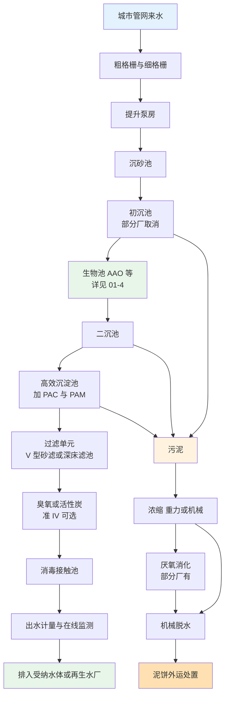
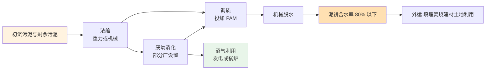
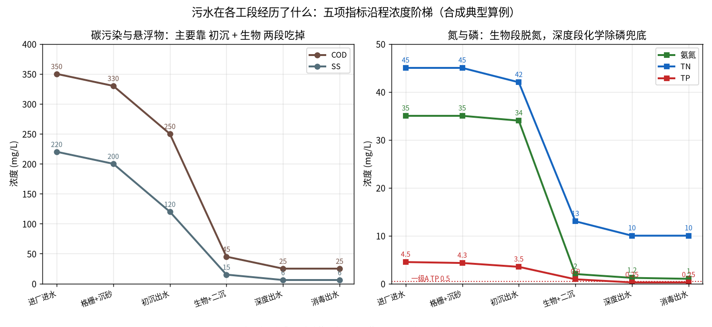

# 01-3 污水处理工艺全流程图解

> **本章讲什么**：把 [01-1](./01-1-污水从哪来到哪去-一座污水厂的一天.md) 那幅"一镜到底"的草图放大——水线每一段都讲清三件事：**它的作用是什么、典型设计参数是多少、没有它会怎样**；泥线也完整走一遍。
>
> **读完你能回答**：粗格栅和细格栅栅距差多少；沉砂池两大门派；初沉池、二沉池"表面负荷"是什么、取多少；高效沉淀池、V 型滤池、反硝化深床滤池各自干什么；污泥从 99.6% 含水率到装车外运经历了什么。
>
> **阅读时间**：约 22 分钟。这章是跑现场、看图纸、与工艺工程师对话的"识字课"。

---

## 一、先看全图：每段构筑物都在流水线的哪个位置



看这张图先建立一个总观念：**水流越往后，越干净，也越娇贵**。前段是"粗活"，拦渣沉砂；中段是"饭量活"，微生物吃大头；后段是"精细活"，加药过滤抠最后那零点几毫克。下面按顺序逐段拆。

---

## 二、进水头部：粗/细格栅 + 提升泵房

### 1. 粗格栅与细格栅

- **作用**：物理拦截。粗格栅先拦下木棍、毛巾、塑料袋这类大块头，保护水泵；细格栅再拦一遍菜叶、粪便渣、纸屑等细碎漂浮物，减轻后续设备缠绕。
- **典型参数（经验区间）**：
  - 粗格栅栅条间隙约 **20~100 mm**（工程常用 20~50 mm）；细格栅间隙约 **1.5~10 mm**（常用 3~6 mm）；
  - 栅前渠道流速约 **0.4~0.9 m/s**——太快栅渣被挤过，太慢砂在渠里沉积；
  - 清渣方式有回转式、钢丝绳牵引式，多数按栅前后液位差（比如差 0.1~0.3 m）自动启动。
- **没有它会怎样**：抹布、塑料袋缠死水泵叶轮；长纤维进入生物池缠绕曝气器；细格栅失效时，砂水分离器和污泥泵磨损明显加快。

### 2. 提升泵房

- **作用**：污水靠重力从全城流到厂前的最低点，水位不够自流穿完全厂，需要用泵把水"举高"一次（多数厂只在头部提升一次，之后全程重力）。
- **典型参数**：多采用潜水排污泵（潜污泵），配置一般为"大泵 + 小泵"组合应对日夜流量差，**单泵扬程常见 8~15 m**；集水池容积要保证水泵不频繁启停。
- **没有它会怎样**：水根本流不到后续高架的构筑物；泵配得不合理（只有大泵），夜间小流量时水泵频繁启停、耗能且伤设备。

> 💡 **经验块 1：格栅是全厂最脏的岗，也是判断管理水平的窗口。** 巡检时看三件事：栅渣是否及时清运（堆着发臭说明管理松）、栅前后液位差是否正常（液位差持续偏大说明栅条堵了）、细格栅格栅孔型是否与水质匹配（毛发纤维多的生活污水，内进流网板格栅比传统回转格栅好用）。

---

## 三、沉砂池：把"啃设备的砂"请出去

砂粒、煤渣、果核这些无机重颗粒沉得快，但它们没有污染，**要的是砂与有机悬浮物分离**——只沉砂、不沉泥。两大主流池型：

| 池型 | 工作原理 | 典型设计参数（经验区间） | 适用与特点 |
|---|---|---|---|
| 旋流沉砂池 | 切向进水让水旋转，离心力把砂甩向池中心砂斗 | 水力停留约 **20~30 s**，圆形池直径多为 3~7 m | 占地小、设备少，新建厂主流 |
| 曝气沉砂池 | 池侧鼓入空气，水流螺旋前进，砂被搓洗后沉下 | 停留 **2~5 min**，气水比约 **0.1~0.2 m³/m³** | 除砂同时撇油脂、预曝气，池容大 |

- **作用**：保护后续设备（砂磨损叶轮、管道、脱水机），防止砂在初沉池、生物池里占容积、磨管道。
- **没有它会怎样**：三个月就看出差别——泵叶轮磨出沟槽、管道弯头磨穿、污泥脱水机出泥含砂高、含水率下不来。
- 沉出的砂经砂水分离器卸出，含水率约 40%~60%，作为无机渣外运处置。

> ⚠️ **经验块 2：旋流沉砂池"跑砂"十有八九是水力条件问题。** 进水流量偏离设计区间时旋流强度不对，砂跟着水走；调流调不好的厂，可以在沉砂池后渠道底部摸一把，积砂明显就是跑砂了。

---

## 四、初沉池：第一次"慢下来沉淀"

- **作用**：水流进大池子突然减速，可沉的有机悬浮物（粪便渣、食物碎屑）靠重力沉到池底，由刮泥机刮入泥斗排出，称**初沉污泥**。
- **核心参数：表面负荷**。公式：

```
q = Q ÷ A
```

  - `q`：表面负荷（也叫溢流率），单位 m³/（m²·h）；
  - `Q`：进入池子的流量，m³/h；
  - `A`：池子的水面面积，m²。

  物理意义：可以理解为"每平方米水面每小时摊到多少方水"。沉速比 q 快的颗粒就能沉下去。

- **典型取值**：初沉池表面负荷 **1.5~3.0 m³/（m²·h）**（旱季常用 1.5~2.0，雨天峰值不超过 3.0）；水力停留时间 **1~2 h**；可去除 SS 约 **40%~55%**、BOD5 约 **20%~30%**。
- **没有它会怎样**：生物池要吃下全部悬浮物，池里"惰性灰分"比例升高、MLSS 看着高但有效微生物少；剩余污泥产量增大、曝气能耗上升。

> 💡 **经验块 3：现在不少新厂主动取消初沉池，不是因为它没用。** 初沉沉掉的悬浮物里有大量 BOD——那正是反硝化脱氮需要的"内碳源"。脱氮压力大、进水碳源又紧张的厂（南方很常见），宁愿让这些碳直接进生物池喂反硝化菌，也不愿它们变成初沉污泥。**取不取消，是在"减轻生物段负担"和"保住脱氮碳源"之间算账**，没有标准答案。

---

## 五、生物段：全厂的主餐厅（本章只报幕）

初沉出水（或不经初沉的沉砂出水）进入生物池，活性污泥微生物在这里完成三件大事：**好氧吃掉含碳有机物并把氨氮硝化、缺氧把硝态氮反硝化脱氮、厌氧/好氧交替配合聚磷菌除磷**。这是全厂最核心、最复杂、也最省钱/费钱的一段，参数和机理 [01-4](./01-4-生物处理-微生物打工仔的食堂与宿舍.md) 整章展开，这里只记住一句：**前面所有预处理，都是为了让这一池微生物吃得舒服**。

---

## 六、二沉池：微生物"下班集合"

- **作用**：生物池混合液（水 + 活性污泥絮体）进二沉池，絮体沉降、清水从池面溢流堰排出，称**二沉出水**；沉到池底的浓缩污泥分两股：
  - **回流污泥（RAS）**：占进水流量约 **50%~100%**，泵回生物池进水端——微生物要循环上班；
  - **剩余污泥（WAS）**：增殖出来的多余微生物，小股连续排出，去泥线。
- **典型参数**：表面负荷 **0.6~1.5 m³/（m²·h）**（常用 0.8~1.2，比初沉低，因为污泥絮体轻、沉得慢）；水力停留 **2~4 h**；按固体面积负荷校核常见 **100~150 kg/（m²·d）** 量级；池型多为周进周出或中进周出圆形辐流池，也有矩形平流池。
- **没有它会怎样**：活性污泥随水跑掉，出水 SS 立刻飙到 30~100 mg/L，后面的滤池迅速堵死；跑掉的不只是泥，还有"吃污染物的工人"，生物池 MLSS 几天就垮。

> ⚠️ **经验块 4：二沉池是运行好坏的"照妖镜"。** 池面看到细碎漂泥常是污泥老化；看到大块棕黄色浮泥伴恶臭，可能是反硝化在二沉池里提前发生（硝态氮 + 污泥停留太久 → 氮气托泥上浮）；看到成缕污泥被堰板带走，先查回流比和表面负荷，再查是不是污泥膨胀（[01-4](./01-4-生物处理-微生物打工仔的食堂与宿舍.md) 讲）。

---

## 七、深度处理：抠掉最后零点几毫克的精细活

二沉出水一般 COD 40~50、SS 10~20、TP 0.8~1.5 的量级，距离稳定一级 A、尤其准 IV 还差一截，差距靠深度处理补。这一段是**加药管控的主战场**，先认识设备，加药机理在 [04 篇](../04-机理公式篇/04-1-化学除磷机理与投加量计算.md)。

### 1. 高效沉淀池（加药混凝 + 强化沉淀一体）

水依次经过：**快速混合室（投加 PAC/PFS 等混凝剂，秒级混合）→ 絮凝室（投加 PAM 助长矾花，部分工艺回流沉淀池污泥作"晶核"）→ 斜管/斜板沉淀区**。

- 典型表面负荷可达 **10~20 m³/（m²·h）**，是普通初沉池的近 10 倍，所以叫"高效"，占地小；
- 除磷靠铝/铁与磷酸根生成沉淀物，混凝同时网捕 SS；
- 没有它：化学除磷没地方反应沉降，TP 在 0.5 上下反复"压线"，提标无望。

### 2. 过滤单元

| 滤池类型 | 构造一句话 | 典型滤速与参数 | 主要功能 |
|---|---|---|---|
| V 型砂滤池 | 均质粗石英砂厚约 1.0~1.2 m，两侧 V 型槽进水，气水联合反冲洗 | 滤速 **6~10 m/h**（V 型滤池常取 8~12），过滤周期 24~48 h | 把关 SS，出水 SS 可到 5~10 |
| 反硝化深床滤池 | 深床粗粒石英砂/陶粒上挂反硝化菌膜，投加外碳源 | 滤速 **5~8 m/h**，一池兼顾过滤与脱氮 | SS、TN、TP 三项协同，提标常用 |

- **没有过滤会怎样**：高效沉淀池偶尔跑矾花时出水 SS 失控，TP 随颗粒磷反弹；粪大肠菌群消毒也因为颗粒包藏病菌而杀菌不彻底。
- 滤池反冲洗废水（约占处理量 3%~8%）回到厂前端重新处理——**它是一股周期性"回流水冲击"**，排得猛时会把进水浓度打低、水量打高。

### 3. 臭氧 / 活性炭（准 IV 级别的可选深度单元）

- 当出水 COD 卡在 30~40、且残余的是生物啃不动的难降解有机物时，可上**臭氧氧化**（把大分子打碎成小分子，臭氧投加量经验约为去除 COD 量的 1~3 倍质量比），或**活性炭吸附/臭氧-生物活性炭（O3-BAC）**；
- 造价、电耗高，市政厂只在准 IV/准 III 提标或回用项目里常见；没有它不影响一级 A，但 COD 很难稳定 ≤30。

---

## 八、消毒接触池与出水计量：出厂前最后两道关

### 1. 消毒接触池

- **作用**：保证消毒剂与水充分接触杀菌。投加商品次氯酸钠时以**有效氯计约 1~5 mg/L**（商品液有效氯约 10%），**接触时间 ≥ 30 min**；规范上用"CT 值"（浓度 × 接触时间）衡量消毒剂量是否够。
- **没有它会怎样**：粪大肠菌群超标，属于公共卫生红线指标；但乱加也不行——余氯排河会杀河里的鱼，所以加氯量与脱氯（必要时）要联动。

### 2. 出水计量与在线监测房

- 出水先过**明渠流量计**（巴氏计量槽或超声波明渠流量计），再经过装有 COD、氨氮、总磷、总氮在线仪的**监测站房**，数据实时联网生态环境部门平台；
- 这是法定的"出厂秤"和"监控摄像头"：**环保考核、按排污量收费、超标报警都认这里的数据**。站房仪表的运维比对（与化验室盲样比对）是厂长每月的硬任务。

### 3. 超越管与事故应急：不是所有水都永远走主线

流程图之外，每个厂还埋着两条"非主流管线"，跑现场一定要知道：

- **超越管（旁路）**：进水水量暴增（暴雨）或某段构筑物大修时，水可经超越管跳过敏感工段。注意：**现代环保要求下，未经处理的水严禁直接超越出厂**，允许超越的通常只是"跳过初沉保生物池"这类厂内调度，且必须报备；
- **事故调节池**：很多厂在进水端设事故池，发现 pH 异常、颜色异常、有毒来水时，先把这股"毒水"截到事故池暂存，再小流量回掺处理，避免一池活性污泥被"团灭"。

这两条管线平时不用，用时就是救命——加药 AI 系统的安全联锁逻辑也要认识它们，[08-3](../08-落地实施篇/08-3-安全联锁与人工接管.md) 会讲到。

---

## 九、泥线：污水里的污染物最后都在泥里

污水里去掉的污染物没有消失，而是被"打包"进了污泥。各段排出的污泥含水率极高（初沉污泥约 95%~97%、剩余活性污泥约 99.2%~99.6%——看起来就是黑褐色的水），必须减容、稳定、脱水后才能外运。



各环节典型情况：

| 环节 | 常见做法 | 典型参数（经验区间） | 不做会怎样 |
|---|---|---|---|
| 浓缩 | 重力浓缩池或机械浓缩（转鼓、离心、带式） | 重力浓缩停留 12~24 h，含水率降到约 96%~97%；机械浓缩可到 94%~96% | 污泥太稀，后续消化池和脱水机被水撑爆，药耗飙升 |
| 厌氧消化 | 密闭池中温厌氧发酵 | 温度 33~35 ℃，停留 20~30 d，可降解约 35%~45% 的有机物，每降解 1 kg VSS 约产沼气 0.8~1.0 m³，甲烷约占六成 | 污泥不稳定、恶臭、易腐化；有条件的厂则损失了沼气能源 |
| 调质脱水 | 投加 PAM 让细小颗粒絮凝 | PAM 配制 0.1%~0.3%、熟化 30~60 min；脱水投加约 3~8 kg/t 绝干污泥 | 泥稀得抓不起来，脱水机跑泥、滤布堵塞 |
| 机械脱水 | 带式压滤、离心脱水为主，板框压滤可深度脱水 | 带式/离心出泥含水率约 78%~82%；板框加石灰/铁盐调质可到 60%~65% | 泥饼含水率不达标（多数地区要求 ≤80%）无法外运或处置费大增 |
| 外运处置 | 填埋、焚烧、协同处置、建材或土地利用 | 处置费各地约 200~500 元/吨，差异很大 | 污泥乱堆相当于污染搬家，雨季渗滤液重回水体 |

> ⚠️ **经验块 5：污泥是污水厂的"第二成本中心"。** 深度处理化学除磷加的铝盐、铁盐，最终全部变成"化学污泥"摊到泥饼里——**加药越猛，泥越多，脱水药耗和处置费越高**。一座 10 万吨厂一天绝干污泥量动辄十几到几十吨，AI 加药算总账时必须把"多产的泥值多少钱"一起算，这本账在 [03 篇](../03-问题与成本篇/03-2-污水厂成本账本-药剂到底花了多少钱.md) 展开。

---

## 十、沿程浓度：每段到底拿走了多少

把上述流程跑成一组典型设计数据，五项指标的沿程变化如下（脚本实算生成）：



*数据为合成/典型参数实算。脚本输出的全厂总去除率：COD 92.9%、SS 97.3%、氨氮 97.1%、TN 77.8%、TP 94.4%。分级贡献上，COD 主要由初沉（28.6%）与生物段（58.6%）拿走；氨氮几乎全靠生物段（91.4%）；深度段对 TP 的兜底贡献最显眼。*

最后把全章参数收成一张速查表：

| 工段 | 关键设计参数 | 典型经验区间 | 主要去除/承担对象 |
|---|---|---|---|
| 粗/细格栅 | 栅条间隙 | 粗 20~100 mm，细 1.5~10 mm | 大块与漂浮渣物 |
| 提升泵房 | 扬程 | 8~15 m | 抬升水位 |
| 沉砂池 | 停留时间 | 旋流 20~30 s；曝气 2~5 min | 砂粒无机颗粒 |
| 初沉池 | 表面负荷 / 停留 | 1.5~3.0 m³/（m²·h）/ 1~2 h | SS 40%~55%，BOD 20%~30% |
| 生物池 | 水力停留 | 8~16 h | 碳、氮、磷的大头 |
| 二沉池 | 表面负荷 / 回流比 | 0.6~1.5 m³/（m²·h）/ RAS 50%~100% | 泥水分离 |
| 高效沉淀池 | 表面负荷 | 10~20 m³/（m²·h） | 化学除磷、深度去 SS |
| V 型/深床滤池 | 滤速 | 6~10 / 5~8 m/h | SS 把关，深床兼顾脱氮 |
| 消毒接触池 | 有效氯 / 接触时间 | 1~5 mg/L / ≥ 30 min | 粪大肠菌群 |
| 污泥脱水 | 泥饼含水率 | ≤ 80%，板框可至 60%~65% | 污泥减量化 |

---

## 十一、跑现场速查：看到现象先怀疑哪一段

| 你在现场看到的现象 | 优先怀疑的工段与原因 |
|---|---|
| 进水口挂着成片塑料袋、格栅前水位壅高 | 粗/细格栅清渣机构故障或栅距选型不当 |
| 沉砂池出口渠道底部积砂、水泵叶轮磨蚀 | 沉砂池跑砂，查旋流强度或曝气量 |
| 二沉池漂着松散细碎泥花，出水 SS 偏高 | 污泥老化、过曝气；查 SRT 与好氧末端 DO |
| 二沉池浮大块泥、下有气泡往上顶 | 二沉池内反硝化，查进水硝态氮与污泥停留时间 |
| 高效沉淀池液面飘矾花、滤池 1~2 天就堵 | PAM 投加过量或熟化不够，矾花松散不沉 |
| 砂滤池出水 TP 周期性反弹 | 反冲洗后初滤水未排或滤料板结，查反冲周期 |
| 脱水机出泥薄而稀、PAM 用量猛增 | 污泥含砂高或有机质变化；先查沉砂与浓缩效果 |

---

## 本章小结

1. 水线按"粗活→饭量活→精细活"排：格栅/泵房/沉砂护设备，初沉去可沉物，生物段吃污染物大头，二沉泥水分离，深度处理抠 TP/SS/TN，消毒把卫生关，计量站是法定出厂口。
2. 沉淀池的核心参数是**表面负荷 Q/A**：初沉 1.5~3.0、二沉 0.6~1.5、高效沉淀池 10~20 m³/（m²·h），量级差异反映絮体沉降快慢。
3. 深度处理是加药主战场：混凝剂在高效沉淀池除磷，PAM 助凝，深床滤池投碳源可兼顾脱氮，臭氧活性炭应对难降解 COD。
4. 泥线 = 浓缩 → 消化（可选）→ 调质脱水 → 外运；化学除磷加的药最终全变成化学污泥，加药必须连污泥账一起算。
5. 典型全流程总去除率 COD 约 93%、SS 约 97%、氨氮约 97%、TN 约 78%、TP 约 94%；每段都不可被"跳关"。

---

**上一章**：[01-2 污水的体检报告：核心指标通俗讲义](./01-2-污水的体检报告-核心指标通俗讲义.md)
**下一章**：[01-4 生物处理：微生物打工仔的食堂与宿舍](./01-4-生物处理-微生物打工仔的食堂与宿舍.md)
