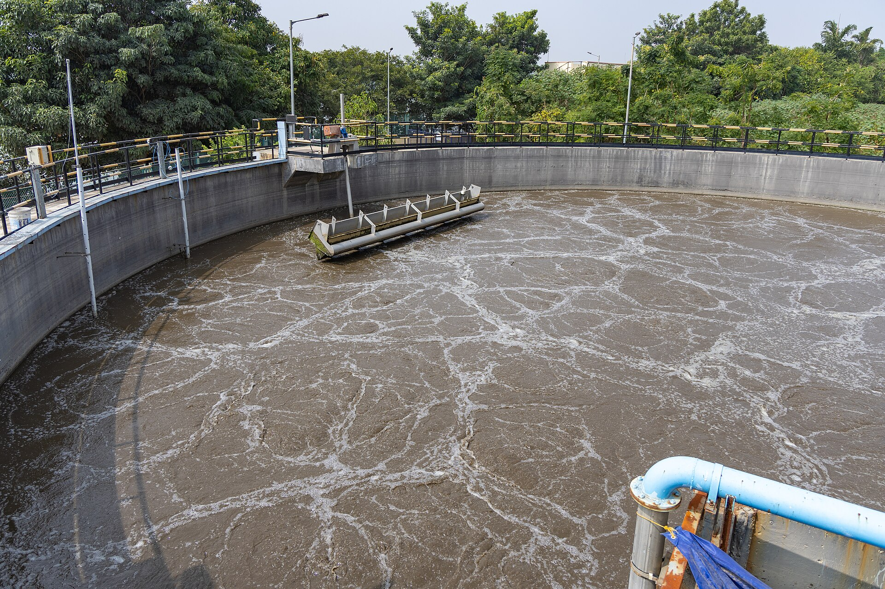
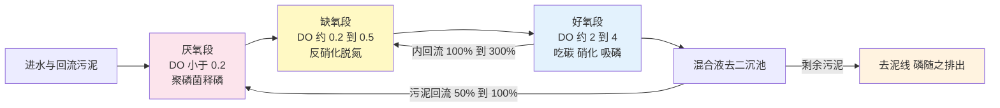
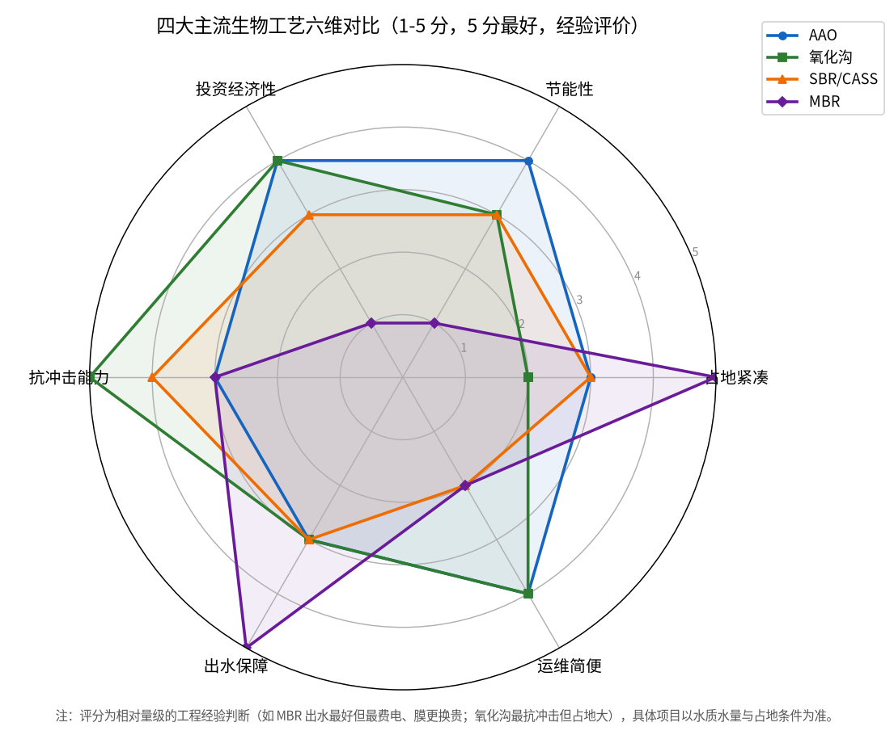

# 01-4 生物处理：微生物打工仔的食堂与宿舍

> **本章讲什么**：污水厂最大、最核心、最像"生命体"的一段——活性污泥生物池。把它想成一座包吃包住的工厂：**微生物是打工仔，污染物是口粮，曝气是供氧的空调，污泥回流是上下班班车，泥龄是用工制度**。
>
> **读完你能回答**：活性污泥到底是什么；MLSS、F/M、SRT、SV30/SVI 这些天天挂在班长嘴边的数代表什么；好氧/缺氧/厌氧三区分别在干什么；AAO、氧化沟、SBR/CASS、MBR 四大工艺怎么选；鼓风曝气和表曝、污泥回流与混合液回流、污泥膨胀与泡沫是怎么回事。
>
> **阅读时间**：约 24 分钟。本章是理解后面所有加药与控制逻辑的"机理底座"。

---

## 一、活性污泥法的本质：请一群微生物来吃饭

把一捧好的活性污泥放在白磁盘里：它是**黄褐色、棉絮状、带着土腥味**的绒团，像融化的红糖浆。放大几百倍看，每一簇絮体（行话叫**菌胶团**）都是一座微型城市——细菌、原生动物、轮虫挤在一起，外面裹着它们分泌的胶质。

活性污泥法干的事，一句话：

> **给这些微生物喂污水、吹氧气，让它们把水里的有机物、氨氮、磷"吃"进自己身体里、或变成氮气放走，再让吃饱长大的微生物絮体沉淀下来，水就干净了。**

所以生物池是"食堂"，二沉池是"宿舍熄灯后的集合点"，回流污泥泵是"班车"——把沉淀下来的打工仔重新拉回食堂门口，迎接新一批进厂的污水。微生物是活的：水温低了吃不动，pH 酸了会罢工，吃太多少运动会"肥胖"（污泥老化松散），吃太多会"过劳"（污泥负荷过高、出水恶化）。**运行一座污水厂，本质上是伺候好这亿万吃货。**

先看一眼它们"上班"的地方：



*真实照片：印度班加罗尔某市政污水厂活性污泥曝气池，褐色混合液表面可见剧烈曝气形成的翻涌与泡沫纹路。图片来源：Wikimedia Commons，作者 Vraj Acharya / WELL Labs，CC BY-SA 4.0。*

---

## 二、伺候这群打工人：五个必懂的运行指标

### 1. MLSS（混合液悬浮固体）——池里养了多少工人

- 含义：生物池混合液里悬浮物的浓度，主要就是活性污泥微生物量，单位 mg/L。
- **典型经验值：2000~4500 mg/L**（AAO 好氧段常见 3000~4000）；MBR 工艺因膜截流可维持 **6000~10000 mg/L**。
- 怎么看：MLSS 太低，劳动力不足，污染物吃不完；太高，泥多水"稠"，曝气供氧跟不上、二沉池沉不下去、还费电费药。它不是越高越好。

### 2. F/M（污泥负荷）——每公斤工人每天喂多少口粮

公式：

```
F/M = Q × S0 ÷ (V × X)
```

- `F/M`：污泥负荷，单位 kg BOD5/（kg MLSS·d）；
- `Q × S0`：每天进厂的 BOD5 总量，kg/d（Q 用 m³/d、S0 用 mg/L 时要除以 1000）；
- `V × X`：生物池里的污泥总量，kg（V 为池容 m³，X 为 MLSS，kg/m³）。

**典型经验值**：常规活性污泥法约 **0.2~0.4**；要求稳定硝化脱氮时压低到 **0.05~0.15**——硝化细菌长得慢，必须让工人"半饥不饱、慢慢干活、住得久"。

完整算例：10 万吨厂，进水 BOD5 160 mg/L，生物池容 V = 40,000 m³，MLSS = 3500 mg/L（= 3.5 kg/m³）：

1. 日 BOD 总量 = 100,000 × 160 ÷ 1000 = 16,000 kg/d；
2. 池内污泥量 = 40,000 × 3.5 = 140,000 kg；
3. F/M = 16,000 ÷ 140,000 = **0.114 kg BOD5/（kg MLSS·d）**——典型的低负荷硝化工况。

### 3. SRT（污泥龄/泥龄）——工人平均在厂里住多久

- 含义：污泥在整个生物系统中的平均停留时间，等于系统内污泥总量 ÷ 每天排出的剩余污泥量，单位天。
- 典型经验值：只去碳的工艺 4~8 d 即可；**要保证冬天硝化，泥龄常需 12~20 d 以上，AAO 多控制在 15~25 d**；MBR 甚至更长。
- 泥龄太短：世代慢的硝化细菌没来得及繁衍就被排走，氨氮崩盘；泥龄太长：工人老龄化、絮体松散易漂、产泥量虽小但出水变差。
- 算例：系统污泥 140,000 kg，每天排剩余污泥折合 7,000 kg，则 SRT = 140,000 ÷ 7,000 = **20 d**。

### 4. DO（溶解氧）——供氧量

[01-2](./01-2-污水的体检报告-核心指标通俗讲义.md) 已讲过，这里记控制口径：**好氧段 2~4 mg/L（多数厂控 2 上下）、缺氧段 0.2~0.5、厌氧段 < 0.2**。DO 靠调节鼓风机风量控制，是全厂最大的电耗闸门。

### 5. SV30 与 SVI——工人集合快不快

- **SV30（污泥沉降比）**：取 1000 mL 混合液在量筒里静置 30 分钟，读出沉降污泥占的体积百分比。正常约 **20%~30%**，生活污水厂经验区间 15%~35%。
- **SVI（污泥体积指数）**：换算成"每克干污泥沉降后占多少毫升"，公式：

```
SVI = SV30 读数（mL/L） ÷ MLSS（g/L）
```

- 典型经验值：**SVI 约 80~150 mL/g** 时沉降性能良好；超过 150 要警惕，持续超过 200 基本可判定**污泥膨胀**。
- 算例：SV30 = 25%（即 250 mL/L），MLSS = 3000 mg/L（= 3.0 g/L），则 SVI = 250 ÷ 3.0 = **83 mL/g**，沉降性能良好。

| 指标 | 一句话角色 | 典型经验区间 | 异常时的直观后果 |
|---|---|---|---|
| MLSS | 工人数量 | 2000~4500 mg/L，MBR 6000~10000 | 低了出水差，高了沉不下去 |
| F/M | 伙食丰俭 | 硝化工况 0.05~0.15，常规 0.2~0.4 | 高了污泥散、出水浑；低了老化 |
| SRT | 用工年限 | 硝化工艺 12~25 d | 短了氨氮崩，长了泥老化漂泥 |
| DO | 氧气供应 | 好氧 2~4，缺氧 0.2~0.5，厌氧 <0.2 | 高了费电毁脱氮，低了硝化不动 |
| SV30/SVI | 集合速度 | SV30 约 20%~30%；SVI 80~150 mL/g | SVI 超 200 即膨胀，二沉跑泥 |

> 💡 **经验块 1：化验数据要连起来看。** MLSS 高 + F/M 低 + SVI 高，常常是"泥养太多又没饭吃"，丝状菌趁机膨胀；MLSS 低 + F/M 高 + DO 低，则是"工人不够、氧气不够、活儿干不完"。任何单指标都没有意义，五个数是一张联动网。

---

## 三、池子为什么要分三段：好氧、缺氧、厌氧

很多小白以为"曝气池就是一锅冒泡的水"，其实脱氮除磷工艺把池子用隔墙分成了**厌氧、缺氧、好氧**三个区段（AAO 就是三个字的缩写：Anaerobic-Anoxic-Oxic），三段住着不同"工种"，干三件不同的化学活：



三段里发生的事，用"打工人视角"翻译：

| 区段 | DO 控制 | 住着谁、发生什么 | 必要条件 |
|---|---|---|---|
| 厌氧段 | < 0.2 mg/L，且不能有硝态氮 | **聚磷菌"释磷"**：被迫吐出体内磷酸盐和水（看起来像破财消灾） | 没有氧气、没有硝态氮，才有选择压力 |
| 缺氧段 | 0.2~0.5 mg/L，无游离氧但有硝态氮 | **反硝化菌"脱氮"**：拿硝态氮里的氧呼吸，把 NO3-N 还原成 N2 氮气跑掉 | 必须有硝态氮 + 碳源口粮 |
| 好氧段 | 2~4 mg/L | 三件事：异养菌**吃碳**去 BOD；硝化菌把氨氮**硝化**成硝态氮；聚磷菌**过量吸磷**补回体内 | 充足 DO，硝化菌怕冷怕酸 |

两条"班车线"务必分清：

- **污泥回流（外回流，RAS）**：二沉池底泥 → 生物池进水端/厌氧段，回流量约为进水流量的 **50%~100%**，作用是把工人接回来；
- **混合液回流（内回流）**：好氧段末端硝化好的水 → 缺氧段，回流比约 **100%~300%**，作用是把硝态氮"送货"给缺氧段去反硝化。内回流太大带氧毁缺氧、太小硝态氮送不过去，TN 降不下来。

除磷的"包袱"最终靠**排剩余污泥**抖掉——聚磷菌吸进体内的磷随剩余污泥离开系统，这就是生物除磷。如果生物除磷不够（TP 要到 0.3 这种准 IV 要求时常不够），就在深度处理投铝盐铁盐化学除磷补台。

> ⚠️ **经验块 2：脱氮和除磷在抢同一碗饭。** 反硝化要碳源，聚磷菌厌氧释磷也要挥发性有机酸；进水 BOD 不足（B/C 低、南方清水厂）时，两拨工人互相抢口粮，TN、TP 必有一个难看。这就是为什么外加碳源成为大开销、为什么"取消初沉池保碳源"成为常见设计取舍。

---

## 四、四大主流工艺：AAO、氧化沟、SBR/CASS、MBR

### 1. AAO（厌氧-缺氧-好氧法）

- **构造与运行**：三个池段串联推流，水按顺序流过厌氧、缺氧、好氧，配内、外回流；结构最简单清晰，是大中城市厂最常见的"标准款"。
- **特点**：脱氮除磷功能齐全、运行经验成熟、能耗中等、自控要求中等；占地偏大，脱氮除磷存在碳源竞争，低温硝化需保泥龄。
- **适用**：10 万吨级甚至更大的市政厂主力工艺。

### 2. 氧化沟

- **构造与运行**：首尾相接的环形沟道，水在沟里循环流动，转刷、转碟或倒伞表曝机一边充氧一边推流；沟道内天然形成好氧区和缺氧区，延时曝气、泥龄长。
- **特点**：环沟水有巨大的"缓冲水库"效应，**抗水量水质冲击能力最强**，污泥产量少且稳定；但池容大、占地大，传统表曝能耗偏高（新的改良型有改善）。
- **适用**：中小城市、县级厂，进水波动大、运维力量弱的地方很喜欢。

### 3. SBR / CASS（序批式活性污泥法）

- **构造与运行**：不分池、不分流，**一个池子按时间顺序完成五个动作：进水 → 曝气反应 → 静止沉淀 → 滗水排水 → 待机**，像食堂按点开饭而不是流水线。CASS 是 SBR 的改良型（池前段设预反应区）。
- **特点**：不需要二沉池和污泥回流，省地；沉淀时静止进水干扰小；但完全依赖自动阀门、滗水器和时序程序，**自控依赖度最高**，设备动作频繁、维护要求高；多池并联才能连续处理。
- **适用**：中小规模、场地紧张、水量间歇（如工业区、旅游区）的场合。

### 4. MBR（膜生物反应器）

- **构造与运行**：用浸没在生物池里的中空纤维/平板膜组件**代替二沉池**，泥水靠膜丝孔（孔径约 0.01~0.4 μm 量级）强制分离；池内 MLSS 可高达 6000~10000 mg/L。
- **特点**：出水水质最好（SS 可 < 5，几乎无絮体流失）、**占地最省**、自动化程度高；代价是：膜擦洗风量大、**全厂电耗最高**，膜组件 5~8 年要换、投资与运维最贵，膜污染是日常管理主题。
- **适用**：用地紧张的城市中心、高标准出水或再生水回用项目。

| 对比维度 | AAO | 氧化沟 | SBR/CASS | MBR |
|---|---|---|---|---|
| 池型与运行 | 三段串联推流 | 环形循环延时曝气 | 单池时序周期运行 | 生物池加膜分离 |
| 是否需二沉池 | 要 | 要 | 不要 | 不要，膜代替 |
| 占地紧凑度 | 中 | 大 | 中偏小 | 最小 |
| 能耗水平 | 中 | 中偏高 | 中 | 最高（膜擦洗） |
| 自控依赖 | 中 | 低到中 | 高（阀门时序） | 高（膜运行） |
| 抗冲击能力 | 中 | 最强 | 较强 | 中 |
| 出水水质 | 达标稳定 | 达标稳定 | 较好 | 最好 |
| 投资与维护 | 省、成熟 | 省、皮实 | 中 | 投资高、膜更换贵 |
| 典型适用规模 | 大中型 | 中小型为主 | 中小型 | 高标准/紧张用地 |

把这些定性判断打成 1~5 的相对评分（5 分最好，仅用于建立直觉）：



*数据为合成/典型参数实算：图中六维分别是占地紧凑、节能性、投资经济性、抗冲击能力、出水保障、运维简便。脚本输出的合计分 AAO 21、氧化沟 21、SBR/CASS 18、MBR 17——**总分接近恰恰说明没有万能工艺，选型是看约束条件做权衡，不是比谁先进**。*

> 💡 **经验块 3：业主常问"要不要一步到位上 MBR"。** 回答顺序永远是：先看排放标准（一级 A 多数 AAO + 深度处理就够）、再看地（占地不够才被迫 MBR）、再看钱（膜更换费要按全生命周期算）、最后看运维力量（没人会洗膜，再好的膜两年就废）。技术选型不是买顶配手机。

---

## 五、曝气方式与两套回流：设备视角的常识

### 1. 鼓风曝气 vs 表面曝气

- **鼓风曝气**：鼓风机房（罗茨或多级/单级离心鼓风机）把空气压进池底主管、支管，再从**微孔曝气盘/曝气管**（橡胶膜微孔）以细气泡冒出。气泡越细、气液接触面越大、氧转移效率越高（经验约 15%~30%）。AAO、MBR 的主流选择，鼓风机是全厂头号电耗设备（常占全厂电耗 50%~70%）。
- **表面曝气**：转刷、转碟、倒伞叶轮在水面打水，把空气卷进水里。设备简单、维护直观、还能兼推流，氧化沟的标志；氧利用率一般低于微孔鼓风，水花飞溅、热量损失大。

曝气的精确调节（DO 前馈-反馈、风量按需分配）是节能最大的富矿之一，与加药控制共用一套数据底座，[07 篇](../07-控制优化篇/07-2-前馈加反馈控制器设计实例.md) 会涉及。

### 2. 回流系统再强调

- 外回流（污泥回流）**50%~100%**：保生物池工人数量，回流比太高二沉池底流被搅、太低 MLSS 掉；
- 内回流（混合液回流）**100%~300%**：保缺氧段硝态氮供应，回流比要兼顾"送得到"和"别带氧"。

---

## 六、污泥膨胀与泡沫：运行员的两大"皮肤病"

### 1. 污泥膨胀

正常菌胶团结实密实；**丝状菌膨胀**时，大量丝状细菌像头发丝一样从絮体里伸出，絮体又松又轻，SVI 持续 > 150~200，二沉池沉不下去、出水带泥。常见诱因：长期低负荷、DO 不足、缺营养（C/N/P 失衡）、进水含大量易降解糖类。处置思路：调 F/M、补营养、投加次氯酸钠或絮凝剂应急（治标），根本上还是恢复工况。另有"黏性膨胀"（污泥裹水像果冻），多为高负荷/缺氮引起。

### 2. 泡沫三兄弟

| 泡沫长相 | 多发生在 | 常见原因 | 处置方向 |
|---|---|---|---|
| 白色轻泡、一吹就散 | 启动期、高洗涤剂进水 | 表面活性剂或污泥未成熟 | 等待驯化，必要时喷淋消泡 |
| 棕褐色黏稠泡沫、能堆起几厘米 | 高泥龄老系统 | 诺卡氏菌等放线菌增殖，常伴油脂进水 | 控泥龄、撇渣、隔油脂 |
| 玻璃态发亮薄泡 | 高负荷或反硝化异常 | 工况波动信号 | 查 F/M 与缺氧区状态 |

> ⚠️ **经验块 4：消泡剂只能救急，不能当饭吃。** 化学消泡剂会伤害菌胶团、还会挂在仪表探头和膜丝上造成测量失真；泡沫是"症状"，先查泥龄、负荷、油脂源头。投加任何药剂前先想它对生物系统的副作用——**这也是加药管控思维方式的起点**。

---

## 七、显微镜里的健康仪表盘：指示生物

老班长每天除了看仪表盘，还会端一杯混合液去显微镜前看 3 分钟。活性污泥里除了细菌，还住着一批"挑嘴的房客"——它们对环境敏感，谁出现、谁消失，就是系统健康的仪表盘：

| 在显微镜下看到 | 说明系统处在什么状态 |
|---|---|
| 大量鞭毛虫、变形虫 | 污泥年轻、负荷偏高或刚启动，处理效果还不稳 |
| 成群游泳型纤毛虫（如草履虫） | 系统恢复中，有机物还较多 |
| 钟虫、累枝虫等固着型纤毛虫多且活跃 | 菌胶团成熟、DO 合适、出水好的标志 |
| 轮虫慢悠悠出现 | 水很干净、泥龄偏长；大量出现提示该多排泥 |
| 丝状菌伸出絮体外、像铁丝网 | 丝状菌膨胀预警，回看 SVI 与 F/M |

这不是玄学，是几十年现场攒下的"生物预警"：等仪表趋势确认时往往已晚半天，显微镜能提前闻到味道。

---

## 八、一座 10 万吨厂的生物池一天（把参数串起来）

用一个典型 AAO 厂的日常，把本章数字走一遍：

1. **6:30 交接班**：班长先看四组数——MLSS 3450（工人正常在岗）、SVI 92（沉降良好）、好氧末端 DO 2.1、好氧段水温 14.6 ℃（初春，硝化要小心）；
2. **7:30 早高峰流量抬头**：进水氨氮冲到 38，调度把内回流从 200% 提到 250%，好氧末端 DO 设定值从 2.0 抬到 2.5，鼓风机加风——硝化供氧跟负荷走；
3. **10:00 巡检**：缺氧段 ORP 在 -100 mV 上下、DO 0.3，反硝化正常翻小气泡（氮气）；厌氧段闻不到明显臭味，释磷环境正常；
4. **14:00 排泥决策**：泥龄已到 22 天、二沉池面有细碎老泥，安排剩余污泥泵多排 2 小时，SRT 拉回 18~20 d；
5. **19:30 晚高峰**：流量再冲高，外回流比保持 80%，盯着二沉池泥位不翻堰；
6. **23:00 夜间低谷**：DO 回调到 1.8 省电费，风量降下来；化验班取样做次日的 BOD5、TP、SV30。

看出规律没有？**好的运行不是拧大一个旋钮，而是让泥量、气量、回流、排泥四张牌跟着进水节奏联动**。老师傅靠经验盯，AI 加药与曝气优化做的，就是把这套联动从"凭感觉"变成"看数据、可复制、不疲劳"。

---

## 本章小结

1. 活性污泥是活着的菌胶团絮体，生物处理 = 喂污水 + 供氧让微生物吃，再沉淀分离；伺候好微生物是全部运行工作的本质。
2. 五个核心旋钮：**MLSS 2000~4500 管工人数量，F/M 0.05~0.15 管伙食（硝化工况），SRT 12~25 d 管稳定性，DO 管供氧，SVI 80~150 管沉降**。
3. 三区干三件事：厌氧释磷、缺氧反硝化脱氮、好氧吃碳+硝化+吸磷；污泥回流 50%~100% 接回工人，混合液回流 100%~300% 运送硝态氮。
4. 四大工艺各有约束：AAO 均衡成熟、氧化沟抗冲击、SBR 省地但吃自控、MBR 出水最好但最费电最贵；选型看标准、地、钱、运维四件事。
5. 膨胀与泡沫是工况失调的"皮肤症状"，应急药剂治标，恢复 F/M、泥龄、DO、营养平衡才治本；这正是下一章"全厂加药点地图"要登场的地方。

---

**上一章**：[01-3 污水处理工艺全流程图解](./01-3-污水处理工艺全流程图解.md)
**下一章**：[01-5 加药点全景：全厂药剂家族图谱](./01-5-加药点全景-全厂药剂家族图谱.md)
