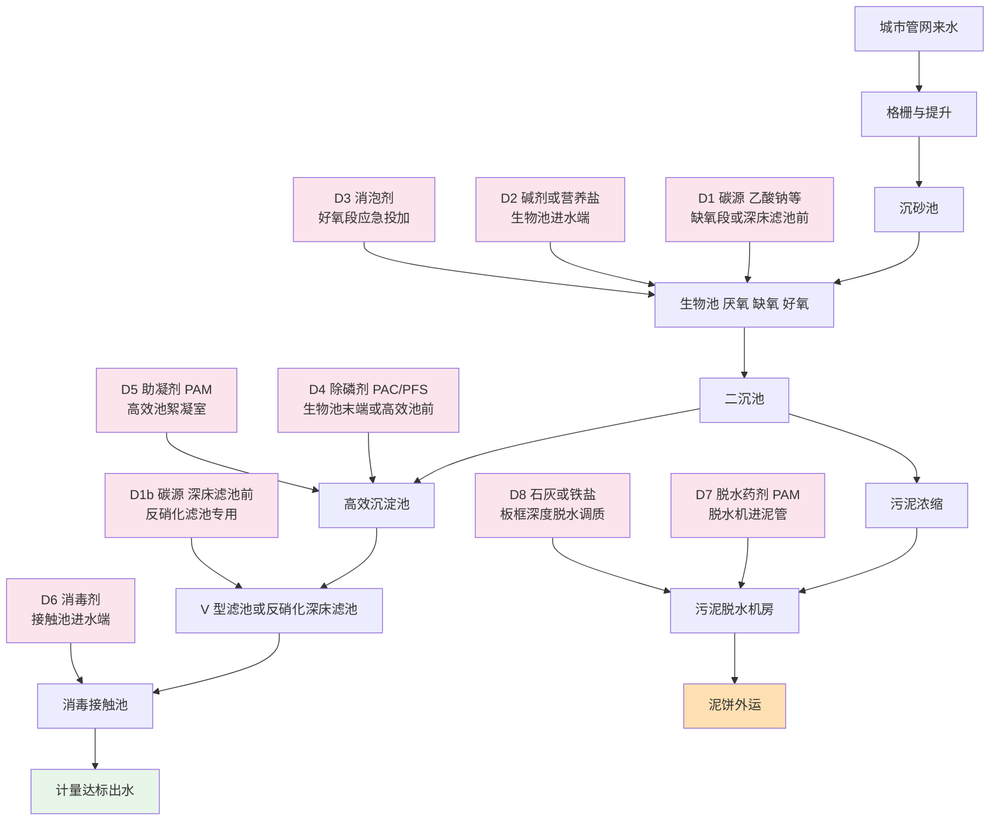
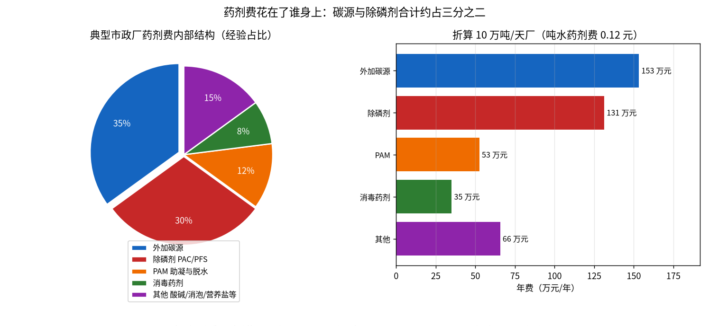

# 01-5 加药点全景：全厂药剂家族图谱

> **本章讲什么**：基础篇收官。把一座污水厂里所有"需要投药"的位置一次性标在流程图上，再把药剂家族的"户口本"逐户翻开：**干什么用、加在哪儿、长什么样、浓度多少、大概多少钱**。
>
> **读完你能回答**：全厂到底有几个加药点、每个点加什么；PAC/PFS、乙酸钠、PAM、次氯酸钠等十几号药剂各自的角色与价格量级；内碳源和外碳源什么区别；为什么"加一种药会牵动泥、电、设备三本账"。
>
> **阅读时间**：约 20 分钟。读完你就拿到了进入 [02 篇](../02-加药系统篇/02-1-加药系统硬件全景-从药袋到出水口.md) 的全部"词汇表"。

---

## 一、先纠正一个最大的误解

不少小白（包括不少刚入行的销售）以为污水厂加药就像家里往鱼缸里倒硝化细菌——**找一个地方、倒一种药水**。真实情况是：

> 一座提标到准 IV 的 10 万吨市政厂，常见 **6~10 个功能不同的加药点、十几只药剂储罐、四五套独立计量投加系统**，加的药分别服务于化学除磷、生物脱氮、混凝助凝、消毒、污泥脱水、pH 调节、泡沫应急、除臭等完全不同的任务。

而且这些点互相联动：碳源加多了出水 COD 反弹，除磷剂加多了化学污泥增产，碱剂和除磷剂还会抢 pH。**加药管控的对象不是一只泵，是一张网**——这就是为什么需要专门的系统，而不是靠老师傅挨个拧。

---

## 二、全厂加药点地图

下图在 [01-3](./01-3-污水处理工艺全流程图解.md) 的工艺流程图上，把主要投加点标成粉色节点 D1~D8：

各点一句话定位：

- **D1 / D1b 外加碳源**：生物池缺氧段（帮反硝化）或反硝化深床滤池前（末端脱氮保命点）；
- **D2 碱剂 / 营养盐**：硝化掉碱度时补碱；工业废水占比高、缺氮缺磷时补营养盐，生活污水厂很少用；
- **D3 消泡剂**：好氧池泡沫失控时应急，不是天天加；
- **D4 除磷剂**：加在生物池末端（同步沉淀）或高效沉淀池前，是除磷主力点；
- **D5 助凝剂 PAM**：高效沉淀池絮凝室，帮矾花长大；
- **D6 消毒剂**：接触池进水端，保粪大肠菌群达标；
- **D7 脱水 PAM**：污泥脱水机房，阳离子 PAM 投在进泥管；
- **D8 深度脱水调质**：板框压滤项目用石灰 + 铁盐把泥饼含水率压到 60% 上下。

把地图收成一张可打印的速查表：

| 点位 | 投加药剂 | 服务目标 | 运行最该盯的指标 |
|---|---|---|---|
| D1 | 外加碳源 | 缺氧段反硝化降 TN | 缺氧 ORP、硝态氮、出水 COD |
| D1b | 外加碳源 | 深床滤池末端脱氮 | 滤池进水 NO3-N、出水 COD |
| D2 | 碱剂 / 营养盐 | 稳 pH、补 BOD 比 N 比 P | 好氧 pH 与碱度 |
| D3 | 消泡剂 | 应急消泡沫 | 好氧池面泡沫状态 |
| D4 | PAC/PFS/铁盐 | 化学除磷 | 出水 TP、矾花沉降 |
| D5 | 阴离子 PAM | 助凝、降 SS | 高效池出水浊度 |
| D6 | 次氯酸钠等 | 消毒达标 | 余氯、粪大肠菌群、接触时间 |
| D7 | 阳离子 PAM | 污泥脱水 | 泥饼含水率、滤液 SS |
| D8 | 石灰 + 铁盐 | 板框深度脱水 | 泥饼含水率与增量 |

> 💡 **经验块 1：同一个药可能在好几个点安家。** 除磷剂 PAC 可以投在初沉前（预沉淀）、生物池出水（同步沉淀）、高效沉淀池前（后置沉淀），三个点各有道理：预沉淀除磷多但浪费碳源、同步沉淀护二沉但药耗略高、后置沉淀最省药且可控——**提标厂主流是以后置为主、同步为辅**。具体怎么设，是工艺设计与运行优化共同决定的。

---

## 三、药剂家族户口本（大表）

先说明价格口径：以下均为**典型经验区间、随市场行情与地区差异很大，具体项目以实际采购询价为准**；浓度与投加量口径来自通用设计经验，实际以现场烧杯试验与运行为准。

### 1. 除磷剂家族（化学除磷主力）

| 药剂 | 作用一句话 | 常见形态与配制 | 典型投加口径 | 价格量级（典型） |
|---|---|---|---|---|
| 聚合氯化铝 PAC | 铝盐水解絮凝，与正磷酸根生成磷酸铝沉淀 | 固体 Al2O3 含量约 28%~30%，或 10% 左右商品液；投加前稀释成 5%~10% | Al/P 摩尔比约 1.5~3，机理见 [04-1](../04-机理公式篇/04-1-化学除磷机理与投加量计算.md) | 约 1500~2500 元/吨 |
| 聚合硫酸铁 PFS | 铁盐版混凝除磷，矾花密实、沉降快 | 红褐色液体或固体，稀释使用 | Fe/P 摩尔比约 1.5~3 | 约 1500~2500 元/吨 |
| 硫酸铝 | 传统铝盐，价格低，用得早 | 块状/液体，溶液偏酸 | 同样按 Al/P 计 | 约 800~1500 元/吨 |
| 三氯化铁 | 除磷效率高、低温好用，但腐蚀性强 | 深褐色液体，储罐管路要衬塑 | Fe/P 摩尔比约 1.5~3 | 约 1200~2200 元/吨 |

### 2. 外加碳源家族（反硝化的"外卖口粮"）

| 药剂 | 作用一句话 | 形态 | COD 当量与投加口径 | 价格量级 |
|---|---|---|---|---|
| 乙酸钠 | 最常用，见效快、易储存、对系统温和 | 固体配成 20%~30% 溶液，或商品液 | COD 当量约 0.78 kgCOD/kg；投加按反硝化需碳核算 | 约 2500~4000 元/吨 |
| 甲醇 | 反硝化菌"最爱的精粮"，便宜高效但易燃有毒 | 液体，需防爆设计与安全许可 | COD 当量约 1.50 kgCOD/kg | 约 2500~3500 元/吨 |
| 葡萄糖 | 启动培菌或应急碳源，长期用不经济且易惹丝状菌 | 固体配液 | COD 当量约 1.06 kgCOD/kg | 约 2500~3500 元/吨 |
| 乙酸（冰醋酸） | 快速碳源，反应直接 | 液体，有腐蚀性与气味 | COD 当量约 1.07 kgCOD/kg | 约 3000~4500 元/吨 |

投加量统一口径：反硝化每去除 1 kg NO3-N 实际需碳源约 **4~6 kg COD**（考虑溶解氧与安全冗余，工程常取 **4.5~5.5**），再除以该药剂的 COD 当量换算成实物量。

### 3. 助凝剂与脱水剂：PAM 家族

| 药剂 | 作用一句话 | 形态与配制 | 投加口径 | 价格量级 |
|---|---|---|---|---|
| 阴离子 PAM | 配合铝盐铁盐助凝，让矾花长大结实 | 白色粉末，配成 0.1%~0.3% 溶液，需熟化 30~60 min | 高效沉淀池约 0.5~2 mg/L 量级 | 约 1.2万~3万元/吨 |
| 阳离子 PAM | 污泥脱水絮凝主力，抓带负电的污泥颗粒 | 同上，熟化要求严格 | 约 3~8 kg/t 绝干污泥 | 约 1.2万~3万元/吨 |

### 4. 消毒药剂

| 药剂 | 作用一句话 | 形态 | 投加口径 | 成本量级 |
|---|---|---|---|---|
| 次氯酸钠 | 最常用，折点前形成氯胺、折点后游离氯杀菌 | 商品液有效氯约 10% | 以有效氯计 1~5 mg/L，接触 ≥ 30 min | 商品液约 800~1500 元/吨 |
| 二氧化氯 | 现场发生器制取，杀菌受氨氮影响小、副产物少 | 亚氯酸钠加盐酸等原料现场制备 | 按有效氯当量投加 | 发生器投资 + 原料费 |
| 臭氧 | 强氧化杀菌兼降 COD，无持续余氯 | 空气或制氧现场制备 | 电耗约 8~15 kWh/kg O3 | 设备贵，主要花电费 |

### 5. 其他辅助药剂

| 药剂 | 干什么用、加在哪 | 典型口径 |
|---|---|---|
| 液碱 NaOH / 纯碱 Na2CO3 | 硝化耗碱致 pH 走低时补碱，投生物池进水 | 液碱多为 30% 商品液；纯碱配液投加 |
| 盐酸 / 硫酸 | 工业废水碱度过高或化学清洗膜、仪表时用 | 厂区安全等级要求高，少见常态投加 |
| 消泡剂（有机硅类等） | 好氧池/厌氧池泡沫应急 | 约 0.8万~1.5万元/吨，按滴加，量极小 |
| 除臭药剂 | 生物滤池喷淋塔加湿、调节，个别投加次氯酸钠 | 视除臭工艺而定 |
| 营养盐（尿素、磷酸二铵等） | 工业废水缺氮缺磷时补，维持 BOD 比 N 比 P 约 100 比 5 比 1 | 生活污水厂基本不用 |

> ⚠️ **经验块 2：PAM 是"最怕瞎配"的药。** 浓度超过 0.3% 会变成"糨糊"堵管道，熟化时间不够就是白色鱼眼颗粒，进了池子不絮凝还添污染；阳离子和阴离子搬错桶（亲眼看错过两次），脱水机能立刻跑泥给你看。配药系统的水射器、熟化罐、低液位联锁是 [02-2](../02-加药系统篇/02-2-计量泵管路与溶配药系统.md) 的重点。

---

## 四、内碳源与外碳源：先吃免费饭，再点外卖

脱氮需要碳源，但碳源分两种"钱包"：

| 对比 | 内碳源 | 外碳源 |
|---|---|---|
| 是什么 | 进水自带的 BOD、初沉污泥发酵产物、系统内碳 | 花钱买的乙酸钠、甲醇、葡萄糖、乙酸 |
| 成本 | 几乎为零 | 常年最大药剂开销，吨水成本可达几分到一两毛 |
| 怎么保住/用好 | 取消或超越初沉、设初沉污泥发酵、控制厌氧/缺氧环境 | 缺氧段或深床滤池前精准投加，按需供给 |
| 失控后果 | 保不住就只能买药，TN 越达标越费钱 | 投多了出水 COD 反弹、还白烧钱 |

**优秀的运行是"内碳源优先、外碳源兜底"**：先通过工艺挖掘把免费碳用足，只把外碳源当缺口的补充。AI 碳源优化之所以值钱，就因为它能把"为了 TN 安全天天过量投"改成"只在缺口小时段按需投"，典型节药空间约 10%~25%。

---

## 五、连锁反应：每一吨药都不只是药费

药加进水里，故事才刚开始。四本账必须一起算（详细账本见 [03-2](../03-问题与成本篇/03-2-污水厂成本账本-药剂到底花了多少钱.md)）：

1. **污泥账**：铝盐、铁盐与磷反应的沉淀物全部变成化学污泥。PAC 投加量提高 20%，绝干污泥量可能增加几个百分点，后续 PAM、脱水电耗、外运处置费（约 200~500 元/吨）一起涨。典型 AI 优化可带来化学污泥减量约 5%~10%。
2. **电费账**：药剂要稀释搅拌投加，臭氧全部靠电，碳源促进反硝化但过量碳源增加好氧后段负担；加药系统与鼓风机、脱水机的电耗是联动的。
3. **设备与腐蚀账**：三氯化铁腐蚀螺栓、池壁、脱水机机架；PAM 黏附使膜组件、仪表探头受污染；次氯酸钠挥发腐蚀加药间电气。
4. **水质反弹账**：碳源过量 → 出水 COD 升高；碱过量 → pH 冲 9、混凝恶化；消毒过量 → 余氯杀受纳水体生物。任何药都有"过犹不及"的拐点。

所以现代加药管控的优化目标从来不是"药费最小"，而是：

> **在出水 100% 达标的约束下，使药剂费 + 污泥处置费 + 联动电耗 + 超标风险之和最小。**

这就是本教程后半本要解决的工程问题。

---

## 六、药剂费都花在了谁身上

典型市政厂的药剂费内部结构（合成经验占比，因厂而异）：

*数据为合成/典型参数实算：碳源约 35%、除磷剂约 30%、PAM 约 12%、消毒约 8%、其他约 15%。按吨水药剂费 0.12 元的口径折算一座 10 万吨厂，脚本输出全年药剂费约 438 万元，其中碳源约 153 万、除磷剂约 131 万。**提标压力越大、进水越稀的厂，碳源占比越可能冲到一半以上。***

记住三个数量级，后面算账不会跑偏（均为市政厂典型经验区间）：

| 成本项 | 典型经验区间 |
|---|---|
| 吨水电费 | 约 0.15~0.35 元/m³ |
| 吨水药剂费 | 约 0.05~0.25 元/m³ |
| 污泥外运处置 | 约 200~500 元/吨泥饼，地区差异大 |

> ⚠️ **经验块 3：看药剂方案先问"什么标准、什么水"。** 一级 B 的厂可能只投消毒和少量 PAM，吨水药费几分钱；准 IV + 反硝化深床滤池的厂，碳源 + 除磷剂 + PAM 三线全开，吨水两毛都不稀奇。脱离排放标准和进水水质谈"你们厂药费高不高"，是外行的典型特征。

> ⚠️ **经验块 5：次氯酸钠是会"过期"的药。** 商品次氯酸钠久存会自然分解，夏天储罐里放一个月，有效氯可能从 10% 掉到 7% 以下——泵的冲程没变，消毒剂量已经悄悄缩水。台账上记录进货有效氯、先进先出、每月复测一次浓度，是不出"莫名粪大肠超标"事故的笨办法。

> 💡 **经验块 4：询价要问"有效含量"和"到厂价"。** PAC 有固体有液体、Al2O3 含量有高有低；乙酸钠有含结晶水的三水合物和无水的；次氯酸钠按有效氯计。只比每吨单价不折算有效成分，会买贵还不自知。价格还要加上运费和卸车费，液体药剂冬天还要考虑保温。

---

## 七、四组经典"二选一"：选型直觉怎么建立

### 1. PAC 还是 PFS？

铝盐矾花蓬松、出水色度好，但低温效果差、过量铝残留受关注；铁盐矾花密实沉降快、低温除磷更稳、还能帮着脱色除臭，但出水略泛色、腐蚀性更强。**国内市政厂用 PAC 最普遍，北方低温或工业占比高的厂 PFS/铁盐用得多**，不少厂冬季临时切换。最终依据是本厂水质做的**烧杯搅拌试验**——同样出水 TP 0.3 目标，谁的吨水成本低用谁。

### 2. 乙酸钠还是甲醇？

甲醇 COD 当量高（1.50）、单位脱氮成本最低、反硝化速率快，但易燃易爆、有毒性，需要甲类仓库与防爆投加间，审批和管理门槛高；乙酸钠温和安全、开箱即用，单价虽高但小厂更省心，所以成了近年绝对主流。**大厂、有安全管理能力、碳源缺口大的认真考虑甲醇；中小厂、提标项目用乙酸钠**。葡萄糖只适合培菌应急，长期用培养丝状菌、污泥膨胀风险高。

### 3. 阴离子还是阳离子 PAM？

看电荷"异性相吸"：水里铝盐铁盐混凝后的矾花体系，多用**阴离子**助凝架桥；污泥颗粒表面通常带负电，脱水时用**阳离子**中和电荷、释放吸附水。选错电荷类型，加得越多水越浑、泥越稀。

### 4. 次氯酸钠还是二氧化氯？

次氯酸钠设备简单、商品液随处可买，但有效氯浓度随储存衰减，且与氨氮反应生成氯胺"吃掉"有效氯；二氧化氯现场制备、杀菌几乎不受氨氮影响、三卤甲烷副产物少，但要存亚氯酸钠等危险品、发生器需要维护。**氨氮偏高的厂、对副产物敏感的回用项目更倾向二氧化氯；常规市政厂次氯酸钠仍是主流**。

| 纠结组 | 一句话选择倾向 |
|---|---|
| PAC / PFS | 常温除磷用铝，低温脱色用铁，最终看烧杯试验 |
| 乙酸钠 / 甲醇 | 求安全省心用乙酸钠，大厂控成本且具备防爆管理用甲醇 |
| 阴 / 阳离子 PAM | 水里助凝用阴，污泥脱水用阳 |
| 次氯酸钠 / 二氧化氯 | 常规用次钠，高氨氮或回用敏感场景考虑二氧化氯 |

---

## 八、走进加药间：这些药在厂里长什么样

光看表格还不够，第一次走进加药间，你会看到这样的"标准三件套"：

1. **储罐区**：室外或半露天立着几只 PE 或钢制储罐——液体 PAC/PFS 常见 20~50 m³ 罐、次氯酸钠罐要避光、甲醇罐是防爆罐带围堰（防止泄漏流淌）。罐体标着药剂名称、浓度、进厂日期；
2. **溶配药间**：一袋袋 25 kg 的 PAC 固体粉末或 PAM 白袋子堆在旁边；PAM 配药最讲究——水射器先把干粉打成水雾，进熟化罐搅拌 30~60 分钟，再溢流到投加罐，全程自动，配成的溶液像稀米汤；
3. **计量泵与管路**：投加罐出口接一用一备的计量泵（SEKO、普罗名特 ProMinent、帕斯菲达 Pulsafeeder、南方泵业等品牌常见），泵上有冲程和频率两个调节旋钮，出口管沿桥架通往几十米外的投加点，管路上有背压阀、安全阀、阻尼器和流量计。

加药间的安全细节也是工艺常识：液体药剂区地面做防腐涂层和围堰、强制通风；铁盐、酸雾区的灯具和螺栓要用防腐材质；操作工配药戴护目镜和防酸碱手套；甲醇间门口有静电释放球和可燃气体报警器。**这些硬件怎么选、怎么装、怎么联动 PLC，就是 [02 篇](../02-加药系统篇/02-1-加药系统硬件全景-从药袋到出水口.md) 的全部内容。**

### 新手三个高频疑问

1. **加药是人工倒还是自动投？** 主流是"自动配药 + 计量泵连续投加"：配药按高低液位自动启停，投加量由运行员设定或 PLC 按流量比例控制；AI 系统通常不直接碰泵，而是给 PLC 下发"建议投加量"，架构细节在 [07-1](../07-控制优化篇/07-1-从开环建议到闭环控制-三种架构.md)。
2. **一袋药从进厂到投加要过几关？** 验收称重取样化验有效含量 → 登记批号入库 → 配制/稀释 → 熟化 → 计量泵投加 → 出口流量计核对。每一关都可能"缺斤短两"，这也是药剂审计能省钱的原因。
3. **同一条管上能两种药一起投吗？** 一般不能就近混合投加——铝盐和 PAM 直接相遇会"抱团"失效，两种药要各设投加点、拉开混合距离；药与药的投加顺序（先混凝后助凝）是混凝动力学管的事，[04-3](../04-机理公式篇/04-3-混凝动力学与PAM助凝.md) 细讲。

---

## 本章小结

1. 全厂常见 6~10 个加药点：D1 碳源、D2 碱剂/营养盐、D3 消泡、D4 除磷剂、D5 助凝 PAM、D6 消毒剂、D7 脱水 PAM、D8 深度脱水调质，分布在水线和泥线上。
2. 四大主力药剂：**除磷剂**（PAC/PFS，1500~2500 元/吨，按 Al/P 或 Fe/P 1.5~3 投）、**碳源**（乙酸钠 2500~4000 元/吨，按 4.5~5.5 kgCOD/kg NO3-N 核算）、**PAM**（0.1%~0.3% 配制熟化，脱水 3~8 kg/t 绝干泥，1.2万~3万元/吨）、**次氯酸钠**（有效氯 1~5 mg/L，接触 ≥30 min）。
3. 碳源先保内碳源、再补外碳源；碳源与除磷剂合计常占药剂费三分之二，是优化的两大金矿。
4. 加药联动四本账：污泥、电耗、设备腐蚀、水质反弹；优化目标是总费用最小，不是单一药费最小。
5. 谈药剂方案永远先问排放标准与进水水质，比价格永远折算有效含量与到厂成本——这是进入加药系统硬件篇之前的最后一条常识。

---

**上一章**：[01-4 生物处理：微生物打工仔的食堂与宿舍](./01-4-生物处理-微生物打工仔的食堂与宿舍.md)
**下一章**：[02-1 加药系统硬件全景：从药袋到出水口](../02-加药系统篇/02-1-加药系统硬件全景-从药袋到出水口.md)
