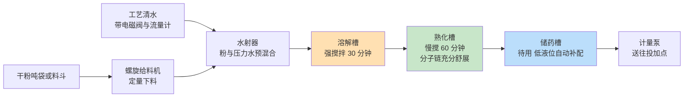
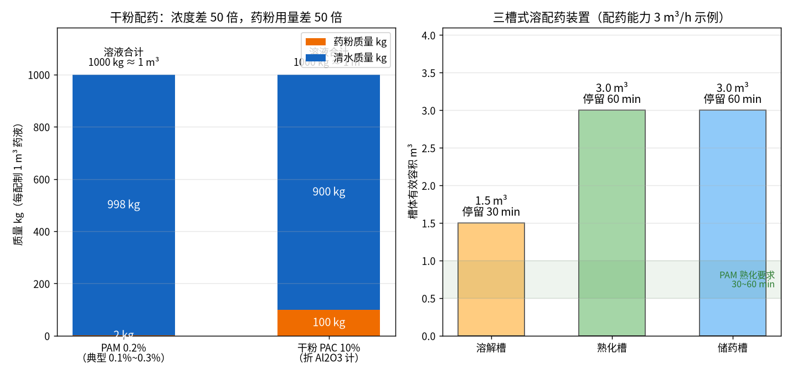
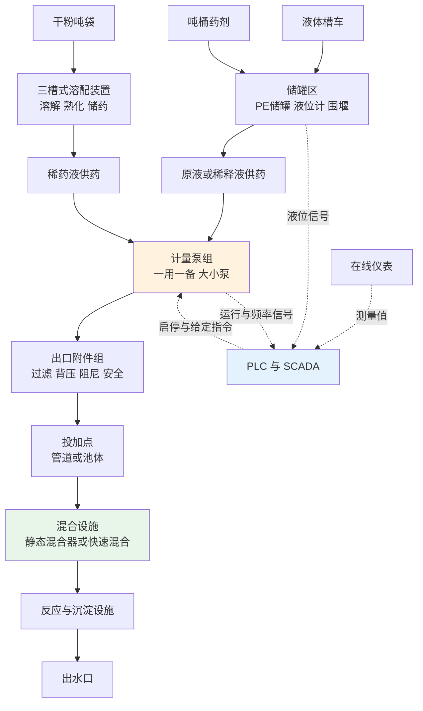
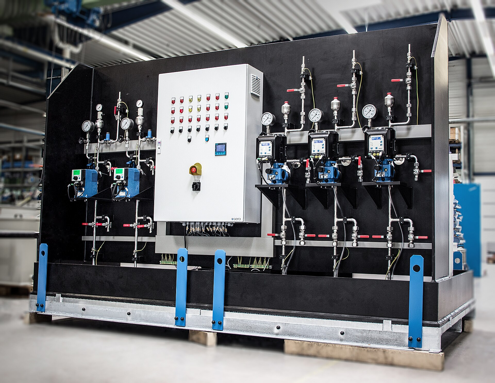

# 02-1 加药系统硬件全景：从药袋到出水口

> 本章讲什么：把一套加药系统从进厂药剂到出水口完整"拆"一遍，让你第一次走进加药间时，每个罐子、每根管子都叫得出名字、说得出作用。
>
> 读完能干什么：看懂加药间的设备布置图；知道干粉药剂为什么要三个槽；分清什么药剂该用什么材质；看懂加药间的安全设施是不是摆设。
>
> 阅读时间：约 25 分钟。

---

## 一、先想"冲一杯速溶咖啡"，加药系统就懂了一半

很多小白第一次走进加药间，面对一排白罐子、黄泵头、花花绿绿的管子，立刻发怵。其实把整套加药系统想成**在办公室冲一杯速溶咖啡**，逻辑一模一样：

| 冲咖啡的动作 | 污水厂对应的环节 | 主要设备 |
|---|---|---|
| 买来速溶咖啡粉/浓缩液 | 药剂进厂 | 槽车、吨桶、干粉吨袋 |
| 放进储物柜和糖罐 | 药剂储存 | 储罐区、PE 储罐、液位计 |
| 烧热水、把粉冲开搅匀 | 溶配药 | 溶解槽、熟化槽、搅拌机、螺旋给料机 |
| 按口味"呲"地挤一下糖浆 | 计量投加 | 计量泵（一用一备） |
| 吸管、封口膜、防漏 | 管路附件 | 过滤器、背压阀、脉冲阻尼器 |
| 挤进杯子后搅一搅 | 投加点与混合 | 静态混合器、快速混合池 |
| 尝尝甜不甜再决定加不加 | 检测与控制 | 在线仪表、PLC、SCADA |

区别只在于：咖啡冲坏了大不了重冲一杯；污水厂这条"咖啡流水线"一天处理几万吨水，**任何一个罐子空了、一根管子堵了、一个泵停了，下游几小时后就可能出水超标**。而且它不是人站在旁边冲，是机器 24 小时自动冲——所以每一个环节都要做成"可储、可配、可计量、可混合、可监控"。

下面我们就顺着药的旅程，从厂区大门一路走到出水口。

---

## 二、第一站：药剂以什么形态进厂

药剂不是凭空出现在罐子里的。它进厂时有三种典型形态，决定了后面整套储存和溶配设备怎么配：

| 进厂形态 | 典型包装与运输 | 常见药剂 | 厂内卸料方式 |
|---|---|---|---|
| 液体（大宗） | 化工槽车，单车 20~30 t | 液体 PAC/PFS（混凝除磷）、商品次氯酸钠（消毒）、乙酸钠溶液（碳源） | 槽车自带泵或厂内卸料泵，经卸药软管打入储罐 |
| 液体（小宗） | IBC 吨桶（1000 L 方形塑料桶，金属框架） | 碳源、PAM 乳液、消泡剂、小型厂用 PAC | 叉车搬运，用插桶泵/隔膜泵抽入储罐或直接供泵 |
| 干粉/固体 | 吨袋（500~1000 kg 大袋）、25 kg 小袋 | PAM 干粉（絮凝/脱水）、固体 PAC、石灰、粉末活性炭、高锰酸钾 | 行车/叉车吊到投料斗，螺旋输送或人工拆袋 |

> 💡 **现场经验：为什么大厂爱用液体、小厂常见干粉？**
> 液体药剂"即到即用"，靠泵卸料、省人工，但运费里有一大半是水——液体 PAC 里 70% 以上是水，距离化工厂超过 200 km 就不划算了。所以沿江、沿化工园区的大厂多用槽车液体；运距远、用量小的厂宁愿拉干粉，自己在厂里兑水。一个 10 万吨/天的厂，液体 PAC 用量常见 5~15 t/天，一天一车，这就是为什么储罐至少要配 2 个、每个能存 3~7 天用量。

槽车卸药有个必备细节：**卸药口要做接头标识和防错接措施**。PAC 卸到次氯酸钠罐里是真实发生过的事故——两种氧化性/酸性液体混合会放热、放气，整罐报废还可能冒氯气。规范做法是不同药剂用不同规格的快速接头，或者挂牌上锁、专人核对送货单。

---

## 三、第二站：储罐区——药剂的"宿舍楼"

药剂进厂后先住进储罐区。这里的主角是储罐和它的"水电煤"配套。

### 3.1 储罐本体

市政厂最常见的是 **PE（聚乙烯）立式缠绕储罐**，单罐容积 5~30 m³，乳白色或黑色，便宜（10 m³ 罐约 0.8~1.5 万元）、耐酸碱、不结垢，次氯酸钠、PAC、稀酸稀碱都能装。用量大、追求寿命的厂，碳源和部分药剂会用 **304/316 不锈钢罐**或钢衬塑罐。干粉药剂则存放在**防潮药剂库**里，吨袋垫托盘、离墙离地，PAM 库还要配除湿设施。

### 3.2 储罐的"五官"

一个合格的药剂储罐不只是一个桶，它至少带这些附件：

- **液位计**：最常用超声波液位计（罐顶开孔，不接触药液，0.3~0.8 万元/套）或雷达液位计；便宜的厂用浮球开关只报"高/低液位"两个开关量；黏稠药剂用静压式液位计。液位信号送 PLC，低液位报警、超低液位联锁停泵（防计量泵空抽）。
- **呼吸阀/溢流管**：进药时罐里的空气要排得出，否则罐体鼓包；抽药时空气进得来，否则罐体被吸瘪。PE 罐被吸瘪的事故每年都有。
- **围堰（事故收集池）**：储罐周围用混凝土或防腐材料围成一圈，有效容积一般**不小于最大单罐容积的 110%**，罐体破裂时药液全部接在围堰里，不进雨水管网。这是安环检查的必查项。
- **卸料泵、阀门、人孔、爬梯**：人孔用于定期清罐——PAC 罐底 2~3 年能沉一层铝盐泥，不清就白白吃掉有效容积。

### 3.3 储罐区的仪表信号
### 3.4 储罐容积怎么估：一个简单算例

储罐不是越大越好（占地方、药液存久了会水解失效），也不能太小（槽车两天一趟，遇上堵车就断药）。工程上按**库存天数**估：

- 储罐总有效容积 V = 日均用量（t/d）× 储备天数（d）÷ 药液密度（t/m³）
- 储备天数典型经验值：液体药剂取 **5~7 天**（槽车运输半径内），偏远地区取 7~10 天；次氯酸钠因易分解，库存反而不宜超过 10~15 天。

算例：某 10 万吨厂液体 PAC 日均用 10 t，药液密度约 1.2 t/m³，储备 6 天 → V = 10 × 6 ÷ 1.2 = **50 m³**，配 2 个 30 m³ 罐（总有效 60 m³，还能错峰进料、清罐不停药）。干粉药剂则按库房面积和吨袋数估，PAM 日耗几十到几百千克，存 15~30 天很常见。

储罐区看着安静，其实有信号在流动：超声波液位计把液位变成 4-20mA 信号送进 PLC，SCADA 画面上就能看到每个罐的余量；药剂快用完时系统自动提醒采购。这条信号链 [02-4](./02-4-PLC与SCADA-数据怎么采控制怎么做.md) 会细讲。

---

## 四、第三站：溶配药系统——把"咖啡粉"冲成能直接喝的"咖啡"

液体药剂可以直接进计量泵，**干粉药剂必须先配成稀溶液**——干粉直接撒进污水里会结团、沉底、漂得到处都是，根本不反应。溶配药系统分两大流派。

### 4.1 干粉三槽式：溶解槽 → 熟化槽 → 储药槽

PAM（聚丙烯酰胺，高分子絮凝剂，详见 [01-5](../01-基础篇/01-5-加药点全景-全厂药剂家族图谱.md)）这种高分子干粉最难伺候，行业标配是**三槽式全自动泡药机**（也叫高分子溶配装置），不锈钢机身，处理量常见 1~5 m³/h：

三个槽各自解决一个问题，缺一不可：

1. **溶解槽**：干粉通过**螺旋给料机**（一根旋转的螺杆，转速与下料量成正比，实现"定量撒粉"）均匀送入，先经**水射器（射流混料器）**——压力水高速流过缩径形成负压，把粉吸进去并瞬间打散，避免粉团入水形成外湿内干的"鱼眼"。槽内立式搅拌机强搅，典型停留约 30 min。
2. **熟化槽**：PAM 是高分子，干粉溶水后分子链要时间慢慢"伸懒腰"，这个过程叫**熟化**，规范要求 **30~60 min**，低速搅拌。没熟化的 PAM 黏度不够、絮凝效果差，还黏滤布。
3. **储药槽**：配好的药在这里待命，液位低了整套装置自动配新的一批，保证计量泵永远有药可抽。

### 4.2 配药浓度算例（与实算图数字一致）

PAM 的标准配制浓度只有 **0.1%~0.3%**（质量分数），浓了搅不动、黏度太高泵抽不动，淡了设备做得太大。以配制 **1 m³ 的 0.2% PAM 溶液**为例，药液密度近似按 1000 kg/m³ 计：

- 溶液总质量：1 m³ × 1000 kg/m³ = **1000 kg**
- 需要 PAM 干粉：1000 × 0.2% = **2 kg**
- 需要清水：1000 − 2 = **998 kg（约 998 L）**

作为对比，如果某些小厂用固体 PAC 配制 **10%** 的工作液，同样 1 m³：需要干粉 **100 kg**、清水 **900 kg**。浓度差 50 倍，药粉用量正好差 50 倍。

*上图为教程脚本实算：左为两种干粉配 1 m³ 药液的粉/水构成；右为配药能力 3 m³/h 的一套三槽装置体积与停留时间——溶解槽 1.5 m³（30 min）、熟化槽 3 m³（60 min）、储药槽 3 m³（60 min 缓冲），熟化时间恰好落在规范要求的 30~60 min 区间。数字为典型算例，具体项目以设备样本为准。*

> ⚠️ **老工程师的坑：PAM 的"鱼眼"和"夹生饭"**
> 见过最典型的返工案例：某厂为省事把 PAM 粉直接倒进水桶人工搅，投加后水面漂满白色粉团，沉下来的"鱼眼"堵了计量泵入口的 Y 型过滤器，一天拆洗 4 次，脱水机房滤布还糊得发硬板结。根因就是没有水射器打散 + 熟化时间不够。另一座北方厂冬天溶药水温 5 ℃，PAM 溶解速度只剩夏天的一半，看着配好了其实是"夹生饭"——后来把溶药水换成中水加热后的 15~25 ℃ 温水才解决。**PAM 泡药机的设计底线：粉必须先打散再入槽，熟化时间必须留够。**

### 4.3 液体药剂的稀释

液体 PAC/PFS、次氯酸钠通常**原液直接投加**，或在厂内稀释一倍到 5%~10% 再投（稀释后计量更精细、混合更均匀，但浓度越低越容易水解失效，PAC 稀释液一般当天用完）。稀释有两种做法：

- **在线稀释**：计量泵吸原液，管路里用另一台小泵/比例混合器按比例掺稀释水，即配即用，省一个罐；
- **稀释罐**：带搅拌机的罐内先放水，再按比例泵入原液搅匀，供下一级计量泵抽吸。

次氯酸钠还要特别注意：有效氯约 10% 的商品液（口径见 [01-5](../01-基础篇/01-5-加药点全景-全厂药剂家族图谱.md)）夏天温度高会自然分解放气，储罐要留呼吸量，稀释水严禁用含氨高的水——会生成有爆炸性的三氯化氮。

---

## 五、第四站：计量泵组——系统的"注射器"

配好的药液由**计量泵**（也叫加药泵、定量泵）精确投加。它是整套系统的执行器官，[02-2](./02-2-计量泵管路与溶配药系统.md) 整章讲它，这里先建立两个配置常识。

### 5.1 一用一备是底线，两用一备更常见

关键药剂（除磷、消毒、碳源）的计量泵**至少一用一备**：运行泵故障或检修时，备用泵切换顶上，投加不能断。切换有手动阀门组切换，也有自动联锁（运行泵故障信号触发备用泵自启）。10 万吨级厂常见配置是 N+1 甚至 N+2，例如除磷投加配 3 台泵、2 用 1 备。

### 5.2 多泵组合：大泵保冲击，小泵保精度

进水负荷一天内波动 2~3 倍（见 [00-2](../00-导读/00-2-五分钟看懂污水厂AI加药.md) 的早高峰），单靠一台泵从 20% 调到 100% 有个物理问题：**计量泵在行程低于 20%~30% 时计量精度明显变差**。成熟设计是"大小泵搭配"：

- 一台大泵负责平时基线 + 冲击负荷（比如 0~300 L/h）；
- 一台小泵负责夜间低负荷精细调节（0~80 L/h）；
- PLC 按需要决定开哪台、开几台——这叫"启停台数"调节，和冲程、频率调节一起构成三种流量手段，[02-2](./02-2-计量泵管路与溶配药系统.md) 展开。

---

## 六、第五站：管路附件与投加点——药出门后的"交通系统"

计量泵出口到投加点之间绝不是一根光管子，上面串着一串功能附件（[02-2](./02-2-计量泵管路与溶配药系统.md) 逐个讲原理），这里先看全链条和药的"最后一跳"。

### 6.1 投加点与混合设施：药进了水，还得混得匀

药加到污水里之后，如果不主动制造混合，药剂会沿一条"捷径"漂走，大部分水根本碰不到药。混凝工艺对混合的要求是**快、猛、短**：药剂要在 10~60 秒内均匀扩散到每一滴水，行业用速度梯度 G（单位 s⁻¹，可理解为"搅得猛不猛"）衡量。工程上有四代常见做法：

| 混合/反应设施 | 典型位置 | 强度与时间（典型经验值） | 特点 |
|---|---|---|---|
| 管道静态混合器 | 投加点下游管道内 | 管内停留 2~5 s，流速 1~2 m/s | 一段装螺旋叶片的管子，不耗电、免维护；流量过小时混合变差 |
| 跌水混合 | 渠道跌水/配水井跌落处 | 跌落高度 0.3~1 m | 把药投在跌落口前，借跌落翻滚混合，零电耗 |
| 机械快速混合池 | 混凝池第一格 | G 约 500~1000 s⁻¹，10~60 s | 电动搅拌桨，混合最可控，但多一台转动设备 |
| 隔板/折板反应池 | 快速混合之后 | G 约 20~70 s⁻¹，10~30 min | 过水断面反复缩放，让矾花互相碰撞长大 |
| 机械絮凝池 | 深度处理混凝沉淀前 | G 约 20~60 s⁻¹，15~30 min | 桨板慢搅，与快速混合分工：先混匀、再慢慢"摇"出大矾花 |

注意区分两个阶段：**快速混合**解决"药均匀分散"的问题（秒级），**絮凝反应**解决"微粒碰撞结成大矾花"的问题（十几到三十分钟）。这套动力学机理是 [04-3](../04-机理公式篇/04-3-混凝动力学与PAM助凝.md) 的主角。

### 6.2 全链条物料与信号总图

把前面五站串起来，再加一条信号流（虚线），就是一个典型加药系统的完整拓扑：

记住这张图的"物料向前走、信号绕一圈"结构：眼睛（仪表）把结果告诉大脑（PLC/SCADA/AI），大脑再指挥手（计量泵），后面三章讲的就是这条回路上的每一种设备。

---

## 七、材质选择：什么药配什么管子

选错材质的后果是缓慢而昂贵的：管子一年后脆裂漏药、泵头内件腐蚀失准、304 弯头被次氯酸钠腐蚀出针孔。选型不必背化学手册，记住下面这张工程对照表即可（具体项目以药剂厂家的相容性表为准）：

| 材质 | 耐腐画像 | 典型适用药剂/部位 | 不适用/注意 |
|---|---|---|---|
| PE（聚乙烯） | 耐大多数稀酸稀碱和氧化剂，便宜 | 次氯酸钠、PAC/PFS、稀酸碱储罐与投加管 | 有机溶剂、高温药液；户外选抗 UV 黑色 |
| PVC-U（硬聚氯乙烯） | 稀药液管路主力，粘接施工快 | PAC、PAM、次氯酸钠、碳源的低压工艺管 | 耐压一般 ≤1.0 MPa，怕冻怕砸，浓酸/高温慎用 |
| 304 不锈钢 | 卫生、耐中性药液，机械强度好 | 干粉泡药机机身、碳源/中性药剂泵管、栏杆平台 | 长期接触氯离子（次氯酸钠、PAC 浓缩液、海水）会点蚀 |
| 316L 不锈钢 | 比 304 多了钼，抗氯离子好一档 | 碳源投加、PAM 乳液、腐蚀更强的中性药液 | 浓次氯酸钠、强酸仍不够 |
| 钢衬四氟/PTFE、PVDF | 化学惰性近乎"不粘锅涂层" | 浓硫酸、强氧化剂、高纯或强腐蚀药剂的泵头/管路 | 价格高，通常只用在最关键的过流部件 |
| 计量泵过流端组合 | 泵头、膜片、单向阀球座按药剂选 | 标配 PVC+PTFE 膜片；强腐蚀选 PVDF/不锈钢泵头 | 橡胶件怕油、怕强氧化，寿命 1~2 年要换 |

> 💡 **现场经验：腐蚀事故有 80% 发生在"没想到的地方"**
> 真正漏的往往不是管子本身，而是：泵出口脉动把 PVC 接头振松渗漏、304 螺栓长期被 PAC 雾气咬断、地面积液腐蚀电缆桥架。老厂改造时看地面颜色就知道——加药间地坪发白、掉皮、有结晶渍的区域，上方一定有渗漏点。设计时多花的每一分防腐钱，都是在省三年后的抢修费。

---

## 八、加药间设计常识：安全不是挂在墙上的

药剂区（尤其是加药间）是污水厂里化学风险最集中的房间，验收和安环检查的重点项很固定：

1. **通风**：机械排风，换气次数常见 **6~12 次/小时**，排风口设在靠近地面一侧（氯气、酸雾比空气重）。次氯酸钠间与酸间必须物理隔开——两者逸出的气相遇会产生氯气。
2. **洗眼器与紧急冲淋**：装在药剂操作点 30 秒（约 15 m）内能走到的位置，常开供水、冬季防冻，每周放水试一次（很多厂的洗眼器一开水全是黄锈水，等于没装）。
3. **防腐地坪 + 围堰**：地坪做环氧或防腐涂层并设坡向地漏；储罐区围堰、泵区设小型事故托盘，药液可收集、可冲洗、可导流到事故池。
4. **液位与报警**：每个储罐高/低液位进 PLC，低液位联锁停泵、高液位联锁关卸料阀，卸料时有人值守。
5. **电气与照明防腐**：潮湿腐蚀环境用防腐灯具、防腐桥架，插座远离投药口；PAM 区域地面遇药液极滑，必须做防滑和及时冲洗。
6. **称重与库存**：大宗药剂罐可装静态称重模块或用槽车过磅核对入库量，这也是后面 [03-2](../03-问题与成本篇/03-2-污水厂成本账本-药剂到底花了多少钱.md) 算药剂账的原始数据来源。

*真实照片：工厂预制的加药撬块（德国 sera 氢氧化钠投加装置）——成排隔膜计量泵、压力表、阀门与控制箱集成在同一底座，现场接管接电即可用。图片来源：Wikimedia Commons，作者 McFly211，CC BY-SA 4.0。*

> ⚠️ **老工程师的坑：加药间最容易被省掉的三样东西**
> 一是通风（觉得"窗户开开就行"，冬天一关窗，次氯酸钠分解气熏得人睁不开眼，金属件半年锈）；二是围堰（地坪一体找坡代替，裂缝后药液直渗土壤，安环罚款比修围堰贵十倍）；三是低液位联锁（泵空抽几小时，药剂没投进去都没人知道，出水总磷悄悄爬坡）。看一个厂的管理水平，先进加药间闻味道、看地面、摸洗眼器。

---

## 九、本章小结

1. 加药系统 = "冲咖啡流水线"：**进厂储存 → 溶配 → 计量投加 → 管路附件 → 投加点混合 → 检测控制**，物料向前走、信号绕一圈。
2. 药剂三形态进厂：**槽车液体**（大宗）、**IBC 吨桶**（小宗）、**干粉吨袋**（PAM/固体 PAC/石灰等）；形态决定储存与溶配方案。
3. 干粉 PAM 必须走**溶解槽 → 熟化槽 → 储药槽**三槽流程，靠螺旋给料机定量、水射器打散、搅拌熟化 30~60 min；配 0.2% 的药液 = 1 m³ 用粉 2 kg、水 998 kg。
4. 计量泵组按**一用一备/多用一备 + 大小泵搭配**配置，兼顾连续供药和全量程精度；投加点之后必须靠静态混合器、跌水或快速混合池让药在秒级混匀。
5. 材质按药剂选：**PE/PVC 打底，304 怕氯离子，316L 抗氯一档，强腐蚀用衬四氟/PVDF**；加药间六件套（通风、洗眼器、防腐地坪围堰、液位联锁、防腐电气、称重库存）一个不能少。

---

**上一章：** [01-5 加药点全景：全厂药剂家族图谱](../01-基础篇/01-5-加药点全景-全厂药剂家族图谱.md)
**下一章：** [02-2 计量泵、管路与溶配药系统](./02-2-计量泵管路与溶配药系统.md)
