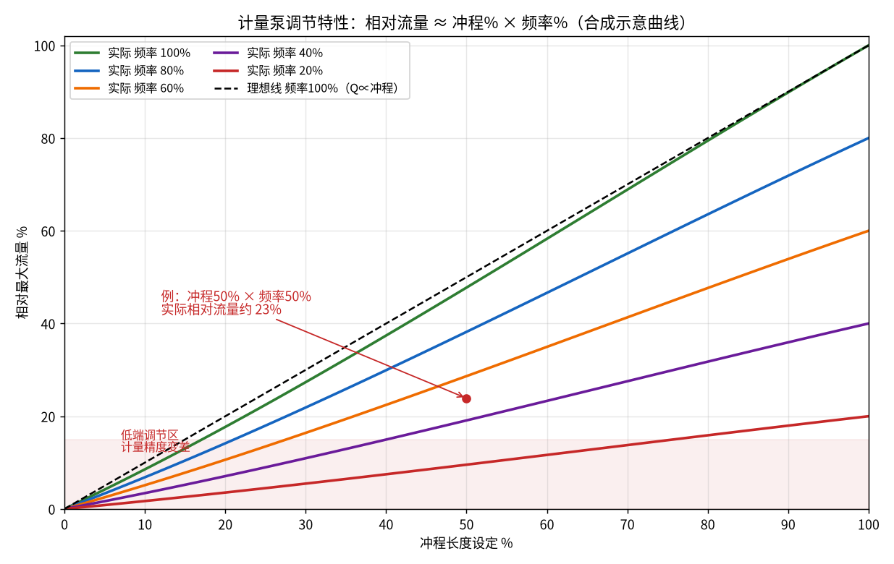
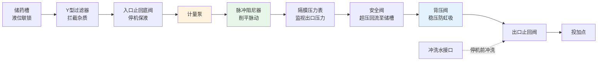
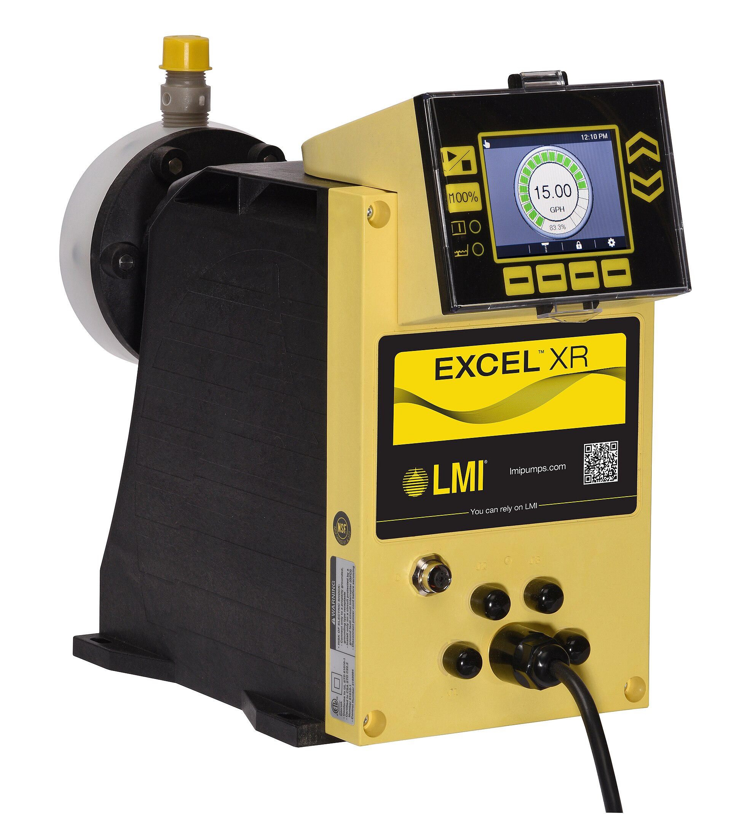

# 02-2 计量泵、管路与溶配药系统

> 本章讲什么：讲透加药系统的"执行器官"——计量泵怎么一吸一排把药定量送出去，四种泵怎么选，流量靠什么调，进出口管路上一串小阀件各自防的是什么祸。
>
> 读完能干什么：看懂泵铭牌并独立完成一次简单选型计算；说出背压阀、阻尼器、安全阀的作用和设定值；现场遇到"泵不出药、流量不准"能按表排查。
>
> 阅读时间：约 30 分钟。

---

## 一、周一早上的"哑巴泵"

某县城污水厂，周一早 7:50。班长发现出水总磷在线仪从周六的 0.28 悄悄爬到了 0.41 mg/L。冲到加药间一看：1# PAC 计量泵电机在转、黄泵头在"嗒嗒"响，**声音和平时一样，药却几乎没动**——标定柱液位 10 分钟不降。

拆开入口 Y 型过滤器，滤网糊满了铝盐结晶和碎塑料丝；再查，出口压力表针在抖、背压阀下部有白色结晶痕。清洗滤网、手动盘泵排气、打开冲洗水冲了 5 分钟出口管，泵恢复出料，全程 40 分钟。后来追溯：周五下班 1# 泵切换到 2# 备用泵时，1# 泵出口管没有冲洗，PAC 在静止的管段里浓缩了一个周末。

这起事故里涉及四个知识点：**泵的工作原理、气缚、结晶堵管、管路附件的保护顺序**——本章一个个讲。溶配药系统的三槽工艺 [02-1](./02-1-加药系统硬件全景-从药袋到出水口.md) 已讲过，本章末尾补充 PAM 熟化和 PAC 结晶的维护细节。

---

## 二、计量泵是什么：一个会"数数"的注射器

普通水泵追求"打得多、打得远"，计量泵追求的是**"每次排多少，我说了算"**。它的核心结构与注射器完全同构：

- 一根**柱塞或膜片**像注射器活塞一样往复运动；
- 泵腔像针筒；
- 入口、出口各有一个**单向阀**（像两只朝一个方向开的门）：柱塞/膜片往后拉时入口门开、药被吸进来；往前推时出口门开、药被挤出去。

于是一个冲程排一次药，每次的体积由"活塞走多远"决定，一分钟排多少次由"走多快"决定。计量精度通常可达 ±1%~±2%（在合适工况下），这就是"计量"二字的底气。

---

## 三、四大类型：谁在推那根"活塞"

按动力和过流方式，市政污水厂常见四类计量泵，性格差别很大：

| 类型 | 一句话原理 | 单台流量范围（典型） | 出口压力（典型） | 价格量级（单台） | 适用药剂/场景 |
|---|---|---|---|---|---|
| 电磁隔膜泵 | 电磁铁吸合带动隔膜往复，通电一次跳一下 | 0.5~20 L/h（部分型号到 50） | ≤1.0~1.6 MPa | 0.1~0.5 万元 | 小流量 PAC、次氯酸钠、酸碱；小型厂和实验室加药主力 |
| 机械隔膜泵 | 电机经减速偏心机构机械推拉隔膜 | 10~2000 L/h | 0.4~1.2 MPa（高压型更高） | 0.5~3 万元，大流量更贵 | 市政厂主力：PAC/PFS、碳源、PAM 大流量投加 |
| 柱塞泵 | 柱塞直接在液缸里往复（类似高压针筒） | 数 L/h~数百 L/h | 高，可达 16~32 MPa | 0.8~5 万元 | 高压注入：深度处理高压管路、锅炉/反渗透类场景；计量精度高 |
| 蠕动泵 | 电机滚轮轮流挤压软管，药只接触软管内壁 | 0.1~40 L/h（工业型可更大） | ≤0.4~0.6 MPa | 0.3~2 万元 | 石灰乳、粉末活性炭浆等磨损性浆料；PAM 小流量；软管是耗材 |

四个选择直觉：

1. **药液只接触软管内壁**是蠕动泵的杀手锏——石灰浆、活性炭浆这种磨人的浆料，别的泵的单向阀一周就磨坏，蠕动泵换根软管（约几十到几百元，3~6 个月一换）就行；缺点是压力低、流量小。
2. 市政污水厂加药间里 90% 的黄泵头是**电磁或机械隔膜泵**：药液在隔膜一侧、机械机构在另一侧，药液不会漏进变速箱，安全、耐腐、便宜。
3. **柱塞泵**用在"必须顶开高压"的场合，普通市政加药点压力很少超过 0.4 MPa，一般用不上它的高压能力，且柱塞密封处有微漏风险。
4. 同系列泵"流量大一档、价格跳一档"，**品牌与选型的现实补充**：进口常见 SEKO（赛高）、ProMinent（普罗名特）、Pulsafeeder（帕斯菲达），电磁泵和机械隔膜产品线齐全，单价比国产高 30%~100%，胜在批次一致性和膜片寿命；国产可选南方泵业等品牌的机械隔膜泵及一众专业加药泵厂，市政项目国产化率已经很高。实际采购更该盯的是**过流件材质写清楚、备件买得到、代理商响应快**——一台进口泵膜片等货三周，不如本地有备件库的国产泵。

所以选型宁要两台小泵搭配，也别硬上一台大泵长期在低端运行——这一点 [02-1](./02-1-加药系统硬件全景-从药袋到出水口.md) 的大小泵配置已埋过伏笔。

---

## 四、流量调节三手段：冲程、频率、台数

计量泵的平均流量有个朴素公式：

> **平均流量 Q ≈ 每冲程排液量 V × 每分钟冲程次数 n × 运行台数 N**

对应工程上的三种调节手段：

1. **冲程长度调节（调 V）**：改变活塞/隔膜每次走多远，行程 0~100% 手动旋钮或伺服执行器调节。机械泵常用，适合粗调；注意**行程长期低于 20%~30% 时，单向阀来不及完全闭合，回流量增大，精度恶化**。
2. **冲程频率调节（调 n）**：电磁泵靠脉冲次数、机械泵靠变频器改电机转速。这是自动控制最爱用的手段——PLC 给 4-20mA 信号或脉冲信号，频率连续可调，响应快、磨损小。
3. **启停台数调节（调 N）**：开几台泵，阶梯式调节，用于负荷跨越量级时（早高峰加开一台大泵）。

三种手段常组合使用：工程上推荐的习惯是"**冲程固定在 70%~90% 做粗调、频率做连续细调、台数应对大变化**"，让泵尽量避开低冲程不精确区。

下图把"冲程% × 频率% → 相对流量"的关系画成曲线族（合成近似示意，真实曲线以厂家出厂测试为准）：

*数据为合成示意曲线：相对流量近似等于冲程%与频率%的乘积，冲程 50% × 频率 50% 时实际相对流量约 23%（理想为 25%，低端容积效率略降）。图中阴影区就是要尽量避开的低冲程调节区。*

### 4.1 三种电控接口：4-20mA、脉冲、总线

| 控制方式 | 谁在用 | 特点 |
|---|---|---|
| 4-20mA 模拟量 | PLC 的 AO 模块 → 泵控制器 | 最通用：4 mA 对应 0%、20 mA 对应 100%，接线简单、抗干扰好；只传一个"频率/流量"给定值 |
| 脉冲信号 | PLC 高速 DO/专用脉冲模块 → 电磁泵 | 一个脉冲跳一次，n 个脉冲排 n 个冲程，计量像"数豆子"一样可追溯；小流量电磁泵主流方式 |
| 总线通讯（Modbus/Profinet） | PLC 通讯口 → 智能泵 | 除给定值外还能读累计流量、故障码、膜片寿命；省线缆，但依赖编程和地址规划 |

### 4.2 影响计量精度的四个现实因素

铭牌上的 ±1% 精度是有前提的，现场让流量"失准"的常见原因有四个：

1. **背压不稳**：投加点压力随管网波动，又没装背压阀，每冲程排液量跟着压力漂——这是头号原因；
2. **行程过低**：长期在 30% 以下运行，单向阀关闭不到位、回流量占比变大，应改用小泵或上调冲程；
3. **介质含气或黏度变化**：PAM 药液温度变化黏度就变，药液产气或吸入侧卷气让泵"每口吸不满"；
4. **单向阀磨损或卡异物**：阀球/阀座是计量泵真正的"心脏瓣膜"，结晶颗粒卡一下，这一冲程就少排一截。

所以准确投加的工程公式其实是：**选对泵型 + 稳定背压 + 定期标定**，三者缺一不可。这也是为什么 AI 加药项目做现场调试时，第一步永远是拿标定柱把每台泵的实际流量曲线摸一遍（执行端不准，前馈模型就是空中楼阁）。

此外每台泵都还有硬接线的**运行/故障干接点**（DI 点）和**启动/停止命令**（DO 点）进 PLC，这些"数字开关量"和模拟量共同构成泵的监控全集，[02-4](./02-4-PLC与SCADA-数据怎么采控制怎么做.md) 会把这些点对应到 PLC 模块。

---

## 五、选型完整算例：给 10 万吨厂选除磷加药泵

把所有选型要素串成一个完整工程算例。条件（典型工程取值，具体项目以实测为准）：

- 水厂规模 10 万 m³/d，平均时流量 4167 m³/h，时变化系数取 1.2，**最大小时流量 Qmax = 5000 m³/h**；
- 投加商品液体 PAC（密度约 1.2 t/m³），商品液投加率按 **60 g/m³**（60 mg/L，含冲击余量）设计；
- 投加点在管道混合器前，该处管内水压 0.25 MPa；泵间到投加点提升静压差约 0.08 MPa，管路及附件阻力损失估 0.05 MPa。

**第一步：算最大小时投加量。**

- 质量流量：5000 m³/h × 60 g/m³ = 300000 g/h = **300 kg/h**
- 换算体积流量：300 ÷ 1.2 kg/L ≈ **250 L/h**

**第二步：乘 1.2~1.5 倍余量系数。**

- 250 × 1.4 = **350 L/h**。取标准额定档，选 **400 L/h 的机械隔膜泵**；
- 配置方式：**2 台 400 L/h，一用一备**（也可选 3 台 200 L/h 两用一备，调节更细、投资略高）。

**第三步：算出口压力。**

- 泵需要克服的总压力 ≈ 投加点压力 0.25 + 静压差 0.08 + 管路损失 0.05 = **0.38 MPa**；
- 选泵额定出口压力 **≥0.5 MPa**（留一档裕量）。背压阀设定值比投加点压力高 0.1~0.2 MPa，即 **0.35~0.45 MPa，取 0.4 MPa**（下节讲为什么）。

**第四步：黏度修正（换 PAM 时这一步很关键）。**

- 液体 PAC 黏度低（接近水），不需修正；若投加的是 0.2% PAM 溶液，黏度可达数百到数千 mPa·s，泵的容积效率要打七到八折，选泵流量再放大 **20%~30%**，吸入管和出口管放大一号（降低沿程阻力、改善吸入条件），泵的安装位置尽量低于储药槽（**正压灌注，自吸高度越小越好**）。

**第五步：过流材质。**

- PAC 选 PVC 泵头 + PTFE（聚四氟乙烯）隔膜、陶瓷单向阀球；次氯酸钠同档但膜片和密封件按耐氯寿命 1~2 年做备件。

> 💡 **现场经验：老工程师选泵的三句口诀**
> 「**流量取大不取小，压力留半档，一用一备不能让**」。流量卡着最大值选，两年后工艺提标或夏季高负荷一来就不够用；压力只按计算值选，冬天黏度上升、阀门结晶时立刻超压打安全阀。另一个容易漏的是**吸入条件**：泵可以在出口顶着 0.5 MPa 干活，但吸入侧一旦是负压自吸，气缚、气蚀全来——能让药"灌"进泵里（灌注头为正）就绝不赌自吸。

---

## 六、管路上的"配角天团"：每个小阀件防一种祸

计量泵前后的附件不是选配，是用事故换来的标配。沿物料方向的典型顺序和作用如下：

逐个说：

| 附件 | 装在哪 | 作用（防的是什么祸） | 设定/维护要点 |
|---|---|---|---|
| Y 型过滤器 | 泵入口前 | 拦截药渣、结晶、碎塑料丝，保护单向阀和膜片 | 滤网 20~40 目；每周巡查、异常时拆洗，本章开头事故就堵在这 |
| 入口止回/底阀 | 吸入管末端 | 停机时保持吸入管充满药液，下次启动不用重新引水 | 挂结晶会关不严，与 Y 滤一起查 |
| 脉冲阻尼器 | 泵出口紧邻 | 隔膜泵出口流量是"一股一股"的，阻尼器像气囊缓冲，把脉动流变成近似连续流，保护管路、混合更匀、压力表不抖 | 气囊预充氮气压力约为工作压力的 60%~80%，每年检查气压 |
| 隔膜压力表 | 阻尼器后 | 监视出口压力：压力掉了=断药/漏药，压力冲顶=堵管/阀没开 | 用隔膜式是为了不让药液钻进普通压力表弹簧管 |
| 安全阀（泄压阀） | 出口侧，出口阀之前 | 超压时自动起跳，药液旁通回流到储药槽，防止打爆泵头、管路 | 设定为泵额定压力的 90%~100%，**出口严禁装截止阀关死运行** |
| 背压阀（背压调节阀） | 安全阀后 | 给泵出口"顶住"一个稳定背压，使单向阀在每个冲程都可靠关闭，计量才准；同时防止停泵后药液靠位差继续流（**防虹吸/自流**） | 设定比投加点压力高 **0.1~0.2 MPa**；本章算例取 0.4 MPa |
| 出口止回阀 | 投加点前 | 防止管道里的污水倒灌进药剂管（尤其投加点压力波动时） | 兼作停泵隔离，接冲洗水 |
| 冲洗水/放空 | 出口管旁路 | 停运、切换前用清水冲 3~5 分钟，把管内药液顶进工艺，不让它在管里浓缩结晶 | PAC、次氯酸钠、石灰浆必备 |

为什么背压阀这么重要？因为隔膜泵的计量精度建立在"吸入口和排出口压差稳定、单向阀干脆开关"之上。如果泵出口直通一根高位投料管，停泵时药会因虹吸继续流（过量投加）；运行时投加点压力一波动，每冲程排的量也跟着漂。背压阀就是在出口人工制造一个稳定的"门槛压力"。

---

## 七、常见故障速查表

| 故障 | 典型现象 | 常见原因 | 处理动作 |
|---|---|---|---|
| 气缚（气塞） | 泵在响但流量为零或忽大忽小；出口压力表针剧烈摆动 | 吸入管路漏气、Y 滤堵塞造成负压进气、储槽液位过低吸空、药液产气 | 停泵松排气螺塞排气；清洗 Y 滤；检查吸入管接头密封；补足液位；必要时改正压灌注 |
| 结晶/堵管 | 流量几天内逐渐变小，出口管发凉发硬，出口压力缓慢升高 | PAC、次氯酸钠在低流速/静止管段浓缩析盐；稀释水硬度高产生水解沉积 | 接冲洗水冲管；拆洗 Y 滤和背压阀；停运先冲洗再停泵；结晶严重段用稀盐酸清洗（注意通风） |
| 隔膜破裂 | 变速箱侧通气孔漏药、泵头下方滴液；流量下降、压力上不去 | 膜片疲劳到寿命（通常 1~2 年）、反复超压、药剂腐蚀选型错 | 换膜片，同时检查两个单向阀球座有无划伤；查超压记录找根因 |
| 超压 | 安全阀起跳回液、电机过载跳闸、压力表冲过红区 | 出口阀未开就启泵、管路结晶堵塞、投加点压力突升 | 立即停泵；沿出口逐段排查；恢复后先开水冲洗再投运 |
| 流量不准 | 标定体积与设定值偏差超 ±5%，且随出口压力漂移 | 单向阀磨损/卡异物、背压不足产生虹吸、长期低冲程运行、膜片老化、介质黏度变高 | 用**标定柱**实测（按量筒里液位下降体积÷秒表时间）；清洗或换单向阀球；提高冲程、用频率调节；核对黏度与工况 |
| 不出药但电机转 | 冲程指示为零、联轴器断销 | 冲程被旋到 0、安全销剪断（往往是之前卡死的保护动作） | 恢复冲程设定；排查卡阻后换新安全销，不能用铁丝代替 |

标定柱是计量泵的"良心秤"：一根带刻度的透明竖直管并联在吸入侧，切到标定柱供液，看 30~60 秒液位下降多少升，除以时间就是真实 L/h——**任何流量争议，以标定柱实测为准**。标定算法极简单：30 秒内标定柱液位下降 0.25 L，流量就是 0.25 ÷ 30 × 3600 = **30 L/h**；与设定值对不上时先查背压和阀球，再谈泵的问题。AI 投加项目验收时，泵的实测流量曲线必须先标定一遍，否则模型再准，执行端也是糊涂账（[08 篇](../08-落地实施篇/08-1-项目实施全流程-从调研到验收.md) 会再强调）。

---

## 八、两种"娇气药"的维护细节

### 8.1 PAM：怕结块、怕夹生、怕放陈

- **熟化必须够**：0.1%~0.3% 配制，熟化 30~60 min（[02-1](./02-1-加药系统硬件全景-从药袋到出水口.md) 三槽算例）。熟化不足时药液里布满"鱼眼"，先糊 Y 滤、再糊脱水机滤布，絮凝效果还差。
- **配好别久存**：PAM 溶液在储药槽里停留超过 24~48 h 会机械降解、黏度衰减，投加效果打折，所以泡药机产能要"小步快跑"，别一次配一大槽放三天。
- **水温和水质**：溶解水温 15~25 ℃ 最好，冬天用温水；溶解水硬度高、含铁离子高会加速降解，有条件用中水或软化水。
- 储药槽保持低速搅拌防止"分层"，但搅拌太快会剪断高分子链——桨叶边缘线速度通常控制在 1~2 m/s 以内。
- 输送 PAM 的管路要尽量短、少死角、少用粗糙内壁管材；管路低点设排污口，长期停机前排空冲洗，否则管内老化的 PAM 胶会变成下一次启动的堵点。
- 脱水机房 PAM 投加量与污泥性质强相关（经验量约 3~8 kg/t 绝干污泥，口径见 [01-5](../01-基础篇/01-5-加药点全景-全厂药剂家族图谱.md)），污泥换了批次，药剂量要重新摸，不能一套参数用到底。

### 8.2 PAC/PFS 与次氯酸钠：怕结晶、怕稀释水"不对付"

- 商品 PAC 遇高碱度、高硬度稀释水会局部水解，生成白色氢氧化铝凝胶沉积在管壁和阀口；**稀释水要先做小试**（取药液和稀释水按比例混合静置 2 h，看有没有沉淀）。
- 静止是结晶的温床：备用泵和停运管段必须有冲洗制度，本章开头的周末事故就是反例。
- 次氯酸钠在 25 ℃ 以上每天分解损失可达千分之几，储罐忌暴晒、忌久存，结晶盐还会顶坏背压阀膜片——次氯酸钠泵的备件包要常备阀球、阀座、膜片。
- 铁盐（PFS）溅到地面和设备上会留下黄褐色锈渍且极难清理，跑冒滴漏要当班冲净；铁盐溶液对普通碳钢腐蚀强，泵和管阀同样按耐腐蚀材质配置，不能因为名字里带个铁字就用钢管。
- PAC/PFS 原液罐每年至少清罐一次：底部沉积的铝/铁泥既占容积，又会随药进入泵腔磨损阀座；清出的沉渣按厂内污泥流程处置。
- 经验巡检节奏：**Y 滤每周一看，标定柱每月一标，阻尼器气压每年一查，膜片到期就换**（不等漏）。

> ⚠️ **老工程师的坑：被"省略"的附件，最后都变成了夜班**
> 有些项目预算紧，砍掉背压阀、阻尼器、安全阀"三大件"，理由是"短距离直管用不上"。结果：没背压阀，流量随管网压力一天三漂，化验数据怎么调都对不上；没阻尼器，PVC 接头被脉动振松，半年后渗漏；没安全阀，一次出口阀未开直接打爆膜片，腐蚀性药液喷了半间屋子。这三件套加起来不到泵价的 20%，省掉它们省下的是事故的入场券。

*真实照片：典型电磁驱动隔膜计量泵（LMI EXCEL XR），数字控制界面、黄色泵头，PAC/PAM 等药液靠它按毫升级精度注入管道。图片来源：Wikimedia Commons，作者 LaurelBloch，CC BY-SA 4.0。*

---

## 九、泵组安装、验收与巡检清单

泵选对了，装得糙照样天天修。泵间布置有几条硬常识：

- **泵尽量贴近储药槽、吸入管短而直**：吸入管长度尽量不超过 1.5~2 m，少弯头、不漏气、管径不小于泵入口口径；泵中心标高低于槽内最低液面（正压灌注）是抗气缚最有效的设计。
- **一用一备要配双阀组或汇管切换**：两台泵出口汇到同一根母管，各泵进出口装隔断阀，备用泵处于随时一键启停状态；自动联锁项目里，运行泵故障（干接点丢失）后备用泵应在 10~30 秒内自启，这个时间要在验收时实测。
- **管路必须独立支撑**：泵的进出管口不能承受管道重量，脉动管路要用管卡固定，PVC 管在振动段后留柔性过渡。
- **地面与收集**：每台泵下设防腐托盘或地漏，渗漏药液可见、可冲、可收集。
- **泵上方留检修空间**：膜片、阀球是定期更换件，泵头正前方至少留出能伸手操作和摆放工具的 60~80 cm 间距；把泵贴着墙密密麻麻排满的泵间，检修工只能用脚投票。

新装或改造泵组的验收最少做四个试验：①点动核对电机转向和冲程动作；②**标定柱实测三个工况点**（如冲程 30%/60%/90%），与设定值偏差应 ≤±5%；③出口阀关闭试验安全阀起跳压力（不能靠真实堵管来试）；④模拟低液位与泵故障，验证停泵、报警、备用泵自启联锁。

日常维护节奏可以直接抄下表（典型经验值，按药剂腐蚀性加密）：

| 周期 | 维护动作 |
|---|---|
| 每班 | 听泵的脉动声是否均匀；看出口压力、标定柱液位、储槽液位；闻有没有氯味或药味 |
| 每周 | 拆洗 Y 型过滤器；检查泵头下方有无滴液；核对运行与备用泵切换 |
| 每月 | 标定柱实测流量一次；检查背压阀设定压力；清理现场结晶 |
| 每季度 | 检查单向阀球座磨损；校验压力表；查阻尼器预充压力 |
| 每年 | 更换膜片与密封件（强氧化药剂提前到 8~10 个月）；校验安全阀；全面防腐检查 |

## 十、本章小结

1. 计量泵 = 会数数的注射器，靠**柱塞/隔膜往复 + 进出口单向阀**实现定量排液；四类泵中市政厂以**电磁隔膜（小流量）和机械隔膜（大流量）**为主，磨损浆料选蠕动泵，高压场景选柱塞泵。
2. 流量三手段：**冲程长度（粗调，避开 30% 以下）、冲程频率（细调，接 4-20mA/脉冲）、启停台数（应对负荷量级变化）**；相对流量近似等于冲程%×频率%。
3. 选型五步法：**最大小时投加量 → ×1.2~1.5 余量 → 压力核算留半档 → 黏度修正（PAM 再放大 20%~30%）→ 过流材质**；算例中 5000 m³/h × 60 g/m³ = 250 L/h，选 400 L/h、0.5 MPa 机械隔膜泵 2 台一用一备。
4. 附件四大件必须背：**Y 滤拦杂质、阻尼器削脉动、安全阀防超压、背压阀稳压防虹吸（设定比投加点高 0.1~0.2 MPa）**；泵组要配标定柱做真流量校准。
5. 故障按"**气、堵、破、超、漂**"五类对表排查；PAM 靠熟化与新鲜度，PAC/次氯酸钠靠冲洗与防结晶，备件包按膜片 1~2 年寿命常备。

---

**上一章：** [02-1 加药系统硬件全景：从药袋到出水口](./02-1-加药系统硬件全景-从药袋到出水口.md)
**下一章：** [02-3 在线仪表：污水厂的传感器眼睛](./02-3-在线仪表-污水厂的传感器眼睛.md)
