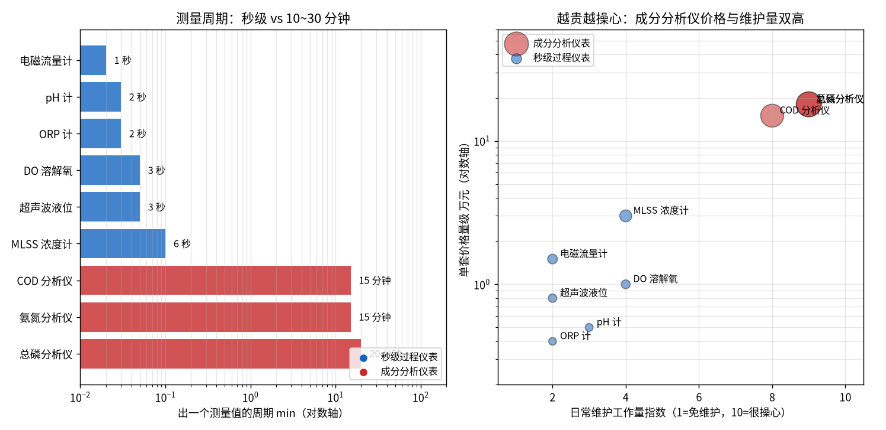
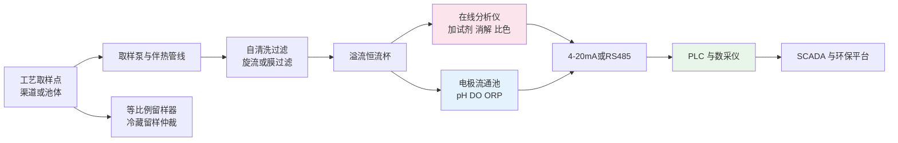
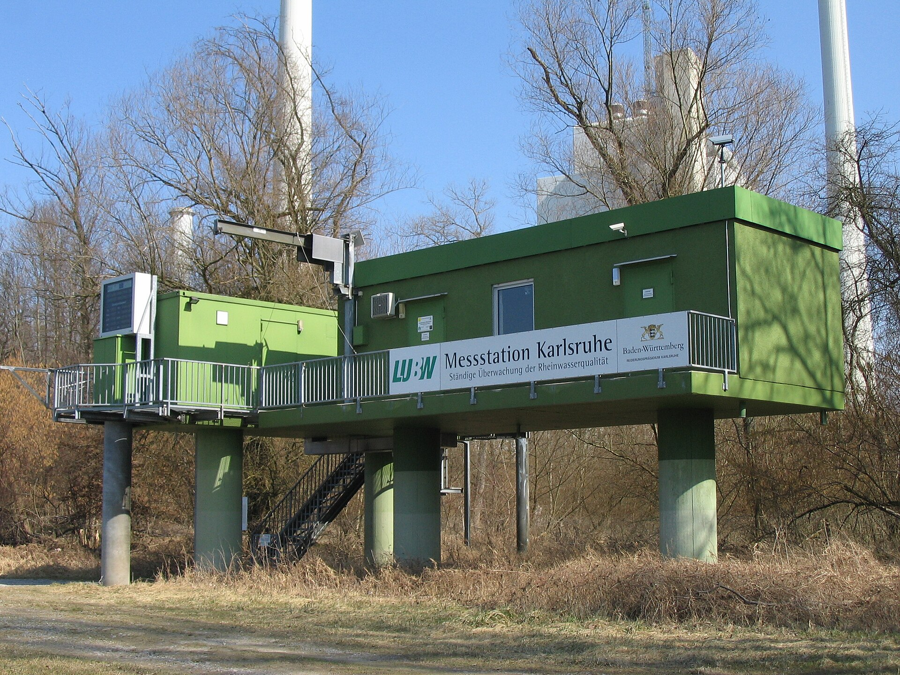

# 02-3 在线仪表：污水厂的"传感器眼睛"

> 本章讲什么：把污水厂所有常用在线仪表分成两大类讲透——秒级出数的"过程量仪表"和十几分钟出一份"验血报告"的水质成分分析仪；讲它们的原理一句话、装在哪、多少钱、怎么维护、坏的时候读数长什么样。
>
> 读完能干什么：看懂一份仪表采购清单的配置逻辑；现场能识别"假数据"的典型长相；理解为什么仪表测量周期会决定控制方案怎么设计（为 07 篇埋的伏笔）。
>
> 阅读时间：约 28 分钟。

---

## 一、一个会"撒谎"的总磷仪

某工业园污水厂，运行员发现连续三天出水总磷在线仪读数都"稳如老狗"地停在 0.20 mg/L——**稳得不正常**：白天黑夜一个样，负荷翻倍也不动。打开分析仪柜门一看：试剂瓶早在 10 天前就空了，仪器没报警，只是在用空气和纯水"空跑"流程，每次都给出一个接近空白值的数。数采平台照单全收，还因为这条曲线太平稳，在某次检查中被表扬"运行稳定"。

在线仪表是 AI 加药的眼睛。[00-2](../00-导读/00-2-五分钟看懂污水厂AI加药.md) 里那句冷水话值得再放一遍：**基准线 30%~50% 的厂，仪表数据本身不可信。** 给一双"老花眼+散光"装自动驾驶，不如不装。本章就带你把这些眼睛逐个检查一遍。

---

## 二、两类仪表：体温计 vs 验血报告

| 对比项 | ① 过程量秒级仪表 | ② 水质成分分析仪 |
|---|---|---|
| 类比 | 体温计、体重秤：随时测、秒级出数 | 医院验血：要取样、反应、等报告 |
| 典型周期 | 1~10 秒刷新一个数 | 10~30 分钟出一个数 |
| 测什么 | 流量、液位、DO、pH、ORP、MLSS、温度、压力 | COD、氨氮、总磷、总氮、正磷酸盐 |
| 原理路线 | 物理/电化学感应 | 取样 → 加试剂 → 消解/显色 → 比色（部分 UV 法） |
| 单套价格 | 0.3~4 万元 | 8~25 万元（含预处理系统） |
| 维护性格 | 擦一擦、校一校，多数很省心 | 换试剂、换管路、校曲线，像养宠物 |
| 在控制里的角色 | 适合做实时反馈/前馈信号 | 只能做慢速反馈与考核依据，需配前馈 |

先逐个看第一类。

---

## 三、秒级过程仪表：八个"现场哨兵"

### 3.1 电磁流量计——全厂用水的"自来水表"

- **原理一句话**：导电液体流过磁场产生感应电压，电压与流速成正比（法拉第电磁感应定律），污水天然导电，所以它是污水厂用得最多的流量计。
- **价格量级**：管径 DN100~600 的整机约 0.8~3 万元，进口品牌（E+H 等）更高。
- **安装位置**：进水总管（进水流量是所有前馈模型的第一输入）、回流污泥管、加药后稀释水管；要求**满管**安装，上游留 ≥5 倍管径直管段、下游 ≥3 倍（前五后三），附近大功率设备做好接地。
- **日常维护**：基本免维护；定期看电极结垢（油脂、钙垢会让读数偏低）、检查接地和空管报警。
- **故障读数长相**：未满管时读数乱跳或为零；电极结垢读数整体偏低且变化迟钝；管道上方不满流却报"有流量"。

### 3.2 超声波/雷达液位计——不接触就能量身高

- **原理一句话**：超声波靠声波往返时间、雷达靠微波反射时间换算液面距离，都装在罐顶或渠顶，**不碰药液**。
- **价格量级**：0.3~1.5 万元；雷达稍贵但抗蒸汽、抗泡沫能力强。
- **安装位置**：药剂储罐、集水池、泥斗、巴氏计量渠上方。
- **日常维护**：擦探头下方的结露与挂料；注意罐内搅拌涡流、蒸汽、泡沫会"骗"回波。
- **故障读数长相**：PAM/曝气池泡沫厚时读数钉死在某值或上下乱跳；蒸汽弥漫时系统性偏高；罐顶有横梁/梯子进波束会出现假液位。

### 3.3 DO 溶解氧仪——曝气池的"呼吸监测仪"

两种主流原理要分清：

- **极谱法（覆膜电极）**：氧透过薄膜扩散到电极产生电流，电流大小正比于氧浓度。要换电解液、换覆膜，膜破即坏，开机有极化等待时间（约 10~30 min），单价约 0.5~1 万元。
- **荧光法（光学法）**：蓝光激发荧光帽，氧气越多荧光熄灭（猝灭）越快，测衰减时间即得氧浓度。不用电解液、不用换膜、响应快（秒级），荧光帽 1~2 年更换，单价约 0.8~2 万元，是新建厂主流。
- **安装位置**：曝气池各廊道前端/末端，浸没式或可伸缩插拔支架（不排空就能提上来擦）。
- **故障读数长相**：膜头污染/荧光帽老化 → 读数系统性偏低且校正不动；电缆进水 → 读数钉死在 0 或顶格乱跳；曝气过大时读数贴满量程 8~10 mg/L 是工艺问题不是表坏。

### 3.4 pH 计——最朴素也最容易被忽视

- **原理一句话**：玻璃电极两侧氢离子浓度差产生电位，按能斯特方程换算 pH（每变化 1 个 pH 约 59 mV）。
- **价格量级**：0.2~0.8 万元（含电极）。
- **安装位置**：进水、生化池、出水、中和反应池；多装在流通池或可伸缩支架上。
- **日常维护**：每月两点校准（pH 4/7 或 7/9 标液）；电极头保持湿润（干放即报废）；高 SS 水配自清洗刷或压缩空气吹扫。
- **故障读数长相**：电极污染 → 响应慢、曲线"发肉"，pH 卡在中性附近不动；电极破裂/接线断 → 读数钉在 0 或 14；低温下响应变慢属正常。

### 3.5 ORP 氧化还原电位计——看不见的"气氛组"

- **原理一句话**：测溶液得失电子倾向的电位（mV），反映体系处于氧化态还是还原态。
- **价格量级**：0.2~0.6 万元，常与 pH 做成一体电极架。
- **安装位置/用途**：厌氧/缺氧段判断反硝化是否充分（ORP 约 -50~-200 mV 是经验窗口）、消毒段看氧化性、厌氧释磷段监控；它是**趋势判断仪表，不用于精确计量**。
- **故障读数长相**：电极中毒（硫化物等）→ 电位长期漂移、对工况变化无反应；与 pH 类似，污染后曲线迟钝。

### 3.6 MLSS 污泥浓度计——给微生物"称体重"

- **原理一句话**：光照射混合液，被污泥颗粒吸收/散射的光量换算悬浮固体浓度（mg/L）。
- **价格量级**：0.8~4 万元。
- **安装位置**：曝气池（测污泥浓度指导排泥）、回流污泥、二沉池进水。
- **日常维护**：擦光学窗口（污泥黏附是最大误差源）；用实验室重量法（105 ℃ 烘干称重）定期比对修正系数。
- **故障读数长相**：窗口挂泥 → 读数单调爬升、擦完立刻下降；气泡团经过 → 锯齿状尖峰；污泥颜色/性质大变（如工业废水）后偏差变大，需重新标定。

### 3.7 温度与压力——藏在其他设备里的"配角"

- **温度**多为 Pt100 铂热电阻（电阻随温度变），常集成在 DO/pH 探头里，是生化模型和曝气计算的必要参数；故障时显示 -50 ℃ 或满量程跳变。
- **压力变送器**多为扩散硅/电容式带膜片（0.1~0.8 万元），装在风管、水泵出口、加药管路上；故障读数常见 4 mA 钉死（断线/断电，工程量显示为量程下限负值或零）或 20 mA 顶格。

把这八个哨兵汇总：

| 仪表 | 刷新速度 | 典型价格 | 头号维护项 | 最典型的假数据长相 |
|---|---|---|---|---|
| 电磁流量计 | 秒级 | 0.8~3 万元 | 电极除垢、满管 | 非满管乱跳；结垢整体偏低 |
| 超声波/雷达液位 | 秒级 | 0.3~1.5 万元 | 清探头、避泡沫蒸汽 | 泡沫/蒸汽时钉死或乱跳 |
| DO（荧光/极谱） | 秒级 | 0.5~2 万元 | 荧光帽/膜头维护 | 老化偏低；断线钉 0 或顶格 |
| pH | 秒级 | 0.2~0.8 万元 | 两点校准、防干放 | 污染后曲线迟钝；断裂钉 0/14 |
| ORP | 秒级 | 0.2~0.6 万元 | 电极清洗 | 中毒后对工况无反应 |
| MLSS | 秒级 | 0.8~4 万元 | 擦光头、重量法比对 | 挂泥爬升、气泡尖峰 |
| 温度 Pt100 | 秒级 | 0.05~0.2 万元 | 基本免维护 | 断线显示极端值 |
| 压力变送器 | 秒级 | 0.1~0.8 万元 | 防冻防堵 | 钉 4 mA 或 20 mA |

### 3.8 探头的三种安装形式：选错形式等于白买

- **浸入式（直接插池子）**：DO、pH、MLSS 用得最多，探头长期浸没，配可伸缩插拔支架和自清洗刷/空气吹扫；优点是测得真，缺点是天天泡脏水、维护量最大。
- **流通式（装在流通池里）**：取样泵把水抽上来，探头插在小水池/管道侧壁上测，pH、ORP、余氯常用；探头环境好、易校准，但前提是取样系统可靠（见 4.2），否则测的是"管中水"不是"池中水"。
- **插入式/管段式（夹在管道上）**：电磁流量计、压力变送器属此类，随管道安装，要求满管、留直管段、做好接地。

选型时连安装附件一起算预算：插拔支架、自清洗装置、球阀、安装短管加起来常达探头价格的 20%~40%，省掉它们，探头半年后就提不上来、擦不干净。
另外一个采购细节：同一测点尽量只保留一个"权威数据源"。现场常见电磁流量计和明渠堰液位算流量并存、两台 DO 仪读数打架，运行员哪个顺心眼认哪个——进模型前必须在点表里指定唯一主用源，备用源只做比对。

> 💡 **现场经验：判别"表坏了"还是"工艺真变了"的三板斧**
> ①看曲线形状：真实工艺变化是平滑渐变，仪表故障多为**钉死、顶格、台阶、密集毛刺**；②做"物理动作"验证——提 DO 探头到空气里应快速升到 8 mg/L 左右，拿 pH 电极放进标液应在 1~2 分钟内走到标称值，不动就是表的问题；③横向比对——进水流量与提升泵电流、MLSS 与二沉池负荷之间都有常识相关性，一个数"背叛"了所有相关量，先怀疑表。

---

## 四、水质成分分析仪：一台会自己做化验的机器

COD、氨氮、总磷、总氮这类指标，本质是化学浓度，秒级物理方法测不了（除非用 UV 间接估）。在线分析仪就是把化验员"请进了一个铁柜子"。

### 4.1 试剂比色法一句话原理

> **自动抽取一小份水样 → 加专用试剂反应/消解 → 生成有色物质 → 测光透过程度（比色）→ 颜色深浅换算浓度。**

各指标的典型方法路线（国标方法的自动化）：

| 指标 | 典型在线方法 | 显色/测量原理一句话 | 典型周期 |
|---|---|---|---|
| COD | 重铬酸钾氧化比色法（主流） | 高温强酸消解把有机物氧化，六价铬变黄/三价铬变绿，比色定量 | 15~30 min |
| 氨氮 | 水杨酸/纳氏试剂比色，或气敏电极法 | 氨与试剂生成蓝绿色化合物，颜色越深氨氮越高 | 10~20 min |
| 总磷 | 过硫酸钾消解 + 钼酸铵分光 | 先把各种磷氧化成正磷酸盐，再与钼酸盐显蓝色 | 15~25 min |
| 总氮 | 碱性过硫酸钾消解 + 紫外检测 | 各种氮氧化为硝酸盐后在 220 nm 紫外测量 | 20~30 min |
| 正磷酸盐 | 不经过消解，直接钼酸盐比色 | 只测"现成的"正磷酸盐，省掉消解、出数快 | 8~15 min |

**正磷酸盐在线仪**近年在智能除磷项目里特别受重视：它不做消解、周期短（8~15 min），装在生化池出水或二沉末端，能更快反映"此刻的磷负荷"，比总磷仪更适合做前馈/快速反馈——代价是测的只是总磷的一部分，和考核口径的总磷存在比例关系，需要用化验数据回归修正（这正是 [05-3](../05-数据篇/05-3-软测量-用便宜仪表猜贵指标.md) 软测量要解决的问题）。

另有 **UV 法（紫外吸收法）COD/有机物仪**：不加重铬酸钾试剂，靠 254 nm 紫外吸收间接估 COD，免试剂、出数秒级、几乎不耗耗材；但遇上成分复杂的工业废水（浊度、特定有机物干扰）偏差大，**适合水质稳定的市政厂做趋势监控，不能完全替代国标法的考核仪**。

### 4.2 分析仪的"半条命"在取样预处理系统

分析仪本体再贵，喂给它的水样不行也白搭。一套完整的取样系统包括：

- **取样泵 + 取样管线**：从工艺点连续抽水到仪表间，管线尽量短（通常要求单程滞后 3~10 min 以内），伴热防冻；
- **前置过滤/旋流分离**：用膜过滤或自清洗过滤器除掉泥沙纤维，保护精密阀管；
- **溢流杯/恒流槽**：保证进水压力、流量恒定，多余水样溢流回工艺；
- **流通池**：电极类探头（pH/DO/ORP）插在恒定流动的小池子里测量。

维护节奏（典型经验值）：试剂瓶根据测量频率 **2~8 周**更换一次；蠕动泵管 3~6 个月；测量室和管路每周~每月清洗；仪器带自动校准（用标液）与自动清洗（水/毛刷），但每月仍需人工用实验室国标法比对一次；产生的**废液**是危废，必须桶收集、台账登记、委托处置——直接排掉是违法行为。

采购分析仪时容易漏算三笔钱：一是**试剂年费**（按测量频率，单台每年 0.8~2 万元不等，测量越密越贵）；二是**预处理和站房配套**，总价可能与仪器本体相当；三是**运维服务费**（很多厂直接买厂家年度运维包，单台每年 1~2 万元）。把这三笔钱和采购价加在一起，才是分析仪的真实身价——这也是行业拼命发展免试剂 UV 法和软测量（[05-3](../05-数据篇/05-3-软测量-用便宜仪表猜贵指标.md)）的经济动力。

### 4.3 价格与身价对比

*数据为国内市政厂常见工程经验区间的中值（实算脚本 fig02_03 生成）：成分分析仪单台 15~20 万元、10~30 分钟才出一个数，维护工作量指数也是最高的一群；秒级仪表便宜、出数快、维护轻。品牌上进口常见哈希 HACH、E+H、WTW、ABB，国产聚光科技、力合等近年在市政在线监测市场占有率很高。

### 4.4 一座 10 万吨厂的典型仪表配置（点表雏形）

下表是一个典型配置量级，正式项目的完整点位表在 [05-1](../05-数据篇/05-1-数据从哪来-点位表与数据字典.md) 展开：

| 监测位置 | 典型仪表配置 | 数量量级 |
|---|---|---|
| 进厂总管/提升泵房 | 电磁流量计、pH、温度、COD、氨氮 | 各 1~2 套（考核+前馈） |
| 生物池各廊道 | DO（每廊道 1~3 个）、MLSS、ORP、温度 | DO 4~10 个，其余 1~3 个 |
| 鼓风机空气管 | 压力变送器、空气流量计、温度 | 1~3 套 |
| 二沉池/深度处理前后 | 正磷酸盐、总磷、浊度、流量 | 各 1~2 套 |
| 出水口（考核断面） | COD、氨氮、总磷、总氮、流量、pH | 各 1 套，联网数采仪 |
| 加药间各储罐 | 超声波/雷达液位计 | 每罐 1 个 |

配置思路一句话：**考核仪表按法规配齐，过程仪表按控制点配足，前馈仪表宁可前移多装一个便宜的（正磷酸盐/流量），也别只盯着昂贵的出水考核仪。***

> ⚠️ **老工程师的坑：分析仪的四个"静默失效"模式**
> ①**试剂耗尽/变质**（本章开头的空瓶事故），仪器照样出数——对策：试剂余量进巡检表，报警必须接到中控；②**取样泵堵转或滤膜糊死**，仪器在反复测一杯"死水"——对策：看进水流量指示和溢流杯；③**标液过期+自动校准失败被忽略**，曲线慢慢漂，靠每月人工国标比对兜底；④**测量室结垢/光源老化**导致整体偏低。这些故障都不会让仪表"罢工"，而是让它**一本正经地胡说八道**，比坏掉更危险。判断诀窍还是那条：该动的时候不动、与化验室比对超差，就停用挂牌，绝不拿假数进模型。

---

## 五、仪表装在哪，决定了控制怎么做（07 篇的伏笔）

仪表不是买了就行，**测量点与投加点之间的水力停留时间（HRT），决定了数据的"保鲜期"**。

以化学除磷为例，典型布置是：除磷剂投加在生物池出水渠或深度处理混合池，而考核口径的总磷仪装在全厂出水口。药从投加点走到出水仪表，沿途经过混合、反应、沉淀/过滤，**水力停留时间常见 1~4 小时**；总磷仪本身还有取样滞后 5~10 min + 分析周期 15~25 min。等出水总磷读数上升时，反映的是 1~4 小时前的投加决策——这正是 [00-2](../00-导读/00-2-五分钟看懂污水厂AI加药.md) 里"洗澡调水温"困境的数据版本。

由此得到三条工程结论（[07 篇](../07-控制优化篇/07-1-从开环建议到闭环控制-三种架构.md) 展开）：

1. **只看出水总磷调泵 = 看着后视镜开车**，必然靠过量投加保安全；智能控制必须把测量点前移到投加点附近（正磷酸盐、MLSS、进水负荷），用前馈吃饭；
2. 仪表周期要和控制周期匹配：秒级仪表可以撑起分钟级回路，成分分析仪只能撑起小时级修正和模型校验，不能拿 20 分钟一个数的总磷仪做秒级 PID；
3. 每个数据在送进模型前都应带上**时间戳和位置标签**，05 篇讲点表时会把"测量点—投加点—滞后时间"做成数据字典里的正式字段。

用一个时间线例子感受这种错位（典型经验值，具体厂以实测 HRT 为准）：

- 08:00 早高峰总磷负荷进厂，进水流量和正磷酸盐秒级/快周期仪表立刻抬头；
- 08:05~08:30 除磷剂在混合反应区起作用，这段时间出水总磷仪什么都不知道；
- 09:00~12:00 这股水经过沉淀、过滤陆续走到出水口，总磷仪才开始反映变化，而且每 20 分钟才更新一个数；
- 如果运行员 09:30 看到出水读数上升再加大药量，加的其实是 09:30 以后的水——08:00 那股冲击的"锅"，新药量背不到；等读数回落再减药，又必然过量。

这条时间线解释了一个反直觉的现象：**仪表越贵、越是"考核级"，反而越不能直接当控制信号用**——考核仪表装在最远的出水口，时间上最"旧"；控制要用的是装在负荷源头、出数快的"便宜信号 + 模型"组合。

---

## 六、采样系统、留样器与仪表间

除了在线测量，还有两类"沉默设备"：

- **自动（等比例）采样器/留样器**：按流量比例把全天水样攒成混合样供化验室测日均值，并可冷藏保留 24~72 h 的分瓶样。出水超标纠纷、仪器数据仲裁时，留样是法定证据之一；环保比对监测也依赖它。 常见两种模式：时间等比例（每隔固定时间采固定体积，适合流量平稳厂）和流量等比例（采多少与当时流量成正比，算日均值最准），后者对评估真实污染物总量更可靠。
- 现场还有一台不显眼但关键的设备：**数采仪（数据采集传输仪）**，它把考核仪表的数据按环保平台规约（如 HJ 212）实时上传生态环境部门，断网、断电、修改数据都有痕迹——这也是厂区里唯一"不归厂里自己说了算"的数据出口。
- **仪表间（在线站房）**：成分分析仪集中安装的房间，要求夏天空调 25 ℃ 左右（试剂怕热）、上下水与纯水供应、试剂柜上锁、废液桶防泄漏、UPS 不间断电源（断电不丢数据、不中断测量）、数采仪联网上传环保平台。站房管理水平几乎决定了成分分析仪的数据质量上限。

取样点的选择本身就是学问：进水采样点要在格栅/沉砂之后、水质混合均匀的溢流断面，避开回流和死角；出水采样点必须在环保部门认定的考核断面（通常在总排放口计量堰/渠处），采样头淹没深度随水位可调。采样管线超过 30~50 m 时，滞后和挂壁污染会明显加重，宁可把站房建得靠近工艺构筑物。

按环保验收要求，重点排污单位的考核仪表还要定期做**比对监测**：有资质的检测机构用实验室国标法取瞬时样/混合样，与在线仪同时读数，误差落在规范允许范围内才算合格（COD、氨氮、总磷等指标各有相对误差要求，具体以现行 HJ 标准为准）。AI 项目更严格——模型入模前建议连续收集 2~4 周在线值与化验值的成对数据，专门评估这个偏差，偏差大的点位先修表再建模。

下面这张图把"水从工艺点到变成一个数"的完整路径画出来：

*真实照片：莱茵河畔的自动水质监测站（德国 Karlsruhe 附近）。本章讲的在线分析柜就安装在这类站房内，自动取样、分析、远传。图片来源：Wikimedia Commons，作者 Kucharek，公有领域（Public Domain）。*

---

## 七、本章小结

1. 仪表分两类：**过程量秒级仪表**（流量/液位/DO/pH/ORP/MLSS/温度/压力，0.3~4 万元，省心）与**水质成分分析仪**（COD/氨氮/总磷/总氮/正磷酸盐，8~25 万元，10~30 min 出数，靠试剂和勤维护）。
2. 成分分析仪的本质是"自动化验员"：**取样 → 加试剂 → 消解显色 → 比色换算**；正磷酸盐仪不消解、出数快，适合做智能除磷的快速前馈；UV 法免试剂但只适合稳定水质做趋势。
3. 分析仪一半的故障在**取样预处理**和**静默失效**（试剂空了照样出数）；每月用实验室国标法人工比对、试剂余量与校准失败报警进中控，是数据可信的底线。
4. 识别假数据三招：看曲线形状（钉死/顶格/毛刺）、做物理动作验证（探头入空气/标液）、与相关量横向比对。
5. **测量点位置决定控制方案**：出水仪表滞后于投加点 1~4 小时，只能做考核与慢速修正；智能加药必须把秒级/快速仪表前移做前馈——这条线在 [07 篇](../07-控制优化篇/07-1-从开环建议到闭环控制-三种架构.md) 收口。

---

**上一章：** [02-2 计量泵、管路与溶配药系统](./02-2-计量泵管路与溶配药系统.md)
**下一章：** [02-4 PLC 与 SCADA：数据怎么采、控制怎么做](./02-4-PLC与SCADA-数据怎么采控制怎么做.md)
