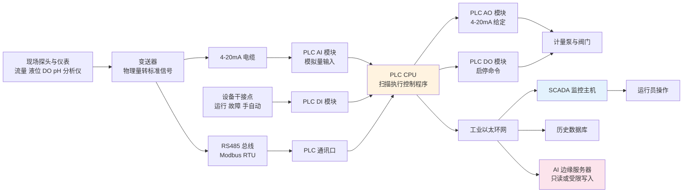
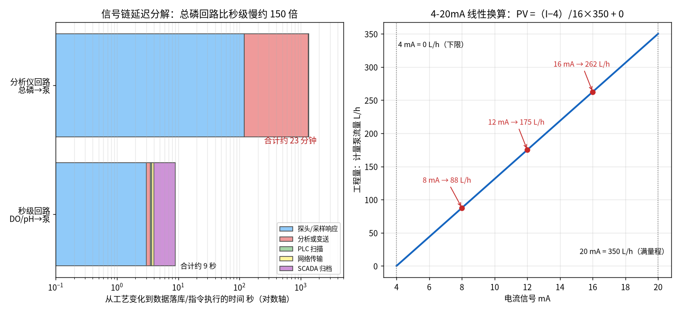
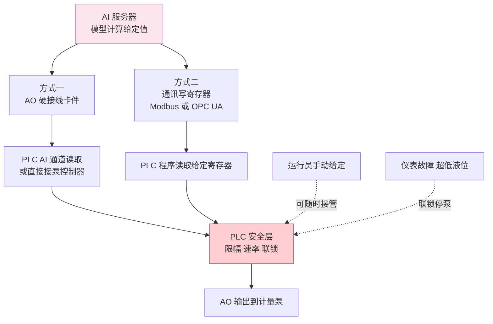
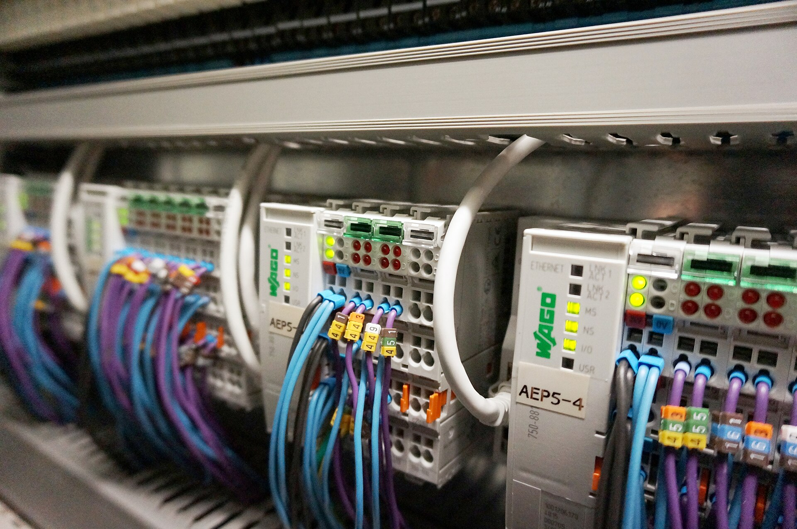

# 02-4 PLC 与 SCADA：数据怎么采、控制怎么做

> 本章讲什么：带你走完一滴水身上的传感器信号变成中控大屏曲线、再变成泵的动作的完整链路；讲清 PLC 的四类模块、扫描周期、4-20mA 工程量换算、手自动三档切换、SCADA 四大画面、四种通讯协议怎么选，以及 AI 系统接进 PLC 的两种方式和责任边界。
>
> 读完能干什么：看懂控制柜接线图里 AI/AO/DI/DO 的含义；能手算 4-20mA 与工程量互算；看懂一份点表；和自控集成商、IT 安全人员对话不发怵，知道 AI 项目该在哪一侧划线。
>
> 阅读时间：约 30 分钟。

---

## 一、点击鼠标之后，1 秒钟内发生了什么

污水厂中控室，运行员在 SCADA 画面上把 1# PAC 泵的频率给定从 45% 改成 55%，敲下回车。他看到的只是数字跳了一下，背后 1 秒钟内依次发生了：

1. SCADA 把"55%"这个数通过以太网写进现场 **PLC**（可编程逻辑控制器，可理解为厂里的"工业电脑管家"）的寄存器；
2. PLC 下一次扫描读到这个数，换算成对应电流值，通过 **AO 模块**输出一个电流；
3. 电流沿屏蔽电缆到达计量泵控制器，泵的冲程频率改变；
4. 泵的运行/故障干接点和频率反馈经 **DI/AI 模块**返回 PLC，再上传 SCADA；
5. SCADA 画面上泵的颜色变化、趋势曲线延伸，这条新数据同时被写进**历史数据库**，几年后都能翻出来。

而在没有人点鼠标的时候，这个循环也在不停自转：上百个探头的数据被采进来、控制程序每几十毫秒跑一遍、报警被判断、数据被归档。本章把这条链路的每一环讲清楚。

---

## 二、完整信号链：从探头到历史库

信号链可以拆成"**采、算、传、显、控**"五段：仪表/变送器负责采，PLC 的 CPU 负责算（联锁、PID、给定），工业网络负责传，SCADA/历史库负责显和存，AO/DO 负责控。下面逐段展开。

---

## 三、PLC 的四类"抽屉模块"：AI、AO、DI、DO

PLC 主机架上插着一排排模块，名字听着玄，其实按信号方向和类型只有四类：

| 模块 | 全称 | 传什么 | 典型现场信号举例 |
|---|---|---|---|
| AI | 模拟量输入 Analog Input | 连续变化的电流/电压 | 液位计、流量计、DO/pH、分析仪 4-20mA；泵实际频率反馈 |
| AO | 模拟量输出 Analog Output | PLC 给设备的连续给定 | 计量泵频率给定、变频器转速给定、调节阀开度 |
| DI | 数字量输入 Digital Input | 只有通/断两种状态的触点 | 泵运行、故障、手/自动位置、急停按钮、液位开关 |
| DO | 数字量输出 Digital Output | 继电器/晶体管通断命令 | 泵启停、阀门开关、声光报警器、备用泵自启 |

记忆法：**I 是进 PLC（现场告诉 PLC），O 是出 PLC（PLC 指挥现场）；A 是连续量，D 是开关量。** 一台加药间 PLC 的典型点数：十几路 AI（各罐液位、流量、仪表读数、泵反馈）+ 几路 AO（泵频率给定）+ 几十路 DI/DO（泵的启停、运行、故障、切换）。点数和模块槽位选型时都要留 15%~20% 余量，后期加一台泵不至于换主机。

品牌生态上，常见西门子 S7-1200/1500（中大型项目主流）、施耐德 M340/M580、罗克韦尔（AB，欧美资业主偏好）、国产和利时、汇川等。对加药改造项目，S7-1200/1500 这一档的中小型 PLC 完全够用，关键是编程规范、点表完整、程序注释齐全——AI 项目后期 80% 的对接时间花在读懂别人写的程序上。

---

## 四、PLC 扫描周期：PLC 做事是"翻页式"的

PLC 不像电脑多任务并发，它像翻书一样一遍一遍循环，一个循环叫一个**扫描周期**，每页固定三步：

1. **输入采样**：把所有 AI/DI 通道此刻的值锁进输入映像区；
2. **程序执行**：CPU 从上到下跑一遍用户程序（联锁判断、PID 运算、通讯读写）；
3. **输出刷新**：把结果一次性送到 AO/DO 通道。

加药类工艺控制的扫描周期典型 **100~500 ms**（大型全厂 PLC 多在 10~200 ms），对分钟级甚至小时级的加药过程绰绰有余；真正要快的是急停和电气联锁（硬接线或高速任务，毫秒级），那种回路绝不能绕经网络和上位机。理解扫描周期有两个实用点：

- 同一周期内程序读到的输入是"同一帧快照"，不会前半段读到新值后半段读到旧值，这是 PLC 比 PC 直连可靠的原因之一；
- **数据时间戳只精确到归档周期**：SCADA 每 5 秒存一次库，你看到的"秒级"DO 曲线其实是 5 秒一个点——做 AI 特征工程时必须知道每个点的真实采样/归档间隔（[05-2](../05-数据篇/05-2-数据质量治理-脏数据的九种死法.md) 会用到）。

---

## 五、4-20mA 与工程量：全章最该动手算的公式

### 5.1 为什么偏偏是 4~20 mA

电流信号抗干扰、能传几百上千米，且 **4 mA 是"活零点"**：仪表正常工作时最低也要耗 3.5~4 mA，所以一旦线路上电流掉到 0~3.6 mA，系统立刻知道断线/断电了——这是 4-20mA 沿用几十年的原因。约定：**4 mA 对应量程下限，20 mA 对应量程上限**。

### 5.2 换算公式与两个完整算例

> **工程量 PV =（I − 4）÷ 16 ×（URV − LRV）+ LRV**
>
> 反变换：**I =（PV − LRV）÷（URV − LRV）× 16 + 4**

符号含义：I 为电流（mA）；LRV/URV 是量程下限/上限（工程单位）；16 = 20 − 4 mA。

**算例 A（读液位）**：某 PAC 罐液位计量程 0~6 m，接入 AI 通道实测 12 mA。

- PV =（12 − 4）÷ 16 ×（6 − 0）+ 0 = 0.5 × 6 = **3.0 m**
- 即罐子半满。10 mA 对应 2.25 m，20 mA 对应 6 m，电流 3.8 mA 以下直接判"断线故障"而不是负液位。

**算例 B（控泵，与 [02-2](./02-2-计量泵管路与溶配药系统.md) 选型算例同一台泵）**：400 L/h 泵按最大需求 350 L/h 设工程量量程 0~350 L/h，PLC 想让它打 175 L/h：

- 查表：8 mA → 87.5 L/h、12 mA → 175 L/h、16 mA → 262.5 L/h；
- 反算 AO 应输出：I =（175 − 0）÷ 350 × 16 + 4 = 0.5 × 16 + 4 = **12 mA**。

这说明一个重要的实施细节：**PLC 里的量程必须和现场仪表/泵控制器的量程一一对应**。液位计本体拨码是 0~6 m、PLC 组态成 0~5 m，所有读数就会整体偏高 20%——AI 模型拿到的就是系统性错误数据。量程核对是点表审查的第一道关。

### 5.3 模拟量通道的三个接线常识

- **两线制 vs 四线制**：两线制仪表的供电和信号共用一对线（24 V 直流供电，电流同时承载 4-20mA 信号），液位/压力变送器最常见；四线制仪表供电与信号线分开，大型分析仪多属此类。PLC 通道卡件拨码和组态必须与仪表一致，接错轻则无数、重则烧通道。
- **屏蔽层单端接地**：4-20mA 电缆用屏蔽双绞线，屏蔽层只在 PLC 柜侧单端接地，两端接地会形成地环流，反而引入干扰——模拟量信号跳变的疑难杂症，三成以上出在接地和与动力电缆同桥架上。
- **信号隔离器/安全栅**：加药间腐蚀潮湿、电位复杂，重要回路在柜内加装模拟量隔离器（每路百来元），把现场与 PLC 电气隔开，抗干扰、防反接、防地电位差，是便宜的保险。

*实算脚本 fig02_04 生成：左为两条回路各环节延迟的数量级对比——秒级回路（DO/pH→泵）全链约 9 秒，总磷分析仪回路仅"分析周期"一项就 20 分钟、全链约 22.5 分钟；右为 0~350 L/h 泵的 4-20mA 线性换算示意。数字为典型经验值，具体项目以实测为准。*

---

## 六、就地 / 远程 / 自动：三档切换与运行员的心理

每个受控设备在电气上都有一个三位置转换开关，这是自控系统与人之间最重要的"交权界面"：

| 档位 | 谁说了算 | 用在什么时候 |
|---|---|---|
| 就地（机旁手动） | 设备旁按钮箱，PLC 命令被旁路 | 检修、单机试车；设备故障兜底 |
| 远程手动（远控） | 运行员在 SCADA 上点鼠标，PLC 只转发不决策 | 工艺调整、自动回路投运初期、异常工况 |
| 自动 | PLC 程序/AI 给定直接驱动设备 | 稳定工况下的连续运行 |

切换必须遵循两条工程铁律：

1. **就地优先级最高**：任何自动指令都不能越过就地停止按钮——检修时把开关打到就地并挂牌（LOTO，上锁挂牌），设备才不会被远程误启动；
2. **无扰切换（bumpless transfer）**：手动切自动的瞬间，自动回路的初始给定要"接住"当前实际输出，而不是从程序默认值开始，否则泵会突然猛跳。

> 💡 **现场经验：运行员为什么"不敢用自动"**
> 很多 AI 加药项目失败在人机信任，而不是算法。运行员的心理账很朴素：①我在这个厂十年，凭什么信一个我看不见怎么算的黑盒？②自动投得好好的没人夸我，一旦自动闯祸（哪怕是仪表坏了导致的），责任算谁的？所以默认动作就是切回手动、自己守着。破局只有三招：让建议值**可解释**（前馈量、预测值、安全限幅都在画面上摆着）；让切换**零成本**（一键切手动，手动用多久都不报警催你）；让责任**有边界**（联锁兜底在 PLC，AI 永远不能越权，见第八节）。[08-3](../08-落地实施篇/08-3-安全联锁与人工接管.md) 专门讲这套接管设计。

---

## 七、SCADA 组态画面里都有什么

SCADA（数据采集与监视控制系统）是运行员面对的"游戏界面"，标准组态至少四类画面：

1. **工艺总览图**：按工艺流程画的全厂/分区图，设备用颜色表示状态（绿运行、红故障、灰停止），管道有流动动画，关键数值实时浮在设备旁；好的总览图一屏看完一个工艺段，差的图要翻八层弹窗。
2. **趋势画面**：任意点的历史曲线叠加（进水流量、总磷、泵频率画在一张时间轴上），支持回溯几小时到几年；运行员判断工况、工程师调 PID、AI 团队查问题，都靠它。
3. **报警画面**：分级报警（提示/警告/危险，如低液位、泵故障、出水逼近限值），带确认（ack）机制和报警颜色闪烁；高价值的报警必须"少而准"——几百条无效报警刷屏的结果是所有报警都被无视。
4. **报表系统**：班报、日报、月报自动生成（药剂消耗、累计流量、报警次数、运行时长），既是管理台账也是 [03-2](../03-问题与成本篇/03-2-污水厂成本账本-药剂到底花了多少钱.md) 算钱、[08-5](../08-落地实施篇/08-5-节能率怎么算-效益测量与验证MV.md) 算节能率的数据源。

背后还有一个容易被忽略的角色：**历史数据库**（如 PI、InSQL、国产实时库）。SCADA 画面只显示"现在"，历史库负责把每秒/每 5 秒的点永久存下（典型归档周期：快信号 1~5 秒、慢信号 30~60 秒，保存 1~5 年）。AI 建模用的历史数据 99% 从这里导出，所以**归档周期和时标准不准，直接决定模型能不能用**。

---

## 八、四种通讯协议：Modbus RTU/TCP、Profinet、OPC UA

仪表和 PLC、PLC 和上位机之间"说什么方言"，决定了对接成本：

| 协议 | 物理载体 | 性格一句话 | 典型用在哪 |
|---|---|---|---|
| Modbus RTU | RS485 双绞线，9.6~115.2 kbit/s | 最朴素的主从问答，地址+寄存器，便宜可靠，一挂多 | 在线分析仪、变频器、多参数仪表连 PLC |
| Modbus TCP | 工业以太网 | RTU 的网线版，速度快、距离远、交换机即可组网 | PLC 与上位机、智能设备、边缘网关 |
| Profinet | 工业以太网 | 西门子系实时总线，支持毫秒级运动控制与诊断 | 西门子 PLC 带远程 IO、变频器、智能泵 |
| OPC UA | 以太网（跨平台） | 不只是传数，还带着"这个点叫什么、什么单位、什么含义"的语义模型，安全加密 | PLC/SCADA ↔ MES、AI 平台、集团数据中台 |

选择口诀：**仪表层用 RTU/TCP 最省心，西门子生态内部用 Profinet 最顺，往上给 AI/MES 送数据用 OPC UA 最规范。** 老旧设备什么都没有？在柜里加一个协议网关（几百到几千元），把私有协议转成 Modbus TCP，这是改造项目的常规操作。

---

## 九、AI 系统怎么接 PLC：两种方式与一条责任边界

AI 服务器（边缘工控机）算完"该投 52 L/h"后，怎么把这个意志变成泵的动作？工程上只有两条主流路径：

- **方式一：模拟量硬接线（AI/AO 通道）**：AI 服务器配 AO 卡件，输出 4-20mA 给 PLC 的 AI 通道（或直接给泵）。优点是与传统仪表接线一模一样、PLC 程序几乎不改、断线安全（掉电流即报警回退）；缺点是每路一对线、信息量只有一个数。
- **方式二：通讯写寄存器（Modbus TCP / OPC UA）**：AI 把给定值写进约定好保持寄存器，PLC 程序主动读取。省卡件、可同时下发大量点、还能回读状态；缺点是强依赖网络和双方程序配合，要处理好通讯超时与默认值策略。

无论哪种方式，**责任边界只有一种划法，且必须焊死在 PLC 程序里**：

1. AI 只提供"设定值/建议值"，**绝不直接驱动 DO 启停设备**；启停、联锁权限永远在 PLC；
2. PLC 对 AI 给定做**上下限幅**（如 0~90%）和**变化速率限制**（每分钟最大变化量），异常指令天然被钝化；
3. 通讯中断、AI 崩溃、心跳丢失超过约定秒数，PLC 自动切到安全策略（保持当前值或切手动/切固定比例），并报警；
4. 运行员在 SCADA 上一键即可切手动，自动状态、当前给定来源（人/AI）全程留痕到历史库。

这套"AI 动嘴、PLC 动手、人能抢方向盘"的架构，是 [07-1](../07-控制优化篇/07-1-从开环建议到闭环控制-三种架构.md) 和 [08-3](../08-落地实施篇/08-3-安全联锁与人工接管.md) 的主线。

> ⚠️ **老工程师的坑：集成项目里最容易扯皮的三件事**
> ①**量程对不齐**：AI 侧以为 0~500 L/h、PLC 侧组态 0~350 L/h，上线第一天就过量投加——点表会审必须四方（工艺、自控、仪表、算法）签字；②**寄存器地址撞车**：AI 写的寄存器被别的程序复用，或者读写属性配反；③**安全层写在 AI 侧**：把限幅和联锁逻辑放在 Windows 工控机里，操作系统一更新/一蓝屏全线失守——**安全逻辑只能在 PLC 里**，工控机只是个"出主意的顾问"。

---

## 十、工控网络安全：AI 要上网，规矩先立好

污水厂是市政关键设施，工控网络（OT）与办公网络（IT）的边界必须管住，常识有六条：

1. **网络分区**：现场层（仪表/PLC）、监控层（SCADA/历史库）、办公/互联网层分层划 VLAN，层间用工业防火墙控制访问；
2. **数据上行用单向设备**：向环保平台、集团平台传数据走**网闸/单向光闸**或防火墙上只读策略，外部无法反向触碰 PLC（环保数采本身就要求这类隔离）；
3. **AI 服务器最小权限**：只开放它必须读写的寄存器/地址段，白名单 IP，默认只读、写入单独授权；
4. **U 盘管控**：工控网内严禁随意插 U 盘（摆渡病毒是真实事故源），确需导数据用专用杀毒摆渡机或堡垒机；
5. **补丁与变更窗口**：工控机不追新、不自动更新，任何程序下装、组态修改走审批和停机窗口，先备份；
6. **账号分级**：观察员、操作员、工程师、管理员密码分开，关键操作（改量程、改联锁值、强制点）全程审计留痕。

---

## 十一、点表：贯穿 02 篇到 05 篇的那份"总合同"

把本章所有知识落成一份工程文件，就是**点表（IO 清单/数据字典）**。每一个进系统的点，至少要登记：

- **位号**（如 FIT-101，F 流量/I 指示/T 变送/编号）、中文描述、所在工艺位置；
- IO 类型（AI/AO/DI/DO/通讯点）、信号制式（4-20mA、RS485、干接点）；
- **量程上下限与单位**、通讯地址（寄存器/站号）、扫描与归档周期；
- 关联设备、报警限值、是否入模型、数据质量规则。

点表是**仪表、电气、PLC 编程、SCADA 组态、AI 建模、运行维护六方共用的同一份合同**：现场接线照它接、组态照它建、模型照它取数、验收照它点数。现实项目中一半的数据烂账，源头都是点表缺失或与现场"两张皮"。点表怎么设计、每个字段怎么用，正是 [05-1](../05-数据篇/05-1-数据从哪来-点位表与数据字典.md) 的主题。

*真实照片：敞开的工业控制柜内景，WAGO PLC 与成排 IO 模块、彩色端子接线整齐排列。图片来源：Wikimedia Commons，作者 Pierre75000，CC BY-SA 4.0。*

---

## 十二、本章小结

1. 信号链五段：**采（探头/变送器）→ 传（4-20mA/RS485/以太网）→ 算（PLC 扫描周期 100~500 ms）→ 显存（SCADA/历史库）→ 控（AO/DO）**。
2. PLC 四类模块：**AI 读连续量、AO 给连续给定、DI 读开关状态、DO 下开关命令**；选型点数留 15%~20% 余量。
3. 4-20mA 换算：**PV =（I−4）÷16×（URV−LRV）+ LRV**；4 mA 活零点兼作断线检测；现场仪表量程与 PLC 组态必须逐点核对。
4. 手自动三档（**就地 > 远程手动 > 自动**）中就地最高优先、切换无扰；SCADA 四件套是总览、趋势、报警、报表，背后历史库决定 AI 数据质量。
5. 协议选择：仪表层 Modbus RTU/TCP，西门子生态 Profinet，对上给 AI 用 OPC UA；**AI 只给设定值、PLC 掌联锁限幅、人随时可接管**；工控网分区、网闸、U 盘管控是红线；一切以点表为总合同，详见 [05-1](../05-数据篇/05-1-数据从哪来-点位表与数据字典.md)。

---

**上一章：** [02-3 在线仪表：污水厂的传感器眼睛](./02-3-在线仪表-污水厂的传感器眼睛.md)
**下一章：** [03-1 传统加药怎么投：老师傅经验操作全揭秘](../03-问题与成本篇/03-1-传统加药怎么投-老师傅经验操作全揭秘.md)
