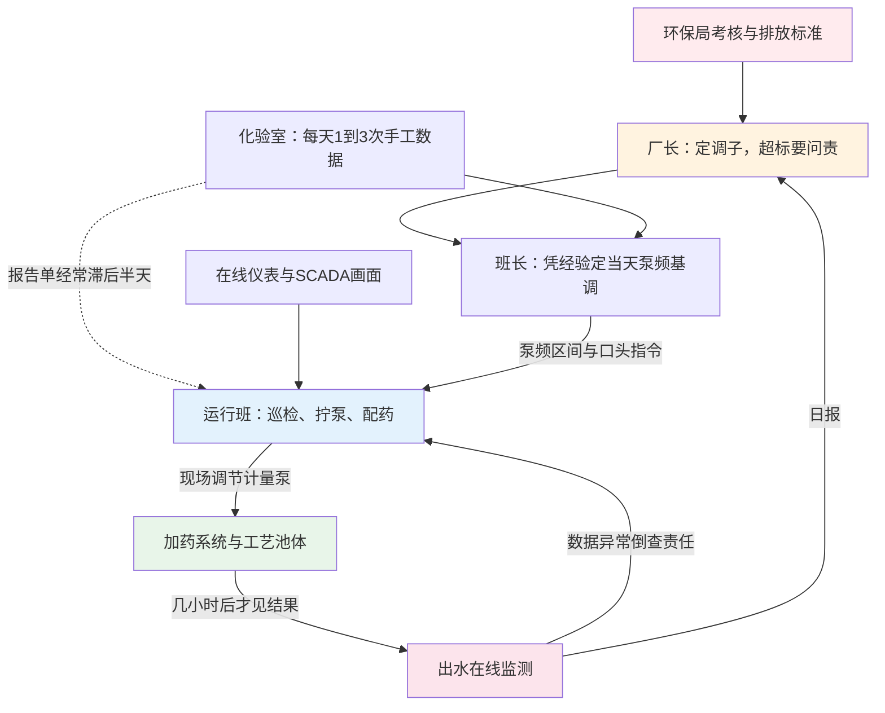
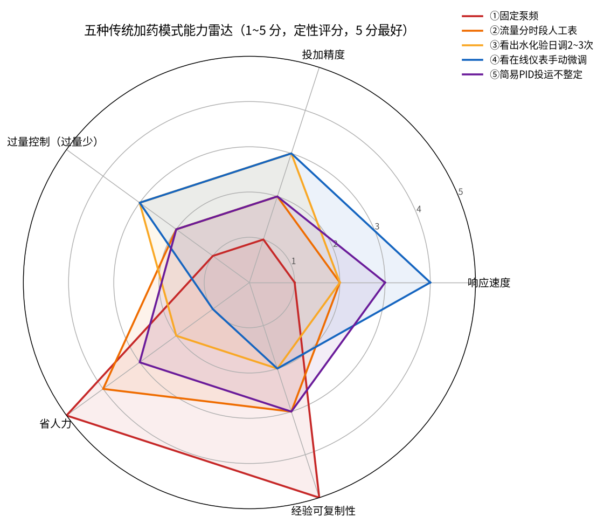
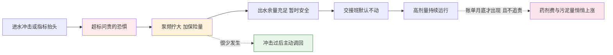

# 03-1 传统加药怎么投：老师傅经验操作全揭秘

> 本章白描一座传统市政污水厂 24 小时真实的加药操作：谁下令、谁动手、谁化验、谁担责，泵在什么模式下转，交接班交什么，夜里和节假日大家是什么心态。
>
> 读完你能看懂：一座没有 AI 的厂，加药这件事到底是怎么被"人"扛下来的；老师傅的经验里哪些是真功夫、哪些是被考核逼出来的坏习惯。
>
> 阅读时间：约 20 分钟。

---

## 场景导入：早上七点的加药间

早上六点五十，天刚亮。运行工老李披着军大衣，先不进中控室，而是绕到厂区西南角那间飘着淡淡氯味的小平房——**加药间**。

他要做三件事：看一眼 PAC（聚合氯化铝，最常用的化学除磷剂）吨桶还剩多少，用手电照一下计量泵（可以精确调节流量的往复式小泵）有没有漏液，再伸手摸一下泵头烫不烫。然后回到配电柜前，把除磷泵的频率从夜班留的 32 Hz 拧回到 35 Hz——白班进水大，这是他干了十二年的"肌肉记忆"。

没有人告诉他此刻进水总磷是多少。他也不知道这一拧，今天会多加还是少加。他只知道：**早高峰快来了，拧大一点，心里踏实**。

*真实照片：加药撬块上成排的计量泵与就地控制箱。现实中绝大多数投加量调整，就是在这样的设备上由人一旋钮一旋钮完成的——注意泵组上方的压力表和一用一备配置。图片来源：Wikimedia Commons，作者 McFly211，CC BY-SA 4.0。*

这一章，我们不批判、不美化，就把这件事原原本本讲清楚。

---

## 一、一座传统厂，四个当班人

很多人以为加药是"一个工人看泵"，其实它是一条四个人串起来的决策链。

| 角色 | 典型编制 | 手里有什么信息 | 在加药上干什么 | 最怕什么 |
|---|---|---|---|---|
| 运行班（操作员） | 四班三倒，每班 2~4 人 | SCADA（中控室数据监控系统）画面、在线仪表读数、现场气味和泡沫 | 巡检、拧泵频、配药、记录运行日志 | 自己班上出水超标 |
| 班长/值长 | 每班 1 人 | 运行经验、昨天化验数据、厂长口头要求 | 决定今天泵频基调、冲击时拍板加大投加 | 出事要第一个到现场 |
| 化验室 | 2~4 人，常白班 | 手工化验的 COD、氨氮、总磷、TN（都是污水体检指标，[01-2](../01-基础篇/01-2-污水的体检报告-核心指标通俗讲义.md) 详讲） | 每天取样化验，出报告单送到中控室 | 化验不准被质疑、漏检 |
| 厂长/生产经理 | 1~2 人 | 日报、环保局通报、药剂采购账单 | 定考核口径、冲击时下令"不惜代价保达标" | 超标通报、罚款、问责 |

决策链长这样：

注意图里那条虚线：**化验数据到运行工手里，往往已经滞后半天**。上午八点取的出水样，中午十一点出结果；运行工看着"过去时"的数据，调的却是"将来时"的泵。这就是传统操作一切别扭的根源，后面会反复出现。

---

## 二、五种真实投加模式

我把国内几十座厂看到的加药方式归成五类。它们不是互斥的——同一座厂，除磷用模式③、碳源用模式①、消毒用模式②，非常常见。

### 模式①：固定泵频——"开到 35，全年不动"

计量泵频率（或冲程）固定一个数，白班夜班都是它，月底想起来才看一眼。多见于小型厂（1~3 万吨/日）的消毒和除磷，或者运行人员紧张的厂。

- **为什么这么干**：省心。泵转着、药加着，台账上"正常运行"四个字好写。
- **代价**：进水凌晨只有白天一半的量，药照加，**半夜的药全是浪费**；早高峰冲击一来又不够，出水总磷贴着超标线走。
- 它唯一的"优点"是完全不依赖人的状态——可惜稳定地错，不等于对。

### 模式②：按流量分时段的人工表

班长排一张表，几点到几点泵开多少，写在塑封卡片上贴在配电柜里。下面是某 5 万吨厂除磷泵的真实排班卡（数值已做脱敏处理）：

| 时段 | 进水特征 | 泵频设定 | 备注 |
|---|---|---|---|
| 00:00–06:00 | 夜间低峰 | 26 Hz | 班长口头加一句"别低于 25" |
| 06:00–09:00 | 早高峰 | 38 Hz | 居民起床，洗漱排水集中 |
| 09:00–17:00 | 平峰 | 32 Hz | — |
| 17:00–22:00 | 晚高峰 | 36 Hz | — |
| 22:00–24:00 | 回落 | 29 Hz | — |

这比模式①先进——至少承认了"水量一天内会变"。但它只认**时钟**，不认**水质**：周末没有早高峰，38 Hz 照样加；下雨天水质被稀释，也照表执行。

### 模式③：看出水化验，一天调 2~3 次

这是中等规模厂最主流的除磷/碳源操作方式。化验室上午、下午各出一次数据，班长看着总磷、氨氮结果指挥："总磷 0.42 了，往上加两格；0.28 就维持。"

问题在于化验的**节奏和工艺的节奏对不上**：

- 试剂法总磷分析仪从取样到出数要 10~30 min，加上取样、送检、人工复核，等数字到班长手里，水早就流走了；
- 一天 2~3 个数据点，相当于给一部两小时的电影只截三张图，剧情全靠脑补；
- 周末化验室只出一个数甚至不出数，这两天基本靠信仰运行。

### 模式④：盯着在线仪表手动微调

责任心强、又有靠谱在线仪表的班组，会派人在中控室盯着曲线，每十几分钟微调一次泵频。好的操作员这么干，出水确实稳。

但代价被严重低估：**一个班 8 小时，人被钉在屏幕前**。凌晨三点人的反应速度、判断能力都明显下降；而且这套本事全在那个人脑子里——他休假、离职，换个人立刻打回模式①。

### 模式⑤：简易 PID，投运那天就没人整定过

有些厂改造时装了 PID（比例-积分-微分控制，一种经典自动控制算法，[04-5](../04-机理公式篇/04-5-加药过程动态特性-PID前馈与反馈.md) 细讲），投运时厂家工程师设了一组参数，之后两年没人动过。

现场常见三种惨状：参数太"肉"，冲击来了半天不动作，等于手动；参数太"猛"，泵频像过山车一样振荡，最后被运行工切回手动；仪表一漂移，PID 忠实地跟着错误数据跑，比手动加得还离谱。**它名义上是自动，实际上是一座没人维护的"自动化纪念碑"。**

### 五种模式同框对比

*图为作者基于多厂审计经验的 1~5 分定性评分（5 分最好，非实测统计值），『过量控制』分越高表示过量越少。可以看到一个扎心的事实：五种模式没有一种在五个维度上同时及格——**省人力的不准，准一点的累死人，装了自动的又没人养**。*

| 模式 | 最常出现在哪 | 一句话评价 |
|---|---|---|
| ①固定泵频 | 小厂消毒、除磷 | 稳定地错，半夜纯浪费 |
| ②分时段表 | 有责任心班长的中小厂 | 只认钟点，不认天气和周末 |
| ③看化验调节 | 多数中型厂除磷/碳源 | 用三张截图猜一部电影 |
| ④在线手动微调 | 标杆厂、能手当班 | 出水稳，但把人钉死在屏幕前 |
| ⑤PID 不整定 | 改造过但没运维的厂 | 自动化纪念碑，最后切回手动 |

> ⚠️ **老工程师的坑**：审计时常听到"我们厂是自动加药"。到现场一定追问三句：回路投自动了吗？参数最近一次整定是什么时候？切手动的时间占比多少？十座声称自动的厂，有六七座的泵长期处在手动模式——SCADA 上那个"AUTO"灯，不算数。

---

## 三、一天是怎么过的：化验、巡检与交接班

### 化验频次：传统厂的"脉搏测量"

| 化验指标 | 常规频次 | 取样点 | 谁来做 | 数据用途 |
|---|---|---|---|---|
| 出水 COD/氨氮/总磷/TN | 每日 1~3 次 | 总排口 | 化验室 | 调碳源、除磷剂的主要依据 |
| 进水 COD/氨氮 | 每日 1 次 | 粗格栅后/提升泵房 | 化验室 | 判断当天负荷，经常没人认真看 |
| MLSS（池里活性污泥浓度）、SV30（30 分钟沉降比） | 每日 1 次 | 曝气池 | 化验室/运行班 | 判断泥龄和污泥状态 |
| 硝酸盐氮、DO（溶解氧） | 较好厂每日 1 次，小厂不测 | 缺氧池/好氧池 | 化验室/便携仪 | 调碳源本最该用，却最稀缺 |
| 全分析（重金属、粪大肠菌群等） | 每周/每月 | 总排口 | 化验室/外委 | 合规台账，不用于日常控制 |

一天里真正能用于加药决策的手工数据，通常**不超过 5 个数字**，而且分散在上午、下午两个时点。对比之下，一座中型厂一天产生的进水波动事件可能有几十次。

### 配药：台账之外的隐性工时

除了"调泵"，运行班每天还有一大块时间花在"配药"上，这件事外行最容易忽略：

- **PAM（聚丙烯酰胺，污泥脱水用的高分子絮凝剂）**：要先在溶药罐里按 0.1%~0.3% 浓度稀释，撒粉不均就结"鱼眼"疙瘩，还必须熟化 30~60 min 才能用；脱水机房一开就是一上午，人离不开；
- **固体乙酸钠、葡萄糖**：拆袋、倾倒、搅拌，一袋 25 kg，冬天结块还要先砸，一个班拆几十袋是常事；
- **液体药收料**：槽罐车来了要对位、接管、看液位、签单，泵料期间寸步不敢离开，怕溢罐。

这些工时在成本表里全部被归进"人工费"，看不见；但它真实地解释了为什么运行班对"再精细一点调节"普遍抵触——**一天能坐下来的时间本来就没多少**。这也是评估任何优化方案时必须算进去的隐性账：好的系统应当减少配药波动和频繁倒桶，而不是给运行工再添一张要看的屏幕。

### 交接班：交的是"事"，不是"状态"

典型交接在车间门口进行，十五分钟，三样东西：

1. **运行日志本**：几点调了泵、几点配了药、设备有无异常——但只记动作，不记原因；
2. **口头补充**："下午三点总磷有点高，我把泵加到 40 了，你先别动"；
3. **药剂库存与设备状态**：哪个吨桶快空了、几号泵昨天异响。

最大的信息损失是：**上一班为什么调泵、当时看到了什么、打算什么时候调回来，几乎从不留下**。于是下一班的默认策略就是"上一班动过的，我先不动"——冲击过后泵频回不下来，这是制度性原因，不是记性问题。

> 💡 **现场经验**：想快速判断一座厂的管理水平，不用看设备，去翻一个月的交接班记录和泵频历史曲线。如果泵频每次"上去"之后要隔好几天才"下来"，甚至只上不下，不用问，这厂药剂费里至少有 15%~25% 是冲击后没回调造成的（[03-3](03-3-加药管控八大痛点.md) 会量化）。

### 夜里与节假日：另一条运行标准

凌晨两点到五点，进水又少又稳，本是最省药的时段，现场心态却恰好相反：

- **夜里**：就两个人当班，困意重，最怕睡着时出事被环保在线数据抓到，于是倾向于"多开一点求稳"，夜间反而常见高投加；
- **周末**：化验室减量，管理层不在，运行原则变成"不出事就是满分"；
- **春节、国庆**：口诀是"节前加满药、节中不动泵"。宁可七天高剂量运行，也不愿假期里折腾——反正药钱是公司的，锅是自己的。

---

## 四、为什么最后都变成"宁可多加不敢少加"

这不是工人觉悟问题，而是考核制度算出来的理性选择。

| 选择 | 达标时 | 超标时 |
|---|---|---|
| 按经验正常投加 | 没有任何奖励，省下的药费不进个人口袋 | 数据传环保局 → 通报 → 厂长被约谈 → 层层倒查到当班人，扣绩效、调岗都可能 |
| 主动往下调试一试 | 省了钱，无人核算、无人确认、无人奖励 | 一旦恰好赶上波动超标，"谁让你乱调的"一句话定性 |
| 多投 20%~30% 保险 | 每月多花几万到几十万，没人问 | 出水余量充足，睡得着觉 |

把任何一个普通人放在这个奖惩结构里，他都会选第三列。**过量投加不是技术问题，是激励问题**：超标是即时的、确定的、要追责的；节约是延迟的、模糊的、无回报的。厂长在大会上讲"降本增效"，散会补一句"但是前提是不能出事"——在运行层听来，后一句才是重点。

---

## 五、三种硬仗的土办法

再完善的排班表，遇到下面三种天气也失灵。看看老师傅们的应急动作——要公道地说，有些土办法里真有经验。

| 硬仗 | 现场土办法 | 公道评价 |
|---|---|---|
| **雨天**（尤其合流制管网，雨水污水同管） | 水量翻倍、污染物被稀释，老师傅凭量筒里絮团大小和二沉池翻泥情况降泵频；雨一停立刻加回来 | 看絮体判混凝状态是真本事；但凭眼睛无法定量，经常该降没降，药剂随雨水白白流走 |
| **冬季**（水温低于 12~15℃） | 硝化细菌活性下降、絮凝变慢，提前上调碳源和除磷剂，DO 往上顶 | 方向完全正确，水温效应是硬机理（[04-2](../04-机理公式篇/04-2-生物脱氮除磷机理与碳源投加计算.md)）；毛病是"立冬一刀切"，不看当年实际水温，整个冬天过量 |
| **工业偷排冲击**（上游工厂夜间排高浓度废水） | 闻到刺鼻味、看到进水变色起沫，立刻开大回流、加大除磷和碳源、通知班长，凭气味辨认"又是哪家电镀厂" | 感官预警在没有进水在线仪表时确实管用，老工人的鼻子救过火；但这是拿健康换情报，且只能报警、无法定量，加多加全凭胆子 |

> ⚠️ **老工程师的坑**：冬季 PAC 还有一个隐蔽问题——液体 PAC 在 5℃ 以下黏度上升、个别劣质产品会结晶析出，泵的实际出力下降。工人看到出水总磷升高，第一反应是"进水冲击，再加药"，越堵越加、越加越堵。真因要到拆泵检修时才发现（[03-4](03-4-真实事故与返工案例集.md) 案例四完整复盘）。

---

## 六、公道话：老师傅的真本事与坏习惯

谈 AI 之前必须说公道话：运行一线的经验，一半是学校教不出来的财富，另一半是被落后条件逼出来的毛病，两者常常长在同一个人身上。

| 真本事（值得尊敬，AI 短期替代不了） | 坏习惯（代价真实存在，必须正视） |
|---|---|
| 看絮体、闻气味、听泵声，多传感器融合的异常直觉 | 只信眼睛和手感，不信仪表和数据 |
| 对本厂进水"脾气"的长期记忆：几点高、雨天啥样、节后几天恢复 | 经验无法写成文字，人走茶凉，换个厂也不适用 |
| 设备抢修、堵管跳泵时的动手能力和现场指挥 | 把"一直这么干"当成"这么干是对的" |
| 对超标风险的敬畏，极端工况下保大局的判断力 | 把这种敬畏泛化成"任何时候多加准没错" |
| 用极有限的信息维持系统不崩的韧性 | 对任何改变的本能抵触："别把我厂当试验田" |

坏消息是：坏习惯让一座厂每年多花几十到上百万元，还时不时出事故（下一章先算钱，[03-4](03-4-真实事故与返工案例集.md) 再讲事故）。好消息是：**真本事和 AI 并不冲突**——AI 替代的是"每十五分钟拧一次泵"这个枯燥动作，而异常判断、应急处置、设备维护恰恰需要老师傅把精力从拧泵上解放出来去做。

---

## 七、AI 对照：先记住三句话，后面展开

本章不展开技术细节，只立个靶子，详见 [06 建模篇](../06-AI建模篇/06-1-AI加药能力地图-什么活能交给AI.md) 和 [07 控制篇](../07-控制优化篇/07-1-从开环建议到闭环控制-三种架构.md)：

1. **模式①②解决不了"波动"，AI 用进水负荷前馈解决**——流量和水质一抬头，投加量同步动，而不是等钟点、等化验；
2. **模式③④解决不了"滞后和疲劳"，AI 用软测量（用便宜仪表实时推测贵指标）和预测模型解决**——让"三小时后的出水总磷"提前出现在屏幕上；
3. **模式⑤解决不了"没人养"，AI 系统必须自带参数自整定、数据质量监控和人工接管联锁**——这是 [08-3](../08-落地实施篇/08-3-安全联锁与人工接管.md) 的红线话题。

而老师傅那些真本事，会以"异常规则库""工况标签""应急预案"的形式，变成 AI 系统里最值钱的那部分知识。

---

## 本章小结

1. 传统加药是一条**厂长—班长—运行班—化验室**四人决策链，化验数据到操作者手里平均滞后半天。
2. 现场五种投加模式（固定泵频、分时段表、看化验日调、盯仪表手动微调、失维 PID）没有一种同时做到快、准、省、可复制。
3. 交接班只交动作不交原因，"上一班动过我不动"使冲击后高投加成为常态，夜间和节假日倾向再加一层保险。
4. "宁可多加"是**超标问责 vs 节约无奖**的考核结构算出来的理性选择，不单是思想问题。
5. 老师傅的感官经验和应急能力是真财富，把经验固化成数据和规则，正是后续数据篇与 AI 篇要做的事。

---

上一章：[02-4 PLC 与 SCADA：数据怎么采、控制怎么做](../02-加药系统篇/02-4-PLC与SCADA-数据怎么采控制怎么做.md) ｜ 下一章：[03-2 污水厂成本账本：药剂到底花了多少钱](03-2-污水厂成本账本-药剂到底花了多少钱.md)
