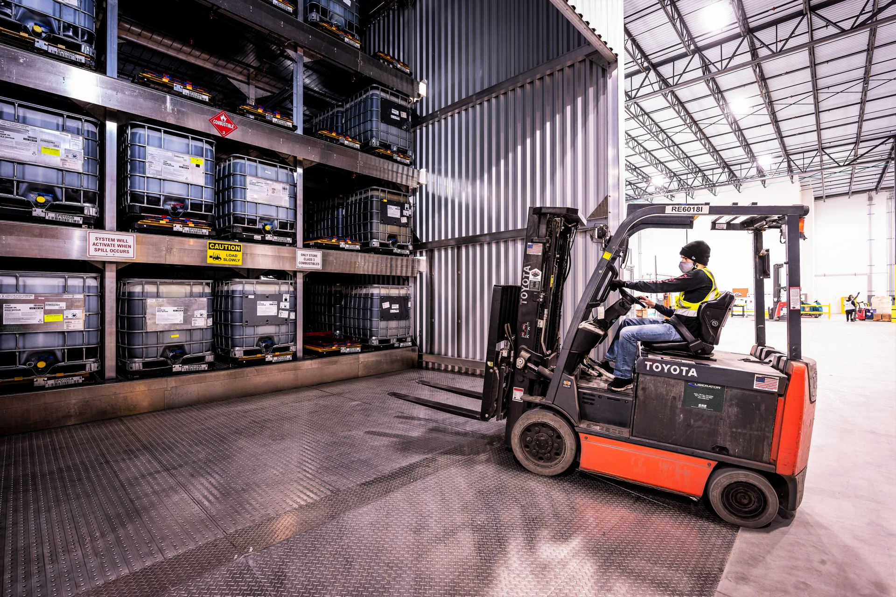
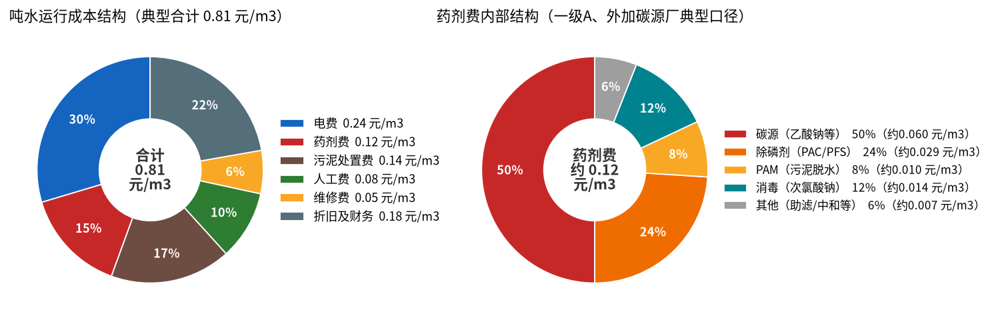
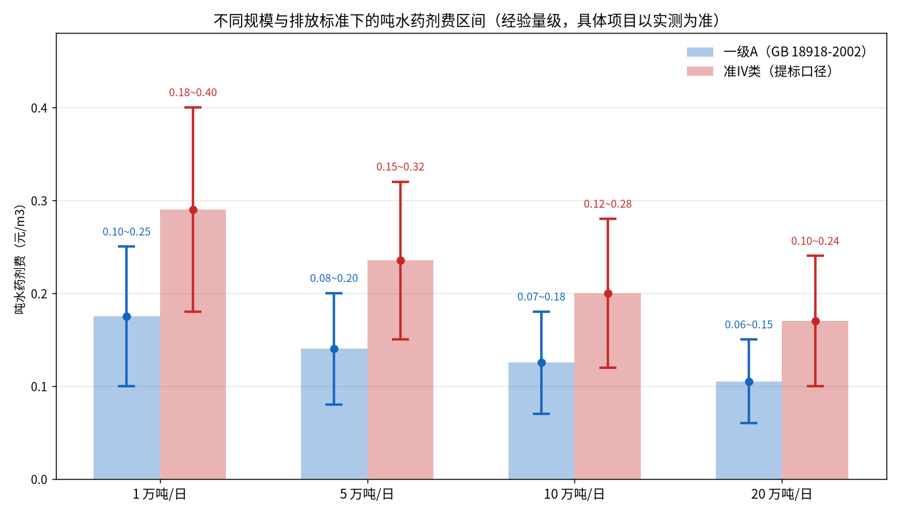
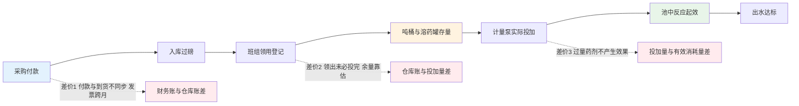

# 03-2 污水厂成本账本：药剂到底花了多少钱

> 上一章我们看到了人是怎么拧泵的，这一章换成账房先生的视角：污水厂一年花多少钱，药剂费排第几，碳源、除磷剂、PAM、消毒各占多少，规模和排放标准怎么改变这笔账，以及——为什么很多厂连"到底消耗了多少药"都说不清楚。
>
> 读完你能：看懂污水厂运行成本报表的结构，读懂药剂台账里的猫腻，拿着一张逐月台账独立推算吨水药剂费和节能空间。
>
> 阅读时间：约 22 分钟。

---

## 场景导入：年底对不上的两本账

年底，某 10 万吨厂的厂长同时收到两张表：财务科的"药剂采购付款表"显示今年花了 860 万，仓库的"出入库台账"显示领了 780 万，而运行车间按泵运行时间估算的"实际投加量"折成钱只有 700 万出头。

三张表三个数，差额够给全厂发两年年终奖。谁错了？可能谁都没错——**采购的≠入库的，入库的≠投进池子里的，投进池子的≠真正起作用的**。这一章我们先把"钱花哪了"算明白，第四节再讲这三个不等号是怎么来的。

*真实照片：成组装在钢制防泄漏托盘（围堰）内的 IBC 吨桶，叉车可整体搬运。无论室内室外，药剂存放都必须有围堰和渗漏收集。图片来源：Wikimedia Commons，作者 SS132021，CC BY-SA 4.0。*

---

## 一、先看总账：污水厂运行成本六本账

市政污水厂的运行成本（不含管网建设和大修）通常拆成六项。下图用规范口径区间内的典型值画出结构（左饼），右饼是药剂费内部的二次拆分：

*图中数字为行业经验区间内选取的典型值（市政厂，具体项目以实测为准）：吨水运行成本合计约 0.81 元/m³。药剂费 0.12 元/m³ 对应中等规模、一级 A 口径厂；提标厂和小厂明显更高。*

| 成本项 | 吨水典型区间 | 本例取值 | 占比约 | 可控性 | 一句话说明 |
|---|---|---|---|---|---|
| 电费 | 0.15~0.35 元/m³ | 0.24 | 30% | 中 | 曝气电耗占全厂电耗 50%~70%，是第一大块 |
| **药剂费** | **0.05~0.25 元/m³** | **0.12** | **15%** | **高** | **第二大可控成本，也是本书主角** |
| 污泥处置费 | 折合 0.08~0.25 元/m³ | 0.14 | 17% | 中 | 泥饼外运处置 200~500 元/t，地区差异极大 |
| 人工费 | 0.05~0.15 元/m³ | 0.08 | 10% | 低 | 小厂摊到吨水里反而更高 |
| 维修费 | 0.03~0.10 元/m³ | 0.05 | 6% | 中 | 含设备维保、仪表耗材试剂 |
| 折旧及财务费用 | 0.15~0.40 元/m³ | 0.18 | 22% | 低 | 建设期贷款决定，运行阶段基本是常数 |

把六项加起来，一座常规市政厂**全成本吨水约 0.6~1.2 元/m³**（典型 0.8 元上下），1 万吨小厂因规模不经济可能到 1.2~1.8 元，20 万吨大厂可压到 0.5~0.7 元。注意三个口径问题：

1. 政府公布的"污水处理费"是收入端概念（居民约 0.95~1.5 元/吨，各地不同），和这里的成本端不要混为一谈；
2. 折旧是否计入、污泥处置费由谁承担，各厂报表口径不同，对比时先对齐口径；
3. **电费和药剂费是运行阶段仅有的两块"努力一下就能降"的大账**，而加药还会连锁影响污泥量——这是后话。

### 延伸：三种特殊厂型，成本排序完全不同

上表是"标准市政厂"的排序，审计时遇到下面三类厂要换脑子：

| 厂型 | 成本排序的变化 | 药剂费的头号科目 |
|---|---|---|
| 合流制占比高、雨季水量翻倍的南方厂 | 雨季电耗与药剂保底投加抬高，维修费（格栅、水泵磨损）上升 | 除磷剂被雨水稀释后仍照投，浪费集中在雨季 |
| 工业废水占比 30% 以上的厂 | 药剂费可能超过电费排第一；污泥常按危废管理，处置费 800~3000 元/t | 酸碱中和、破乳、重金属捕集剂，品种完全不同 |
| 再生水/准 IV 提标厂 | 新增深度处理（高效沉淀、反硝化深床、臭氧/紫外），药耗电耗双升 | 碳源 + 深度除磷剂，消毒等级也提高 |

> 💡 **现场经验**：和厂方谈节能之前，先要连续 12 个月的"水量、水质、药耗、泥量"四张月表。只给得出"全年总数"、给不出分月数的厂，管理颗粒度基本不支撑精细优化——这类厂往往也是节能空间最大的厂（多在 25% 以上）。

---

## 二、聚焦药剂费：钱被哪四种药分走了

右饼图给出的是"一级 A、需要外加碳源深度脱氮"厂的典型结构。各品种的角色和价格在 [01-5](../01-基础篇/01-5-加药点全景-全厂药剂家族图谱.md) 已全景介绍，这里只算账：

| 药剂 | 干什么用 | 商品形态与典型单价 | 典型费用占比 | 花钱特点 |
|---|---|---|---|---|
| 碳源（乙酸钠/乙酸/葡萄糖等） | 喂缺氧池反硝化细菌，降总氮 | 固体乙酸钠 2500~4000 元/t；液体折算后相当 | 40%~60% | **多数厂的最大头**，冬季硝化差时飙升 |
| 除磷剂（PAC/PFS） | 化学沉磷，保障 TP 达标 | 液体商品约 1500~2500 元/t（以 Al₂O₃ 含量折算） | 15%~35% | 天天连续投加，看似单价低、总量惊人 |
| PAM | 污泥脱水助凝，也用于深度处理混凝 | 1.2 万~3 万元/t，用量小但单价高 | 5%~15% | 与产泥量直接挂钩，多加除磷剂它跟着涨 |
| 消毒剂（次氯酸钠/紫外+药） | 出厂水杀菌，保粪大肠菌群达标 | 商品次氯酸钠（有效氯约 10%）约 700~1100 元/t | 5%~20% | 夏季可压低，冬季及再生水厂高 |
| 其他 | 中和、除氟、应急等 | 因厂而异 | 0~10% | 工业比例高的厂这一块会变大 |

> ⚠️ **老工程师的坑**：脱离排放标准和工艺谈药剂结构，一定吵架。我见过三类完全不同的账：**不投外加碳源、靠进水 BOD 自然脱氮的厂**，除磷剂占药剂费一半以上；**准 IV 类提标厂**，碳源一项能占 60%；**工业园区厂**，酸碱中和药剂可能是头号开销。审计开场先问三件事：执行什么排放标准、什么主体工艺、碳源投不投——三问之后才知道该盯哪个药罐。

### 单价陷阱：比价格要比"有效成分"

采购环节最常见的坑，是只比吨价、不比有效含量：

- **液体 PAC**：同样叫 PAC，Al₂O₃ 含量有 8%、10%、12% 三档，吨价差一两百，折成"每千克 Al₂O₃ 单价"可能反而是贵货便宜 20%；
- **次氯酸钠**：有效氯 10% 是行规口径，但夏季高温运输途中自然衰减，到货实测可能只剩 8%，不检测等于按 10% 的钱买 8% 的货；
- **乙酸钠**：液体（约 20% 有效 COD）、固体三水合物、无水乙酸钠单价差几倍，必须统一折成"万元/t COD 当量"再比价；
- **PAM**：离子度、分子量不同用途完全不同（阴离子脱水、阳离子污泥调理），贪便宜买错型号，药耗翻倍都不稀奇。

> ⚠️ **老工程师的坑**：低价中标买高含量"标称"货，是药剂浪费里最隐蔽的一种。审计建议每批货至少抽检一项主含量（PAC 测 Al₂O₃、次氯酸钠测有效氯、碳源测 COD 当量），把"到厂实测含量"写进采购合同的计价条款。含量虚标 10%，全年药费就凭空多 10%——比任何调控优化都来得直接。

---

## 三、规模与排放标准：吨水药耗强度区间

同样处理一吨水，大厂和小厂、一级 A 和准 IV 类的药剂成本差 2~3 倍。下图按"处理规模 × 排放标准"给出吨水药剂费的经验区间（脚本实算输出）：

*数据为多厂审计经验量级（合成区间，具体项目以实测为准）。规模效应来自采购议价、设备效率和摊薄的保底投加；提标推高药耗主要因为总氮（碳源）和总磷（除磷剂）限值收紧。*

| 处理规模 | 一级 A 吨水药剂费 | 准 IV 类吨水药剂费 | 提标增幅（典型） |
|---|---|---|---|
| 1 万吨/日 | 0.10~0.25 元/m³ | 0.18~0.40 元/m³ | +60%~90% |
| 5 万吨/日 | 0.08~0.20 元/m³ | 0.15~0.32 元/m³ | +60%~80% |
| 10 万吨/日 | 0.07~0.18 元/m³ | 0.12~0.28 元/m³ | +55%~70% |
| 20 万吨/日 | 0.06~0.15 元/m³ | 0.10~0.24 元/m³ | +50%~65% |

除了规模和标准，第三个常被忽略的变量是**进水浓度（污染物有多"浓"）**。同样 10 万吨/日的两座厂：一座在老城区、管网完善但有少量工业水，进水 COD 350 mg/L、TP 5 mg/L，碳氮比合适，靠微生物就能脱氮，几乎不买碳源；另一场在新城区、雨污不分、地下水渗入严重，进水 COD 只有 150 mg/L、TN 却有 45 mg/L，碳源严重不足，全靠乙酸钠"喂"着达标，仅碳源一项吨水就多花 0.08~0.12 元。**稀释的污水是最贵的污水**——这句话值很多厂一年几百万。

为什么小厂更贵？三笔隐性成本：**保底投加**——计量泵有最小稳定流量，1 万吨厂后半夜半吨水的流量也得让泵别断气；**采购没议价权**——小厂一个月进一车药，拿到的单价常比集团大厂贵 15%~30%；**管理摊薄不了**——养一个化验室和一班人，摊到吨水里就是大厂的几倍。

为什么准 IV 类这么贵？限值从 TP 0.5 收到 0.3 mg/L、氨氮从 5 收到 1.5 mg/L，看起来只收了 0.2~3.5 个 mg/L，但越接近"零"边际成本越陡——**从 60 分提到 80 分靠认真，从 90 分提到 98 分靠钱堆**，多出来的药主要花在碳源和深度除磷上。

---

## 四、台账怎么读：三个"不等号"里的猫腻

回到开头那三张对不上的表。药剂从采购到起效，实物流和账面流是两条路：

举一个数字例子体会误差如何层层累积：某厂月初各类药剂库存折款 85 万，当月入库 72 万、月末账面库存 78 万，倒挤消耗 = 85 + 72 − 78 = **79 万**；但财务按发票确认了 84 万，泵排量反推只投了 71 万。从 71 到 84 万，三个口径差出近 20%——绩效按哪个数发、节能率按哪个数算，结论可以完全相反。

**猫腻一：采购入库 ≠ 实际消耗。** 财务按发票记账，发票跟着付款和合同走，经常跨月、跨季度；年底集中入库冲预算、年初库存高企，都是常见节律。拿"今年买了多少钱的药"当"今年消耗"，误差 10%~20% 很正常，赶上年底囤货能差出 30%。

**猫腻二：库存冲减的口径随意。** 仓库账常见两种做法：一种是"领用即消耗"——桶一出库门就计入当月成本，可桶可能在加药间放半个月；另一种是月底盘点倒挤（月初库存 + 本月入库 − 月末库存 = 消耗），听起来科学，但月末库存数字本身就是下一个猫腻。

**猫腻三：吨桶余量靠"估"。** IBC 吨桶（1 m³ 方形周转桶）没有液位计，余量怎么盘？现场姿势五花八门：用手电照、抬一头试重量、用木棍插，最"规范"的是看桶壁刻度——而吨桶用久了鼓肚变形，刻度误差 10% 起步。一座厂二三十个吨桶，每个桶每月差 50~100 L，盘出一个月 10% 的库存盈亏毫不稀奇。盘亏了怎么办？有些地方就做成"自然损耗"摊进消耗——**真实投加量就这样被悄悄放大，过量问题永远藏在盘点误差里看不见**。

> 💡 **现场经验**：审计核账三招：① 用"月初库存 + 入库 − 月末盘点"连续倒挤 6 个月，单月异常波动必有事；② 抽 2~3 个吨桶亲自称重/量液位，和台账余量对账；③ 用计量泵理论排量（冲程×频率×标定系数）反推月投加量，与倒挤消耗交叉验证。三个数差距超过 10% 的厂，节能项目的基线测量（M&V，[08-5](../08-落地实施篇/08-5-节能率怎么算-效益测量与验证MV.md) 详讲）必须先做计量整改。

### 暗账：多加的药，还会推高另外三本账

药剂费不是孤立科目。审计时一定要把连锁反应算给厂长看，否则节药的价值会被严重低估：

1. **污泥账**：化学除磷每投 1 t 铝盐/铁盐，金属离子最终几乎全部进入污泥，按理论值折算约多产 1.5~2.5 t 含水率 80% 的化学泥饼；泥多了，PAM 用量和外运处置费（200~500 元/t）同步上涨；
2. **电费账**：碳源投多了，多余 COD 在好氧段被异养菌氧化，白白消耗曝气电能——经验上 1 kg 被浪费的 COD 约多耗 1 kWh 左右的曝气电（典型经验值，供量级估算）；
3. **设备与维修账**：高浓度 PAC/PAM 加速泵阀管路的结垢、堵塞和腐蚀（[03-4](03-4-真实事故与返工案例集.md) 案例③⑧就是典型），计量泵膜片、单向阀更换频次明显上升。

这就是为什么本教程反复强调"算全厂总账"：只盯采购单价压价是商务行为，**把投加量、产泥量、电耗、维修放在一张表里优化才是技术行为**——八大痛点中的第⑥条专门讲它。

---

## 五、一张完整的逐月药剂账（10 万吨厂实算推演）

下面这张表是本书配套脚本口径的完整推演，对象是一座 **10 万吨/日、执行一级 A 但按准 IV 类内控运行、需投加乙酸钠辅助脱氮**的传统管理厂。所有数字由水量×投加单耗×年度框架单价逐月算出，可复核。

**计算约定（典型经验值，具体项目以实测为准）：**

- 处理水量：年均约 10.3 万 m³/日，6~8 月雨季水量抬高、污染物被稀释；春节所在 2 月低负荷；
- 投加单耗：PAC（液体，Al₂O₃ 约 10%）19~44 g/m³；固体乙酸钠（58%）28~46 g/m³；PAM 0.34~0.42 g/m³；商品次氯酸钠（有效氯 10%）35~48 g/m³；
- 年度框架协议单价：PAC 1800 元/t、乙酸钠 3000 元/t、PAM 2.0 万元/t、次氯酸钠 900 元/t。

| 月份 | 水量（万m³） | PAC（t/万元） | 乙酸钠（t/万元） | PAM（t/万元） | 次氯酸钠（t/万元） | 月费合计（万元） | 吨水费（元/m³） |
|---|---|---|---|---|---|---|---|
| 1 月 | 310 | 130.2 / 23.4 | 139.5 / 41.9 | 1.24 / 2.5 | 139.5 / 12.6 | 80.3 | 0.259 |
| 2 月 | 270 | 83.7 / 15.1 | 102.6 / 30.8 | 0.97 / 1.9 | 108.0 / 9.7 | 57.5 | 0.213 |
| 3 月 | 305 | 112.8 / 20.3 | 128.1 / 38.4 | 1.22 / 2.4 | 128.1 / 11.5 | 72.7 | 0.238 |
| 4 月 | 300 | 105.0 / 18.9 | 114.0 / 34.2 | 1.14 / 2.3 | 114.0 / 10.3 | 65.6 | 0.219 |
| 5 月 | 315 | 129.2 / 23.3 | 113.4 / 34.0 | 1.26 / 2.5 | 119.7 / 10.8 | 70.6 | 0.224 |
| 6 月 | 340 | 74.8 / 13.5 | 102.0 / 30.6 | 1.22 / 2.5 | 119.0 / 10.7 | 57.2 | 0.168 |
| 7 月 | 360 | 68.4 / 12.3 | 100.8 / 30.2 | 1.22 / 2.5 | 126.0 / 11.3 | 56.3 | 0.157 |
| 8 月 | 350 | 70.0 / 12.6 | 98.0 / 29.4 | 1.22 / 2.5 | 122.5 / 11.0 | 55.5 | 0.159 |
| 9 月 | 315 | 104.0 / 18.7 | 107.1 / 32.1 | 1.20 / 2.4 | 119.7 / 10.8 | 64.0 | 0.203 |
| 10 月 | 300 | 114.0 / 20.5 | 120.0 / 36.0 | 1.20 / 2.4 | 126.0 / 11.3 | 70.3 | 0.234 |
| 11 月 | 295 | 126.8 / 22.8 | 129.8 / 38.9 | 1.24 / 2.5 | 132.8 / 12.0 | 76.2 | 0.258 |
| 12 月 | 300 | 132.0 / 23.8 | 138.0 / 41.4 | 1.26 / 2.5 | 144.0 / 13.0 | 80.6 | 0.269 |
| **全年** | **3760** | **1250.9 / 225.2** | **1393.3 / 418.0** | **14.4 / 28.8** | **1499.3 / 134.9** | **806.9** | **0.215** |

读这张表的四个要点：

1. **全年药剂费 806.9 万元，吨水 0.215 元/m³**——落在 10 万吨厂"准 IV 内控"区间 0.12~0.28 的偏上沿，说明管理偏保守，有优化空间；
2. **碳源是头号开销（418 万，占 52%）**，除磷剂其次（225 万，28%），消毒 135 万（17%），PAM 仅 29 万（4%）——和典型饼图相比，该厂 PAM 占比偏低、消毒偏高，与其脱水药耗控制较好、消毒按冬季上限运行有关；
3. **季节差极大**：最高月（12 月，80.6 万）比最低月（7 月，56.3 万）高 43%，主因是冬季水温低、硝化差、碳源和除磷剂双升；**只看年均值安排采购和考核，冬季一定手忙脚乱**；
4. **雨季（6~8 月）吨水费最低（0.16 元上下）但水量最大**——稀释使单位药耗下降，月总费用却没同比例下降，这正是固定/半固定投加模式"该降没降"留下的痕迹。

> ⚠️ **老工程师的坑**：很多厂考核吨水药剂费时用"月费 ÷ 月水量"，雨季数值好看、旱季难看，班组觉得委屈。正确做法是把考核基准做成**随水量、水温、进水水质变化的动态线**（[08-5](../08-落地实施篇/08-5-节能率怎么算-效益测量与验证MV.md) 的基线模型），否则雨季"节约"的假成绩会掩盖旱季真实的过量。

---

## 六、节能空间怎么初步估算：一个公式和一笔实算

审计进场第一天，用下面这个朴素公式就能给出节药空间的量级：

**可节约量 = 实际投加量 − 理论需求量 − 合理冗余**

- **实际投加量**：用第四节的倒挤法或泵排量反推，单位 t/月；
- **理论需求量**：按机理计算。除磷剂按"需化学去除的磷量 × Al/P（或 Fe/P）摩尔比"；碳源按"需反硝化的硝态氮量 × 单位硝态氮需 COD ÷ 药剂 COD 当量"。机理细节见 [04-1](../04-机理公式篇/04-1-化学除磷机理与投加量计算.md)、[04-2](../04-机理公式篇/04-2-生物脱氮除磷机理与碳源投加计算.md)；
- **合理冗余**：水质波动、计量误差、混合效率损失所必需的余量，除磷剂经验上取理论量的 5%~15%，碳源取 5%~10%（典型经验值）。

### 算例：该厂 12 月除磷剂能省多少（一步步算）

1. **已知条件**：12 月水量 300 万 m³；生物段出水 TP 约 1.3 mg/L，化学段要降到 0.4 mg/L，需化学去除磷 0.9 mg/L；液体 PAC 以 Al₂O₃ 计 10%，Al 质量分数 = 10% × (54/102) ≈ 5.29%；Al/P 实际摩尔比取 2.0（典型经验值 1.5~3，冬季取 2.0）；Al 原子量 27、P 31；
2. **需去除的磷**：300 万 m³ × 0.9 g/m³ = 2.7 t P；
3. **理论需 Al**：2.7 × (27/31) × 2.0 ≈ 4.7 t Al，对应商品 PAC = 4.7 ÷ 5.29% ≈ **88.8 t**；
4. **加 10% 合理冗余**：88.8 × 1.1 ≈ **97.7 t**；
5. **实际投加**：台账记录 132.0 t；
6. **可节约**：132.0 − 97.7 = **34.3 t，占实际投加 26%**，合 34.3 × 1800 ≈ **6.2 万元/月**。

按同样口径滚动全年（雨季化学除磷目标按 0.5 mg/L 计），全年理论需求约 975 t，实际 1251 t，**年可节约约 179 t、14%、32 万元**——单月看冬季空间高达 26%，全年平均因雨季本就偏瘦而摊薄到 14%，这与行业经验口径"除磷剂节药 15%~30%（冬高夏低）"一致。

### 算例：碳源（乙酸钠）账，一步步算

1. **已知条件**：某月水量 300 万 m³，进水 TN 平均 40 mg/L、出水要控到 12 mg/L，生物同化与前置反硝化合计可承担约 20 mg/L，剩余需靠外加碳源反硝化的硝态氮约 ΔN = 8 mg/L（典型经验估算）；
2. **需反硝化氮量**：300 万 m³ × 8 g/m³ = 24 t NO₃-N；
3. **理论需 COD**：按 4.5~5.5 kgCOD/kgNO₃-N 取中值 5.0，24 × 5.0 = 120 t COD；
4. **折合固体乙酸钠**：乙酸钠 COD 当量 0.78 kgCOD/kg，理论需 120 ÷ 0.78 ≈ 154 t；
5. **加 8% 合理冗余**：约 166 t；
6. **台账实际投加**：该月 138 t——注意，这月居然没超？因为日均掩盖了波动：按日核算会发现冲击日碳源严重过量、平稳日刚好，**月度平衡不代表过程合理**。

把全年 1393 t 乙酸钠按日负荷重新核算、考虑冲击后过量投加的普遍情况，经验节药空间 10%~25%，取中值 15% 即约 **209 t、63 万元/年**。与除磷剂的 32 万元合计已接近百万量级——这还没算少产泥带来的 PAM 和处置费节省（[03-3](03-3-加药管控八大痛点.md) 痛点⑥细算这笔连锁账）。

系统投资与回本先记住量级：10 万吨级 AI 加药系统 **50~150 万元投资、1~2.5 年回本**，完整 ROI 模型在 [09-2](../09-产品经理篇/09-2-价值量化与ROI测算模型.md)。

### 附：到一座新厂第一天的核账清单（可直接打印）

1. 要近 12 个月逐月的四张表：处理水量、药剂出入库、污泥外运联单、电费单；
2. 问清排放标准（一级 A 还是准 IV 内控线）、主体工艺、碳源投不投；
3. 实地数吨桶数量、抽测余量，与仓库账核对；
4. 抄 3 台主力计量泵的冲程、频率与铭牌排量，估算理论投加量；
5. 要至少 3 批药剂的到货检验单，核对 Al₂O₃、有效氯、COD 当量；
6. 用"实际投加 − 理论需求 − 合理冗余"粗算四种药各自的空间；
7. 把节药、节泥、节电、减少罚款风险四项加总，再谈改造方案。

---

## 本章小结

1. 市政厂全成本吨水约 **0.6~1.2 元/m³**，电费第一、**药剂费是第二大可控成本（0.05~0.25 元/m³）**，污泥处置紧随其后。
2. 药剂费内部：碳源与除磷剂合计常占 70%~85%；具体结构取决于排放标准、工艺和碳源投加与否，三问之后才知道盯哪个罐。
3. 吨水药耗强度随规模下降、随提标上升：10 万吨厂一级 A 约 0.07~0.18 元、准 IV 内控约 0.12~0.28 元/m³。
4. 读台账牢记三个不等号：**采购≠入库、领用≠投加、投加≠有效消耗**；吨桶余量估算是最常见的灰色地带，连续倒挤 6 个月 + 泵排量反推可破。
5. 节能空间用"实际投加量 − 理论需求量 − 合理冗余"估算；案例厂除磷剂年省约 14%（冬季单月 26%），叠加碳源优化，年效益近百万量级。

---

上一章：[03-1 传统加药怎么投：老师傅经验操作全揭秘](03-1-传统加药怎么投-老师傅经验操作全揭秘.md) ｜ 下一章：[03-3 加药管控八大痛点](03-3-加药管控八大痛点.md)
