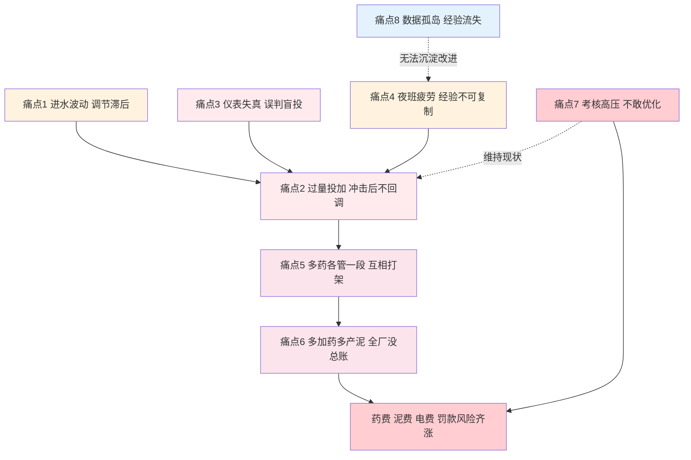
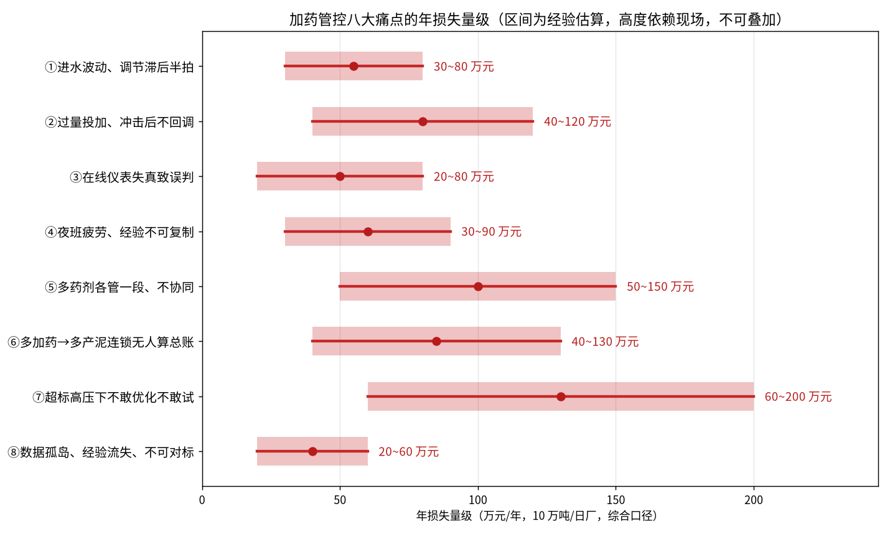

# 03-3 加药管控八大痛点

> 上一章算清了钱，这一章回答：这些钱是怎么被一点点浪费掉、事故是怎么被一点点攒出来的。我们把几十座厂审计中反复出现的问题归成八大痛点，每条都按同一个结构讲：现场现象 → 根因 → 损失量级 → AI/数据化解法（指向后面的具体章节，本章不展开技术细节），并附三个可以直接拿去自查的问题。
>
> 读完你能：拿这八条当 checklist 给自己的厂做一次免费初诊，判断每条痛点的损失量级和优先改造顺序，并知道每类问题在教程后半部的哪一章找到解法。
>
> 阅读时间：约 22 分钟。

---

## 场景导入：会议室里的八连叹

节能审计的启动会常出现同一幕：厂长说"我们管理很严，药都按制度投"；运行班长说"能想的办法都想了，就是水老变"；化验室主任说"数据每天准时出"；财务说"反正每年药费都超预算"。四个人说的都对，但问题照样在。

因为传统加药的难，不难在任何一个单点，而难在**波动、滞后、失真、疲劳、割裂、连锁、恐惧、孤岛**这八件事咬合成了一个死结。先看它们怎么传导：

下图给出八大痛点在一座 10 万吨/日厂对应的年损失量级（脚本实算，区间为综合口径的经验估算，八项之间有重叠，**不可直接相加**）：

*数据为多厂经验量级合成（高度依赖现场）：损失含多花的药费、污泥处置、电耗、维修及超标罚款风险折算。区间宽，是因为不同厂进水、工艺、管理水平差异极大——审计的第一步就是用真实数据把区间收窄。*

## 怎么用这一章给工厂做初诊

打分前先立三条纪律，否则初诊会变成自我安慰：

- 只认证据不认印象：每个"经常"都要能指到具体曲线、台账或事件记录；
- 损失取下限不算丢人：用保守数字算出的 ROI 更容易通过审批，也更容易兑现；
- 让一线先打、管理层后打：顺序反过来，会议会变成证明"我们没问题"的表演。

读每条痛点时，拿一支笔做三件事：第一，对照"现场现象"判断本厂是"经常/偶尔/没有"；第二，用"自查三问"找证据而不是找感觉；第三，在章末速查表里给每项打 0~2 分（0 没有、1 偶尔、2 经常），总分超过 8 分的厂，节能改造的投资回收期通常不超过两年（[09-2](../09-产品经理篇/09-2-价值量化与ROI测算模型.md) 的 ROI 模型会教你精算）。

---

### 痛点① 进水波动，调节永远滞后半拍

**现场现象。** 早八晚七两个高峰，进水流量和污染物浓度像潮汐；等出水化验或在线表显示不对，至少过去了水力停留时间（2~4 小时），调药永远在追昨天的水。一位班长的原话是："我们不是在处理进水，是在处理进水的残影。"雨季更典型：水量翻倍而浓度减半，按水量加药的厂同一天既浪费又差点超标。

**根因拆解。**

- 人工模式只有"反馈"没有"前馈"——只根据结果（出水）调动作（投加），而从投加点到出水口隔着混合、反应、沉淀一连串滞后环节；
- [04-5](../04-机理公式篇/04-5-加药过程动态特性-PID前馈与反馈.md) 会用控制论证明：对这种大滞后对象，靠人工间歇调节必然超调与振荡，这不是责任心问题；
- 分时段表只认时钟，不认天气、周末、节假日和上游排水户的生产排程，等于拿日历对抗随机波动。

**损失量级。** 滞后造成的过量与临界风险，10 万吨厂约 **30~80 万元/年**（以除磷剂、碳源超投为主）；进水工业比例越高、波动越大，区间越靠上沿。

**AI/数据解法。** 进水负荷（流量×浓度）预测与加药量预测模型（[06-3](../06-AI建模篇/06-3-加药量预测建模完整实战.md)）做前馈；出水指标预测（[06-4](../06-AI建模篇/06-4-出水指标预测与软测量建模.md)）把"三小时后的出水"提前显示；前馈+反馈控制器（[07-2](../07-控制优化篇/07-2-前馈加反馈控制器设计实例.md)）让投加量与负荷同步走。

> 自查三问：①调泵时依据的是进水数据还是出水数据？②能否说出本厂冲击从投加点传导到总排口平均几小时？③泵频曲线与进水负荷曲线放在一张图上，形状对得上吗？

### 痛点② 过量投加，且冲击后绝不回调

**现场现象。** 泵频历史曲线呈"锯齿只朝上"：每次冲击加 3~8 Hz，冲击过了没有人、没有规则负责调回来。[03-1](03-1-传统加药怎么投-老师傅经验操作全揭秘.md) 讲过，交接班默认"上一班动过我不动"。一周三次小冲击，泵频就从 30 蠕升到 38，再靠某次大修或换班长一次性复位。

**根因拆解。**

- 回调动作在制度上"无主"：加药是避险行为（有人签字），减药是冒险行为（出事背锅）；
- 没有"投加量 vs 实际需求"的量化对照，过量是隐形的——出水反而更"稳"、更好看，于是过量在考核中得到正反馈；
- 化验一天 2~3 个点，只能证明"没超标"，证明不了"没浪费"，过量永远不会被数据抓现行。

**损失量级。** 最大、最确定的一块浪费，10 万吨厂约 **40~120 万元/年**。[03-2](03-2-污水厂成本账本-药剂到底花了多少钱.md) 实算过的除磷剂 15%~30%、碳源 10%~25% 节药空间，主体都在这一条。

**AI/数据解法。** 带自动回调逻辑的反馈控制（[07-2](../07-控制优化篇/07-2-前馈加反馈控制器设计实例.md)）；工况识别判断冲击的进入与退出（[06-5](../06-AI建模篇/06-5-异常检测与工况识别.md)）；用基线模型做效益测量，证明"减了药依然达标"（[08-5](../08-落地实施篇/08-5-节能率怎么算-效益测量与验证MV.md)），让减药的人拿得到奖励，正反馈才能反过来。

> 自查三问：①最近三个月泵频上调过多少次、下调过多少次，比例是多少？②每次加药有没有写明"什么条件下调回"？③把月均投加量按日摊开，高剂量日之后有没有明显的回落段？

### 痛点③ 在线仪表失真，误判与盲目投加

**现场现象。** 总磷仪试剂过期、氨氮仪管路堵塞、DO 探头三个月没清洗——数据要么漂移、要么冻在一个值上。运行工分两派：当真数据用的，被带着乱跑；吃过亏的，再也不信任何仪表，回到纯手工。[03-4](03-4-真实事故与返工案例集.md) 案例⑦里一台漂移的 TP 仪两周烧掉约 20% 药剂，还让全厂误以为"水质变差"。

**根因拆解。**

- 在线仪表本质是"消耗品"：试剂、标液、清洗、标定都要钱要人，很多厂有仪表台账但没有**数据质量台账**；
- 缺少多源校验——在线值、化验值、物料平衡三者从不交叉比对，单个仪表说谎时没有任何参照物；
- 自动回路会"忠实放大"错误数据：仪表漂 10%，回路就稳定地多投 10%，错得比手动更均匀、更难被发现。

**损失量级。** 失真驱动的盲投加维护与备件，约 **20~80 万元/年**；仪表越多、自动化程度越高的厂此项反而越大——错误被规模化执行了。

**AI/数据解法。** 数据质量治理九种死法（[05-2](../05-数据篇/05-2-数据质量治理-脏数据的九种死法.md)）；多源交叉校验与异常检测（[06-5](../06-AI建模篇/06-5-异常检测与工况识别.md)）；软测量提供不依赖贵仪表的第二路估计（[06-4](../06-AI建模篇/06-4-出水指标预测与软测量建模.md)）。务必记住：**数据不可信的厂，先治数据，再谈 AI**。

> ⚠️ **老工程师的坑**：判断仪表可不可信，别只看校准证书。到现场做三件事：调仪表原始信号看毛刺和冻结值；拿最近三个月化验值和在线值画散点（健康仪表相关性应在 0.8 以上，典型经验值）；私下问运行工"你信不信这块表"——他们摇头的表，数据再漂亮也别用。

> 自查三问：①每台关键仪表有没有每周一次的"在线 vs 手工"比对记录？②试剂更换和标定是否强制登记？③自动回路有没有"数据可疑时自动转安全模式"的开关？

### 痛点④ 夜班疲劳与人力成本，经验不可复制

**现场现象。** 凌晨三点中控室的哈欠，和"这个活儿离了老张不行"并存。能手当班出水就稳，老张一休假全厂回到粗放模式；四班三倒把注意力切成碎片，多厂访谈中约八成的加药误操作发生在 0:00–6:00（经验比例，非严格统计值）。

**根因拆解。**

- 每十几分钟一次的精细微调是高强度持续认知劳动，却被当作"看着泵"的低技能岗位排班；
- 经验以肌肉记忆和口头交代存在，写不进规程、教不会新人、带不到别的厂；
- 人员流动率一高，组织每年都在重新交学费——同一个坑，换一茬人再踩一遍。

**损失量级。** 夜间过量投加、误处置事件、能手依赖的隐性成本，约 **30~90 万元/年**；这还没算模式④的厂要多配 1~2 个熟练岗的编制成本。

**AI/数据解法。** 把能手的判断规则显式化进模型（[06-1](../06-AI建模篇/06-1-AI加药能力地图-什么活能交给AI.md)）；开环建议→半自动→闭环渐进替代重复劳动（[07-1](../07-控制优化篇/07-1-从开环建议到闭环控制-三种架构.md)）；模型持续监控迭代，让系统越用越像"数字老张"（[06-7](../06-AI建模篇/06-7-模型上线监控与迭代运维.md)）。

> 自查三问：①能手休假一周，出水指标波动率增加多少？②交接班除了"做了什么"，记不记"为什么"？③把班长十年来的经验写成十条规则，写得出来吗？

### 痛点⑤ 多药剂各管一段，缺乏协同

**现场现象。** 除磷剂归化学除磷岗，碳源归脱氮岗，PAM 归脱水机房，曝气归鼓风机班——岗位 KPI 不同，各自拧各自的旋钮。除磷剂加多了加重生物段负担，碳源加多了抬高溶解氧需求，DO 不够又压制硝化，最后 PAM 用量跟着涨。[03-4](03-4-真实事故与返工案例集.md) 案例②就是碳源和曝气"打架"打到 DO 崩溃。

**根因拆解。**

- 污水厂是强耦合系统，却按专业竖井组织：每类药剂只对自己负责的指标负责，没有人对"全厂总成本最小"这个目标函数负责；
- 局部最优叠加必然是全局次优：碳源岗把 TN 做到 9（内控 12 即可），省下的是他的安全余量，浪费的 COD 药费和曝气电费由别人背；
- 协调需要同时预测多个变量的相互作用，人脑在疲劳状态下处理不了二阶以上的连锁反应。

**损失量级。** 重复加药、互相对冲、电耗联动等叠加浪费，约 **50~150 万元/年**，是上限最高的痛点之一；工艺越复杂、提标越深，越严重。

**AI/数据解法。** MPC 模型预测控制把碳源、曝气、除磷、回流放进同一个优化器统一求解（[07-3](../07-控制优化篇/07-3-MPC模型预测控制怎么落地.md)）；机理+数据灰箱模型刻画耦合关系（[06-6](../06-AI建模篇/06-6-机理加数据-灰箱混合模型最落地.md)）；数字孪生在投运前验证协调策略不会顾此失彼（[07-4](../07-控制优化篇/07-4-数字孪生与仿真验证-BSM基准平台.md)）。

> 自查三问：①除磷、碳源、曝气、脱水的加药决策有没有一个人/一个会统一协调？②一个药剂的投加量调整，会不会触发另一个岗位的成本上升，算过吗？③各岗 KPI 是"单项指标"还是含"全厂单位成本"？

### 痛点⑥ 多加药 → 多产泥 → 脱水药耗与处置费连锁，全厂没人算总账

**现场现象。** 除磷剂每加一档，化学污泥肉眼可见地多出来：脱水机房 PAM 用量上涨、泥饼外运车次加密。但这笔钱记在"污泥处置费"科目下，与"药剂费"是两本账、两拨人管。运行车间为达标加药，成本由厂部年底统一背——**加药的人不产泥，产泥的人不算药**。

**根因拆解。**

- 成本被会计科目切散，缺少全厂级物料流视角：铝盐铁盐里的金属几乎全部转入污泥，多投除磷剂 ≈ 定向多产化学泥；
- 连锁链条至少三环：多药 → 多泥饼（处置费 200~500 元/t）→ 脱水 PAM 单耗上升（泥质变差时 3~8 kg/t 绝干泥的区间会靠上限）；
- 有些厂污泥处置外包按车次结算，车次增加在生产例会上甚至不与药剂数据同屏出现。

**损失量级。** 化学污泥增量 5%~10% 对应的 PAM、处置、运输连锁，10 万吨厂约 **40~130 万元/年**；处置费高的地区（东部沿海 400~500 元/t），这笔账能追平甚至超过药剂费的节约本身。

**AI/数据解法。** 以全厂总成本（药+泥+电）为目标的优化（[07-3](../07-控制优化篇/07-3-MPC模型预测控制怎么落地.md)、[09-2](../09-产品经理篇/09-2-价值量化与ROI测算模型.md)）；物料平衡灰箱模型实时跟踪"药-泥"转化（[06-6](../06-AI建模篇/06-6-机理加数据-灰箱混合模型最落地.md)）；ROI 测算必须把污泥减量计入效益，否则项目决策从第一天就错。

> 💡 **现场经验**：说服厂长上系统，最有力的一张图不是"药费下降曲线"，而是"除磷剂投加量 vs 泥饼外运车次"的双轴叠加图——两者往往同步得惊人。把两本账画在一张图上，痛点⑥就从财务语言变成了所有人都看得见的常识。

> 自查三问：①月度会上药剂费和污泥处置费是否同屏分析？②除磷剂投加量与泥饼产量做过相关性分析吗？③脱水 PAM 单耗最近两年是涨是跌，和除磷剂调量时间点一致吗？

### 痛点⑦ 超标考核高压下，不敢优化、不敢试

**现场现象。** 审计提出"碳源有 15% 空间"，厂长第一反应往往不是高兴而是警惕："万一调出事谁负责？"于是最优秀的运行策略被定义成"不出事的策略"，技改试点排不上号；有的厂系统装了一年仍只跑"开环建议"模式，AI 的建议每天弹在屏幕上，没人敢点"确认自动"。

**根因拆解。**

- [03-1](03-1-传统加药怎么投-老师傅经验操作全揭秘.md) 第四节的奖惩不对称在管理层被放大：超标是即时确定的重罚，节约是延迟模糊的表扬；
- 没有安全联锁兜底，管理者无法区分"可承受的试运行"与"裸奔"；没有 M&V 数据背书，省了钱也讲不清是不是运气；
- 任期制也在起作用——优化见效可能在下任任期，事故责任却在本任，理性选择就是维持现状。

**损失量级。** 已识别却不敢兑现的节药空间叠加长期过量，约 **60~200 万元/年**，区间最宽，因为它由管理风险偏好决定，而不是纯技术。

**AI/数据解法。** 安全联锁与人工接管让系统"宁可停机、不可超标"（[08-3](../08-落地实施篇/08-3-安全联锁与人工接管.md)）；数字孪生先仿真、再试运行、后闭环（[07-4](../07-控制优化篇/07-4-数字孪生与仿真验证-BSM基准平台.md)）；M&V 用数据证明安全性和节约率（[08-5](../08-落地实施篇/08-5-节能率怎么算-效益测量与验证MV.md)）；实施路径从开环建议起步逐级放权（[08-1](../08-落地实施篇/08-1-项目实施全流程-从调研到验收.md)）。

> 自查三问：①过去一年有没有提出过降药方案，被谁、因为什么否掉？②系统从"建议"到"自动"的授权链条写清楚没有？③节约的效益有没有机制反哺到班组和管理层？

### 痛点⑧ 数据孤岛、经验随人流失、集团多厂不可对标

**现场现象。** PLC、SCADA、化验 LIMS、设备台账、财务 ERP 各是各的系统，数据格式不通、时间戳不齐；想分析"这月药为什么超了"，要找四个部门导四张 Excel 手工对齐。老张退休，他脑子里的工况判断表跟着进了养老院；集团旗下八个厂连吨水药耗的统计口径都不一样，横向排名都排不出来。

**根因拆解。**

- 建设年份不同、供应商不同、点位编码无规范，数据从采出来就是孤岛，跨系统连一个"同一时刻"都对不齐；
- 工艺经验从未被当作资产管理：没有工况标签库，处置记录散落在交接班本子里，组织没有记忆；
- 集团层面缺统一数据字典，各厂填报口径自由（有的算采购、有的算领用、有的估算），对标反而制造错误结论。

**损失量级。** 重复决策成本、对标缺失导致"后进厂不知道先进在哪"、知识流失，约 **20~60 万元/年/厂**；对集团是 N 个厂叠加且成功经验无法复制，战略损失大于单厂数字。

**AI/数据解法。** 点位表与数据字典先统一语言（[05-1](../05-数据篇/05-1-数据从哪来-点位表与数据字典.md)）；工况识别把经验沉淀成可复用的标签库（[06-5](../06-AI建模篇/06-5-异常检测与工况识别.md)）；边缘部署与集团数据架构支撑多厂对标（[08-2](../08-落地实施篇/08-2-系统架构与边缘部署.md)、[09-3](../09-产品经理篇/09-3-市场规模政策与需求量测算.md)）。

> 自查三问：①取齐一天内"水量-水质-药耗-泥量-费用"五组数据需要几个部门、几天？②关键岗位的经验有没有结构化访谈和规则文档？③集团各厂吨水药耗口径统一吗，排名后三名知道差距原因吗？

---

## 顺便戳穿三个"伪解法"

审计中还常见三种看起来在解决问题、实则无效甚至有害的做法，提前打预防针：

1. **"再招两个有经验的运行工"**：缓解④的疲劳但不解决滞后与失真，且把经验继续锁在个人脑子里；人走了，问题原样回来。
2. **"药剂招标再压 5% 单价"**：账面上立刻见效，但不触动投加量——15%~30% 的过量空间远大于 5% 的单价水分；压价过狠还可能逼出含量虚标（[03-2](03-2-污水厂成本账本-药剂到底花了多少钱.md) 的单价陷阱）。
3. **"上一套大屏可视化系统"**：数据孤岛（⑧）被漂亮地展示出来但没有被打通，看得到曲线不等于算得清原因，运行工把它叫"领导参观系统"。

真正的解法都有一个共同特征：**直接作用在"投加量决策"这个动作上，且有可核算的前后对比**。对照这个标准，真方案和伪方案一分钟就能分清。

## 打分结果怎么解读

把八条痛点各打 0~2 分（0 没有、1 偶尔、2 经常），总分 0~16，对照下表：

| 总分区间 | 厂情画像 | 建议动作 |
|---|---|---|
| 0~4 | 管理基础好，多为已投运自动回路并有运维的标杆厂 | 重点转向多药剂协同（⑤）和数据资产化（⑧），抠最后 5%~10% |
| 5~8 | 大多数运行 5 年以上的市政厂所处区间 | 先做数据核查与前馈反馈改造，1 年内可兑现主要效益 |
| 9~12 | 波动大、仪表差、考核重的厂 | 必须先补数据治理与计量课，再谈智能化，否则投了系统也不敢用 |
| 13~16 | 处于"高药费+高事故风险"双高状态 | 建议直接启动含 M&V 与安全联锁的完整项目，管理层入场是前提 |

打分时让厂长、班长、运行工、财务分别独立打一遍再对答案——四个分数的离散程度本身就是诊断结果：分数差得越远，说明痛点⑧（信息不对称、各说各话）越严重。

## 八痛速查与优先级

| 编号 | 痛点一句话 | 年损失量级（10万吨厂） | 见效速度 | 主解法章节 |
|---|---|---|---|---|
| ① | 调节永远滞后半拍 | 30~80 万 | 快 | 06-3 / 07-2 |
| ② | 过量且不回调 | 40~120 万 | 快 | 06-5 / 07-2 / 08-5 |
| ③ | 仪表失真带节奏 | 20~80 万 | 中（先治数据） | 05-2 / 06-4 |
| ④ | 疲劳与经验不可复制 | 30~90 万 | 中 | 06-1 / 07-1 |
| ⑤ | 多药互相打架 | 50~150 万 | 慢（需协调控制） | 06-6 / 07-3 |
| ⑥ | 药泥连锁无总账 | 40~130 万 | 中 | 06-6 / 09-2 |
| ⑦ | 高压下不敢优化 | 60~200 万 | 取决于管理 | 08-3 / 07-4 / 08-1 |
| ⑧ | 孤岛、流失、不可对标 | 20~60 万 | 慢（打基础） | 05-1 / 08-2 |

> ⚠️ **老工程师的坑**：初诊别按金额大小排优先级，要按"可行性 × 金额"排。多数厂正确的起步顺序是：先用③治数据（两周仪表核查立刻见效），再用①②上前馈反馈（1~3 个月），同步用⑥的全厂总账争取管理层支持（化解⑦），最后做⑤的协调控制和⑧的集团对标。一上来就谈 MPC 和大平台的项目，十个里有八个烂尾——这条教训在 [08-1](../08-落地实施篇/08-1-项目实施全流程-从调研到验收.md) 还会展开。

## 再强调三组容易被忽视的因果关系

| 因果组 | 表面上 | 实际上 |
|---|---|---|
| ③ → ② | "我们严格按仪表数据投药" | 仪表漂移会让过量以"科学"的名义发生，比经验投加更难纠正 |
| ② → ⑥ → ⑤ | "达标最重要，药花点就花点" | 过量除磷剂多产泥，泥质变化又扰动脱水与生化，最终反向推高总氮总磷控制难度 |
| ⑦ → ④ → ⑧ | "老员工保守是正常的" | 不敢试的组织留不住想试的人，能手的经验在离职时一次性清零，新人继续保守 |

看清这三组关系就会明白：八大痛点不能逐个零敲碎打地解决。数据治理、控制改造、考核调整三件事必须配套——这也是 [08 落地实施篇](../08-落地实施篇/08-1-项目实施全流程-从调研到验收.md) 存在的原因。

---

## 本章小结

1. 八大痛点不是八个孤立问题，而是一条咬合的传导链：波动与失真是入口，过量不回调是核心动作，割裂与连锁放大损失，恐惧与孤岛让系统无法自愈。
2. 单厂年损失量级从 20 万到 200 万元不等，但八项相互重叠、不可加总；审计的价值就是拿本厂数据把宽区间收窄成确定数字。
3. 痛点②⑥⑦分别对应"技术账、全厂账、管理账"——只解决技术只能拿到一半效益，奖惩不改，过量一定会卷土重来。
4. 数据不可信（③）和不敢闭环（⑦）是两个最高频的项目翻车点：前者靠数据治理，后者靠联锁兜底、M&V 背书和逐级放权。
5. 每个痛点都已有明确的章节级解法，后面的 [04 机理](../04-机理公式篇/04-1-化学除磷机理与投加量计算.md)、[05 数据](../05-数据篇/05-1-数据从哪来-点位表与数据字典.md)、[06 建模](../06-AI建模篇/06-1-AI加药能力地图-什么活能交给AI.md)、[07 控制](../07-控制优化篇/07-1-从开环建议到闭环控制-三种架构.md) 分别补齐理论、原料、大脑和手脚。

---

上一章：[03-2 污水厂成本账本：药剂到底花了多少钱](03-2-污水厂成本账本-药剂到底花了多少钱.md) ｜ 下一章：[03-4 真实事故与返工案例集](03-4-真实事故与返工案例集.md)
