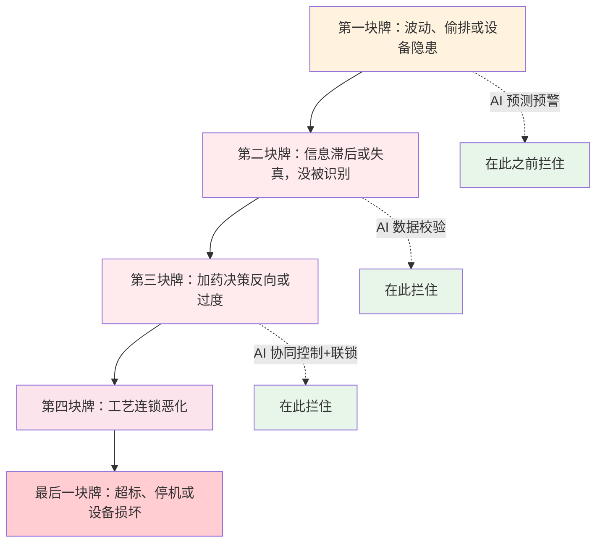

# 03-4 真实事故与返工案例集

> 账算完了，痛点①~⑧的逻辑也讲透了，最后用八个带精确时间线的故事把本篇收住。案例均由多个真实审计项目的经历复合、脱敏而成（化名"某南方 A 厂"等），金额给出经验区间——但每一个处置动作、每一句当班人的原话，都来自现场。
>
> 读完你能：识别八类高频加药事故的早期信号，掌握每类事故的复盘清单，并且具体说清"如果当时有 AI 系统，会是哪条规则、哪个模型、哪一级报警起作用"。
>
> 阅读时间：约 25 分钟。

---

## 场景导入：事故从来不是"轰"的一声

污水厂的加药事故很少瞬间爆炸。它更像多米诺骨牌：一块叫"周末"，一块叫"漂移的仪表"，一块叫"新来的药"——前面的牌悄悄倒下，几小时甚至两周后，最后一块牌才以"超标通报""漫药停机"的形式被所有人看见。

八个案例覆盖总磷、碳源、PAM、PAC 冬季故障、硝化崩溃、雨季溢流、仪表失真、消毒腐蚀。统一结构：**背景 → 时间线与处置 → 直接/间接损失 → 复盘清单 → 如果当时有 AI**。

图中那条看不见的规律先记住：**越靠前的牌代价越小，AI 项目的全部价值，就是把拦截点从第五块牌往前挪**。

---

## 案例① 早高峰总磷逼近超标线，被在线监控通报罚款

**某南方 A 厂**，10 万吨/日，A²/O 工艺加化学辅助除磷，执行一级 A（TP ≤ 0.5 mg/L）。

**背景**：周一早晨，居民周末攒下的污水集中进城，进水水量和总磷同时抬头；除磷泵还停在周末的低挡。

| 时间 | 发生了什么 | 人的处置 |
|---|---|---|
| 05:30 | 进水流量比周日均值高 18% | 夜班无人关注进水曲线 |
| 07:10 | 进水 TP 从 3.8 升到 5.6 mg/L | 在线数据没人看 |
| 08:20 | 总排口在线 TP 0.46，开始爬升 | 交接班，双方都以为对方在盯 |
| 08:55 | TP 0.51，维持约 35 分钟 | 班长冲到加药间把泵加大 30% |
| 09:30 | TP 0.32，虚惊一场 | 泵频维持高位，三天后才复原 |
| 次日 | 环保在线平台数据超标留痕 | 收到预警函，随后行政处罚告知 |

**损失**：直接损失为罚款与整改报告费用，合计区间 **10 万~40 万元**（各地裁量差异大，具体以处罚决定书为准）；间接损失是管理层"一朝被蛇咬"，此后两周全线高剂量运行，多投除磷剂约 15%~20%。

**复盘清单**：①周一早高峰是每周必然发生的规律事件，为何没有预案？②进水侧明明有流量计和 TP 表，为什么加药只盯出水？③冲击过后泵频为什么三天才复原——谁负责"复原"这个动作？④超标 35 分钟和连续超标 4 小时，在台账里被同等对待了吗？

**如果当时有 AI**：基于星期几 + 历史同时段曲线的**进水负荷预测模型**（[06-3](../06-AI建模篇/06-3-加药量预测建模完整实战.md)）在 05:30 即推送"预计 8 点 TP 峰值，建议提前提量"；前馈控制器（[07-2](../07-控制优化篇/07-2-前馈加反馈控制器设计实例.md)）按 Q×TP 负荷自动加药；出水 TP 软测量（[06-4](../06-AI建模篇/06-4-出水指标预测与软测量建模.md)）设 0.40 黄色、0.45 橙色两级报警；事后泵频按"冲击结束 + 水力停留时间"规则**自动回调**，不会高位赖三天。

---

## 案例② 碳源投太多：出水 COD 反弹与 DO 崩溃

**某华东 B 厂**，5 万吨/日，AAO 工艺，冬季投乙酸钠保 TN。

**背景**：12 月降温后 TN 在 13~15 mg/L 波动，离内控 12 差一点，班长决定碳源"加半档观察"。

| 时间 | 现象 | 处置 |
|---|---|---|
| 第 1 天 20:00 | 乙酸钠投加量上调约 25% | 口头交代夜班"看着点" |
| 第 2 天 02:00 | 好氧池 DO 从 3.0 掉到 1.2，风机自动开满仍拉不动 | 夜班以为是探头结垢，擦 DO 表 |
| 06:30 | 缺氧池出水发黄、有淡淡醋酸味，二沉池浮泥增多 | 取样急测 |
| 09:00 | 化验结果：缺氧池 ORP 偏高、出水 COD 38→57，TN 倒是降到 9 | 碳源砍半、加大回流 |
| 14:00 | DO 回到 2.5，COD 44 | 维持低剂量三天才恢复平稳 |

**损失**：直接损失——超投乙酸钠约 3~5 t（约 1 万~1.5 万元）+ 风机多耗电约 3000~6000 kWh（0.2 万~0.5 万元）；间接损失——出水 COD 临界超标边缘运行大半天，若再叠加一次进水波动就可能双线超标。

**复盘清单**：①碳源加多了会在好氧段耗氧，这条机理写进操作规程了吗？②"加半档"是多少 mg/L，有没有上限？③DO 异常时第一反应为什么是怀疑仪表？④碳源、曝气、回流三个旋钮为什么各拧各的？

**如果当时有 AI**：碳源-曝气**多变量协调控制（MPC）**（[07-3](../07-控制优化篇/07-3-MPC模型预测控制怎么落地.md)）在加碳源的同时预判需氧量上升、联动风机前馈；进水碳氮比与硝酸盐在线软测量（[06-4](../06-AI建模篇/06-4-出水指标预测与软测量建模.md)）按真实缺口给量，杜绝"差一点就加半档"；DO 下行 + COD 上行的**组合异常规则**（[06-5](../06-AI建模篇/06-5-异常检测与工况识别.md)）在 02:00 即报警"疑似碳源过量"。

---

## 案例③ PAM 结块堵管：脱水机房漫药停机

**某华北 C 厂**，8 万吨/日，带式浓缩脱水一体机 2 用 1 备。

**背景**：新来一批 PAM，溶药工发现粉末偏潮，但想着"能溶就行"，按原设定投料；当天连续阴雨，污泥有机物含量上升。

| 时间 | 现象 | 处置 |
|---|---|---|
| 08:30 | 溶药罐壁出现"鱼眼"结块，熟化时间只给了 20 分钟 | 图产量，缩短熟化 |
| 10:10 | 2# 脱水机加药管压力升高、药膜不均 | 拆洗过滤器，发现胶状物 |
| 11:40 | 1# 机加药管堵死，药液从法兰处外溢，地面漫开约 15 m² | 紧急停机、围堵、冲洗 |
| 13:20 | 管路分段拆卸清通，发现大段"粉条"状凝胶 | 两机停一台，脱水能力减半 |
| 当天 | 储泥池液位上涨，被迫减少剩余污泥排放量 | 生化段污泥龄被动拉长 |

**损失**：直接损失——清通人工、浪费 PAM 约 50~80 kg（0.1 万~0.2 万元，PAM 两万多一吨）、冲洗水与停产半天；间接损失才是大头：脱水能力减半持续 2 天，污泥外运加车 1~2 台次（0.5 万~1.5 万元），排泥不及时还影响生化系统稳定。

**复盘清单**：①新批次药剂为什么没有小试（配一杯看溶解性）？②熟化 30~60 min 是硬要求，为什么被压缩到 20 min？③加药管为什么不装压力开关联锁停泵？④"地面上的药"全是钱，漫一次浪费多少算过吗？

**如果当时有 AI**：管压趋势监测 + 异常检测（[06-5](../06-AI建模篇/06-5-异常检测与工况识别.md)）在 10:10 压力爬升阶段即报警并提示检查过滤器，而不是等到漫药；加药系统的**存量与批次管理**记录每批 PAM 入厂检测结果，受潮批次自动提示降低投料浓度、延长熟化；更根本的是污泥脱水 PAM 投加优化（[07-3](../07-控制优化篇/07-3-MPC模型预测控制怎么落地.md)），按进泥浓度和扭矩反馈自动调节，减少对人工配药经验的依赖。

---

## 案例④ PAC 冬季结晶堵泵，误判为进水冲击

**某华中 D 厂**，3 万吨/日，液体 PAC 储罐设在室外，无保温伴热。

**背景**：元月寒潮，最低气温 −4℃，出水 TP 连续两天偏高。

| 时间 | 现象 | 处置 |
|---|---|---|
| 第 1 天 09:00 | 出水 TP 0.42、0.45 | 班长判断"进水冲击"，泵频 +15% |
| 第 2 天 08:30 | TP 0.47，药罐液位下降异常缓慢 | "药效不够"，再 +15%，并联系再送一车 |
| 第 2 天 14:00 | 巡检发现泵头异响、吸入管表面有白色结晶 | 拆泵：单向阀、管路大量结晶堵塞，实际出力不足额定值四成 |
| 第 2 天晚 | 热水冲洗管路、更换备用泵、储罐倒罐 | 折腾到深夜，TP 次日才回落 |
| 一周后 | 寒潮再来，同样故障重演一次 | 才立项加装储罐伴热 |

**损失**：直接损失——超投药剂约 3~6 t（0.5 万~1.2 万元）、夜间抢修人工与备件约 0.5 万~1 万元；间接损失——TP 临界超标运行 2 天、备用泵长期带病、第二次故障纯属"好了伤疤忘了疼"。

**复盘清单**：①气温与药剂状态的关系，冬季运行方案里有没有？②泵转但不出药，如何第一时间发现（看罐液位、看流量）？③"出水变差 = 进水冲击"的条件反射，漏掉了多少设备原因？④第一次故障后为什么没形成整改闭环？

**如果当时有 AI**：加药泵的**冲程频率指令 vs 电磁流量计实测流量**做一致性校验（[05-2](../05-数据篇/05-2-数据质量治理-脏数据的九种死法.md)），出力偏离 20% 即报"设备异常"而非继续加药；**工况识别模型**（[06-5](../06-AI建模篇/06-5-异常检测与工况识别.md)）综合气温、罐液位、出水反应判断为"投加系统故障"而非负荷冲击；设备台账联动维保规则，第一次故障即自动生成伴热整改工单并跟踪关闭。

---

## 案例⑤ 春节后餐厨复工，氨氮冲击打垮硝化

**某南方 E 厂**，12 万吨/日，服务区内餐饮和食品加工企业集中。

**背景**：正月十五后餐饮集中复工，大量含高蛋白高氨氮的餐厨废水进城，而水温还只有 14℃，硝化菌（负责把氨氮转化掉的好氧细菌）冬天本就"吃得慢"。

| 时间 | 现象 | 处置 |
|---|---|---|
| 复工第 1 天 | 进水氨氮从 22 跳到 38 mg/L | 按节日惯例未做特殊安排 |
| 第 2 天 | 好氧池 DO 反常升高（硝化耗氧减少），泡沫变黑 | 巡检记录"泡沫异常"，未升级 |
| 第 3 天 | 出水氨氮 6.8 mg/L（红线 5），pH 下滑 | 意识到硝化崩溃，加大曝气、投碱 |
| 第 4~7 天 | 氨氮冲到 9~11，投加外购硝化菌剂、降低进水负荷 | 全厂应急，管理层驻场 |
| 第 12 天前后 | 氨氮才回到 3 以下 | 系统恢复历时约两周 |

**损失**：直接损失——菌剂、纯碱、增开曝气电费合计 **20 万~50 万元**；间接损失——连续多日超标数据面临处罚与约谈，全厂两个生产周期的精力被拖进应急；若叠加上游管网其他事故，后果更重。

**复盘清单**：①服务区餐饮复工日历，厂里面有没有？②硝化菌在低水温下对氨氮冲击的容量，提前算过吗？③"DO 反常升高"这个最典型的硝化崩溃前兆，为什么没被当成信号？④应急物资（碱度、菌剂）为什么是崩溃后才采购？

**如果当时有 AI**：**工况日历 + 氨氮负荷预测**（[06-3](../06-AI建模篇/06-3-加药量预测建模完整实战.md)）在复工前三天就提示风险；硝化速率软测量结合水温动态估计系统容量（[06-6](../06-AI建模篇/06-6-机理加数据-灰箱混合模型最落地.md)），提前安排污泥龄和碱度；DO 升高 + 氨氮升高 + pH 下降的规则组合（[06-5](../06-AI建模篇/06-5-异常检测与工况识别.md)）在第 2 天即报警"硝化受抑制"，把两周的恢复压缩为两天内的干预。

---

## 案例⑥ 雨季合流制溢流：稀释与泥沙一起来

**某西南 F 厂**，6 万吨/日，老城区服务面积中合流制（雨水污水同一根管）占比约 40%。

**背景**：夏季一场 80 mm 的暴雨，进厂峰值流量冲到设计值的 2.1 倍，水不但"多"，而且"杂"——夹带大量泥沙和管道沉积物。

| 时间 | 现象 | 处置 |
|---|---|---|
| 降雨 1h | 提升泵房液位猛涨，进水 COD 从 280 掉到 90，SS 翻 3 倍 | 按老规矩"水多药多"，除磷剂、PAM 加量 |
| 降雨 2h | 细格栅前后差压报警，沉砂池超负荷，浮渣翻入生化池 | 人工清渣，开启超越闸门 |
| 降雨 4h | 二沉池短时水力负荷过高，少量漂泥；加药其实远超需求 | 泥砂进入污泥系统，脱水机磨损加剧 |
| 雨后第 2 天 | 进水浓度恢复，池底沉积的淤泥开始二次释放，TP 反跳 | 再手忙脚乱加药一轮 |
| 雨后第 4 天 | 脱水机因泥沙磨损故障检修 | 更换易损件 |

**损失**：直接损失——暴雨期间无效投加的除磷剂与 PAM 折款约 2 万~5 万元/次，脱水机备件维修 1 万~3 万元；间接损失——合流制溢流（CSO）本身的环境与考核风险、雨季一个月反复三四次的累积冲击，全年雨季相关损失可达 **15 万~40 万元**。

**复盘清单**：①"水多药多"错在哪？（稀释使浓度下降，按浓度/负荷而非流量投加才对）②超越闸门的启用规则是什么，谁授权？③泥沙对设备的磨损有没有计入雨季成本？④雨后沉积物二次释放的规律，有没有预案？

**如果当时有 AI**：接入**气象预报 + 管网液位**做雨水工况识别（[06-5](../06-AI建模篇/06-5-异常检测与工况识别.md)），提前 2~6 h 进入雨季模式；加药从"按流量"切到"按 Q×浓度 负荷"前馈（[07-2](../07-控制优化篇/07-2-前馈加反馈控制器设计实例.md)），稀释时自动减量；雨后自动识别"二次释放"窗口再短时加量；数字孪生预先仿真不同降雨强度下的超越策略（[07-4](../07-控制优化篇/07-4-数字孪生与仿真验证-BSM基准平台.md)）。

---

## 案例⑦ 在线总磷仪漂移两周：药剂多投 20% 无人发现

**某华东 G 厂**，10 万吨/日，仪表配置齐全，除磷已投半自动回路。

**背景**：总排口在线 TP 仪（试剂法）更换一批新试剂后，测量基线悄悄上漂；恰逢上游一处小排污口水量变化，大家以为水质真的变差。

| 时间 | 现象 | 处置 |
|---|---|---|
| 第 1~3 天 | TP 在线读数比化验室抽检高 0.05~0.08 mg/L | 都以为是化验取样误差 |
| 第 4~10 天 | 半自动回路按虚高读数持续提量，PAC 单耗上浮约 20% | 报表"出水更稳了"，受表扬 |
| 第 12 天 | 财务预警当月药剂费异常，工艺工程师复盘才发现 | 标液核查：仪表正偏 0.09 mg/L |
| 第 13 天 | 清洗光路、更换故障试剂、重新标定 | 投加量回落 |
| 事后核算 | 两周多投 PAC 约 11~13 t，折 2 万~2.5 万元 | 建立仪表-化验每周比对制度 |

**损失**：直接损失虽只有 2 万~3 万元，但这件事最危险的是性质——**仪表骗了回路，回路忠实地烧钱，还产出"效果变好"的假象**。同类问题若发生在氨氮表上驱动碳源投加，一年损失可达 30 万~80 万元。

**复盘清单**：①在线仪表有没有每周与化验室手工值比对的硬制度？②试剂批次更换后有没有强制标液核查？③药剂费异常与工艺数据谁负责关联分析？④自动回路有没有"数据源可信度"这道开关？

> 💡 **看案例的窍门**：别把损失数字的重心只放在罚款上——罚款是偶发的、可争议的，真正稳定的出血是"过量药费 + 连锁泥费 + 设备折寿"这类每天发生、从不上新闻的成本。做内部汇报时把两类损失分开列，管理者的决策会理性得多。

**如果当时有 AI**：**数据质量治理**（[05-2](../05-数据篇/05-2-数据质量治理-脏数据的九种死法.md)）自动做仪表读数与化验值、与上下游测点、与物料平衡的三重交叉校验，漂移 48 h 内报警；软测量（[06-4](../06-AI建模篇/06-4-出水指标预测与软测量建模.md)）提供不依赖试剂仪表的第二路 TP 估计互相印证；模型监控（[06-7](../06-AI建模篇/06-7-模型上线监控与迭代运维.md)）发现"投加量上升但预测指标无变化"的异常关系，自动把回路切到安全保守模式并通知人工。

---

## 案例⑧ 次氯酸钠投加过量：腐蚀计量泵与管路

**某北方 H 厂**，4 万吨/日，采用次氯酸钠接触消毒，出水接景观河道。

**背景**：夏季藻类增多、粪大肠菌群偶有波动，为保"绝对没问题"，运行班组把消毒投加量长期定在高位；商品次氯酸钠偏碱性且含氯离子，高浓度下腐蚀快。

| 时间 | 现象 | 处置 |
|---|---|---|
| 高剂量运行 2 个月 | 加药间刺鼻气味加重，计量泵膜片更换周期缩短一半 | 只换件，未查剂量 |
| 第 3 个月 | 泵头、单向阀结盐晶频繁卡涩，PVC 管路接头渗漏 | 维修频次明显上升 |
| 某次检修 | 拆开发现注入管弯头处腐蚀减薄，接触池进水口附近有锈瘤 | 更换管段和泵头 |
| 排查阶段 | 核算发现实际有效氯投加达 6~8 mg/L，远超 1~5 的需要区间 | 出水游离余氯长期 >1 mg/L |
| 整改后 | 剂量下调到 2~3 mg/L 即可稳定达标 | 当年维修费用下降明显 |

**损失**：直接损失——多耗次氯酸钠约 20%~30%（年多 3 万~8 万元），泵、阀、管路备件与人工年增 2 万~5 万元；间接损失——高余氯水排入景观河道的生态风险、加药间氯气积聚的职业健康风险，以及一次管路渗漏导致的非计划停机。

**复盘清单**：①消毒剂量按粪大肠菌群 + 接触时间（CT 值，[04-4](../04-机理公式篇/04-4-消毒pH中和与其他药剂计算.md)）算过吗？②为什么只换件不追问腐蚀加快的原因？③游离余氯在线数据和投加量为什么没形成闭环？④"绝对没问题"的安全余量，边界在哪里？

**如果当时有 AI**：按流量 + 粪大肠菌群抽检 + CT 值做前馈反馈闭环（[07-2](../07-控制优化篇/07-2-前馈加反馈控制器设计实例.md)），把剂量钉在 1~5 mg/L 区间内按需变化；设备健康度模型（[06-7](../06-AI建模篇/06-7-模型上线监控与迭代运维.md)）跟踪膜片更换周期与累计投药量，把"腐蚀加快"与"剂量偏高"两条线索自动关联；[08-3](../08-落地实施篇/08-3-安全联锁与人工接管.md) 的安全联锁则保证任何优化都守住微生物指标红线。

---

## 八个案例的横向复盘

| 案例 | 倒下的第一块牌 | 本来可以在哪一步拦住 | 损失量级（本次事件） |
|---|---|---|---|
| ① 总磷撞线 | 周一规律负荷，无人预判 | 进水预测 + 前馈，提前 2 小时 | 10 万~40 万元 |
| ② 碳源崩 DO | 碳源与曝气不协同 | 多变量协调 + 组合异常报警 | 0.5 万~2 万元 + 临界风险 |
| ③ PAM 堵管 | 新药剂未小试、熟化不足 | 管压趋势报警 + 批次管理 | 1 万~3 万元 + 脱水减产 |
| ④ PAC 结晶 | 设备故障误判成水质冲击 | 指令 vs 实测量一致性校验 | 1 万~3 万元 + 临界风险 |
| ⑤ 硝化崩溃 | 复工日历缺失、前兆不识 | 负荷预测 + 硝化容量软测量 | 20 万~50 万元 |
| ⑥ 雨季溢流 | 按流量而非负荷加药 | 气象前馈 + 负荷控制 | 单次 3 万~8 万元，雨季 15 万~40 万元/年 |
| ⑦ 仪表漂移 | 失真数据驱动自动回路 | 三重数据校验 + 软测量互校 | 单次 2 万~3 万元，同类风险更大 |
| ⑧ 氯腐蚀 | 高剂量长期化、维修不溯源 | CT 闭环 + 设备健康关联 | 年增 5 万~13 万元 |

> ⚠️ **最后一句公道话**：八个案例里没有一个肇事者是"懒人"或"笨蛋"。他们在当时的信息条件下都做了看起来最合理的选择——问题全部出在**信息晚到、数据失真、各管一段、只罚不奖**这套系统上。这也是为什么本教程坚持：AI 加药不是用来"管住工人"的，而是用来给一线配上提前量、第二双眼睛和一个永远记得回调的助手。

阅读提示：第一次读本章，建议把八个案例的"复盘清单"折角，这些问题在你自己的厂里大概率能找到七八条；做项目调研时，这八张时间线也可以直接作为访谈提纲——把当班班长、化验室主任、维修班长分开问同一个故事，三个版本的差异处，往往就是管理漏洞所在。

另外提醒：本章所有罚款与损失数字均为经验区间，目的是建立量级直觉，不能直接套用于任何具体项目；真实项目请以处罚决定书、采购合同和台账实测为准。

事故看完，再往后就进入"怎么办"的硬核部分：机理篇先把每种药"到底该加多少"的理论答案算清楚——从 [04-1 化学除磷机理与投加量计算](../04-机理公式篇/04-1-化学除磷机理与投加量计算.md) 开始。

---

## 本章小结

1. 八类高频事故——总磷撞线、碳源崩氧、PAM 堵管、PAC 结晶、硝化崩溃、雨季溢流、仪表漂移、氯腐蚀——每年在不同厂重复上演，单次损失从一两万到数十万。
2. 事故都是链式发展，**第一块牌往往早在最终爆发前数小时甚至数周就已倒下**，拦截点越靠前越便宜。
3. "设备问题误判成水质问题"和"仪表说谎驱动自动回路"是两类最隐蔽、AI 最能帮上忙的事故。
4. 每个案例的 AI 解法都具体到某个预测模型、某条报警规则或某个联锁，而不是"上系统就好"的空话。
5. 复盘的终点不是追个人责任，而是把规则、阈值、日历、比对制度沉淀进系统——让下一个新人不再靠亲历事故来学习。

---

上一章：[03-3 加药管控八大痛点](03-3-加药管控八大痛点.md) ｜ 下一章：[04-1 化学除磷机理与投加量计算](../04-机理公式篇/04-1-化学除磷机理与投加量计算.md)
