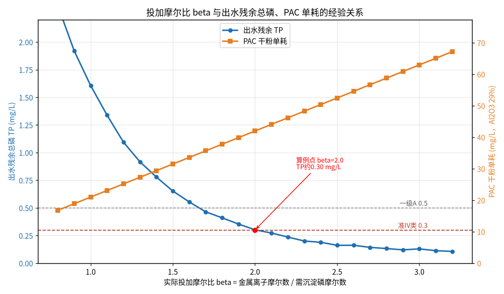
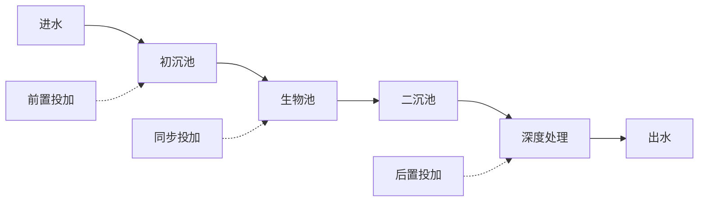

# 04-1 化学除磷机理与投加量计算

> **本章讲什么**：用铝盐（PAC）、铁盐（PFS）除磷，药剂到底跟水里的磷发生了什么反应；为什么理论上 1 摩尔金属对 1 摩尔磷，现场却总要投到 1.5~3 倍；怎样从水量、进出水 TP 一路算到干粉吨数、药液 L/h 和化学污泥量。
> **读完能干什么**：拿到本厂的 Q、TP 数据和药剂化验单，10 分钟内算出"该投多少、合不合理、还能不能省"。
> **阅读时间**：约 35 分钟。配套实算图 1 张、完整算例 2 个。

## 场景导入：出水 TP 又压线了

凌晨两点，中控室报警：某 10 万吨/天市政厂出水总磷 TP 0.48 mg/L，离一级 A 的 0.5 mg/L 只剩"一张纸"的距离。夜班班长把 PAC 计量泵（投加聚合氯化铝的泵）从 1200 L/h 一把拧到 1800 L/h。天亮后 TP 是稳到了 0.25 mg/L，可厂长看着药耗报表皱眉：这个月 PAC 多用了 40 吨，化学污泥还多了两卡车。

**到底投多少才叫刚刚好？** 这一章我们就把这笔账从原子层面算清楚。

## 一、先认识对手：污水里磷的三种形态

总磷 TP（Total Phosphorus，水样消解后测得的全部磷）并不是一种东西，它是"一大家子"：

| 形态 | 在水里的样子 | 占市政进水 TP 的典型比例 | 能否被化学药剂直接沉淀 |
|---|---|---|---|
| 正磷酸盐 | PO₄³⁻、HPO₄²⁻、H₂PO₄⁻，溶解态 | 60%~80%（生化后比例更高） | 能，金属盐一投就反应 |
| 聚合磷酸盐 | 洗衣剂、洗涤剂带入的偏/聚磷酸盐 | 5%~15% | 先水解成正磷酸盐，才能沉淀 |
| 有机磷 | 核酸、磷脂、农药残片，多在污泥/胶体里 | 10%~25% | 靠生物同化和随悬浮物去除，化学药剂基本管不着 |

**单位说明**：本章所有浓度单位 mg/L，默认"以 P 计"，即 1 mg/L TP = 每升水里含 1 mg 磷元素本身（不是磷酸盐的质量）。化验报告单和在线 TP 仪表都是这个口径。

> ⚠️ **现场经验**：二沉池后的磷，80% 以上已经是正磷酸盐——生化池里的微生物和水解过程替你完成了"拆分"。所以**同步沉淀（药投在生物池）化学效率最高**，这是后面讲投加位置的伏笔。

## 二、铝盐、铁盐怎么把磷"摁"进污泥

### 2.1 主反应：1 摩尔金属对 1 摩尔磷

投加铝盐（以 Al³⁺ 代表 PAC 的有效成分）：

```
Al³⁺ + PO₄³⁻ → AlPO₄↓
```

投加铁盐（以 Fe³⁺ 代表 PFS 聚合硫酸铁）：

```
Fe³⁺ + PO₄³⁻ → FePO₄↓
```

生成的磷酸铝、磷酸铁都是**难溶固体**，包在絮体里沉到二沉池或高效沉淀池，最后随剩余污泥走——磷就这样从水里"搬家"到了泥里。

### 2.2 溶度积 Ksp：为什么这反应能进行得很彻底

难溶盐在水里不是完全不溶，而是建立一个平衡：

```
AlPO₄(s) ⇌ Al³⁺ + PO₄³⁻        Ksp = [Al³⁺]·[PO₄³⁻]
```

Ksp（溶度积常数，单位随写法而变，这里只用数量级）越小，盐越难溶、沉淀越彻底：

| 难溶物 | Ksp 数量级（25 ℃，不同资料有差异） |
|---|---|
| 磷酸铝 AlPO₄ | 约 10⁻²¹ |
| 磷酸铁 FePO₄ | 约 10⁻²² |
| 氢氧化铝 Al(OH)₃ | 约 10⁻³³ |
| 氢氧化铁 Fe(OH)₃ | 约 10⁻³⁸ |

> 💡 记住两个结论就够用（不必做热力学作业）：① 磷酸盐的 Ksp 极小，所以化学除磷理论上可以把残余磷压到非常低；② **氢氧化物的 Ksp 比磷酸盐还小**——这恰恰是下一节"药剂为什么省不下来"的根源。

## 三、关键一节：OH⁻ 来抢金属离子，投加系数 β 由此而来

Al³⁺ 跳进污水后，面对的不只有 PO₄³⁻，还有水里**浓度高得多的 OH⁻**（氢氧根）。它同样要跟 Al³⁺ 反应：

```
Al³⁺ + 3OH⁻ → Al(OH)₃↓
Fe³⁺ + 3OH⁻ → Fe(OH)₃↓
```

这就是你看到的黄褐色或灰白色矾花（絮体）的主体。换句话说，投进水里的金属离子在打"两线战争"：一线去沉淀磷，一线被 OH⁻ 消耗去生成氢氧化物絮体。好处是氢氧化物絮体还能顺带网捕悬浮磷和胶体；坏处是——**真正用来沉淀磷的金属离子，只是投进去的一部分**。

于是定义**投加系数 β**（摩尔比，无量纲）：

```
β = 实际投加金属离子的摩尔数 ÷ 需要化学沉淀的磷的摩尔数
```

- β = 1.0：理论化学计量比，只够"一个萝卜一个坑"，现场根本压不到标；
- β = 1.5~3.0：工程实际区间（典型经验值，Al/P 或 Fe/P 摩尔比），同步沉淀常取 1.5 左右，后置深床过滤/高效沉淀池常取 2~3；
- β 再往上加，残余磷下降极微，纯属烧钱，还多产泥。

下图是一条合成的经验下降曲线：β 从 1 加到 2，出水 TP 从约 1.6 快速降到 0.3；β 超过 2.5 以后曲线基本躺平，而 PAC 单耗是直线上涨的——**这就是"加药边际效益递减"最直观的样子**。



*图 04-1：出水残余总磷随摩尔比 β 的经验下降曲线与 PAC 干粉单耗（数据为合成/典型参数实算，具体项目以实测为准）*

## 四、除磷药剂投在哪：三个位置，三套账



| 投加位置 | 投加点 | β 典型经验值 | 优点 | 代价 |
|---|---|---|---|---|
| 前置（预沉淀） | 初沉池前 | 2.0~3.0 | 除磷同时去 SS、降负荷 | 把碳源也沉掉了，不利于后续脱氮；药耗高 |
| 同步（最常用） | 生物池出水端或曝气沉砂后 | 1.2~2.0 | 氢氧化物絮体与生物絮体协同，药耗低；少建池子 | 化学污泥混入剩余污泥，磷回收困难 |
| 后置（后沉淀） | 高效沉淀池/深床滤池前 | 2.0~3.0 | 控磷最稳，可冲准 IV 类 0.3 | 多一套构筑物和污泥系统；药耗最高 |

> ⚠️ **现场经验**：β 不是一个常数！同一天里早高峰进水 TP 冲到 6~7 mg/L 时 β 可能只要 1.5（磷浓度高、竞争反应占比小）；夜间低负荷 TP 只有 1.5 mg/L 时维持 0.3 出水，β 往往要 2.5 以上（金属离子大量被 OH⁻ 白耗）。**固定频率、固定冲程的"一把尺"投加法，本质上是在为最不利工况全天过量投药**——这正是 AI 前馈控制能省 15%~30% 除磷剂的机理空间（典型经验值）。

## 五、投加量公式：从水量 TP 算到干粉、药液和泵流量

### 5.1 公式逐步推导

**第一步：算每天要去掉多少磷**

```
M_P = Q × (C_in − C_out) ÷ 1000
```

符号与单位：

- M_P：每日需去除的磷质量，kg P/d；
- Q：日处理水量，m³/d；
- C_in、C_out：进水、目标出水总磷，mg/L（1 mg/L = 1 g/m³）；
- ÷1000：把克换算成千克。

**第二步：换算成需要的金属离子质量**

1 mol 金属沉淀 1 mol 磷，乘以 β 后：

```
M_金属 = M_P × β × (M金属元素原子量 ÷ 31)
```

- 铝盐：27 ÷ 31 = 0.871，即每沉淀 1 kg P 理论需 0.871 kg Al；
- 铁盐：56 ÷ 31 = 1.806，即每沉淀 1 kg P 理论需 1.81 kg Fe。

**第三步：除以商品药剂里的金属质量分数和纯度**

```
M药 = Q × (C_in − C_out) ÷ 1000 × (M金属 ÷ 31) × β ÷ (w × p)
```

- M药：商品药剂（干粉）用量，kg/d；
- w：药剂中金属元素的质量分数（小数）；
- p：药剂有效纯度（小数，按化验单；受潮结块可按 0.95 折减，本算例取 1.0）。

**第四步：换算成配制药液的体积流量（计量泵设定值）**

```
V药 = M药 ÷ c液 ÷ ρ液 ÷ 24
```

- V药：药液体积流量，L/h；
- c液：配成药液的质量分数（如 10% = 0.10）；
- ρ液：药液密度，kg/L（10% PAC 液约 1.1，典型经验值）；
- ÷24：天换算成小时。

### 5.2 完整算例 1：10 万吨/天厂，TP 4.0 → 0.3 mg/L

**已知条件**（与图 04-1 完全对应）：

- Q = 100 000 m³/d；C_in = 4.0 mg/L；C_out = 0.3 mg/L；
- β = 2.0；药剂 PAC，化验单 Al₂O₃ 含量 29%；配 10% 药液，密度 1.1 kg/L；
- PAC 市场价取 2000 元/t（典型经验区间 1500~2500 元/t）。

**① 先把 Al₂O₃ 含量换算成 Al 质量分数**

Al₂O₃ 摩尔质量 = 27×2 + 16×3 = 102 g/mol，其中铝占 54/102：

```
w_Al = 0.29 × (54 ÷ 102) = 0.29 × 0.5294 = 0.1535
```

即这种 PAC 每 1 kg 含金属铝 0.1535 kg。

**② 每日去磷量**

```
M_P = 100000 × (4.0 − 0.3) ÷ 1000 = 370 kg P/d
```

折合摩尔数：370 ÷ 31 = **11.94 kmol P/d**。

**③ 需要的金属铝与干粉量**

```
M_Al = 370 × 0.871 × 2.0 = 644.5 kg Al/d
     （或 11.94 kmol × 27 kg/kmol × 2.0 = 644.6，一致）

M_PAC = 644.5 ÷ 0.1535 ÷ 1.0 = 4198 kg/d ≈ 4.2 t/d
```

折合单耗：4198 kg/d ÷ 10 万 m³/d × 1000 = **42.0 mg/L**（以干粉计）。

**④ 配成 10% 药液，泵该开多大**

```
药液质量 = 4198 ÷ 0.10 = 41 980 kg/d ≈ 42.0 t/d
药液体积 = 41980 ÷ 1.1 = 38 164 L/d
V药 = 38164 ÷ 24 = 1590 L/h ≈ 1.6 m³/h
```

**⑤ 每天多少钱**

```
药费 = 4.198 t/d × 2000 元/t ≈ 8400 元/d ≈ 307 万元/年
```

> 💡 **自检口诀**：10 万吨厂、TP 降 3.7 mg/L、β=2、PAC 含 Al₂O₃ 29%——干粉约 4.2 t/d、单耗约 42 mg/L、10% 药液约 1.6 m³/h。记住这组量级数字，以后看任何报表先估一遍，对不上就要问为什么。

### 5.3 顺手验算：换成铁盐 PFS 呢

PFS 商品常标"全铁 18%"，即 w_Fe = 0.18，β 同样取 2.0：

```
M_Fe = 370 × (56÷31) × 2.0 = 1336 kg Fe/d
M_PFS = 1336 ÷ 0.18 = 7422 kg/d ≈ 7.4 t/d
```

铁盐实物单耗天然比铝盐高（Fe 原子量 56 比 Al 的 27 大一倍多），**比药剂单价时必须折算到"每去除 1 kg P 花多少钱"，不能只比吨价**。铁盐的优势是 pH 适应窗口宽、低温更稳、出水残余铝风险没有；劣势是腐蚀强、污泥色深、投加设备要求高。

## 六、pH 窗口、低温影响与铝残留

| 项目 | 铝盐（PAC/硫酸铝） | 铁盐（PFS/三氯化铁） |
|---|---|---|
| 最佳除磷 pH（典型经验） | 6.0~7.0 | 5.0~8.5 |
| 超出窗口的现象 | pH>7.5 时 AlPO₄ 有再溶倾向，且出水残余铝升高 | 窗口宽，但过低 pH 出水返黄、腐蚀加剧 |
| 低温（≤12 ℃） | 反应变慢、絮体轻，β 需上浮约 10%~20% | 受影响相对小，北方冬季常用铁盐 |
| 投加后碱度变化 | 每投 1 mol Al³⁺ 约消耗 3 mol 碱度 | 同量级，高投加量时注意碱度与 pH 联动 |

> ⚠️ **现场经验**：冬天除磷效果突然变差，先别急着怀疑药剂假货。水温降到 5~8 ℃ 时，水的黏度上升约 50%（详见 04-3），絮体沉降速度明显变慢，二沉池带着细碎矾花出去——测一下滤后 TP 而非二沉池表层水，再决定是否加 β。

## 七、过量除磷剂的副产品：化学污泥量估算

多投的金属离子没去沉淀磷，就变成 Al(OH)₃/Fe(OH)₃ 成为污泥。用化学计量可以把这笔账算个八九不离十。

**估算公式**（铝盐，以去除每 kg P 计）：

```
磷酸铝污泥干重 = M_P × (122 ÷ 31) = M_P × 3.94      kg DS/d
过量氢氧化铝干重 = M_P × (β−1) × (78 ÷ 31) = M_P × (β−1) × 2.52     kg DS/d
```

- 122、78：AlPO₄、Al(OH)₃ 的摩尔质量，g/mol；31：P 原子量；
- DS（Dry Solids，绝干污泥）：不含水的固体质量，kg DS/d；
- β−1 的含义：超出理论化学计量的那部分金属，全部按生成氢氧化物计（偏保守的经验估算口径）。

### 7.1 完整算例 2：上面那家厂每天多产多少化学污泥

承接算例 1：M_P = 370 kg P/d，β = 2.0。

```
AlPO₄ 干固体 = 370 × 3.94 = 1458 kg DS/d
Al(OH)₃ 干固体 = 370 × (2.0−1) × 2.52 = 931 kg DS/d
化学污泥合计 ≈ 2389 kg DS/d ≈ 2.4 t DS/d
```

脱水后按泥饼含固率 20%（板框前的离心/叠螺泥饼典型值）：

```
湿泥饼 = 2.4 ÷ 0.20 = 12 t/d
外运处置费 = 12 t/d × 300 元/t = 3600 元/d
```

处置费按典型经验区间 200~500 元/t 浮动，具体以当地实际为准。注意这还没算絮体网捕卷扫带走的额外 SS——经验上化学污泥实测量通常比纯化学计量值再高 20%~50%。

> ⚠️ **老工程师的坑**：评估"把 β 从 2.0 提到 2.5 冲准 IV 类"时，要算三本账：①多花的药剂费（图 04-1 右轴，线性上涨）；②多出的化学污泥处置费（本节，约线性上涨）；③碳源协同影响（铝盐抢的是碱度和磷，前置投加还会沉碳，见 04-2）。**只算药费不算泥费，是技改方案被现场打脸最常见的原因。**

## 本章小结

1. 总磷 = 正磷酸盐 + 聚合磷酸盐 + 有机磷，生化后出水以正磷酸盐为主，这才是化学药剂的打击对象；TP 浓度一律以 P 计、以 mg/L 计。
2. 主反应 Al³⁺/Fe³⁺ + PO₄³⁻ → AlPO₄/FePO₄↓，Ksp 低至 10⁻²¹~10⁻²² 量级，理论上除磷可以非常彻底。
3. OH⁻ 同时抢夺金属离子生成氢氧化物絮体，所以必须有投加系数 β（摩尔比），工程实际 β=1.5~3.0；β 越大边际效果越差、药耗与泥耗线性增加。
4. 投加量主公式：M药 = Q·(C_in−C_out)÷1000 ×（金属原子量÷31）× β ÷（金属质量分数×纯度）；药液 L/h 再除以配制浓度、密度和 24。10 万吨/天、TP 4.0→0.3、β=2、PAC 含 Al₂O₃ 29% 的答案是：干粉约 4.2 t/d、单耗 42 mg/L、10% 药液约 1590 L/h、药费约 8400 元/d。
5. 铝盐 pH 窗口 6.0~7.0、铁盐 5.0~8.5，低温时 β 上浮 10%~20%；化学污泥可用化学计量估算（β=2 时约 6.5 kg DS/kg P），比药剂不能只比吨价，要比"每去除 1 kg P 的综合成本"。

---

**上一章**：[03-4 真实事故与返工案例集](../03-问题与成本篇/03-4-真实事故与返工案例集.md)
**下一章**：[04-2 生物脱氮除磷机理与碳源投加计算](04-2-生物脱氮除磷机理与碳源投加计算.md)
