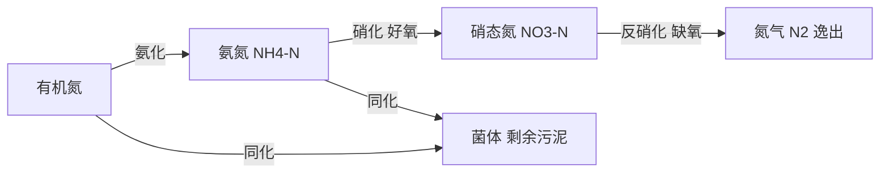
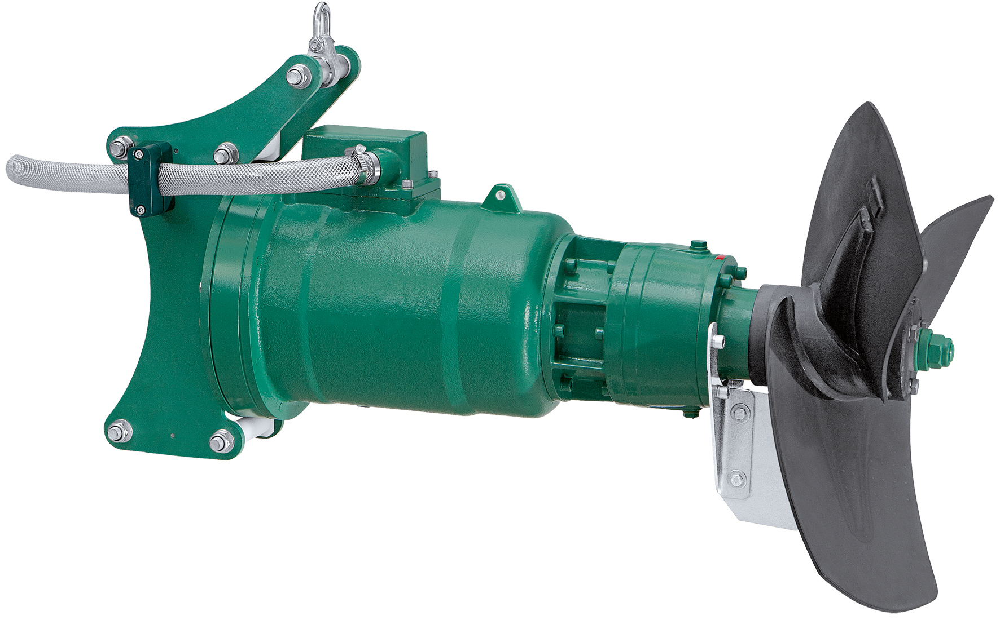
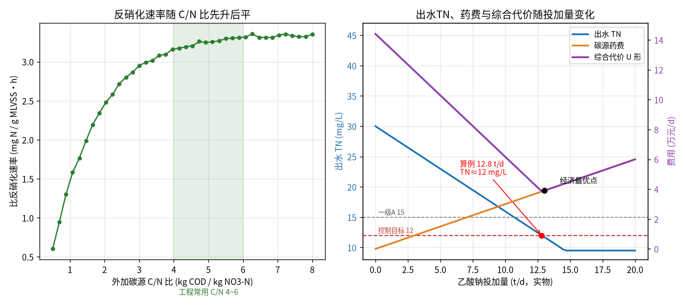

# 04-2 生物脱氮除磷机理与碳源投加计算

> **本章讲什么**：氮在污水厂里的"四段旅程"（氨化→硝化→反硝化→同化），每一步谁来干、要什么条件、吃掉多少氧气和碱度；为什么碳不够反硝化就"罢工"，碳源投加量怎样从 TN 指标和 COD 当量一步步算到吨数和钱；顺带讲清聚磷菌的"先吐后吃"。
> **读完能干什么**：判断本厂到底缺不缺碳、缺多少；用 BOD/TKN 初判、用反硝化氮量精算；独立算出乙酸钠投加量、日费用，并能横向比较甲醇、乙酸、葡萄糖方案。
> **阅读时间**：约 40 分钟。配套实算图 1 张、完整算例 2 个。

## 场景导入：TN 卡在 18，碳源投到心疼

华东某工业园配套厂，Q = 10 万 m³/d，进水 TN（总氮）45 mg/L，出水要求一级 A 的 TN ≤ 15 mg/L。氨氮早就稳稳做到 3 mg/L 以下，可 TN 常年在 17~19 晃——氨氮都硝化成硝态氮了，却"还原不回氮气"。运行主管往缺氧池倒乙酸钠，TN 倒是下来了，厂长却发现：碳源费用一个月 110 万，好氧段 DO（溶解氧）还更难控制了，剩余污泥也见长。

**氮都变成硝态氮了，为什么还出不去？碳源投多少是个头？** 这一章算账。

## 一、氮转化全链：四个反应，四组"打工仔"



| 步骤 | 谁来干 | 环境条件 | 一句话解释 |
|---|---|---|---|
| 氨化 | 大量异养菌 | 无苛刻要求，好氧缺氧都行 | 把蛋白质、尿素等有机氮拆成氨氮 NH₄⁺ |
| 硝化 | 自养菌（AOB/NOB，亚硝酸菌/硝酸菌） | DO≥1.5~2.0 mg/L；碱度足；泥龄 SRT 长；温度敏感 | NH₄⁺ 经 NO₂⁻ 最终氧化成 NO₃⁻，**只改形态不去除氮** |
| 反硝化 | 异养菌 | DO≤0.5 mg/L；有 NO₃⁻；**必须有有机碳** | NO₃⁻ 作"氧气"被还原成 NO₂⁻→N₂O→N₂，氮真正离开水体 |
| 同化 | 全部微生物 | 增殖过程中发生 | 一部分氮被吃进细胞，随剩余污泥排出（占比小） |

**反应式（骨架，不要求背配平）**：

```
硝化：NH₄⁺ + 2O₂ → NO₃⁻ + 2H⁺ + H₂O
反硝化：NO₃⁻ + 有机碳 → N₂↑ + CO₂ + OH⁻（示意）
```

硝化的微生物（自养菌）长得极慢：20 ℃ 时硝化菌世代时间约 3~5 天，12 ℃ 以下要 10 天以上。所以硝化工艺靠**长泥龄 SRT**（污泥停留时间）留住它们——冬季氨氮崩盘，多半是排泥太勤，把硝化菌排走了。

**温度对硝化速率的修正**（典型经验式，10~30 ℃ 适用）：

```
k_T = k_20 × θ^(T−20)，θ 取 1.07~1.10
```

- k_T、k_20：温度 T ℃ 和 20 ℃ 时的硝化速率；θ：温度系数（无量纲）。
- 取 θ=1.07：12 ℃ 时 k_12/k_20 = 1.07^(−8) ≈ 0.58，10 ℃ 时约 0.50——**水温降 10 ℃，硝化速率腰斩**，冬季 SRT 要相应延长约一倍，或降低氨氮污泥负荷。

### 2.1 碱度校核小算例：硝化会不会把 pH 拖垮

承接算例 1 的厂（Q=10 万 m³/d）：氨化后进入好氧段的 NH₄-N 约 3500 kg/d 被硝化（35 mg/L 口径），反硝化 3000 kg N/d。

```
硝化耗碱 = 3500 × 7.14 = 24 990 kg CaCO₃/d
反硝化补碱 = 3000 × 3.57 = 10 710 kg CaCO₃/d
净耗碱 = 24990 − 10710 = 14 280 kg/d，折合 142.8 mg/L（以 CaCO₃ 计）
```

若进水碱度实测 200 mg/L（即 20 000 kg/d）：耗后还剩约 57 mg/L，经验上剩余碱度 ≥ 50~70 mg/L（以 CaCO₃ 计）pH 可稳在 6.8 以上，**无需补碱**；若进水只有 130 mg/L，则缺口约 1300 kg/d，需投纯碱 Na₂CO₃（碱度有效率按约 94%，摩尔质量 106 对 100 CaCO₃）：

```
Na₂CO₃ ≈ 1300 ÷ 0.94 ≈ 1383 kg/d
```

> 💡 这就是为什么"反硝化越差、pH 越掉、硝化越弱、TN 更差"会形成恶性循环；补碳恢复反硝化，往往连纯碱钱一起省了。

## 二、关键化学计量：氧气、碱度、碳，各花多少

这是全篇最值得抄在运行手册扉页上的三行数字（以每 1 kg NH₄-N / NO₃-N 计，典型理论/工程值）：

| 项目 | 数值 | 单位与口径 |
|---|---|---|
| 硝化耗氧 | **4.57** | kg O₂ / kg NH₄-N（反应式 2 mol O₂ 对 1 mol N：64÷14） |
| 硝化耗碱度 | **7.14** | kg 碱度 / kg NH₄-N，以 CaCO₃ 计（100÷14） |
| 反硝化回收碱度 | **约 3.57** | kg 碱度 / kg NO₃-N，以 CaCO₃ 计（约回收一半） |
| 反硝化理论需碳 | 约 2.86 | kg BOD 或 COD 当量 / kg NO₃-N（纯化学计量） |
| 反硝化实际需碳 | **4.0~6.0（常取 4.5~5.5）** | kg COD / kg NO₃-N，含 DO 窜入、亚硝酸支路与工程冗余 |

> 💡 **怎么理解"回收碱度"**：硝化产生 2H⁺（掉 pH），反硝化产生 OH⁻（补 pH）。一个设计良好的 A²/O（厌氧-缺氧-好氧）系统，反硝化充分时能补回约一半碱度，好氧段 pH 刚好稳住；反硝化一差（碳不够），往往氨氮合格但 pH 同步走低——**pH 曲线是反硝化好坏的免费"试纸"**。

## 三、缺不缺碳：先用 BOD/TKN 判据粗判

- TKN（凯氏氮）= 有机氮 + 氨氮，即进水里"除硝态氮以外的全部氮"，mg/L；
- 工程经验判据（典型经验值）：**进水 BOD₅/TKN ≥ 4~5，认为碳基本够**反硝化脱氮；低于 3~4 通常需要外加碳源；
- 更细的判据会用 rbCOD（易生物降解 COD，挥发酸、单糖等"快餐碳"），因为反硝化菌吃不动淀粉、纤维这类"粗粮"。

**粗判算例**：某厂进水 BOD₅ = 140 mg/L、TKN = 42 mg/L：

```
BOD₅/TKN = 140 ÷ 42 = 3.3 < 4
```

判定：碳源不足，仅靠进水碳源无法把 TN 稳定压到 15 以下，需要核算外加碳源——这正是下面精算的入口。

> ⚠️ **现场经验**：南方合流制厂雨季 BOD 被稀释到 60~80 mg/L、TKN 仍有 30+，BOD/TKN 只有 2 出头，"雨停了氨氮合格、TN 反而崩"就是这个机理。这种时段的前馈加药模型必须接入降雨/流量信号（详见 05-数据篇与 07-控制优化篇）。

## 四、聚磷菌：厌氧"吐磷"换碳，好氧"猛吃磷"（够用版）

生物除磷与碳源投加也有关，知道三句话即可：

1. **厌氧段**（无 O₂ 也无 NO₃⁻）：聚磷菌 PAO（聚磷微生物）把体内的磷水解释放到水里（**释磷**，水里 TP 短时升高是正常现象），换取能量吸收 VFA（挥发性脂肪酸，乙酸、丙酸这类"快餐碳"）存成内碳源 PHA；
2. **好氧段**：聚磷菌"吃饱了碳"，过量吸磷，体内聚磷远超正常水平（**超量吸磷**），最后随富磷剩余污泥排出；
3. **工程要点**：厌氧段最怕 NO₃⁻ 窜入（回流污泥带硝态氮会"偷走"VFA），且进水中必须有 VFA。**碳源若投在厌氧段，要选乙酸/乙酸钠这类直接转化为 VFA 的**，投葡萄糖喂的往往是普通发酵菌，生物除磷不买账。



*真实照片：缺氧池/厌氧池用的潜水推流搅拌器（SUMA Optimix 2G）——慢速大叶轮让污泥保持悬浮、与碳源充分混合，但不卷入空气。图片来源：Wikimedia Commons，作者 SUMA Rührtechnik，CC BY-SA 3.0。*

## 五、碳源投加量公式：从 TN 差额算到吨数和钱

### 5.1 公式逐步推导

**第一步：估算需要反硝化的氮量**

```
M_dn = Q × (TN_in − TN_out − N_同) ÷ 1000
```

- M_dn：每日需反硝化的 NO₃-N 质量，kg N/d；
- TN_in、TN_out：进、出水总氮，mg/L；
- N_同：同化进剩余污泥的氮，mg/L，长泥龄市政厂典型经验取 2~5（本算例取 3，具体项目以实测为准）；
- Q：水量，m³/d；÷1000：克→千克。

校核口径：出水 TN_out = 出水 NH₄-N + 出水 NO₃-N + 少量有机氮，先用水质月报确认各形态比例。

**第二步：反硝化总需碳量（按 COD 当量）**

```
COD_需 = M_dn × R_CN
```

- COD_需：反硝化所需可快速利用碳（以 COD 计），kg COD/d；
- R_CN：目标外加口径的 C/N 比，kg COD/kg NO₃-N，工程取 **4.0~6.0**（本算例取 5.0）。

**第三步：扣除进水自带可利用碳**

```
COD_外 = COD_需 − COD_内源
```

- COD_内源：缺氧池进水中实测/折算的 rbCOD 等可利用碳，kg COD/d；没有实测条件时可按进水 BOD₅ 的 20%~30% 粗估，再用现场投加试验反标。

**第四步：折算为商品碳源实物量**

```
m_碳源 = COD_外 ÷ (E_COD × η)
```

- m_碳源：商品碳源实物投加量，kg/d；
- E_COD：该碳源的 COD 当量，kg COD/kg 药剂（见 5.3 表）；
- η：现场利用率（典型 0.85~0.95，乙酸钠取 0.90）。

### 5.2 完整算例 1：10 万 m³/d 厂，TN 45 → 12，投乙酸钠

**已知**：Q = 100 000 m³/d；TN_in = 45 mg/L；TN_out = 12 mg/L（其中出水 NH₄-N = 3 mg/L、NO₃-N 约 8 mg/L、有机氮约 1 mg/L）；N_同取 3 mg/L；目标 R_CN = 5.0；经小试与物料衡算，进水 rbCOD 折算 COD_内源 = 6000 kg COD/d；碳源选无水乙酸钠，E_COD = 0.78，η = 0.90，市场价取 3000 元/t（典型经验区间 2500~4000 元/t）。

**① 需反硝化的氮量**

```
M_dn = 100000 × (45 − 12 − 3) ÷ 1000 = 30 000 kg? 复核单位
     = 100000 m³/d × 30 g/m³ ÷ 1000 = 3000 kg NO₃-N/d
```

（口径核对：TN 差 33 mg/L = 3300 kg/d，其中 300 kg 被同化进污泥，3000 kg 必须反硝化成氮气。）

**② 反硝化总需碳**

```
COD_需 = 3000 × 5.0 = 15 000 kg COD/d
```

**③ 扣除内源碳**

```
COD_外 = 15000 − 6000 = 9000 kg COD/d
```

**④ 折乙酸钠实物量与费用**

```
m_乙酸钠 = 9000 ÷ (0.78 × 0.90) = 12 820 kg/d ≈ 12.8 t/d
药费 = 12.82 t/d × 3000 元/t = 38 461 元/d ≈ 3.85 万元/d
年费用 ≈ 3.85 × 365 ≈ 1404 万元/年
```

折单耗：12 820 kg/d ÷ 10 万 m³/d = **128 mg/L 乙酸钠实物**。投加浓度经稀释后一般控制在 5%~20% 工作液，投加点设在缺氧池入口（与内回流混合处）。

下图右半把这笔账画成了曲线：投加量增加时出水 TN 线性下降（蓝线），药费线性上升（橙线），把"TN 超标压力"折成钱后，综合代价呈 U 形（紫线），**最优点恰好压在控制目标 12 mg/L 边界（约 12.8 t/d）——再往上投，TN 改善不到 1 mg/L，钱全是白花**。



*图 04-2：左——比反硝化速率随 C/N 比先升后平，C/N 4~6 进入平台；右——出水 TN、药费与综合代价随乙酸钠投加量变化（数据为合成/典型参数实算）*

### 5.3 完整算例 2：同一笔碳需求，四种碳源横评

固定 COD_外 = 9000 kg COD/d，按各碳源当量与利用率折实物量（η 均取 0.90 以便同口径比较，甲醇 η 取 0.95）：

| 碳源 | COD 当量 E_COD（kgCOD/kg） | 实物投加量（t/d） | 典型单价（元/t，经验值） | 药费（元/d） | 起效速度/驯化 | 安全与现场管理 |
|---|---|---|---|---|---|---|
| 甲醇 CH₃OH | 1.50 | 9000÷1.50÷0.95 = 6.3 | 2800 | ≈ 1.77 万 | 慢，需 7~15 天驯化专用酶 | 甲类危化品，储罐区要做防爆/喷淋，审批严 |
| 乙酸（冰醋酸） | 1.07 | 9000÷1.07÷0.90 = 9.3 | 3800 | ≈ 3.55 万 | 快，即投即用 | 强腐蚀、刺激气味，设备要 316L 以上 |
| **乙酸钠（无水）** | **0.78** | **12.8** | **3000** | **≈ 3.85 万** | **快，即投即用** | **非危化、低温适应性好，市政厂主流选择** |
| 葡萄糖 | 1.06 | 9000÷1.06÷0.90 = 9.4 | 3000 | ≈ 2.83 万 | 慢，需发酵转化 | 黏性大、易招丝状菌膨胀，投配系统易结垢 |

> ⚠️ **老工程师的坑**：不要只看吨价或只看当量选碳源。甲醇吨药费看似最低（约 1.77 万元/d），但多数市政厂拿不下甲类危化品的安全审批，且停水检修 3 天后驯化好的反硝化菌群退化，重启又要一周"爬坡期"。**北方冬季低温（≤12 ℃），乙酸钠响应快、无结冰断料风险，综合性价比最高**，这也是国内市政厂用得最多的原因。具体项目以现场中试和安全评估为准。

## 六、投加点、反硝化 HRT 与"三重代价"

**投加点选择（典型经验）**：

| 投加点 | 适用 | 注意 |
|---|---|---|
| 缺氧池入口（主流） | 连续流 A²/O、氧化沟 | 距内回流入口近、混合强；反硝化 HRT 宜 2~4 h |
| 厌氧段 | 兼顾生物除磷 | 只能用乙酸/乙酸钠；严防 NO₃⁻ 窜入 |
| 后置反硝化滤池 | 准 IV 类深度脱氮 | HRT 短（15~40 min），碳源必须即投即用，首选乙酸钠 |
| 好氧段 | **禁止** | 碳源直接被 O₂ 烧掉，反硝化一点不沾光 |

### 6.1 缺氧池容/HRT 校核：投了碳，池子够不够大

投碳会把比反硝化速率 SDNR（单位质量微生物每小时还原的 NO₃-N 质量）从内源呼吸水平的约 0.2~0.6 拉到 2~4 mg N/(g MLVSS·h)（图 04-2 左，C/N≈5 时约 3.3，典型经验值）。**投碳却不给反应时间，硝态氮会带着未反应的碳一起冲进好氧段**。

容积估算公式：

```
V_缺 = M_dn ÷ 24 ÷ (SDNR × X_v ÷ 1000)
```

- V_缺：缺氧段有效容积，m³；M_dn：反硝化氮量，kg N/d；
- SDNR：比反硝化速率，mg N/(g MLVSS·h)；X_v：MLVSS 浓度，mg/L（取 3000）；
- ÷24：天转小时；÷1000：单位归算。

取投碳后保守设计值 SDNR = 2.5、X_v = 3000 mg/L：

```
V_缺 = 3000 ÷ 24 ÷ (2.5 × 3000 ÷ 1000) = 125 ÷ 7.5 ≈ 16 700 m³
折合 HRT = 16700 ÷ (100000÷24) ≈ 4.0 h
```

若现有缺氧段 HRT 只有 1.5 h（V≈6250 m³），按上式反算 SDNR 需求要到 6.7 mg/(g·h)——超出常规能力，说明**瓶颈是池子不是碳**，此时应把碳源改投到后置反硝化滤池，或在好氧段末端增设缺氧区，而不是盲目继续加碳。

> 💡 **现场经验**：碳源投加管道上一定要装**活动式或透明观察段 + 流量计远传**。某厂碳源管结晶堵塞两个月没发现，计量泵在"空打"，DCS（集散控制系统）上冲程频率却一直正常——碳源是结晶性很强的溶液，停车后必须用清水反吹管路。

**多投碳源的三重代价**（评估投加方案时一个都不能漏）：

1. **药费本身**：12.8 t/d × 3000 元/t = 3.85 万元/d，这是看得见的第一重；
2. **COD 反弹与曝气电费**：碳源穿透缺氧池进入好氧段，1 kg COD 额外耗氧约 0.85~1.0 kg O₂。按 10% 穿透估：900 kg COD/d × 0.9 ≈ 810 kg O₂/d，鼓风曝气约 1 kWh/kg O₂、电价 0.7 元/kWh，**额外电费约 570 元/d，还把好氧段 DO 搅出振荡**；
3. **剩余污泥增量**：异养菌利用碳源增殖，经验上每投 1000 kg COD 当量碳源约多产 0.2~0.3 t 绝干污泥（具体以实测为准）；本例全部利用口径下潜在增量约 1.8~2.7 t DS/d，进脱水机房后还连锁增加 PAM 消耗（见 04-3）。

## 本章小结

1. 氮的去除主路径：氨化→硝化（好氧、耗氧 4.57 kg O₂/kg N、耗碱 7.14 kg CaCO₃/kg N）→反硝化（缺氧、回收碱度约 3.57、实际耗碳 4~6 kg COD/kg N）→N₂ 逸出；硝化只转形态，反硝化才是真去除。
2. BOD₅/TKN ≥ 4~5 粗判碳够不够；低于 3~4 或雨季稀释工况，要准备外加碳源；更可靠的判据是 rbCOD 和现场投加试验。
3. 碳源公式链：M_dn = Q·(TN_in−TN_out−N_同)÷1000 → COD_需 = M_dn·R_CN（5.0）→ 减内源可利用碳 → m碳源 = COD_外÷(当量×利用率)。
4. 算例答案（10 万 m³/d、TN 45→12、N_同=3、内源 6000 kg COD/d）：反硝化 3000 kg N/d、外加碳需求 9000 kg COD/d、乙酸钠 12.8 t/d、约 3.85 万元/d（约 1404 万元/年）；综合代价 U 形最低点就在达标边界附近。
5. 碳源四选：甲醇当量高最便宜但危化且需驯化；乙酸钠贵一点但安全、即投即用、耐低温，市政主流；葡萄糖易致丝状菌膨胀；投加点必须在缺氧区且防 NO₃⁻ 窜入，多投的代价是药费+COD 反弹曝气电费+污泥增量三本账。

---

**上一章**：[04-1 化学除磷机理与投加量计算](04-1-化学除磷机理与投加量计算.md)
**下一章**：[04-3 混凝动力学与 PAM 助凝](04-3-混凝动力学与PAM助凝.md)
