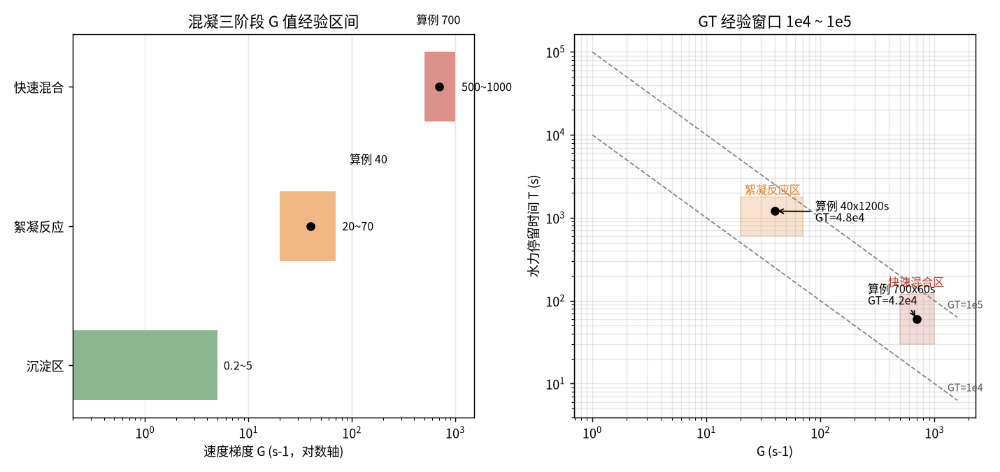
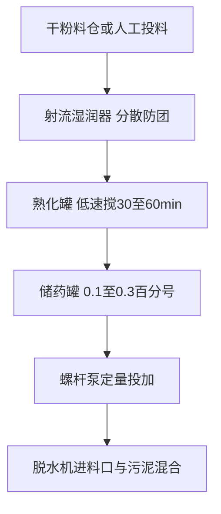

# 04-3 混凝动力学与 PAM 助凝

> **本章讲什么**：把"投药—搅拌—矾花长大—沉淀"这件每天都在做的事拆成两半（凝聚 + 絮凝）和四种作用力；学会用速度梯度 G 和 GT 值判断搅拌"猛不猛、够不够久"；讲透 PAM（聚丙烯酰胺）为什么一根长链条能让污泥抱团，以及脱水机房 PAM 投加量、配制浓度和熟化时间怎么算、怎么选型号。
> **读完能干什么**：看到搅拌器铭牌功率和池子尺寸能反算 G 值，判断混合条件是否在经验窗口内；拿到污泥绝干量能算 PAM 用量、溶液流量和日费用，并能跟脱水机房班组对话选型与过量故障。
> **阅读时间**：约 35 分钟。配套实算图 1 张、完整算例 2 个。

## 场景导入：同一种 PAC，为什么两个池子效果天差地别

某厂提标改造，老高效沉淀池反应室搅拌器老化，桨叶上全是缠绕的纤维，出水带着细碎矾花跑，TP 在 0.45 附近晃。设备专业换了台"劲儿更大"的搅拌器，结果更糟——矾花被搅得稀碎，出水反而更浑。老师傅憋出一句话："不是药不行，是**水被你搅糊涂了**。"

混凝这件事，本质是一门"搅水的学问"。本章把这门学问量化成两个公式。

## 一、混凝 = 凝聚 + 絮凝：两个阶段，两套脾气

| 阶段 | 英文 | 干什么 | 水流状态 | 典型时长 | 核心要求 |
|---|---|---|---|---|---|
| 凝聚（混合） | Coagulation | 药剂在几秒到 1 分钟内**均匀扩散**到每一滴水，脱稳胶体 | 剧烈湍流 | 10 s~2 min（常取 30~60 s） | **快、猛、短**：投药瞬间 G 要高 |
| 絮凝（反应） | Flocculation | 脱稳微粒互相碰撞，长成易沉的大矾花 | 缓慢而有秩序的搅动 | 10~30 min | **慢、稳、长**：G 逐级降低，不能打碎矾花 |

> 💡 生活类比：冲糖水——糖刚倒进杯子要快速搅匀（凝聚），搅匀后再猛搅只会把水溅出来（絮凝聚被打碎）；而雪花的形成是另一极——微粒慢慢碰撞粘连，越滚越大（絮凝）。**快混靠"猛"，絮凝靠"养"**。

## 二、胶体为什么不沉：四种混凝机理（小白版）

污水里的胶体颗粒（黏土、腐殖质、细菌碎片）大多带负电。两个都带负电的颗粒像两个"背对背生气的人"，静电斥力让它们永不靠近，于是水看上去永远是浑的。混凝就是四招轮番上场：

| 机理 | 小白解释 | 主要由谁完成 |
|---|---|---|
| ① 双电层压缩 | 往水里撒电解质，颗粒外那层"排斥气垫"被压扁，热运动一碰就粘 | 无机金属盐的 Al³⁺/Fe³⁺、高离子强度 |
| ② 电中和 | 带正电的水解产物直接贴到负电颗粒表面，电荷归零 | 铝/铁盐水解的多核羟基络合物（PAC 的主力） |
| ③ 吸附架桥 | 长链高分子像"一只多爪的手"，同时抓住好几个颗粒拽到一起 | **PAM 的主战场** |
| ④ 网捕卷扫 | 金属氢氧化物絮体像一张下沉的大网，路过谁裹走谁 | Al(OH)₃、Fe(OH)₃ 大量生成时（04-1 的"二线战争"产物） |

实际投 PAC 时四招同时存在：低投量以①②为主，高投量（高 β）时④网捕成为主力——这也解释了为什么 β 高到一定程度后再增加药剂，除磷收效小但 SS 去除还能继续改善。

仪器上可用**ζ 电位（Zeta potential，剪切面上的电荷，单位 mV）**给电中和定量：天然污水胶体约 −20~−30 mV，互相排斥稳定；投混凝剂后向 0 靠近，**ζ 电位约 −5~+5 mV 是电中和最佳投药区间**。注意追求"调到 0"往往已过投——架桥与网捕还在工作，ζ 只能帮你找下限，最佳投量仍以杯试为准。

### 2.1 投加顺序：先无机、后有机

高效沉淀池常见"PAC + PAM"双药剂投加，顺序错了效果打折：

1. **先投 PAC（无机混凝剂）**：在快混段完成脱稳、电中和，让颗粒"愿意靠近"；
2. **间隔 30 s~3 min 再投 PAM**：待微絮体形成后，长链条才有"桥墩"可挂；
3. **切忌两种药剂在同一小管路或同一投加点浓液直接相遇**：高浓度铝盐会让 PAM 分子蜷曲、交联成凝胶团，当场堵管且两败俱伤。

> ⚠️ **现场经验**：加药间技改时常见错误是把 PAC 和 PAM 投药管并到同一个混合器。两者必须分开投加点，PAM 投在 PAC 之后的絮凝室入口；若现场只有一个投药口，宁可只投 PAC，也不要浓液混投。

## 三、速度梯度 G：给"搅拌猛不猛"一个数

Camp 和 Stein 在 1943 年给出了至今都在用的公式：

```
G = √( P ÷ (μ × V) )
```

符号与单位（务必记单位）：

- G：速度梯度，s⁻¹（每秒的速度差尺度，注意**不是 m/s**）；
- P：搅拌对水输入的有效功率，W（1 W = 1 J/s）；
- μ：水的动力黏度，Pa·s（20 ℃ 清水取 1.0×10⁻³ Pa·s；10 ℃ 取 1.31×10⁻³）；
- V：水池有效体积，m³。

**G 描述单位体积水每秒吸收多少搅拌能量**：能量越大，颗粒碰撞频率越高；但碰撞太猛，已经长大的矾花会被湍流剪切力撕碎——所以快混和絮凝需要截然不同的 G。

絮凝时间够不够，看无量纲积 GT（总搅拌强度）：

```
GT = G × T
```

- T：该阶段水力停留时间，s；GT：无量纲。
- 工程经验窗口（典型经验值）：**GT = 1×10⁴ ~ 1×10⁵**。小于 10⁴ 碰撞不足、矾花长不大；大于 10⁵ 矾花被过度剪切、出水返浑。

| 阶段 | G（s⁻¹） | 时间 T | 对应 GT（s 无量纲） |
|---|---|---|---|
| 快速混合 | 500~1000 | 30~120 s | 1.5×10⁴~1.2×10⁵ |
| 絮凝反应（可分 2~3 级递减） | 20~70 | 10~30 min（600~1800 s） | 1.2×10⁴~1.26×10⁵ |
| 沉淀区 | <5（越静越好） | 1~3 h | 不以 GT 控制，以表面负荷控制 |

下图把三个阶段的 G 区间和 GT 工作窗口画在了一起，两个算例点（黑圆点）都落在 10⁴~10⁵ 窗口内部。



*图 04-3：左——快混/絮凝/沉淀三阶段 G 值经验区间（对数轴）；右——G-T 工作区与 GT=10⁴、10⁵ 等值线（数据为典型经验值实算）*

## 四、完整算例 1：反推两座池子的搅拌功率

**已知**：水温 20 ℃，μ = 1.0×10⁻³ Pa·s。

**① 快速混合池**：V_快 = 20 m³，设计 G = 700 s⁻¹，混合时间 60 s。

```
P_快 = G² × μ × V = 700² × 1.0×10⁻³ × 20
    = 490000 × 0.001 × 20 = 9800 W ≈ 9.8 kW
GT = 700 × 60 = 42 000      （在 1×10⁴~1×10⁵ 窗口内 ✓）
```

**② 絮凝反应室**：V_絮 = 100 m³，设计 G = 40 s⁻¹，反应时间 20 min（1200 s）。

```
P_絮 = 40² × 1.0×10⁻³ × 100 = 160 W
GT = 40 × 1200 = 48 000      （窗口内 ✓）
```

> 💡 注意功率差了 60 倍（9.8 kW 对 160 W）：快混是"几秒内把药摔进每一个水分子"，絮凝只需要"让大矾花温柔地互相碰见"。开头故事里换大搅拌器为什么失败？絮凝室 G 一旦冲到 100~200 s⁻¹ 以上，输入能量远超絮体强度，网还没撒开就被剪碎。

**③ 冬季校核**：水温降到 10 ℃，μ = 1.31×10⁻³ Pa·s，若仍维持 9.8 kW：

```
G = √(9800 ÷ (1.31×10⁻³ × 20)) ≈ 612 s⁻¹
```

黏度上升使同样功率下 G 下降约 13%，冬季快混可适当提频；絮凝端则相反，低温矾花更脆，G 宜取窗口下限（20~30 s⁻¹）。

### 4.1 进阶小算例：高效沉淀池三级絮凝室功率分配

工程上絮凝常分三级，G 逐级递减——"先碰撞、再抱团、最后养密实"。某高效沉淀池每格 V = 60 m³，各级停留时间均为 6 min（360 s），20 ℃：

```
一级 G=55 s⁻¹：P = 55²×10⁻³×60 = 181.5 W，GT = 55×360 = 19 800
二级 G=35 s⁻¹：P = 35²×10⁻³×60 = 73.5 W，GT = 35×360 = 12 600
三级 G=25 s⁻¹：P = 25²×10⁻³×60 = 37.5 W，GT = 25×360 = 9 000
三级 GT 合计 ≈ 41 400（整体落在窗口内）
```

三台搅拌器总功率不到 300 W，但必须**分别变频**：一级把脱稳微粒快速碰撞，三级几乎是"轻托着矾花长大"。现场排查高效池跑矾花，先在中控调出三级搅拌电流——最常见的故障就是三级搅拌频率没人调，三格同速猛搅。

## 五、PAM：一根长链条的"架桥术"

PAM（聚丙烯酰胺）是分子量几百万到两三千万的高分子——拉直了看就是**一条挂满"小手"的超长链条**。链上的酰胺基团（−CONH₂）吸附在污泥颗粒表面，一条链同时吸附好几个颗粒，像糖葫芦串一样把细颗粒连成大絮团（机理③吸附架桥）。无机药剂让颗粒"愿意靠近"，PAM 让它们"绑在一起"，所以称**助凝剂**。

> 补充安全常识：PAM 本体无毒，但残留单体丙烯酰胺有毒性，涉及回用水、景观补水的场合要采购"饮用水级"产品（单体残留 ≤ 0.025%，执行国标对应等级），投加浓度本身（零点几 mg/L 量级）远低于健康风险阈值。

### 5.1 三种离子型怎么选

| 类型 | 链条上的电荷 | 主要用途 |
|---|---|---|
| 阳离子 PAM（CPAM） | 带正电（−N(CH₃)₃⁺ 等季铵基团） | **污泥脱水绝对主力**；与带负电污泥电中和+架桥双作用 |
| 阴离子 PAM（APAM） | 带负电（−COO⁻） | 助凝无机混凝后的负电体系、高浊水、与铝/铁盐搭配用于高效沉淀池 |
| 非离子 PAM（NPAM） | 不带电 | 酸性水质、对剪切敏感的特殊体系，市政厂少用 |

两个常听见的指标：

- **分子量**（单位万 g/mol，如 800 万、1200 万）：分子量越大链条越长、架桥能力越强，但溶液黏度越高、越难溶；脱水常用 800 万~1500 万。
- **阳离子度**（CPAM）：链上带正电基团的摩尔百分比，常见 20%~60%。污泥有机质越高（剩余活性污泥），需要的阳离子度越高（40%~60%）；初沉污泥或无机质多的污泥 20%~30% 即可。
- **水解度**（APAM）：酰胺基水解成羧酸基的比例，常见 20%~30%，决定负电密度。

> ⚠️ **现场经验**：PAM 选型没有"全局最优"，只有"烧杯搅拌试验（Jar Test）最优"。同是离心脱水，有机质高的剩余污泥用阳离子度 50% 的，掺了化学除磷污泥（04-1 那部分无机泥）后可能 40% 的更好用——**污泥性质一变（冬季、投加铁盐、消化后），就要重新做杯试**，一次杯试两小时，省的是一个月的冤枉药。

## 六、完整算例 2：脱水机房 PAM 用量与配药流量

**已知**：10 万 m³/d 市政厂（含化学除磷），绝干污泥量 DS = 30 t DS/d（典型经验约 0.2~0.4 t DS/千 m³ 水，具体以污泥台账实测为准）；阳离子 PAM 投加量取 5 kg/t DS（脱水经验区间 3~8 kg/t DS）；PAM 单价取 2.0 万元/t（经验区间 1.2 万~3 万元/t）；配成 0.2% 工作液，密度近似 1.0 kg/L。

**① 每日 PAM 用量**

```
m_PAM = DS × d_PAM = 30 t DS/d × 5 kg/t DS = 150 kg/d
药费 = (150 ÷ 1000) t/d × 20000 元/t = 3000 元/d ≈ 109.5 万元/年
```

**② 配成 0.2% 溶液的体积流量**

```
溶液质量 = 150 ÷ 0.002 = 75 000 kg/d ≈ 75 t/d
体积流量 = 75000 ÷ 1.0 ÷ 24 = 3125 L/h ≈ 3.1 m³/h
```

**③ 投加量区间压力测试**：若班组图省事长期按 8 kg/t DS 投：

```
m_PAM = 240 kg/d，药费 4800 元/d —— 每年多花约 65.7 万元
```

这还没算过量导致的滤布堵塞与洗布水（见第八节）。**PAM 精细投加（按进泥流量和扭矩/含固率反馈调节）通常有 10%~25% 节药空间**，是全厂 ROI（投资回报率）最快的加药优化点之一。

PAM 配药与投加的标准流程：



### 6.0 烧杯搅拌试验怎么做（杯试六步法）

药剂选型和投加量标定都靠它，一套六个搅拌杯，两小时出结论：

1. 取同一桶污泥或原水，均分到 6 个 1 L 烧杯；
2. 设 6 个梯度投加量（如 PAM 2、3、4、5、6、8 kg/t DS 折算体积）；
3. 快搅 200~300 r/min 约 30 s（模拟凝聚），再慢搅 40~60 r/min 5~10 min（模拟絮凝）；
4. 静置沉淀 10~15 min，观察矾花大小、沉降速度、上清液浊度；
5. 测上清液浊度/TP，过滤测泥饼含固率或毛细吸水时间 CST；
6. 选"上清液最清、絮团不漂、CST 拐点"对应的最小投加量——**拐点之后的药剂都是过投**。

> ⚠️ **现场经验**：杯试用水必须当天取、当天做。污泥静置一夜后絮凝性质会明显变化；冬季取样到实验室要测泥温，用 20 ℃ 做出的投加曲线指导 8 ℃ 的脱水机房，系统性偏差可达 20%~30%。

### 6.1 为什么必须熟化 30~60 min、稀释到 0.1%~0.3%

PAM 干粉遇水表面瞬间溶胀，若一次性大量倒入，外层结团、内芯干粉被包成"鱼眼"（未溶颗粒），不仅废药还堵过滤器。标准流程：

1. **配药浓度 0.1%~0.3%**：浓度高了溶液就是"胶水"，计量泵吸不动、管路阻力大、且单点浓度过高造成局部过投；
2. **熟化 30~60 min**：在熟化罐持续低速搅拌，让长链在水中充分舒展——卷曲的链条是没有架桥能力的；熟化不足的 PAM 药效可能只有标称的一半；
3. **现配现用**：阳离子 PAM 溶液静置超过 24~48 h 会水解降解、黏度下降，夏季更快。

> ⚠️ **老工程师的坑**：熟化罐搅拌器也不能开太猛。PAM 长链在高速剪切下会**断链**——分子量打对折，架桥能力随之打对折。熟化用低速框式搅拌，输送用螺杆泵或低速离心泵，**禁止用高速离心泵和有剧烈节流的阀门**。

## 七、不同脱水设备对 PAM 的"脾气"

| 脱水设备 | 典型 PAM 投加量（kg/t DS） | 絮体要求 | 选型倾向 |
|---|---|---|---|
| 带式压滤机（带机） | 3~6 | 絮团要耐压、耐剪切，滤带不跑泥 | 中高分子量、中高阳离子度 |
| 叠螺脱水机 | 3~5 | 絮团结实即可，环片间隙小，怕鱼眼 | 中分子量、易溶型，溶液过滤要细 |
| 板框压滤机 | 3~5（+石灰/铁盐调理时可降低） | 追求低含水率，常配合无机调理剂 | 中阳离子度；深度脱水常用 FeCl₃+石灰组合 |
| 离心脱水机 | 4~8（最高） | 离心力上千 g，要求絮团抗剪最强 | **高分子量、高阳离子度**，投加量也最大 |
| 高效沉淀池（前端助凝） | 0.1~0.5 mg/L 原水 | 大而轻的矾花絮体 | 多用阴离子/非离子 PAM |

## 八、PAM 过量的三个现场症状

1. **黏度上升**：脱水机滤液能拉出细丝、起泡不散——PAM 过量的直观信号；
2. **滤布/滤带堵塞**：过量高分子糊死滤布孔隙，跑泥、偏带、冲洗频次加密，滤布寿命缩短；
3. **回收水"反污染"**：滤液和脱水机房上清液回流到提升泵房，PAM 在厂内循环累积，初沉池表面出现黏稠浮渣。

> 💡 经验判据：脱水机**扭矩（螺旋受力）随投加量先升后平**——找到扭矩平台起点就是最佳投加量；继续加药扭矩不再增加、滤液黏度却上升，纯属过投。这个"拐点曲线"和 04-1 的 β 曲线哲学完全一致：**所有加药都有边际效益归零的时刻**。

## 九、混凝/助凝现场故障速查

| 现象 | 先查什么 | 典型原因与对策 |
|---|---|---|
| 矾花细碎、出水跑矾花 | 絮凝段 G、GT | 搅拌过猛降频率；或 PAM 断链/熟化不足，查熟化时间与泵型 |
| 池面大量浮渣带黏性 | PAM 投量、回收水 | PAM 过量或滤液回流累积；降投加量、检查脱水机房滤液路径 |
| 配药罐飘鱼眼 | 投料方式 | 干粉集中倾倒；改射流分散投料、检查料斗润湿水 |
| 冬季效果骤降 | 水温、μ | μ 升高、矾花脆；快混提频、絮凝取低 G、PAM 重做低温杯试 |
| 同型号 PAM 突然失效 | 批次、溶解水 | 水解度/阳离子度漂移或用了高硬度水溶解；索取出厂检测单复测 |

> 💡 所有"药剂突然不行了"的报修，按"**三查**"顺序走：查搅拌（设备）→ 查配药（浓度、熟化、批次）→ 查水质泥质（温度、pH、含固率变化），最后才怀疑药剂假货。十次里有八次问题在前两项。

## 本章小结

1. 混凝两阶段：凝聚要快（G=500~1000 s⁻¹、30~120 s），絮凝要养（G=20~70 s⁻¹、10~30 min），沉淀要静（G<5）；总强度窗口 GT=10⁴~10⁵。
2. 四种机理：双电层压缩、电中和（金属盐为主）、吸附架桥（PAM 为主）、网捕卷扫（氢氧化物絮体）；高 β 时网捕成为 SS 去除主力。
3. G=√(P/(μV))，单位 W、Pa·s、m³，算例：20 m³ 快混池 G=700 需 9.8 kW（GT=4.2×10⁴），100 m³ 絮凝室 G=40 仅需 160 W（GT=4.8×10⁴）；冬季 μ 升至 1.31×10⁻³，同功率 G 降约 13%。
4. PAM 靠长链条架桥；污泥脱水首选阳离子型，按有机质选阳离子度（20%~60%）、分子量 800 万~1500 万，型号必须以杯试为准；30 t DS/d、5 kg/t DS 对应 PAM 150 kg/d、0.2% 溶液 3125 L/h、约 3000 元/d。
5. PAM 必须配成 0.1%~0.3%、熟化 30~60 min、低速搅拌防断链、现配现用；离心机投加最高（4~8 kg/t DS）；过量症状是滤液拉丝、滤布堵塞、回收水循环污染——扭矩平台起点就是最佳投量。

---

**上一章**：[04-2 生物脱氮除磷机理与碳源投加计算](04-2-生物脱氮除磷机理与碳源投加计算.md)
**下一章**：[04-4 消毒、pH 中和与其他药剂计算](04-4-消毒pH中和与其他药剂计算.md)
