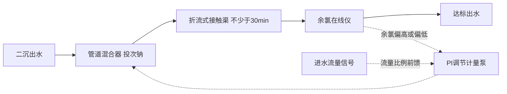
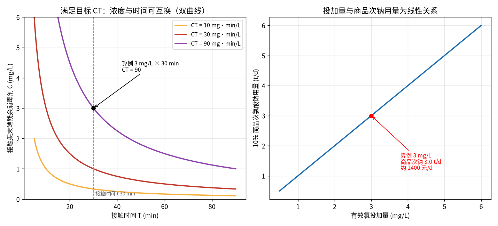

# 04-4 消毒、pH 中和与其他药剂计算

> **本章讲什么**：污水出厂前最后一道防线——氯系消毒的"有效氯、需氯量、余氯、CT 值"四个概念与投加量换算；二氧化氯、紫外线、臭氧各自的脾气；酸碱中和的当量计算（pH 10 的水调到 7 要多少硫酸）；以及消泡、除臭、污泥石灰稳定、营养盐调配这四类"小药"的速算手册。
> **读完能干什么**：能把有效氯 mg/L 换算成 10% 商品次钠吨数和钱；能用 CT 值校核接触渠够不够长；会算酸碱中和投加量并知道什么时候不能只按公式投；会按 100:5:1 给工业废水配营养盐。
> **阅读时间**：约 35 分钟。配套实算图 1 张、完整算例 2 个、速算表 3 张。

## 场景导入：粪大肠菌群超标，问题可能不在投加量

某厂季节性粪大肠菌群超标，班组的第一反应是把次氯酸钠投加量从 3 mg/L 提到 5 mg/L——药味在厂门口都闻得到，超标却依旧。调来接触渠图纸一看：末端溢流堰改管后，实际接触时间只有 11 min，且渠内有短流（水走近路）。**浓度翻了倍、时间不达标，账要按 CT 一起算**。这一章，我们把污水厂"非主力但缺一不可"的药剂账一次算清。

## 一、氯系消毒：先分清四个概念

市政厂目前以**商品次氯酸钠 NaClO**（俗称次钠）投加为主，液氯因安全审批越来越少。

### 1.1 有效氯：不同消毒剂之间的"硬通货"

有效氯不是氯元素含量，而是**氧化能力的当量**：把消毒剂的氧化能力折算成相当于多少质量的 Cl₂（氯气），用百分数或 mg/L 表示。

- 纯 NaClO 的理论有效氯约 95.3%（70.9 ÷ 74.45，Cl₂ 当量电子数口径）；
- **市售商品次钠标称"有效氯 10%"**（典型经验口径，规格 9%~12%），意思是每 1 kg 商品液的氧化能力 ≈ 0.10 kg Cl₂——**采购、计量、报表全部以有效氯口径折算，不按 NaClO 分子算**；
- 商品次钠易分解，夏季库存一周有效氯可衰减 10%~20%，化验单要定期复测。

### 1.2 需氯量 + 余氯 = 投加量

```
投加量（以有效氯计）= 需氯量 + 目标余氯量
```

- **需氯量**：投进去先被还原性物质（Fe²⁺、Mn²⁺、S²⁻、残余氨氮、有机物）消耗掉的部分，mg/L。二级出水典型 1~3 mg/L，水质波动时差异很大；
- **余氯**：消耗完之后留在水里、继续提供杀菌能力的部分，mg/L。

| 余氯形态 | 组成 | 杀菌能力 | 持久性 | 气味/副作用 |
|---|---|---|---|---|
| 游离性余氯 | HClO、ClO⁻ | 强（主力杀菌形态） | 短（十几分钟衰减大半） | 刺激性大，易产三卤甲烷等副产物 |
| 化合性余氯 | NH₂Cl、NHCl₂（氯胺） | 弱（杀菌慢，需更长接触） | 持久（可维持数小时） | 味小，适合长距离管网保菌 |

市政污水有机物和氨氮高，投加后大量余氯以**化合性**存在——这就是污水消毒往往要求"有效氯 1~5 mg/L + 接触 ≥30 min"，而给水厂余氯零点几 mg/L 就够的原因。

## 二、CT 值：杀菌效果是"浓度 × 时间"的乘积

消毒工艺段的典型流程（投加—混合—接触—监测闭环）：



消毒动力学一级近似：微生物灭活率取决于残余消毒剂浓度 C 与接触时间 T 的乘积：

```
CT = C × T
```

- C：接触时间 T 内的**残余**消毒剂浓度（不是投加浓度），mg/L；
- T：有效接触时间，min（注意扣除短流，实际取理论停留时间的 0.5~0.8）；
- CT：mg·min/L。**浓度和时间可以互换**：浓度不够可以拿时间补，时间不够就得加浓度。

典型 CT 要求量级（以游离氯、低温不利条件参考，化合性余氯需放大数倍至数十倍；随水温、pH、目标微生物变化极大，**设计以规范和现场验证为准**）：

| 目标微生物 | 99%（2-log）灭活参考 CT，mg·min/L |
|---|---|
| 大肠杆菌（细菌类） | 0.02~0.1 |
| 粪大肠菌群达标（污水化合氯工况） | 约 10~30 |
| 病毒（肠道病毒等） | 约 2~10 |
| 贾第虫胞囊 | 约 20~80 |
| 隐孢子虫 | 约 30~100 以上（氯几乎无效，需 UV/臭氧） |

下图左半是 CT = 常数的双曲线：CT=30 时接触 30 min 只需残余 1.0 mg/L，接触 10 min 就要 3.0 mg/L；右半是商品次钠用量随投加量的直线。



*图 04-4：左——满足不同目标 CT 时残余浓度与接触时间的互换关系；右——10 万吨/天水量下商品次钠用量（数据为典型参数实算）*

### 2.1 完整算例 1：10 万 m³/d 厂次钠投加与 CT 校核

**已知**：Q = 100 000 m³/d；投加有效氯 3.0 mg/L；商品次钠有效氯 10%；单价取 800 元/t（典型经验值）；接触渠理论 HRT 38 min，按 0.8 折减。

**① 有效氯与商品次钠用量**

```
有效氯需求 = 3.0 mg/L × 100000 m³/d ÷ 1000 = 300 kg/d
商品次钠 = 300 ÷ 0.10 = 3000 kg/d = 3.0 t/d
药费 = 3.0 × 800 = 2400 元/d（折吨水成本 0.024 元/m³，年约 87.6 万元）
```

**② 计量泵换算**（若商品液密度 1.18 kg/L）：

```
体积流量 = 3000 ÷ 1.18 ÷ 24 ≈ 106 L/h
```

**③ CT 校核**：投加 3.0、接触渠末端实测余氯约 1.2（化合性为主），有效接触时间 = 38 × 0.8 ≈ 30 min：

```
CT = 1.2 × 30 = 36 mg·min/L ≥ 30（化合氯粪大肠菌群经验门槛）✓
```

若按开头事故场景只有效接触 11 min：CT = 1.2 × 11 = 13.2 < 30 ✗——即使投加量提到 5 mg/L、末端余氯 2.5，CT = 27.5 仍差一点，**正确做法是修接触堰消除短流、把 T 补回 30 min，而不是无限加浓度**。

接触渠是否短流可用三种土办法核查：①浮标走一遍计时，取最快路径时间而非平均；②渠内多点测余氯，死角区余氯明显偏高即死区；③条件允许做食盐（电导率）示踪试验，取示踪剂 10% 峰值出现的时间（t10）作为有效接触时间——设计规范里的 CT 本就按 t10 取值。

> ⚠️ **现场经验**：次钠不是投得越多越好。过量余氯排入受纳水体对鱼类有毒性（游离余氯排水限值常取 ≤0.5 mg/L），过量投加还会把氨氮全部"折点"氧化，氨氮在线仪表短时读数反而异常。接触渠末端必须有余氯在线仪，**按末端余氯闭环、按进水流量比例前馈**（这是 04-5 表里最好控的快回路），别按储药罐液位估算投加量。

### 2.2 商品次钠的储存与投加注意

1. **衰减**：次钠越热越稀，储罐要阴凉、避光（PE 罐），库存按 7~10 天周转，夏季每次到货复测有效氯并按化验单重算投加系数；
2. **选材**：次钠强氧化、腐蚀碳钢和铜，储罐/管路用 UPVC、PE 或 316L，计量泵用 PVDF 泵头，垫片禁普通橡胶；
3. **气体**：次钠分解或与酸接触会放出 Cl₂，加药间必须机械通风、设氯气侦测报警，**次钠管路与酸管路（中和用硫酸）严禁同沟敷设**；
4. **结盐**：次钠析盐易堵背压阀和注入阀，每月检查一次；稀释水用清水不用二沉出水；
5. 投加泵优先选带冲程/频率双调的隔膜计量泵（SEKO、ProMinent、Pulsafeeder 等常见品牌），与余氯仪、流量计进同一 PLC 回路（见 02-4）。

## 三、ClO₂、UV、臭氧：三种备选消毒对比

| 方式 | 杀菌机理 | 优势 | 短板（重点看持续消毒能力） |
|---|---|---|---|
| 二氧化氯 ClO₂ | 强氧化，现场制备投加 | pH 适应宽（5~9）、副产物较氯少、对隐孢子虫优于氯 | 发生器要吃氯酸钠/盐酸等危化原料；无持久余氯；运行管理复杂 |
| 紫外线 UV | 254 nm 破坏核酸 | 秒级灭活、**无化学药剂、无余氯毒性**、占地小 | **没有持续消毒能力**，出渠后再污染无保护；灯管结垢与寿命管理；SS 遮挡影响大（SS 要求 ≤10 mg/L） |
| 臭氧 O₃ | 氧化破膜 | 杀菌谱最广、脱色除臭、对耐药原虫有效 | **无持续消毒能力**，半衰期约 20 min；投资电耗高、尾气破坏、安全联锁复杂 |
| 次钠/氯 | 氧化+氯胺持续 | 便宜、有持续杀菌能力、运维简单 | 副产物（三卤甲烷等）、余氯生态毒性 |

> 💡 再生水厂常见组合：**UV 主消毒（渠内达标）+ 少量次钠保管网（末梢有余氯）**，各自补足对方短板。提标到准 IV 类、对余氯敏感的受纳水体，优先评估这类组合而不是单加氯。

## 四、pH 中和：当量定律与"缓冲系数坑"

### 4.1 基本公式：按当量算，不按 pH 直接算

中和反应的本质是 H⁺ + OH⁻ → H₂O，**1 当量酸中和 1 当量碱**。纯水中 pH 与 H⁺/OH⁻ 浓度的关系：

```
[H⁺] = 10^(−pH) mol/L；强碱性水中 [OH⁻] = 10^(pH−14) mol/L
纯酸碱当量 = c × V ÷ 1000       mol（一价）
```

- c：H⁺ 或 OH⁻ 的摩尔浓度，mol/L；V：水体积，L；
- 药剂用量 = 当量 × 药剂当量质量（g/当量）÷ 纯度。

### 4.2 完整算例 2：1000 m³ 调节池 pH 10 → 7，投硫酸

**第一步：理论 OH⁻ 当量**

```
[OH⁻] = 10^(10−14) = 10⁻⁴ mol/L
n(OH⁻) = 10⁻⁴ × 1000 × 1000 L = 100 mol
```

**第二步：缓冲修正（关键！）**

实际废水含碳酸盐碱度、氨等缓冲物质，真实耗酸量是纯水中和值的 3~8 倍。取缓冲系数 5（典型经验，必须以现场滴定曲线标定）：

```
实际需中和当量 ≈ 100 × 5 = 500 mol H⁺
```

**第三步：折算 98% 浓硫酸**（H₂SO₄ 每 mol 提供 2 mol H⁺，摩尔质量 98 g/mol，即当量质量 49 g/当量）：

```
纯 H₂SO₄ = 500 mol × 49 g/当量 = 24 500 g = 24.5 kg
98% 商品酸 = 24.5 ÷ 0.98 = 25.0 kg
体积 = 25.0 ÷ 1.84（密度 kg/L）≈ 13.6 L
```

**对称情况（投 NaOH 中和酸水）**：同体量 pH 4 废水，[H⁺]=10⁻⁴ mol/L，缓冲系数同样取 5 → 500 mol；NaOH 当量质量 40 g：

```
纯 NaOH = 500 × 40 = 20 kg；96% 片碱 ≈ 20.8 kg
```

常用中和药剂的选择（典型经验）：

| 药剂 | 优点 | 注意点 |
|---|---|---|
| 硫酸 H₂SO₄（98%） | 用量省、不增加氯离子 | 强腐蚀、稀释放热，必须酸入水；高硬度废水易结 CaSO₄ 垢 |
| 盐酸 HCl（30%） | 无结垢问题、反应快 | 腐蚀强、有酸雾，氯离子增加对后续生化/回用不利 |
| 液碱 NaOH（30%/片碱） | 中和快、渣少 | 易吸潮结块，片碱化料放热伤泵；单价高 |
| 纯碱 Na₂CO₃ | 温和、缓冲性好、安全 | 慢、产生 CO₂ 泡沫，污泥量略增，宜作粗调 |

> ⚠️ **老工程师的坑**：pH 中和绝不能用上面的直线公式直接开环投加。① pH 对投加量的响应是 S 形滴定曲线，在 pH 7 附近一滴药就能跳 1~2 个 pH——加药要配**搅拌、缓冲突和计量泵分段投加**；②必须先做**烧杯滴定**（取 1 L 废水，边搅边滴稀酸/稀碱，记录 pH-投加量曲线），用曲线在目标 pH 处的实际投加率 × 流量做前馈，pH 在线仪做 PI 微调；③浓酸浓碱投加点要远离 pH 电极（局部过浓会烧电极并造成假信号），稀释到 5%~10% 再投。

## 五、四类"小药"速算手册

### 5.1 消泡剂

- 适用：好氧池、厌氧塔、污泥浓缩池的生物泡沫或表面活性剂泡沫；
- 投加量：以商品液计约 **0.5~5 mg/L 受水体积**（事件性投加，典型经验值）；
- 小算例：500 m³ 池体一次压制泡沫投 3 mg/L：500 m³ × 3 g/m³ = 1.5 kg 商品消泡剂，稀释 10 倍后喷洒泡沫带。
- 坑：有机硅消泡剂过量会裹住曝气头降低氧转移效率，并干扰膜池；**点射泡沫带，不全池泼洒**。

### 5.2 除臭药剂（植物液 / 碱洗 + 次钠洗涤）

| 方式 | 原理 | 投加口径（典型经验值） |
|---|---|---|
| 植物液喷淋 | 天然提取物掩蔽+反应 | 稀释 100~500 倍，按臭气空间 1~5 mg/m³ 空气或雾化喷淋点定时投 |
| 碱洗洗涤塔 | NaOH 吸收 H₂S、SO₂ | 循环液维持 pH 9~10（NaOH 投加以 pH 闭环） |
| 次钠氧化洗涤 | NaClO 氧化 H₂S、硫醇 | 循环液有效氯维持 1~3 mg/L，ORP 约 +300~500 mV 闭环 |
| 生物滤池 | 微生物降解 | 不加药，只喷淋保湿+补营养（见 5.4） |

小算例：某洗涤塔循环液 10 m³，有效氯从 1.0 补到 2.5 mg/L（增量 1.5 mg/L）：需有效氯 15 g，折 10% 次钠 150 g/次补加。

### 5.3 污泥石灰稳定

碱性稳定：向脱水污泥投生石灰 CaO（或消石灰 Ca(OH)₂），利用高 pH（**≥12 维持 2 h**）杀菌、钝化重金属、继续脱水。

- 投加比例（典型经验值）：**生石灰为湿污泥质量的 10%~30%**，消石灰口径为 15%~40%，视初始 pH 与含水率由试验定；
- 小算例：板框泥饼 100 t/d（含水率 60%），按 15% 投生石灰：100 × 0.15 = **15 t/d 生石灰**；
- 坑：石灰大幅增加泥饼外运量（100 t 变 115 t），评估处置费要连增量一起算；石灰仓扬尘与烫伤防护不可省。

### 5.4 营养盐调配：BOD : N : P = 100 : 5 : 1

好氧微生物的"伙食比例"：每降解 100 kg BOD₅，约需 5 kg 氮和 1 kg 磷（质量比）。**碳源过剩、氮磷不足的工业废水**（食品、酿造、化工、垃圾渗滤液常见）缺营养会导致污泥絮体松散、浮泥、处理效率崩。

补加量公式：

```
m_尿素 = Q × BOD₅ × (5÷100) ÷ 1000 ÷ w_N − N_进水
m_磷肥 = Q × BOD₅ × (1÷100) ÷ 1000 ÷ w_P − P_进水
```

- w_N：氮肥含氮质量分数（尿素 CO(NH₂)₂ 含 N = 28÷60 = 46.7%）；
- w_P：磷肥含磷质量分数（磷酸二氢钾 KH₂PO₄ 含 P = 31÷136 = 22.8%；磷酸氢二钠 Na₂HPO₄ 无水物含 P = 31÷142 = 21.8%）。

### 5.5 完整算例 3（营养盐）：给缺营养的工业废水配餐

某食品废水 Q = 2000 m³/d，BOD₅ = 1200 mg/L；进水 TKN = 10 mg/L、TP = 2 mg/L。

```
BOD 总量 = 2000 × 1200 ÷ 1000 = 2400 kg/d
需 N = 2400 × 5 ÷ 100 = 120 kg/d；进水 N = 2000 × 10 ÷ 1000 = 20 kg/d
需 P = 2400 × 1 ÷ 100 = 24 kg/d；进水 P = 2000 × 2 ÷ 1000 = 4 kg/d
N 缺口 = 100 kg/d；P 缺口 = 20 kg/d

尿素 = 100 ÷ 0.467 = 214 kg/d
磷酸二氢钾 = 20 ÷ 0.228 = 87.7 kg/d
```

投加要点：尿素要预先溶解（温水化料、防结块堵管），与磷盐分开投加口，投在好氧池前 2~4 h 流程处让微生物"开饭"；负荷低时营养盐要随 BOD 实际值同步下调，否则投进去的氮磷直接变成出水氨氮/TP 超标——**补营养补成超标单是常见低级事故**。

## 本章小结

1. 四个概念：有效氯（折算成 Cl₂ 的氧化能力，商品次钠约 10%）、需氯量（被还原性物质先消耗）、余氯（游离性强但短、化合性弱但持久）、投加量 = 需氯量 + 余氯；市政污水以化合性余氯为主。
2. CT = C×T，浓度与时间可互换；污水化合氯工况粪大肠菌群门槛经验 CT 约 10~30 mg·min/L，接触 ≥30 min；算例 10 万吨厂、3 mg/L 对应商品次钠 3.0 t/d、约 2400 元/d，末端余氯 1.2×30 min = 36 达标，接触渠短时加浓度补不上时间。
3. UV、臭氧无持续消毒能力、ClO₂ 无持久余氯，再生水常用 UV 主消毒+少量次钠保末梢；隐孢子虫氯基本无效。
4. 酸碱中和按当量（1 当量对 1 当量）：1000 m³ pH 10 水理论仅需 24.5 kg 纯硫酸，但乘以 3~8 的缓冲系数后约 25 kg 98% 浓硫酸（13.6 L）；必须先做滴定曲线，pH 7 附近严禁直线开环投加。
5. 小药速算：消泡剂 0.5~5 mg/L 点射；碱洗 pH 9~10、次钠洗涤循环液有效氯 1~3 mg/L；石灰稳定为生石灰占湿泥 10%~30%（100 t/d 泥饼 ×15% = 15 t/d）；营养盐 BOD:N:P=100:5:1，算例 2000 m³/d 食品废水补尿素 214 kg/d、磷酸二氢钾 87.7 kg/d，且必须随实际 BOD 动态下调。

---

**上一章**：[04-3 混凝动力学与 PAM 助凝](04-3-混凝动力学与PAM助凝.md)
**下一章**：[04-5 加药过程动态特性：PID、前馈与反馈](04-5-加药过程动态特性-PID前馈与反馈.md)
