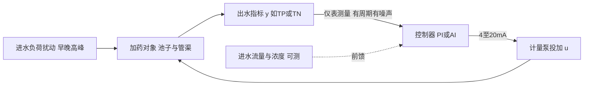
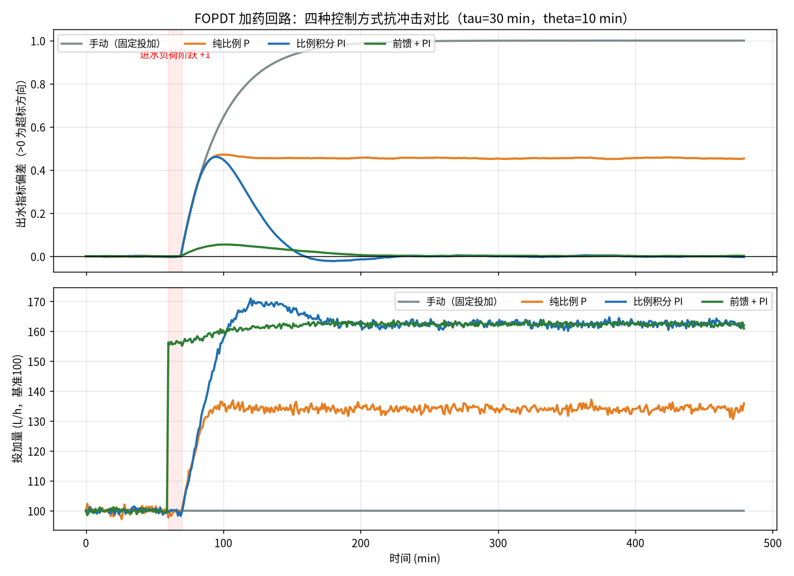

# 04-5 加药过程动态特性：PID、前馈与反馈

> **本章讲什么**：把加药控制回路抽象成你家里的"调热水"——温度计测到凉了再开热水（反馈），和看到天冷提前多烧（前馈）；用一阶加纯滞后 FOPDT 模型讲清增益 K、时间常数 τ、纯滞后 θ 三个参数在污水厂加药回路里的真实量级；讲透 P/PI/PID 各项作用、整定方向口诀、为什么 90% 水厂只用 PI；最后给一份可直接运行的纯 Python 仿真，对比手动/P/PI/前馈+PI 四种打法。
> **读完能干什么**：能辨识本厂加药回路属于"快回路"还是"慢回路"；看懂 PID 参数面板并知道往哪个方向拧；理解前馈+反馈复合控制的结构和"可测扰动"前提；运行仿真脚本，亲手改 τ、θ、Kc 观察曲线变化。
> **阅读时间**：约 40 分钟。配套实算图 1 张（四控制器对比仿真）、完整算例 2 个、可运行代码 1 份。

## 场景导入：为什么明明加了药，仪表一个半小时后才理你

某厂给二沉池出水装了在线 TP（总磷）仪，投加点在生物池出水端。早 8 点进水浓度冲高，TP 仪表 9:40 才抬头；班长立刻加大 PAC，可出水 TP 一直爬到 10:30 才回头——**药早到了，水还在"路上"**。等看到结果再纠偏，永远慢半拍，于是只能过量投药"用保险量买平安"。

这个"慢半拍"在控制理论里有精确的名字。本章把它拆开，你会发现 AI 加药优化的全部空间，几乎都来自与这三个动态参数的博弈。

## 一、把加药回路想成"调淋浴热水"



- 你拧混水阀 = 调计量泵冲程频率（操纵变量 u，单位 L/h）；
- 喷头水温 = 出水 TP/TN（被控变量 y，单位 mg/L）；
- 楼上有人冲马桶、天冷水压波动 = 进水负荷（扰动 d，早晚高峰的 Q 和浓度）；
- 水从热水器流到喷头的管段 = 纯滞后 θ；
- 水管里存水升温的过程 = 时间常数 τ。

## 二、FOPDT 模型：三个参数看懂加药回路

绝大多数加药-出水通道，用**一阶加纯滞后模型**（FOPDT，First-Order Plus Dead Time）就能抓住八成特征：

```
        K · e^(−θs)
G(s) = ─────────────
         τs + 1
```

（不用怕拉普拉斯算子 s，下面只讲三个参数的物理意义。）

| 参数 | 名称 | 物理意义 | 污水厂加药回路中的典型量级 |
|---|---|---|---|
| K | 过程增益 | 投加量每变 1 个单位，出水最终变多少（除磷/碳源回路为负：药加得多指标下降） | 因回路而异，可用历史数据阶跃试验估计，见 2.3 |
| τ | 时间常数（min） | 投加改变后，出水走完 63.2% 变化所需时间——池子"反应+混合"的惯性 | 加药点局部混合 5~15 min；整廊道生物反应 0.5~3 h |
| θ | 纯滞后（min） | 药投下去到"出水开始有反应"的等死时间——管渠输送+二沉停留+仪表周期 | 二沉+管渠 1~3 h；在线 TP/氨氮仪本身还有 10~30 min 测量周期 |

关键组合判据：**θ/τ 越大越难控**。θ/τ < 0.3 属于好控回路（普通 PI 就很好）；θ/τ > 1 属于"等你看到结果黄花菜都凉了"，反馈控制必然过量，必须上前馈或用预测控制（07-3 的 MPC 就是专治这个）。

> ⚠️ **现场经验**：在线分析仪 10~30 min 才出一个数（试剂法），这个测量周期要**直接计入 θ**。很多项目把 θ 只按水力停留时间算，忽略仪表死区，整定出来的 PI 在现场必然振荡。DO/pH/ORP/流量是秒级仪表，所在回路 θ 小得多——所以曝气短周期闭环能做，加药长周期闭环要慎做。

### 2.1 阶跃响应：从历史数据认出 K、τ、θ

在平稳工况把计量泵开度手动阶跃 +10%，记录出水响应曲线：

```
y(∞) − y(0)                    ← 稳态变化量
K = ───────────── （注意除磷回路 y 下降，K 为负）
       Δu
θ = 从投加改变到出水开始明显变化的时间
τ = 从开始变化到走完总变化量 63.2% 所需时间
```

### 2.2 完整算例 1：除磷回路 θ/τ 判读

某厂 PAC 投在生物池末端，出水 TP 仪表在总出口。阶跃试验记录：泵开度 +200 L/h 后 45 min 出水 TP 开始下降，再过 55 min 完成总降幅 0.36 mg/L（最终稳定值）。

```
K = −0.36 ÷ 200 = −0.0018 mg/L 每 (L/h)
θ = 45 min（管渠+二沉+测量死区）
τ = 55 min（生物池末端混合反应惯性）
θ/τ = 45÷55 = 0.82 → 难控回路
```

判读：θ/τ = 0.82，纯反馈 PI 必然"看着后视镜开车"——等仪表确认超标再投，药到之时冲击已过，结果是冲击峰压不住、平峰又过投。**对策是把前馈信号前移到进水端**（进水流量 Q + 进水 TP 或电导 surrogate 信号），反馈只做修正。

### 2.3 完整算例 2：碳源回路为什么更慢

碳源投在缺氧池入口，TN 仪表在总出口：水走完缺氧+好氧+二沉+管渠约 2.5 h（θ ≈ 150 min），反硝化生物过程 τ ≈ 90 min：

```
θ/τ = 150÷90 = 1.67（典型大滞后回路）
```

这就是碳源回路 90% 的厂至今仍在"经验定时投加"的原因——反馈整定空间极小，而进水流量/硝态氮前馈、好氧-缺氧 ORP 曲线判料、以及 07-3 的 MPC（模型预测控制）才是正解。碳源节药空间经验值 10%~25%，全部来自"提前量"打得准。

## 三、反馈控制：P、PI、PID 各干什么

以除磷为例，误差 e = 出水测量值 − 目标值（出水越差 e 越大，药要越加）。**位置式 PID 离散公式**（PLC 每个控制周期 Δt 执行一次）：

```
        ┌                          Δt                    Td                 ┐
u(k) =  │ Kc·e(k) + Kc·──· Σ e(i) + Kc·──·[e(k) − 2e(k−1) + e(k−2)] │ + u₀
        └            Ti                    Δt                           ┘
          └── P 比例 ──┘   └── I 积分 ──┘  └────── D 微分（超前）──────┘
```

| 项 | 作用 | 加大参数的效果 | 副作用 |
|---|---|---|---|
| P（比例 Kc） | 偏差越大投加越多，立即反应 | 响应快 | **有余差**（永远差一点）；Kc 太大会振荡 |
| I（积分，时间常数 Ti 越小积分越强） | 只要还有偏差就持续累加，直到余差归零 | 消除余差 | 动作滞后、超调；积分会"记住"扰动造成饱和（积分饱和） |
| D（微分，Td） | 偏差变化快就提前加码 | 超前制动、压制超调 | 对测量噪声极度敏感，跟着噪声乱跳 |

**整定参数变化方向速查（口诀表）**：

| 想要的效果 | Kc（比例增益） | Ti（积分时间） | Td（微分时间） |
|---|---|---|---|
| 响应更快 | 增大 | 减小 | 适当增大 |
| 消除余差 | — | 减小 | — |
| 减少振荡/超调 | 减小 | 增大 | 谨慎增大 |
| 抗噪声 | 减小 | — | **Td 置 0** |

Ziegler-Nichols（齐格勒-尼科尔斯）临界比例度法简述：先关掉 I 和 D，逐步加大 Kc 直到出水出现等幅振荡，记下临界增益 Ku 和振荡周期 Tu，再按经验表（PI：Kc≈0.45Ku、Ti≈0.83Tu）设置后现场细调。它给的是"能跑的起点"，不是最优值。

### 3.1 为什么 90% 的水厂加药只用 PI 不用 D

1. **噪声大**：在线 TP/氨氮仪试剂比色本身有 ±0.02~0.05 mg/L 跳动，D 项对噪声做差分，会把噪声放大成计量泵的频繁启停；
2. **滞后大**：θ 很大时，"偏差变化率"此刻的方向不代表未来，微分的超前判断经常超前错方向；
3. 积分消除余差 + 前馈负责提前量，D 在加药回路里没有合适的生态位。**工程默认：先 PI，不够再加前馈；D 只在小滞后、低噪声回路（如某些流量、压力回路）才用。**

> ⚠️ **现场经验**：调试 PI 先把积分关了，只用 P 找到"能稳住但有余差"的 Kc，再加积分（Ti 从大往小调），最后把余差消掉且不振荡为止。一上来就 P、I 一起拧，出了振荡你根本分不清是谁的锅。另务必给积分限幅（抗积分饱和），否则停药检修期间积分项会"憋满"，恢复时计量泵长时间满量程冲药。

## 四、前馈控制：不等挨打，看拳头来就先躲

**前馈**（Feedforward）：扰动一旦**可测**，在它影响出水之前就按模型改变投加：

```
u_ff(k) = −Kd ÷ Kp × d(k)
```

- d(k)：可测扰动，如进水流量 × 进水浓度（kg TP/h、kg NO₃-N/h 负荷）；
- −Kd/Kp：扰动通道增益与投加通道增益之比（除磷本质就是 04-1 的负荷比例投加公式）；
- 前提条件（缺一不可）：①扰动**能量化测量**（有流量+仪表或可靠软测量，见 05-3）；②扰动通道与投加通道动态差异可建模；③投加执行机构跟得上。

**前馈的硬伤**：模型不可能完全准（β 随温度/pH 漂移、药剂批次含量波动），纯前馈会积累偏差。所以标准结构是**前馈+反馈复合控制**：

```
总投加 = 基准投加 + 前馈项（按进水负荷粗调，扛 80%~90% 变化）
                + 反馈 PI 项（按出水余差精调，只动 ±10%~20%）
```

### 4.1 PLC 里更常用：增量式（速度式）PI

现场 PLC（如西门子 S7-1200/1500）很少直接算位置式，而是算每个周期的投加增量，再累加到上一拍输出上：

```
Δu(k) = Kc·[e(k) − e(k−1)] + Kc·(Δt÷Ti)·e(k)
u(k) = u(k−1) + Δu        （再做上下限幅与变化率限幅）
```

- Δu(k)：本周期投加量变化，L/h；e(k)、e(k−1)：本拍、上拍误差；
- 好处：①手/自动切换无冲击（无扰切换），输出保持在当前泵开度；②限幅直接、抗积分饱和天然好做；③仪表坏信号（跳变）只影响一拍。
- 对应到计量泵：u(k) 换算成冲程频率（次/min）或 4~20 mA 信号，变化率限幅常设为每分钟不超过满量程的 5%~10%，防止药剂管路水锤。

### 4.2 本厂各加药回路该上什么架构（选型速查）

| 回路 | 测量仪表周期 | θ/τ 量级 | 推荐架构 |
|---|---|---|---|
| 消毒次钠（接触渠前） | 余氯秒级~分钟 | 0.2~0.5 | 流量比例前馈 + 余氯 PI（反馈很快，简单可靠） |
| 除磷 PAC（同步投加） | TP 10~30 min | 0.5~1.2 | 进水负荷前馈为主 + 出水 PI 微调 |
| 碳源（缺氧池） | TN/硝氮 15~30 min | 1~2 | 进水负荷+硝态氮前馈 / MPC，反馈仅兜底 |
| 脱水 PAM | 扭矩/流量秒级 | <0.3 | 进泥流量比例 + 扭矩 PI，PID 可选 |
| pH 中和 | pH 秒级 | 0.3~1（滴定曲线非线性） | 分程 PI + 缓冲突，谨慎用 D |

这与 00 篇图 00-1 里 AI 前馈投加 vs 人工经验投加的曲线差异，是同一机理的两次呈现。

| 对比 | 纯反馈 PI | 纯前馈 | 前馈 + PI 复合 |
|---|---|---|---|
| 对可测大扰动 | 慢半拍，靠余差驱动 | 立即响应 | 立即响应且无余差 |
| 对不可测扰动 | 能纠 | 无能为力 | PI 兜底 |
| 模型误差 | 不敏感 | 误差全部暴露 | PI 慢慢修正 |
| 工程落地 | 简单 | 需在线仪表与模型 | **水厂主流目标架构** |

## 五、可运行仿真：四种控制器打一场"进水冲击"

下面这份纯 Python（仅 numpy/matplotlib，约 80 行）构造一个 FOPDT 加药对象：τ = 30 min、θ = 10 min、投加通道增益 Kp = −0.8、扰动增益 Kd = 1.0；第 60 min 进水负荷阶跃 +1（模拟早高峰浓度冲击），让手动、P、PI、前馈+PI 四种控制器分别应对。代码为仓库脚本 [fig04_05_pid_response.py](../scripts/fig04_05_pid_response.py) 的仿真核心（脚本仅多出绘图部分），可直接 `cd scripts && python3 fig04_05_pid_response.py` 运行：

```python
import numpy as np
import matplotlib
matplotlib.use("Agg")
import matplotlib.pyplot as plt
plt.rcParams["font.sans-serif"] = ["Noto Sans CJK SC"]
plt.rcParams["axes.unicode_minus"] = False

rng = np.random.default_rng(42)
tau, theta, Kp, Kd = 30.0, 10.0, -0.8, 1.0   # min, min, 投加增益(负), 扰动增益
dt, n = 1.0, 480
t = np.arange(n) * dt
delay = int(round(theta / dt))
a = np.exp(-dt / tau)
d = np.where(t >= 60, 1.0, 0.0)              # 60 min 进水负荷阶跃 +1

def simulate(controller, noise=0.012):
    y = np.zeros(n); u = np.zeros(n); ui = 0.0
    for k in range(1, n):
        e = y[k - 1] + rng.normal(0, noise)  # 出水偏高量(测量含噪声)
        ku = k - delay
        d_use = d[ku] if ku >= 0 else 0.0
        u_use = u[ku] if ku >= 0 else 0.0
        if controller == "manual":
            u[k] = 0.0
        elif controller == "P":
            u[k] = np.clip(1.5 * e, -2, 3)                  # Kc=1.5
        elif controller == "PI":
            ui += 1.2 * dt / 20.0 * e; ui = np.clip(ui, -2, 3)   # Kc=1.2 Ti=20
            u[k] = np.clip(1.2 * e + ui, -2, 3)
        elif controller == "FFPI":
            u_ff = 0.9 * (-Kd / Kp) * d[k]                  # 前馈模型故意留10%误差
            ui += 0.8 * dt / 25.0 * e; ui = np.clip(ui, -1.5, 1.5)
            u[k] = np.clip(u_ff + 0.8 * e + ui, -2, 3)
        y[k] = a * y[k - 1] + (1 - a) * (Kp * u_use + Kd * d_use)
    return y, u

for name in ["manual", "P", "PI", "FFPI"]:
    y, u = simulate(name)
    print(name, "最大偏差 %.3f" % np.max(abs(y)),
          "IAE %.1f" % np.sum(abs(y) * dt),
          "稳态偏差 %.3f" % np.mean(y[-60:]))
```

脚本实际运行输出（IAE = 误差绝对值对时间积分，越小越好）：

| 控制器 | 最大偏差 | IAE | 投加动作量 | 稳态偏差 | 解读 |
|---|---|---|---|---|---|
| 手动（固定投加） | 1.000 | 380.5 | 0.0 | 1.000 | 完全不抵抗，出水全程超标 |
| 纯比例 P | 0.472 | 183.2 | 10.1 | 0.455 | 峰削了一半，但**余差 0.455 永远消不掉** |
| 比例积分 PI | 0.461 | 23.1 | 8.5 | −0.001 | 余差归零，但峰仍要等 45 min 才反应 |
| 前馈 + PI | 0.055 | 4.6 | 6.7 | 0.001 | 冲击刚冒头就预投，峰值几乎不可见，PI 只需修掉前馈 10% 的模型误差 |



*图 04-5：上——进水阶跃冲击下四种控制的出水偏差响应；下——对应的计量泵投加量曲线（基准 100 L/h，合成 FOPDT 对象实算）*

> 💡 三个值得亲手做的实验（改脚本参数即可）：①把 θ 从 10 改成 60，看 PI 的峰和振荡如何恶化（体会大滞后）；②把 PI 增益 Kc 从 1.2 加到 3.0，看曲线振荡发散；③把前馈误差从 10% 改成 30%，看 PI 需要多久"擦屁股"。这三个实验做完，你对 07-控制优化篇里所有架构的直觉就建立了。

## 六、从机理到 AI：这一章在全篇的位置

04-1~04-4 解决"**该投多少**"（稳态化学计量），本章解决"**什么时候投、提前多少**"（动态）。再往后：05-数据篇解决 θ 里那个"10~30 min 出一个数"的仪表能否用软测量变快；06-AI 建模篇用数据把 K、τ、θ 和 Kd 从常数升级成随工况变化的模型；07-控制优化篇把前馈+PI 升级成 MPC。机理公式没有被 AI 取代——**AI 学到的每一个投加策略，都必须通过这三个动态参数接受物理合理性的审判**。

## 本章小结

1. 加药回路可用 FOPDT 三参数描述：增益 K（投加对出水的最终影响）、时间常数 τ（反应惯性，混合 5~15 min、生物过程 0.5~3 h）、纯滞后 θ（管渠+二沉+仪表，1~3 h）；θ/τ 越大越难控，大于 1 必须靠前馈/预测。
2. 阶跃试验可从历史数据辨识三参数：K = Δy(∞)/Δu，θ 为等死时间，τ 为完成 63.2% 响应的时间；算例除磷回路 θ/τ=0.82、碳源回路 1.67，解释了为什么碳源普遍还在经验投加。
3. PID 离散公式中：P 快速但有余差，I 消余差但带来超调与饱和，D 超前但放大噪声；参数变化按口诀表调；Ziegler-Nichols 只提供起点。
4. 90% 水厂加药只用 PI：仪表噪声 + 大滞后让 D 项弊大于利；调试顺序先 P 后 I、积分必限幅。
5. 前馈按可测扰动（进水负荷）提前预投，公式 u_ff = −Kd/Kp·d；前馈+PI 复合是主流架构（前馈扛 80%~90% 变化，PI 修残差）。仿真证实：面对阶跃冲击，手动 IAE 380.5、P 余差 0.455、PI IAE 23.1 但峰仍在、前馈+PI IAE 仅 4.6 且峰值 0.055——节药空间全部来自"提前量"。

---

**上一章**：[04-4 消毒、pH 中和与其他药剂计算](04-4-消毒pH中和与其他药剂计算.md)
**下一章**：[05-1 数据从哪来：点位表与数据字典](../05-数据篇/05-1-数据从哪来-点位表与数据字典.md)
