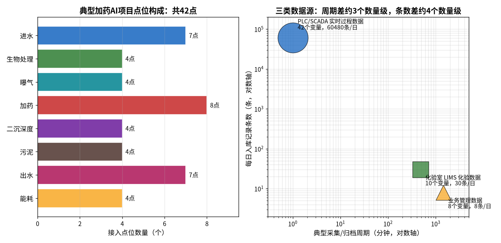
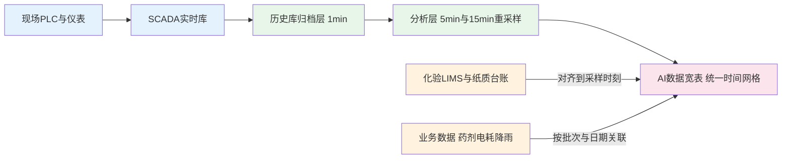

# 05-1 数据从哪来：点位表与数据字典

> 这一章解决 AI 项目最朴素的第一个问题——**数据到底在厂里哪个柜子里、长什么样、怎么拿出来**。
>
> 读完你能：说清污水厂三类数据源的区别；拿着一张 42 行的点位表进现场对表；知道数据字典必须写死哪些字段；能从 SCADA 历史库里把数据导成 CSV，或用 OPC UA/Modbus 对接。
>
> 阅读时间：约 25 分钟。

---

## 一、场景导入：厂长说"我们数据全都有"

工程师小周第一次进厂做加药 AI 调研，厂长拍着胸脯说："我们 2019 年提标改造时上的全套自控，SCADA（数据采集与监视控制系统，中控室那套电脑画面）里什么数据都有，你们随便用。"

小周很高兴，要了历史数据。三天后他看到的现实是：

1. 进水 COD 有三个版本：在线分析仪一个数、化验室台账一个数、环保局平台一个数，**三个数经常对不上**；
2. 加药泵频率能从 PLC（可编程控制器，现场柜子里直接控制设备的工业电脑）里读出来，但**药剂实际投加量没有流量计，只有仓库的领料单**；
3. SCADA 里的点名是 `P101_F`、`TAG0047` 这种代号，全厂只有一个离职的自控厂家工程师知道是什么意思；
4. 化验数据还在纸质本子上，**下雨天那一栏经常空着**。

> ⚠️ **老工程师的坑**："我们数据全都有"是污水厂 AI 项目排名第一的幻觉。**有画面 ≠ 有数据，有数据 ≠ 有能用的数据，有历史库 ≠ 历史够长够干净**。进场第一件事永远是盘点位，而不是谈算法。

真正的盘点，要先认清厂里的数据其实来自三个完全不同的"世界"。

---

## 二、三类数据源全景

污水厂的数据不是一潭水，而是三条流速、密度、方言都不同的河流。

| 数据源 | 典型内容 | 产生频率 | 一天的数据量（典型） | 住在哪里 |
|---|---|---|---|---|
| ① PLC/SCADA 实时过程数据 | 流量、液位、DO、pH、泵频率、阀门开度、设备启停 | 秒级采集，1 min 归档 | 约 40 个点 × 1440 条 ≈ **6 万条** | PLC 寄存器、SCADA 历史库 |
| ② 化验室 LIMS/纸质台账 | COD、氨氮、总磷、总氮、SS、MLSS、BOD5 | 小时样/日样，一天 **2~4 次** | 约 10 个指标 × 3 次 ≈ **30 条** | LIMS 系统、Excel、纸质台账 |
| ③ 业务管理数据 | 药剂采购入库与领用、分路电耗、污泥外运联单、气象降雨、排班 | 按批次/按天 | 约 8 类台账 × 1 批 ≈ **8 条** | ERP、磅房、环保局平台、天气预报 |

*数据为合成/典型参数实算：左图八分区共 42 个接入点（与本章点位表一一对应）；右图可见三类源的采集周期差约 3 个数量级，每日入库条数差约 4 个数量级。*

三条河的"方言"差别有多大：

- **过程数据**说的是"秒级、连续、自动"，但它只会描述仪表看到的东西，**不知道药剂浓度是多少、不知道今天是不是下了暴雨**；
- **化验数据**说的是"稀疏、精准、权威"，一天只有两三个时刻有数，但它是法定口径，是校准一切在线仪表和模型的"标准答案"；
- **业务数据**说的是"事件、批次、人工"，数据量最小，却往往决定了**钱算得对不对**——AI 节药 20% 的结论，最终要拿仓库出入库的真金白银来验证。

> 💡 **现场经验**：做加药 AI，最容易被漏掉的是第③类。降雨数据（决定进水冲击）、药剂入库浓度（PAC 有时 Al₂O₃ 含量 28%，有时 30%，同样泵频投下去的纯药量不同）、排班（倒班前后操作习惯不同）都在这条河里。模型误差大，常常不是算法问题，是少喂了一整条河。

把三条河汇成一个能用的数据湖，靠的是下面两样东西：**一张点位表（知道有哪些点）+ 一本数据字典（知道每个点是什么意思）**。

---

## 三、典型加药 AI 项目点位表（42 点模板）

这张表按水流方向分八个区，是一个 10 万吨/天市政厂做加药 AI 的**精简但完整**的最小集合。小厂可以少接几个冗余点，大厂（多系列、多泵组）点数翻倍很正常。

> ⚠️ 表中量程为**工程量程**（仪表能测的物理范围），不是报警值；具体项目以仪表铭牌和设计文件为准。

### 3.1 进水区（7 点）

| 位号 | 名称 | 量程下限 | 量程上限 | 单位 | 采集周期 | 仪表/设备类型 | 通讯方式 |
|---|---|---:|---:|---|---|---|---|
| FI-101 | 进水总流量 | 0 | 6000 | m³/h | 1 s | 电磁流量计 | 4-20 mA |
| AIT-102 | 进水 COD | 0 | 1000 | mg/L | 20 min | 试剂法在线 COD 分析仪（哈希/力合类） | Modbus RTU |
| AIT-103 | 进水氨氮 | 0 | 80 | mg/L | 15 min | 试剂法氨氮在线分析仪 | Modbus RTU |
| AIT-104 | 进水总磷 | 0 | 20 | mg/L | 20 min | 总磷在线分析仪 | Modbus RTU |
| AIT-105 | 进水总氮 | 0 | 100 | mg/L | 30 min | 总氮在线分析仪 | Modbus RTU |
| AT-106 | 进水 pH | 0 | 14 | pH | 10 s | pH 复合电极 | 4-20 mA |
| TT-107 | 进水水温 | -5 | 50 | ℃ | 10 s | Pt100 热电阻 | 4-20 mA |

### 3.2 生物处理区（4 点）

| 位号 | 名称 | 量程下限 | 量程上限 | 单位 | 采集周期 | 仪表/设备类型 | 通讯方式 |
|---|---|---:|---:|---|---|---|---|
| ORP-201 | 厌氧区 ORP | -500 | 100 | mV | 1 min | ORP 电极 | 4-20 mA |
| ORP-202 | 缺氧区 ORP | -500 | 100 | mV | 1 min | ORP 电极 | 4-20 mA |
| MLSS-203 | 好氧池污泥浓度 1# | 0 | 12000 | mg/L | 1 min | 光电/超声 MLSS 计 | Modbus RTU |
| MLSS-204 | 好氧池污泥浓度 2# | 0 | 12000 | mg/L | 1 min | 光电/超声 MLSS 计 | Modbus RTU |

### 3.3 曝气区（4 点）

| 位号 | 名称 | 量程下限 | 量程上限 | 单位 | 采集周期 | 仪表/设备类型 | 通讯方式 |
|---|---|---:|---:|---|---|---|---|
| DO-301 | 好氧池溶解氧 1# | 0 | 10 | mg/L | 10 s | 荧光法 DO 仪（E+H/WTW 类） | 4-20 mA |
| DO-302 | 好氧池溶解氧 2# | 0 | 10 | mg/L | 10 s | 荧光法 DO 仪 | 4-20 mA |
| FI-303 | 空气总管流量 | 0 | 15000 | m³/h | 1 s | 热式气体流量计 | 4-20 mA |
| SIT-304 | 1#鼓风机运行频率 | 0 | 50 | Hz | 1 s | 变频器内部寄存器 | Modbus TCP |

### 3.4 加药区（8 点，AI 的主战场）

| 位号 | 名称 | 量程下限 | 量程上限 | 单位 | 采集周期 | 仪表/设备类型 | 通讯方式 |
|---|---|---:|---:|---|---|---|---|
| LI-401 | PAC 溶液罐液位 | 0 | 3 | m | 1 s | 超声/静压液位计 | 4-20 mA |
| FI-402 | PAC 投加流量 | 0 | 2000 | L/h | 1 s | 防腐型电磁流量计 | 4-20 mA |
| SIT-403 | PAC 计量泵频率 | 0 | 50 | Hz | 1 s | 计量泵控制器/变频器（SEKO/普罗名特类） | Modbus RTU |
| XS-404 | PAC 泵运行状态 | 0 | 1 | - | 1 s | PLC 开关量（运行=1） | DI 硬接线 |
| LI-405 | 碳源储罐液位 | 0 | 6 | m | 1 s | 雷达液位计 | 4-20 mA |
| FI-406 | 碳源投加流量 | 0 | 1000 | L/h | 1 s | 电磁流量计 | 4-20 mA |
| SIT-407 | 碳源计量泵频率 | 0 | 50 | Hz | 1 s | 变频器 | Modbus RTU |
| LI-408 | PAM 储药罐液位 | 0 | 3 | m | 10 s | 静压液位计 | 4-20 mA |

### 3.5 二沉与深度处理区（4 点）

| 位号 | 名称 | 量程下限 | 量程上限 | 单位 | 采集周期 | 仪表/设备类型 | 通讯方式 |
|---|---|---:|---:|---|---|---|---|
| LI-501 | 二沉池泥位 | 0 | 5 | m | 1 min | 超声泥位计 | Modbus RTU |
| FI-502 | 回流污泥流量 | 0 | 1500 | m³/h | 1 s | 电磁流量计 | 4-20 mA |
| SIT-503 | 回流泵频率 | 0 | 50 | Hz | 1 s | 变频器 | Modbus TCP |
| FI-504 | 深度处理进水流量 | 0 | 6000 | m³/h | 1 s | 电磁流量计 | 4-20 mA |

### 3.6 污泥区（4 点）

| 位号 | 名称 | 量程下限 | 量程上限 | 单位 | 采集周期 | 仪表/设备类型 | 通讯方式 |
|---|---|---:|---:|---|---|---|---|
| LI-601 | 污泥储池液位 | 0 | 5 | m | 1 min | 超声液位计 | 4-20 mA |
| XS-602 | 脱水机运行状态 | 0 | 1 | - | 10 s | PLC 开关量 | DI 硬接线 |
| FI-603 | 脱水加药（PAM）流量 | 0 | 2000 | L/h | 10 s | 电磁流量计 | 4-20 mA |
| WQ-604 | 泥饼外运称重 | 0 | 50 | t/车 | 按车 | 地磅系统 | 人工录入/磅房接口 |

### 3.7 出区与能耗（11 点）

| 位号 | 名称 | 量程下限 | 量程上限 | 单位 | 采集周期 | 仪表/设备类型 | 通讯方式 |
|---|---|---:|---:|---|---|---|---|
| AIT-701 | 出水 COD | 0 | 100 | mg/L | 20 min | 试剂法在线 COD 分析仪 | Modbus RTU |
| AIT-702 | 出水氨氮 | 0 | 15 | mg/L | 15 min | 氨氮在线分析仪 | Modbus RTU |
| AIT-703 | 出水总磷 | 0 | 5 | mg/L | 20 min | 总磷在线分析仪 | Modbus RTU |
| AIT-704 | 出水总氮 | 0 | 30 | mg/L | 30 min | 总氮在线分析仪 | Modbus RTU |
| AIT-705 | 出水悬浮物 SS | 0 | 50 | mg/L | 1 min | 光散射式 SS 计 | 4-20 mA |
| AT-706 | 出水 pH | 0 | 14 | pH | 10 s | pH 复合电极 | 4-20 mA |
| FI-707 | 出水总流量 | 0 | 6000 | m³/h | 1 s | 明渠超声流量计 | 4-20 mA |
| EIT-801 | 全厂总电表 | 0 | 5000 | kW | 1 min | 智能电能表 | Modbus RTU |
| EIT-802 | 鼓风机分路电表 | 0 | 3000 | kW | 1 min | 智能电能表 | Modbus RTU |
| EIT-803 | 加药间分路电表 | 0 | 300 | kW | 1 min | 智能电能表 | Modbus RTU |
| EIT-804 | 脱水车间电表 | 0 | 500 | kW | 1 min | 智能电能表 | Modbus RTU |

合计 7+4+4+8+4+4+7+4 = **42 点**。几个看表要点：

1. **加药区 8 点里，真正值钱的是 FI-402/FI-406 这两个电磁流量计**。不少厂只有泵频率没有流量表，而计量泵的实际出力会随出口压力、药剂黏度、隔膜磨损漂移，**频率 ≠ 流量**。没装的，AI 项目预算里第一件事就是补这两块表（单块 0.5~1.5 万元，是全项目性价比最高的硬件投入）。
2. **状态位 XS-404/XS-602 不能省**。没有状态位，停泵期间频率寄存器残留的 35 Hz 会被 AI 当成"还在投药"（详见 [05-2](./05-2-数据质量治理-脏数据的九种死法.md) 第八种死法）。
3. 在线分析仪（AIT 开头）的周期是 **10~30 min 出一个数**，这是试剂反应时间决定的物理极限，不要指望它和 DO 一样秒级。

---

## 四、数据字典：每个点位必须写死的 8 个字段

点位表回答"有哪些点"，数据字典回答"每个点到底是什么"。AI 团队拿到一份 SCADA 导出的 `TAG0047 = 2.31`，没有数据字典就是天书。一个合格的数据字典，每个点至少要定义以下字段：

| 字段 | 说明 | 不定义会怎样 |
|---|---|---|
| ① 点名（Tag） | SCADA/PLC 里的唯一名，如 `AIT_703_TP_OUT` | 对不上号，模型吃错变量 |
| ② 中文描述 | 出水总磷在线分析仪（细格栅后巴氏计量槽） | 三个月后没人记得 TAG0047 是啥 |
| ③ 单位 | mg/L，且区分 mg/L 与 μg/L、m³/h 与 L/h | 单位配错，数值差 1000 倍 |
| ④ 量纲与换算系数 | 4-20 mA 对应工程量程 0~5；脉冲当量 0.1 m³/脉冲 | 换表后数据整体放大 10 倍 |
| ⑤ 时区 | 全部统一为北京时间 UTC+8 存储 | 跨时区/夏令时错位，见 05-2 第六种死法 |
| ⑥ 缺失编码 | 约定 NaN；警惕现场用 0、-9999、9999 代替缺失 | AI 把"没测到"当成"真的是 0" |
| ⑦ 启停状态位 | 该点关联的运行/维护/故障状态位位号 | 冲洗校准假读数污染模型 |
| ⑧ 正常区间与采集周期 | 物理合理范围（如出水 TP 0~5 mg/L）、归档 1 min | 无法做自动质检 |

此外建议补充：数据类型（模拟量 AI/开关量 DI/累计量）、来源系统（哪台 PLC、哪个网关）、安装位置、投运日期、校准记录。一个数据字典的典型行像这样：

| 字段 | 示例值 |
|---|---|
| 点名 | AIT_703_TP_OUT |
| 描述 | 出水总磷在线分析仪，出水口巴氏计量槽旁 |
| 单位/量程 | mg/L，0~5 |
| 采集周期/时区 | 20 min / UTC+8 |
| 缺失编码/状态位 | NaN（-9999 为仪表故障）/ AIT_703_STA |
| 来源/通讯 | 2# PLC，Modbus RTU，2021-06 投运 |

> 💡 **现场经验**：数据字典一定要让**自控厂家、运行班长、AI 工程师三方坐在一起对一遍**并签字。厂家只认寄存器地址，班长只认"二沉池后头那块表"，AI 工程师只认字段名——三方语言不通，是后期 80% 返工的来源。

---

## 五、时间对齐与归档频率怎么选

三类数据频率差了几千倍，进模型前必须对齐到同一张时间网格上。SCADA 历史库一般支持多种归档（把秒级数据压缩存成规则时间序列）粒度：

| 归档粒度 | 适合干什么 | 不适合干什么 | 一天数据量（42 点） |
|---|---|---|---|
| 1 min | 闭环控制、软测量输入、捕捉进水冲击（早高峰常只有 1~2 h） | 跨年度趋势分析（太占空间） | 约 6 万条 |
| 5 min | **模型训练的主力粒度**、日常分析看板 | 分钟级冲击细节会被削平 | 约 1.2 万条 |
| 15 min | 班组考核、药耗统计 | 看不清冲击，控制太慢 | 约 4000 条 |
| 1 h | 月度报表、能耗对标 | 加药控制（冲击早过去了） | 约 1000 条 |

实操建议：

1. **原始层留 1 min**（存储很便宜，一年 42 点的 1 min 数据也就几百 MB）；分析层按需要重采样成 5 min、15 min。
2. 重采样时要分清聚合方式：**瞬时量**（DO、pH、频率）取均值并带标准差；**累计量**（电量、流量累计值）取末值再差分；**状态量**取时段内"主流状态"（多数表决）。
3. **化验值对齐到采样时刻，不是出结果或录入时刻**。上午 9:00 采的出水样，仪器 9:20 才出数、化验员下午才录入——对齐错了时刻，等于拿 9:00 的水去配 14:00 的工艺参数，模型从根上就是歪的。

---

## 六、数据怎么拿出来：两种对接方式

### 6.1 从历史库导 CSV（项目初期最快）

常见 SCADA/历史库软件：**iFix**（GE，现 Proficy 家族）、**WinCC**（西门子）、**力控**（国产）、**InTouch**（Wonderware/AVEVA）、组态王/亚控 KingHistorian。它们都有"历史趋势/历史数据导出"功能：选点位 → 选起止时间 → 选采样方式（实际值/平均值）→ 导出 CSV 或 Excel。

导出时务必同时确认四件事：①时间列是不是本地时间；②缺失时段是空白、0 还是跳过；③累计量导出的是累计值还是区间增量；④导出文件的编码（国产软件常是 GBK，用 pandas 读要写 `encoding="gbk"`）。

### 6.2 OPC UA / Modbus 实时对接（上线阶段必备）

CSV 只能做离线分析，AI 系统上线后要持续自动取数，两条主流通道：

| 方式 | 是什么 | 典型场景 | 注意点 |
|---|---|---|---|
| OPC UA | 跨平台工业标准协议（端口 4840），自带"点名+单位+数据类型"目录服务 | SCADA 或专门网关上开 OPC UA Server，AI 边缘网关做 Client 订阅 | 老系统只有 OPC DA（经典版），需加一台 OPC DA→UA 网关转换 |
| Modbus TCP/RTU | 仪表/变频器最通用的"寄存器读写"协议（TCP 端口 502；RTU 走 485 串口） | 直接读变频器频率、在线分析仪寄存器 | 寄存器地址、倍率、字节序（大小端）必须查厂家点表，差一位全错 |

网络上要过厂里的安全关：工控网与办公网之间通常要加**隔离网闸或单向光闸**，只允许数据从工控侧单向流出；任何情况下 AI 服务器不得直接插进控制网扫描，一切接入需经厂内自控人员授权。

> ⚠️ **老工程师的坑**：只读不写也要走开包票/备案流程。更不能为了省事把 AI 电脑和 PLC 直连同一个交换机——一次广播风暴可能让整个中控网络瘫痪，这是有真实事故先例的。

---

## 七、进场第一周：点位清单模板

AI 团队进场头一周的核心交付物不是模型，而是这张"抄表清单"。拿着它跑现场、爬管廊、对图纸、问班长：

| 序号 | 要确认的事 | 找谁 | 期望格式 | 周期/历史跨度 | 状态 |
|---|---|---|---|---|---|
| 1 | SCADA 全部点名表（含描述、量程、单位） | 自控班长/厂家 | Excel 点表 | 当前全量 | ☐ |
| 2 | 关键点位历史数据导出 | 中控运行员 | CSV | 近 6~12 个月，1 min | ☐ |
| 3 | 加药泵有无流量计、累计量是否准确 | 机修班长 | 现场核实 | - | ☐ |
| 4 | 在线分析仪状态码含义与维护时段 | 仪表运维 | 厂家手册 | - | ☐ |
| 5 | 化验台账（COD/氮/磷/SS/MLSS） | 化验室主任 | Excel/拍照 | 近 12 个月 | ☐ |
| 6 | 药剂入库与领用记录、药剂质检浓度 | 仓库/采购 | 出入库台账 | 近 12 个月 | ☐ |
| 7 | 分路电表口径与抄表记录 | 电气班长 | 电表台账 | 近 12 个月 | ☐ |
| 8 | 污泥外运联单与结算重量 | 生产科 | 联单复印件 | 近 12 个月 | ☐ |
| 9 | 当地降雨/气温数据获取方式 | 厂办/气象 API | CSV/接口 | 近 3 年 | ☐ |
| 10 | 网络拓扑、可开的接口（OPC/Modbus） | 自控/信息科 | 拓扑图 | - | ☐ |

> 💡 历史数据的最低要求：**连续 3 个月起步，6~12 个月理想**——跨度要覆盖至少一个雨季、一次水温明显变化（硝化对温度极敏感，冬天夏天是两个工况）。少于 3 个月的数据训练出的模型，本质是"只上过白班的新员工"。

---

## 本章小结

1. 污水厂有三类数据源：**PLC/SCADA 秒级过程数据（一天约 6 万条）、化验室一天 2~4 次的权威数据（约 30 条）、按批次/天的业务数据（约 8 条）**，频率差几千倍，必须对齐才能用。
2. 加药 AI 最小点位集约 **42 点**分八区；加药区最值钱的是**投加流量计和泵运行状态位**，很多厂要先补表。
3. 数据字典每个点至少写死 **点名、描述、单位、量纲换算、时区、缺失编码、状态位、正常区间** 8 个字段，三方会签。
4. 归档建议"**原始 1 min、分析 5 min、报表 15 min/1 h**"；化验值对齐到采样时刻；瞬时量取均值、累计量取差分。
5. 离线用历史库导 CSV（iFix/WinCC/力控/InTouch），上线用 **OPC UA/Modbus**，过网闸、走授权；进场第一周先交点表和至少 3~6 个月历史数据，再谈算法。

---

上一章：[04-5 加药过程动态特性：PID、前馈与反馈](../04-机理公式篇/04-5-加药过程动态特性-PID前馈与反馈.md)
｜下一章：[05-2 数据质量治理：脏数据的九种死法](./05-2-数据质量治理-脏数据的九种死法.md)
