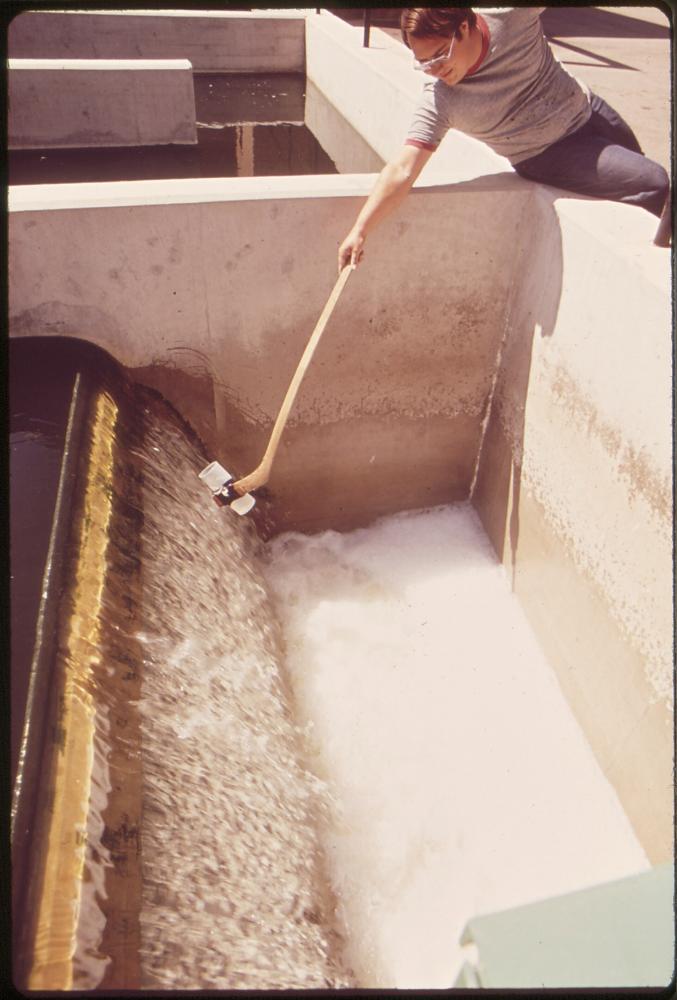
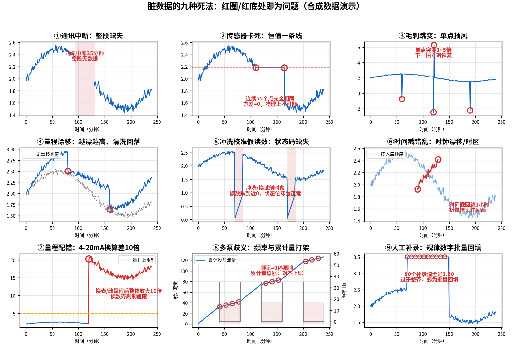
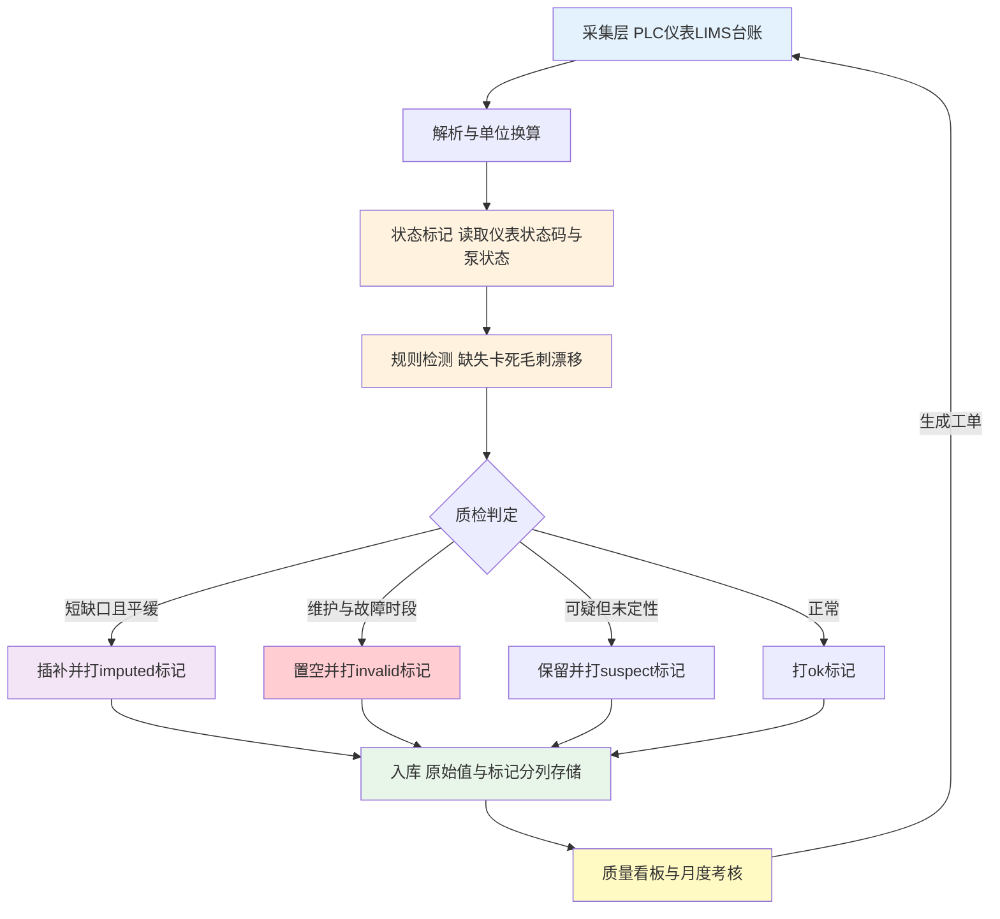

# 05-2 数据质量治理：脏数据的九种死法

> 模型界有句祖传咒语：**垃圾进，垃圾出（Garbage In, Garbage Out）**。喂给 AI 的是脏数据，它吐出来的只会是看起来很高级的垃圾。
>
> 读完你能：认出九种最常见的脏数据长什么样、为什么会产生、会怎么害模型；为每一种配上可落地的自动检测规则和治理动作；建起一套按月考核的"数据质量分"。
>
> 阅读时间：约 30 分钟。

---

## 一、场景导入：一条"完美"的 DO 曲线

某厂做曝气节能，AI 上线第一周就报喜：好氧池 DO（溶解氧）控制得像尺子画的一样稳，天天 2.00 mg/L。直到工程师现场巡检才发现——**DO 探头挂满了生物膜，已经三周没清洗，读数早就卡死在 2.00 上了**。鼓风机实际上在盲喷，电费一分没省。

这不是笑话，是几乎每个做过现场的人都见过的画面。仪表不是不会坏，它坏得很安静：曲线照样刷新，大屏照样绿色，只是数字已经和物理世界脱钩。

*真实照片：运行人员在污水厂出水构筑物边用长杆取样器取样（美国国家档案馆 DOCUMERICA 馆藏照片，编号 543804，公有领域）。在线仪表读数要定期与这种人工取样化验结果比对。*

脏数据的可怕在于：**人肉眼盯曲线一天也看不出几条，而机器会把每条都当真**。所以治理不能靠敬业，要靠规则。下面九种死法，每种都给出"数值特征 → 真实原因 → 危害 → 自动检测规则 → 治理策略"五件套。

*数据为合成/典型参数实算：3×3 网格里红圈与红底标出的，就是九种脏数据在时序曲线上的典型长相。*

---

先给一张速查表，混个脸熟；后面再逐个拆细节。

| # | 死法 | 一眼特征 | 检测的核心规则 | 首选治理动作 |
|---|---|---|---|---|
| ① | 通讯中断缺失 | 曲线断开一段 | 连续缺点超 3 个周期 | 短缺口线性插值标记，长缺口置空 |
| ② | 传感器卡死 | 十几个点一模一样 | 滚动方差为 0 持续 10 min | 打 stuck 标记，派工清洗 |
| ③ | 毛刺跳变 | 单点抽风立刻恢复 | 偏离中位数超 5 倍 MAD | 剔除单点，中值替换 |
| ④ | 量程漂移 | 缓漂 + 清洗台阶 | 在线-化验偏差单向扩大 | 化验值修正，安排校准 |
| ⑤ | 维护假读数 | 固定时段近 0/满量程 | 仪表状态码非测量态 | 整段遮蔽，绝不插值 |
| ⑥ | 时间戳错乱 | 折线掉头、时差 8 小时 | 时间戳非单调/间隔异常 | NTP 对时，统一 UTC+8 |
| ⑦ | 量程单位配错 | 换表后整体差 10 倍 | 三点核对、比值突变 | 锁定量程，按系数重算 |
| ⑧ | 多泵记录歧义 | 停泵了累计量还涨 | 状态与累计量交叉对账 | 每泵独立计量并绑定 |
| ⑨ | 补录造假 | 80 个值全是 3.50 | 唯一值率、录入时间聚集 | 留痕双签，降权或剔除 |

---

## 二、九种死法逐个拆

### 死法 ① 通讯中断：整段缺失

- **数值特征**：连续一段时间没有新数据，曲线断开；在有的系统里表现为 NaN（空值），在有的系统里被粗暴填成 0 或沿用上一个值。
- **真实原因**：网线松动、485 总线被干扰、网关死机、仪表停电、PLC 扫描丢包。
- **危害**：模型输入突然缺失，轻则该时刻无法预测，重则把 0 当成"流量真的为零"，AI 命令停泵。
- **检测规则**：以归档周期为基准，**连续缺点 > 3 个周期（1 min 归档即缺口 > 3 min）即报警**；同时校验时间戳间隔，大于 1.5 倍周期算缺口。
- **治理策略**：缺口 ≤ 15 min 且为平缓变量可线性插值并打 `imputed` 标记；更长的缺口**保留空值、不插值**，训练时该样本剔除，控制时切回人工。

### 死法 ② 传感器卡死：恒值一条线

- **数值特征**：连续几十个点数值完全相同（如 2.18、2.18、2.18……），滚动方差 ≈ 0。
- **真实原因**：探头挂膜/结垢卡死、仪表死机后持续输出最后一次测量值、4-20 mA 回路虚接。
- **危害**：模型以为"风平浪静"，实际上工况可能已经翻天；开头那个 DO 故事就是它。
- **检测规则**：滑动窗口（如 10 min）内**极差 < 仪表分辨率且方差为 0，持续 ≥ 10 min** 即标记 `stuck`。注意液位在满罐/空罐时确实会长时间恒定，要结合设备状态位排除。
- **治理策略**：打卡死标记，该段数据禁用；生成工单通知现场清洗/校验；同一台表一个月卡死超 3 次，挂红牌考核（见第四节）。

### 死法 ③ 毛刺跳变：单点抽风

- **数值特征**：一个点突然冲到 6.0、下一拍立刻回到 2.1；或一个点砸到负值。来去都在 1~2 个采样周期内。
- **真实原因**：电磁干扰（变频器启停、雷击）、模数转换误码、气泡瞬时穿过测量室。
- **危害**：基于"变化率"的控制器会被一个毛刺带着猛调泵，几小时的平稳被一拍打穿。
- **检测规则**：用 Hampel 滤波思路——某点偏离滚动中位数超过 **5 倍 MAD（中位绝对偏差）**，且前后 1~2 点恢复，判为毛刺；辅以物理极限（TP 不可能 1 min 内变 3 mg/L）。
- **治理策略**：剔除单点，用相邻点中值替换并打 `spike` 标记；一段里毛刺频繁出现，查接地和屏蔽层，那是电气问题不是数据问题。

### 死法 ④ 量程漂移：越漂越高，清洗回落

- **数值特征**：不是突变，是几周内读数缓慢偏离真值；仔细看会发现曲线在**每次探头清洗/校准后出现台阶式回落**，然后又慢慢爬上去，呈锯齿状。
- **真实原因**：探头污染老化、试剂接近失效、光学窗口结垢、电极钝化。
- **危害**：最阴险的一种。单点看完全"正常"，但模型的基准被悄悄抬走，预测整体偏 10%~30% 而无人察觉，直到出水超标。
- **检测规则**：①在线值与同期化验值的偏差做 30 天滚动，**偏差斜率持续单向**即报警；②清洗/校准记录前后均值差超过历史 2 倍标准差，登记漂移量。
- **治理策略**：用化验值做偏差修正（bias correction）并尽快安排校准；缩短该表清洗周期；探头寿命到期（如 DO 荧光帽通常 1~2 年）直接换。

### 死法 ⑤ 冲洗/校准假读数：状态码缺失

- **数值特征**：每天固定时段读数突然跌到 0.05 或冲到满量程，持续 10~30 min 后自动恢复，时间极有规律。
- **真实原因**：在线分析仪正在自动冲洗、校准、换试剂，此时测的根本不是水样；仪表明明有状态码（测量/维护/故障/缺试剂），但**接入时只采了测量值、没采状态位**。
- **危害**：一天三四个假低谷，训练集被污染，模型学会"每天凌晨出水总磷是 0"。
- **检测规则**：**最硬的规则是把仪表状态寄存器一起采进来**，状态 ≠ 测量态时整段强制置为无效；没有状态位的老表，用"固定时刻 + 近零/满量程"模式规则兜底识别。
- **治理策略**：维护窗口整段 mask（遮蔽），**不允许插值把假读数"修"成真值**，并在画面上用灰色显示"维护中"。

### 死法 ⑥ 时间戳错乱：时钟漂移与时区

- **数值特征**：折线突然掉头往回画（时间戳非单调）；同一天的数据出现重复小时段；两套系统对同一事件记录相差整 8 小时。
- **真实原因**：PLC 掉电后时钟复位、服务器与 PLC 没做 NTP（网络对时）；一台设备用本地时间、另一台用 UTC（世界标准时，北京 = UTC+8）；进口系统/海外项目的夏令时切换会造成小时重复或缺失。
- **危害**：投加量和出水指标对错了时刻，05-3 讲的滞后对齐会彻底失效；模型学到的是错乱的因果。
- **检测规则**：入库即校验时间戳**单调性与间隔**；重复时间戳直接告警；不同源数据按同一事件比对时差。
- **治理策略**：全系统统一 NTP 对时；存储统一用 UTC+8（或统一存 UTC 再按本地时区展示）；入库前按时间戳重排、去重；夏令时地区在切换日单独做质检。

### 死法 ⑦ 单位与 4-20 mA 量程配错

- **数值特征**：换表或改组态后，整条曲线整体放大/缩小 10 倍、1000 倍（mg/L 配成了 μg/L）；大量数值齐刷刷贴在量程上限或下限。
- **真实原因**：4-20 mA 的工程量程在组态里填错（仪表实际是 0~5 mg/L，系统里配成 0~50）；4 mA 是仪表下限不是物理 0（例如液位计 -1~3 m）；超量程时电流钳位在 22 mA，被当成真值收下来。
- **危害**：一眼难查——因为曲线"形状"完全正常，只是数值不对，模型照单全收。
- **检测规则**：新点接入做**三点核对**（给 4/12/20 mA 信号，系统应显示下限/中点/上限）；在线值与相邻点位、化验值的比值突变报警；统计贴量程值占比，>5% 查钳位。
- **治理策略**：量程写进数据字典并锁定变更（改量程必须留工单）；异常时段按正确系数重算历史值；钳位点标记为超量程无效。

### 死法 ⑧ 多泵运行记录歧义：频率与累计量打架

- **数值特征**：泵频率 = 0、运行状态 = 停，累计投加流量却还在匀速上涨；或者两台泵共用一个累计表，说不清这段药是哪台泵打的。
- **真实原因**：累计量接在母管上而非每台泵出口；频率寄存器停泵后残留 35 Hz；变频器频率是"指令"而不是"实际出力"；脉冲表在停泵时被干扰照样走字。
- **危害**：**节药核算是假账**——AI 说省了 20%，拿累计量一对对不上，项目验收直接翻车。
- **检测规则**：交叉校验——停泵状态下累计量增量应 ≈ 0（容差 1%）；瞬时流量 × 时长 与 累计量差分对账，日偏差 >3% 报警。
- **治理策略**：每台泵出口装独立流量计/累计器并与泵位号绑定；用累计量差分代替频率估算投加量；账实不符的时段标记 `meter_conflict` 不进考核。

### 死法 ⑨ 人工补录与台账造假：规律数字批量回填

- **数值特征**：连续 80 个化验补录值全是 3.50；数值扎堆在整数和一位小数；大量记录的"录入时间"集中在月底某一天；曲线光滑得不像真的。
- **真实原因**：漏测后凭印象补；考核压力下填"安全值"；纸质台账誊录时抄顺了手。
- **危害**：化验值是训练软测量的"标准答案"（见 05-3），答案是编的，模型再勤奋也是向谎言学习。
- **检测规则**：统计**唯一值率**（正常化验收数很少重复，补录数据重复率异常高）；比对采样时刻与录入时刻，批量回填会出现"事后集中录入"；检查一位小数占比、与在线仪的历史偏差分布。
- **治理策略**：LIMS 强制留痕（修改人/修改时间/修改原因），补录需双人复核并单独标记；模型对补录段降权或剔除；管理上把"记录真实性"纳入化验室考核而不是只考核达标率。

> ⚠️ **老工程师的坑**：九种死法里，①~④是仪表病，⑤~⑧是接线与组态病，⑨是人病。**前八种靠规则引擎能挡，第九种只能靠制度**。不要试图用更复杂的算法去识别假台账——发现疑点，去现场翻原始记录、看 LIMS 修改日志。

---

## 三、清洗流水线：让每条数据带着"体检结论"入库

治理不是改数，而是**给每个数据点贴上状态标签**，让后面的模型和报表各取所需。一条标准流水线如下：

两个关键原则：

1. **原始值永远不改、不删**。库里同时存"原始值列 + 修正值列 + 质量标记列"，任何插补和换算都可追溯、可回滚。
2. **标记比修补重要**。模型训练时按标记决定用不用，比把数据"洗干净"到看不出痕迹安全得多。

### 插值方法怎么选

| 方法 | 适用 | 不适用 |
|---|---|---|
| 线性插值 | 液位、水温、流量等连续平缓量，缺口 ≤ 15 min | 化验值、长缺口、突变工况 |
| 前向填充（沿用上一值） | 状态量、设定值、累计量的短时缺口 | DO/ORP 等持续变化的过程量 |
| 不插值，直接标记空值 | 化验数据、维护窗口、超过 15 min 的缺口 | - |

举个线性插值的完整算例。DO-301 在 10:00~10:07 通讯中断 8 个 1 min 点，10:08 恢复：

- 10:00 最后有效值 1.80 mg/L，10:08 恢复后第一个值 2.20 mg/L；
- 缺口两端都是 `ok`、时长 8 min（≤ 15 min），DO 又是连续缓变量，允许线性插值；
- 每分钟增量 =（2.20 − 1.80）÷ 8 = **0.05 mg/L**；
- 于是补出 10:01~10:07 依次为 1.85、1.90、1.95、2.00、2.05、2.10、2.15，七个点全部打 `imputed` 标记；
- 若缺口超过 15 min，或 10:08 回来的值是 4.0（说明期间工况已突变），则放弃插值，整段置空。

> 💡 **现场经验**：能不插就不插。一个带着 `invalid` 标记的空值，比一个看起来合理的插值诚实得多——后者会让模型误以为那个时刻真的测量过。真要插值，缺口两端的点必须是 `ok`，且插补段长度要作为特征告诉模型"这一段是猜的"。

---

## 四、数据质量分：把仪表维护考核起来

单点质检之上，还要给每块仪表、每个月打一个体检分。三个核心率：

- **有效率** = 有效点数（`ok` + 合格插补）÷ 应有点数 ×100%
- **卡死率** = 卡死标记点数 ÷ 应有点数 ×100%
- **漂移率** = 在线值与化验值比对偏差超限次数 ÷ 比对总次数 ×100%（月内）

某厂某月的真实风格的考核表长这样（数字为示例）：

| 仪表 | 有效率 | 卡死率 | 漂移率 | 综合判定 | 处置 |
|---|---:|---:|---:|---|---|
| 出水总磷 AIT-703 | 98.2% | 0.1% | 8% | 合格 | 例行维护 |
| 好氧 DO-301 | 81.5% | 12.4% | 15% | **红牌** | 一周内换荧光帽，扣维护分 |
| 进水 COD AIT-102 | 94.0% | 0% | 22% | 黄牌 | 缩短校准周期，查试剂批次 |
| PAC 流量 FI-402 | 99.5% | 0% | 2% | 优秀 | - |

一种简单的综合判定口径（具体项目以管理制度为准）：有效率 ≥ 95%、卡死率 ≤ 2%、漂移率 ≤ 15% 为合格；任一指标越线亮黄牌，连续两月黄牌或有效率 < 85% 亮红牌，红牌仪表数据在整改验收前不得进入 AI 训练与控制。

把口径算成数字，以出水总磷 AIT-703 的某个月为例（1 min 归档）：

- 应有点数 = 30 天 × 1440 = **43200 点**；
- 其中缺失 518 点、卡死 43 点、维护置空 220 点，其余正常（含 2 点短缺口插值）；
- 有效率 =（43200 − 518 − 43 − 220）÷ 43200 = 42419 ÷ 43200 = **98.2%**；
- 卡死率 = 43 ÷ 43200 = **0.1%**；
- 当月化验比对 90 次，在线-化验偏差超过 ±0.05 mg/L 的有 7 次，漂移率 = 7 ÷ 90 = **7.8% ≈ 8%**。

三项全部达标，判定合格。同一块表若下个月有效率掉到 81%，不用等人工发现，质量看板会自动把它顶到红牌榜首。

这张表真正的威力不在扣钱，而在于：**它把"仪表维护"从一笔糊涂账变成了可排名、可追踪的运营指标**。AI 项目组每月把红黄牌送到厂长桌上，仪表维护质量通常两三个月内就肉眼可见地变好。

---

## 五、一个必须说透的观点：很多厂做 AI 前，要先补仪表维护课

行业里有个让人不舒服但真实的估计：**大约 30%~50% 的厂，在 AI 进场时数据基础是不达标的**。探头长期不洗、分析仪试剂靠环保检查前才换、状态位没接、累计量是笔糊涂账。这种情况下：

- 买再好的算法服务器，等于给一辆方向盘旷量 90 度的车装自动驾驶；
- 项目失败后，厂里得出的结论往往是"AI 没用"，而真正的病因是**仪表运维体系欠了多年的债**。

所以成熟的 AI 加药项目，进场第一个月通常不写一行模型代码，而是做三件事：**盘点位、建数据字典、把质量分跑起来**。把红牌表的数量从 10 块降到 2 块，后面的建模是水到渠成；这一步跳过，所有模型效果都是沙上筑塔。

> 💡 **给厂长的一句话**：AI 不是来替代仪表维护的，它恰恰是仪表维护最严格的用户和最不讲情面的考官。数据治理这堂课，迟早要补——早补早省钱，晚补交学费。

---

## 六、三天快速体检：新接手一批数据先这么查

不用等平台建完，拿到历史 CSV 后用 pandas 三天就能做一轮粗体检：

1. **第一天，查全不全**：按归档周期重索引，统计每个点缺失率，画缺失日历图——集中在某几天的缺口通常是停电/检修，随机散布的缺口多为通讯质量问题。
2. **第二天，查死不死**：`df.diff().abs()` 配合滚动方差，抓卡死段；用 Hampel 滤波（`rolling(中位数)` + 5 倍 MAD）抓毛刺；统计贴量程值占比。
3. **第三天，查对不对**：在线仪表与化验值按采样时刻对齐做偏差曲线，看漂移；泵状态与累计流量增量做交叉对账；化验值做唯一值分布，看补录造假。
4. 全程顺手记录两个时间：**每台表的清洗校准时间**和**换泵换表的组态变更时间**——这两类时间点附近出现的"异常"十有八九不是工艺波动，回溯数据时能少走大量弯路。

输出物就是一张"红黄绿仪表清单"和每种问题的典型时间段。这张清单既是治理工单的依据，也是和厂方谈"先补哪些表、先修哪些点"的筹码——把问题量化到具体位号和日期，比说"你们数据质量不行"有说服力一百倍。

> ⚠️ **老工程师的坑**：千万不要跳过体检直接建模。脏数据训练出的模型往往在历史回测里"效果极好"（模型学会了利用卡死值、维护假读数这些规律），一上线就露馅。回测越漂亮得反常，越要回头查数据。

---

## 本章小结

1. 脏数据九种死法：**通讯缺失、卡死恒值、毛刺跳变、量程漂移、维护假读数、时间戳错乱、单位量程配错、多泵记录歧义、人工补录造假**；前八种靠规则，第九种靠制度。
2. 检测四件套：**阈值、持续时长、变化率、卡死方差**；每块在线分析仪必须连**状态码**一起采。
3. 治理靠流水线：**采集 → 状态标记 → 规则检测 → 插补/置空 → 质检 → 入库**，原始值永不改，修正值与质量标记分列存储。
4. 插值三原则：平缓短缺口线性、状态量短时前向、化验值与长缺口**宁空不猜**。
5. 用**有效率、卡死率、漂移率**给仪表按月打分、挂红黄牌；30%~50% 的厂要先补仪表维护课，AI 才有立足之地。

---

上一章：[05-1 数据从哪来：点位表与数据字典](./05-1-数据从哪来-点位表与数据字典.md)
｜下一章：[05-3 软测量：用便宜仪表猜贵指标](./05-3-软测量-用便宜仪表猜贵指标.md)
