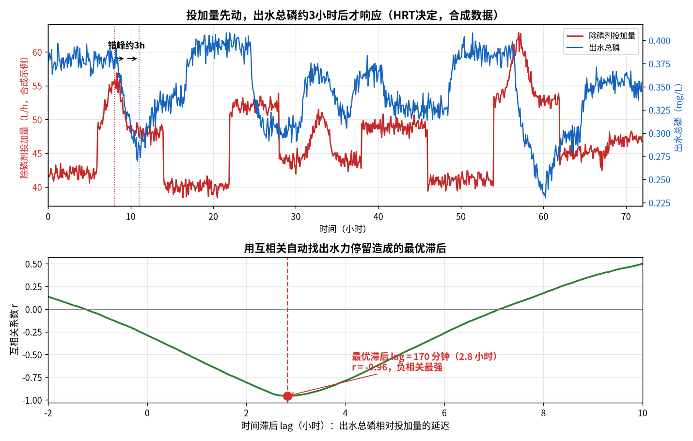
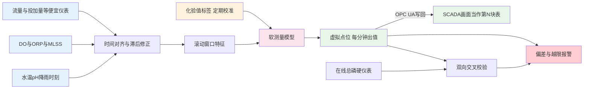

# 05-3 软测量：用便宜仪表猜贵指标

> 出水总磷、氨氮在线分析仪又贵又娇贵：一台 8~20 万元，一周不洗就漂移，试剂一年还要烧掉 2~5 万元，10~30 min 才出一个数。**能不能让 DO、流量这些便宜耐造的仪表，每分钟替我们把贵指标"猜"出来？**
>
> 读完你能：说清什么是软测量、它值不值；知道选哪些便宜量作输入；会用互相关找到投加到出水的滞后时间；会评估一个软测量靠不靠谱，以及它怎么写回 SCADA 当"虚拟仪表"用。
>
> 阅读时间：约 28 分钟。

---

## 一、什么是软测量：请一群便宜证人给贵指标作证

生活里你早就在用"软测量"：看天边乌云压过来、空气闷、燕子低飞，你判断"半小时后下雨"——你并没有气象雷达，但你用三个免费的征兆推断出了一个贵指标。

污水处理里的**软测量（soft sensor，也叫软仪表）**，就是：

> **用若干个便宜、可靠、秒级在线的过程量（辅助变量），通过工艺机理或数据模型，实时推断出昂贵、慢周期、难维护的水质指标（主导变量）。**

比如出水总磷软测量，输入可以是：进水流量 Q、进水/出水 pH、DO、ORP、MLSS、水温、除磷剂实际投加量、历史投加曲线、降雨信号和当前时刻；输出是**每分钟一个的"估计出水总磷"**。它不是玄学——除磷反应是化学计量关系驱动的（见 [04-1](../04-机理公式篇/04-1-化学除磷机理与投加量计算.md)），加了多少药、进了多少磷、水在池子里待了多久，结果本来就是被这些量决定的，模型只是把这层关系拟合出来。

> 💡 **现场经验**：软测量最适合两类指标：①有在线仪但**又贵又娇气**的（总磷、氨氮、硝氮、COD）；②**根本没装在线仪、只有化验**的（如 BOD5）。它不取代化验和在线仪，而是在两次化验/两个测量周期之间，把时间分辨率从"一天 3 次"填成"一分钟 1 次"。

---

## 二、硬测量 vs 软测量：不是替代，是搭班

| 对比项 | 硬测量（试剂法在线分析仪） | 软测量（虚拟仪表） |
|---|---|---|
| 单点投资 | 8~20 万元/台 | 复用现有仪表，边际成本近 0 |
| 运行耗材 | 试剂 2~5 万元/年，泵管耗材不断 | 无试剂，只有算力 |
| 出数周期 | 10~30 min 一个数 | 1 min 甚至更短 |
| 维护工作量 | 每周清洗、定期校准换试剂 | 基本免维护，但要监控模型漂移 |
| 测量精度 | 高，相对误差常 ±5%~10% | 略低，好的模型 ±10%~20% |
| 法规定位 | 环保联网考核的法定仪表 | 不能用于考核，只用于控制与预警 |
| 失效方式 | 挂膜、漂移、缺试剂，悄悄变坏 | 工况超出训练范围时失真，有迹可循 |
| 典型用途 | 达标判定、标定基准 | 前馈控制、异常预警、仪表故障时兜底 |

加药项目里四个最常做的软测量对象：

| 软测量对象 | 主要便宜输入 | 工程上能接受的误差量级 | 主要用途 |
|---|---|---|---|
| 出水总磷 TP | 进水负荷、投加量、pH、流量、SS | MAE 0.02~0.05 mg/L | 除磷前馈、药剂微调 |
| 出水氨氮 NH3-N | DO、水温、MLSS、曝气风量、氨氮滞后值 | MAE 0.2~0.5 mg/L | 曝气与碳源联动 |
| 硝氮 NO3-N | 缺氧 ORP、内回流流量、碳源投加量、水温 | MAE 0.5~1.5 mg/L | 碳源前馈、反硝化预警 |
| 出水 COD | 进水 COD、流量、DO、MLSS、时刻 | MAE 3~8 mg/L | 碳源投加、冲击预警 |

表中误差为工程经验区间，随厂情、数据质量浮动很大，具体项目以实测验证为准。

一句话分工：**硬仪表是法官，权威但开庭慢、费用高；软测量是巡警，每分钟都在街上转，发现嫌疑立刻喊法官复核。**

> ⚠️ **老工程师的坑**：不要信"上了软测量就不用买在线仪了"这种销售话术。软测量必须靠在线仪/化验值持续校准才能不漂移，它是寄生于硬测量之上的——**砍掉硬仪表，软测量会在几个月内慢慢瞎掉**。正确姿势是两者共存、互相校验。

---

## 三、输入变量怎么选：机理指路，相关性验证

选输入变量不是把所有点都塞给模型（那只会引入噪声和数据泄漏），而是两步走。

**第一步，工艺机理先圈定"因果上说得通"的候选。**以出水总磷为例：

- 磷从哪来：进水流量 × 进水总磷（进水磷负荷）；
- 靠什么除：生物除磷看厌氧 ORP、MLSS（聚磷菌状态）；化学除磷看**实际投加量**（不是泵频率）和药剂品质；
- 反应快慢：水温（低温反应慢）、pH（铝盐最佳 pH 约 6.5~7.0，见 04 篇各章）；
- 水在池里待多久：流量决定 HRT（水力停留时间）；
- 外部扰动：降雨（合流制厂雨天冲击）、时刻（居民作息带来的日周期）。

**第二步，用数据验证相关性强弱。**常用皮尔逊相关系数 r（衡量线性相关，−1~1）和互信息（能抓非线性关系）。|r| 长期低于 0.1 的变量基本可以舍弃。但要守一条铁律：

> ⚠️ **严防数据泄漏（data leakage）**：不能拿"未来才知道的量"预测现在。比如预测 10:00 的出水总磷，只能用 10:00 之前可获得的输入；出水端的 SS、pH 与总磷同属出水测量，它们**在同一时刻其实是结果不是原因**，用作输入时要确认时间上确实可得，否则线下分数虚高、上线即崩。

| 候选输入 | 便宜程度 | 与出水 TP 的机理关系 | 是否常用 |
|---|---|---|---|
| 进水流量 Q | 几乎免费 | 决定负荷与 HRT | 必选 |
| 进水总磷在线值 | 有仪表即可 | 直接给出进水磷负荷 | 必选 |
| 除磷剂实际投加量 | 需投加流量计 | 决定化学沉淀除磷量 | 必选 |
| DO/ORP/MLSS | 便宜耐造 | 反映生物除磷状态 | 常用 |
| 水温/pH | 便宜 | 影响反应速率与铝盐形态 | 常用 |
| 降雨/时刻 | 免费 | 冲击与日周期特征 | 常用 |
| 出水 SS | 便宜 | 磷随悬浮固体逃逸，强相关 | 谨慎，注意泄漏 |

---

## 四、关键技术一：时间延迟对齐（本章最值钱的一节）

### 4.1 为什么必须对齐滞后

药加在池子前端，出水总磷表在厂区最末端。水要走过混合池、生物池、二沉池、深度处理，**这段路在市政厂通常要 2~4 小时（HRT 决定）**。也就是说，此刻的出水总磷，反映的是约 3 小时前的那次投加决定。

如果把"此刻的投加量"配"此刻的出水总磷"去训练模型，等于让学生用**后天**的作业题对**今天**的答案——模型要么学不出关系，要么学出一个错误的滞后关系。

*数据为合成/典型参数实算：上图投加量（红）先动，出水总磷（蓝）约 3 小时后反向响应；下图用互相关自动把这个滞后算出来，本例最优滞后 170 分钟（约 2.8 小时），r = −0.96。*

### 4.2 互相关：把滞后"算"出来而不是猜

互相关系数 r(k) 衡量"变量 x 与 k 分钟之后的变量 y"有多相关：

$$r(k)=\frac{\sum_t (x_t-\bar{x})(y_{t+k}-\bar{y})}{\sqrt{\sum_t (x_t-\bar{x})^2}\,\sqrt{\sum_t (y_{t+k}-\bar{y})^2}}$$

- x：原因变量（如除磷剂投加量），y：结果变量（出水总磷），k：试算的滞后分钟数；
- r(k) 取 −1~+1；**投加越多出水磷越低，所以找 r(k) 最小（负相关最强）的那个 k**；正相关问题（如进水负荷 vs 出水指标）则找最大；
- 在除磷投加的合成算例里，把 k 从 −120 min 扫到 +600 min，r 在 **k = 170 min（2.8 h）处达到 −0.96**——这就是该工况下水走完全程的等效滞后。

直觉解释：想象两根形状一样但错开的曲线，你慢慢平移其中一根，直到波峰对波谷完全咬合，平移的距离就是滞后。水力学上它近似等于 V/Q（池容 ÷ 流量）：**流量大时滞后缩短，流量小时滞后拉长**。所以工程上更讲究的做法不是死守一个 170 min，而是按当前流量动态修正：

$$\tau \approx \frac{V}{Q}$$

其中 τ 为滞后时间（h），V 为加药点到出水表的等效池容（m³，典型经验值由容积图纸估算或示踪试验标定，具体项目以实测为准），Q 为当前流量（m³/h）。10 万吨厂 Q ≈ 4167 m³/h，若等效容积约 1.1 万 m³，τ ≈ 2.6 h，与互相关算出的 2.8 h 互相印证。

> 💡 **现场经验**：滞后对齐做得糙，是软测量误差的第一来源。建议每个加药回路都做一次互相关，并把"对齐后的投加量历史"作为独立特征列存下来；多系列并联的厂要按系列分别算，别用一个总滞后糊弄所有池子。

### 4.3 关键技术二：滚动窗口统计特征

单看某一分钟的输入信息量太少，工况是一段历史。把输入按滚动窗口展开，例如对过去 30/60/180 min 的投加量、流量分别构造：

- 均值（平均力度）、标准差（波动大不大）、斜率（在加力还是收力）；
- 窗口累计投加量（总药量）；
- 窗口内降雨分钟数、冲击峰值。

这等于在告诉模型："别看现在这一秒，看过去这一波操作的全过程。"窗口长度应覆盖前面算出的滞后（如 180 min）。

### 4.4 关键技术三：把化验值当作校准标签

软测量模型本质是监督学习：每个输入时刻 X，需要配一个"标准答案 y"，这个答案就是**化验室的 COD/氨氮/总磷化验值**（也可用在线分析仪值）。注意三点：

1. 标签对齐到**采样时刻**（不是出结果/录入时刻，见 [05-1](./05-1-数据从哪来-点位表与数据字典.md) 第五节）；
2. 标签一天只有 2~4 个，训练只在"有化验值的时刻"计算误差，其余时刻模型照常出估计值但不参与打分；
3. [05-2](./05-2-数据质量治理-脏数据的九种死法.md) 第九种死法里的补录假值必须先剔除——标签脏了，模型越训越歪。

具体建模方法（选什么算法、怎么训练验证、怎么调参）在 [06-4 出水指标预测与软测量建模](../06-AI建模篇/06-4-出水指标预测与软测量建模.md) 完整展开，本章只管把"原理与数据工程"讲透。

---

## 五、软测量靠不靠谱：四个评估维度

模型上线前，用没参与训练的测试集（最好是另一个月份、另一个季节的数据）回答四个问题。

### 5.1 误差有多大：RMSE、MAE、命中率

$$\text{MAE}=\frac{1}{n}\sum_{i=1}^{n}|\hat{y}_i-y_i|,\qquad \text{RMSE}=\sqrt{\frac{1}{n}\sum_{i=1}^{n}(\hat{y}_i-y_i)^2}$$

- MAE（平均绝对误差）直观："平均猜偏多少 mg/L"；RMSE（均方根误差）会放大个别大错，专抓危险的离谱预测。
- **命中率**：预测值与化验值同时满足"方向一致 + 偏差在容忍带内"的比例。出水总磷容忍带可取 ±0.05 mg/L（具体项目按排放余量定）。

算例：某出水 TP 软测量对上 5 个化验标签，化验值 [0.28, 0.35, 0.41, 0.30, 0.22]，预测值 [0.30, 0.33, 0.45, 0.31, 0.24]（mg/L）：

- 绝对误差 = [0.02, 0.02, 0.04, 0.01, 0.02]，MAE = 0.11 ÷ 5 = **0.022 mg/L**；
- 平方误差均值 = (0.0004+0.0004+0.0016+0.0001+0.0004) ÷ 5 = 0.00058，RMSE ≈ **0.024 mg/L**；
- 5 个点偏差全在 ±0.05 内且方向不错，命中率 = **100%**。对 TP 控制而言，MAE ≤ 0.03 mg/L 就足以支撑前馈调节决策。

### 5.2 不确定度：给猜测配一个置信区间

软测量要诚实输出"这次猜得有多没把握"。常见做法是统计近期预测残差的分布，给出 ±2σ 区间；当输入落在训练数据没见过的区域（如当前流量 6000 m³/h 而历史最大 5000），区间自动变宽并提示"超出经验范围"。**宁可明说"我拿不准"，不可假装精确。**

### 5.3 与在线仪表互相校验

同一指标同时有在线硬仪表和软测量时，两者构成互校：

- 两者偏差小 → 都可信；
- 硬仪表突然偏离软测量、且并不在维护窗口 → 大概率仪表漂移/故障（05-2 死法④），触发探头核查报警；
- 在线仪检修/换试剂期间 → 软测量临时顶上作控制依据，画面标注"软测量托管"。

### 5.4 时间外验证

必须用**时间靠后**的数据验证，而不是随机打乱后切分（随机切分会把相邻时刻的相似样本同时分进训练和测试，分数虚高）。更严格的做法是"滚动起源验证"：用前 3 个月训练、下 1 个月测试，再逐月向前滚动。

---

## 六、落地形态：把模型变成 SCADA 里的一个"虚拟点位"

软测量不是 PPT 上的曲线，它在工厂里的标准落地形态是：

要点：

1. **虚拟点位命名规范**：如 `AIT_VIRT_TP_OUT`（VIRT 表示 virtual），在数据字典里注明"软测量值、非法定仪表、模型版本号与生效日期"，与硬仪表严格区分；
2. 通过 OPC UA 写回 SCADA（见 [05-1](./05-1-数据从哪来-点位表与数据字典.md) 第六节），运行员在画面上看到的就是一块普通仪表，学习成本为零；
3. 配套两类报警：预测值越限（出水 TP 估计值逼近 0.3/0.5 红线）、**软测量与硬仪表偏差越限**；
4. 它的输出接到前馈控制器（[07-1 从开环建议到闭环控制](../07-控制优化篇/07-1-从开环建议到闭环控制-三种架构.md)），让计量泵在冲击到达之前就动起来——这正是 [04-5](../04-机理公式篇/04-5-加药过程动态特性-PID前馈与反馈.md) 讲的"解决滞后"在数据侧的实现。

> 💡 **现场经验**：上线初期让虚拟表只"旁听"（出建议、不控泵）跑 4~8 周，让运行员建立信任、让工程师收集偏差；信任建立后再逐步接入控制。直接闭环又没有异常兜底的项目，最容易被一次失真预测打掉全厂信心。

---

## 七、失败案例：跨季节漂移

南方某厂用 6~9 月数据训练的氨氮软测量，测试集 MAE 很漂亮（0.15 mg/L），11 月上线后误差逐月爬到 0.6 mg/L，频繁误报警。复盘原因：

1. **水温从 26 ℃ 降到 12 ℃**，硝化菌反应速率大幅下降，生物池的脱氮能力和夏天完全不是一个工况；
2. 雨季结束，进水负荷模式整个换了一遍；
3. 模型是纯黑箱拟合，只学会了"夏天的规律"，也没有人监控输入分布的变化。

教训与对策：

- **按季节/水温分层评估**：冬夏最好分别建模，或在特征中显式纳入水温并用覆盖全年的数据训练；
- **监控残差漂移**：预测-化验残差均值一旦持续单向偏移，自动触发重训告警（详见 [06-7 模型上线监控与迭代运维](../06-AI建模篇/06-7-模型上线监控与迭代运维.md)）；
- **滚动再训练**：把新化验标签不断喂回，季度级小更新、年度级大更新；
- 机理打底能显著抗漂移：纯数据模型换季节就像换了脑子，而"化学计量 + 数据修正系数"的灰箱模型（[06-6 机理加数据](../06-AI建模篇/06-6-机理加数据-灰箱混合模型最落地.md)）季节适应性强得多。

---

## 八、动手前的最小数据条件清单

不是每个厂一上来都能做软测量。开工前对照检查，缺一项补一项：

1. **输入点位齐**：第五节那张输入表的"必选"变量在线、有效率 ≥ 95%（质量分口径见 [05-2](./05-2-数据质量治理-脏数据的九种死法.md)）；
2. **投加有计量**：加药回路装了电磁流量计，实际投加量可查，而不是只有泵频率；
3. **标签有积累**：至少 3~6 个月化验记录、采样时刻明确、补录假值已标记；
4. **时间已统一**：全厂 NTP 对时、时区一致，滞后对齐才有意义；
5. **滞后已摸底**：至少完成一次互相关分析，知道各回路 τ ≈ V/Q 的实际范围；
6. **出口有裁判**：出水端至少有一台靠谱的在线仪表或稳定化验频次，用于持续互校与再训练。

这六条凑不齐的厂，建议顺序是：**先补仪表与数据治理（05-1、05-2）→ 再上软测量**，而不是反过来。

> ⚠️ **老工程师的坑**：软测量项目验收时一定要把"模型在什么输入范围内有效"写进交付文件。超出范围时系统应明确拒答或报警——一个在任何工况下都敢给数字的软测量，比没有软测量更危险，因为运行员会慢慢把决策权交给它。

---

## 本章小结

1. 软测量 = 用 **Q/DO/ORP/pH/MLSS/投加量/水温/降雨/时刻**等便宜在线量，实时推断总磷、氨氮、硝氮、COD 等贵指标，把时间分辨率从一天 2~4 次提到每分钟；它是巡警不是法官，**不替代法定仪表，反而要靠硬仪表持续校准**。
2. 选变量靠"**机理圈候选 + 相关性做验证**"，严防用未来信息的数据泄漏。
3. 本章最值钱的工程动作是**滞后对齐**：用互相关 r(k) 扫描找最强相关的滞后（算例 170 min，r = −0.96），并用 τ ≈ V/Q 按流量动态修正；再叠加滚动窗口特征和化验标签。
4. 可信度看 **MAE/RMSE、命中率、置信区间、与硬仪表互校、时间外验证**；TP 软测量 MAE ≤ 0.03 mg/L 即可支撑前馈控制。
5. 落地为 SCADA 里的**虚拟点位**（OPC UA 写回 + 偏差报警），先旁听 4~8 周再闭环；最大的坑是**跨季节漂移**，靠水温分层、残差监控和滚动重训化解。具体建模实战去 06-4。

---

上一章：[05-2 数据质量治理：脏数据的九种死法](./05-2-数据质量治理-脏数据的九种死法.md)
｜下一章：[06-1 AI 加药能力地图：什么活能交给 AI](../06-AI建模篇/06-1-AI加药能力地图-什么活能交给AI.md)
