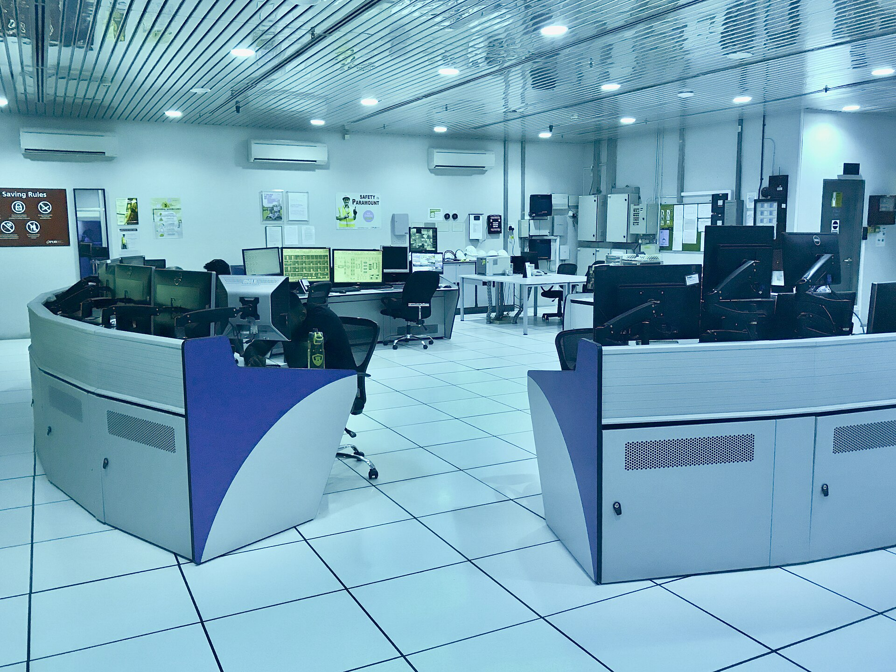
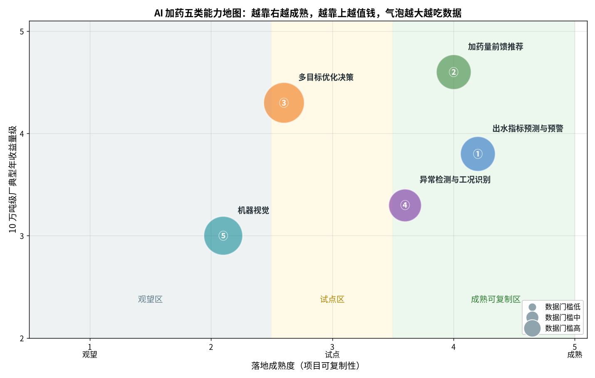
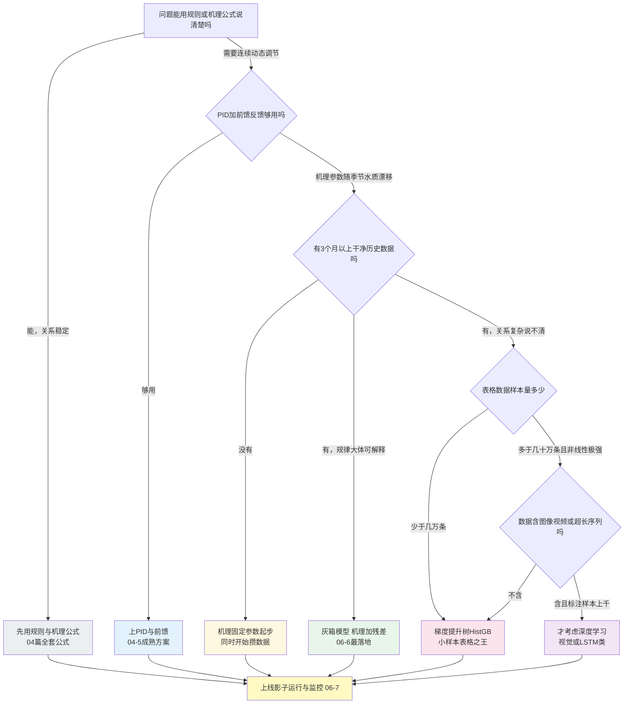

# 06-1 AI 加药能力地图：什么活能交给 AI

> 供应商说他们的『AI 大脑』什么都能干：省药、省电、防超标、替人看池子，一块大屏管全厂。厂长问了三个问题——**哪些活今天就能交给它？哪些还得再看看？哪些纯属 PPT？**
>
> 读完你能：拿到一张 AI 加药五类能力地图，说清每类的输入输出、成熟度、数据门槛、收益和死法；知道 AI 有哪四件事做不到；会用一棵决策树为具体问题选技术（规则、PID、灰箱、机器学习还是深度学习）。
>
> 阅读时间：约 28 分钟。

---

## 一、场景导入：一块大屏，三套说辞

某污水厂技改评审会，三家供应商同台。

- 甲说：上我们的 AI，除磷剂省 30%，半年回本；
- 乙说：先上视觉，矾花、泥位、泡沫一套摄像机全覆盖，少招两个运行工；
- 丙说：要上就上全厂多目标优化大脑，药、电、泥、气一个模型统调。

厂长犯了难：听着都对，可厂里至今只有进水流量和两台 DO 表数据是全的，出水总磷表还时好时坏。**钱只有一笔，先干哪件？**

这一章不写代码，先解决『干什么、不干什么』的问题。我们把污水厂加药相关的 AI 活计，归成五类能力，给每类标注成熟度、数据门槛、收益和失败模式，最后给一棵技术选型决策树。带着地图走，后面六章的技术你都知道该插在哪面旗子上。



*真实照片：新加坡 NEWater 水厂中控室。AI 决策看板在物理形态上就是运行员面前这样的大屏与坐席——关键不在画面酷炫，而在建议是否可信、责任如何界定。图片来源：Wikimedia Commons，作者 Z22，CC BY-SA 4.0。*

---

## 二、五类能力地图：一张图看清先干什么



*数据为合成/典型参数实算：横轴是落地成熟度（行业内可复制程度），纵轴是 10 万吨级厂的典型年收益量级，气泡越大代表数据门槛越高。评分为行业项目经验的定性估计，具体项目以实测为准。*

五个气泡的坐标（评分 1~5，由配套脚本 `fig06_01_capability_map.py` 实算输出）：

| 编号 | 能力 | 落地成熟度 | 收益量级 | 数据门槛 | 当前结论 ||---|---|---:|---:|---:|---|
| ① | 出水指标预测与预警 | 4.2 | 3.8 | 中（3.0） | 成熟，值得做 |
| ② | 加药量前馈推荐 | 4.0 | 4.6 | 中（3.0） | 成熟，**首选切入口** |
| ③ | 多目标优化决策（药/电/泥协同） | 2.6 | 4.3 | 高（4.5） | 试点，别一上来就做 |
| ④ | 异常检测与工况识别 | 3.6 | 3.3 | 低（2.5） | 较成熟，数据差也能起步 |
| ⑤ | 机器视觉（矾花/泥位/泡沫/泥饼） | 2.1 | 3.0 | 高（4.0） | 观望与试点之间，谨慎投入 |

读这张图的方法：**先挑靠右、靠上、气泡小的**——成熟、值钱、又不太吃数据，那就是②加药量前馈推荐和④异常检测；③看着值钱但还在试点区，且气泡最大（要全厂数据打通）；⑤在观望区边缘，样板工程多、规模复制少。

> 💡 **现场经验**：90% 的厂第一次做 AI 加药，正确顺序是 **④异常检测打底（顺便把数据治理做了）→ ①软测量装上眼睛 → ②前馈推荐落地省钱 → ③多目标优化收尾**。跳过前两步直接上③的项目，十个里七八个会卡在『数据不全、账算不清』上。

---

## 三、能力①：出水指标预测与预警

这就是 [05-3](../05-数据篇/05-3-软测量-用便宜仪表猜贵指标.md) 软测量的模型化版本：用 Q、DO、ORP、pH、MLSS、投加量、水温、降雨等便宜在线量，预测出水 TP/氨氮/COD，提前 30~120 分钟报警。

- **输入**：进水流量与水质、过程量（DO/ORP/MLSS/pH）、实际投加量、水温、降雨、时刻；
- **输出**：未来 30/60/120 分钟出水指标预测值 + 越限报警，可作为虚拟点位写回 SCADA；
- **成熟度**：成熟。算法本身（梯度提升树为主，见 [06-4](./06-4-出水指标预测与软测量建模.md)）不稀奇，成败七分在数据；
- **数据门槛**：输入点位在线有效率 ≥95%，3~6 个月以上带采样时刻的化验标签，滞后已做互相关对齐；
- **典型收益**：把贵仪表的试剂钱省下一大部分（2~5 万元/年/台）只是零头；真正收益是**超标事件提前发现**——一次 TP 超标导致的罚款、整改和限产损失常在 10~50 万元量级；
- **失败模式**：跨季节漂移（夏训冬崩）、标签对齐到了录入时刻、把同刻出水侧变量当输入造成数据泄漏。

---

## 四、能力②：加药量前馈推荐（本书主角）

根据进水负荷与工况，在水到达加药点**之前**算出该加多少药，推送给运行员或直接驱动计量泵。

- **输入**：进水 Q、进水 TP/氨氮、水温、降雨、时段，必要时叠加软测量预测；
- **输出**：PAC/PFS/碳源/PAM 的推荐流量（L/h）或推荐泵冲程/频率；
- **成熟度**：成熟可复制。表格型工业小样本数据上，梯度提升树通常最稳；
- **数据门槛**：加药回路必须有**实际投加量计量**（电磁流量计，不是只有泵频率），3~6 个月分钟级历史，标签构造要正确（见 [06-3](./06-3-加药量预测建模完整实战.md) 专门一节）；
- **典型收益（典型经验区间）**：除磷剂节省 **15%~30%**，碳源节省 10%~25%，化学污泥减量 5%~10%；10 万吨级厂年药剂费 200~400 万元，对应年节省 30~90 万元，系统投资 50~150 万元，回本 1~2.5 年；
- **失败模式**：行业最常见错误是**拿历史人工投加量当标签**——模型只会高精度复现老师傅的浪费，详见 06-3 第九节。

### 节药收益怎么估：一个带单位的小公式

$$S = Q \times 365 \times \Delta c \div 1000 \times p$$

- S：年节省药费，元/年；
- Q：日处理水量，m³/d；
- Δc：投加单耗下降量，mg/L（以干粉计，等于当前单耗 × 节省比例）；
- 365：天/年；÷1000：克换算千克；
- p：药剂单价，元/kg（PAC 约 1.5~2.5 元/kg，典型经验值）。

算例：10 万吨厂，当前 PAC 单耗 46 mg/L，上线后下降 20%（即 Δc = 9.2 mg/L），单价 2.0 元/kg：

```
S = 100000 × 365 × 9.2 ÷ 1000 × 2.0 = 67.2 万元/年
```

这就是谈判和 ROI 测算的锚点。注意 Δc 要用影子运行或分表计量的实测值，不能直接采用供应商 PPT 上的 30%（口径见 [08-5](../08-落地实施篇/08-5-节能率怎么算-效益测量与验证MV.md)）。

---

## 五、能力③：多目标优化决策（药/电/泥协同）

化学除磷、生物脱氮、曝气电耗、污泥处置本来是一本联动账：多加点 PAC 可能降低二沉池负荷但多出化学污泥；降低曝气省电可能逼得碳源多投。多目标优化是在约束（出水全指标达标）下求综合成本最低的操作组合。

- **输入**：全厂药剂、水量水质、曝气风量/电耗、污泥产量与处置费、各回路执行能力，以及一套**权重明确的成本函数**；
- **输出**：各回路协同设定值（加药 + 曝气 + 回流 + 排泥），多为规则/灰箱优化器而非单一黑箱模型；
- **成熟度**：试点。单点模型容易，全厂协同涉及仪表、执行机构、调度制度同时到位；
- **数据门槛**：最高。药、电、泥三套计量都要对得上账（[05-2](../05-数据篇/05-2-数据质量治理-脏数据的九种死法.md) 死法⑧的多泵账必须先理清），通常需 6~12 个月；
- **典型收益**：在前馈已省药的基础上，综合运行成本再降 3%~8%，多来自药-电、药-泥的协同空间；
- **失败模式**：①目标权重扯皮——厂长怕超标要保守，老板要省钱，生产科怕麻烦，权重议不下来模型没法收敛；②执行机构跟不上（计量泵量程不够、曝气阀卡涩），算出最优也落不了地；③一上来就买『全厂大脑』，结果底层仪表还是坏的。

> ⚠️ **老工程师的坑**：多目标优化不是一个更神的模型，而是一套**把全厂成本函数说清楚的管理动作**。药剂费、电费、污泥处置费、超标罚款的权重没有『客观最优值』，只有厂长签字的那版。权重不定，多目标优化永远停在 demo 阶段。

---

## 六、能力④：异常检测与工况识别

用规则 + 统计 + 无监督学习，盯着仪表和工况：探头卡死、尖峰、漂移、进水冲击、污泥膨胀征兆。

- **输入**：现有 SCADA 点位即可，不强求化验标签；
- **输出**：仪表异常工单、工艺冲击预警、工况标签（晴天/雨天地/冲击/恢复）；
- **成熟度**：较成熟。规则引擎（3σ/Hampel/复合阈值）能解决七成问题，IsolationForest 等无监督方法补多元异常；
- **数据门槛**：五类能力中最低，有 1~3 个月分钟级数据就能起步；
- **典型收益**：仪表故障发现时间从『几周后巡检发现』缩短到分钟级；进水冲击提前 30~90 分钟预警，给前馈和调度留出时间；减少非计划停车与超标；
- **失败模式**：误报轰炸——阈值过紧一天报 50 条，运行员两周后全部忽略，真报警也一起淹死。实战做法见 [06-5](./06-5-异常检测与工况识别.md)。

---

## 七、能力⑤：机器视觉：四类镜头，冷暖自知

摄像机 + 图像模型在污水厂有四个常见落点：

| 视觉任务 | 看什么 | 现场价值 | 当前成熟度 |
|---|---|---|---|
| 矾花状态 | 絮体大小、密实度、沉降速度 | 辅助混凝投药与 PAM 调节 | 试点，受光照/气泡影响大 |
| 二沉池泥位/翻泥 | 泥水分界面、整块污泥上浮 | 提前发现跑泥、二沉池预警 | 试点，干净水厂效果较好 |
| 气泡/泡沫 | 曝气池泡沫颜色与覆盖率 | 识别污泥膨胀、负荷异常 | 观望偏试点，误判率仍高 |
| 脱水机泥饼 | 泥饼厚度、含水率表观、落料状态 | 脱水机无人值守、PAM 调节 | 试点，需稳定照明与防护罩 |

- **数据门槛**：高。每个场景需要 **500~2000 张本厂标注图片**（别厂模型不能直接迁移），外加摄像头防护（水汽、腐蚀、夜间补光）和边缘算力；
- **典型收益**：减少巡检工时、延长无人值守时间；单点投资 2~8 万元（摄像头 + 边缘盒），人力替代回本通常要 2 年以上；
- **失败模式**：①拿演示视频当验收标准，白天晴好时百发百中，夜班水汽一上来全瞎；②只做识别不做闭环，报警看完没人处理，三个月后屏幕积灰；③标注样本全是正常工况，真异常时模型没见过。

> 💡 **现场经验**：机器视觉项目验收，一定要把**夜班、雨天、清洗后、镜头起雾**四类画面写进测试集，并要求在本厂连续运行 30 天的误报率指标。会议室里的演示视频说明不了任何问题。

---

## 八、AI 做不到的四件事（建议抄进招标技术要求）

### 8.1 不能在没有数据的地方外推

模型只会内插，不会外推。训练时进水 TP 最高见过 5 mg/L，初雨冲进 8 mg/L 时它给的是『最像 5 的答案』，不是 8 的答案。树模型外推尤其生硬（直接取边界叶子），这是灰箱模型要用机理兜底的根本原因（[06-6](./06-6-机理加数据-灰箱混合模型最落地.md)）。

### 8.2 不能替代坏仪表

DO 探头挂膜卡死三周，AI 看到的是一条『无比稳定』的好曲线。AI 是仪表数据的用户，不是仪表维修的替代品。[05-2](../05-数据篇/05-2-数据质量治理-脏数据的九种死法.md) 估计 30%~50% 的厂进场时数据不达标，这一课绕不过去。

### 8.3 不能替代责任

出水超了，板子打不到模型上。法定责任人始终是运行单位和签字的人。AI 给建议，人保留最终否决权；越是闭环，联锁、限速、人工接管和审计日志越要做实（[08-3](../08-落地实施篇/08-3-安全联锁与人工接管.md)）。

### 8.4 处理不了它没怎么见过的稀有工况

开停车、检修后重启、突发倒灌、污泥膨胀头三天、多年不遇的暴雨——这些工况一年出现不了几次，历史数据里凑不出训练集。正确做法是：**稀有工况交给规则预案和人工，AI 负责识别『现在进入稀有工况了』并主动降级退出**，而不是硬给预测。

---

## 九、一个前馈推荐项目里的五层技术栈

需要特别说明：②前馈推荐不是『训练一个模型往泵上一接』那么简单。一个真正跑得稳的 AI 加药系统，内部通常同时用着五类技术，各管一段：

| 层级 | 干什么 | 典型技术 | 本书对应 | 这一层坏了会怎样 |
|---|---|---|---|---|
| 感知校验层 | 判断仪表数据能不能信 | 规则、3σ、Hampel、孤立森林 | [06-5](./06-5-异常检测与工况识别.md) | 坏数据喂给模型，瞎算 |
| 软测量层 | 补上没有在线表的关键指标 | 滞后回归、梯度提升树 | [05-3](../05-数据篇/05-3-软测量-用便宜仪表猜贵指标.md)、[06-4](./06-4-出水指标预测与软测量建模.md) | 决策缺眼睛，只能盲投 |
| 预测决策层 | 算该投多少、提前多少 | 梯度提升树、特征工程 | [06-3](./06-3-加药量预测建模完整实战.md) | 建议不准，运行员不信 |
| 机理兜底层 | 训练没见过的工况下给安全值 | 物料衡算公式、护栏 | [06-6](./06-6-机理加数据-灰箱混合模型最落地.md) | 暴雨/初冷时乱推荐 |
| 控制执行层 | 把建议变成泵动作 | 前馈、PI、限幅、联锁 | [04-5](../04-机理公式篇/04-5-加药过程动态特性-PID前馈与反馈.md)、07 篇 | 建议落不了地或动作太猛 |

这就是为什么采购单上不该只买『一个 AI 模型』：模型只是第三层。底层仪表坏着、执行机构没有实际投加量计量、没有机理兜底，再好的模型也是空中楼阁。

> 💡 **现场经验**：谈项目前先算一笔『不做 AI 的账』——按 04 篇公式写一条**规则前馈**（Q×进水浓度×固定 β，按季节手动改三档），很多厂光这一步就能省下 8%~15% 的药。AI 项目的真正价值，是**在规则前馈的基础上再省那 5~15 个百分点**，并把『按季节手动改』变成『按水温/水质自动改』。供应商如果连规则基线都不肯做对照，直接报『省 30%』，要留个心眼。

---

## 十、不同规模的厂，优先级不一样

能力地图是通用的，下注顺序还要看厂的规模：

| 厂型 | 特点 | 建议先做 | 暂缓 |
|---|---|---|---|
| 小型厂（≤2 万吨，常无人值守） | 仪表少、预算紧、人更紧 | ④异常检测（远程发现坏表）+ 规则前馈；视觉只选脱水机一个点试点 | ③全厂优化、⑤多点视觉 |
| 中型厂（2~10 万吨） | 仪表基本齐、有运行班组 | ④ → ②前馈（ROI 最好的一档）→ ①软测量 | ③等计量账目理清 |
| 大型厂与厂群（≥10 万吨或多厂统管） | 点位全、数据团队可自建、谈判空间大 | 四层全做，②①③依次上，模型平台化、经验多厂复制 | ⑤仍按单点小试点管理 |

小厂还有个现实约束：没有专人盯模型，就更要坚持**规则优先、模型带兜底、报警带处置工单**——系统必须做到三个月不用人维护还能安全降级，否则验收即巅峰。

---

## 十一、技术选型决策树：规则、PID、灰箱、ML、深度学习怎么选

很多人以为 AI 项目的第一步是选算法，其实最后一步才是。先用这棵树过一遍：



读图要点：

1. **规则和机理优先**：能写公式的不要上机器学习——可解释、零训练成本、厂长听得懂；
2. **PID/前馈是控制主力**：连续调节回路先用经典控制（[04-5](../04-机理公式篇/04-5-加药过程动态特性-PID前馈与反馈.md)），ML 负责给前馈量和设定值；
3. **灰箱是本厂主力路线**：机理负责外推和兜底，数据负责修正漂移参数，这是污水厂最落地的结构，06-6 整章展开；
4. **表格小样本选梯度提升树**：本书所有数据模型统一用 sklearn 的 `HistGradientBoostingRegressor`，不依赖任何第三方梯度提升或深度学习库；

决策树背后其实只有两条朴素原则：

- **信息原则**：你对问题机理知道多少，就用多少——知道公式就别让模型重新发明公式；只知道方向（水温升高 β 略降）就让模型学修正量；什么都说不清且样本又多，才放手让黑箱去拟合。
- **风险原则**：越靠近直接动作泵的环节，模型越要简单、可解释、带护栏。离线分析可以炫技，在线控制必须保守——因为超标损失是非对称的，省 1 吨药的收益远抵不上一次超标的代价。

5. **深度学习是最后的选项**：只有两类场景值得碰——机器视觉（图像）和超长序列且数据量巨大的预测；普通加药表格数据上，它通常打不过树模型，还更难解释、更难维护。

> ⚠️ **老工程师的坑**：警惕『算法炫技症』。曾见过一个 PAC 前馈项目，供应商用了三层 LSTM，离线指标漂亮，上线后运行员问『今天暴雨它为什么让减泵』，工程师答不上来——神经网络没发解释，运行员当场拒绝使用。同精度下，**可解释的模型永远优先**。

---

## 本章小结

1. AI 加药五类能力：**①出水预测预警、②加药前馈推荐、③多目标优化、④异常检测、⑤机器视觉**；②④是首选切入口，③需全厂数据打通后做，⑤谨慎试点。
2. 10 万吨级厂的典型账：前馈推荐除磷剂省 **15%~30%**（年省 30~90 万元），系统投资 50~150 万元、回本 1~2.5 年；收益用 `S = Q×365×Δc÷1000×p` 估算，用实测值验收。
3. AI 做不到四件事：**无数据外推、替代坏仪表、替代责任、处理开停车等稀有工况**；建议写进招标技术要求。
4. 选型顺序：**规则机理 → PID 前馈 → 灰箱 → 梯度提升树 → （只有图像/超长序列大数据才用）深度学习**。
5. 能力落地路线：④打底做数据治理 → ①装软测量眼睛 → ②前馈省钱 → ③全厂协同。下一章先用最小白的方式把机器学习本身讲清楚。

---

上一章：[05-3 软测量：用便宜仪表猜贵指标](../05-数据篇/05-3-软测量-用便宜仪表猜贵指标.md)
｜下一章：[06-2 机器学习速成：污水厂版](./06-2-机器学习速成-污水厂版.md)
