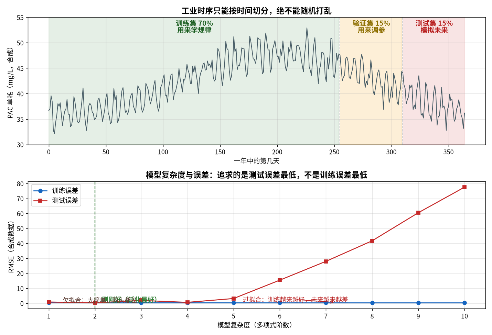
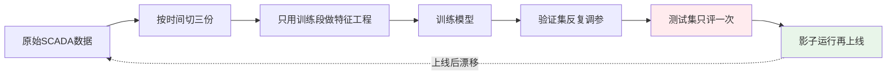

# 06-2 机器学习速成：污水厂版

> 『模型』『特征』『过拟合』『R²』——这些词在供应商方案里出现的频率，和它们被解释清楚的频率成反比。本章用**污水厂的例子**把机器学习讲明白，不考数学，只讲你审方案、看结果时必须认得的那些概念。
>
> 读完你能：说清模型在学什么、回归/分类/无监督各适合干什么；知道为什么时序数据只能按时间切、数据泄漏有哪四种常见死法；看懂 MAE/RMSE/MAPE/R² 四个指标；认出过拟合；说出加药特征工程的五类套路；并能跑通一个 30 行的加药回归小例子。
>
> 阅读时间：约 35 分钟。

---

## 一、场景导入：运行员和算法工程师的鸡同鸭讲

运行班长老周听完算法汇报，问了三个问题：

1. 你们模型不就是把昨天的投加量抄一遍吗？——这问的是**模型到底学到规律没有**；
2. 报告说准确率 98%，为什么上线第三天就报警报错？——这问的是**评估指标和数据切分**；
3. 演示曲线拟合得严丝合缝，明天暴雨它还行不行？——这问的是**过拟合和外推**。

工程师的回答老周一句没听懂。本章就是这场对话的翻译稿。

---

## 二、模型到底在学什么：一句话版本

机器学习只做一件事：**从历史数据里找一个函数 f，使得 y ≈ f(x)**。

- x：输入，也叫**特征**。加药问题里就是进水流量、进水 TP、水温、时刻、历史投加量……；
- y：输出，也叫**标签**。前馈推荐里是『该投多少药』，出水预测里是『出水 TP』，异常检测里可能没有标签；
- f：模型，就是一台调好的『换算器』。线性回归是一条直线，决策树是一串 if-else，梯度提升树是几百棵小树投票；
- 训练：把历史的 (x, y) 成对喂给机器，让它自动调整 f 内部的参数，使历史上的预测误差最小。

按标签形式，机器学习分三大门派，污水厂都用得上：

| 门派 | 数据形式 | 在污水厂的活 | 本书例子 |
|---|---|---|---|
| 监督学习·回归 | x → 连续数值 y | 投加量预测、出水 TP 预测、软测量 | 06-3、06-4 |
| 监督学习·分类 | x → 类别 y | 是否超标、工况分类（晴/雨/冲击） | 06-5 的工况识别 |
| 无监督学习 | 只有 x，没有 y | 异常检测、工况聚类 | 06-5 的孤立森林 |

还有一句要刻在脑子里：**y 的质量决定模型的上限**。特征和算法只是在逼近这个上限。历史人工投加量本身是过量的，模型学得再准也只是精准地浪费——06-3 第九节会用实算把这件事钉死。

---

## 三、模型谱系：从一条直线到几百棵树

不用懂推导，先建立直觉：

| 模型 | 一句话直觉 | 优点 | 缺点 | 什么时候用 |
|---|---|---|---|---|
| 线性回归 | 画一条最贴合的直线 | 可解释（每个系数有物理含义）、零调参 | 只能学线性关系 | 基准模型、做单耗估算 |
| 决策树 | 一串 if-else（流量大于 4500 且 TP 大于 4.5…） | 直观、能处理非线性 | 单棵树不稳定、容易过拟合 | 理解逻辑，很少单独用 |
| 随机森林 | 几百棵树各看一部分数据，投票平均 | 稳、抗噪、默认参数就好用 | 模型大、外推生硬 | 通用基线 |
| 梯度提升树（HistGB） | 一棵树纠正上一棵树的残差，接力纠错 | **表格小样本上通常最准** | 参数略多 | 本书主力，06-3/06-4/06-6 都是它 |
| 神经网络/深度学习 | 大量加权节点层层组合 | 能啃图像、超长序列 | 吃数据、吃算力、难解释 | 只有机器视觉等场景（见 06-1 决策树） |

在污水厂的分钟级表格数据上（一年也就 3.5 万条），梯度提升树几乎是默认最优解。本书统一使用 scikit-learn 自带的 `HistGradientBoostingRegressor`，不依赖任何第三方梯度提升库，更不碰深度学习框架。

> 💡 **现场经验**：所有项目的第一个模型永远用**线性回归**。它 5 分钟跑完，给出一个『笨但诚实』的基准——如果 HistGB 比线性回归只准 2%，却复杂十倍、无法解释，那就老老实实用线性模型或灰箱。**模型的价值要看相对基准的提升，不是看算法名字酷不酷。**

---

## 四、数据怎么切：时序数据的生死线

模型好不好，要在『没见过的数据』上考。于是要把历史数据切成几份。

### 4.1 普通数据随机切，时序数据必须按时间切

如果数据是互相独立的（比如一批污泥样的化验记录），可以随机打乱后按比例切。但加药数据是**时间序列**——今天和昨天高度相关，随机切等于把『昨天的答案』混进考题，模型偷看未来，离线分数虚高，上线露馅。

正确做法是按时间顺序切，下图用 365 天合成数据演示 70%/15%/15% 切分：



*数据为合成/典型参数实算：上半图为 365 天进水水质序列的三段切分，下半图为 1~10 阶多项式在训练集和测试集上的误差。脚本：`scripts/fig06_02_ml_basics.py`。*

脚本实算输出：

- 训练集：第 **0~254** 天（约 70%），均值 **42.60** mg/L；
- 验证集：第 **255~309** 天（约 15%），均值 **43.04** mg/L；
- 测试集：第 **310~364** 天（约 15%），均值 **38.09** mg/L。

注意三段均值并不相同——季节和工况在漂移，测试集天然比训练集『难一点』，这才是真实的考试。三份数据分工明确：

- **训练集**：拟合模型参数；
- **验证集**：调超参数（树深、学习率、特征选择），可以反复看；
- **测试集**：模拟上线，**整个项目只允许在最后看一次**。反复对着测试集调参，它就变成了第二个验证集。

### 4.2 数据泄漏的四种死法

数据泄漏（Data Leakage）= 训练时模型获得了上线时拿不到的信息。时序项目里最常见四种：

| 泄漏类型 | 错误做法 | 后果 | 正确姿势 |
|---|---|---|---|
| 随机划分 | 把全量样本 shuffle 后切分 | 相邻时段互相串门，离线虚高 | 严格按时间切（06-3 用 255/309 天为界） |
| 填充穿越 | 用全量均值/插值补缺失，再切分 | 未来的均值流进训练集 | 先切分，再只用训练段统计量填充 |
| 滚动窗穿越 | 滚动均值窗口包含未来点（如中心窗口） | 特征里混入未来信息 | 统一用**向后看**的滚动窗（截至 t 时刻） |
| 标签泄漏 | 把和标签同源、上线拿不到的量当特征 | 准得离谱，上线拿不到这个量 | 逐特征追问：预测那一刻，这个数真的有吗？ |

标签泄漏的典型例子：预测 10:00 的出水 TP，却把『10:00 的二沉池出口在线 TP』放进特征——同一个水在不同位置的测量，等于把答案写进题干。06-4 会讲怎么用加药到出水 2~4 小时的滞后关系来对齐，既用上信息又不偷看。

---

## 五、四个评估指标：看懂报告的通用货币

设 y 为真实值，ŷ（读作 y-hat）为预测值，n 为样本数。

**平均绝对误差 MAE**：

$$MAE = \frac{1}{n}\sum_{i=1}^{n}|y_i - \hat{y}_i|$$

单位与 y 相同（投加量是 L/h，TP 是 mg/L）。MAE 回答『平均每次差多少』，对异常点不敏感，最适合跟运行员解释。

**均方根误差 RMSE**：

$$RMSE = \sqrt{\frac{1}{n}\sum_{i=1}^{n}(y_i - \hat{y}_i)^2}$$

同样带 y 的单位。大误差被平方放大，RMSE 回答『最坏的那些时段差多少』。**MAE 低、RMSE 高，说明平时很准、偶尔离谱**——加药项目里这往往意味着雨天工况没学好。

**平均绝对百分比误差 MAPE**（及相对 MAE）：

$$MAPE = \frac{100\%}{n}\sum_{i=1}^{n}\left|\frac{y_i-\hat{y}_i}{y_i}\right|$$

无量纲，便于跨指标比较。加药量、水量都远离 0，可以放心用；但 TP 常在 0.1~0.3 mg/L，分母小，MAPE 会被放大到吓人，此时报相对 MAE（误差 ÷ 均值）更稳。

**决定系数 R²**：

$$R^2 = 1 - \frac{\sum(y_i-\hat{y}_i)^2}{\sum(y_i-\bar{y})^2}$$

回答『模型比『永远猜均值』强多少』。R²=1 完美，R²=0 跟猜均值一样，**R² 为负说明还不如猜均值**。加药回归项目的经验门槛：R² > 0.9 可进影子，MAE 相对值 < 5% 可进建议闭环（仅经验值，结合工艺定）。

用下一节小例的实算数字走一遍：后 40 天测试集上 MAE 10.97 kg/d、RMSE 13.87 kg/d、R² 0.952、相对 MAE 1.6%——平均每次偏差约 11 公斤，相对于日均 682 kg/d 的投加量，误差只有 1.6%。

> ⚠️ **老工程师的坑**：只报 R² 不报残差分布是报告障眼法。一个 R²=0.97 的模型可能雨天误差是晴天的 4 倍。务必像 06-3 那样**分工况报误差**（晴/雨、昼/夜、低温/常温），平均值会把问题藏起来。

---

## 六、过拟合与欠拟合：10 阶多项式的教训

- **欠拟合**：模型太简单，规律都没学到，训练集和测试集误差都大（直线去拟合弯的规律）；
- **过拟合**：模型太复杂，把噪声也背下来了，训练集误差极低，测试集崩掉；
- **恰好拟合**：训练误差低且测试误差也低——这才是要的。

下半图的实算把这件事演到了极端（脚本 `fig06_02_ml_basics.py`）：

| 多项式阶数 | 训练 RMSE | 测试 RMSE | 诊断 |
|---|---:|---:|---|
| 2（最优） | 低 | **0.310** | 抓住趋势，不过度 |
| 10 | **0.295** | **77.548** | 训练比 2 阶还低，测试误差是它的 250 倍 |

10 阶多项式在训练点之间疯狂拐弯去『穿过』每一个噪声点，训练 RMSE 0.295 看着漂亮，测试 RMSE 77.548 直接穿帮。这个 250 倍的差距，就是一切『演示很好、上线翻车』的数学本质。

### 6.1 梯度提升树最常调的三个旋钮

06-3 起反复用到 HistGB，提前认识它最重要的三个超参数（其余用默认即可）：

| 旋钮 | 变大时的效果 | 实操经验 |
|---|---|---|
| 学习率 learning_rate | 每棵树纠正得更狠，收敛快但容易过拟合 | 0.03~0.1 之间，配合早停 |
| 迭代轮数 max_iter | 树越多拟合越细 | 用验证集早停，本书脚本开 `early_stopping` |
| 叶节点最少样本数 min_samples_leaf | 变大则树更『粗枝大叶』，更抗噪 | 分钟级数据设 20~50，防止记住单场雨 |

调参只许看验证集：先固定学习率，让早停自动选轮数，再扫叶节点样本数。**在污水厂数据上，90% 的情况默认参数微调即可，别花两周网格搜索去抠最后 0.5% 的精度。**

防过拟合的三件常规武器：①按时间切出干净的测试集；②控制模型复杂度（树的深度、数量、学习率）；③数据量够——规律每重复几十次，模型才学得稳。

---

## 七、特征工程：污水厂的五类套路

数据和标签决定上限，特征工程决定模型能逼近多少。加药项目的特征翻来覆去五类：

| 类别 | 例子 | 为什么有用 |
|---|---|---|
| 原始过程量 | 进水 Q、进水 TP/氨氮、水温、DO、ORP | 负荷与反应条件的直接描述 |
| 滞后量 | 出水 TP(t−1)、投加量(t−2) | 加药到出水有 2~4 h 滞后，过去的值是未来的因 |
| 滚动统计 | 近 4 小时流量均值、近 1 h TP 最大值 | 平滑噪声、刻画冲击趋势 |
| 周期编码 | 时刻的 sin/cos、星期几 | 水量有明显日内周期；**注意季节编码在 06-6 是陷阱** |
| 工况交互 | Q×TP 负荷项、雨天标记、温度分段 | 帮助线性模型表达乘法关系；树模型也能更省力 |

周期编码要把 24 小时先变成角度：hour_sin = sin(2π·hour/24)、hour_cos = cos(2π·hour/24)。这样 23 点和 0 点在数值上是相邻的——直接拿整数 0~23 当特征，模型会以为它俩隔了 23 个小时。

---

## 八、动手：30 行的加药量回归小例

用合成的 130 天日数据（进水 TP → PAC 干粉投加量），前 90 天训练、后 40 天考试。代码可直接运行（依赖 numpy、scikit-learn）：

```python
import numpy as np
from sklearn.linear_model import LinearRegression
from sklearn.metrics import mean_absolute_error, mean_squared_error, r2_score

rng = np.random.default_rng(42)            # 固定种子，结果可复现
n = 130
days = np.arange(n)
tp = np.clip(rng.normal(4.0, 0.70, n), 2.2, 6.2)          # 进水总磷 mg/L
tp = tp + 0.15 * np.sin(days / 130 * 2 * np.pi + 0.6)     # 一点季节波动
pac = 322 + 94.55 * tp + rng.normal(0, 11.5, n)            # PAC 干粉 kg/d 加噪声

X = tp.reshape(-1, 1)
Xtr, Xte = X[:90], X[90:]                  # 时序切分，绝不 shuffle
ytr, yte = pac[:90], pac[90:]

model = LinearRegression().fit(Xtr, ytr)
pred = model.predict(Xte)

print("斜率 %.2f，截距 %.2f" % (model.coef_[0], model.intercept_))
print("MAE %.2f RMSE %.2f R2 %.3f"
      % (mean_absolute_error(yte, pred),
         np.sqrt(mean_squared_error(yte, pred)),
         r2_score(yte, pred)))
print("相对MAE %.1f%%，测试集日均投加 %.1f kg/d"
      % (mean_absolute_error(yte, pred) / yte.mean() * 100, yte.mean()))
```

实算输出：

```
斜率 93.23，截距 327.12
MAE 10.97 RMSE 13.87 R2 0.952
相对MAE 1.6%，测试集日均投加 682.0 kg/d
```

读法：

- 斜率 93.23 kg/d 每 (mg/L)：进水 TP 每升高 1 mg/L，模型建议每天多加约 93 kg PAC；截距 327 kg/d 是维持基础除磷的『底药』；
- 两个系数都有明确物理含义，可以拿去和 04 篇物料衡算公式对量级——这就是线性模型当基准的好处；
- R² 0.952、相对 MAE 1.6%：这个玩具例子里一条直线就够用。真实 15 分钟级、带雨天的多变量问题，才需要 06-3 的梯度提升树。

机器学习项目的标准流水线也不复杂，关键是**测试集只走最后一趟**：



> ⚠️ **老工程师的坑**：看到『数据先做归一化/插值，再划分训练测试』的实现，基本可以判定泄漏。正确顺序永远是**先切分，再做任何依赖统计量的处理**——06-3 的完整实战会严格遵守这条顺序。

---

## 本章小结

1. 机器学习就是找 f 使 y ≈ f(x)：加药量/出水预测是**回归**，超标判稳是**分类**，异常检测多为**无监督**；标签质量决定上限。
2. 本书技术栈：线性回归当基准，`HistGradientBoostingRegressor` 当主力，深度学习只留给视觉类场景。
3. 时序数据必须**按时间切**（本章例子 0~254/255~309/310~364 天，均值 42.60/43.04/38.09）；严防随机划分、填充穿越、滚动窗穿越、标签泄漏四种泄漏。
4. 四个指标：**MAE 看平均偏差、RMSE 放大坏时段、MAPE/相对 MAE 看比例、R² 看相对均值基线的提升**；误差必须分工况报。
5. 过拟合 = 训练 0.295 / 测试 77.548 这种 250 倍差距；特征工程五类：过程量、滞后、滚动统计、周期编码、工况交互。
6. 下一章进入完整实战：用一年 15 分钟数据，把 PAC 前馈模型从造数据一直做到策略仿真。

---

上一章：[06-1 AI 加药能力地图](./06-1-AI加药能力地图-什么活能交给AI.md)
｜下一章：[06-3 加药量预测建模完整实战](./06-3-加药量预测建模完整实战.md)
