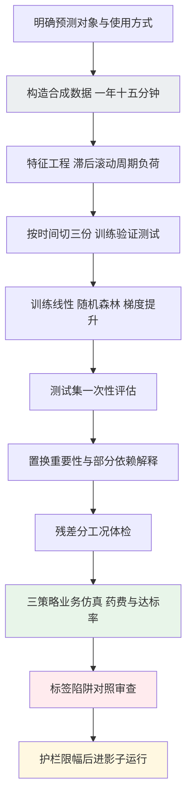
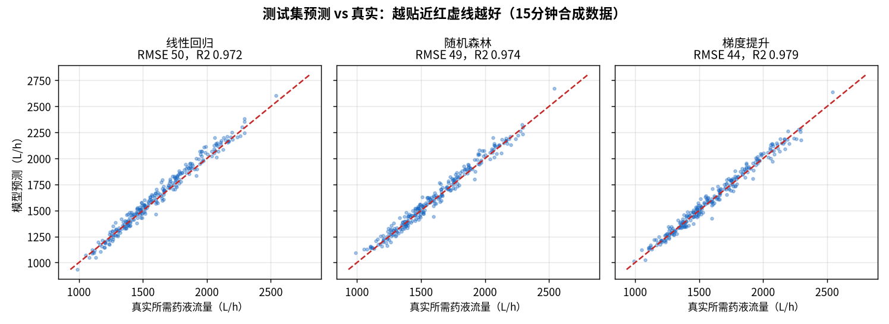
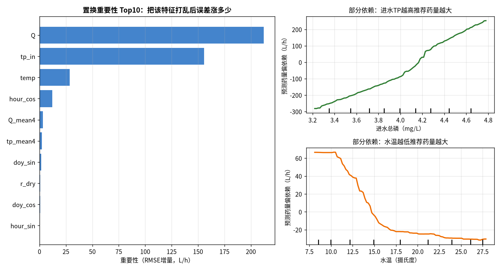
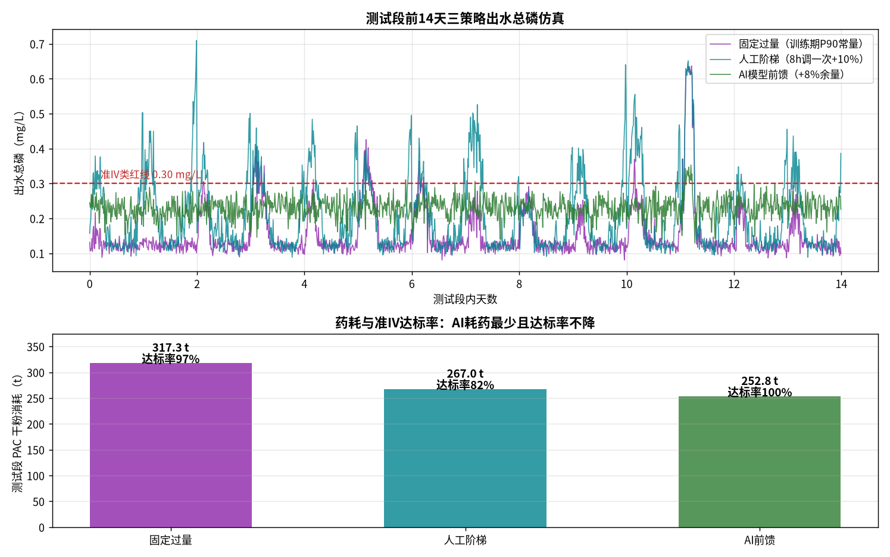

# 06-3 加药量预测建模完整实战

> 前两章解决了『干什么』和『模型是什么』，本章一竿子插到底：**用整整一年、15 分钟一条的数据，把 PAC 除磷前馈模型从造数据、切分、训练、解释、残差体检，一直做到三种投加策略的业务仿真。** 所有数字都来自脚本实算，你可以在 `scripts/fig06_03_dosing_model.py` 逐行复现。
>
> 读完你能：复述一个加药量预测项目的完整工序；看懂三模型对比、置换重要性和部分依赖图；把『MAE 34 L/h』翻译成『省多少钱、超标率多少』；最重要的是，理解为什么**拿历史人工投加量当标签，模型只会复现浪费**。
>
> 阅读时间：约 50 分钟。

---

## 一、场景导入：模型准了，然后呢

很多 AI 加药项目止步于一份漂亮的离线报告：R² 0.98，散点贴着对角线。厂长问三句话：

1. 它让我每个月少买多少吨 PAC？
2. 出水 TP 会不会反而超了？
3. 老师傅下雨天多投的那几吨，它学没学会？

本章用一个 10 万吨级厂、PAC 同步+后置除磷的完整算例回答这三问。技术栈按 06-1 的决策树选：标签本质可用物料衡算解释、数据是 3.5 万行的表格，因此主力是**梯度提升树**，并保留机理公式做标签构造和护栏（06-6 会把两者正式合并成灰箱）。

整体工序如下，后续各节对应图中每一步：



---

## 二、第一步：把问题定义成可测量的一句话

模糊需求『AI 优化加药』没法做，要翻译成：

> **在每个 15 分钟时刻，用截至该时刻可获得的进水与过程数据，预测『出水稳定达准 IV 类（TP ≤ 0.30 mg/L）所需的 10% PAC 药液流量（L/h）』，供运行员确认或前馈闭环执行。**

定义里每个词都要钉死：

| 要素 | 本算例的取值 | 为什么必须先定 |
|---|---|---|
| 预测对象 y | 所需 10% PAC 药液流量，L/h | 是『药液流量』不是『干粉』不是『泵频率』，三者换算见第六节 |
| 预测时刻 | 每个 15 分钟整点 | 决定数据粒度与执行节拍 |
| 可用信息 x | 预测时刻**之前及当时**可得的量 | 防止标签泄漏（06-2 第四节） |
| 使用方式 | 先影子、再建议、最后前馈闭环 | 决定安全余量和护栏设计 |
| 成功标准 | 相对 MAE < 5%；仿真段药费下降且达标率不降低 | 没有业务判据的 R² 没有意义 |

> ⚠️ **老工程师的坑**：务必在建模前确认现场计量泵有没有**实际药液流量计**。只有泵频率/冲程时，频率-流量关系会随药液粘度、管路压力漂移，标签本身误差可能就有 10%~20%——模型再准也赢不过标签噪声。加装一块电磁流量计（几千元）往往比换算法值钱得多。

---

## 三、数据构造：合成，但每一处都按真厂来

脚本生成 365 天 × 每天 96 点 = **35 040 行**数据。说明一下：本书用合成数据是为了让任何人零依赖复算；真实项目中这一步换成 SCADA 历史 + 化验数据，工序完全相同。

### 3.1 输入变量的分布

实算输出（种子固定 `np.random.default_rng(42)`）：

| 变量 | 实算结果 | 现场依据 |
|---|---|---|
| 进水流量 Q | 均值 **4205 m³/h**（约 10 万吨/日） | 日内双峰 + 雨日抬升 |
| 进水总磷 TP_in | 均值 **4.00 mg/L** | 05 篇典型取值 2~8 mg/L |
| 水温 | **8~28 ℃**（随季节） | β 随水温变化的根源 |
| 实际 Al/P 摩尔比 β | **1.93~2.45，均值 2.09** | 04 篇口径：同步约 1.5、后置 2~3，受温度和水质扰动 |
| 所需药液流量 | 均值 **1683 L/h**，P5 **1212**，P95 **2271** | 由机理公式逐点算出 |

所需药液流量按 04 篇物料衡算公式生成（符号单位见第十节）：

$$D = \frac{Q\times(TP_{in}-0.30)/1000\times(27/31)\times\beta}{0.1535\times0.10\times1.1}$$

### 3.2 数据生成的核心代码（真厂换成读库即可）

下面是脚本里最关键的一段生成逻辑，注意三件事：**所有数组显式转 numpy、β 随水温变化、雨日只抬升 Q 与 TP_in 而不直接改标签**——冲击的效果必须通过机理公式自然传导，不能人为往标签里塞异常，否则等于帮模型作弊。

```python
t = np.arange(35040)                      # 一年，15分钟一个点
hour = (t % 96) / 4.0
day = t // 96
Q = 4200 + 350*np.sin(2*np.pi*(hour-9)/24) + rng.normal(0, 120, len(t))
rain = (rng.random(len(t)) < 0.004).astype(float)          # 稀疏雨日
Q = np.asarray(Q + 900*rain, dtype=float)                  # 雨日抬升水量
tp_in = np.array(np.clip(4.0 + 0.6*np.sin(2*np.pi*day/365)
                         + rng.normal(0, 0.35, len(t)) + 1.2*rain, 1.5, 8.0))
temp = 18 + 10*np.sin(2*np.pi*(day-110)/365)               # 8~28度
beta = np.clip(2.20 - 0.008*(temp-18) + rng.normal(0, 0.05, len(t)), 1.5, 3.0)
D = Q*(tp_in-0.30)/1000*(27/31)*beta/0.1535/0.10/1.1       # 物料衡算，单位 L/h
```

真实项目里这段替换为：从历史库按统一时间戳对齐 Q、TP_in、temp、实际投加量与化验记录，并把 D 换成第十节标定出的机理标签。

### 3.3 先做相关性体检，别急着建模

标签与三个主变量的皮尔逊相关系数：

| 变量对 | 相关系数 | 解读 |
|---|---:|---|
| 剂量 ~ Q | **0.87** | 水量是第一驱动力 |
| 剂量 ~ TP_in | **0.80** | 浓度第二，两者共同构成『负荷』 |
| 剂量 ~ 水温 | 0.09 | **几乎不线性相关**——但水温通过 β 起作用，关系是非线性的 |

水温这一行是重点：单看线性相关几乎为 0，不代表水温没用。低温下 β 系统性升高，树模型靠『分区』能抓到这种条件关系，而线性模型会把它摊平。这正是本案例需要非线性模型的证据之一。

---

## 四、特征工程与时序切分

### 4.1 特征清单

| 类别 | 特征 | 说明 |
|---|---|---|
| 负荷 | Q、TP_in、Q×TP_in | 量与浓度分开给，再给负荷乘积 |
| 环境 | temp、rain（雨日标记/雨量） | 温度影响 β，雨日是独立工况 |
| 周期 | hour_sin、hour_cos | 24 h 周期正余弦编码（06-2 第七节） |
| 滞后滚动 | Q 的近 4 h 均值 Q_mean4 等 | 只用**向后看**的窗口，防穿越 |
| 派生 | tp×temp 交互、流量一阶差分 | 帮助模型捕捉变化率 |

### 4.2 特征构造的核心代码（注意滚动窗方向）

```python
df["hour_sin"] = np.sin(2*np.pi*df["hour"]/24)
df["hour_cos"] = np.cos(2*np.pi*df["hour"]/24)
df["load"] = df["Q"] * df["tp_in"]              # 磷负荷
df["Q_mean4"] = df["Q"].rolling(16, min_periods=1).mean()   # 16点=4小时
df["Q_diff"] = df["Q"].diff().fillna(0)          # 流量变化率
# 关键：rolling 默认向后看，绝不用 center=True（中心窗会包含未来点）
feat = ["Q","tp_in","temp","rain","hour_sin","hour_cos","load","Q_mean4","Q_diff"]
```

`rolling(16)` 的每一行只用到当前行及之前 15 行，凌晨 0 点的特征里不会出现下午 4 点的流量——这是 06-2 第四节『滚动窗穿越』的具体防线。

### 4.3 切分：309 天之前不许碰测试集

严格按时间切，与 06-2 同构：

| 数据集 | 行数 | 对应时间 |
|---|---:|---|
| 训练 | **24 460** | 第 0~255 天 |
| 验证 | **5 242** | 第 256~308 天（HistGB 早停使用） |
| 测试 | **5 242** | 第 **309~364** 天（约 55 天，秋冬段，温度偏低） |

故意把测试段放在一年中温度偏低的尾部，就是要考模型的**跨季节泛化**——而不是随机切出来的『换一天考同样天气』。

训练核心代码（完整见脚本）：

```python
from sklearn.ensemble import HistGradientBoostingRegressor
model = HistGradientBoostingRegressor(
    learning_rate=0.05, max_iter=400,
    min_samples_leaf=30, random_state=42,
    early_stopping=True, validation_fraction=0.1)
model.fit(Xtr, ytr)                  # ytr 是机理标签，不是人工投加量
pred = model.predict(Xte)
```

---

## 五、三模型对比：提升到底提升了什么

同一套特征和切分，训练三个模型，测试集实算：

| 模型 | MAE（L/h） | RMSE（L/h） | 相对 MAE | R² |
|---|---:|---:|---:|---:|
| 线性回归 | 39.2 | 50.4 | 2.43% | 0.972 |
| 随机森林 | 37.6 | 49.1 | 2.33% | 0.974 |
| **梯度提升（HistGB）** | **33.8** | **44.4** | **2.10%** | **0.979** |



*数据为合成/典型参数实算：三模型在同一测试集（第 309~364 天）的预测散点，红虚线为理想线。三个模型都贴着线走，差异主要在高负荷（>2300 L/h）尾部。*

三个读数：

1. **线性回归已经很强**（R² 0.972）：因为标签本身由机理公式生成、变量关系大体是乘积型，喂了 Q×TP 交互项后直线就能解释大部分。这提醒我们：树模型提升的空间往往只有最后几个百分点，要不要为这几个百分点付复杂度的代价，取决于业务价值——本案例答案是值（见第八节，几个百分点对应十几万元）。
2. **提升主要来自尾部**：RMSE 从 50.4 降到 44.4（−12%），比 MAE 的改善更明显——树模型把雨日、低温、高负荷这些『坏时段』修得更好。
3. 相对 MAE 2.10% 达到第一节定的 < 5% 门槛，**可以进入解释和仿真环节，但还没到上线资格**。

---

### 5.1 为什么不继续堆更复杂的模型

有人会问：HistGB 比线性回归好，那要不要上更深的模型、更多特征？本算例给了否定回答的依据：

- 线性 R² 已 0.972，剩余空间总共不到 3 个百分点，其中雨天就占掉一大块，而雨天靠加模型复杂度解决不了（只有 34 个样本）；
- 每提高 1 个千分点的离线精度，代价是更差的可解释性、更长的验证周期和运行员更低的信任度；
- 真正的下一个提升点不在『换模型』，而在**补信息**：加气象预报、加泵站前馈、在线修正 β——这些在 06-4、06-6 展开。

> 💡 **现场经验**：模型改进有两条路线，『换更复杂的算法』和『补更前瞻的信息』。污水厂里后者几乎总是赢家——提前 2 小时知道雨要来，比把树加深五层管用得多。

---

## 六、模型解释：置换重要性 + 部分依赖图

### 6.1 置换重要性：逐个把特征『弄坏』看误差涨多少

做法：测试集上把某一列随机打乱（破坏它和标签的关系），看 RMSE 涨多少。涨得越多越重要。关键实现细节——必须显式指定 `scoring="neg_root_mean_squared_error"`，否则 sklearn 默认给 R² 口径，数值无量纲、不便解释。

```python
from sklearn.inspection import permutation_importance
r = permutation_importance(model, Xte, yte, n_repeats=10,
                           scoring="neg_root_mean_squared_error",
                           random_state=42)
```

Top5 实算（数值是该特征被打乱后的 **RMSE 增量，L/h**）：

| 排名 | 特征 | RMSE 增量（L/h） | 工艺解读 |
|---|---|---:|---|
| 1 | Q | **212.10** | 水量是第一驱动力，与相关性 0.87 互相印证 |
| 2 | TP_in | **155.69** | 进水浓度第二 |
| 3 | temp | 28.49 | 温度非线性地修正 β，没它低温段会系统性偏差 |
| 4 | hour_cos | 12.12 | 日内周期，捕捉早晚用水峰 |
| 5 | Q_mean4 | 3.13 | 4 h 均值只起边际作用（当前 Q 已足够） |



*数据为合成/典型参数实算：左为置换重要性（RMSE 增量，越大越重要），中/右为投加量对进水 TP、对水温的部分依赖曲线（PDP，其余特征取真实分布）。*

### 6.2 部分依赖图（PDP）：回答『方向对不对』

重要性只告诉你『谁重要』，PDP 告诉你『怎么影响』：

- TP 子图：所需药液量随进水 TP 单调上升，方向与物料衡算一致——模型学的是化学，不是玄学；
- 温度子图：低温段（<13 ℃）所需药量上抬、高温段回落，对应 β 的季节漂移。

> 💡 **现场经验**：**重要性排序和 PDP 方向是模型的『政审』，必须先过这一关再谈上线。** 如果模型说进水 TP 越高药越少、或者流量排不进前三，不用查代码，直接打回——它一定学歪了（大概率是标签错或泄漏）。模型可以不懂工艺，但不能违背工艺常识。

---

## 七、残差体检：把平均误差拆到每个工况上

R² 0.979 是『全年平均』，运行员过的是一个个具体的雨天和夜班。HistGB 测试集残差分工况实算：

| 切分维度 | 工况 | MAE（L/h） | 样本数 | 结论 |
|---|---|---:|---:|---|
| 天气 | 晴天 | 33.2 | 5208 | 日常工况很准 |
| 天气 | **雨天** | **130.6** | 34 | 误差是晴天的 **3.9 倍**，且样本极少 |
| 时段 | 白天 | 38.9 | — | 夜间反而更稳 |
| 时段 | 夜间 | 28.5 | — | 夜间负荷平稳、噪声小 |
| 温度 | 低温 <13 ℃ | 33.6 | 4416 | 跨季节没有崩 |
| 温度 | 常温 | 35.2 | — | 温度特征起了作用 |

这张表比 R² 值钱：

- **雨天 34 个样本、MAE 130.6**：一年里真正的冲击工况就三十几个 15 分钟，模型不可能靠 34 个点学稳。对策不是调参，而是**雨日走机理前馈 + 安全余量，模型让行**（06-6 的护栏与异常退回）。
- 低温段不弱于常温，说明温度特征 + 时序切分的考验通过了；但这只是合成数据的结论，真厂第一个冬季仍要重点盯。

> ⚠️ **老工程师的坑**：样本少的工况，误差数字本身不稳（34 个点里两三个极端点就能让 MAE 翻倍）。报告里务必同时写**样本数**。看到『极端工况误差降低 40%』但样本只有个位数，先问一句：这结论敢用在下一场雨上吗？

---

## 八、业务仿真：把 L/h 翻译成吨、万元和达标率

模型误差只是技术语言，决策要算账。脚本在测试段（约 55 天）仿真三种投加策略。

### 8.1 三种策略怎么定义

| 策略 | 定义 |
|---|---|
| 固定过量 | 取训练段所需药液 P90 作为常量投到底，模拟『宁多勿少』 |
| 人工阶梯 | 8 h（32 点）一个台阶，按块首真实需要 ×1.15 后量化到 50 L/h，模拟老师傅的粗颗粒调节 |
| AI 前馈 | HistGB 逐点预测 × **1.08 安全余量**，并限幅 **300~2800 L/h** |

出水 TP 的响应模型（ratio = 实际投加/真实需要）：

$$TP_{out}=\begin{cases}0.30-0.80(ratio-1) & ratio\ge1\ \text{（投足，余量越大越接近下限）}\\\\0.30+1.50(1-ratio) & ratio<1\ \text{（欠投，TP 快速冲高）}\end{cases}$$

干粉折算（15 min 一步 = 0.25 h；10% 药液密度 1.1 kg/L）：

$$干粉(t)=\sum D\times0.25\times0.10\times1.1\div1000$$

药费按 PAC 干粉 2000 元/t（04 篇典型经验区间 1500~2500 元/t）。

### 8.2 仿真结果

| 策略 | 干粉消耗 | 药费 | 平均出水 TP | 准 IV 类达标率 | 超一级 A（0.5）占比 |
|---|---:|---:|---:|---:|---:|
| 固定过量 | **317.3 t** | 63.47 万元 | 0.149 | 97.0% | 0.29% |
| 人工阶梯 | 267.0 t | 53.39 万元 | 0.207 | 81.8% | 1.74% |
| **AI 前馈** | **252.8 t** | **50.56 万元** | 0.230 | **99.6%** | **0.00%** |



*数据为合成/典型参数实算：测试段约 55 天三策略对比。左为药费与干粉，中为准 IV 类达标率，右为出水 TP 分布与越限点。*

四个结论，正是厂长三句话的答案：

1. **AI 比固定过量省 20.3%、比人工阶梯省 5.3%**：55 天省药费 12.9 万元、2.8 万元，年化即百万/数十万量级，与 06-1 的 15%~30% 经验区间自洽；
2. **省药不是拿超标换的**：AI 平均 TP 0.230 虽高于固定过量的 0.149（固定策略是靠猛砸药压到很低），但准 IV 达标率 99.6% 反而最高、超一级 A 占比 0——因为它**没有人工阶梯那种 8 h 跟不上负荷变化的欠投时段**；
3. 固定过量策略达标率只有 97.0% 有点反直觉：常量投加在极端高负荷点也会欠投，『一味多投』并不能覆盖所有冲击，还把钱花在了低负荷时段；
4. AI 的 1.08 安全余量和限幅是这套结果成立的前提——**裸模型直接上，省得更多但不敢用**。安全余量怎么定，是 06-7 影子运行的核心任务之一。

---

### 8.3 关于这套仿真的三条诚实声明

1. TP 响应式是**教学用的简化模型**：真实二沉池/滤池对欠投的响应有 2~4 h 滞后且非线性（05-3 实测约 170 min），仿真中把它压缩成同一时刻的分段线性关系，是为了让账算得透明，不代表真实池体；
2. 固定与人工策略是**合成的行为模型**（P90 常量、8 h 量化台阶），真实班组的习惯千差万别，省 20.3% 和 5.3% 的数字不可直接承诺给客户，只能用影子运行实测（06-7）；
3. 1.08 安全余量在真厂要按**出水 TP 距限值的统计裕度**重新标定：限值 0.30、在线表误差 ±0.02~0.05 mg/L 时，目标均值压在 0.20~0.23 是常见选择，本算例结果 0.230 与该经验区间一致。

---

## 九、本章最重要的一节：标签陷阱

### 9.1 问题

真实项目里没有『真实需要投加量』这列数据，历史库里只有**运行员实际投了多少**。绝大多数失败项目的选择是：直接拿历史人工投加量当 y 去训练。这会发生什么？脚本做了对照实验：

| 数据/模型 | 测试段平均推荐（L/h） | 相对真实需要 | 说明 |
|---|---:|---:|---|
| 真实机理需要 | **1614** | — | 标尺 |
| 历史人工实际投加 | **1932** | **过量 19.7%** | 老师傅宁多勿少 + 8h 粗调节 |
| 用人工标签训出的模型 | **1956** | **多 21.2%** | 模型把浪费学得青出于蓝 |
| 用正确机理标签训出的模型 | **1624** | 仅多 **0.6%** | 学到的是『需要』，不是『习惯』 |

而且人工标签模型对『人工投加行为』的拟合 R² 高达 **0.880**——它真的学会了，只是学错了对象。这就是行业里最隐蔽的一类项目：**离线指标极好、上线后药耗纹丝不动**，因为模型的天花板就是历史操作本身。

### 9.2 机理标签怎么来

本算例用 04 篇物料衡算公式逐点生成 y，并允许 β 随水温/水质在 1.93~2.45 内变化。真厂落地有三条路（推荐度从高到低）：

1. **机理计算 + 有效数据校核**：用公式算出理论需要量，再用『投加后出水确实达标且不冗余』的时段回归标定 β，形成 y（06-6 灰箱的标签层）；
2. **高质量小样本标定**：在投加后出水 TP 稳定在 0.20~0.30 mg/L 的『恰好投好』时段，把实际投加量近似当 y——这要求投加量有计量、出水有在线或高频化验；
3. **实在只有人工记录时**：必须剔除过量时段（出水 TP 长期 <0.10 的记录）并做残差修正，否则不要启动项目。

> ⚠️ **老工程师的坑**：判断项目是不是踩了标签陷阱，有个一分钟体检法——**上线后把模型推荐均值与历史人工均值对比**。如果两者偏差小于 3%，先别高兴，模型大概率只是在复述历史；再去看出水 TP 的分布有没有从『远低于限值』向『贴近限值但不超』移动。省钱发生在分布移动里，不发生在 R² 里。

---

### 9.3 机理标签标定的五步操作法

在真厂构造 y 时按下面顺序走，每步都留记录，模型验收时要能倒查：

1. **圈定有效时段**：投加流量计、进水流量、出水 TP 三者同时有效的连续时段，剔除仪表故障与检修开停车；
2. **滞后对齐**：按 05-3 的互相关方法确定加药点到出水测点的滞后（典型 2~4 h，本厂实测为准），把投加与它影响的出水配对；
3. **筛『恰好投好』样本**：滞后后的出水 TP 落在 0.20~0.30 mg/L 区间（既达标又不冗余）的时段，实际投加量近似等于真实需要；
4. **回归标定 β**：用这些时段反推 β = 实际 Al 摩尔量 ÷ 去除 P 摩尔量，按水温/季节分组得到 β(T) 曲线，检查是否落在 1.5~3 的经验范围内；
5. **生成全量标签**：用 β(T) 代物料衡算公式生成每个 15 分钟的 y，并把『恰好投好』时段的真实投加量作为校验锚点，残差偏差超过 10% 的分组要回查。

这套流程把『老师傅说不清的经验』变成可审查的参数表，也是 06-6 灰箱模型的标签层。

---

## 十、公式、符号与单位汇总

| 符号 | 含义 | 单位 | 本算例取值 |
|---|---|---|---|
| Q | 进水流量 | m³/h | 均值 4205 |
| TP_in | 进水总磷 | mg/L | 均值 4.00 |
| TP_target | 控制目标 | mg/L | 0.30（准 IV 类） |
| 27/31 | P/PO₄ 质量换算 | — | 0.871 |
| β | 实际 Al/P 摩尔比 | mol/mol | 1.93~2.45，均 2.09 |
| w_Al | PAC 中 Al 质量分数 | — | 0.1535（Al₂O₃ 29% × 54/102） |
| 药液浓度 | 10% PAC 质量分数 | — | 0.10 |
| ρ | 药液密度 | kg/L | 1.1 |
| D | 10% 药液流量 | L/h | 均 1683 |

两个核心公式（已在第三节、第八节使用）：

$$D=\frac{Q\times(TP_{in}-TP_{target})/1000\times(27/31)\times\beta}{w_{Al}\times0.10\times\rho}$$

$$干粉(t)=\sum D\times0.25\times0.10\times1.1/1000$$

单位校验（务必养成习惯）：Q(m³/h)×浓度(mg/L=g/m³)/1000→kg P/h；乘 (27/31)×β/w_Al 得 kg Al 剂/h；除以药液质量分数与密度得 L/h。脚本合成数据与模型标签都走这条链，模型输出因此可以直接与 04 篇公式对量级。

---

## 十一、从脚本到真实项目：还差什么

本章脚本故意跳过了真厂必须做的脏活，落地清单：

1. **投加量计量**：实际药液流量计 + 定期标定，否则标签与执行都不可信；
2. **β 的本厂标定**：用历史达标时段数据回归，别直接抄 2.09（06-6 给在线修正方法）；
3. **数据清洗**：05-2 的九种死法（卡死、尖峰、单位事故、时间错位…）先过一遍；
4. **雨日策略**：34 个样本学不会，靠气象/泵站前馈 + 机理兜底（06-5、06-6）；
5. **影子运行 2~4 周**：1.08 的安全余量、限幅边界都要用真实数据再标定（06-7）；
6. **泵的可达性约束**：模型输出超出计量泵量程或调节速率时要有截断与斜坡限速（07 篇）。

---

## 本章小结

1. 完整工序：**定义 → 数据 → 特征 → 时序切分（24 460/5 242/5 242）→ 三模型对比 → 解释 → 残差体检 → 业务仿真 → 标签审查 → 护栏**。
2. 三模型测试集：线性 39.2/50.4（R²0.972）、随机森林 37.6/49.1（0.974）、**HistGB 33.8/44.4（R²0.979，相对 MAE 2.10%）**；提升主要在高负荷尾部。
3. 置换重要性（RMSE 增量 L/h）：Q 212.10、TP_in 155.69、temp 28.49；PDP 方向必须符合工艺常识。
4. 残差要分工况看：晴天 MAE 33.2 vs **雨天 130.6（仅 34 点）**；少样本工况靠机理兜底，不靠调参。
5. 55 天仿真：**AI 252.8 t/50.56 万元/达标率 99.6%/零超一级 A**，比固定过量省 20.3%、比人工省 5.3%；省药不牺牲达标。
6. 标签陷阱：历史人工过量 19.7%，人工标签模型推荐 1956（多 21.2%，行为 R²0.880），机理标签模型 1624（仅多 0.6%）——**学『需要』而不是学『习惯』。**

---

上一章：[06-2 机器学习速成：污水厂版](./06-2-机器学习速成-污水厂版.md)
｜下一章：[06-4 出水指标预测与软测量建模](./06-4-出水指标预测与软测量建模.md)
