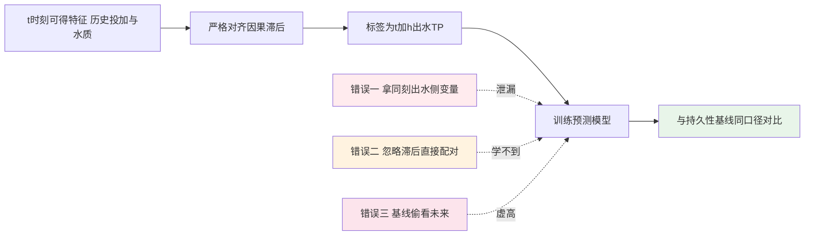
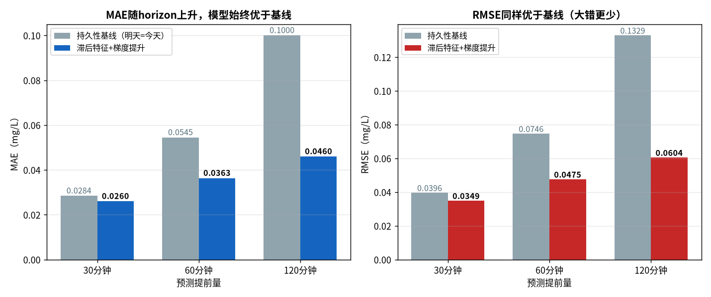
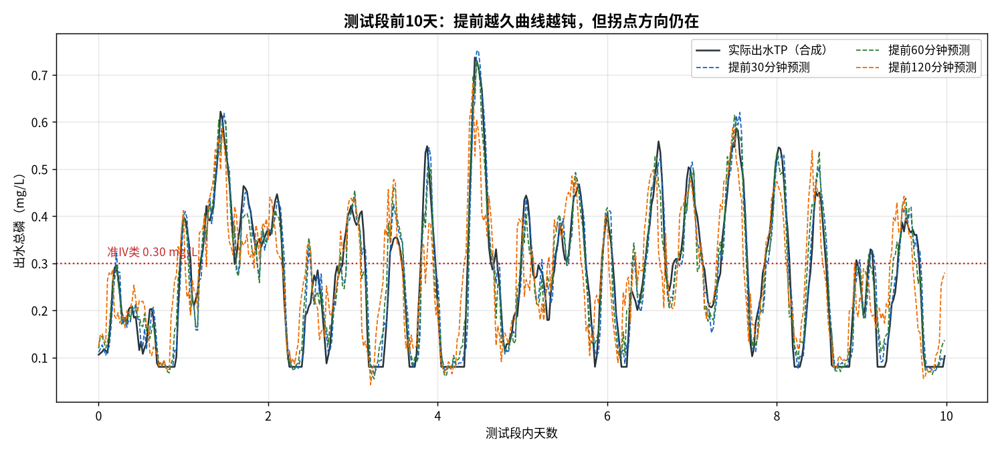

# 06-4 出水指标预测与软测量建模

> 06-3 让模型学会了『加多少』，本章让模型学会『看结果』：**预测未来 30/60/120 分钟的出水总磷**。它既当运行员的预警哨，又当加药模型的反馈信号——在便宜仪表和滞后现实的约束下，这是性价比最高的一类 AI 应用。
>
> 读完你能：分清软测量与预报的差别；说清标签滞后对齐为什么是本章第一大坑；会选预测时长（horizon）并知道为什么一定要和『持久性基线』比；看懂直接多步、递归、多输出三种建模路线；读懂置换重要性给出的工艺解释。
>
> 阅读时间：约 40 分钟。

---

## 一、场景导入：等化验结果出来，鱼都翻肚了

某厂出水 TP 靠化验室一天两次人工分析。周二上午九点的化验单显示 0.42 mg/L——已经连续三个时段逼近准 IV 类限值 0.30，等班长打电话问二沉池，最新一拨高磷水其实是**三个多小时前**加药不足造成的，药补下去又要两个多小时才见效。一个来回，超标时段已经酿成。

出路有两条：买在线 TP 表（一台十几万元，每月试剂维护几千元，探头还得常洗）；或者用现有的流量、DO、投加量、水温等便宜在线量，建一个**出水 TP 的预测模型**——这就是 [05-3](../05-数据篇/05-3-软测量-用便宜仪表猜贵指标.md) 软测量的模型化升级。

先把两个概念分清：

| 类型 | 回答的问题 | 标签 | 典型用途 |
|---|---|---|---|
| 软测量（估计当下） | 现在二沉池出口 TP 是多少 | 与输入**同时刻**的化验值（对齐仪表位置） | 替代/校核贵仪表 |
| 预报（本章重点） | 未来 30/60/120 分钟 TP 是多少 | **未来时刻**的出水 TP | 超标预警、前馈补偿 |

两者技术同源、特征相通，差别只在标签怎么对。本章做预报，脚本 `scripts/fig06_04_effluent_tp.py`。

---

## 二、数据：180 天、30 分钟一步

实算数据（种子 `np.random.default_rng(42)`）：

- **8 640 行**（180 天 × 48 点/天，30 min 粒度）；
- 出水 TP：均值 **0.270 mg/L**，P95 **0.595 mg/L**——大部分时段低于 0.30，但有约 5% 的时间冲过 0.5（一级 A 红线），说明报警问题是真问题；
- 输入：进水 Q、进水 TP、实际 PAC 投加量（多个滞后）、水温、hour_sin/cos、历史出水 TP 滞后；
- 时序切分：训练 **6 042 行**，测试 **1 295 行（第 152~179 天，约 4 周）**。

测试段只有 4 周是有意的：预报模型的『高考』就是最近这一个月，包含日内波动和几次冲击，足够算清误差账。

---

### 2.1 预报模型的特征一览

合成数据保留了现场最常见的可得点位，真厂可在此基础上增删，但不必追求多：

| 特征组 | 具体列 | 取它的理由 |
|---|---|---|
| 出水自相关 | tp_lag1 | 短期平滑性，重要性第一 |
| 投加历史 | dose_lag1/2/4/6/8 | 覆盖 30 min~4 h 的滞后响应带 |
| 水力负荷 | Q、Q_lag2 | 水量峰带来稀释比变化 |
| 周期 | hour_sin、hour_cos | 昼夜负荷节律 |
| 环境（可选） | temp、rain | 跨季节修正与雨日标记 |

经验是：**滞后列宁全勿缺，外部变量宁缺勿滥**。投加滞后覆盖不全，模型学不到完整因果；而把一堆没洗干净的点位塞进特征，只会让树在噪声里分裂。05-2 讲过：进模型之前，每一列都要先过有效率和异常率体检。

---

## 三、第一大坑：标签的滞后对齐

### 3.1 药加下去，水要走两到四小时

加药点到出水测点之间隔着反应池、二沉池，05-3 的互相关实算给出滞后约 **170 分钟**。这意味着 t 时刻的投加量，影响的是约 t+170 分钟的出水 TP。建模时必须回答：预测 t+h 的出水时，哪些投加量真的参与了因果？

脚本用一个伽马形滞后核模拟池体响应：核从第 3 步（90 min）起爬升，**峰在第 6~7 步（约 3~3.5 h）**，与 170 min 的实测经验互相呼应。合成出水 TP 由历史投加量按核加权 + 进水负荷 + 噪声生成。

### 3.2 三种对齐错误，个个致命



- **错误一：同刻出水侧变量当特征**。把『同刻滤后 TP』放进特征预测『出水 TP』，等于把答案放在题干里——上线时这个位置根本没有测点或测点就在标签旁边；
- **错误二：忽略滞后**。用 t 时刻投加量直接配 t 时刻出水，模型在噪声里找关系，重要性会把投加量排到末尾，得出『加药没用』的荒谬结论；
- **错误三：基线偷看未来**（本章第五节专门讲）。

正确姿势：特征只保留**预测原点 t 及以前**的量，投加量按滞后核的形状取多个滞后列（dose_lag2、dose_lag6…），让模型自己分配权重。

---

### 3.3 对齐与特征构造的代码骨架

脚本里这段代码把上面的原则落成了几行 pandas，重点看 shift 的方向：**正整数 shift 取的是过去**，绝不出现负数 shift（负数会把未来取进来）。

```python
for k in [1, 2, 4, 6, 8]:                       # 滞后步数，30min一步
    d["dose_lag%d" % k] = d["dose"].shift(k)    # t-k 时刻的投加量
d["Q_lag2"] = d["Q"].shift(2)
d["tp_lag1"] = d["tp"].shift(1)                 # 最近一个出水TP
d["hour_sin"] = np.sin(2*np.pi*d["hour"]/24)
d["hour_cos"] = np.cos(2*np.pi*d["hour"]/24)
for h in (1, 2, 4):                             # 30/60/120 min
    d["y_h%d" % h] = d["tp"].shift(-h)          # 标签才允许向未来取
feat = ["tp_lag1","dose_lag1","dose_lag2","dose_lag4","dose_lag6",
        "dose_lag8","Q_lag2","hour_sin","hour_cos"]
```

特征一侧全是正 shift（历史），只有标签列 `y_h*` 用负 shift（未来）；训练前 `.dropna()` 去掉窗口边界行。代码评审时，**负数 shift 出现在特征表里就等同于发现泄漏**。

---

## 四、预测时长怎么选：30、60、120 分钟各考一次

预测时长（horizon，记 h）不是越长越好，也不是越短越没用——它由**留给运行动作的时间**倒推：

| horizon | 能支持的动作 | 代价 |
|---|---|---|
| 30 min | 微调计量泵、提醒加密观察 | 反应池+二沉池滞后约 170 min，30 分钟的预警很多时候来不及补救 |
| **60 min** | 前馈补偿、调整后续 1~2 个班次投加 | 精度与可操作性的平衡点，**推荐主用** |
| 120 min | 应对雨峰、提前通知班长、联动调蓄 | 曲线明显变钝，只能看方向和拐点 |

### 4.1 直接多步：一个 horizon 训一个模型

本章采用**直接多步**策略：分别为 h=30/60/120 min 训练三个独立的 HistGB 模型，各用各的标签 y(t+h)，特征同一套（全部不晚于 t）。测试集实算（单位 mg/L）：

| horizon | HistGB MAE | HistGB RMSE | 持久性基线 MAE | 持久性基线 RMSE | MAE 改善 |
|---|---:|---:|---:|---:|---:|
| 30 min | **0.0260** | 0.0349 | 0.0284 | 0.0396 | 8.6% |
| 60 min | **0.0363** | 0.0475 | 0.0545 | 0.0746 | **33.3%** |
| 120 min | **0.0460** | 0.0604 | 0.1000 | 0.1329 | **54.0%** |



*数据为合成/典型参数实算：三个预测时长下 HistGB 与持久性基线的 MAE、RMSE。脚本：`scripts/fig06_04_effluent_tp.py`。*

读表方法（反直觉但关键）：**越往远看，模型越『值钱』**。30 min 时改善只有 8.6%——因为半小时内出水 TP 本来就很平滑，『猜它不变』已经八九不离十；120 min 时基线崩到 MAE 0.1000，而模型还有 0.0460，改善 54%。模型的价值随基线变笨而变大，这也是所有预报项目必须报基线对比的原因。

### 4.2 预测曲线：提前越久越钝，但拐点还在



*数据为合成/典型参数实算：测试段前 10 天实际出水 TP 与三个 horizon 的预测。红色点线为准 IV 类限值 0.30 mg/L。*

图上能看到：30 min 蓝色虚线几乎和黑色实际线重合；60 min 绿色虚线波峰略滞后、幅值略小；120 min 橙色虚线最钝，但**每一次冲高的方向和大致时点都还在**——报警要的正是『一小时后大概率过 0.30』这个方向，而不是小数点后三位的精度。

---

### 4.3 为什么不直接用机理公式算出水 TP

有读者会问：04 篇有物料衡算，06-3 能算投加量，直接反推出水 TP 不行吗？难在三个量现场拿不到或不稳：实际 β 随水温与水质漂移、二沉池释磷/吸磷有生物过程贡献、在线表本身带误差。纯机理算投加量（正向、输入都可测）很可靠；反过来反推出水，则把所有参数误差串进结果。

实战定位是**互补而非替代**：机理负责投加量的主线（06-6 灰箱），预报模型负责出水端的短期趋势与预警，两者在同一套护栏下工作——预报连续两期高于阈值时，前馈模型的安全余量自动上调，这正是 07 篇讲的预测前馈闭环。

---

## 五、持久性基线：最蠢也最公平的对手

持久性基线（persistence baseline）的规则只有一句话：**用预测原点 t 的实测值，顶住整个 horizon**，即 ŷ(t+h) = y(t)。

它蠢到不需要任何训练，却是时序预测论文和工程验收里的标配对手。原因：如果你的 AI 模型连『明天跟今天一样』都打不过，它就没有上线资格。

这里藏着脚本开发时真实踩过的一个坑（写出来免得你再踩）：

> ⚠️ **老工程师的坑**：最初实现时，基线错误地用了**预测原点之后**的真实值去对齐，等于让基线也偷看了未来，结果三个 horizon 上基线都『准得反常』，模型反而像在拖后腿。正确写法是严格截取预测原点那一列：`persist = yte[:len(yh_te)]`——同一起点、同一终点、同一口径，对比才有意义。任何不与持久性基线同口径比较的预报准确率，都可以直接打问号。

---

## 六、模型解释：它靠什么提前两小时看见风险

对 60 min 模型做置换重要性（显式 `scoring="neg_root_mean_squared_error"`，数值为打乱该特征后的 **RMSE 增量，mg/L**）：

| 排名 | 特征 | RMSE 增量（mg/L） | 工艺解释 |
|---|---|---:|---|
| 1 | tp_lag1（上一步出水 TP） | **0.1579** | 自相关最强，短期预测的地基 |
| 2 | dose_lag2（滞后 1 h 投加） | **0.0748** | 正在反应池里发挥作用的药 |
| 3 | dose_lag6（滞后 3 h 投加） | 0.0337 | 正好对应滞后核峰（6~7 步） |
| 4 | hour_cos | 0.0210 | 日内负荷节律 |
| 5 | Q_lag2 | 0.0164 | 水量变化带来的稀释/冲击 |

这张表本身就是一次模型政审，而且**反向验证了滞后对齐做对了**：排第 2、3 位的正是 1 小时和 3 小时前的投加量，与伽马核 3~3.5 h 的峰、170 min 的实测经验一致。如果排第一的是 Q、投加量集体靠后，先怀疑对齐错了，而不是怀疑工艺。

为什么本书统一用置换重要性而不是流行的 SHAP：

- sklearn 原生支持，不引入额外依赖，结果对树模型、线性模型通用；
- 数字直接带被预测量的单位（mg/L），运行员听得懂；
- 代价是只给『重要性』不给『正负方向』，方向用 06-3 的 PDP 补；两者搭配足够应付加药类项目的解释需求。

> 💡 **现场经验**：重要性结果反过来可以指导**仪表维护优先级**。tp_lag1 排第一说明出水 TP 表一旦失真，整个预报就塌——这块表的清洗标定周期、试剂库存要享受最高等级保障。模型不仅是软件，它还告诉你哪块仪表最值得花钱养。

---

## 七、三种多步建模路线怎么选

| 路线 | 做法 | 优点 | 缺点 | 适用 |
|---|---|---|---|---|
| 直接多步（本章） | 每个 horizon 一个独立模型 | 误差不累积、各 horizon 可独立优化 | 模型多、不保证跨 horizon 曲线平滑 | horizon 只有 2~3 个的生产场景，**首选** |
| 递归滚动 | 一个单步模型，把预测值塞回去再预测 | 只需一个模型，长 horizon 也能推 | 误差滚动累积，越远越飘 | 只关心 1~2 步的短预测 |
| 多输出 | 一个模型同时输出全部 horizon | 曲线天然平滑、一次推理 | sklearn 支持有限、调参不灵活 | 研究或有统一推理框架时 |

经验：加药预警只盯 30/60/120 三个点，直接多步最省心；不要为了『一个模型管所有』的整洁感去承担递归误差。

---

## 八、误差量级怎么变成报警阈值

60 min MAE 0.0363 mg/L 意味着什么？放到限值尺度上看：

- 距准 IV 类限值 0.30 的安全裕度若留 0.05，则**预测值超过 0.25 即报警**，给运行留 1 小时以上的动作窗口；
- 预测有误差，阈值就是在误报（模型说超、实际没超）和漏报（实际超了、模型没喊）之间做权衡。运行班组对报警敏感时先从 0.27 起步、观察一两周误报量再收紧；
- 报警必须带**动作建议**（『1 h 后 TP 预计 0.34，建议 PAC 提升 15%』），纯红灯报警两周后必然被无视——这是 06-5 异常检测同样的教训。

软测量用途的口径略有不同：若模型用来替代在线表读数写回 SCADA，除 MAE 外还要报**跟随滞后**和**漂移**（连续 24 h 的预测偏差均值），并设置与在线表的定期比对制度，模型不能成为无人校核的唯一信号源。

---

### 8.1 误报与漏报的账：阈值的另一边

把『预测是否越限』也当成一次判断，就有四个格子：

|  | 实际未超 | 实际超标 |
|---|---|---|
| 模型未报警 | 正确（安心） | **漏报**（代价最大：罚款/整改） |
| 模型报警 | 误报（代价：白跑一趟、多投一点药） | 正确预警（提前动作） |

漏报的代价远大于误报，所以环保预警普遍遵循**宁可误报、不可漏报**，但误报多了系统会被运行员静音。落地用分级报警调和：

| 级别 | 触发（60 min 预测） | 动作 | 设计意图 |
|---|---|---|---|
| 提示 | 0.25~0.30 mg/L | 屏幕提示，加密观察 | 低打扰 |
| 预警 | 0.30~0.40 mg/L | 建议提升投加 10%~15%，运行员确认 | 主工作区间 |
| 告警 | >0.40 mg/L 或连续两期上升 | 前馈自动加量 + 班长通知 | 抢在真实越限前 |

阈值上线后每周回看一次这四个格子的计数：漏报 >0 就要调低阈值，误报率超过约 30% 则适度放宽，用两到四周把报警系统调到运行员愿意信的状态。

---

## 九、公式、符号与单位

| 符号 | 含义 | 单位 | 本算例取值 |
|---|---|---|---|
| t | 预测原点（当前时刻） | — | 30 min 网格 |
| h | 预测时长 horizon | min | 30/60/120 |
| y(t) | t 时刻出水 TP | mg/L | 均值 0.270，P95 0.595 |
| ŷ(t+h) | 模型对未来的预测 | mg/L | — |
| dose_lag k | 第 k 步前的药液投加量 | L/h | k=2、6 最重要 |
| K(k) | 伽马形滞后核权重 | — | 峰在 k=6~7（约 3~3.5 h） |

标签构造的滞后加权关系（脚本合成数据的因果骨架）：

$$y(t)\ \sim\ f\!\left(\sum_{k}K(k)\cdot dose(t-k),\ Q(t),\ TP_{in}(t),\ temp,\ hour\right),\quad K(k)\ \text{峰在约 3 h 处}$$

评估口径：

$$MAE_h=\frac{1}{n}\sum|y(t+h)-\hat{y}(t+h)|$$

$$改善_h = \frac{MAE_{baseline,h}-MAE_{model,h}}{MAE_{baseline,h}}\times100\%$$

两个公式共用同一份测试样本、同一个原点 t，这是『同口径对比』的数学含义。

---

## 本章小结

1. 软测量估计**当下**不可测指标，预报预测**未来**指标；本章做未来 30/60/120 min 出水 TP，数据 8 640 行、训练 6 042、测试 1 295（第 152~179 天）。
2. 第一大坑是**滞后对齐**：加药到出水约 170 min（伽马核峰 6~7 步 ≈ 3~3.5 h）；特征只用 t 及以前，杜绝同刻出水侧变量、忽略滞后、基线偷看未来三种错误。
3. 直接多步实算：MAE 30min **0.0260**（改善 8.6%）、60min **0.0363**（33.3%）、120min **0.0460**（54.0%）；越远看，模型相对持久性基线越值钱。
4. 置换重要性（mg/L）：tp_lag1 **0.1579**、dose_lag2 **0.0748**、dose_lag6 **0.0337**、hour_cos 0.0210、Q_lag2 0.0164；投加滞后的排名反过来证明对齐正确。
5. 生产路线：**2~3 个 horizon 用直接多步**；报警阈值从 0.25~0.27 起步并带动作建议；软测量写回 SCADA 必须保留与在线表的定期比对。
6. 下一章换一个没有标签的战场：异常检测与工况识别。

---

上一章：[06-3 加药量预测建模完整实战](./06-3-加药量预测建模完整实战.md)
｜下一章：[06-5 异常检测与工况识别](./06-5-异常检测与工况识别.md)
