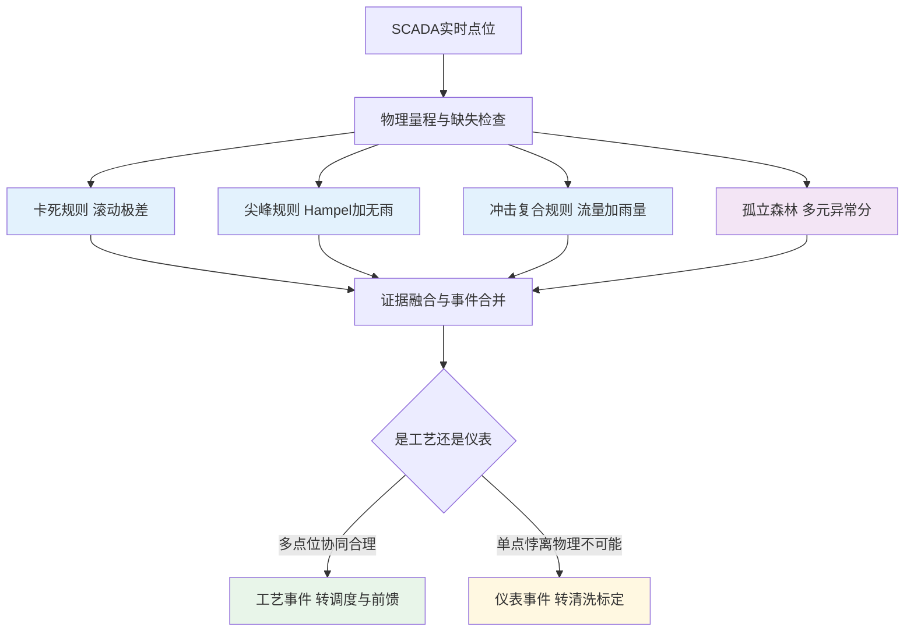
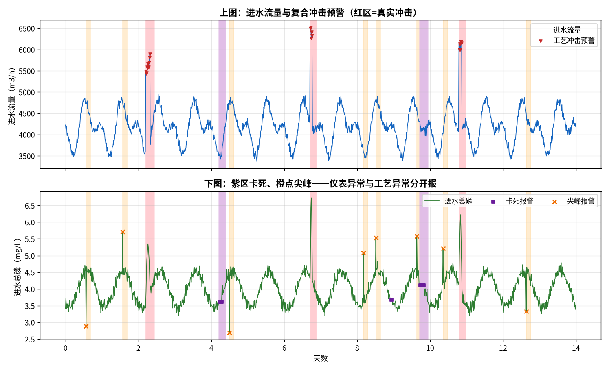

# 06-5 异常检测与工况识别

> 异常检测是五类 AI 能力中**数据门槛最低、却最容易被做错**的一类：门槛低到一个月的历史数据加几条规则就能起步；容易做错在于——大多数系统死于误报轰炸，运行员两周后把报警一静音，真异常和假异常一起被埋掉。
>
> 读完你能：分清工艺异常和仪表异常（它们的处置流向完全不同）；写出卡死、尖峰、进水冲击三类规则；讲清孤立森林在干什么以及为什么只用它打辅助；看懂精确率/召回率的取舍；会设计一套运行员愿意信的报警分级制度；知道工况识别怎么给前馈模型贴标签。
>
> 阅读时间：约 38 分钟。

---

## 一、场景导入：两种死法，方向相反

污水厂的异常有两种极端，都致命：

- **仪表坏了，没人知道**：DO 探头挂膜卡死三周，曲线平得像尺子，调度依据一条假数据做了三周决策；
- **报警太多，没人再看**：阈值设太紧，一天弹 60 条报警，运行员从逐条处理变成全部划掉，直到某天真冲击混在报警海里被略过。

异常检测这门活的全部难度，就是在这两种死法之间找平衡：**既不放过真问题，也不制造报警洪水**。

---

## 二、先分清：工艺异常还是仪表异常

这是异常检测的第一道分叉，因为两者的**处置流向完全相反**：

| 维度 | 工艺异常 | 仪表异常 |
|---|---|---|
| 典型表现 | 进水冲击、污泥膨胀、DO 全线走低 | 卡死、尖峰、漂移、超量程、时序跳变 |
| 数据长什么样 | 多个相关点位**一起**合理变化 | 单点悖离全套点位，或数值物理不可能 |
| 处置方向 | **相信数据**，动作工艺（加药、曝气、调度） | **怀疑数据**，动作仪表（清洗、标定、切手动） |
| 喂给模型吗 | 喂，但要打工况标记 | 不喂，进隔离区或用规则插补 |

把仪表故障误判成工艺冲击，模型会对着假数据猛加药；把工艺冲击误判成仪表故障，真实风险被当脏数据删掉。下游所有模型的命运，在这道分叉上就定了一半。

本章脚本 `scripts/fig06_05_anomaly.py` 在 14 天、15 min 一步的数据上注入三类典型异常，再用**规则 + 孤立森林**分层检测。

| 注入异常 | 点数 | 形态 | 场次 |
|---|---:|---|---|
| 真实进水冲击 | 26 | 流量与 TP 同步抬升约 6 h | 3 场 |
| 仪表卡死 | 20 | 连续 5 h 数值纹丝不动 | 2 段 |
| 仪表尖峰 | 8 | 单点跳变后立刻恢复 | 8 次 |

---

### 2.1 注入异常的代码骨架（真厂换成异常工单台账）

用合成数据做检测算法有个独特好处：**异常的位置和类型完全已知**，精确率召回率可以闭卷考试。真厂评估时，这张『标准答案』由历史异常工单、仪表维修记录和人工复核共同提供，覆盖率通常只有真实异常的一小半，所以真厂指标要比脚本数字打折扣看。

```python
# 卡死：连续一段赋成同一个值
for start, length in [(3*96+20, 20), (8*96+40, 20)]:
    tp[start:start+length] = tp[start-1]
    truth[start:start+length] = "stuck"
# 尖峰：单点跳高，要求落在无雨时段
spike_idx = rng.choice(np.where(rain == 0)[0], size=8, replace=False)
tp[spike_idx] += rng.uniform(0.6, 1.0, 8)
# 冲击：雨量、流量、TP 同步抬升，持续6小时
```

注意冲击必须让**雨量→流量→水质三个量联动**，只改一个量造出来的是假异常，会教坏融合规则。

---

## 三、规则层：三条规则解决七成问题

先上能写进运行规程的规则，它们可解释、零训练、出了错能追责。

### 3.1 卡死检测：滚动极差

仪器真死了的特征是**完全不动**（连噪声都没有）。取连续 4 个点的极差：

$$range_t = \max(x_{t-3:t})-\min(x_{t-3:t})$$

当 `range < 0.01`（mg/L 量级按点位调整）持续若干点，判卡死。脚本实算对两段卡死的召回为 80%（16/20）——边界点因为窗口里还混着正常值而漏判，这是滚动窗规则的固有延迟，属可接受代价。

### 3.2 尖峰检测：Hampel 判据 + 物理条件

不能见大偏差就报（雨天本来就大）。脚本要求三个条件同时满足：

1. 偏离局部中位数的绝对值大于 **5 倍 MAD**；
2. 偏差绝对值大于 **0.40 mg/L**（物理量级门槛，过滤小波动）；
3. 当时**无雨**（排除真实冲击）。

其中 MAD（中位绝对偏差）是抗噪版标准差：

$$MAD = \mathrm{median}\left(|x_i-\mathrm{median}(x)|\right)$$

$$|x_t-\mathrm{median}_{local}| > 5\times1.4826\times MAD$$

1.4826 是把 MAD 换算到正态分布 σ 尺度的常数。用中位数而不是均值，是因为少数异常点不会把基准带跑——这正是它比 3σ 规则适合污水数据的原因。实算 8 个尖峰**全部命中（召回 100%）**。

### 3.3 冲击检测：流量 + 雨量的复合规则

真实冲击必须**水力上说得通**，单变量阈值会把抽水马桶式的干扰误报成冲击：

- 流量 Q 超过其 96 点（24 h）滚动中位数 + **2.5σ**；
- 同一邻域雨量信号 `rain > 0.05`；
- 报警向前后各扩展 3 个点形成事件段，但**报警点本身必须有雨**（扩展只为补全事件边界，不许给无雨点发冲击报警）。

复合条件是误报治理的核心思想：**单个指标越界只是『可疑』，多个独立证据同时成立才叫『事件』**。实算 26 个冲击点命中 23 个，召回 **88%**，漏掉的是 3 个雨尾边界点。

---

## 四、无监督层：孤立森林打辅助

规则覆盖的是人能想明白的异常形态。想不明白的组合异常（比如 Q 正常、TP 正常、DO 正常，但三者的组合关系很别扭），交给无监督方法。

孤立森林（IsolationForest）的直觉：随机选特征、随机切一刀，反复切分样本空间。**正常点扎堆，要切很多刀才被隔离；异常点本来就偏远，几刀就被单独切出来**。树只需要 200 棵，连标签都不要。

脚本要点：

```python
from sklearn.ensemble import IsolationForest
iso = IsolationForest(n_estimators=200, contamination=0.02, random_state=42)
iso.fit(X_train.iloc[:7*96])      # 只用前7天的干净（注入前）数据训练
```

- **只用无异常的前 7 天训练**：无监督不等于不挑食，训练窗里混着真异常，基准就被污染；
- `contamination=0.02`：告诉模型数据里约有 2% 的异常比例，是先验不是结论——真厂从『异常工单率』反估，没有工单时从 1% 起步，按误报量调；
- 输入给多元向量（Q、TP、DO、投加量、雨量等），让它发现单点规则发现不了的关系异常。

---

## 五、分层融合与实算结果

整体流程：规则先行、可解释的先判；规则没覆盖的再交给孤立森林；最后做事件合并和报警分级。





*数据为合成/典型参数实算：14 天 TP 与流量序列，标注注入的冲击（粉）、卡死（紫）、尖峰（橙）及综合检测命中点。脚本：`scripts/fig06_05_anomaly.py`。*

点级实算结果：

| 指标 | 数值 |
|---|---|
| 正确命中 TP（True Positive） | **47** |
| 误报 FP | **1** |
| 漏报 FN | **7** |
| 精确率（命中里有多少是真的） | **97.9%** |
| 召回率（真的里抓到多少） | **87.0%** |
| 正常点误报率 | **0.08%（1/1290）** |

分类别看：卡死 80%（16/20）、尖峰 100%（8/8）、冲击 88%（23/26）。

这组数字体现了设计取舍：**精确率优先于召回率**。在报警系统里，一个 97.9% 精确率、每天几乎不误报的系统，运行员才会认真对待每一条报警；用漏掉少量边界点换这份信任，是划算的。漏掉的 7 个点全部靠事件级手段兜底——单点没报，但同一场冲击的邻近点报了，事件并没有丢。

> ⚠️ **老工程师的坑**：精确率和召回率永远要结合**报出来之后谁处理、怎么处理**一起定。仪表异常报警发给仪表班、允许较低精确率（清洗探头成本低）；工艺冲击自动联动加药的，误报一次就白扔药剂、磨损设备，精确率必须拉到 95% 以上再允许自动动作，否则先只发提示。

---

### 5.1 融合层的代码骨架

融合不是把两类报警简单相加，而是**规则优先定性、IF 只补充、最后限频**：

```python
stuck_alarm = roll_range < 0.01
spike_alarm = (np.abs(dev) > 5*1.4826*mad) & (np.abs(dev) > 0.40) & (rain == 0)
shock_alarm = (Q > Q.rolling(96).median() + 2.5*Q.rolling(96).std()) & (rain > 0.05)
iso_alarm = iso.predict(X) == -1
# 规则能定性的直接定性；规则沉默而 IF 报警的，只标“嫌疑”，不自动派单
alarm = np.where(stuck_alarm, "stuck",
        np.where(spike_alarm, "spike",
        np.where(shock_alarm, "shock",
        np.where(iso_alarm, "suspect", "normal"))))
```

布尔数组合并时用 `a & b` 重新赋值而不是原地 `&=`，是 pandas/numpy 数组可能只读时的避坑写法；统计指标前记得 `.fillna(False)`，否则滚动窗边界的缺失值会被误当成报警。

---

## 六、为什么不能只靠孤立森林

新手容易犯的错：规则全删掉，上一个 IF 包打天下。三个理由说明为什么规则必须留：

1. **IF 给不出『为什么』**：它只说这个点异常分高，说不清是卡死还是冲击，运行员拿到两个字没法派工单；规则报警天然带原因（『TP 连续 4 点极差 <0.01』）；
2. **contamination 是硬先验**：真实异常率随季节变，梅雨季和旱季用同一个 2%，必然一季误报一季漏报；规则没有这个包袱；
3. **IF 对『持续型缓慢异常』不敏感**：漂移是几周内慢慢偏掉的，每个点相对周围都不算孤立，反而是滚动极差/斜率规则的菜。

实战分工一句话：**规则查已知形态，IF 查未知组合；规则当法官（能直接派单），IF 当线人（只提供嫌疑分，需规则或人工确认）。**

---

## 七、工况识别：给每段数据贴上天气标签

异常检测回答『现在正不正常』，工况识别回答『现在是什么工况』。后者常用 **KMeans 聚类**（无监督，把特征相近的时段聚成 K 簇），加药项目典型聚成 4 类：

| 工况簇 | 数据特征 | 对模型的意义 |
|---|---|---|
| 晴天稳态 | Q 平稳、雨=0、TP 波动小 | 主模型最准的区间（06-3 晴天 MAE 33.2） |
| 雨天/合流 | Q 抬升、雨>0、浓度先冲后被稀释 | 切换机理前馈 + 大余量 |
| 冲击恢复 | 雨后 2~6 h 各指标回落中 | 减量要慢，防二次冲击 |
| 夜间低负荷 | Q 低、周期特征明显 | 防过量，余量可收窄 |

聚类本身不追求『分得多学术』，标准只有一个：**分出来的簇，投加策略是不是真的应该不同**。聚完必须让工艺人员给每个簇命名并确认，业务上说不出差别的簇要合并。工况标签有两个去向：作为 06-3 模型的输入特征，以及作为切换不同安全余量/不同模型的开关（06-6、07 篇）。

> 💡 **现场经验**：先别急着上 KMeans。大多数厂用『雨量 + Q 分位数 + 时刻』三条规则就能分出上述四簇，效果不输给聚类，还能解释。聚类的价值出现在**进水组成复杂、晴雨天之外还有工业偷排型冲击**的厂——当规则分不出第五类、而这类时段模型残差系统性偏大时，再让聚类上场。

---

## 八、报警怎么发，运行员才不会静音

检测准只是上半场，报警被正确响应才算闭环。四条设计原则：

1. **事件化，不点化**：连续异常点合并成一个事件报一次，不在 2 h 里推 20 条；脚本的邻域扩展就是这个作用；
2. **分级**：提示（只记录）/预警（班组确认）/告警（联动 + 电话），低级别默认不响铃；
3. **每条报警带证据和建议**：『TP 卡死 5 点极差 0.002，建议检查探头清洗』比『TP 异常』可用十倍；
4. **必须有确认与关闭动作**：报警→工单→处置→关闭→回填标注，回填的标签又成为下季度调阈值和训练 IF 的燃料。

上线节奏建议：前两周只记录不考核，统计每条规则的真实误报率；第三周起分级推送；每月一次误报/漏报复盘，阈值只做小步调。这样养出来的系统，一年后精确率仍能维持在高位——而运动式上线的报警系统通常活不过三个月。

---

## 九、公式、符号与指标汇总

| 符号/指标 | 含义 | 单位/口径 | 本算例取值 |
|---|---|---|---|
| x_t | 被监测点位读数 | 按点位（mg/L、m³/h） | — |
| range_t | 4 点滚动极差 | 同 x | 卡死阈值 0.01 |
| MAD | 中位绝对偏差 | 同 x | 尖峰阈值 5 倍 MAD |
| σ_Q | 流量滚动标准差 | m³/h | 冲击阈值 中位数+2.5σ |
| TP | 正确命中点数 | 个 | 47 |
| FP / FN | 误报 / 漏报 | 个 | 1 / 7 |
| 精确率 | TP/(TP+FP) | % | 97.9 |
| 召回率 | TP/(TP+FN) | % | 87.0 |

两个比率回答两个不同问题：**精确率 = 报出来的有多可信，召回率 = 真异常抓得全不全**。报警联动工艺动作时偏精确率，纯事后排查类场景（如仪表班巡检清单）可偏召回率。

---

## 本章小结

1. 先分叉：**工艺异常信数据动工艺，仪表异常疑数据动仪表**；14 天合成数据注入冲击 26 点、卡死 20 点、尖峰 8 点。
2. 三条规则：**卡死看 4 点滚动极差（<0.01）、尖峰看 5×MAD 且偏差 >0.40 且无雨、冲击看流量超中位数 2.5σ 且有雨**；多证据同时成立才升级为事件。
3. 孤立森林用干净前 7 天训练（200 树、contamination 0.02），当线人不当法官；对缓慢漂移不敏感，规则不可删。
4. 综合实算：命中 47、误报 1、漏报 7，**精确率 97.9%、召回率 87.0%、正常点误报率 0.08%**；卡死 80%、尖峰 100%、冲击 88%，取舍是精确率优先。
5. 工况识别先用规则（晴/雨/恢复/夜间），复杂进水再上 KMeans，簇必须能对应到不同投加策略才有意义。
6. 报警要**事件化、分级、带证据建议、有确认闭环**；下一章把机理与数据合成一体：灰箱混合模型。

---

上一章：[06-4 出水指标预测与软测量建模](./06-4-出水指标预测与软测量建模.md)
｜下一章：[06-6 机理加数据：灰箱混合模型最落地](./06-6-机理加数据-灰箱混合模型最落地.md)
