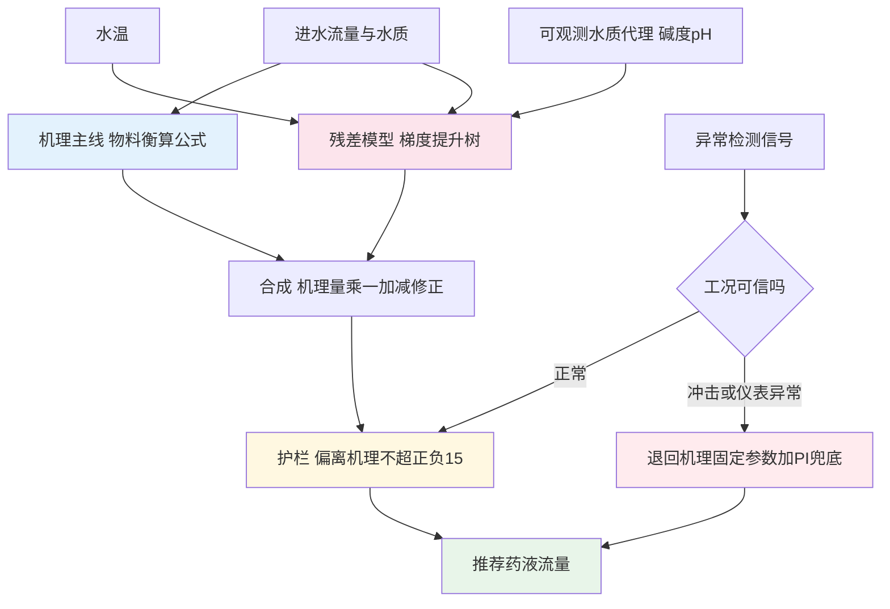
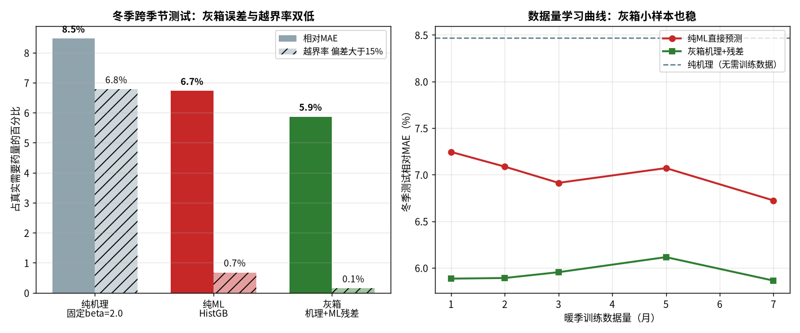

# 06-6 机理加数据：灰箱混合模型最落地

> 如果只能给污水厂推荐一种 AI 建模结构，答案是**灰箱**：物料衡算公式当骨架，数据模型当修正器，护栏和异常退回兜底。它牺牲一点点极限精度，换来跨季节不崩、越界可拦、运行员听得懂——这三样正是纯黑箱模型上线后最容易丢的东西。
>
> 读完你能：说白箱、黑箱、灰箱三种结构的差别；用一个冬季跨季节实算看清纯数据模型为什么会在没见过的工况下失手；掌握灰箱『机理主线 + 残差学习 + ±15% 护栏 + 异常退回』的完整构造；理解季节周期特征在树模型里为什么反而是陷阱。
>
> 阅读时间：约 38 分钟。

---

## 一、场景导入：夏天的冠军，冬天的差生

06-3 的模型测试段虽放在秋冬，但合成数据里冬夏差异还算温和。真实项目更常见的剧本是：模型用 4~10 月的数据开发，离线指标优秀，11 月上线，12 月水温掉到 10 ℃以下开始悄悄欠投，等到一月份出水 TP 连续越限，厂家还在远程『排查数据质量』——运行员一句话总结：**它没见过冬天。**

这不是调参能解决的，是模型结构问题。本章用一个故意刁难的算例把三种结构放在同一个冬天里考试。

---

## 二、三种结构：白箱、黑箱、灰箱

| 结构 | 做法 | 优点 | 弱点 | 典型代表 |
|---|---|---|---|---|
| 白箱（机理） | 全部按物料衡算公式算 | 可解释、零训练、天然外推 | 参数（如 β）漂移时系统性偏差 | 04 篇全套公式 |
| 黑箱（纯数据） | 特征直接喂模型出结果 | 拟合能力强、能抓未知规律 | 没见过的工况外推生硬、难解释 | 06-3 的 HistGB 直接预测 |
| **灰箱（混合）** | **机理出主线，数据只学修正量，外加护栏** | **外推有底、误差有顶、可解释** | 结构稍复杂，要维护两套逻辑 | 本章主推 |

灰箱的核心思想一句话：**让模型回答『机理公式今天需要修正百分之几』，而不是让它从零猜该投多少。**



---

## 三、实算设置：把模型逼到没见过的冬天

脚本 `scripts/fig06_06_hybrid.py` 用一年 15 min 数据，时序从 4 月起算，刻意制造训练/测试的季节断层：

| 数据集 | 行数 | 时间 | 水温 |
|---|---:|---|---|
| 训练 | **20 544** | 4~10 月 | **15~28 ℃** |
| 冬季测试 | **14 400** | 11 月~次年 1 月 | **8~15 ℃** |

关键刁难有两个：

1. **真实 β 随水温走低而升高**，冬季测试段 β 均值 **2.169**，而白箱模型仍按固定 β=2.0 计算——这是现场最常见的机理失配（低温反应慢、药剂效能下降，需要更高投加比）；
2. 冬季测试段注入 **10 场合流制初雨冲击**（Q 放大 1.5~1.8 倍、TP 冲到 6~8 mg/L），这种『低温 + 初雨』组合**训练数据里一次都没有**。

三个考生：

- **纯机理**：固定 β=2.0，无任何数据修正；
- **纯 ML**：HistGB 用 Q、TP_in、水温、水质代理直接预测药液流量；
- **灰箱**：机理公式出主线 D_mech，另一个 HistGB 学修正系数 δ，最终 D = D_mech×(1+δ)，护栏限制 δ∈[−15%, +15%]；异常检测触发时整个 ML 支路断开。

---

### 3.1 灰箱的训练代码骨架

灰箱训练和普通监督学习唯一的区别：**模型拟合的是比值修正量，不是投加量本身**。

```python
# 1) 机理主线：固定 beta 先算一遍
D_mech = Q*(tp_in-0.30)/1000*(27/31)*2.0/0.1535/0.10/1.1
# 2) 只在“恰好投好”时段构造残差标签（出水TP 0.20~0.30）
delta_true = d.loc[good, "dose_actual"]/d.loc[good, "D_mech"] - 1.0
# 3) 残差模型：物理可测量，不使用 doy
feat = ["temp","qobs","Q","tp_in","hour_sin","hour_cos"]
res = HistGradientBoostingRegressor(min_samples_leaf=40,
                                    random_state=42).fit(Xtr[feat], delta_true)
# 4) 合成 + 护栏
delta = np.clip(res.predict(Xte[feat]), -0.15, 0.15)
D_out = np.clip(D_mech_te*(1+delta), D_mech_te*0.85, D_mech_te*1.15)
```

`min_samples_leaf=40` 刻意调大，让残差模型只学稳定的慢变规律、不去追逐单场雨的个例——快变的冲击交给异常退回处理，分工不重叠。

---

## 四、一个反常识的坑：季节特征不能用 doy

直觉上，把『一年中的第几天（doy）』编码成 sin/cos 喂给模型，它不就学会季节了吗？开发时确实在训练集上发现这能降误差——**但它是陷阱**。

原因在树模型的工作方式：树按特征阈值把数据分成不同叶子。训练集的 doy 只覆盖 4~10 月（角度的一段），冬季 doy 落到**训练范围之外**，树在这个区域没有任何经验，却会硬把它归到『最像』的某个边界叶子上，给出一个不相关的预测。更糟的是 doy 与水温高度相关，模型会偷懒主要靠 doy 分裂，冬季水温信息反而被弱化。脚本实测：含 doy 特征的灰箱冬季残差明显恶化，去掉后才稳定。

正确替代：

- 用**当下物理可测的量**表达季节——**水温本身**就是最好的季节编码，它是因，doy 只是代理；
- 再加一个**可观测水质代理 qobs**（脚本中为碱度/pH 的带噪综合代理，噪声水平 0.15），它间接反映进水组成与混凝条件；
- 原则：**特征必须是模型上线那一刻可测的物理量，而不是日历上的位置**。日历位置对机理参数化或许有用（如调度预案），但不该进树的分裂条件。

> ⚠️ **老工程师的坑**：判断一个周期特征该不该进模型，问一句：『训练数据的这个特征，取值范围覆盖上线后的所有取值了吗？』hour sin/cos 每天完整循环、一周就能覆盖全部取值，安全；doy 要一整年才循环，而多数项目等不到完整一年再上线——**覆盖不全的周期编码，就是给外推埋雷**。

---

## 五、冬季大考：三模型实算对比

冬季测试集（14 400 行，含 10 场初雨）实算：

| 模型 | MAE（L/h） | 相对 MAE | 平均偏差 | 欠投超 5% 时段占比 | 推荐越界率 |
|---|---:|---:|---:|---:|---:|
| 纯机理（β=2.0） | 150 | 8.5% | **−7.7%** | **70.3%** | 6.8% |
| 纯 ML | 119 | 6.7% | −6.7% | 67.8% | 0.7% |
| **灰箱** | **104** | **5.9%** | **−5.8%** | **68.7%** | **0.1%** |



*数据为合成/典型参数实算：左为冬季测试段三模型误差与偏差，右为随训练数据量增长的学习曲线（冬季相对 MAE）。脚本：`scripts/fig06_06_hybrid.py`。*

逐行读：

1. **纯机理输在系统性欠投**：平均偏差 −7.7%（推荐普遍偏小），70.3% 的时段欠投超过 5%——根子就是 β 还停在 2.0 而冬天实际要 2.169；越界率 6.8% 全发生在初雨冲击时，固定参数对冲击毫无反应；
2. **纯 ML 晴天时最聪明**：相对 MAE 6.7% 比机理好不少，日常时段它从数据里学到了水温的影响；但平均偏差仍 −6.7%，说明冬季整体修正幅度不够——训练时最冷水温 15 ℃，它不知道 8 ℃的世界；初雨时树模型外推到边界叶子，靠运气；
3. **灰箱赢得最稳**：MAE 104、相对误差 5.9%、越界率仅 0.1%。机理保证了『大体不会错』，残差模型在日常时段把 8.5% 修到 5.9%，护栏保证修正再离谱也偏不出 15%，异常时直接退回机理——**它可能不是每一刻最准的，但它在最坏时刻最不危险**。

### 5.1 学习曲线：数据越多，灰箱越早摸到天花板

用训练集前 1/2/3/5/7 个月分别训练，冬季测试相对 MAE：

| 训练时长 | 纯 ML | 灰箱 |
|---|---:|---:|
| 1 个月 | 7.2% | **5.9%** |
| 2 个月 | 7.1% | **5.9%** |
| 3 个月 | 6.9% | **6.0%** |
| 5 个月 | 7.1% | **6.1%** |
| 7 个月 | 6.7% | **5.9%** |
| 纯机理（水平线） | 8.5% | 8.5% |

两条曲线的形状比数值更重要：

- **纯 ML 的误差不随数据量单调改善**（7.1→6.9→7.1→6.7），因为增加的都是相似季节的数据，补的是数量不是覆盖面；模型早早就『学完了它能见到的世界』；
- **灰箱第一个月就到位**（5.9% 上下浮动），因为机理主线先验地给了 80% 的正确答案，残差模型只需学一个小幅修正，小样本就够。

对落地的含义直接而重要：**灰箱项目的数据冷启动门槛低得多**——没有一整年历史数据的厂，用 1~2 个月干净数据也能起步；纯黑箱则最好等跨完一个完整季节再谈上线。

> 💡 **现场经验**：选型讨论时可以把这张学习曲线讲给厂长听：纯 AI 模型像一个没在北方过过冬的年轻工程师，数据（经验）不够时心里没底；灰箱像老工程师带年轻人——老工程师的公式保证大方向，年轻人负责根据现场微调，师傅还盯着他『最多改 15%』，遇上没见过的情况师傅立刻接手。这样的系统，班组才敢用。

---

### 5.2 为什么三家的平均偏差都是负的

三个模型平均偏差全为负（推荐偏小），这不奇怪：测试段整体比训练/参数设定更『难』（低温 + β 升高 + 初雨），任何只用过去信息的系统都会欠一点。差别在于程度：机理 −7.7%、纯 ML −6.7%、灰箱 −5.8%。

加药场景里偏差方向是有风险偏好的：**欠投直接威胁达标，过量只浪费钱**。因此灰箱落地时常把残差输出整体抬高一个安全偏置（如 δ 加 0.02~0.03），或像 06-3 那样乘 1.08 安全余量，使平均偏差回到 −3% 以内、分布略偏保守。偏置大小不拍脑袋，由影子运行期间『出水 TP 距 0.30 限值的最小统计裕度』反推。

---

## 六、护栏与异常退回：灰箱的安全带

### 6.1 ±15% 护栏怎么来

$$D_{out}=\mathrm{clip}\!\left(D_{mech}\times(1+\delta),\ 0.85\,D_{mech},\ 1.15\,D_{mech}\right)$$

15% 不是神秘数字，它来自两层考虑：现场除磷投加的正常调节余地（06-1 给出的节药空间 15%~30% 意味着日常修正十几个百分点就够覆盖大多数偏差），以及运行员心理可接受的『AI 让我改多少』上限——超过 ±15% 的建议需要更强证据，不如先报警让人确认。不同厂可以按泵调节能力和药剂响应试验调整为 ±10%~±20%，但**必须有界**。

护栏的直接效果在表里：纯 ML 越界率 0.7%、灰箱 0.1%——那 0.1% 还是限幅边界在极端冲击下的残余，而机理裸奔时是 6.8%。

### 6.2 异常退回机制

接 06-5 的异常检测，三种信号触发 ML 支路断开：

| 触发信号 | 含义 | 退回动作 |
|---|---|---|
| 关键输入仪表异常（卡死/尖峰） | 残差模型输入不可信 | 冻结最近一次可靠 δ，机理主线运行 |
| 进水冲击复合报警 | 进入训练未见工况 | δ 归零，按机理 + 预设冲击余量（如 β 上调 10%~20%） |
| 模型自检异常（输出突变超阈） | 模型本身可能失稳 | 切 PI 反馈控制，以出水 TP 实测为目标微调 |

退回不是故障，而是**设计内的正常工作模式**。HMI 上应明确显示当前处于『AI 增强 / 机理兜底 / PI 手动』哪种模式，并记录每次退回的起止时刻——这些记录同时是下季度模型迭代的工况清单。

---

### 6.3 退回记录是最值钱的训练素材

每次异常退回都在回答一个问题：『模型在哪些工况下不敢信自己？』把这些时段集中起来复盘，会发现 80% 的退回集中在两三类工况（初雨头半小时、某泵站切换、低温加寒潮）。这些时段就是下一版模型要补的课：给它们找机理预案、补传感器（如管网雨量计）或在下一轮训练中定向加权。模型迭代不是无差别地收集更多数据，而是**顺着退回记录去买信息、补工况**——这也回应了 06-2 的结论：提升主要靠补信息，不靠堆复杂度。

---

## 七、自己搭一个灰箱：六步清单

1. **选定机理主线**：除磷用 04 篇 Al/P 物料衡算，碳源用反硝化速率公式，确保公式在『参数中等』时方向正确；
2. **定义残差**：在历史『恰好投好』时段（06-3 第 9.3 节五步法）计算 δ_true = D_actual/D_mech − 1，检查 δ 是否大部分落在 ±15% 内——若普遍超 ±30%，说明机理本身有误，先修机理而不是上模型；
3. **训练残差模型**：特征只用水温、可观测水质代理、Q 等可测物理量，**不放 doy**；标签是 δ_true；
4. **加护栏与限幅**：δ 截断到 ±15%，输出再叠加泵量程上下限和变化速率限制（07 篇）；
5. **按最恶劣季节做测试**：测试段必须包含训练没覆盖的温度段和至少几场雨，不要只测顺境；
6. **接异常退回**：与 06-5 的报警系统打通，定义三种触发与对应退回动作，HMI 模式可见。

---

## 八、灰箱落地的三个常见疑问

**问 1：护栏 ±15% 频繁被打满，说明什么？**
说明机理主线已经失配，不是把护栏放宽就能解决。先查 β 标定是否过期、进水组成是否发生长期变化（如接管了新工业源）；若打满方向持续一致超过一两周，应重新标定机理参数，而不是让模型长期贴着护栏工作——那样灰箱退化成了黑箱。

**问 2：残差 δ 出现与常识相反的方向怎么办？**
和 06-3 的 PDP 政审一样，δ 对水温的部分依赖必须单调（低温加量）。方向反了优先查标签：『恰好投好』时段筛选是否过宽、投加量计量是否准确。机理可解释的一大红利就是这类错误很容易被发现——纯黑箱里它会藏到上线之后。

**问 3：多药剂（除磷 PAC + 碳源 + PAM）能一起做灰箱吗？**
可以但不要一锅烩。药剂之间耦合最紧的是 PAC 与曝气/碳源（化学污泥影响生物段），稳妥顺序是**先各自单回路灰箱跑稳，再在 06-1 能力③的多目标优化层做回路间协同**，每一步都能独立验收、独立回退。

---

## 九、公式、符号与单位

| 符号 | 含义 | 单位 | 本算例取值 |
|---|---|---|---|
| D_mech | 机理主线药液流量 | L/h | β 固定 2.0 算出 |
| β | 实际 Al/P 摩尔比 | mol/mol | 冬季真值均 2.169，机理取 2.0 |
| δ | 残差模型输出的修正比例 | — | 护栏限制在 ±0.15 |
| qobs | 可观测水质代理（碱度/pH 综合） | 标度量 | 噪声 0.15 |
| T | 水温 | ℃ | 训练 15~28，测试 8~15 |
| D_out | 最终推荐药液流量 | L/h | 限幅合成结果 |

灰箱合成与护栏：

$$\delta = f_{ML}(T,\ qobs,\ Q,\ TP_{in}),\qquad D_{hyb}=D_{mech}(1+\delta)$$

$$D_{out}=\min\!\left(1.15\,D_{mech},\ \max(0.85\,D_{mech},\ D_{hyb})\right)$$

异常退回时 δ 置 0 并调用冲击预案 β_storm = 1.1~1.2 β_normal。

---

## 本章小结

1. **白箱可解释但参数会漂移，黑箱拟合强但外推生硬，灰箱让数据只学机理修正量**——污水厂最落地的结构。
2. 冬季大考（训练水温 15~28 ℃、测试 8~15 ℃、β 真值 2.169、10 场初雨）：纯机理 150 L/h、欠投 70.3%、越界 6.8%；纯 ML 119、越界 0.7%；**灰箱 104（5.9%）、偏差 −5.8%、越界仅 0.1%**。
3. 学习曲线：灰箱**1 个月数据就到 5.9%**，纯 ML 七个月还在 6.7%~7.2% 徘徊——灰箱冷启动门槛低。
4. **doy 周期特征是树模型陷阱**（冬季取值在训练范围外被引到错误叶子），用水温和可观测水质代理代替；小时特征因每天完整覆盖而安全。
5. 安全带：**±15% 护栏**给误差封顶，异常检测触发时**冻结/归零 δ，退回机理 + 冲击余量或 PI**，退回是设计内的正常模式。
6. 下一章讲模型怎么上线：影子运行、监控与迭代。

---

上一章：[06-5 异常检测与工况识别](./06-5-异常检测与工况识别.md)
｜下一章：[06-7 模型上线监控与迭代运维](./06-7-模型上线监控与迭代运维.md)
