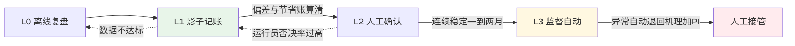
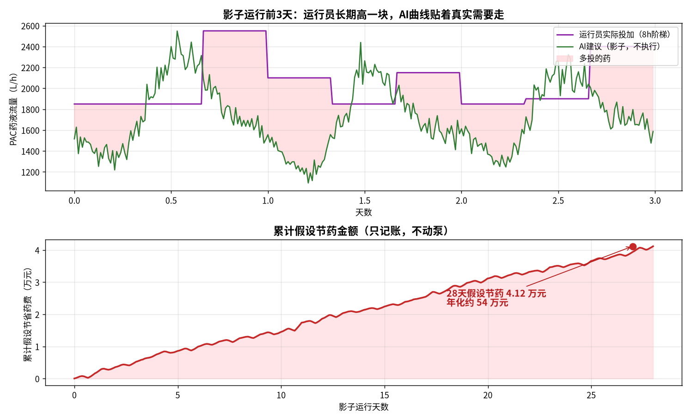

# 06-7 模型上线监控与迭代运维

> 模型验收通过的那一刻，项目只完成了一半。水质在变、季节在变、泵在老化、仪表在漂移——**模型不是交付物，而是一种需要持续喂养和体检的运行设备**。本章讲它上线的四种形态、影子运行的算账方法、三层监控体系、再训练触发规则，以及一个没有数据团队的厂怎么从零冷启动。
>
> 读完你能：说出离线、影子、建议、监督自动四种上线形态的边界与前提；读懂一份 28 天影子运行报告并判断能不能转闭环；搭起数据层/模型层/业务层三层监控；定下再训练的周期与事件触发器；排出本厂的 6 个月落地路线图和分工。
>
> 阅读时间：约 38 分钟。

---

## 一、场景导入：验收那天是模型状态最好的一天

很多项目的生命周期是这样的：离线测试 R² 0.98，验收会皆大欢喜，供应商撤场，系统挂在屏上；三个月后没人再看它，半年后运行员回到手抄报表，一年后设备采购清单里又多了一个『AI 优化系统』。

死因惊人地一致：**没有监控，没有迭代，没人对模型上线后的表现负责**。模型不是阀门——阀门装上去十年特性基本不变，而模型面对的是不断漂移的数据分布，它必须像二沉池刮泥机一样被定期巡检维护，否则必然慢慢失效，而且失效是静悄悄的（06-5 的卡死仪表有多安静，模型漂移就有多安静）。

---

## 二、上线的四种形态：步子越小，活得越久

| 形态 | 模型干什么 | 谁执行 | 前提 | 风险等级 |
|---|---|---|---|---|
| L0 离线分析 | 出报表、做事后复盘 | 不参与运行 | 干净的历史数据 | 无 |
| L1 影子运行 | 实时算建议但**只记账不动泵** | 运行员照常操作 | 实时数据流打通 | 无（本章实算阶段） |
| L2 建议闭环 | 推荐值推到 HMI，运行员确认后执行 | 人确认、泵执行 | 影子期达标、班组培训 | 低 |
| L3 监督自动 | 前馈建议直接驱动泵，人监督并可随时接管 | 泵自动执行 | L2 稳定 1~2 月 + 完整护栏联锁 | 中 |
| L4 全自动 | 多回路协同自动，无人介入 | 系统 | 本书不推荐作为加药目标 | 高 |

本书的定位：除磷/碳源加药做到 **L3 监督自动**封顶——动作由系统执行，责任与接管权留在人手里。从 L1 到 L3 没有固定时间表，每一级的晋升都由数据说话，而不是由合同节点说话。

图里两条退回箭头和晋升箭头一样重要：**允许降级**的系统才敢升级。L2 阶段运行员否决率长期超过 15%，说明模型或信任培养有问题，退回 L1 找原因，而不是硬推。

---

## 三、影子运行：28 天的账怎么算

### 3.1 影子运行的三条纪律

1. **同一时刻、同样数据**：模型和运行员看到完全相同的实时数据，模型不得偷看化验结果或未来值；
2. **只记账不动泵**：AI 建议写入独立日志，不进任何控制回路；
3. **平行记两本账**：运行员实际投加量（有流量计）与 AI 建议量各自累计，出水 TP 是共同的结果标尺。

脚本 `scripts/fig06_07_shadow.py` 模拟 28 天、15 min 一步的影子期。运行员行为按现场典型习惯合成：8 h 一个调节台阶，每块在真实需要上放大 1.15~1.25 倍；另有 8 个『慌张块』（见到波动就宁多勿少）放大 1.35~1.55 倍。

### 3.2 实算结果

*数据为合成/典型参数实算：上为前 3 天运行员实际投加（8h 台阶）与 AI 影子建议曲线及多投区域；下为 28 天累计假设节药金额。脚本：`scripts/fig06_07_shadow.py`。*

| 指标 | 数值 | 读法 |
|---|---:|---|
| 运行员平均投加 | **2029 L/h** | 8h 台阶 + 安全放大 |
| AI 平均建议 | **1750 L/h** | 贴着真实需要走 |
| 运行员平均偏高 | **15.9%** | 与 06-3 标签陷阱中 19.7% 的过量量级一致 |
| 人机偏差 >10% 的时段占比 | **86.8%** | 绝大多数时段两者存在实质差异，对照有意义 |
| AI 建议高于人工的时段占比 | **26.0%** | AI 不是一味少投，约四分之一时间它要求加药 |

最后一行是信任的关键证据。如果 AI 永远比人投得少，运行员会合理怀疑它只是『省药开关』；26% 的时段 AI 反而更保守（多在负荷爬升快、台阶来不及跟的时段），说明模型学的是**双向纠偏**，这正是 8h 人工台阶的盲区。

### 3.3 折算成钱

干粉按 15 min 一步、10% 药液（密度 1.1 kg/L）折算，单价 2000 元/t：

| 账目 | 28 天实算 |
|---|---:|
| 运行员实际干粉 | **150.0 t** |
| AI 建议干粉 | **129.4 t** |
| 假设节省 | **20.6 t ≈ 4.12 万元** |
| 节省比例 | **13.7%** |
| 年化推算 | **约 268 t、54 万元** |

注意三个用词：**『假设』节省、『推算』年化**。影子期 AI 没有真的执行，出水达标仍是运行员投加的结果，所以这叫假设节省；28 天也不代表全年（季节、雨型都不同），年化只用于投资决策的量级判断，合同效益指标必须在 L2/L3 阶段用 [08-5](../08-落地实施篇/08-5-节能率怎么算-效益测量与验证MV.md) 的 M&V 方法实测。

> ⚠️ **老工程师的坑**：影子期最常见的假账是『拿 AI 曲线和运行员曲线直接比面积』。如果影子期正好是低负荷晴天月，13.7% 会高估；赶上雨季又会低估。正确做法：影子期至少跨越不同工况（最好 4 周以上且含 1~2 场明显降雨），并像 06-3 那样分工况出报告——晴天省多少、雨天谁更保守，分开看才敢签字。

---

### 3.4 影子期结束，什么数据允许转 L2

影子期不是『熬够 28 天』就自动毕业，转 L2 前逐项打勾：

| 检查项 | 通过门槛（经验值） | 本算例对应数字 |
|---|---|---|
| 覆盖工况 | 至少含 1~2 场明显降雨，跨周末/工作日 | 合成期含雨段（真厂以实际为准） |
| 偏差显著性 | 人机偏差 >10% 时段占多数，对照不是走过场 | 86.8% |
| 双向性 | AI 存在高于人工的实质时段，不是单向省药开关 | 26.0% |
| 模型误差 | 相对 MAE <5%（06-3 门槛沿用） | 影子建议沿自灰箱模型 |
| 安全侧 | 影子期假设 AI 执行时，出水越限点不增加 | 与运行员账本对照核查 |
| 班组接受度 | 运行员能复述 AI 建议的依据，无系统性抵触 | 培训 + 座谈记录 |

任一项不过，延长影子期或回到前一级——**宁可晚上线一个月，不要让运行员在第一周就抓住模型的一次愚蠢错误**；信任一旦在班组破产，重建要按季度计。

---

## 四、三层监控：给模型建一套体检制度

模型上线后要同时监控三层，每层的告警含义和责任人不同。

### 4.1 数据层：输入分布漂移（PSI）

模型只在熟悉的数据范围内可靠。用 **PSI（群体稳定性指数）** 衡量当前输入分布相对训练分布的漂移：

$$PSI=\sum_{i}\left(p_i-a_i\right)\ln\frac{p_i}{a_i}$$

p_i 为当前数据在第 i 个分箱的占比，a_i 为训练时的占比（分箱沿用训练集边界）。

| PSI 区间 | 含义 | 动作 |
|---|---|---|
| < 0.10 | 稳定 | 常规记录 |
| 0.10~0.25 | 轻度漂移 | 加密观察，排查仪表/季节 |
| > 0.25 | 显著漂移 | **告警并评估再训练**，残差层同步核查 |

每个关键输入（Q、TP_in、水温）单独算 PSI，按周滚动。数据层异常多数时候不是工艺变了，而是**仪表坏了或标定变了**——先查设备再怀疑世界。

### 4.2 模型层：残差监控

当真实结果可获得时（出水 TP 化验/在线值回流后），监控预测残差：

| 监控量 | 计算 | 异常信号 |
|---|---|---|
| 残差均值 | mean(y−ŷ)，按 7 天滚动 | 持续单向偏移 > 阈值（如 0.03 mg/L）= 系统性偏差 |
| 残差离散 | 滚动 RMSE/MAE | 较上线基线放大 >30% |
| 分组残差 | 按工况/班次/季节分组 | 某一组单独恶化（如只剩雨天不准） |
| 输入覆盖率 | 输入落在训练范围内的比例 | 连续出现超范围点（外推预警） |

残差均值是最灵敏的单一指标：模型不会突然全面崩溃，它通常先悄悄偏一个方向，几周后才体现在达标率上。06-6 冬季 −7.7% 的偏差如果发生在真厂，残差监控在降温头一两周就该报警。

### 4.3 业务层：KPI 监控

最终对厂长负责的指标：单位水量药耗（g/m³）、出水 TP 均值与 P95、达标率、越限时长、泵调节频次、运行员否决率（L2 阶段）。业务层指标不受算法人员控制，也不会被技术术语粉饰——**三层里任何两层报警可以讨论，业务层恶化必须响应**。

> 💡 **现场经验**：把三层监控浓缩成一张『模型健康周报』，半张 A4：本周 PSI 红绿灯、残差均值趋势、药耗与达标率、否决率、退回机理次数。厂长看得懂、班组记得住。监控系统最忌讳几十个指标的仪表盘——指标太多的终点是没人看。

---

### 4.4 三层联动长什么样：一次典型报警

某厂降温季的一次真实处置链（合成示例，逻辑可照搬）：

1. **周一 09:00 数据层**：水温 PSI 升至 0.21（黄灯），Q、TP_in 正常——先怀疑季节变化而非仪表，挂观察；
2. **周三 08:00 模型层**：残差均值连续 3 天负偏（推荐偏小），幅度触阈；分组残差显示低温段单独恶化；
3. **周三 10:00 业务层**：出水 TP 均值较上周抬 0.03 mg/L，尚未越限但裕度收窄；
4. **动作**：灰箱安全偏置临时上调（−3% 偏差收回），同时启动季节再训练，用秋季数据微调残差层；
5. **周五**：新模型平行影子对比通过后灰度替换，残差回到零线，PSI 转为对新基准的监控。

注意三层是**递进确认**关系：单看 PSI 黄灯不动模型（可能只是天气），等残差和业务层也跟着动才出手；这避免了模型被每一次正常季节波动反复折腾。

---

## 五、再训练：什么时候动，怎么动

### 5.1 两类触发器

| 类型 | 触发条件 | 典型场景 |
|---|---|---|
| 定期触发 | 季度复核；**季节切换前 2~4 周**必做一次 | 入冬前用秋季数据微调，入梅前补雨日样本 |
| 事件触发 | PSI > 0.25；残差均值连续 7 天偏移；工艺/药剂变更 | 换药剂厂家、提标改造、接管新排水户、仪表换型 |

工艺变更后无论指标是否变化都要复核——反应体系本身变了，旧模型的适用期已经结束。

### 5.2 再训练的纪律

再训练不是拿最新数据一键重训，要守四条：

1. **新数据先过质量门**：05-2 的九种脏数据先清洗，异常时段打标，不能让故障期数据进训练集；
2. **重建测试集**：用最近一个月当新测试集，旧测试集保留作回归对比，防止新模型在老工况上退化；
3. **灰度切换**：新模型先与在线模型平行影子 1~2 周，残差不劣于旧模型才替换；
4. **版本留痕**：数据窗口、特征、参数、指标、批准人全部记录，出问题能一键回退到上一版——模型和工艺设备一样需要台账。

还要明确一点：**灰箱模型的再训练频率可以低于黑箱**。机理主线不漂移，要更新的只是残差修正层，且护栏保证了漂移期的安全裕度，这是 06-6 结构在运维阶段的又一次复利。

---

### 5.3 数据漂移与概念漂移，修法不同

- **数据漂移**（输入分布变了，关系没变）：雨季 Q 整体变大、接管新排水户后 TP_in 基线抬升。多数情况下模型在新输入上仍成立，监控靠 PSI，修法是补充新分布样本再训练；
- **概念漂移**（输入和标签的关系本身变了）：换了药剂厂家有效成分不同、提标改造工艺变了，同样的水温/水量对应的正确投加量变了。这时再多样本也没用，**机理参数或特征定义必须重审**——这也是灰箱相对黑箱的运维优势：概念漂移时先换机理参数（β、安全偏置），比黑箱重训可靠得多。

区分两者的简单实验：用近期待核查数据画 PDP（06-3 第六节），若曲线形状与旧模型一致只是输入换了区间，是数据漂移；若曲线方向或斜率都变了，按概念漂移处理。

---

## 六、冷启动路线图：没有数据团队的厂怎么办

| 阶段 | 时间 | 干什么 | 出口标准 |
|---|---|---|---|
| 第 0~1 月 | 体检治理 | 盘仪表有效率、加装投加流量计、统一时间戳、治九种脏数据 | 关键点位有效率 ≥95% |
| 第 1~2 月 | 规则前馈 | 上 04 篇物料衡算 + 固定 β 前馈，先拿到规则基线 | 药耗较手动下降、数据连续积累 |
| 第 2~3 月 | 异常检测 + 软测量 | 上 06-5 规则 + IF，出水 TP 预报试点（06-4） | 报警精确率 >90%，班组不反感 |
| 第 3~5 月 | 灰箱影子 | 机理 + 残差模型进 L1，跑满 4 周含降雨 | 相对 MAE <5%，假设节省账算清 |
| 第 5~6 月 | 建议闭环 | 进 L2，HMI 带证据推荐，记录否决理由 | 否决率 <15%，业务 KPI 不劣化 |
| 6 月以后 | 监督自动 | 进 L3，联锁、限速、退回机制完备（07 篇） | 一个完整季节稳定 + 应急演练通过 |

贯穿全程的两件事：**边攒数据边用数据**（不等『数据攒够了』才开始，规则阶段产出的干净数据正是模型的燃料）；**每个阶段都能独立产生价值、独立停下来**——哪怕项目停在规则前馈阶段，钱也没白花。

---

## 七、组织保障：模型需要四个主人

| 角色 | 谁来当 | 职责 |
|---|---|---|
| 业务负责人 | 生产/工艺副厂长 | 定目标与安全边界，对达标与效益负总责，模型变更最终签字 |
| 模型负责人 | 厂内工艺工程师（可由厂家支持） | 特征、残差、周报、再训练——**必须有厂内人，不能全外包** |
| 运行班组 | 当班运行员 | 执行/否决、填反馈、报警确认，是最重要的数据标注员 |
| 仪表保障 | 仪表班 | 数据层报警的第一响应人，清洗标定台账 |

合同上建议写明：验收款与**上线后 6~12 个月的运行指标**挂钩（药耗下降与达标率双指标），而不是与离线 R² 挂钩；厂家交付模型文件、特征清单、再训练操作手册和三次培训。一次性买断、撤场不管的合同结构，必然养出『验收即巅峰』的系统。

---

## 八、公式与符号汇总

| 符号 | 含义 | 单位 | 本算例取值 |
|---|---|---|---|
| a_i / p_i | 训练/当前分布在第 i 箱占比 | — | 分箱边界沿用训练集 |
| PSI | 群体稳定性指数 | 无量纲 | 阈值 0.10 / 0.25 |
| e = y−ŷ | 预测残差 | mg/L 或 L/h | 7 天滚动监控均值 |
| D_op / D_ai | 运行员/AI 投加流量 | L/h | 2029 / 1750 |
| m_op / m_ai | 28 天干粉消耗 | t | 150.0 / 129.4 |

$$PSI=\sum_i (p_i-a_i)\ln\frac{p_i}{a_i},\qquad 干粉(t)=\sum D\times0.25\times0.10\times1.1/1000$$

$$节省比例=\frac{m_{op}-m_{ai}}{m_{op}}\times100\%=13.7\%\ \text{（28天影子期，假设口径）}$$

---

## 本章小结

1. 上线四形态：**L0 离线 → L1 影子 → L2 建议 → L3 监督自动**（加药封顶），每级晋升由数据决定，且都能降级回退。
2. 28 天影子实算：运行员 2029 vs AI 1750 L/h（偏高 15.9%），偏差 >10% 时段占 86.8%，**AI 有 26% 时段反而要求多投**；干粉 150.0 t 对 129.4 t，假设省 4.12 万元（13.7%），年化约 54 万元。
3. 三层监控：**数据层 PSI（0.10/0.25 双阈值）、模型层残差均值/离散/分组/覆盖率、业务层药耗达标率否决率**；浓缩成半页周报。
4. 再训练：季节切换定期触发 + PSI/残差/工艺变更事件触发；守质量门、重建测试集、灰度切换、版本留痕四条纪律。
5. 冷启动 6 个月：**仪表治理 → 规则前馈 → 异常检测 → 灰箱影子 → 建议闭环 → 监督自动**，每阶段独立有价值；组织上模型负责人必须在厂内。
6. 本篇到这里，模型已经能给出可信建议；下一篇解决最后一公里——建议怎么变成泵的动作：从开环到闭环的三种控制架构。

---

上一章：[06-6 机理加数据：灰箱混合模型最落地](./06-6-机理加数据-灰箱混合模型最落地.md)
｜下一章：[07-1 从开环建议到闭环控制：三种架构](../07-控制优化篇/07-1-从开环建议到闭环控制-三种架构.md)
