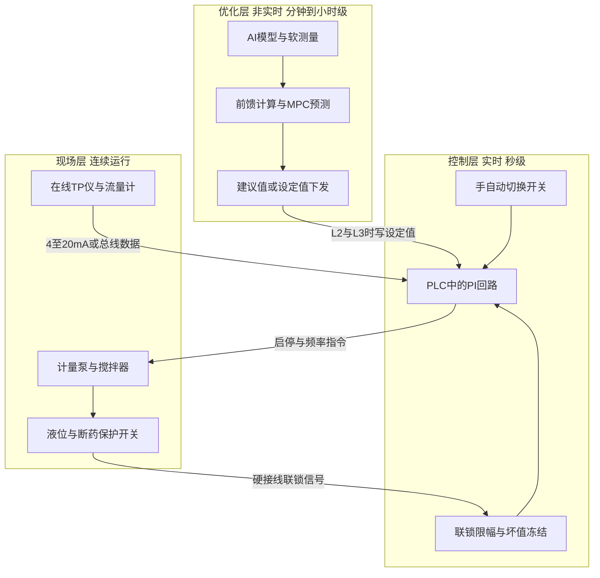
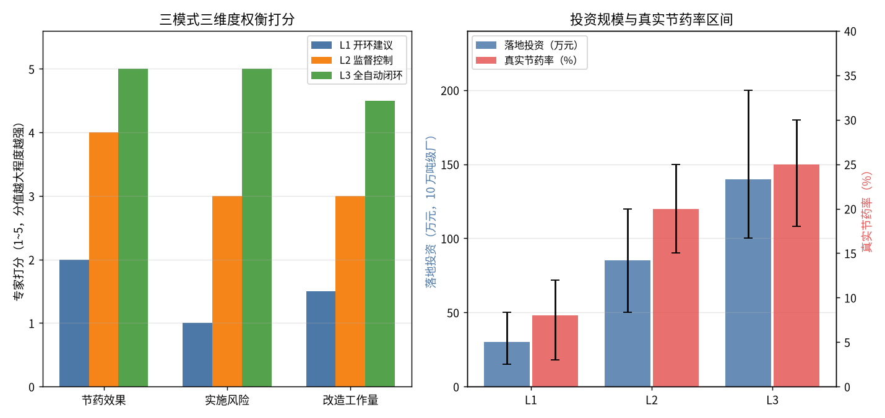

# 07-1 从开环建议到闭环控制：三种架构

> **本章讲什么**：导航软件有三种用法——只看路自己开、开着导航听提示走、打开辅助驾驶让车自己跑。AI 加药在污水厂也有对应的三种架构：L1 开环建议（AI 只出主意，人来动手）、L2 监督控制（AI 在限定窗口内自动改设定值，人盯着）、L3 全自动闭环（AI 全权控制，人只在异常时接管）。本章讲清三种架构谁干活、谁担责、各花多少钱、各能省多少药，以及从 L1 走到 L3 的四个投运阶段和"毕业"条件。
> **读完能干什么**：能给自己厂对号入座，判断现在适合上 L1、L2 还是 L3；能画出"现场仪表—PLC—优化层"的简化三层结构图，说清 AI 在哪一层、联锁在哪一层；能按四阶段投运清单组织试运行，不再一上来就要求"无人值守"。
> **阅读时间**：约 35 分钟。配套实算图 1 张（三种架构投资—节药—风险权衡）、对照表 3 张、投运阶段表 1 张。

## 场景导入：同一个模型，三种命运

两家 10 万吨级的厂，同一供应商、同一套 TP（总磷）预测模型，上线一年后命运完全不同。

A 厂把模型装成了"看板"：中控室屏幕上每 15 分钟跳出一行建议——"建议 PAC 投加量 1480 L/h"。当班工人瞟一眼，觉得"今天水还行"，手动拧到 1450。年底复盘，节药 8%，没出过任何事故，厂长老怀安慰。

B 厂要求一步到位：模型直接写 PLC（可编程控制器，车间里的工业电脑），计量泵全自动。第三个月赶上在线 TP 仪试剂管结晶堵了，仪表读数卡在 0.05，系统判断"水很干净"自动减药 40%，等化验室一周后例行抽检发现出水 TP 连续超标，环保局的罚单已经在路上。

差别不在模型准不准，而在**模型和执行器之间用什么方式连起来**。这就是本章要讲的控制架构。

*真实照片：水厂中控室 SCADA 操作大厅。无论 L1 建议、L2 半自动还是 L3 闭环，运行员都在这样的环境里监盘，并始终保留最终接管权。图片来源：Wikimedia Commons，作者 Z22，CC BY-SA 4.0。*

## 一、三种架构：AI 的手伸到了哪一层

先给定义，记住一句话的区别：**L1 动嘴、L2 牵手、L3 放手**。

| 架构 | 一句话定义 | 谁改泵的频率 | AI 系统的角色 | 人的角色 |
|---|---|---|---|---|
| L1 开环建议 | AI 只给建议值，不接线 | 人 | 顾问，出现在屏幕或工单上 | 每条指令的最终执行者 |
| L2 监督控制 | AI 在授权范围内自动改设定值 | AI 系统改设定值，PLC 执行 | 监督层"值班调度" | 监盘，可随时一键切手动 |
| L3 全自动闭环 | AI 全天候连续控制，含异常处置预案 | AI 系统 | 控制主体 | 例外管理，只管报警和接管 |

三个名词稍微解释：

- **开环（Open Loop）**：控制信号走出去就不管了，没有"结果"回到控制器。AI 建议 1480，工人执行 1450 还是 1800，AI 不知道也不追究。像广告传单——发完就完。
- **闭环（Closed Loop）**：控制器发出动作后，仪表把结果测回来，下一拍再算。像空调——设定 26 ℃，它自己测室温、自己调压缩机。L2、L3 都是闭环，差别在授权大小。
- **设定值（Setpoint）**：交给底层控制器的目标数字。比如 AI 不直接"开泵到 1480"，而是把"目标投加量 1480 L/h"这个设定值写给 PLC，PLC 内部的 PI（比例积分）回路再去具体调泵频。这样即使优化层死机，PLC 仍按最后一个设定值运行。

> ⚠️ **现场经验：AI 永远只给设定值，绝不直接碰联锁**
>
> 无论 L2 还是 L3，加药泵的硬联锁（超限停泵、断药报警、坏值冻结、紧急切断）必须留在 PLC 里，用梯形图写死，不依赖 AI 服务器、不依赖 Windows 系统、不依赖网络。AI 服务器可以死机、可以重启、可以拔网线，泵的安全逻辑一秒都不能受影响。这是污水厂自控的铁律，也是验收时安检的必查项。联锁怎么做见 [08-3 安全联锁与人工接管](../08-落地实施篇/08-3-安全联锁与人工接管.md)。

## 二、一张图看清三层结构：AI 住在"优化层"

工业控制里有个经典的 Purdue（普渡）参考模型，从现场到经营分了五六层。污水厂加药不需要记那么多，记住下面这个简化三层就够用了。

三层各管一段，像公司里的"经理—班长—工人"：

1. **现场层（工人）**：仪表负责量（在线 TP 仪 10~30 min 一个数、流量计秒级），泵和阀门负责干，保护开关负责保命。它们只认电信号，不认模型。
2. **控制层（班长）**：PLC 里跑着秒级的 PI 回路和全部联锁。它只认设定值和报警，稳定可靠、7×24 小时通电就干活。L1 架构下，设定值由人填；L2/L3 架构下，设定值由优化层写。
3. **优化层（经理）**：AI 模型、软测量、前馈计算、MPC（模型预测控制，下一章细讲）都住在这里。它用历史数据和预测做"慢决策"，分钟级甚至小时级算一次，不要求实时操作系统，但要求模型有人维护。

> 💡 **为什么非要分层？一台电脑全包了不行吗？**
>
> 不行，核心是**可靠性和责任边界**。PLC 平均无故障运行以年计，Windows 服务器以周计；优化层死机时，控制层保持最后一个设定值继续运行，工艺不中断；控制层故障时，现场层的硬联锁还能停泵保护。分层之后，升级 AI 模型不用动 PLC 程序，供应商扯皮时也能分清"模型错了"还是"执行坏了"——这两点在污水厂都是真金白银的教训。

## 三、L1 开环建议：90% 的厂从这里起步，很多厂就停在这里

L1 的形态很朴素：系统每 15~60 分钟算出一个建议投加量，推送到中控屏幕、短信或 SCADA（数据采集与监视控制系统）弹窗；工人看到后，自己判断、自己调泵。AI 和执行器之间**没有一根物理的控制线**。

典型功能：

- 当前建议投加量（如"PAC 1480 L/h，当前实际 1700 L/h，建议下调 13%"）；
- 未来 2~6 小时负荷预测曲线（早高峰几点来、多大量）；
- 异常提示（"进水 TP 突升，建议提前 30 分钟加量""TP 仪读数疑似失真，请化验比对"）；
- 班次/日报：建议执行率、建议前后药耗对比。

L1 的真实价值被两个因素决定：

1. **建议质量**：建议值必须比老师傅的经验明显更准、更细——至少能说清"为什么是 1480 不是 1700"，否则工人三天后就不看了；
2. **执行率管理**：行业经验，没有考核配套的纯建议系统，一个月后的建议执行率通常掉到 30% 以下，变成"花钱买的屏保"。把执行率纳入班组考核、每周复盘差异原因，执行率才能稳在 80% 以上。

L1 的投资主要在软件和数据打通，不需要改 PLC 逻辑、不用停产施工。

### 3.1 一张合格的 L1 建议卡片长什么样

建议推送不是甩一个数字，合格的卡片要让工人"敢执行、能复盘"。一张卡片至少包含五行信息：

| 字段 | 示例值 | 为什么必须有 |
|---|---|---|
| 建议动作 | PAC 下调至 1480 L/h，当前 1700 L/h | 给动作而非结论，降低理解门槛 |
| 置信度与依据 | 置信度中；进水 Q 持平、投加点前 TP 由 3.1 降至 2.6 | 工人能判断系统是不是在"瞎报" |
| 预计未来 2 h 走势 | 21:30 晚峰起量，建议 21:00 起逐步回到 1650 | 提前量是 AI 相对经验的核心价值 |
| 安全边界 | 最低不低于 1100 L/h，出水红线 0.5 mg/L | 防止误解为"越低越好" |
| 不采纳登记 | 偏保守/偏激进/设备原因/其他（必填） | 沉淀标签数据，支撑模型迭代 |

其中"安全边界"这一行最常被省略也最不该省略：没有下限的减量建议，在班组竞争节药考核时会被层层加码执行，出事只是时间问题。

## 四、L2 监督控制：限定窗口内的"授权驾驶"

L2 把 AI 的建议变成自动下发的设定值，但给它套上笼子。授权通常从四个维度限定：

- **幅度窗口**：单次设定值调整不超过当前值的 ±10%~20%，超出窗口只报警不执行；
- **时间窗口**：先在平峰、白天、有人监盘时段自动，早晚高峰和夜间仍切手动；
- **指标窗口**：出水 TP 预测值在 0.20~0.45 mg/L 区间内才允许自动，逼近红线自动回退保守值；
- **设备窗口**：只在仪表标定合格、通信正常、两台泵都可用时自动，任一不满足立即切手动。

L2 的关键装置是 **手自动切换开关**：物理的或 SCADA 上的一键按钮，切回手动后 AI 写不进任何设定值。这个开关的权限默认给当班班长，不需要厂家、不需要重启。

一个典型的 L2 回路数据流：AI 每 15 min 算一次目标投加量 → 系统校验是否在授权窗口内 → 写入 PLC 的设定值寄存器 → PLC 的 PI 回路秒级跟踪 → 下一拍仪表结果回来重新算。任何一环超时或数据异常，PLC 保持上一拍设定值并报警。

> ⚠️ **坑：L2 最容易出事的不是算法，是"窗口边界没人定义清楚"**
>
> 常见返工：合同写了"自动控制"，没写清楚什么条件下自动。结果厂家为了演示效果把窗口开得很大，运行中遇到仪表失真自动减药；或者厂方怕事把窗口收到 ±3%，自动等于没自动，节药率还不如 L1。正确做法是在调试期用"影子运行"数据统计建议值变化分布，用 P99（99% 分位）的变化幅度反推窗口，既覆盖绝大多数正常调整，又能拦住离谱指令。

### 4.1 L1/L2 到底要接哪些点：一份最小数据清单

很多项目卡在"数据打通"上半年，其实加药回路需要的点位不多。下面是最小集合（方向相对优化层而言）。

| 点位 | 方向 | 典型周期 | 用途 | 缺失后果 |
|---|---|---|---|---|
| 进水/生物池出水流量 Q | 采集 | 秒级，15 min 打包 | 前馈按水量折算投加浓度 | 只能按固定流量估，水量波动时失准 |
| 投加点前 TP 或正磷酸盐 | 采集 | 10~30 min | 前馈主信号、负荷预测 | 只能做纯反馈，慢半拍 |
| 出水 TP 在线仪 | 采集 | 15 min | 反馈校正、合规监视 | 无法闭环，只能停 L1 |
| 计量泵运行频率/冲程与流量反馈 | 采集 | 秒级 | 实际投加量核对、模型校正 | 建议与执行两张皮，执行率无法考核 |
| 药液罐液位、泵故障、管路压力 | 采集 | 秒级 | 异常联锁与工单 | 断药、抽空不能自动处置 |
| AI 设定值寄存器 | 下发 | 15 min | L2/L3 写目标投加量 | —— |
| 手自动状态与切换命令 | 双向 | 秒级 | 授权管理、一键接管 | L3 不具备验收条件 |

经验：老厂改造时，前 5 项采集通常要花掉项目一半工期——仪表有了但信号只到现场显示表、PLC 里没有地址的情况非常普遍。调研阶段必须拿着点位表现场核对，详见 [05-1 数据从哪来：点位表与数据字典](../05-数据篇/05-1-数据从哪来-点位表与数据字典.md)。

## 五、L3 全自动闭环：不是更敢，而是预案更多

很多人以为 L3 就是"厂家胆子大，敢让 AI 瞎跑"。恰恰相反，**L3 的门槛是异常预案的完备程度，而不是模型精度**。L3 与 L2 用同一个模型、同一套优化算法，区别在于：L2 把没见过的情况甩给人，L3 必须对每一种已知异常都有写好的自动对策。

L3 上线前要逐条演练的异常清单（典型十几到几十条）：

- 仪表坏值/冻值/漂移：自动冻结设定值、切保守投加、触发化验比对工单；
- 通信中断：PLC 本地按最后设定值运行，超 X 分钟切保守模式；
- 药液罐低液位、泵抽空、管路堵塞：自动切备用泵并报警；
- 进水冲击负荷：前馈超限立即拉满安全余量，不等反馈；
- 模型置信度下降（输入超出生效范围）：降级为纯前馈或纯 PI；
- 停电恢复：按预置的软启动曲线爬负荷，不直接拉满。

L3 不是"无人值守"，而是**人从"每拍操作"退到"例外管理"**：正常时系统自己跑，人只处理报警、维护模型、定期审核。

## 六、三种架构横向对比

下面这张表把选型要考虑的维度一次摆开（投资和节药为 10 万吨级市政厂经验区间，具体项目以实测为准）。

| 对比维度 | L1 开环建议 | L2 监督控制 | L3 全自动闭环 |
|---|---|---|---|
| 控制链路是否闭环 | 否 | 是，限定窗口 | 是，全天候 |
| AI 输出去向 | 屏幕/工单 | PLC 设定值寄存器 | PLC 设定值寄存器 |
| 对 PLC 改造 | 几乎不需要 | 小改，加通信与切换逻辑 | 中改，完整联锁与预案 |
| 对仪表要求 | 有数据即可 | 仪表可靠、定期标定 | 双表或冗余校核更佳 |
| 投资区间（10 万吨级） | 15~50 万元，中值 30 | 50~120 万元，中值 85 | 100~200 万元，中值 140 |
| 真实节药率 | 3%~12%，中值 8% | 15%~25%，中值 20% | 18%~30%，中值 25% |
| 主要风险 | 建议没人执行 | 窗口设置不当 | 异常预案不完备 |
| 责任主体 | 人 | 人和系统共担，按授权边界划分 | 系统运行责任为主，人负监督责任 |
| 见效速度 | 上线当月 | 影子+调试约 2~3 个月 | 完整投运 4~8 个月 |
| 适用厂情 | 仪表基础弱、先建立信任 | 绝大多数市政厂的归宿 | 管理规范、仪表好、有运维能力的大厂或集团化水厂 |

注意 L3 相对 L2 的节药增量只有 3~5 个百分点（中值 25% 对 20%），但投资和责任几乎翻倍——这是后面要讲"90% 停在 L1/L2"的第一个原因。

### 6.1 用 04-1 的算例算一笔回收账

[04-1 化学除磷机理与投加量计算](../04-机理公式篇/04-1-化学除磷机理与投加量计算.md) 给过 10 万吨厂的名义工况：PAC 干粉 4198 kg/d、药费约 8400 元/d，全年按 365 天计约 **307 万元/年**。把中值节药率代进去：

| 架构 | 年节药金额（按中值节药率） | 投资中值 | 静态回收期 |
|---|---|---|---|
| L1 | 307 × 8% ≈ 24.6 万元/年 | 30 万元 | 约 1.2 年 |
| L2 | 307 × 20% ≈ 61 万元/年 | 85 万元 | 约 1.4 年 |
| L3 | 307 × 25% ≈ 77 万元/年 | 140 万元 | 约 1.8 年 |

三个架构回收期都落在 [08-4 三个典型厂案例](../08-落地实施篇/08-4-三个典型厂案例-方案BOM与ROI.md) 常见的 1~2.5 年区间内，但账要这么读：L1 用最小投入快速证明价值，L2 是性价比拐点，L3 的增量投资（约 55 万元）只换来增量收益（约 16 万元/年），增量回收期 3 年以上——这还是在系统跑得顺的前提下。若年药剂费只有 100 万元的小厂，L3 的增量回收期会拉长到 5 年以上，基本不建议。

*数据为合成/典型参数实算。左图三维度 1~5 分打分：L1 为 2.0/1.0/1.5，L2 为 4.0/3.0/3.0，L3 为 5.0/5.0/4.5——L3 收益最高，但风险和工作量同步拉满；右图是投资与节药率的经验区间。*

## 七、投运四阶段：从"只看不动"到"全天候自动"

无论目标是 L2 还是 L3，成熟的交付都按四个阶段走，每阶段都有明确的"毕业条件"，跳级几乎必然返工。

| 阶段 | 系统干什么 | 人干什么 | 进入下一阶段的条件（毕业线） |
|---|---|---|---|
| ① 影子运行 | 只记录建议值，不接线、不显示给操作工 | 照常手动操作；工程师对比"建议值 vs 实际值" | 建议值连续 4~8 周不劣于人工；异常工况建议方向正确；数据缺口已补齐 |
| ② 建议显示 | 建议值上屏/推送，人决定是否采纳 | 执行或不执行都记录原因 | 建议执行率稳定 ≥80%；采纳建议后出水稳定、药耗下降；班组信任建立 |
| ③ 限定窗口半自动 | 平峰白天自动写设定值，幅度限 ±10%~20% | 监盘，高峰/夜间手动，随时可切 | 自动时段连续 1~3 个月零误动作；窗口内工况覆盖率 ≥90%；联锁演练全部通过 |
| ④ 全天候自动 | 全时段自动，异常按预案自动处置 | 例外管理，处理报警、维护模型 | 全部异常预案至少实战或演练过一遍；季度审计达标；运维制度与备件到位 |

几个阶段细节：

- **影子阶段最容易被砍，也最不该砍**。它用零风险换来三样东西：模型在本厂真实数据上的成绩单、窗口设置的统计依据、操作工的信任。砍了影子直接上自动，等于蒙眼过马路。
- **建议显示阶段必须记录"不执行原因"**。下拉菜单几个选项：认为建议偏保守/偏激进、设备限制、工艺安排、仪表异常。这些原因是改进模型最值钱的标签数据。
- **半自动阶段的窗口要逐月扩大**：先平峰（如 9:00~16:00），再纳入晚峰，最后夜间；幅度从 ±10% 放到 ±20%。每次扩大都要重新跑一周"扩大影子"确认。
- **全天候不是终点**：模型漂移、季节切换（低温化学效率下降）、来水构成变化都要求模型持续迭代，详见 [06-7 模型上线监控与迭代运维](../06-AI建模篇/06-7-模型上线监控与迭代运维.md)。

> 💡 **经验：毕业条件要写进合同，别写"连续运行无故障"**
>
> "无故障"没法定义，最后扯皮。要写成可统计的线：建议执行率、自动投运率（自动运行时长占比）、出水达标率、异常预案演练通过率、节药率环比。每个阶段验收打钩付款，甲乙双方都踏实。行业里顺利的厂，③→④ 通常还要经历一次完整季节轮换（夏天数据不能替代冬天的低温工况）。

### 7.1 影子运行到底看什么：一张四周对比表的例子

影子阶段不是"系统跑着看"，而是每周出一张三列对比表。某厂影子期第四周的汇总（合成示例，结构真实）：

| 时段类型 | 人工平均投加 | 系统建议均值 | 实际出水 TP | 复核结论 |
|---|---|---|---|---|
| 平峰（9~16 点） | 1700 L/h | 1320 L/h | 0.12 mg/L | 人工明显过量，建议方向可信 |
| 早高峰（6~10 点） | 1950 L/h | 1810 L/h | 0.28~0.41 | 建议留量合理，高峰上沿需复核 |
| 雨天（本周三） | 1950 L/h | 先 2050 后 1100 | 0.18~0.35 | 初期雨水冲顶建议提前，稀释段建议减量，人工全程一把尺 |
| 夜间（22~5 点） | 1700 L/h | 950 L/h | 0.09 mg/L | 人工过量最严重的时段 |

这张表同时干三件事：给节药率一个可审计的预测（而不是供应商口头承诺）；给半自动窗口找第一批"安全时段"（平峰和夜间）；把建议在高峰、雨天的弱点在不花学费的阶段暴露干净。影子期发现的问题改模型只需要改代码，自动期发现同样的问题，改的是事故报告。

## 八、为什么 90% 的厂最终停在 L1/L2

跑过几十个厂之后，你会发现"L3 率"低不是技术问题，是经济和管理问题：

1. **边际收益薄**：前面算过，L2→L3 节药率只差 3~5 个百分点。一个 10 万吨厂年药剂费约 300 万元，多省 5% 是 15 万元/年，而 L3 多出的投资、演练和常年运维成本可能吃掉一大半。
2. **责任没人敢接**：出水超标是环保责任，厂长要签字。L2 有异常随时切手动，责任还在人手里；L3 出事时第一句话必然是"谁让它自动的"。没有集团层面的制度背书，厂长没有动力上 L3。
3. **运维能力断层**：L3 需要厂里有人看得懂模型置信度、会发起再标定、知道降级路径。很多厂电工班能修泵但没人维护模型，供应商撤场后系统一年退回 L1——这是行业里最常见的烂尾形态。
4. **仪表底子撑不住**：闭环的精度上限等于仪表的可靠性。一支试剂管结晶、一次探头老化，L1 只是建议偏，L3 就是动作错。仪表维护体系不到位的厂，L3 等于裸奔。

这不是劝退 L3，而是说清楚路线：**L1 建信任、L2 拿收益、L3 拼体系**。集团化水厂（十几座厂统一运维、统一模型团队、统一备件）天然适合把成熟的厂推到 L3；单厂则普遍在 L2 拿到 80% 的收益后长期驻留——这完全理性。

> ⚠️ **警惕供应商话术：把 L1 包装成"AI 全自动闭环"**
>
> 验收时让对方现场回答三个问题：AI 的输出写到哪个寄存器？断开 AI 服务器网络，PLC 按什么值运行？把 TP 仪探头拔了，系统第几分钟做什么动作？答不上来或现场不敢拔的，不管 PPT 写的是"数字孪生""智慧大脑"还是"无人值守"，本质都是 L1。

## 九、选型五问：给本厂对号入座

调研一个厂时，按顺序问这五个问题，答案自然指向该上哪一级。

1. **PLC 里有没有泵的流量反馈和在线 TP 数据？** 都没有→先补数据，系统只能先做 L1 离线看板。
2. **在线 TP 仪过去三个月标定和故障记录完整吗？** 频繁失真→先治仪表（参见 [02-3 在线仪表](../02-加药系统篇/02-3-在线仪表-污水厂的传感器眼睛.md)），闭环一律缓行。
3. **班组会不会看趋势曲线、有没有执行率考核的抓手？** 没有→L1 配考核先行，别急着接线。
4. **厂里有没有人能在供应商离场后维护模型？** 没有但集团有团队→可上 L2 并签长期运维；都没有→停在 L2，别碰 L3。
5. **环保口径和厂长意愿是否接受"系统运行、人负监督责任"？** 不接受→L2 就是终点，这不是技术缺陷是治理选择。

## 本章小结

1. AI 加药三种架构按"AI 的手伸到哪一层"划分：L1 开环建议（动嘴，人执行）、L2 监督控制（牵手，授权窗口内自动写设定值）、L3 全自动闭环（放手，带完整异常预案全天候运行）。
2. 物理上分三层：现场层（仪表/泵/硬接线保护）、控制层（PLC 跑秒级 PI 和联锁）、优化层（AI 做分钟级决策）。AI 永远只写设定值，联锁限幅永远留在 PLC。
3. 10 万吨级厂的经验账：L1 投资中值 30 万元、节药中值 8%；L2 为 85 万元、20%；L3 为 140 万元、25%。L2→L3 仅多省 3~5 个百分点，风险与运维要求显著上升。
4. 投运必须走四阶段：影子运行（4~8 周）→建议显示（执行率 ≥80%）→限定窗口半自动（零误动作、联锁演练通过）→全天候自动（异常预案全部演练、跨季节验证），毕业条件要量化并写进合同。
5. 90% 的厂停在 L1/L2 是理性选择：边际收益薄、环保责任重、模型运维缺人、仪表底子弱。单厂在 L2 拿主要收益，集团化水厂才是 L3 的主场。

---

**上一章**：[06-7 模型上线监控与迭代运维](../06-AI建模篇/06-7-模型上线监控与迭代运维.md)
**下一章**：[07-2 前馈加反馈控制器设计实例](07-2-前馈加反馈控制器设计实例.md)
