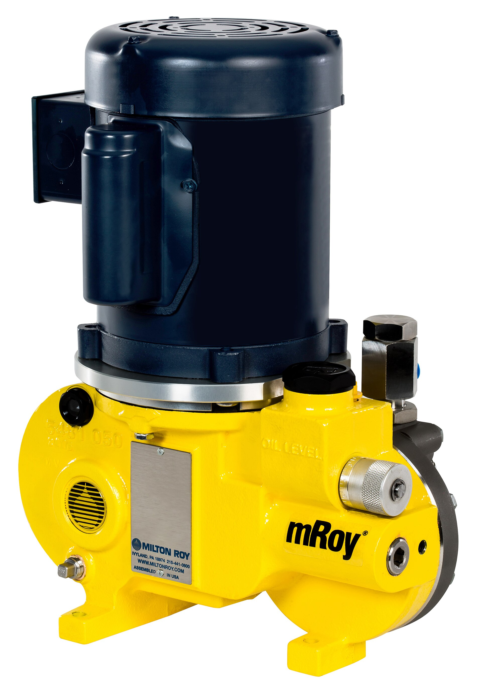
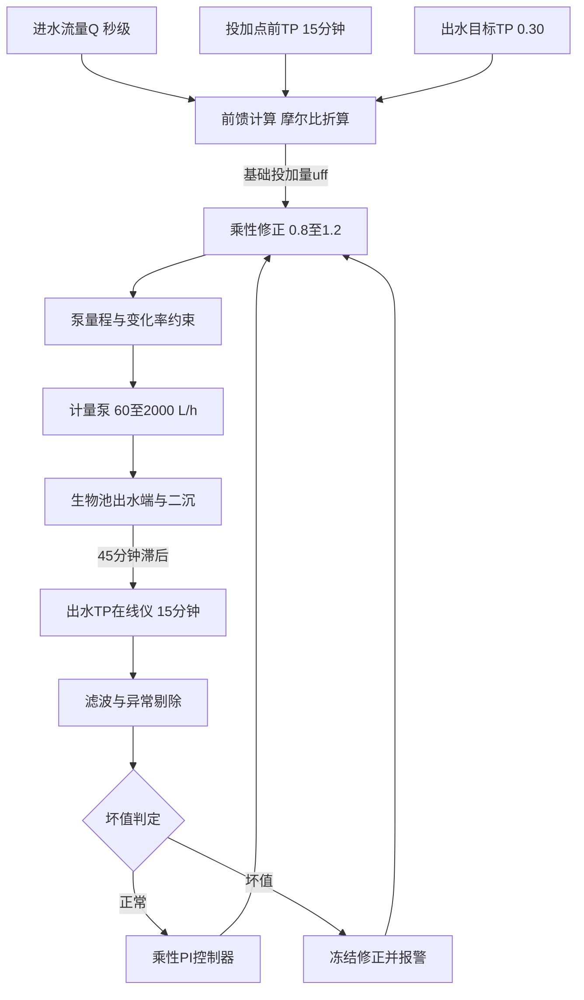
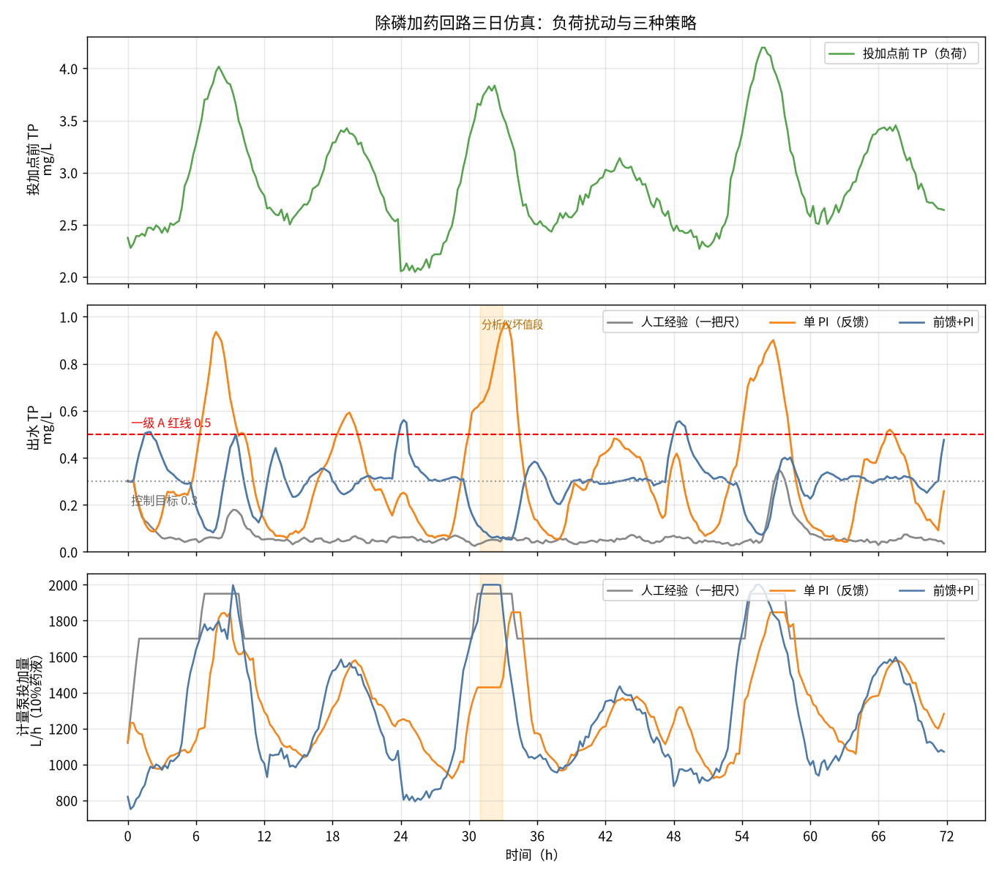

# 07-2 前馈加反馈控制器设计实例：除磷加药完整回路

> **本章讲什么**：把上一章的 L2 监督控制落成一条能交付的除磷加药回路。前馈通道按进水流量和投加点前 TP（总磷）用摩尔比公式"见来水先调药"，扛住 80%~90% 的负荷变化；反馈通道用在线 TP 仪 15 分钟一拍的数据，经滤波、异常剔除、坏值联锁后，由一个乘性 PI（比例积分）控制器在 0.8~1.2 倍范围内修残差；执行器有泵量程、变化率和死区三道硬约束。所有数字都在一条合成的三日工况上实跑验证。
> **读完能干什么**：能照图搭出"前馈+反馈+联锁"三段式回路；能写清分析仪坏值的判定时序和冻结策略；能按整定口诀把 PI 参数调到不超调、不冒进；能拿检查表逐项组织投运验收。
> **阅读时间**：约 45 分钟。配套实算图 1 张（人工/单 PI/前馈+PI 三日对比）、公式算例 2 组、检查表 2 张。

## 场景导入：一把尺省了药费，也漏掉了早高峰

03 章讲过老师傅的"一把尺"：PAC 计量泵常年拧在 1700 L/h，早高峰手动加到 1950。这套打法出水从没超标过——但代价是夜间和平时出水 TP 常年压在 0.1 mg/L 以下，离 0.3 的内控目标差着三倍的药。

上自动后是不是就好了？也不一定。隔壁厂只装了一个看出水 TP 的单 PI 回路：夜里水干净它拼命减药，早高峰水来了，等 45 分钟滞后反映到出水表上才猛加，结果药是省了 25%，超标却攒了 15 个小时——环保局不看你省了多少钱。

正确答案在 [04-5 加药过程动态特性](../04-机理公式篇/04-5-加药过程动态特性-PID前馈与反馈.md) 已经埋下：**大滞后回路必须前馈扛大头、反馈修残差，再给仪表和泵各加一道保险**。本章把这条回路的每一个零件按工程口径写全。



*真实照片：机械隔膜计量泵（Milton Roy mRoy），适合压力较高、流量较大的药液连续投加。图片来源：Wikimedia Commons，作者 LaurelBloch，CC BY-SA 4.0。*

## 一、回路全景：三条信号通路各管一段



三条通路务必分清，调试时 90% 的问题都能按通路定位：

1. **前馈通路（粗调）**：进水 Q 和投加点前 TP → 基础投加量 u_ff。特点是"水还没到出水表，药已经按计划下去了"，解决 45 分钟滞后。
2. **反馈通路（细调）**：出水 TP 实测值 → PI 修正系数 0.8~1.2。解决前馈算不准的那部分（摩尔比漂移、温度、污泥波动）。
3. **联锁通路（保险）**：仪表坏值、通信中断、泵异常 → 冻结/回退/报警。它不属于控制算法，属于安全系统，逻辑写在 PLC 里（见 [08-3 安全联锁与人工接管](../08-落地实施篇/08-3-安全联锁与人工接管.md)）。

## 二、前馈通道：把 04-1 的摩尔比公式装进控制器

### 2.1 名义工况先算一遍

沿用 [04-1](../04-机理公式篇/04-1-化学除磷机理与投加量计算.md) 的 10 万吨厂算例：水量 Q = 100000 m³/d，投加点前 TP 4.0 mg/L，出水目标 0.30 mg/L，摩尔比 β = 2.0；PAC 以 Al₂O₃ 计含量 29%（折合铝质量分数 w_Al = 0.1535），药液质量分数 10%、密度 1.1 kg/L。

结论数字先放这里，控制器里直接用：

- 需要去除的磷：(4.0 − 0.3) × 100000 / 1000 = **370 kgP/d**；
- PAC 干粉投加量：**4198 kg/d**（单位投加量 42 mg/L）；
- 10% 药液体积流量：4198 / 0.10 / 1.1 / 24 = **约 1590 L/h**；
- 药剂费：4198 × 2000 元/t ÷ 1000 = **约 8400 元/d**。

### 2.2 前馈的线性形式：每毫克药能除多少磷

控制器不会每拍都重算摩尔质量，而是用线性化的"除磷效率系数"：

```
dose_ff = (TP_a − TP_target) / K_CHEM
u_ff = Q × dose_ff / (1000 × c × ρ)
```

符号与单位：

- dose_ff：所需 PAC 干粉投加浓度，mg/L；
- TP_a：投加点前实测总磷，mg/L；TP_target：出水目标，取 0.30 mg/L；
- K_CHEM：单位干粉的除磷量，mgP 每 mgPAC 干粉，算例口径 K_CHEM = 3.7 ÷ 42 ≈ **0.088**（即 1 mg/L 干粉约除 0.088 mg/L 的 P，对应 β=2）；
- u_ff：计量泵药液流量，L/h；Q：进水流量，m³/h；c = 0.10（药液质量分数），ρ = 1.1 kg/L。

第二式就是工程上常用的换算：干粉 mg/L 折成 10% 药液 L/h。算例验证：Q = 4167 m³/h、dose_ff = 3.7/0.088 ≈ 42 mg/L 时，u_ff = 4167 × 42 / 1000 / 0.10 / 1.1 ≈ 1590 L/h，与名义工况闭合。

> 💡 **前馈里两个藏得最深的坑：取在"投加点前"，和铝磷比不等于除磷量**
>
> 第一，TP_a 必须取**投加点之前**的水样（生物池出水端的正磷酸盐或总磷在线仪）。拿出水 TP 当前馈等于拿反馈当前馈，滞后一点没少。第二，β（Al/P 摩尔比）是配药口径，不能直接当除磷效率：1 mol Al 理论结合 1 mol P，铝、磷原子量 27 和 31，但商品 PAC 有效铝和实际利用率都要打折——31 ÷ 27 ≈ 1.15、再乘 β=2 并计入 Al₂O₃ 含量 29%（铝占 Al₂O₃ 的 27×2/102 ≈ 0.53，29% × 0.53 ≈ 0.1535），才回到上面的干粉量。现场换药剂批次、换厂家时，PAC 的 Al₂O₃ 含量可能从 29% 漂到 26%，前馈系数必须跟着改，否则换一次药偏一次量。

### 2.3 前馈的更新节奏与两个滤波器

前馈信号每个控制拍（15 min）更新一次，但原始信号要先做两件事：

- **流量滤波**：瞬时流量含泵站启停噪声，用 15~30 min 滑动平均，避免泵频跟着秒级毛刺乱抖；
- **浓度跳变确认**：投加点前 TP 单点跳变超过 0.3 mg/L 先不照单全收，连续两拍同向才确认（与出水分析仪同一套时序，见 3.2 节），防止仪表气泡把投加量带飞。

前馈负责"快"，但前馈模型本身不准（K_CHEM 随温度、pH、污泥性质漂移），这部分误差交给反馈。

### 2.4 算一拍：早 8 点控制器里到底发生了什么

某日早 8:00 控制器取到：Q = 4800 m³/h（已 30 min 滑动平均）、投加点前 TP = 3.8 mg/L（连续两拍确认的真实值）、出水 TP 滤波值 yf = 0.36 mg/L，上一拍执行 1620 L/h。逐步算：

1. 前馈干粉浓度：dose_ff = (3.8 − 0.3) / 0.088 ≈ **39.8 mg/L**；
2. 前馈药液流量：u_ff = 4800 × 39.8 / 1000 / 0.10 / 1.1 ≈ **1737 L/h**；
3. 反馈误差：e = 0.36 − 0.30 = 0.06 mg/L（大于死区 0.02，动作）；
4. PI 修正：比例项 kp·e = 0.6 × 0.06 = 0.036；积分项累加 kp·(15/80)·0.06 ≈ 0.0068，加上上一拍积分存量后假设 ki_state = 0.020，则 k_corr = 1 + 0.036 + 0.020 = **1.056**（在 0.8~1.2 内）；
5. 合成命令：u = 1737 × 1.056 ≈ **1834 L/h**；
6. 变化率约束：本拍允许上限 1620 + 150 = 1770，实际下发 **1770 L/h**，剩余的 64 L/h 下一拍再爬；饱和标志 sat = +1，若误差仍为正，本拍积分不累加（抗饱和）。

这一拍把三个设计思想全演了一遍：前馈看到了负荷（3.8 已比平峰高），反馈纠正了出水偏高（×1.056），斜坡约束让泵以 150 L/h 的节奏平滑爬升。同一个早高峰，纯反馈单 PI 此刻才刚看到平峰时的出水，它的动作要到 8:45 才反映到出水表上。

## 三、反馈通道：15 分钟一拍，先过三关再进 PI

### 3.1 为什么是乘性 PI、范围 0.8~1.2

反馈不重新算投加量，只输出一个**修正系数 k_corr** 去乘前馈值：

```
u = u_ff × k_corr，k_corr 限幅在 [0.8, 1.2]
k_corr = clip(1 + kp·e + ki_state, 0.8, 1.2)
e = TP_出水 − TP_target
ki_state += kp·(DT/Ti)·e     （执行器饱和且误差同向时本拍不累加）
```

为什么用乘法不用加法：前馈已经按当前负荷算出 1000 或 1900 L/h，反馈要表达的是"整体多投 8%"而不是"固定加 100 L/h"——乘法在大小负荷上的裕量比例一致，夜间低负荷不会被一个固定加数顶成过量投加。

为什么限制 ±20%：反馈只该修残差。如果模型失配到需要修正 40% 才达标，正确动作是去重新标定 K_CHEM，而不是让 PI 长期顶着限幅运行——后者等于把前馈系统悄悄退回了单 PI。仿真采用的参数：比例增益 kp = 0.6（误差每 0.1 mg/L 产生 0.06 的即时修正），积分时间 Ti = 80 min，DT = 15 min。

### 3.2 出水分析仪的三关：滤波、跳变确认、坏值冻结

在线 TP 仪是这条回路最贵也最不可靠的零件，σ（噪声标准差）约 0.025 mg/L，还会出尖峰、试剂耗尽冻值。原始读数直接进 PI，必然乱调。处理分三关：

1. **一阶滤波**：yf = 0.4·y_raw + 0.6·yf（α = 0.4）。噪声压下去，代价是引入一拍左右滞后——对 45 分钟滞后的回路可以接受。
2. **跳变确认（连续两拍规则）**：单点读数与滤波值偏差 > 0.15 mg/L 时先剔除不用；若**连续两拍**的新读数互相接近（偏差 ≤ 0.10），确认是真实阶跃，滤波快速追上真实值——真实的早高峰冲顶因此不会被当成坏值永久忽略。
3. **坏值冻结**：跳变后连续 3 拍仍无法互相确认，判仪表坏值：PI 输出原地保持（冻结积分），前馈照常，系统报警，通知化验室人工比对。

这个时序是用血的教训换来的：早期版本"单点超差就冻值"，结果真遇到雨天负荷冲顶，仪表被判坏值冻结 2 小时，反馈眼睁睁看着出水超标——**宁可在尖峰上少信一拍，也不能把真实的工艺变化关在门外**。

### 3.3 抗积分饱和：条件积分法

PI 都有积分饱和问题：泵已打到 2000 L/h 上限，积分项还在累加"再多投点"，等负荷过去后要先花一两小时把积分"吐"回来，期间持续过量投加。

本回路用最简单可靠的**条件积分**：记住上一拍执行器是否被限幅及方向（sat = +1/0/−1），若 sat·e > 0（已经顶到上限、误差还要求继续加），本拍积分不累加。配合死区——|e| < 0.02 mg/L 时误差按 0 处理，泵彻底不动，避免在目标值附近来回抖。

> ⚠️ **整定顺序口诀：先关积分找比例，再放积分消余差，最后加死区**
>
> 新手最常见错误是三个参数一起拧。正确顺序：①Ti 放到极大（关掉 I），kp 从小往大加，直到投加量对阶跃响应够快、出水不出现持续振荡，本回路 kp 从 0.3 试到 0.6；②Ti 从大往小降（积分作用增强），直到出水余差在 2~3 个采样周期内回到 0.3，本回路 Ti=80 min，再小就超调；③最后加 ±0.02 死区稳住泵。整定时每改一次参数至少观察 2 个完整工况周期（含一次高峰），不要看平峰调高峰参数。

## 四、执行器三道硬约束

控制器算得再理想，命令到泵口要过三道关，全部在 PLC 层强制执行，与 AI 无关：

| 约束 | 取值（本回路） | 工程来源 |
|---|---|---|
| 泵量程上下限 | 60~2000 L/h | 下限保管路不抽空、计量精度合格；上限按名义工况约 1.25 倍选型 |
| 变化率限制 | ≤150 L/h 每 15 min | 管路冲击、搅拌混合滞后；一般取满量程的 5%~10% 每拍 |
| 死区 | 出水偏差 ±0.02 mg/L | 小于死区不动，防止泵频抖动磨损与药剂脉动 |

约束的顺序也有讲究：先做变化率限幅、再做量程裁剪。仿真中可以看到，即便控制器瞬间要求从 1700 跳到 2050，泵实际输出也是每拍最多爬 150——**控制器设计必须知道这条斜坡，否则它会以为自己的命令已经生效而错误累加积分**，这正是 3.3 节饱和标志存在的原因。

## 五、坏值联锁：四步动作与恢复条件

把 3.2 节的判据落成 PLC 联锁逻辑，任何一步都不能依赖优化服务器：

1. **检出**：连续 3 拍跳变无法确认，或分析仪通信心跳超时 2 个采样周期；
2. **冻结**：k_corr 保持上一有效值（不复位为 1，避免突然跳变），投加完全按前馈执行；
3. **报警**：中控弹窗 + 短消息，自动生成化验比对工单（取样位置、上次标定时间）；
4. **升级**：坏值持续 >2 h 或前馈信号同时异常，自动切保守投加（名义工况前馈量 ×1.15）并提示切手动。

恢复条件同样要写死：仪表连续 4 拍读数落在"前馈预测出水区间 ±0.15 mg/L"内，且人工消警后，才恢复自动修正——**自动恢复只认数据，不认"仪表厂家说修好了"**。

## 六、投加点怎么选：决定 θ 的不是算法是工艺

反馈再快也快不过管路。同一套控制器，投加点位置不同，纯滞后 θ 可以从 15 min 变成 2 h。常见三种摆法：

| 投加点位置 | 典型纯滞后 θ | 优点 | 代价 |
|---|---|---|---|
| 生物池出水端（同步沉淀） | 30~60 min | 滞后小，反馈及时，絮凝条件好 | 与生物除磷争负荷，药剂利用率受污泥波动影响 |
| 二沉池前配水井（主流） | 45~90 min | 混合充分、改造量小，最常见 | 反馈窗口偏紧，必须靠前馈 |
| 深度处理混凝前（提标线） | 15~30 min | 滞后最小、出水最稳 | 需另建混合反应设施，投资高 |

经验是把在线正磷酸盐仪尽量往投加点下游近的地方装（如同步沉淀后的廊道），θ 每缩短 15 min，允许的 kp 大约可以加大 20%，控制质量立竿见影。注意取样管本身还有 3~10 min 传输延迟，能自流取样就别上长距离蠕动泵取样。

## 七、现场故障对照：现象—原因—先查什么

| 现象 | 最可能的原因 | 先查什么（不要先改参数） |
|---|---|---|
| 泵频持续小幅抖动 | 流量信号未滤波或死区太小 | Q 原始曲线、死区设置 |
| 出水整体缓慢偏高且 k_corr 长期顶在 1.2 | K_CHEM 失真：换药、低温、pH 漂移 | 药剂批次化验单、水温、K_CHEM 重标定 |
| 出水周期性振荡约每小时一轮 | kp 偏大或 Ti 偏小 | 降 kp 0.1、Ti 加大 30 min 再观察 |
| 高峰过后仍长时间过量投加 | 积分饱和或变化率限制未联动 | sat 标志逻辑、泵反馈地址 |
| 修正系数突然打满 0.8 或 1.2 | 仪表跳变/冻值未联锁 | 分析仪原始读数、试剂余量 |
| 自动与手动投加量长期对不上 | 泵实际流量与指令不符（隔膜磨损） | 量箱校核泵实际冲程流量 |

## 八、三日实算：三条策略同场对比

用与本章完全一致的对象和参数跑三日合成工况（288 拍，τ=55 min、θ=45 min，含早晚双峰、夜间低负荷摩尔比漂移到约 2.4、分析仪尖峰和第 2 天早 7 点起 2 小时坏值段），对比三条策略。



*数据为合成/典型参数实算。上子图为出水 TP，下子图为泵流量；单 PI 在早高峰因固定基线+45 分钟滞后频繁触红，前馈+PI 仅在分析仪坏值段有短暂波动。*

| 指标（3 日合计） | 人工经验 | 单 PI（固定名义基线） | 前馈+PI |
|---|---|---|---|
| 药液量（m³） | 124.67 | 92.83 | 91.59 |
| PAC 干粉（kg） | 13713.72 | 10211.45 | 10074.43 |
| 药费（元，2000 元/t） | 27427 | 20423 | 20149 |
| 平均出水 TP（mg/L） | 0.07 | 0.33 | 0.30 |
| 超 0.5 红线时长（h） | 0 | 15.0 | 2.75 |
| IAE 目标偏差累计（mg/L·h） | 16.83 | 13.44 | 4.94 |
| 相对人工节药率 | —— | 25.5% | 26.5% |

读这张表的三个要点：

1. **人工策略 0 超标是拿三倍药换的**：平均出水 TP 0.07，IAE 16.83 全场最高（偏离目标最远），药费比自动策略多花约 7300 元/3 天。
2. **单 PI 省药但不能单独用**：25.5% 的节药率和前馈+PI 几乎一样，但超标 15 小时——它看不到正在路上的水，早高峰必裸奔。这就是"反馈在大滞后回路上不能挑大梁"的量化证据。
3. **前馈+PI 贴着目标运行**：平均 TP 正好 0.30，IAE 仅 4.94（单 PI 的 37%）；2.75 小时超标全部发生在第 2 天分析仪坏值段——冻结前馈保住了大部分时段，但失去反馈校正 2 小时仍有短时穿透，说明坏值期间的"保守投加"升级阈值还有收紧余地，这正是投运后要迭代的参数。

> ⚠️ **坏值段是这套回路唯一的软肋，别指望算法彻底解决**
>
> 前馈准、反馈稳的前提是仪表给真数。一台试剂耗尽的在线 TP 仪，对系统来说和"出水突然变好"没有区别。工程上的三件套：分析仪季度标定+试剂余量纳入点检、关键厂出水装双表或便携抽测比对、坏值联锁升级路径定期演练（每季度真拔一次取样管）。算法只能保证坏数据时系统不乱动，水质安全最终靠仪表管理体系。

## 九、当 k_corr 长期顶格：K_CHEM 再标定流程

0.8~1.2 的修正窗口不是给模型失配兜底的，它是残差通道。运行中如果发现 k_corr 连续 5~7 天均值在 1.1 以上（或 0.9 以下），说明前馈系数 K_CHEM 已系统性偏移，典型原因是换季降温、换药剂批次、进水含工业阴离子（SO₄²⁻ 等竞争络合）。再标定流程：

1. 取连续 7 天高、平、低三个负荷段各 10 组稳态数据（稳态判据：Q 波动 <10%、投加量不变 ≥2 h）；
2. 按 K_CHEM_新 = (TP_a − TP_出水) / dose_实际 逐点计算，剔除坏值段后取中位数；
3. 与现值偏差 >8% 才改参数，避免拿噪声折腾系统；
4. 改参数选在平峰上午，改后 48 h 内 k_corr 应回到 0.95~1.05 中位；
5. 参数变更进台账（原值、新值、化验单、审批人），与药剂批次绑定。

低温季（水温 ≤12 ℃）化学除磷效率可下降 15%~25%，β 实际需求由 2.0 漂到 2.4 左右，K_CHEM 相应下移——07-4 的场景回放会专门量化这种失配。

## 十、投运检查表：调试工程师离场前逐项打钩

**静态检查（上水前）**：

- [ ] 点位表三方签字：Q、投加点前 TP、出水 TP、泵流量反馈、液位、手自动状态地址齐全；
- [ ] K_CHEM 按当前批次 PAC 的 Al₂O₃ 化验单录入，药液 c、ρ 与铭牌一致；
- [ ] 量程 60~2000、变化率 150/15min、死区 ±0.02、修正系数 [0.8,1.2] 在 PLC 内核对；
- [ ] 断网、断电、仪表断线、泵故障四类演练通过，恢复条件符合 5 节定义；
- [ ] 一键切手动按钮在中控和现场柜各一个，切断后 AI 写入无效。

**动态调试（影子→半自动）**：

- [ ] 影子运行 ≥4 周，前馈量与人工实际投加逐日对比，差异 >15% 都有归因；
- [ ] kp 从 0.3、Ti 从 120 min 起，按 3.3 口诀整定，覆盖至少两次早高峰和一次雨天；
- [ ] 平峰半自动连续 2 周零误动作，再扩窗口；自动投运率、IAE、药耗每周出报；
- [ ] 坏值演练：人为制造单点尖峰、2 h 冻值、通信中断各一次，联锁动作与工单均正确。

## 十一、月度运行报表：这六行数字要一直看下去

回路投运不是终点，月度报表固定看六个指标，趋势比单值重要：

| 报表字段 | 健康范围（经验） | 异常信号 |
|---|---|---|
| 单位药耗 mg PAC/m³ 或 mg/L 水 | 与负荷回归值偏差 <8% | 持续抬升：效率下降或仪表偏 |
| k_corr 日均值 | 0.95~1.05 | 单侧贴限 ≥5 天：K_CHEM 该重标 |
| 自动投运率 | >95% | 下降：先查仪表故障时长占比 |
| 出水 TP 均值与 P95 | 均值 0.25~0.32，P95 <0.45 | P95 抬升：高峰前馈不足 |
| 坏值/联锁触发次数 | ≤1~2 次/月 | 增多：试剂、采样管、探头寿命 |
| 泵实际流量校核偏差 | <3% | 偏大：隔膜单向阀磨损 |

这套报表也是 [08-5 节能率怎么算](../08-落地实施篇/08-5-节能率怎么算-效益测量与验证MV.md) 里 M&V（节能量测量与验证）口径的原始数据来源——没有逐月台账，"节药 26%"在审计时只是一句宣传。

## 本章小结

1. 除磷加药的落地形态是三段式回路：前馈按 Q 和投加点前 TP 用摩尔比线性式（K_CHEM=0.088）算基础量扛 80%~90% 变化；乘性 PI 在 0.8~1.2 倍内修残差；坏值联锁独立留在 PLC 层。
2. 反馈信号过三关：α=0.4 一阶滤波、单点跳变先剔除且连续两拍确认真实阶跃、连续三拍无法确认判坏值并冻结积分；这套时序避免了把真实负荷冲顶误判成仪表故障。
3. PI 参数与约束：kp=0.6、Ti=80 min、死区 ±0.02 mg/L；条件积分抗饱和；泵口三道硬约束为 60~2000 L/h、变化率 ≤150 L/h 每 15 min、死区不动。
4. 三日实算：人工 13713.72 kg 干粉、0 超标但平均 TP 仅 0.07；单 PI 节药 25.5% 但超标 15 h；前馈+PI 节药 26.5%、平均 TP 0.30、IAE 4.94，仅在分析仪坏值段超标 2.75 h。
5. 投运按"静态五项+影子四周+窗口渐扩+坏值演练"验收；仪表坏值是唯一无法靠算法消除的软肋，靠标定制度、双表比对和季度拔管演练兜底。

---

**上一章**：[07-1 从开环建议到闭环控制：三种架构](07-1-从开环建议到闭环控制-三种架构.md)
**下一章**：[07-3 MPC 模型预测控制怎么落地](07-3-MPC模型预测控制怎么落地.md)
