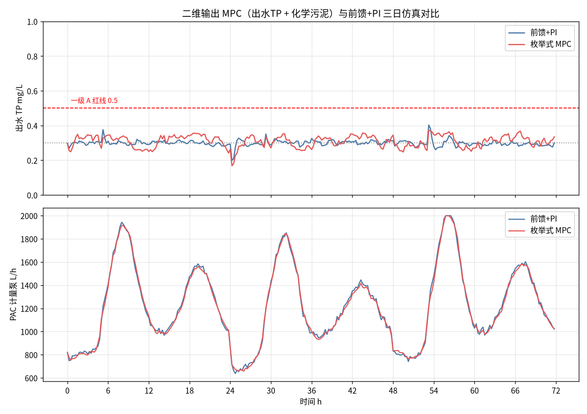

# 07-3 MPC 模型预测控制怎么落地

> **本章讲什么**：MPC（Model Predictive Control，模型预测控制）听着高深，本质就是下棋——每走一步前，在脑子里把未来三步的局面摆一遍，挑后果最好的那步走，走完再重新想。本章用"下棋直觉"讲清 MPC 的三要素（预测模型、滚动优化、反馈校正），给出 MPC 与 PI 的取舍表和"什么时候根本不值得上 MPC"的判据；然后用纯 numpy（不依赖 scipy、cvxpy 等任何求解器）的网格枚举法实现一个 11 候选、3 步预测的除磷 MPC，所有数字实跑验证。
> **读完能干什么**：能向厂长用三句话讲清 MPC 是什么、贵在哪、什么时候回本；能看懂枚举式 MPC 的候选动作、目标函数和约束是怎么写的；能照着工程清单组织 MPC 试点的数据、辨识、投运和维护。
> **阅读时间**：约 45 分钟。配套实算图 1 张（MPC 与前馈+PI 三日对比）、对照表 3 张、可运行代码 1 份。

## 场景导入：为什么同样一台泵，有人敢提前半小时减量

07-2 的前馈+PI 回路已经很好了：看着当前来水投药，出水 TP 贴着 0.30 走。但它有个改不掉的脾气——**它只知道现在，不知道未来**。

想象两个调度员面对同一个早高峰：

- PI 调度员盯着仪表盘，水来多少加多少，水退多少减多少，永远在追赶曲线；
- MPC 调度员手里有一张未来 3 小时的来水预报。他知道 9 点有一波浓度峰、9 点半水量也要起来，于是 8:40 就开始爬坡，把泵从 1400 逐步推到 1900；他还知道计量泵 15 分钟最多变 150 L/h，知道药加过头要多产化学污泥，于是在所有"合法动作"里挑了一个总量最省、动作最平的组合。

更妙的是，他每 15 分钟重新摆一次棋盘：预报错了，下一拍立刻改主意。这就是 MPC——**用模型预演未来，用约束保证合法，用重算消化意外**。

> **看图要点**：MPC 操作员屏幕上的核心元素不是一个设定值数字，而是一簇「如果这样做，未来会怎样」的预测曲线和上下约束带。

## 一、三要素：模型、优化、校正，缺一不叫 MPC


1. **预测模型（Predictive Model）**：一个能回答"如果泵设成 1800 L/h，未来三拍出水 TP 怎么走"的模型。可以是机理模型、线性回归、阶跃响应系数矩阵（DMC 动态矩阵控制的经典做法），甚至是机器学习模型——但必须**在预测时域内可信**。模型是 MPC 的命门，这也是它和 PI 最大的区别：PI 不挑模型，MPC 没模型寸步难行。
2. **滚动优化（Rolling Optimization）**：每个控制拍，在所有满足约束的候选动作里，让目标函数（出水偏差 + 药耗/污泥 + 动作变化的加权和）最小的那个动作。关键在"滚动"：只执行第一步，下一拍拿到新数据后重新优化——模型和预报都不完美，但错误只活一个拍。
3. **反馈校正（Feedback Correction）**：把"实测出水 − 模型预测"的偏差（滤波后）恒定叠加到整条预测轨迹上。模型永远有差（摩尔比漂移、温度变化），没有校正的 MPC 是开环摆件，加了校正才是闭环控制器。

> 💡 **一句话区分 PI 和 MPC**
>
> PI 回答的问题是：**"现在错了多少，该往回扳多少？"**——只有当前一个点，靠积分消余差。
> MPC 回答的问题是：**"接下来几步怎么走，总代价最小且不犯规？"**——有一条未来轨迹、一组约束、一个经济账。单变量快过程里这两问的答案常常一样，所以 MPC 显不出本事；多变量、大滞后、约束多的时候，第一问根本无解，MPC 才上场。

## 二、MPC 与 PI 正面比较

| 对比维度 | PI（含前馈+PI） | MPC 模型预测控制 |
|---|---|---|
| 需要的知识 | 一个误差和两个整定参数 | 预测模型 + 负荷预报 + 权重体系 |
| 处理大纯滞后 θ | 靠前馈硬扛，θ 越大越吃力 | 预测窗跨过 θ，动作提前生效 |
| 处理多变量耦合 | 一路一个回路，互相打架靠限幅 | 一个模型统一算账，天然协同 |
| 处理硬约束 | 事后限幅，限了也不知道后果 | 动作在求解时就保证约束可行 |
| 兼顾经济性 | 只能控指标，药耗靠限幅间接管 | 药耗/污泥/电耗可直接写进目标函数 |
| 投运工作量 | 数天整定 | 数据辨识 2~6 周 + 权重整定数周 |
| 对人员要求 | 自控工即可 | 需懂模型的工程师持续维护 |
| 典型投资附加 | 含在常规自控内 | 软件平台与调试，单回路通常不划算 |
| 失败的典型样子 | 振荡、超调，现象直观 | 模型漂移后静默偏航，不易察觉 |

## 三、什么时候不值得上 MPC：四个劝退条件

MPC 不是更高级的 PI，它是另一类工程。出现下面任何一条，先把 07-2 的前馈+PI 做到位：

1. **单变量、快回路、约束不紧**：一个泵控一个指标，θ < τ（滞后比惯性小），泵常年不撞限——本章后面的实算会演示，这种工况 MPC 和调好的前馈+PI 打平，纯属给项目增加风险。
2. **拿不到可信的模型或辨识数据**：在线数据缺口大、工况长期单一（没有足够激励，模型系数都拟合不出来），模型就是拍脑袋。
3. **没有可测的未来扰动**：MPC 的"提前量"靠预报。进水既无流量计也无前馈仪表、负荷预报无任何数据源，它就退化成一个笨重的 PI。
4. **没有运维主体**：厂里和供应商都说不清"模型半年后谁来更新"。MPC 烂尾的标准剧情是：验收时演示完美，一个冬季后模型失配无人管，操作工切回手动，平台变成报表系统。

真正适合 MPC 的主场是**多变量 + 大滞后 + 多约束 + 经济目标明确**：

- 曝气系统：DO（溶解氧）设定值、内回流、曝气能耗、出水氨氮/TN 相互耦合，鼓风机还有防喘振约束——MPC 是市政厂最成熟的 MPC 应用；
- 碳源投加与脱氮：碳源影响 TN 也影响回流污泥和曝气负荷，多点投加要统一分配；
- 全厂级药剂协同：同步沉淀+深度除磷两级加药、污泥处置费用与药费此消彼长；
- 雨前/冲击预调度：有管网液位、气象或排产数据提供 1~3 h 预见期时，提前布防的收益最大。

## 四、纯 numpy 实现：11 个候选、3 步预测的枚举 MPC

商业 MPC 平台贵，很大一部分贵在求解器。但对加药这类**单输入、候选动作有限**的回路，根本不需要二次规划求解器：把可选动作切成 11 个候选，逐个在模型上"脑补"未来 3 拍，算账比大小即可——全部代码只有 numpy。脚本见 `scripts/fig07_03_mpc_sim.py`。

### 4.1 第一步：从历史数据辨识一个线性预测模型

用 1200 拍（15 min 一拍，约 12.5 天）的伪随机阶跃激励数据（投加量在基准上叠加 ±3、±6 mg/L 的 PRBS 伪随机序列），最小二乘拟合一个离散线性模型（DMC 风格）：

```
y[k+1] = a·y[k] + b·dose[k−1] + g·TP_a[k−1] + c
```

y 为出水 TP，dose 为投加干粉浓度（mg/L），TP_a 为投加点前负荷，滞后一拍（θ=15 min，DELAY=1）。实跑辨识结果与理论值几乎重合：

| 系数 | 实辨识值 | FOPDT 理论值 | 含义 |
|---|---|---|---|
| a | 0.6012 | 0.6065 = e^(−15/30) | 出水自保持，时间常数 τ=30 min |
| b | −0.03488 | −0.03463 | 投加对出水的负作用 |
| g | 0.3963 | 0.3935 = 1−a | 负荷对出水的传递 |
| 拟合 RMSE | 0.0135 mg/L | —— | 与在线仪噪声同量级，模型精度够用 |

> ⚠️ **辨识的两个真实坑：数据对齐和撞下限**
>
> 第一，回归矩阵必须严格按拍对齐：用 k 时刻的 y、k+1−DELAY 时刻的投加和负荷去预测 y[k+1]，错位一拍系数能偏 30%；滞后拍数 DELAY 工程上用投加量与出水的互相关峰值定位。第二，除磷对象有零磷下限（出水不会变负，模型里是 max(0.05, …) 的非线性），激励数据若投太猛、出水长期贴在下限，线性模型会被这段"打死"的区域污染——辨识时投加上界要给负荷留出 0.15 mg/L 余量，让响应始终在线性区。

### 4.2 第二步：每拍枚举 11 个候选动作

投加点紧邻在线正磷酸盐仪的快回路：τ=30 min、θ=15 min、控制周期 15 min，预测时域 H=3 拍（45 min）。候选动作以前馈基准 u_ff 为中心、步长 5 L/h 向两侧展开 11 个，并同时受泵量程（60~2000 L/h）和变化率（≤150 L/h/拍）裁剪：

```
candidates = linspace(max(60, u_ff−25, u_prev−150),
                      min(2000, u_ff+25, u_prev+150), 11)
```

候选窗口为什么要细：候选步长直接变成出水的量化误差——步长 30 L/h 在典型水量下对应干粉浓度约 0.8 mg/L、出水 TP 约 0.07 mg/L 的台阶，比仪表噪声大几倍，出水曲线会被"台阶化"。5 L/h 步长对应的 TP 台阶约 0.01 mg/L，控制才平滑。

### 4.3 第三步：目标函数，把安全、经济、平稳写成一笔账

对每个候选，假设它在未来 3 拍保持不变，滚动模型预测出水轨迹 y₁,y₂,y₃（未来水量、负荷取带误差的短期预报，固定药液流量按各时刻预报水量折算浓度），计算：

```
J = Σₕ [ W_soft·(yₕ−0.30)²                    # 贴内控目标
       + W_hard·max(0, yₕ−0.50)²              # 红线重罚
       + W_lin ·max(0, yₕ−0.50)               # 超标线性罚
       + W_sludge·污泥产量 ]                   # 药耗代理经济项
  + W_du·(u−u_prev)²                          # 动作平稳项
```

权重实跑采用 W_soft=25、W_hard=3000、W_lin=200、W_sludge=0.030、W_du=5×10⁻⁵。权重是有工程含义的旋钮：W_hard/W_lin 决定合规裕量（对预报误差留多少保险），W_sludge 决定经济平衡点，W_du 决定泵的"性格"。**调权重的本质是在给厂方的风险偏好做翻译**，不是数学游戏。

偏差校正用 DMC 加性形式：模型对当前拍的开环预测 yp 与滤波实测 yf 之差，以增益 0.20 滤波后恒定叠加到预测窗三拍上——模型知道自己"最近整体偏高/偏低"，预报随之整体平移。

枚举求解的代码骨架（完整脚本约 250 行，这是核心 20 行）：

```python
def mpc_cost(u_cand, y_now, j, ux, bias, Q_fc, TP_fc):
    yp, cost = y_now, 0.0
    for h in range(1, H + 1):                    # H=3，未来三拍
        jf = j + h - DELAY
        if jf <= j - 1:                          # 还在管道里的历史动作
            dose_h = Lh_to_mgL(ux[jf], Q[jf])
            load = TP_a[jf]
        else:                                   # 候选动作生效，按未来水量折算
            dose_h = Lh_to_mgL(u_cand, Q_fc[jf])
            load = TP_fc[jf]
        yp = max(0.03, a*yp + b*dose_h + g*load + c) + bias
        cost += 25*(yp-0.30)**2 + 3000*max(0, yp-0.50)**2 \
              + 200*max(0, yp-0.50) + 0.030*sludge(u_cand)
    return cost + 5e-5*(u_cand - ux[j-1])**2

cands = linspace(lo, hi, 11)
u_ask = cands[argmin([mpc_cost(c, ...) for c in cands])]
u_execute = clip(u_ask, u_prev-150, u_prev+150)   # 只执行第一步
```

### 4.4 预测时域 H 怎么选：短了瞎，长了飘

H 不是越长越好，它与回路动态和预报可信度直接相关：

| 预测时域 | 能看到什么 | 风险 |
|---|---|---|
| H < θ/周期（动作在窗内不生效） | 全是历史管存，候选动作"看不见自己的作用" | 优化目标退化成纯经济，可能乱减药 |
| H ≈ θ/周期 + 2~4（本章取 1+2） | 动作生效后再看 2~4 拍，覆盖主要调节段 | 推荐起点 |
| H 对应 >3~4 倍 τ | 远期预测占比过大 | 预报误差累积，动作被"想象中的未来"带偏 |

经验法则：H 覆盖"纯滞后 + 一个时间常数"即可（本章快回路 θ+τ=45 min，H=3 拍）；慢回路（θ=45、τ=55）需要 H=6 拍下章回放台即是此设置。候选数 9~15 个够用，翻倍候选数换来的精度提升通常小于预报误差本身。

### 4.5 预报从哪来：没有免费的预见期

| 预报来源 | 典型预见期 | 误差量级 | 适用 |
|---|---|---|---|
| 当前值持续性外推 | 0~1 h | 随预见期快速增大 | 兜底，不增加仪表 |
| 历史典型日模式（锚定当前实测） | 1~6 h | 5%~10% | 市政厂日内双峰，零成本 |
| 进水管网液位/提升泵运行 | 0.5~2 h | 5% 左右 | 有管网数据的厂 |
| 气象与雨洪模型 | 2~24 h | 大，需概率化 | 雨季预调度 |
| 企业排产报备 | 数小时 | 2%~5%（企业守信时） | 工业园接管厂，冲击负荷克星 |

没有任何外部数据时，就用"当前实测 + 典型日形状增量"，并在目标函数里为预报误差留合规裕量（本章内控软目标取 0.27~0.30 而非压线 0.30）。

> ⚠️ **权重标度的坑：一个权重错一个数量级，控制器直接"躺平"**
>
> 枚举 MPC 调不通时，先打印每个候选的成本分项，而不是猜模型。本脚本调试时出现过"午间负荷已降、MPC 仍持续高投加到出水 0.05"，逐项打印发现是动作变化惩罚 W_du 大了 40 倍：一次 30 L/h 的微调罚分比一整拍的药耗和偏差罚分还高，泵被"锚"在上一拍的高投加量上下不来。各分项成本必须先调到同一量级（正常工况下每拍都是零点几到几分），再微调偏好。第二个坑是候选网格以前馈为硬封顶（如 u_ff×1.12），预报偏小时控制器想超投却没有候选可选——网格中心跟前馈、边界跟约束，两件事不要混。

### 4.6 权重调试图鉴：看曲线改哪个旋钮

| 运行现象 | 病灶 | 调整方向 |
|---|---|---|
| 出水常贴 0.05 下限、药耗异常低不下来以外都高 | 软罚太弱或经济项过强 | 加大 W_soft，或减小 W_sludge |
| 出水普遍 0.35~0.40 擦线运行 | 对预报误差没留裕量 | 内控软目标下移 0.02~0.03，加大 W_lin |
| 泵频上下大幅跳、曲线毛躁 | 平稳项太弱 | 加大 W_du，或候选步长加大后重选 |
| 冲击来时动作姗姗来迟 | 候选网格被基准封死、硬罚触发太晚 | 放宽冲击时上限，加大 W_hard/W_lin |
| 模型一换季节整体偏 | 偏差校正增益太小或被限幅 | 加大校正增益，安排再辨识 |
| 怎么调都在两个极端间摆 | 各罚项标度差几个数量级 | 打印分项成本，先归一标度再谈偏好 |

## 五、三日实算：MPC 与前馈+PI 的诚实对比

同一快速回路（τ=30/θ=15）、同一三日工况（模型匹配，仅负荷波动、测量噪声、负荷 3%/水量 2% 预报误差），MPC 与 07-2 同款前馈+PI 同场跑。



*数据为合成/典型参数实算。MPC 与前馈+PI 的泵流量和出水曲线几乎重合——这本身就是本章最重要的结果。*

| 三日指标 | 前馈+PI | 枚举式 MPC | 解读 |
|---|---|---|---|
| PAC 干粉（t/3d） | 9.677 | 9.644（99.7%） | 药耗持平，MPC 微省 0.3% |
| 药费（万元/3d，2000 元/t） | 1.935 | 1.929 | 差异在统计噪声内 |
| 化学污泥（tDS/3d，0.5 kgDS/kg） | 4.839 | 4.822 | 同步略减 |
| 平均出水 TP（mg/L） | 0.299 | 0.310 | MPC 带约 0.01 合规裕量 |
| 超 0.5 时长（h） | 0 | 0 | 都达标 |
| IAE（mg/L·h） | 0.816 | 2.173 | 贴目标精度 PI 更优 |
| 药液量（m³/3d） | 87.97 | 87.67 | 持平 |
| 平均每拍动作幅度（L/h） | 41.2 | 36.6 | MPC 动作平滑约 11% |

这个结果必须诚实读：**在模型匹配的单变量快回路上，调好的前馈+PI 与 MPC 实质打平**——MPC 没有节药奇迹，IAE 甚至略输（它带着合规裕量、贴着 0.31 而不是 0.30 运行，偏差量化也带来微小台阶）。MPC 仅有的优势是动作平滑 11%（泵磨损与药剂脉动略小）和约束处理的结构性优雅。

那 MPC 的价值在哪？在**这场实验刻意排除掉的东西里**：多变量耦合、跨小时的大滞后、可预知的冲击负荷、泵检修等硬约束、药耗与污泥此消彼长的真实经济目标。下一章的场景回放台会把这些条件一个个加回来：在低温模型失配（MPC 换季再辨识后超标 5.25 h，前馈+PI 6.25 h）和有排产预报的工业冲击（MPC 峰值 1.02 vs 前馈+PI 1.44 mg/L）中，差距才真正出现。**MPC 是为复杂局面付费，不是为基准工况付费。**

### 5.1 MPC 项目的四种典型烂尾姿势

1. **演示工程**：辨识用历史回放、投运用影子数据，验收曲线完美；上线后工况一换就偏，没人敢切自动。
2. **黑箱平台**：权重和模型都在供应商加密文件里，厂方无法审计；出问题只能等原厂工程师出差。
3. **预报裸奔**：把典型日曲线当精确预报用，雨季实际偏离典型日，前馈性动作系统性反向。
4. **无降级路径**：MPC 服务器故障后没有"自动退回前馈+PI"的正式机制，操作工只知道切全手动，系统利用率长期低于 50%。

对策分别是：验收必须含跨季节真实工况、权重与模型文件随交付物开放、预报带置信区间且超界自动降权、在 PLC/SCADA 层写好三级降级（MPC→前馈+PI→保守手动设定值）。

## 六、MPC 工程落地清单

| 阶段 | 关键工作 | 验收要点 |
|---|---|---|
| 可行性 | 确认多变量/大滞后/约束/预报四要素至少占两个；数据历史 ≥3 个月 | 单变量快回路直接止步，回去做前馈+PI |
| 数据准备 | 投加、Q、负荷、出水点位对齐；补齐缺失；阶跃/PRBS 激励留辨识数据 | 激励覆盖正常运行范围，出水不贴零磷下限 |
| 模型辨识 | 确定时域、滞后拍、模型结构；交叉验证 RMSE 与仪表噪声同量级 | 系数符号与机理一致，残差无系统趋势 |
| 预报接入 | 来水模式预报或排产/气象/管网数据，给出预报误差分布 | 报得出"预报置信度"，而不是只给一个数 |
| 权重整定 | 分项成本打印调标度；先合规后经济再平稳 | 极限工况（冲击、断仪）下动作仍可解释 |
| 投运 | 影子对比 PI ≥4 周 → 限定窗口（沿用上章四阶段） | 自动投运率、IAE、药耗、动作频次周报 |
| 运维 | 季度残差检查；换季/换药触发再辨识；权重变更进台账 | 明确厂内或服务商的模型责任人 |

最后记住架构纪律与前两章相同：MPC 住在优化层，只写设定值；PLC 层的量程、变化率、联锁和一键切手动原封不动；优化服务器死机，系统退回前馈+PI，再退手动。

> 💡 **给供应商提问的三个技术问题**
>
> 听 MPC 方案时别只听"预测""AI""孪生"这些词，问：①预测模型是什么结构、用多少天数据辨识的、滞后拍数怎么定的？②未来扰动的预报从哪来、误差统计是多少？③权重和约束多久审一次、谁有权改、改了怎么回滚？三个问题都能答到拍数和台账级别的，是真做过工程的；只会演示"曲线跟得很准"的，卖的大概率是一套贵价 PI。

## 七、MPC 与前面的 AI 模型是什么关系

读到这里容易混淆：06 篇建的加药量预测、出水软测量模型，和这一章的预测模型是一回事吗？分工是这样的：

- 06 篇的模型解决"**现在和未来是多少**"：进水负荷预报、投加点前 TP 软测量、未来 2 h 出水预测——它们是 MPC 的**信息来源**（预报和扰动估计），可随时替换成更好的模型而不动控制器；
- MPC 解决"**知道未来以后怎么做动作**"：它内部还需要一个描述"动作如何改变出水"的动态模型（本章用线性辨识模型），这是**因果模型**，回答"如果我这样做会怎样"；
- 前馈+PI 是 MPC 的退化特例：预测窗 H=1、模型只剩静态前馈公式时，MPC 的输出结构就是前馈+PI。

工程上的衔接形态：AI 软测量/预报服务（06 篇）作为数据接口向 MPC 提供带置信度的预报值；置信度下降时 MPC 自动降低对预报的信任（缩小有效预测窗或加大合规裕量），退回当前实测主导。两者解耦交付、各自验收，比建一个"端到端 AI 直接控泵"的黑箱系统可维护得多——后者正是 [06-1 AI 加药能力地图](../06-AI建模篇/06-1-AI加药能力地图-什么活能交给AI.md) 里反复强调要避免的形态。

## 本章小结

1. MPC 的直觉是下棋：每拍用预测模型把候选动作的未来轨迹摆一遍，在约束内选目标函数最小的，只走第一步，下拍全部重算；三要素为预测模型、滚动优化、反馈校正。
2. MPC 的价值在多变量耦合、大纯滞后、硬约束和可预知扰动，以及把药耗/污泥/电耗写进经济目标；单变量、快回路、模型与预报条件不具备时，前馈+PI 与 MPC 实质等效。
3. 加药回路可不用商业求解器：纯 numpy 枚举 11 个候选 ×3 拍预测即可，候选以前馈为中心细化（步长 5 L/h）、边界服从量程与变化率；目标函数含软偏差、红线重罚、污泥经济项与动作平稳项。
4. 辨识实算系数 a=0.6012、b=−0.03488、g=0.3963（理论 0.6065/−0.03463/0.3935），RMSE 0.0135；数据对齐与避开零磷下限是辨识成败关键；权重标度要靠分项成本打印来调。
5. 三日实算中 MPC 药耗 9.644 t（前馈+PI 9.677 t，99.7%）、双方零超标、MPC 动作平滑 11%——基准工况打平，收益只在失配、冲击与多变量场景，下一章用场景库量化。

---

**上一章**：[07-2 前馈加反馈控制器设计实例](07-2-前馈加反馈控制器设计实例.md)
**下一章**：[07-4 数字孪生与仿真验证：BSM 基准平台](07-4-数字孪生与仿真验证-BSM基准平台.md)
