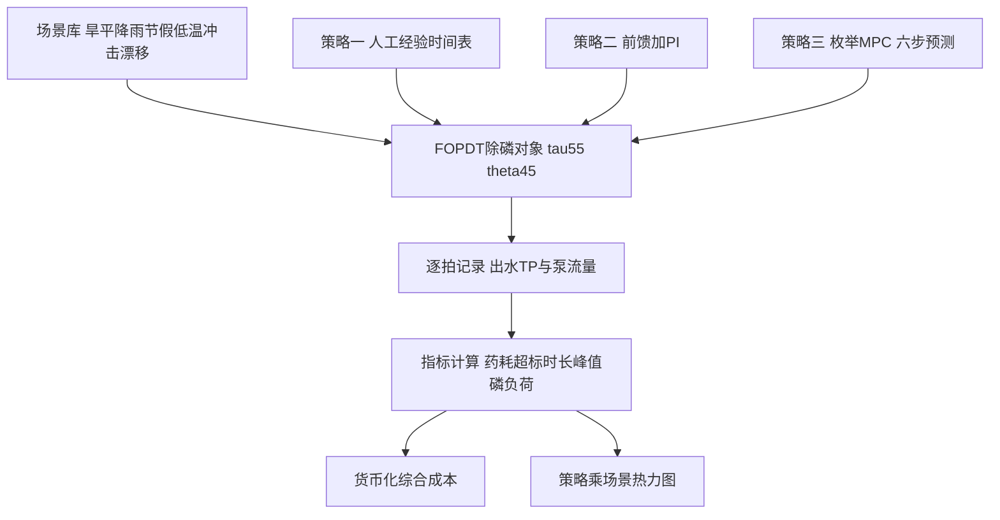
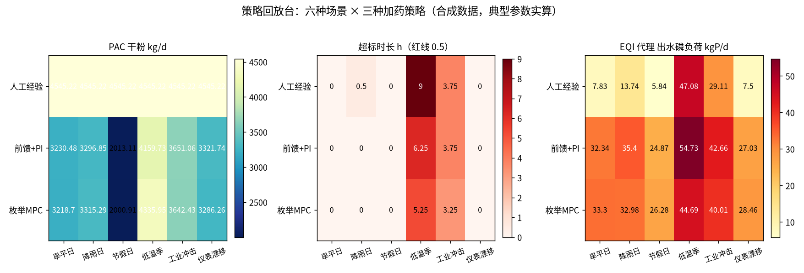

# 07-4 数字孪生与仿真验证：BSM 基准平台与轻量策略回放台

> **本章讲什么**：新控制策略能不能直接在真厂上试？当然不能——拿出水超标和全厂药剂费当试验费，谁也试不起。正确做法是先在电脑里造一座"影子水厂"跑一遍：这就是仿真验证，高端形态叫数字孪生。本章先讲学术界的统一考场 BSM（基准仿真模型，BSM1/2）：五格生物池+二沉池、144 天三种天气、ASM1 的 13 组分 8 反应、EQI/OCI 两把尺子；再介绍 GPS-X、WEST、SUMO、SIMBA# 等商业平台和开源工具；最后落地一个用 numpy 就能跑的轻量"策略回放台"，用六类场景回放人工、前馈+PI、MPC 三种策略，出一张策略×场景热力图。
> **读完能干什么**：能说清 BSM1 的考核构成和 EQI、OCI 为什么必须一起看；能区分商业仿真平台、数字孪生和轻量回放台各适合什么阶段；能照着场景库清单搭本厂的策略验证环境，读懂热力图为控制方案选型。
> **阅读时间**：约 40 分钟。配套实算图 1 张（六场景×三策略热力图）、对照表 5 张、可运行代码 1 份。

## 场景导入：PPT 上都节药 20%，真厂上见真章

控制方案的供应商 PPT 有个共同特点：节药率都写 15%~25%，出水曲线都贴着红线内侧优雅运行。可厂长只有一座厂、一年只有一次冬天、一次工业冲击也未必赶上——策略 A 和策略 B 到底谁好，在真厂上做对照实验要以年为单位、以风险为代价。

工程师的解法是**让时间在电脑里快进**：建一座数学模型的水厂，把旱天、雨天、寒潮、偷排排进去，让三种策略在完全相同的来水下各跑一遍，药耗、超标、污泥量当场出分。这不是新概念：航空发动机上天前要在数字台架上吞鸟、汽车量产前要撞几千台虚拟车；污水厂的"数字台架"就是 BSM 和各类仿真平台。

> **要点**：数字孪生不是一段漂亮的三维动画，核心是屏幕背后那套能吃真实数据、能复现工艺响应、能量化策略好坏的数学模型。

## 一、BSM 是什么：全世界污水控制论文的统一考场

BSM（Benchmark Simulation Model，基准仿真模型）是国际水协 IWA 牵头搞的一套"标准化考题"：以前张三说自己的控制器好、用自己的厂数据；李四说自己的更好、用另一组数据——没法比。BSM 把**厂的布局、来水数据、考核算法全部固定**，谁的策略拿上来都在同一座虚拟厂里跑，分数直接可比。

BSM 的工作始于上世纪 90 年代国际水协（IWA）的专门工作组，最早叫 COST 624/682 基准，后来固化为 BSM1（2008 年前后发布完整定义文件）。今天全世界污水控制算法的博士论文，十篇里有七八篇会先在 BSM 上跑基线：曝气控制、内回流优化、碳源投加、模型预测控制，都先在同一座虚拟厂里排队考试。理解 BSM 的意义不在于日常工作要用它，而在于知道"控制策略好不好"这件事在行业里有公认的、可复现的评价范式——这与 [08-5 M&V 节能量验证](../08-落地实施篇/08-5-节能率怎么算-效益测量与验证MV.md) 在真实项目层面追求的"同口径对比"，精神上完全一致。

### 1.1 BSM1 的构成

| 要素 | BSM1 规定 |
|---|---|
| 生物反应池 | 5 格串联：前 2 格缺氧（反硝化）、后 3 格好氧（硝化），每格完全混合 |
| 二沉池 | 10 层一维沉降模型，内回流与污泥回流固定回路 |
| 生物模型 | ASM1（活性污泥 1 号模型）：13 个水质组分、8 个生化反应过程 |
| 仿真时长 | 144 天：先稳态初始化，再连续喂入三种天气的来水文件 |
| 天气文件 | 旱天（dry）、雨天（rain）、暴雨天（storm）各一段，流量与浓度逐 15 min 给定 |
| 考核方式 | 出水约束违规次数/时长 + EQI（出水水质指数）+ OCI（运行成本指数） |

几个名词展开：

- **ASM1 的 13 组分 8 反应**：它把污水里的有机物和氮拆成 13 个状态变量（易/慢速生物降解有机物、颗粒/溶解性惰性物、自养/异养菌、氨氮、硝氮、碱度等），用 8 个反应过程（异养好氧生长、异养缺氧生长、自养菌硝化、水解、衰减等）描述它们之间的转化。除磷不在 ASM1 里（BSM1 原版考核 COD、氮、SS），化学除磷研究通常在 ASM2d 或外挂化学沉淀模块上做。
- **EQI（Effluent Quality Index，出水水质指数）**：仿真期内出水各污染物负荷（按 Q 加权积分）乘以各自权重后的总和，**越低越好**。
- **OCI（Overall Cost Index，运行成本指数）**：曝气能耗、泵耗、污泥产量、药剂投加、内外部回流等的加权总和，也是越低越好。

### 1.2 为什么 EQI 和 OCI 必须两张表一起看

这是 BSM 最深刻的设计：**单看任何一个指标都会被骗**。

- 曝气无限大、药剂无限投：出水趋近蒸馏水，EQI 极低，但 OCI 爆炸；
- 完全不曝气、不加药：OCI 趋近零，但 EQI 和违规次数爆表。

BSM 的全部控制研究，本质是在 EQI–OCI 这对矛盾之间找前沿（trade-off 曲线）。后面我们自己的轻量回放台也会原样继承这个思想：药耗、超标、出水磷负荷三张表一起报，再折算成一个综合成本，**绝不允许只报节药率**。

13 个组分不用背，按四大类理解就够了（下标含义：S 溶解性、X 颗粒性、B 生物量、I 惰性、A 自养）：

| 类别 | 代表组分 | 在模型里的角色 |
|---|---|---|
| 含碳有机物 | S_S 易降解、X_S 慢降解、S_I/X_I 惰性物 | 异养菌的"粮食"与不可降解残留 |
| 含氮物质 | S_NH 氨氮、S_NO 硝氮、S_ND/X_ND 有机氮、碱度 S_ALK | 硝化反硝化链条 |
| 微生物 | X_BH 异养菌、X_BA 自养菌 | 吃碳去氮的两类"打工人" |
| 衰减产物 | X_P 颗粒态惰性产物 | 与剩余污泥产量直接相关 |

8 个反应过程是：异养菌好氧生长、异养菌缺氧生长（反硝化）、自养菌好氧生长（硝化）、异养菌衰减、自养菌衰减、可溶性有机氮氨化、颗粒有机物水解、颗粒有机氮水解。每个过程用一个开关函数控制"条件满足才发生"——如溶解氧低于阈值才走反硝化、无溶解氧则好氧生长速率趋零。化学除磷的沉淀/絮凝过程不在 ASM1 内，研究时需外挂金属盐沉淀模块（与 Al/Fe 的络合、吸附、共沉淀经验式），这也是除磷仿真比碳氮仿真更依赖现场校正的原因。

EQI 的具体构成（BSM1 口径）：对仿真期内出水逐时刻的流量加权负荷积分，污染物包括 TSS、COD、BOD₅、TKN、硝氮等，各有单位环境权重；违规则单独统计超限时长和超标量（氨氮、TN、TP 等各有红线）。OCI 则汇总：曝气能耗（按 KLa 积分）、污泥回流/内回流/剩余污泥泵耗、污泥产量外运处置、化学药剂（碳源、金属盐、消毒剂）投加费等。做化学除磷专题时，可套用同样思想自定义两项：出水 P 负荷分指数和药剂—污泥分指数，与本章回放台的做法一致。

三份天气文件的设计也值得学：旱天文件是两周严格周期重复的典型市政负荷，用于稳态与基准评价；雨天文件在旱天基线上叠加两段持续约两天的雨水入流入渗（I/I），流量抬升、污染物被稀释；暴雨天文件额外叠加短时高强度峰，模拟初期冲刷与溢流风险。这种"基准+两类扰动"的三层结构，就是本章六类场景库的学术母版——先用无扰动基准比经济性，再用中等扰动比适应性，最后用极端事件比安全性。评价时先经旱天稳态初始化（约 100 天以上养熟菌群），再喂扰动文件，避免拿初始条件的瞬态差异冤枉策略。

BSM2 把边界从"厂"扩展到"全厂"：加上初沉、污泥浓缩、消化、脱水全流程，仿真拉长到 609 天以评估季节效应和污泥线策略；BSM2G 进一步纳入温室气体排放。工程选型不必追求 BSM2，知道"BSM1 考厂线、BSM2 考全厂"即可。

## 二、仿真平台与工具：从商业软件到开源代码

| 平台 | 出身/性质 | 特点 | 适合谁 |
|---|---|---|---|
| GPS-X（现在的 Totaltreat 平台） | 加拿大 Hydromantis，商业 | 模板丰富、污水处理占有率高、自带 BSM 布局 | 设计院、大集团方案比选 |
| WEST | 比利时 MIKE DHI，商业 | 拖曳式建模、控制器实验方便 | 科研院所、工艺优化咨询 |
| SUMO | 丹麦 Dynamita，商业 | 模型开放可见、易用性近年提升快 | 想深入模型机理的工艺团队 |
| SIMBA# | | 德国 ifak，商业 | 与自控/控制策略联仿见长 |
| bsmpss | 欧盟资助的开源 MATLAB/Octave/Simulink 工具链 | 免费实现 BSM1/BSM2 基准，代码公开可改 | 学生、算法研究、预算有限的团队（了解即可） |

> 💡 **商业平台贵在哪，又便宜在哪**
>
> 贵的是 license（单席位年费数万到十几万元）和定制建模服务；便宜的是试错成本：一套化学除磷方案在 GPS-X 里改投加点、改摩尔比、改控制策略是几小时的事，在真厂上是几周的风险工期。但注意：**商业平台出厂自带的参数是"典型市政污水"，直接搬来算本厂，定量结果不可信**。模型必须用本厂 1~3 个月的历史数据做校正（calibration）和验证（validation），关键参数（异养菌产率、沉降参数、化学计量系数）要逐个与实测对账，这一步的工作量远超买软件本身。

### 2.1 用商业平台建一座"本厂"：数据与校正流程

买平台只是开始，真正决定结果可信度的是建模流程：

| 阶段 | 主要工作 | 典型周期 |
|---|---|---|
| 数据收集 | 2~4 周逐时水量水质、污泥浓度 MLSS、回流比、曝气、排泥、温度 | 1~2 个月历史数据 |
| 稳态校核 | 二沉污泥平衡、进出水 COD/氮物料闭合 | 1~2 周 |
| 参数校正 | 调化学计量/动力学参数（产率 Y、衰减 b_H、硝化 μ_A 等）与二沉沉降参数 | 3~6 周 |
| 独立验证 | 换一段没参与校正的数据盲跑，误差判据通常 <10%~15% | 2~4 周 |
| 情景计算 | 提标、扩容、加药点改造、控制策略比选 | 按需 |

最容易省略也最不该省略的是"独立验证"：用同一批数据既调参数又验收，误差 2% 也不说明问题——这和机器学习里必须分训练集/测试集是一个道理（见 [06-2 机器学习速成](../06-AI建模篇/06-2-机器学习速成-污水厂版.md)）。

## 三、上不了 BSM 也能办事：轻量"策略回放台"

绝大多数污水厂的决策问题用不上 ASM1 的 13 个组分。厂长真正要回答的问题很朴素：

- 新策略在本厂几种典型日子里，药耗差多少、会不会超标？
- 雨季、寒潮、偷排来时，自动系统比人工强多少？
- 仪表万一漂了，三种策略谁先翻车？

为此可以搭一个**轻量回放台**：单回路 FOPDT（一阶加纯滞后）对象 + 固定场景库 + 可插拔策略。它不追求机理完整，只保证三件事：场景一致（所有策略吃同一份水）、口径一致（指标算法相同）、数字可复现（固定随机种子）。本章配套脚本 `scripts/fig07_04_scenario_heatmap.py` 就是这样一个实现，纯 numpy/pandas/matplotlib，约 300 行。



对象与 07-2/07-3 同口径：τ=55 min、θ=45 min 的慢回路（投加点在生物池出水端），15 min 一拍，每场景 1 天 96 拍，前接 32 拍平稳预热消除初值；化学计量沿用 K_CHEM=0.088、泵 60~2000 L/h、变化率 150 L/h/拍。三个策略共用同一个分析仪（滤波、尖峰剔除）和同一套执行器约束，保证比较公平。

### 3.1 六类场景：把"典型一年"压进六天

| 场景 | 设定（相对基准旱平日的扰动） | 专门考什么 |
|---|---|---|
| ① 旱平日 | 早晚双峰的标准市政负荷 | 基准药耗与贴线能力 |
| ② 降雨日 | 10~16 点流量 +45%，浓度先冲顶 +1.0 再稀释 −0.9 | 初期雨水冲顶 + 稀释段过投 |
| ③ 节假日 | 水量 −22%，峰幅减半、峰时后移 2 h | 固定策略的过量投加 |
| ④ 低温季 | 化学效率 −20%（β≈2.5）、背景负荷 +0.3 | 模型失配适应（MPC 换季再辨识） |
| ⑤ 工业冲击 | 13~16 点排口 TP 冲到约 5.5、水量 +15%，MPC 有排产预报 | 预见期价值 |
| ⑥ 仪表漂移 | 13~17 点在线 TP 仪缓漂 +0.30 后跳回 | 假数据防御与残差校核 |

六个场景共用同一份基准日数据（固定随机种子序列），场景之间只差各自的扰动，避免"换策略顺便换了来水"的比较陷阱。

### 3.2 三种策略的回放设置

- **人工经验**：老师傅"一把尺"，平时 1700 L/h、6:30~10:00 加到 1950，不看任何仪表；
- **前馈+PI**：07-2 同款，前馈摩尔比 + 乘性 PI（0.8~1.2，kp=0.6、Ti=80 min）；
- **枚举 MPC**：慢回路设置，H=6 拍（90 min，跨过 θ=45 后再看 3 拍）、9 个候选；预报为"当前实测+典型日形状增量"（工业冲击用排产真值±2%）；DMC 偏差校正限幅 ±0.06（仪表漂移超过模型残差合理范围即不再采信并报警）；低温季使用换季再辨识后的投加系数。慢回路一次辨识的系数同样准确：a=0.7569、b=−0.02127、g=0.2417（FOPDT 理论值 0.7613、−0.02101、0.2387），RMSE=0.0145 mg/L。

### 3.3 回放主循环：策略是可插拔的

脚本的核心是一个对所有策略通用的回放循环，策略差异只体现在"这一拍要多少药"这一行，因此新增策略（如强化学习代理）不需要动对象和指标代码：

```python
for j in range(WARM, M):                     # 逐拍推进 M为预热加96拍
    y = plant_step(y, dose_lag, TP_a_lag, k_eff) + noise   # 真出水
    yf = analyzer.read(y + noise + drift[j])              # 仪表三关
    u_ff = mgL_to_Lh(max(0, TP_a[j]-0.30)/0.088, Q[j])    # 前馈
    if strategy == "manual":
        u_ask = 1950.0 if 6.5 <= hour < 10 else 1700.0
    elif strategy == "FFPI":
        u_ask = u_ff * pi.update(yf - 0.30)                # 乘性PI
    else:
        u_ask = mpc_enumerate(yf, j, ux, ...)             # 9候选枚举
    ux[j] = constrain(u_ask, ux[j-1])      # 60至2000与150每拍约束
    y_rec[j-WARM], u_rec[j-WARM] = y, ux[j]
```

这种结构也天然适合在真厂复用：上线时把 plant_step 换成真仪表读数、把 u_ask 写进 PLC 设定值寄存器，控制器一侧的代码一行不改——仿真环境因此也是控制代码的测试床，离线验证过的策略版本才有资格进影子运行。

## 四、回放结果：一张热力图和三笔账



*数据为合成/典型参数实算。三面板依次为药耗、超标时长、出水磷负荷（EQI 代理）；颜色越浅越好。注意人工策略 EQI 最低但药耗最高——这正是 EQI/OCI 必须联看的现场版。*

逐场景明细（药耗为 PAC 干粉 kg/d；超标为超 0.5 mg/L 的小时数；磷负荷为流量加权出水 P，kgP/d；综合成本为教学口径货币化，元/d）：

| 场景 | 人工（药耗/超标/峰值/成本） | 前馈+PI | 枚举 MPC |
|---|---|---|---|
| 旱平日 | 4545 / 0 / 0.29 / 10211 | 3230 / 0 / 0.39 / 8757 | 3219 / 0 / 0.44 / 8785 |
| 降雨日 | 4545 / 0.5 / 0.60 / 13042 | 3297 / 0 / 0.46 / 9070 | 3315 / 0 / 0.48 / 8975 |
| 节假日 | 4545 / 0 / 0.31 / 10099 | 2013 / 0 / 0.34 / 5721 | 2001 / 0 / 0.50 / 5774 |
| 低温季 | 4545 / 9.0 / 1.13 / 57409 | 4160 / 6.25 / 1.05 / 43258 | 4336 / 5.25 / 1.06 / 38075 |
| 工业冲击 | 4545 / 3.75 / 1.54 / 30152 | 3651 / 3.75 / 1.44 / 28989 | 3642 / 3.25 / 1.02 / 26322 |
| 仪表漂移 | 4545 / 0 / 0.31 / 10192 | 3322 / 0 / 0.34 / 8656 | 3286 / 0 / 0.44 / 8659 |

货币化口径（教学示例，实际按地方价格与环评口径）：药剂 2000 元/t 干粉、化学污泥处置 300 元/tDS（产泥 0.5 kgDS/kg 干粉）、出水磷环境代价 56 元/kgP（环保税水污染物当量上限示意）、红线超标罚款折算 5000 元/h。

六场景合计：

| 策略 | 药耗合计 kg | 药耗指数（人工=100%） | 超标合计 h | 磷负荷合计 kgP | 综合成本合计 元 |
|---|---|---|---|---|---|
| 人工经验 | 27271 | 100.0% | 13.25 | 111.1 | 131105 |
| 前馈+PI | 19673 | 72.1% | 10.00 | 217.0 | 104451 |
| 枚举 MPC | 19800 | 72.6% | 8.50 | 205.7 | 96590 |

## 五、这张表该怎么读：五条不带感情的结论

1. **基准工况三者打平、复杂工况拉开差距**。旱平日前馈+PI 与 MPC 综合成本 8757 对 8785，差异可以忽略；MPC 的 8% 总成本优势全部来自低温季（38075 对 43258）和工业冲击（26322 对 28989）两个"难题场景"——为复杂局面付费，与 07-3 的结论闭环。
2. **预报的价值被工业冲击场景量化了**：三种策略药耗接近，但 MPC 峰值 TP 1.02，只有前馈+PI（1.44）和人工（1.54）的约 70%，超标时长 3.25 h 对 3.75 h；排产数据（一个企业微信群就能收集）的价值超过算法本身的复杂度。
3. **人工策略的 EQI 最低是个陷阱**：人工出水磷负荷仅 111 kgP（自动策略约 206~217），因为它把出水常年压到 0.07~0.11——靠多投 39% 的药"买"出水。BSM 式评价把 OCI（这里是药耗和污泥）摆上来后，人工的综合成本反而最高 131105 元。向厂长汇报时只给一个指标的人，不是不懂就是有立场。
4. **自动策略共省约 28% 药耗、超标更少**：前馈+PI 和 MPC 药耗指数 72.1%/72.6%，正好落在 03 篇给出的除磷节药 15%~30% 经验区间上沿；注意代价是平均出水 TP 从 0.1 量级提高到 0.3 附近——**节药的本质是把"保险过量"变成"贴线运行"，前提是控制系统真的可靠**。
5. **再强的算法也怕假数据**：仪表漂移场景里，MPC 靠残差限幅少投了约 1% 的药、没有被完全带偏，前馈+PI 追着假数把平均 TP 压到 0.255，但两者都受了影响；根本解法只有双表/化验校核。自动策略的上限是模型，下限是仪表。

> ⚠️ **回放台的数字能写进招标承诺吗？不能**
>
> 这套 FOPDT 回放台用于**策略选型和团队训练**，回答"该投前馈还是上 MPC、该配什么仪表和预报"；它的药耗绝对值是合成口径，不能作为节药保证。写进合同的节药率必须来自真实厂的 M&V 测量（基线回归+对比期，见 [08-5 节能率怎么算](../08-落地实施篇/08-5-节能率怎么算-效益测量与验证MV.md)）。仿真能做的是排除烂方案、缩小试点范围，不能替代实测。

### 5.1 把本厂场景库做实的清单

- [ ] 从两年 SCADA 历史中按规则捞典型日：旱平日取中位数曲线，雨日按累积雨量分 3 档；
- [ ] 真实事件回放：上游偷排、工业批次排放、泵站联启导致的流量台阶，各留 2~3 个原始片段；
- [ ] 季节工况：低温季（水温 ≤12 ℃）单独建效率参数，雨季高 MLSS、夏季高负荷各一档；
- [ ] 设备事件：单泵检修（投加上限临时下降）、仪表冻值/漂移/标定、通信中断各做故障注入文件；
- [ ] 未发生但必须防：设计暴雨重现期、双路电源切换、药剂断供；
- [ ] 每个场景附一张人工操作时间轴（老师傅实际怎么拧的泵），回放时一并对比；
- [ ] 场景文件版本化管理：策略升级后所有旧场景必须重跑，防止改好一个场景改坏三个。

这套场景库在项目里有三个用途：投标阶段用合成场景做方案比选（不承诺绝对值）；调试期当操作员培训沙盘（新人在仿真上先练手再碰真系统）；投运前做联锁演练脚本（下一章的验收流程会直接用到）。

## 六、从轻量回放台到在线数字孪生的四级台阶

| 级别 | 形态 | 数据连接 | 用途 |
|---|---|---|---|
| L0 离线回放台 | FOPDT+场景库，本章脚本 | 无，合成/历史数据 | 策略选型、参数沙盘、培训 |
| L1 机理仿真模型 | GPS-X/WEST 全流程 ASM 模型，经本厂数据校正 | 离线，定期导入历史 | 改扩建方案、工艺瓶颈分析 |
| L2 在线影子孪生 | 模型实时吃 SCADA 数据，持续滚动预测"如果不动会怎样" | 单向实时 | 异常预警、操作员参谋 |
| L3 闭环优化孪生 | 孪生体输出直接喂给 MPC，模型在线自适应更新 | 双向实时 | 07-1 的 L3 架构底座 |

每一级都以前一级的可信度为前提。行业里最常见的失败是 L1 没做扎实（模型没校正）就直接包装成 L3 招标——交付时只能做展示用。稳妥路线与控制架构投运同构：**离线回放→影子在线→限定窗口闭环**。

> 💡 **场景库比模型精度更值钱**
>
> 建回放台时最容易把精力全花在对象模型上，实际上工程收益更大的是把场景库做实：翻本厂两年的 SCADA 历史，把真实的雨天曲线、寒潮周、上游偷排事件、仪表故障段逐个做成场景文件，再补上没遇到过但必须防的（极端暴雨、双泵检修）。策略在 20~30 个真实场景上全过一遍，发现的问题比在一个"平均日"上把模型调到小数点后三位有价值得多。BSM 之所以是 BSM，首先是因为它有那三份天气文件。

## 七、仿真建模的三个常见误区

> ⚠️ **误区一：把三维可视化当成数字孪生**
>
> 招标里最常见的偷换概念：用 BIM/SCADA 数据驱动一个水厂三维画面，管道里有水流动画、风机能旋转，就叫数字孪生。三维展示只是皮肤，孪生的骨头是**经过本厂校正、能做反事实推演的动态模型**——回答不了"如果把 DO 设定值降 0.5，出水氨氮会怎样"的，再炫也只是大屏装修。

> ⚠️ **误区二：一组参数跑全厂，不做分区校正**
>
> 多系列、多池体的厂，各池污泥龄、水温、进水分配都有差异，用全厂区均值参数会让每个池都"算个大概"。仿真粒度要和决策粒度一致：研究全厂负荷分配，至少做到系列级模型；研究单点加药，至少做到池体级。

> 💡 **误区三：仿真只在投标前用一次**
>
> 仿真模型最划算的用法贯穿项目全程：投标做方案比选、调试做参数沙盘、投运做影子对照、运行期每次工艺变更（换药剂、改排泥、调回流）前先在模型上试。模型在持续使用中被数据反复校正才会增值；建成即封存的模型，第二年就和真实厂成了两个厂。

### 7.1 投入产出的现实口径

- 轻量回放台（本章脚本级）：自有工程师 1~2 周人力成本，适合每个厂都做，零软件费；
- 商业平台单点建模：软件 license 加建模服务，单体项目通常十几万到几十万元，提标改造/节能审计型项目 1 个项目期内即可回本；
- 在线孪生：与自控改造、数据中台打包，百万级投入，适合 20 万吨以上或集团化厂的长期平台化建设。
- 判断标准很简单：**模型回答的决策问题值多少钱**。一个改加药点的方案优化若涉及百万级改造投资，花几十万先做仿真极其划算；只是为了中控室多一块屏幕，则没有任何性价比。

## 本章小结

1. BSM 是污水控制策略的统一考场：BSM1 为 5 格生物池（2 缺 3 好）+10 层二沉池、ASM1 的 13 组分 8 反应、144 天旱/雨/暴雨三种天气，以出水违规、EQI（水质）、OCI（成本）联合评分；BSM2 扩展到全厂污泥线与季节尺度。
2. GPS-X、WEST、SUMO、SIMBA# 是主流商业平台，bsmpss 为开源研究工具；平台参数必须用本厂 1~3 个月数据校正后定量结果才可信。
3. 轻量策略回放台（FOPDT 对象+固定场景库+可插拔策略）足以支撑选型：六类场景（旱平、降雨、节假日、低温、工业冲击、仪表漂移）共一份基准日，三策略同口径回放。
4. 回放实算：人工/前馈+PI/MPC 药耗指数为 100%/72.1%/72.6%，超标合计 13.25/10.00/8.50 h，综合成本 131105/104451/96590 元；MPC 的优势集中在低温失配与有预报的工业冲击（峰值 1.02 对 1.44 mg/L），基准工况与前馈+PI 打平。
5. EQI 与 OCI 必须联看（过量投加会让单看水质的结论完全反转）；仿真数字只用于选型与培训，合同节药率以真实 M&V 为准；数字化路径按离线回放→在线影子→闭环孪生逐级走，场景库建设比模型调精更值钱。

---

**上一章**：[07-3 MPC 模型预测控制怎么落地](07-3-MPC模型预测控制怎么落地.md)
**下一章**：[08-1 项目实施全流程：从调研到验收](../08-落地实施篇/08-1-项目实施全流程-从调研到验收.md)
