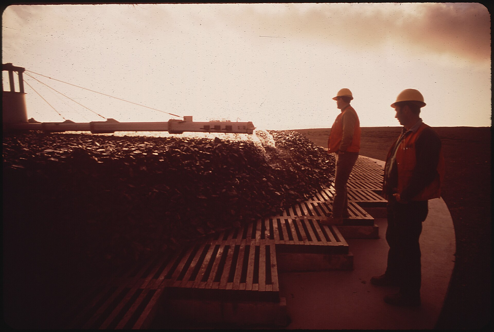
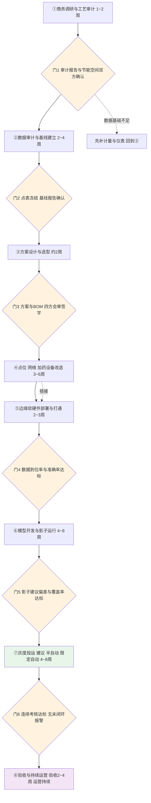
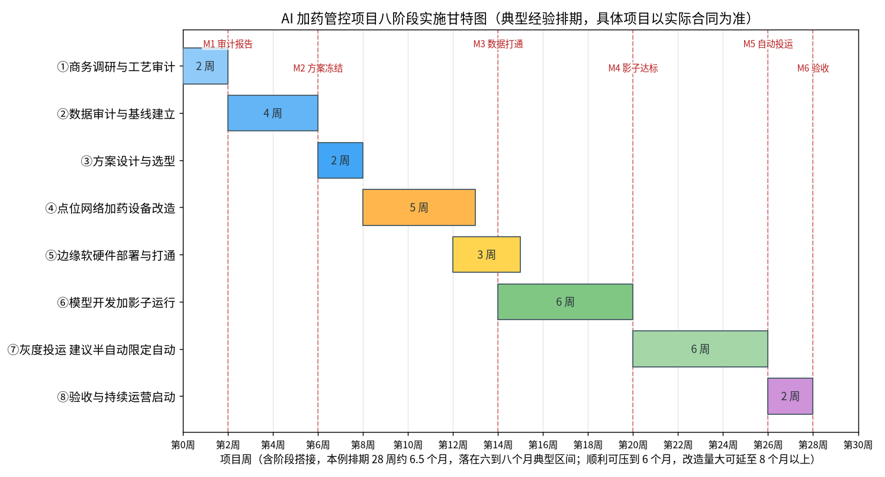

# 08-1 项目实施全流程：从调研到验收

> 本章讲什么：把一个 AI 加药项目从第一次进厂到验收后运维的全过程，拆成八个阶段讲透——每阶段给你输入、关键动作、交付物、甲方该谁配合、要多久、最常踩的坑。
>
> 读完能干什么：拿着本章的阶段清单和 RACI 表，就能排出一份让厂长、自控科、化验室都认的项目计划；对方拍胸脯说"两个月包上线"时，你知道该追问什么。
>
> 阅读时间：约 28 分钟。

---

## 场景导入：一个被"两个月上线"拖成一年的项目

某 8 万吨厂的改造合同写得很漂亮：乙方承诺"合同签订后两个月内上线运行"。实际发生了什么？第一个月乙方进厂要数据，发现 SCADA 历史库只存 45 天、化验台账在化验员私人电脑里、两台主力加药泵的冲程只能现场手拧；第二个月补装仪表、申请网络科开策略，网络科一句"工控网不允许接任何外部设备"又停了三周；等数据勉强采全，冬天都快过去了——而节药空间最大的恰恰就是冬天。

项目管理里有句老话：**慢的不是干活，是等**。等数据、等停产窗口、等审批、等决策。AI 加药项目涉及工艺、仪表、自控、IT、采购、运行六个部门，任何一个环节没想清楚，工期就翻倍。本章给的八阶段法，就是把这些"等"提前排进计划里。

*真实照片：工作人员在污水厂滤池旁现场巡检（美国环保署 DOCUMERICA 历史照片，美国国家档案馆藏编号 542989，公有领域）。工艺审计就是从这样看现场、摸设备开始的。*

---

## 一、八阶段全景：每阶段都有一道"门"

成熟交付团队和草台班子的区别，是前者把项目做成"过门仪式"：每一阶段结束有明确交付物和签字确认，门不过不进下一阶段。八阶段的典型工期与门准则如下（详细动作从第二节起逐个展开）：

注意图中的两条搭接（④与⑤、改造尾期即可进场部署）和一条回路（门1发现计量基础不牢，先补仪表再做基线）。下图是按典型节奏排出的甘特图，八段首尾搭接后约 28 周、即 6.5 个月，落在行业常见的六到八个月区间：顺利、改造量小的厂可压到 6 个月；改造量大、验收严格或跨了春节/汛期窗口的厂，延到 8 个月以上也不奇怪。

*数据为典型项目经验排期（合成实算，具体项目以实际合同为准）：红色虚线 M1~M6 是六个里程碑节点，每阶段色块内标注该阶段持续周数。*

| 阶段 | 典型工期 | 甲方主配合部门 | 本阶段最关键的一句话 |
|---|---|---|---|
| ①调研与工艺审计 | 1~2 周 | 厂领导、生产科 | 不见班组不算审计，不数吨桶不算核账 |
| ②数据审计与基线 | 2~4 周 | 自控、化验、仓库 | 基线不签字，节药率永远扯不清 |
| ③方案设计与选型 | 约 2 周 | 总工、采购、IT | 泵能不能远程调，这时候必须查清 |
| ④现场改造 | 3~6 周 | 设备、电气、土建 | 九成工期风险藏在停电停水窗口里 |
| ⑤边缘部署打通 | 2~3 周 | 自控、网络科 | 数据不到 99% 准确，模型不许开跑 |
| ⑥模型+影子运行 | 4~8 周 | 工艺、运行班 | 没陪运行员上过夜班，模型不算落地 |
| ⑦灰度投运 | 4~8 周 | 运行班、工艺 | 一次只升一级，不行立刻退回去 |
| ⑧验收与运营 | 2~4 周+持续 | 全厂 | 验收写测量方法，运营写迭代责任 |

---

## 二、阶段① 商务调研与工艺审计（1~2 周）

- **输入**：环评与排污许可证、设计说明书与竣工图、近 12 个月水量水质报表、药剂采购与出入库台账、设备清册、厂区平面图。
- **关键动作**：① 走完全流程管线（进水→生物段→深度段→出水），核对实际工艺与图纸差异；② 蹲点加药间，抄主力计量泵铭牌排量、冲程、频率，数吨桶数量与余量（[03-2](../03-问题与成本篇/03-2-污水厂成本账本-药剂到底花了多少钱.md) 的核账七招直接用）；③ 跟一个完整交接班，分别访谈白班、夜班班长——同一件事两班说法常常不一样；④ 核对排放限值是一级 A 还是准 IV 内控线，取近半年超标临界次数；⑤ 摸工业水占比与冲击规律（哪几家企业、什么时段排什么）。
- **交付物**：工艺审计报告（含加药点 P&ID 草图）、节能空间初算、项目建议书。
- **甲方配合人**：厂长或生产副厂长（拍板人）、工艺主管、运行班长。
- **常见坑**：只见厂长不见班组，拿到的全是"管理口径"；台账只有全年总数没有分月数；工业园区厂隐瞒偷排冲击历史；设计水量 5 万、实际只跑 2 万却仍按设计参数配药。

> ⚠️ **老工程师的坑**：审计周一定要安排一天夜班。加药过量、仪表异常、应急切换这些"故事"大半发生在夜里——白班看到的是表演，夜班看到的才是运行。某厂白班台账 PAC 按 30 L/h 记得工工整整，夜班现场实测 48 L/h，因为后半夜怕出水波动"宁多勿少"，光这一个差就是年几十万。

---

## 三、阶段② 数据审计与基线建立（2~4 周）

这是全项目最容易被压缩、也最不该压缩的阶段。模型上限由算法决定，模型下限由数据决定，而污水厂的数据下限通常比想象低。

- **输入**：SCADA/历史库导出权限、在线仪表清册与校准记录、化验室原始记录、药剂出入库与盘点记录。
- **关键动作**：
  1. **点表盘点**：逐点核对名称、量程、单位、采样周期、归档周期、所在 PLC 与通讯地址（[05-1](../05-数据篇/05-1-数据从哪来-点位表与数据字典.md)）；
  2. **数据质量审计**：统计坏值、冻结、超量程、缺失的比例（[05-2](../05-数据篇/05-2-数据质量治理-脏数据的九种死法.md) 的九种死法逐个查），关键控制点（流量、TP、液位、泵反馈）质量不达标要先治理；
  3. **仪表校核**：在线 TP/氨氮仪与化验室国标法做至少 3~5 次同步比对，DO/pH 用便携表比对，流量计查校准证书与上下水范围；
  4. **加药审计**：用计量泵理论排量（冲程×频率×标定系数）反推周投加量，与仓库倒挤消耗交叉验证，差距超 10% 先做计量整改；
  5. **建立基线**：近 12 个月药耗与水量、污染负荷、水温的关系，输出基线报告与 M&V 方案初稿（方法见 [08-5](08-5-节能率怎么算-效益测量与验证MV.md)）。
- **交付物**：点位表与数据字典（四方会签版）、数据审计报告、仪表比对记录、基线报告。
- **甲方配合人**：自控/仪表班、化验室主任、仓库管理员。
- **常见坑**：化验数据拿不到（原始记录本锁在化验员抽屉、Excel 在私人电脑）；SCADA 历史库默认只存 30~90 天，老数据早就被覆盖；在线分析仪装了三年试剂泵管从没换过，数是"修过的"；多点时间戳不同步，特征对不齐。

> 💡 **现场经验**：基线报告一定要在阶段②结束时由甲方书面确认并"冻结"口径——用哪些月份、剔除哪些异常天（停产大修、极端暴雨、事故工况）、药价取哪一期框架价。基线不冻结，项目验收时双方一定各拿一版本账，节药率从 22% 能争到 8%。

---

## 四、阶段③ 方案设计与选型（约 2 周）

- **输入**：审计与基线报告、预算边界、甲方 IT/OT 安全制度、集团统一选型品牌库（如有）。
- **关键动作**：
  1. 定自动化等级：只看（L0）、建议（L1）、半自动（L2）、限定自动（L3），等级与联锁设计成正配套（[08-3](08-3-安全联锁与人工接管.md) 是红线）；
  2. 编制**联锁矩阵**和控制点表：哪些点只读、哪些点 AI 可写、上下限幅多少、看门狗超时多少秒；
  3. BOM 选型与询价：仪表、网关、边缘服务器、泵改造机构（典型 BOM 见 [08-4](08-4-三个典型厂案例-方案BOM与ROI.md)）；
  4. 出施工图：P&ID、点位图、网络拓扑图、柜内布置图、电缆清册；
  5. 投资概算与 ROI 复算（用阶段②的真实基线，不用行业平均值）。
- **交付物**：技术方案、施工图纸、BOM 与报价、联锁矩阵、ROI 测算表，经工艺/自控/仪表/算法四方会审签字。
- **甲方配合人**：总工程师、自控主管、采购、信息（网络）科、安全科。
- **常见坑**：加药泵不支持远程调节（机械冲程手动锁定，必须加电动冲程机构或换泵，常见漏项，一台改造成本 0.3~0.6 万元起）；网络科一句"不让接外网"否决云上传方案，此时必须有"边缘自治+单向光闸"备选；仪表一味选最低价，上线后维护费吃掉节药收益；PLC 点位不留 15%~20% 余量，二期加泵要换主机。

---

## 五、阶段④ 点位、网络、加药设备改造（3~6 周）

这是全项目唯一"动土建"的阶段，也是工期波动最大的阶段。

- **输入**：会审签字的图纸与 BOM、到货设备、动火/动土/受限空间作业票制度。
- **关键动作**：仪表安装与取样系统施工（取样点代表性、回流、防冻）；电缆桥架敷设与校线；PLC 加模块、网关上电；加药泵远程调节机构改造；工业网络分区设备（交换机、防火墙/网闸）安装；北方项目取样水管与加药管线伴热保温。
- **交付物**：安装记录、校线记录、隐蔽工程照片、绝缘/接地测试记录、单体调试记录。
- **甲方配合人**：设备科、电气班、土建、安全员。
- **常见坑**：

| 坑 | 现象 | 预防动作 |
|---|---|---|
| 取样管冻堵 | 北方冬季 TP 仪取不到样，数据整段冻结 | 取样管全程电伴热+保温棉，回水管留坡度 |
| 强弱电同桥架 | 4-20mA 信号规律性跳变，查不出干扰源 | 信号线与动力缆分层分槽，屏蔽层单端接地 |
| 腐蚀环境接插件 | 加药间端子半年锈死，通道时有时无 | 端子镀金/镀锡加热缩套，柜内除湿加热 |
| 开孔碰生产 | 二沉池配水井开孔只能等停水 | 阶段①就摸排全年停水窗口，写进总进度计划 |
| 泵改造不带旁路 | 改造期间加药只能停，出水风险大 | 先装并联旁路与手动机构，再切主控 |

> ⚠️ **老工程师的坑**：改造阶段的安全事故往往和 AI 无关、但会把项目拖死。加药间地面 PAC 积液湿滑、PAC/PAM 稀释区腐蚀刺鼻、碳源罐区有窒息风险——施工队进厂第一天必须完成厂级+车间级两级安全教育，作业票一天一开，监护人不到位不开工。

---

## 六、阶段⑤ 边缘软硬件部署与打通（2~3 周）

- **关键动作**：机柜就位上电；部署时序库、规则引擎、模型容器（架构细节见 [08-2](08-2-系统架构与边缘部署.md)）；逐协议对接（Modbus RTU/TCP、OPC UA、S7）；按点表做地址映射与量程核对（AI 侧 0~350 L/h、PLC 组态 0~500 L/h 这类事故就发生在这一步）；端到端联调，云端看板同步；**断网自治测试**：拔外网，验证边缘侧采集、看板与安全控制全部不受影响。
- **交付物**：部署文档、联调记录、数据打通确认单（逐点给出到位率、准确率、时间戳偏差）、断网测试记录。
- **门准则**：关键控制点数据到位率 ≥ 99%、量程核对零差错、断网 30 分钟本地控制无扰动，才允许进入模型阶段。
- **常见坑**：寄存器地址被别的程序复用；双方时区一个用北京时间一个用 UTC；PLC 程序无注释、原集成商联系不上；到位率统计 95% 看着挺高，缺的恰好是 TP 和泵反馈两个关键量。

---

## 七、阶段⑥ 模型开发与影子运行（4~8 周）

模型不是写完就上，而是先"只动嘴不动手"——这就是影子运行（Shadow Mode）：AI 的建议值实时算出来、记录下来、和人工实际投加并排对比，但**不接执行机构**。

- **关键动作**：特征工程与数据集冻结；模型训练、回测与误差分析；机理规则兜底（灰箱结构，[06-6](../06-AI建模篇/06-6-机理加数据-灰箱混合模型最落地.md)）；控制器在历史回放或孪生环境验证（[07-4](../07-控制优化篇/07-4-数字孪生与仿真验证-BSM基准平台.md) 的 BSM 思路）；影子上线，每日出对比报告；运行员开始"跟建议吵架"——每条不采纳都要记原因，原因反哺迭代。
- **交付物**：模型说明书（输入输出、适用工况、机理规则、已知失效模式）、回测报告、影子运行对比报告（建议偏差、覆盖率、反事实节药潜力）。
- **门准则**：建议值与最终合理投加量偏差稳定在 ±10% 以内、覆盖 90% 以上运行工况（至少经历一次水质冲击或大水量波动）、运行员信任度调查通过。
- **常见坑**：影子期只挑了平稳的秋天，没覆盖冬季低温和雨季冲击；训练数据特征穿越（把出水结果当输入用）；模型建议一天变几十次，运行员无法执行也不敢信；影子报告只报"平均省多少"，不报最差一天偏差多少。

> 💡 **现场经验**：影子阶段最有价值的产物不是模型，是那本《不采纳原因台账》。运行员不采纳建议的理由（仪表刚标定、这批药浓度不对、上游今天检修），八成是模型里缺失的特征或规则。把这本台账逐条消化完，模型才真正长在了这座厂的运行经验上。

---

## 八、阶段⑦ 灰度投运：建议→半自动→限定自动（4~8 周）

灰度的核心是"一次只升一级、每级有观察期和退路线"，三级节奏（与 [07-1](../07-控制优化篇/07-1-从开环建议到闭环控制-三种架构.md) 的三种架构一一对应）：

| 级别 | 系统行为 | 典型观察期 | 升级条件 | 回退条件 |
|---|---|---|---|---|
| L1 建议 | AI 只在看板给建议值，运行员手动执行 | 1~2 周 | 建议采纳率 ≥ 70%，无安全事件 | 建议偏差连续 2 天 >15% |
| L2 半自动 | AI 给值、运行员一键确认后下发执行 | 2~3 周 | 出水稳定、节药率达承诺下限 | 出水指标进预警区或联锁动作 ≥2 次/周 |
| L3 限定自动 | 限幅区间内自动闭环，超限仍转人 | 2~3 周+陪产 | 连续 2~4 周考核达标 | 任一硬联锁触发、出水 TP/氨氮越预警线 |

- **关键动作**：每级开始前做一次异常演练（仪表坏值、通讯中断、泵故障，清单见 [08-3](08-3-安全联锁与人工接管.md)）；每级结束出评估报告，由甲方项目负责人签字才升级；L3 初期仍安排 2~4 周陪产，工程师与运行员同班。
- **常见坑**：领导参观前一天直接从 L1 切到 L3"表演"；考核只看节药率不看出水指标，导致运行员偷偷把限幅放宽；回退按钮藏在三层菜单里，紧急时刻找不到。

---

## 九、阶段⑧ 验收与持续运营

- **验收（2~4 周）**：连续 1~3 个月考核期，按 [08-5](08-5-节能率怎么算-效益测量与验证MV.md) 的基线修正方法算节药率，同时考核出水达标率、联锁投用率、系统可用率；验收会演示全量异常演练，而不是只演正常工况。
- **培训（分三层，全程留痕）**：管理层看报表与考核口径（2 学时）；工艺工程师懂模型边界、会改参数（8 学时+实操）；运行员会用看板、会切换、会响应报警卡（4 学时+现场实操+考试，签到表与试卷存档）。
- **持续运营**：质保期与运维 SLA（响应时限、到场时限、模型再训练周期）写进合同；每季度模型漂移评估、每年用新数据再标定基线；甲方培养一名"AI 运行员"作为内部接口人。
- **交付物**：验收报告（附考核期数据与计算书）、培训记录、运维手册、应急预案与值班响应卡、资产与账号移交清单。
- **常见坑**：合同只写"节药率不低于 15%"却不写测量方法与争议处理；培训只发 PPT 不考试，三个月后没人会用；质保到期后模型再没人管，漂上一年节药效果归零。

---

## 十、工期风险地图：最容易丢的那几周

把几十个项目的延期记录归一下类，八成工期超支来自下表这六类风险，且全部可以前置化解：

| 风险 | 发生概率 | 对工期影响 | 前置对策 |
|---|---|---|---|
| 历史数据不全、化验记录要不出来 | 高 | 延误 1~4 周 | 阶段①就发数据清单和账号申请模板，必要时先补 4~6 周人工记录 |
| 关键仪表进口货期长 | 中高 | 延误 2~6 周 | 阶段③当天锁型号下单，TP/硝态氮分析仪常见货期 4~10 周 |
| 加药泵无法远程调节 | 中高 | 改造阶段 +1~2 周 | 阶段①逐台核实执行机构，改造费与停机方案进 BOM |
| 网络审批与安全评审 | 中 | 卡 2~4 周 | 网络科阶段③前介入评审，默认提供边缘自治+单向光闸方案 |
| 停水/开孔窗口排不上 | 中高 | 卡 2~6 周 | 提前 3 个月报备，绑定年度检修窗口，能带水作业的改方案 |
| 跨春节、汛期或考核迎检 | 几乎必然 | 整体顺延 2~4 周 | 排期主动避开，灰度不跨长假，验收不压迎检期 |

> ⚠️ **老工程师的坑**：风险台账要在启动会上当众过一遍并写进会议纪要，每条风险挂一个责任人和一个检查日期——比如『仪表到货不晚于第 8 周，采购负责，第 5 周检查一次』。项目管理没有新鲜事，延期都是同一块石头绊倒第二个人。

---

## 十一、项目组织架构与 RACI

典型项目组织很轻，但六个接口人一个不能少：甲方设**项目发起人**（分管厂长，管预算与跨部门协调）和**项目负责人**（生产/设备科长，管日常配合）；乙方设**项目经理**（单一窗口，对工期与验收负责），配工艺、算法、自控/仪表、实施调试四类工程师；大项目可加监理或第三方检测机构。

RACI 简表（R 负责执行，A 最终问责，C 被咨询，I 被告知）：

| 工作包 | 乙方PM | 算法工程师 | 实施/自控 | 甲方厂长 | 工艺主管 | 自控仪表 | 化验室 |
|---|---|---|---|---|---|---|---|
| 工艺审计与节能量测算 | A/R | C | C | A | R | C | C |
| 数据审计与基线建立 | A | R | R | I | C | R | R |
| 方案与联锁矩阵会审 | A | R | R | A | R | R | C |
| 现场改造与安装 | A | I | R | I | C | C | I |
| 部署联调与断网测试 | A | C | R | I | I | R | I |
| 模型开发与影子运行 | A | R | C | I | R | C | C |
| 灰度投运与陪产 | A | R | R | A | R | C | I |
| 验收 M&V 与培训 | A/R | C | C | A | R | C | R |
| 质保期模型迭代 | A | R | C | I | R | C | C |

> 💡 **现场经验**：合同里要把甲方配合义务也写成条款——数据多久提供、停电窗口哪天给、网络策略谁审批、培训人员必须到岗。乙方所有延期索赔里，七成以上卡在"甲方未及时配合"，但没写进合同就只能干吃哑巴亏。

---

## 十二、完整交付物清单（验收时逐项点交）

| 序号 | 交付物 | 产生阶段 | 验收要点 |
|---|---|---|---|
| 1 | 工艺审计报告（含加药点 P&ID） | ① | 现场与图纸差异全部标注 |
| 2 | 点位表与数据字典（会签版） | ② | 量程、单位、地址、周期四对齐 |
| 3 | 数据审计报告与仪表比对记录 | ② | 坏值率、冻结率有统计有整改 |
| 4 | 基线报告（冻结版） | ② | 异常剔除规则与药价口径写明 |
| 5 | 技术方案、施工图与 BOM | ③ | 四方会审签字，版本号受控 |
| 6 | 联锁矩阵与安全策略说明 | ③ | 每条联锁有触发/动作/恢复三要素 |
| 7 | 安装、校线、接地、隐蔽工程记录 | ④ | 照片+测试数据，可追溯 |
| 8 | 部署文档与联调记录 | ⑤ | 到位率/准确率逐点达标 |
| 9 | 模型说明书 | ⑥ | 含适用边界与已知失效模式 |
| 10 | 影子运行对比报告 | ⑥ | 偏差、覆盖率、最差工况可查 |
| 11 | 灰度升级评估与回退记录 | ⑦ | 每级有签字，演练有录像/记录 |
| 12 | 培训记录（签到、课件、试卷） | ⑧ | 三层人员全覆盖 |
| 13 | 运维手册与值班响应卡 | ⑧ | 运行员能照着卡处置报警 |
| 14 | 考核期 M&V 计算书与验收报告 | ⑧ | 节药率算法与基线报告一致 |

---

## 本章小结

1. AI 加药项目的典型节奏是**六到八个月、八阶段、六道门**：门不过不进下一阶段，慢在等数据、等窗口、等审批，不在写代码。
2. 阶段②数据审计与基线是节药率的"官司预防期"：点表会签、基线冻结、异常剔除规则先写死。
3. 阶段③必须查清两件要命的事：**加药泵能不能远程调、网络科让不让接外网**——查清了改 BOM，查不清改架构（边缘自治）。
4. 模型先影子（只建议）、再灰度（L1→L2→L3），每级有观察期、升级条件和回退条件，任何时候人能一键接管。
5. 验收交付不只是软件：14 项交付物里数据、基线、联锁、演练、培训、M&V 计算书的分量比程序本身更重。

---

上一章：[07-4 数字孪生与仿真验证：BSM 基准平台](../07-控制优化篇/07-4-数字孪生与仿真验证-BSM基准平台.md) ｜ 下一章：[08-2 系统架构与边缘部署](08-2-系统架构与边缘部署.md)
