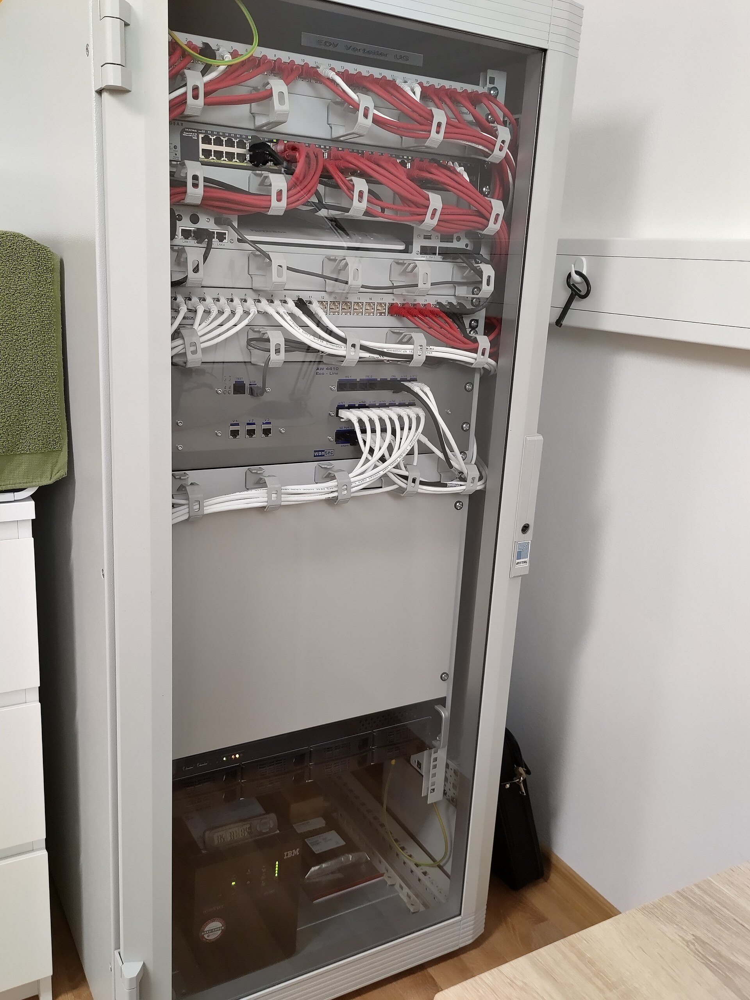
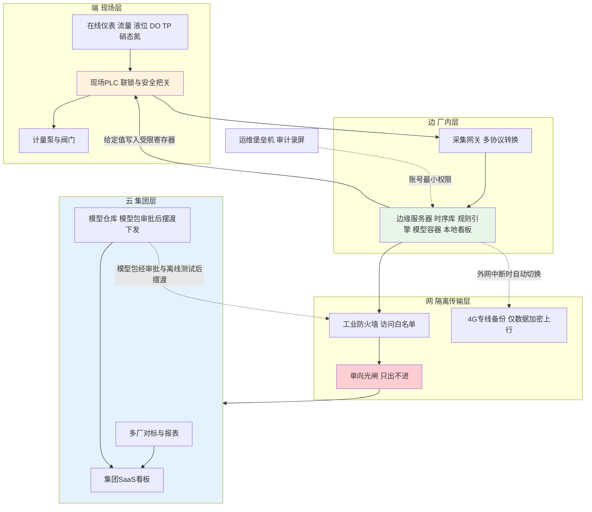
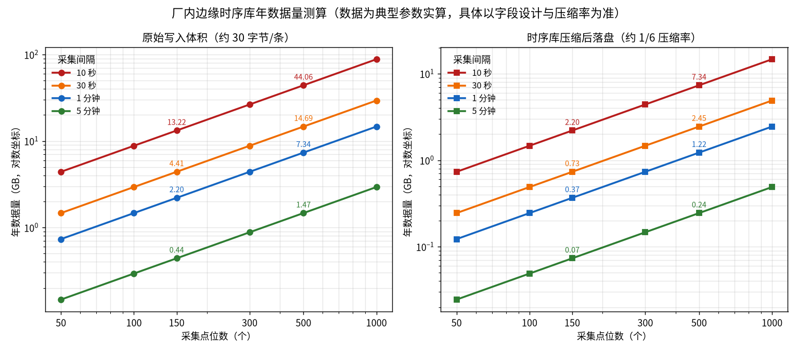

# 08-2 系统架构与边缘部署：端-边-网-云四层怎么搭

> 本章讲什么：AI 的"大脑"放在哪、数据怎么从仪表流到模型、控制指令怎么回到泵上、厂和集团云之间什么能通什么不能通；再把数据量、服务器选型、网络安全和现场施工这四笔实账算清楚。
>
> 读完能干什么：独立画出一座污水厂 AI 加药系统的四层拓扑图；估算厂里一年产生多少数据、该买什么配置的服务器；和网络科、集成商讨论安全方案时不掉链子。
>
> 阅读时间：约 28 分钟。

---

## 场景导入：断网八个小时，出水照样达标

某园区污水厂接入集团云半年后，市政施工挖断了通往厂区的主干光纤，外网断了整整八个小时。集团监控大屏上这座厂的图标变成灰色，调度中心电话都打到了厂长手机上。而厂里什么都没发生——加药泵照常按边缘服务器算出的给定值运转，出水 TP 全天稳定在 0.2 mg/L 上下，值班员甚至没发现断网，直到中午刷不开集团网页才知道。

这不是运气好，而是架构设计的第一条铁律：**边缘必须能脱离云独立活着**。云端负责"看和管"，厂内边缘负责"算和控"，PLC 负责最后的"安全把关"。为什么必须这样设计、四层各自放什么，本章一层层拆开讲。

*真实照片：壁挂式 19 英寸网络机柜，边缘网关、工业交换机就安装在这类机柜内，注意理线、标识与散热。图片来源：Wikimedia Commons，作者 Achimsh，CC BY-SA 4.0。*

---

## 一、四层架构总览：各层干什么、边界划在哪

| 层 | 物理位置 | 典型设备 | 干什么 | 失效时的要求 |
|---|---|---|---|---|
| 端（现场层） | 各工艺段现场、加药间 | 在线仪表、流量计、变送器、PLC、计量泵 | 采数据、执行联锁与给定 | 仪表坏值要可识别，泵要能就地手动 |
| 边（厂内层） | 中控室/电气间机柜 | 采集网关、边缘服务器 | 汇聚协议、存数据、跑模型、本地看板与控制 | **断外网后全部功能照常** |
| 网（传输/隔离层） | 厂区机柜与机房 | 工业交换机、防火墙、网闸/单向光闸、4G 备份 | 分区、隔离、摆渡数据 | 云侧被攻破也碰不到 PLC |
| 云（集团层） | 集团机房/公有云 | 多厂平台、SaaS 看板、模型仓库 | 多厂对标、报表、模型包管理与下发 | 云停了不影响任何一座厂运行 |

下图给出典型拓扑，注意两个安全设备的位置：工业防火墙管"南北向"访问控制，单向光闸（数据二极管）只允许数据从厂内往云侧流，物理上没有回路。

这张图里有三个设计动作要在方案阶段就讲死：① AI 服务器到 PLC **只有一条写入路径**——写约定的受限寄存器，启停联锁永远在 PLC 侧（[02-4](../02-加药系统篇/02-4-PLC与SCADA-数据怎么采控制怎么做.md) 的责任边界）；② 上云数据走单向设备，云永远不能反向控制现场；③ 远程运维一律绕堡垒机，不留直连通道。

---

## 二、端：现场仪表与 PLC，项目的"手脚和末梢神经"

现场层的知识 [02 篇](../02-加药系统篇/02-1-加药系统硬件全景-从药袋到出水口.md) 已系统讲过，这里只讲与架构设计相关的三个判断：

1. **利旧优先，但只利旧"可信"的设备**。能稳定输出 4-20mA 或 Modbus 信号、量程与现场匹配的仪表全部利旧；长期漂移、试剂泵管老化、从没比对过的分析仪，要么校准后利旧，要么列入改造 BOM，别让假数据进模型。
2. **PLC 必须还有"手"的能力**。再聪明的模型，最终也要由 PLC 的 AO/DO 通道去驱动泵；选型时确认 PLC 还有空闲的通讯口和 15%~20% 的点位余量。
3. **加药泵是否支持远程调节，是现场层第一排查项**。常见三种执行机构：带 4-20mA/脉冲输入的电磁驱动计量泵可直接接收给定；只有启停控制的泵要加变频器；纯机械冲程锁定的泵必须加装电动冲程执行器或换泵——单台改造成本通常 0.3~0.6 万元，漏掉就是预算事故。

---

## 三、边（上）：采集网关与四种工业协议

PLC 和仪表说的"方言"各不相同，采集网关的作用就是当翻译：把现场各种协议统一转成 OPC UA 或 Modbus TCP 送给边缘服务器，并完成数据缓存（断网时本地先存着，恢复后续传）。

| 协议 | 物理介质 | 常见于 | 项目里的注意点 |
|---|---|---|---|
| Modbus RTU | RS485 双绞线 | 老仪表、小型设备、加药间成套设备 | 一条总线挂多设备要设不同站号，波特率/校验位全总线一致 |
| Modbus TCP | 工业以太网 | 新型网关、成套加药装置 | 寄存器地址与数据类型（16/32 位、浮点顺序）必须书面确认 |
| OPC UA | 以太网 | 较新的 SCADA、施耐德/AB 系统 | 自带数据模型与加密，适合作为边侧统一接入标准 |
| S7（S7comm） | 西门子 Profinet 以太网 | 西门子 S7-1200/1500 大量存量厂 | 需在 PLC 侧开放 DB 块并关闭优化块访问，留程序注释 |
| Profinet | 工业以太网 | 西门子生态 IO 与变频 | 多为 PLC 内部总线，AI 侧一般不直连，经 PLC 转发 |

网关选型看五点：协议库是否覆盖厂里设备品牌、串口是否光电隔离、宽温宽压（加药间夏天 45℃ 以上很常见）、断网缓存容量、有没有 4G 备份上行。市场上常见品牌如研华 Advantech（EKI/UNO 系列）、摩莎 Moxa（MGate/UC 系列）、东土科技、映翰通等，单台价格大致 0.2~1.2 万元，协议授权和 4G 模块常另计。

> ⚠️ **老工程师的坑**：不要让一台网关背全厂。2 万吨小厂一台网关加一台冷备可以；5 万吨以上建议按工艺段（水线/泥线/加药间）分 2~4 台，一台死机只影响一段；更重要的是 RS485 总线物理距离超长、接头氧化时，分段排查比分段"猜"省一周时间。

---

## 四、边（下）：边缘服务器上跑的四样东西

边缘服务器就是一台装在机柜里的加固工控机/机架式服务器，上面跑四类软件：

### 4.1 时序数据库：为"带时间戳的数"而生

全厂仪表数据的特点是"点多、每条小、永远按时间追加、很少改"，用普通 MySQL 存又慢又占地方。**时序数据库**（Time-Series Database）专门干这个，开源界常见两种：

- **InfluxDB**：生态最大、资料多，适合中小厂和快速落地；
- **TDengine**：国产开源，压缩率和写入性能口碑好，中文文档全，集团多厂场景常用它的超级表按"厂-设备"分组。

它们的共同本事：写入快（单机每秒几万到几十万条）、自动压缩（典型压缩到原始体积的 1/4~1/8）、带保留策略（如秒级数据存 3 个月、1 分钟聚合存 3 年，超期自动删）、原生支持降采样和连续查询。

### 4.2 规则引擎与告警

数据进来后先过规则：坏值/冻结/超量程打质量标记（[05-2](../05-数据篇/05-2-数据质量治理-脏数据的九种死法.md)），阈值越限产生告警并分级推送（看板弹窗、短信/企业 IM）。**关键原则：安全联锁规则必须同时在 PLC 里焊一份**，边缘侧的规则用于管理和预警，PLC 侧用于保命，不能只靠服务器判断。

### 4.3 模型服务：Docker 化部署

模型代码打包成 **Docker 容器**（可以理解成"把程序和它依赖的运行环境装进一个标准集装箱"），边缘服务器上跑几个互相隔离的容器：推理服务（读最新数据、算给定值）、软测量服务（[05-3](../05-数据篇/05-3-软测量-用便宜仪表猜贵指标.md)）、异常检测服务。好处是版本可追溯（镜像带版本号）、升级可回滚（新容器有问题切回旧镜像，一分钟的事）、资源可限额（某个容器跑飞了不会拖死整机）。

### 4.4 本地 SCADA 与 Web 看板

边缘侧必须自带本地看板：工艺画面、实时曲线、报警列表、给定值与权限切换、报表导出。**判断边缘自治是否合格的硬标准：拔了外网网线，值班员在本地看板上能看、能控、能查历史、能接报警**——四样少一样，架构就不算过关。

> 💡 **现场经验**：时序库保留策略上线第一天就要配好。见过某厂默认配置把秒级原始数据永久保留，两年半写满磁盘，采集服务静默停摆三周没人知道，等做模型时才发现中间一个月没数据。建议：秒级/10 秒级存 1~3 个月，1 分钟聚合存 2~3 年，日结报表长期保存。

---

## 五、网：边缘自治与安全隔离

"断网自治"不是一句口号，验收时要按下面四项做实测并记录：① 拔掉厂区出口网线，采集、看板、模型推理、控制下发连续运行 ≥ 2 小时无扰动；② 断网期间产生的数据本地缓存不丢，恢复后自动补传到云；③ 断网期间报警仍能通过 4G 备份通道发出；④ 云端任何操作（包括云账号被盗的极端情况）都触达不到 PLC。

厂内网络本身按工业自动化的通行做法划区（参考 IEC 62443 / 等保 2.0 的分区思路）：现场控制区（PLC、仪表）、过程监控区（SCADA、边缘服务器、时序库）、管理区（办公网）、外联区（集团云、环保数采）。区与区之间用工业防火墙做白名单，**默认拒绝、按需开通**；上行数据走网闸或单向光闸。环保数采仪本身一般也要求类似的单向/只读策略，可与其共用通道但账号分开。

---

## 六、云：集团层做什么、不做什么

集团云适合做"单厂做不划算"和"需要跨厂"的事：

1. **多厂对标**：同样 5 万吨 AAO 厂，吨水 PAC 消耗、碳源单耗、单位污染物去除成本横向排名，差异自动归因到水量、水质、设备；
2. **集中报表与监管报送**：日报/月报自动生成，运行与药剂数据留痕备查；
3. **模型仓库与下发管理**：模型包在云端做版本管理、离线回放测试，经工艺负责人审批后通过摆渡方式更新到边缘——注意是"发软件包"，不是"远程实时控制"；
4. **知识库与工单**：报警处置经验、设备维保工单、药剂批次检测结果跨厂共享。

集团云**不做**的事：不直接写任何一座厂的 PLC、不承担实时控制、不作为安全链路的一环。单厂没有集团时，云这层可以先不建或用轻量 SaaS（[08-4](08-4-三个典型厂案例-方案BOM与ROI.md) 的 A 厂就是纯本地方案）。

---

## 七、一年到底产生多少数据：实算给你看

按每条记录约 30 字节（时间戳 8 B、标签与质量码约 12 B、数值 8 B，索引摊薄）估算，时序库压缩后约为原始体积的 1/6，年数据量公式：

> **年记录数 = 点位数 × 525600 ÷ 采样间隔（分钟）**
>
> **年数据量（GB）= 年记录数 × 30 ÷ 1024³**（压缩后再除以约 6）

| 点位数 | 1 分钟间隔年记录 | 原始体积 | 压缩后落盘 | 10 秒间隔原始体积 |
|---|---|---|---|---|
| 80 点（2 万吨小厂） | 4200 万条 | 1.17 GB | 约 0.20 GB | 约 7.0 GB |
| **150 点（任务书口径）** | **7884 万条** | **2.20 GB** | **约 0.37 GB** | **约 13.2 GB** |
| 300 点（10 万吨典型） | 1.58 亿条 | 4.41 GB | 约 0.73 GB | 约 26.5 GB |
| 800 点（20 万吨大厂） | 4.20 亿条 | 11.75 GB | 约 1.96 GB | 约 70.5 GB |

*数据为按 30 字节/条与 1/6 压缩率的合成实算（具体以字段设计、数据库版本与压缩率为准）。左图原始写入、右图压缩落盘，均为对数坐标。*

结论可能和直觉相反：**加药优化的数据量对现代服务器毫无压力**——150 点、1 分钟一条，压缩后一年才 0.37 GB，一块普通固态硬盘能存几十年。真正占带宽和存储的是视频、DO/pH 秒级流和全量 SCADA 点表（两三千点那种）。所以容量规划的重点不是"存不存得下"，而是：① 别把所有点都设成秒级采集（加药过程 10~30 秒足够，分析仪 10~30 分钟才出一个数，采再快也是重复值）；② 保留策略分层；③ 给视频等非控制流量划独立 VLAN，别和控制网抢带宽。

---

## 八、边缘服务器配置建议：三档对号入座

以下为 2024~2026 年市场常见行情的裸机配置区间（具体项目以实际报价为准），软件授权、机柜 UPS 与施工费另计：

| 档次 | 适用厂型 | CPU/内存/存储 | 典型裸机价 | 配套建议 |
|---|---|---|---|---|
| 轻量边缘盒子 | ≤3 万 m³/d、≤200 点 | 4~8 核工业级 CPU、8~16 GB、512 GB SSD + 可选 4 TB HDD | 0.8~1.5 万元 | 无风扇宽温机型，放加药间或中控室均可 |
| 标准边缘服务器 | 5~10 万 m³/d、200~800 点 | 至强 6~8 核、32~64 GB、2×1.92 TB SSD 做 RAID1 | 2.5~4.5 万元 | 机架式上机柜，配 3 kVA UPS，硬盘热备 |
| 高配/双机热备 | 20 万 m³/d 以上、800~2000 点或含孪生 | 双路至强或双机热备、128 GB、全闪阵列 | 8~18 万元 | 双机心跳自动切换，独立备份盘/异地备份 |

配置判断的三个经验：**内存比 CPU 重要**（时序库查询和模型容器吃内存，宁大勿小）；**SSD 必须做 RAID1**（两块盘镜像，坏一块不丢数据不停机）；**UPS 不是可选件**（加药间配电抖动频繁，一次掉电损坏的数据库文件可能要修两天）。此外全厂还应有一台工程师运维终端（普通办公 PC 即可，装客户端，不直接插 U 盘）。

---

## 九、网络安全六条落地措施

污水厂属市政关键设施，安全方案常被问"过不过等保"。等保 2.0（网络安全等级保护 2.0）对工业控制系统有专门要求，地市级以上污水厂多按二级要求建设。AI 加药项目虽然不是全厂等保的责任主体，但方案必须满足六条硬措施：

| 措施 | 具体做法 | 不做的后果 |
|---|---|---|
| 网络分区 | 控制区/监控区/办公区/外联区 VLAN 隔离，防火墙白名单 | 办公网一台中毒电脑可能扫到 PLC |
| 单向隔离 | 上云与环保数采走网闸/单向光闸，云侧无回路 | 云账号泄露即全厂失守 |
| 账号最小权限 | 只读/操作/工程师/管理员四级，写入单独授权，全程审计 | 离职人员账号仍能改参数 |
| 远程运维堡垒机 | 所有远程登录经堡垒机认证、录屏、限时、可注销 | 厂家用 TeamViewer 直连，出事查无对证 |
| U 盘与外设禁用 | 工控主机封 USB 存储口，数据摆渡用专用摆渡机 | 摆渡病毒（如历史上的工控病毒）进控制网 |
| 补丁与变更管理 | 工控机不自动更新，变更走审批、停机窗口、先备份 | 系统后台强制重启，加药控制中断 |

> ⚠️ **老工程师的坑**：网络科最常见的否决理由是"不能接外网"，这时别硬顶，把方案讲成三句话通常能过：**第一，控制逻辑全在厂内，断外网照常运行；第二，数据只经单向光闸出去，外部物理上回不来；第三，远程运维全程堡垒机录屏审计**。把拓扑图和测试记录摆在桌上，比拍胸脯管用。

---

## 十、现场施工：四件决定系统寿命的小事

架构画得再好，施工糙了全白搭。除 [08-1](08-1-项目实施全流程-从调研到验收.md) 已列的风险外，边缘部署阶段重点盯四件事：

1. **强弱电分离**：4-20mA/RS485 信号线与动力电缆分桥架敷设，必须交叉时垂直跨过；屏蔽双绞线的屏蔽层只在柜侧单端接地。模拟量莫名跳变的疑难症，三成以上出在接地和桥架。
2. **防雷接地**：室外仪表（进出水流量计、厂区液位计）加装信号浪涌保护器，仪表接地与电气接地分开或按等电位连接规范施工；南方雷雨季前测一次接地电阻（一般要求 ≤4 Ω，具体按设计）。
3. **取样与伴热**：分析仪取样管要短、要带坡度、要连续回流（死水取的样没有代表性）；北方地区取样管、加药管、PAC 储罐区全部做电伴热加保温，最冷月做一次凌晨防冻巡检。
4. **防腐与散热**：加药间内接线端子用镀锡/镀金加工热缩，柜内装除湿加热器；边缘服务器柜体前门带滤网、定期清灰——PAC 粉尘和潮湿是网口氧化的主要元凶。

---

## 十一、边缘部署验收：一页纸点验清单

部署联调结束、模型开发开始之前，甲方可拿着下面这张清单逐项点验，任何一项不过都不算"数据打通"：

| 序号 | 点验项 | 合格标准 | 验证方法 |
|---|---|---|---|
| 1 | 点位到位率 | 约定点位到位率 ≥ 99%，关键控制点 100% | 按点表逐点在看板核对，缺点登记闭环 |
| 2 | 量程一致性 | AI 侧、PLC 侧、现场仪表三方量程一致 | 抽 10 个点做 4-20mA 与工程量互算复核 |
| 3 | 数据准确率 | 抽点比对误差在仪表允许范围内 | 便携表/化验值与在线值同步比对 ≥3 次 |
| 4 | 时间戳 | 全系统 NTP 对时，偏差 < 2 秒 | 查网关、服务器、PLC 三方时钟 |
| 5 | 断网自治 | 拔外网 2 小时，看、控、查、报警四不中断 | 现场拔线实测并录像留档 |
| 6 | 断点续传 | 断网期间数据不丢，恢复后自动补齐 | 拔线前后抽 10 分钟数据逐分钟核对 |
| 7 | 写入边界 | AI 仅能写约定寄存器，越权写入被拒 | 用测试客户端尝试越权写，确认失败 |
| 8 | 安全基线 | 防火墙默认拒绝、堡垒机可录屏、USB 已封 | 查策略配置、随机远程登录演示、插 U 盘测试 |
| 9 | 掉电保护 | 市电断开后 UPS 支撑正常关机 ≥15 分钟 | 拉总电实测，看恢复后数据库是否完好 |
| 10 | 文档移交 | 拓扑图、点表、账号清单、应急联系人齐全 | 纸质+电子双份移交签收 |

> 💡 **现场经验**：第 5、7、9 项一定要当着甲乙双方的面现场实测，不能只看乙方拍的视频。这三项平时都用不上，一旦用上就是救命——断网、越权、掉电，恰恰是出事概率不高但代价极大的场景，验收时省掉的每十分钟，都会在未来某次事故里还回来。

---

## 本章小结

1. 系统按**端-边-网-云**四层搭：仪表/PLC 采和控，边缘网关翻译协议，边缘服务器存数据、跑模型、管本地控制，云做对标和报表；**边缘脱离云必须独立运行**，这是验收硬指标。
2. 协议四件套：Modbus RTU/TCP、OPC UA、S7；网关按工艺段分摊、留冷备，串口隔离和断网缓存不能省。
3. 边缘服务器上跑时序库（InfluxDB/TDengine）、规则引擎、Docker 化模型服务和本地看板；安全联锁必须在 PLC 里另焊一份。
4. 数据量不是瓶颈：150 点 ×1 分钟 × 一年原始仅 2.20 GB、压缩约 0.37 GB；重点是分层保留策略和别滥用秒级采集。
5. 安全六件套：分区、单向光闸、最小权限、堡垒机、U 盘禁用、变更审批；施工盯紧强弱电、防雷接地、取样伴热、防腐散热。

---

上一章：[08-1 项目实施全流程：从调研到验收](08-1-项目实施全流程-从调研到验收.md) ｜ 下一章：[08-3 安全联锁与人工接管](08-3-安全联锁与人工接管.md)
