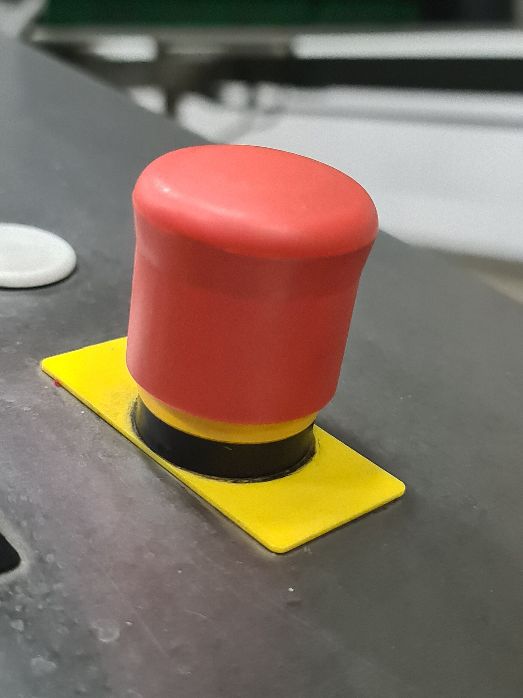
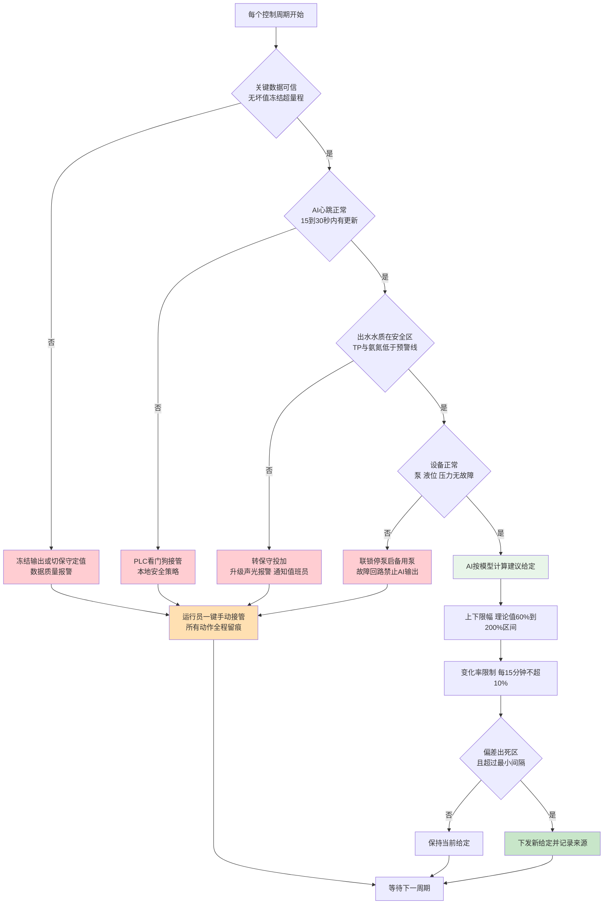

# 08-3 安全联锁与人工接管：AI 加药的红线章

> 本章讲什么：这是全书唯一一章"怎么不出事"的内容。讲透 AI 加药系统必须焊死的七道安全联锁、四级操作权限、灰度回退条件、异常演练和值班响应——每一条都给触发条件、动作和恢复条件。
>
> 读完能干什么：独立审查一套 AI 加药方案的安全设计是否合格；编写联锁矩阵、审批权限切换表、值班响应卡；在模型误判、仪表假值、通讯中断发生时知道系统会怎样保护出水、人该怎么接管。
>
> 阅读时间：约 32 分钟。本章建议逐字读完，并组织运行班做一次专题学习。

---

## 场景导入：一次被系统拦下的过量投加

某厂 L2 半自动投运第三个星期，凌晨两点，AI 给出的 PAC 建议值突然从 180 L/h 跳到 310 L/h。运行员盯着屏幕犹豫的十几秒里，系统自己先动了：建议值被限幅规则压到 245 L/h，紧接着弹出红色提示"进水流量数据冻结，请确认"，同时输出自动切到了保守定值。班长赶到现场，发现进水口电磁流量计的信号线缆被清洁车挂断，AI 看到的"流量"是十分钟前的旧值。

事后复盘，真正挡住事故的不是某一个聪明算法，而是三层笨办法叠在一起：**限幅钝化、数据可信联锁、运行员最终确认**。这套笨办法的设计哲学只有一句话——

> **AI 永远不能拥有不受约束的执行权；系统宁可退回手动，也不许出水冒险。**



*真实照片：红色蘑菇头急停按钮。任何自动加药系统都必须保留这样的物理一键停机手段，且其优先级高于一切软件指令。图片来源：Wikimedia Commons，作者 Biso，CC BY-SA 4.0。*

---

## 一、设计哲学：三条不可谈判的原则

1. **安全逻辑只住在 PLC 里，不住在 AI 服务器里。** 限幅、速率、联锁、看门狗全部在 PLC 程序中实现（[02-4](../02-加药系统篇/02-4-PLC与SCADA-数据怎么采控制怎么做.md) 已划定边界）。AI 服务器会蓝屏、会更新重启、会被断电，PLC 扫描周期 100~500 ms、常年不停，它才是配拿"执行权"的设备。AI 对系统而言只是一个"外部建议来源"，和一个经验丰富但可能说错话的老师傅没有本质区别。
2. **所有失效都必须有安全方向（Fail-safe）。** 每个故障场景都要回答"最坏情况下系统往哪个方向倒"：数据没了、通讯断了、模型崩了，默认动作只能是三选一——**保持当前安全值、切保守定值、转人工**，绝不允许"失效后自由输出"。对加药而言，保守方向是按经验比例投加（宁可稍多，绝不欠投导致超标），同时立即报警。
3. **人的权限永远高于机器，且接管路径不超过一个动作。** 任何级别下，运行员在 SCADA 上一个旋钮（或一次点击+确认）就能切手动；硬接线急停按钮与关键设备联锁不经过任何网络和上位机。AI 状态、当前给定来源（人/AI/保守策略）全程留痕。

> ⚠️ **红线提醒**：评审任何一套 AI 加药方案，先问三个问题——限幅联锁写在 PLC 里还是服务器里？通讯断了 PLC 执行什么？运行员几步能切手动？三个问题有一个答不上来或答案错误，方案直接打回，不谈算法、不谈节药率。

---

## 二、七道安全联锁：触发、动作、恢复一览

下面七道联锁按"从软到硬"排列：前三道约束指令本身，中间两道兜底数据与水质，后两道是设备和通讯的保命线。表中阈值为典型经验值，具体项目必须结合工艺审计与排放限值整定，并经总工批准后写入联锁矩阵。

| 联锁 | 触发条件（典型值） | 系统动作 | 人工恢复条件 |
|---|---|---|---|
| ①输出上下限幅 | AI 给定超出工艺允许区间 | PLC 将给定钳位到上下限并记录越限事件 | 限幅值修改须工程师权限+审批，不在线临时改 |
| ②变化率限制 | 单位时间内给定变化超阈值（如每 15 min 变化 >10%） | 超出部分不执行，按最大允许速率渐变逼近 | 自动恢复，持续越限报警转人工核查 |
| ③死区与最小作用间隔 | 偏差小（如 TP 偏差 <0.03 mg/L）或距上次动作 <10 min | 保持原给定，防止泵频繁调节 | 偏差出死区或间隔满后自动恢复 |
| ④数据可信联锁 | 关键仪表坏值/冻结/超量程，或关键点缺失 | AI 输出冻结或切保守定值，数据质量报警 | 仪表恢复正常并经 2~3 个采样周期确认 |
| ⑤水质逼近超标联锁 | 出水 TP>0.40（一级 A 口径）或氨氮>4.0 等预警线 | 自动转保守投加并升级声光报警，通知值班员 | 水质回到安全区并稳定约 30 min，人工确认 |
| ⑥设备联锁 | 泵故障、药罐低液位、管路压力异常 | 停问题泵/启备用泵/维持安全比例，禁止 AI 继续输出到故障回路 | 现场消缺复位，点动试运正常后恢复 |
| ⑦通讯看门狗 | AI 与 PLC 心跳丢失（5~10 s 心跳，连续 3 次约 15~30 s） | PLC 按本地安全策略接管：保持/保守/手动 | 通讯恢复、数据校验通过后由人工选择重投级别 |

下面把每条联锁的整定思路交代清楚。

### ① 输出上下限幅：用机理给 AI 画跑道

上下限不能拍脑袋，要按机理和设备能力各算一道：

- **上限（防过量）**：除磷剂投加量不超过"当前负荷理论需求量的 200%"（理论需求按 [04-1](../04-机理公式篇/04-1-化学除磷机理与投加量计算.md) 的 Al/P 摩尔比 1.5~3 与实时水量、进水/中段 TP 算出），同时不超过计量泵最大有效排量的 90%（留 10% 机械余量）；碳源投加量不超过"按硝态氮负荷计算理论 COD 需求的 150%"，防止过量碳源穿透到好氧段推高出水 COD 与曝气电耗。
- **下限（防欠投）**：除磷剂不低于理论需求的 60%~70%，且不低于维持管路与混合工况的泵最小稳定流量；碳源在反硝化需求存在时不低于安全保底量。
- 限幅是**动态的**：随实时水量与负荷重算，而不是一组固定 L/h 数字。限幅表按工况（旱季/雨季/冲击/保温）分档，档位切换记录留痕。

### ② 变化率限制：让错误指令"快不起来"

工艺对象本身就是慢系统：药剂从投加点到混匀反应再到出水 TP 变化，通常十几分钟到数小时（[04-5](../04-机理公式篇/04-5-加药过程动态特性-PID前馈与反馈.md)）。所以 AI 根本没有理由剧烈动作。典型整定：每 15 min 给定变化不超过当前值的 10%（冲击工况可由前馈临时放宽到 15%，仍需限幅）；单方向连续调整设日累计上限（如 +30%），超过自动报警核查。这道限制让任何错误——模型 bug、数据跳变、误操作——都被钝化到运行员能反应的时间尺度。

### ③ 死区与最小作用间隔：泵不是水龙头

计量泵频繁小幅调节有两个坏处：机械磨损、班组无法形成操作直觉。设两道门槛：被控指标在目标带内（如出水 TP 目标 0.20~0.30 mg/L）不动作；距上次调节不足 10~15 min 不重复动作（分析仪 10~30 min 才出一个数，动作比测量还勤没有意义）。死区宽度按仪表误差和工艺波动整定，太宽失去控制、太窄造成振荡。

### ④ 数据可信联锁：先信数据，再信模型

[05-2](../05-数据篇/05-2-数据质量治理-脏数据的九种死法.md) 讲过脏数据九种死法，控制场景至少实时识别四类：

- **坏值/无效值**：仪表自身质量码为故障、4-20mA 信号 ≤3.6 mA（断线）或超 20.5 mA；
- **冻结值**：测量值在设定窗口内几乎不变化（如分析仪读数 15 min 变化小于量程 0.1%，流量/DO 等秒级点 30~60 s 不变化）——取样管堵、试剂耗尽时常见；
- **超量程/突变**：超出物理量程，或 1 分钟内变化超过工艺物理极限（如进水 TP 1 分钟翻 5 倍，几乎必为假值）；
- **多点不一致**：同一对象冗余测量或上下游质量平衡明显矛盾（见本章案例二）。

一旦投加回路依赖的关键输入（一般 3~6 个点：流量、关键水质、罐液位、泵反馈）任一失效，该回路立即降级：AI 输出冻结在上一可信值（短时）或切到按水量比例的保守定值（持续），看板标黄/标红，禁止"带病自动"。

### ⑤ 水质逼近超标联锁：出水是最后一道防线

不管前面什么原因，只要出水水质逼近限值，系统无条件进入保守模式。预警线按排放标准预留安全裕度整定：

| 控制指标 | 排放标准 | 系统预警线（典型） | 联锁动作 |
|---|---|---|---|
| TP（一级 A 口径） | 0.5 mg/L | 连续 2 个测量周期 >0.40 | 转保守投加，声光报警，通知值班员 |
| TP（准 IV 内控口径） | 0.3 mg/L | 连续 2 个周期 >0.25 | 同上，并通知工艺主管 |
| 氨氮（一级 A） | 5 mg/L（低温 8） | >4.0（低温 >6.5） | 加大曝气协同策略受限，碳源策略转保守 |
| 氨氮（准 IV 内控） | 1.5 mg/L | >1.2 | 升级报警，限制一切降药动作 |
| COD | 50 或 30 mg/L | 达到限值 80%~90% | 核查碳源是否过量，暂停碳源前馈增投 |

注意两个细节：触发要用**连续 2 个测量周期确认**（防单点尖峰误触发），恢复要水质稳定回到安全区内约 30 min 且经人工确认——系统不自动从保守模式跳回自动，必须人看过。

### ⑥ 设备联锁：保护人和设备

- 计量泵故障干接点动作、热继电器跳闸：立即停用该泵，有备用泵按程序自启，AI 给定转移到运行泵并重新限幅；
- 溶药罐/储罐低液位（如 <0.5 m，按罐高整定）：禁止继续下调冲程（防打空泵和气蚀），低低液位联锁停泵并报警配药；
- 加注管路压力异常（超高压——管路堵；低于下限——断管泄漏）：联锁停泵、关阀、报警；
- 加药间集液池高液位、泄漏检测：区域级报警，必要时停整个加药单元。

这些联锁在 AI 项目之前就应存在于 PLC 中；AI 接入时要做的是**确认它们没有被旁路、没有被改成由上位机判断**。

### ⑦ 通讯看门狗：失联即交权

设两层心跳：AI 服务器与 PLC 之间每 5~10 s 一次心跳，连续 3 次收不到（约 15~30 s），PLC 立即执行本地安全策略（按工况选择保持最后可信给定或切固定比例），AI 写入权自动失效；厂与集团云之间心跳约 10 min，断了只告警、不影响控制（边缘自治要求见 [08-2](08-2-系统架构与边缘部署.md)）。通讯恢复后不自动重投自动模式，需运行员确认数据完整、当前工况平稳后手动恢复原级别。

> 💡 **现场经验**：看门狗超时时间要按"人能到现场的时间"反着校核。值班员从休息室跑到加药间通常 1~3 分钟，PLC 本地保守策略至少要能稳稳撑 30 分钟不超标——这就要求保守定值不能取理论下限，而取班组平时的"放心值"。验收时让班长报数，他嘴里那个"夜里安心睡觉的投加量"就是保守定值的最好初值。

---

## 三、联锁决策流：PLC 每个扫描周期怎么走

下图把七道联锁合成一个决策流。顺序很重要：先看数据和通讯（输入是否可信、连接是否活着），再看水质和设备（外部状态是否安全），最后才算建议值；而建议值出门前还要过限幅、速率、死区三道闸。



注意图中所有红色路径最终都汇到同一个出口：**运行员一键手动接管**。这不是画图时的美化，是真实的 PLC 程序结构——任何自动降级都同时把操作权显式交还给人。

---

## 四、联锁逻辑伪代码（供评审对照）

下面是一段**伪代码**（不是任何品牌 PLC 的真实语法），用来在方案评审时逐条核对乙方程序是否实现完整。真实工程可由 ST 结构化文本、梯形图或功能块实现。

```text
// ===== AI 加药安全联锁伪代码（每个控制周期执行，周期 100~500 ms）=====

// 第1步：数据可信检查
IF 任一关键输入(流量, 进出水TP, 液位, 泵反馈).质量码 != 正常
   OR 信号电流 <= 3.6mA OR >= 20.5mA
   OR 分析仪读数在15分钟内变化 < 量程的0.1%   // 疑似冻结/堵样
THEN
    数据可信 := FALSE
ENDIF

// 第2步：看门狗
IF 距上次AI心跳时间 > 心跳周期 * 3            // 典型 15~30 秒
THEN
    心跳正常 := FALSE
ENDIF

// 第3步：水质逼近检查（连续2个周期确认，防尖峰）
IF (出水TP > TP预警线) OR (出水氨氮 > 氨氮预警线) THEN
    水质预警计数 += 1
ELSE
    水质预警计数 := 0
ENDIF
水质逼近 := (水质预警计数 >= 2)

// 第4步：设备检查
设备异常 := 泵故障 OR 罐低低液位 OR 管路压力异常 OR 急停按下

// 第5步：决定 AI 是否有发言权
IF NOT 数据可信 OR NOT 心跳正常 OR 水质逼近 OR 设备异常 OR 模式 = 手动 THEN
    AI输出使能 := FALSE
ELSE
    AI输出使能 := TRUE
ENDIF

// 第6步：安全状态机（失效方向：保持/保守/手动）
IF 设备异常 THEN
    最终给定 := 0 对故障泵; 有备用泵则切备用泵并重新限幅
    报警("设备联锁动作")
ELSIF 水质逼近 THEN
    最终给定 := 保守定值[当前工况]            // 班组放心值
    升级声光报警(); 通知值班员()
ELSIF NOT 数据可信 OR NOT 心跳正常 THEN
    最终给定 := 保守定值[当前工况]            // 或短时保持最后可信值
    报警("数据/通讯失效，PLC 本地策略接管")
ELSIF AI输出使能 THEN
    建议值 := AI模型推理()
    // 第7步：三道输出闸
    限幅后 := CLAMP(建议值, 动态下限, 动态上限)           // 理论量 60%~200%
    速率限 := RATE_LIMIT(限幅后, 上一给定, 每15分钟<=10%)
    IF ABS(速率限 - 上一给定) < 死区 OR 距上次动作 < 最小间隔 THEN
        最终给定 := 上一给定                              // 保持
    ELSE
        最终给定 := 速率限
    ENDIF
ENDIF

// 第8步：人永远最高优先级
IF 运行员切手动 THEN 最终给定 := 运行员手动给定 ENDIF

输出到AO通道(最终给定)
记录(时间戳, 给定来源[人工/AI/保守/保持], 各联锁状态)
```

评审时对照这份伪代码逐项打勾，尤其关注三点：降级后**恢复是否必须人工确认**（绝不能自动跳回自动）、所有分支是否都有明确给定值（不存在"什么都不输出"的悬空分支）、记录字段里是否包含**给定来源**（事后追责和模型迭代全靠它）。

---

## 五、权限四级：L0~L3 与切换审批

| 级别 | 名称 | 系统行为 | 谁能进入 | 典型场景 |
|---|---|---|---|---|
| L0 | 只看 | 看板展示与报警，不给任何投加建议值 | 所有人，无需申请 | 参观、领导调研、上线前 |
| L1 | 建议 | AI 给建议值，运行员手动执行或忽略 | 生产科批准，值班长可切 | 影子结束后的第一级 |
| L2 | 半自动 | AI 给值，运行员一键确认后下发 | 总工/生产厂长书面批准 | 主线投运级别，多数厂长期停在此级 |
| L3 | 限定自动 | 限幅与联锁约束内自动闭环，超限转人 | 厂长批准+连续考核记录+备案 | 工艺稳、团队成熟的厂；夜班/平稳工况可分时启用 |

切换规则四条：①升级一级一申请，附上一级观察期评估报告，批准记录存档；②**降级不需要审批**——值班长及以上可随时把系统从 L3 降到 L1/手动，事后补记录即可，降级行为不追责（追责的是降级后隐瞒不报）；③账号分级登录，关键操作（改限值、强制点、屏蔽报警）双人复核并录屏留痕；④联锁定值（预警线、限幅系数、看门狗时间）的任何修改走变更单，严禁运行班私自调整。

灰度投运每级的观察期、升级与回退条件在 [08-1](08-1-项目实施全流程-从调研到验收.md) 第八节已给出完整表格（L1 观察 1~2 周、L2/L3 各 2~3 周+陪产），核心纪律重复一遍：**一次只升一级；任何硬联锁触发，先降级查因，不许复位后直接回 L3。**

---

## 六、异常演练清单与值班响应卡

联锁不能只在报告里"具备"，要靠演练练成肌肉记忆。投运前和每半年至少做一次下列演练（可在线模拟，不真实冒险）：

| 序号 | 演练科目 | 注入方式 | 合格表现 |
|---|---|---|---|
| 1 | 进水流量假值 | 测试模式下写入冻结/跳变值 | 数据可信联锁动作，切保守定值并报警 |
| 2 | TP 仪堵样 | 模拟读数长期不变 | 冻结识别报警，输出不随假值下降 |
| 3 | 出水逼近超标 | 模拟出水 TP 爬升至 0.41 | 连续 2 周期后转保守投加、声光报警 |
| 4 | AI 服务器宕机 | 直接断电/拔网线 | 15~30 s 内 PLC 看门狗接管，控制无扰动 |
| 5 | 加药泵故障 | 触发泵故障干接点 | 故障泵停、备用泵启，给定重新分配限幅 |
| 6 | 药罐低液位 | 模拟低低液位信号 | 联锁停泵、配药报警，AI 无反向增投 |
| 7 | 管路超压 | 压力变送器模拟上限 | 停泵关阀，泄漏流程启动 |
| 8 | 运行员紧急接管 | 任意时刻拧手动 | 一个动作内切手动，当前给定平滑无跳变 |
| 9 | 外网全断 | 拔厂区出口网线 | 边缘自治 ≥2 小时，4G 报警正常 |
| 10 | 恢复自动 | 上述各科目消缺后 | 必须人工确认才恢复，不自动升级 |

值班台上应放一张巴掌大的**响应卡**（塑封），格式统一如下：

| 看到什么 | 先做什么（30 秒内） | 再做什么（5 分钟内） | 什么情况汇报谁 |
|---|---|---|---|
| 数据质量红色报警 | 看哪个点，切 L1/手动维持 | 现场查仪表取样/试剂/接线 | 30 min 不恢复报仪表班与工艺主管 |
| 出水预警声光报警 | 确认系统已转保守投加 | 查进出水趋势与药剂罐液位 | 立即报值班长、厂长 |
| 看门狗/通讯报警 | 确认 PLC 已本地接管 | 查边缘服务器与网线电源 | 15 min 不恢复通知自控值班 |
| 泵故障报警 | 确认备用泵已自启 | 现场点动确认、挂牌检修 | 双泵皆故障立即报设备科 |
| 任何"拿不准" | 先切手动，按经验值投 | 打电话，不赌、不等、不瞒报 | 升级顺序：班长→工艺主管→厂长 |

> ⚠️ **老工程师的坑**：演练最容易演成"通知演练"——提前打招呼、大家站在柜子前面等报警。真正有效的演练是无脚本抽测：凌晨随机拔一根信号线、随机停一次服务器，看板报警和响应卡执行时间全程计时。第一次抽测通常惨不忍睹，这正是要在没出事的时候多做几次的理由。

---

## 七、两个真实险情案例

**案例一：模型误判——把仪表检修后的跳变当成了负荷冲击。** 北方某厂 L2 模式运行中，上午仪表班对进水 COD/氨氮分析仪做标定维护，恢复上线后测量值出现一段偏高跳变。碳源前馈模型把它识别为"高硝态氮负荷来临"，给出的碳源建议值上调约 30%。两道防线起了作用：变化率限制把单次上调压到每 15 分钟 10%，建议值只爬了一档；当班运行员发现"建议曲线和水量曲线对不上"，在 L2 确认框上点了拒绝并电话核实仪表班，确认是标定残差。系统随后因输入突变触发数据可信检查，自动冻结该回路输出 40 分钟直到数据平稳。教训三条：仪表维护必须挂"维护中"标志位、模型要识别数据突变与物理负荷的区别、L2 的人工确认环节不能省。

**案例二：仪表假值——冻堵的取样管差点让系统少投一半药。** 华东某厂冬季寒潮，二沉后 TP 分析仪取样管伴热带故障，测量室残留旧水，读数长时间"稳定"在 0.05 mg/L（明显好于日常 0.2~0.3）。AI 据此判断化学除磷需求大降，PAC 给定在限幅内逐步下调（变化率限制使降幅用了约 1 小时才到位，而不是一步降到底）。幸运的是该厂出水端另有一台 TP 在线仪，其读数在 40 分钟后爬到 0.41，连续两个测量周期触发**水质逼近超标联锁**：系统无条件转保守投加定值并声光报警，值班员现场检查发现取样管冰堵、取样泵空转。处置：加热疏通、校验仪表、人工监控出水 TP 回落到 0.25 后维持保守模式一个班次，次日经工艺主管确认才恢复 L2。教训四条：关键水质联锁不依赖单台仪表，上下游与冗余测量要交叉验证；"读数异常地好"和异常地坏一样可疑，冻结检测要能识别长时间不动的假值；取样管伴热要纳入冬季巡检；**最后一道联锁永远看出水，不看模型的输入**。

---

## 本章小结

1. 红线只有一句：**AI 不掌握不受约束的执行权，宁可退回手动也不许出水冒险**；安全逻辑焊在 PLC，失效必有安全方向，人一个动作就能接管。
2. 七道联锁从软到硬：限幅（理论量 60%~200%）、变化率（每 15 min ≤10%）、死区与最小间隔、数据可信、水质逼近（TP>0.40 等预警线连续 2 周期）、设备联锁、看门狗（15~30 s 无心跳即接管）。
3. 所有降级恢复必须人工确认；权限 L0~L3 升级要书面审批、降级不追责但不得隐瞒；L2 是多数厂的长期合理级别。
4. 投运前与每半年做十项无脚本演练，值班台放响应卡，练的是 30 秒动作而不是理论。
5. 两个险情都被"笨联锁"拦下：模型误判靠速率限制+人工确认，仪表假值靠冗余交叉+出水联锁——再聪明的模型，也要假设它明天会错一次。

---

上一章：[08-2 系统架构与边缘部署](08-2-系统架构与边缘部署.md) ｜ 下一章：[08-4 三个典型厂案例：方案 BOM 与 ROI](08-4-三个典型厂案例-方案BOM与ROI.md)
