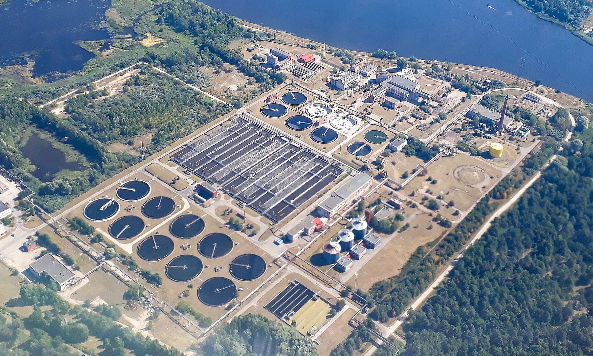
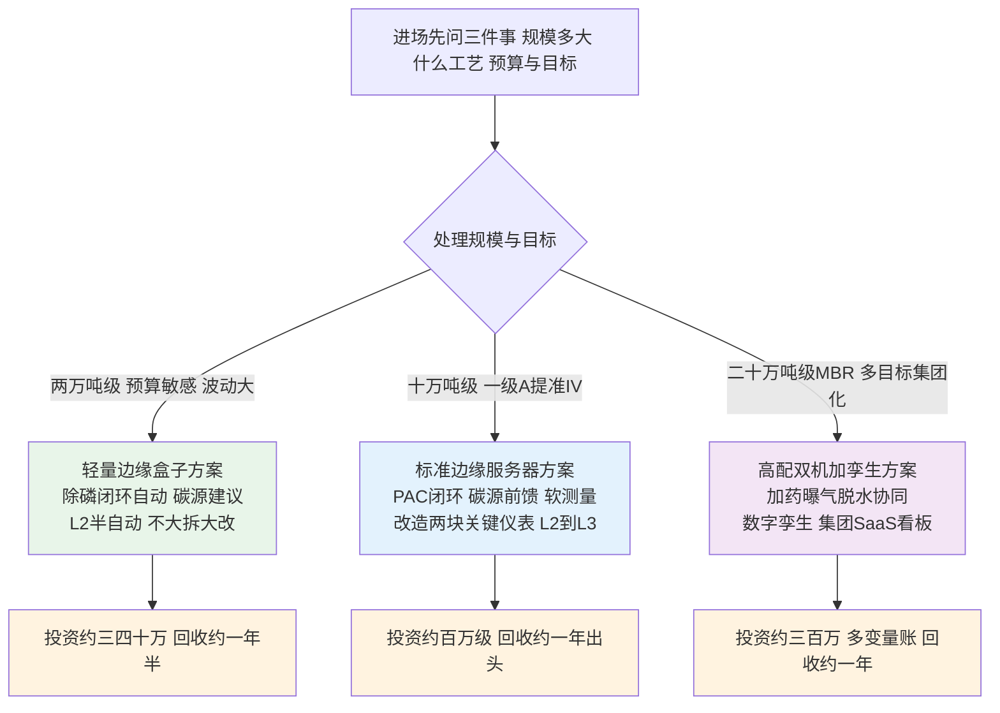
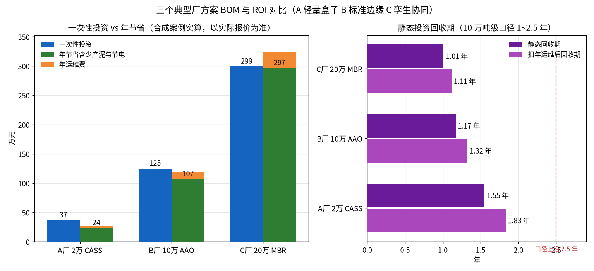

# 08-4 三个典型厂案例：方案 BOM 与 ROI

> 本章讲什么：用三个合成但口径真实的完整案例，把前面所有章节的数字落成可以拿去报价的 BOM（物料清单）和 ROI（投资回报）账——小厂怎么花小钱办大事，中厂怎么把钱花在刀刃上，大厂怎么算多变量协同的大账。
>
> 读完能干什么：照着相似厂型快速搭一套"改造点+硬件+软件+实施+运维"的报价框架；看懂乙方方案里哪些钱省不得、哪些配置是过度销售；独立复核投资回收期算法。
>
> 阅读时间：约 30 分钟。三个案例可按你当前手上的厂型选读。

---

## 场景导入：三家厂长，三种心病

年底的水务集团技术交流会上，三位厂长坐在一起倒苦水。2 万吨 CASS 厂的厂长说："我也知道 AI 好，可一年药费才一百七八十万，你让我掏一两百万上系统，我怎么跟董事会批？"10 万吨 AAO 厂的厂长明年要提准 IV："钱我认，但碳源和 PAC 两本大账怎么一起降，别给我弄一堆花架子。"20 万吨 MBR 厂的厂长格局最大："集团要数字孪生、要多厂对标，可曝气、加药、脱水各管一段，谁能给我一张总账？"

三种心病对应三档方案。下面三个案例的**价格均为 2024~2026 年市场行情下的合成报价、具体项目以实测与实际询价为准**；节药率全部取教程统一口径区间内的稳健值（除磷剂 15%~30%、碳源 10%~25%），没有一个案例敢把节药率吹到天上。

*真实照片：拉脱维亚里加 Daugavgrīva 污水处理厂航拍，圆形二沉池与矩形处理构筑物在林区旁铺开。图片来源：Wikimedia Commons，摄影师 Mosbatho，CC BY 4.0。*

---

## 一、选型先分流：三种厂型三档打法

三档方案的共同底座完全一致：边缘自治、PLC 安全联锁、L1→L2→L3 灰度、[08-3](08-3-安全联锁与人工接管.md) 的七道联锁一道不少。差别只在算力配置、改造范围和软件模块数量——**安全不因为厂小而打折**。

---

## 二、A 厂：2 万 m³/d CASS，轻量盒子方案

### 2.1 厂情与水质

工业园区配套厂，园区以印染、食品加工中小企业为主，工业水约占四成，掺混生活污水。CASS 工艺两座池轮序进水，最头疼的是碳源"一天三变"：上游企业白天排什么、夜里排什么全看订单。预算敏感，要求不大拆大改、当年见效。

| 项目 | 进水水质（典型） | 出水执行/内控 |
|---|---|---|
| COD | 380 mg/L（冲击时 600+） | 一级 A：50 |
| 氨氮 | 32 mg/L | 5（低温 8） |
| TN | 42 mg/L | 15 |
| TP | 4.5 mg/L（波动 3~7） | 0.5，内控 0.4 |
| SS | 220 mg/L | 10 |
| 日均水量 | 约 2.0 万 m³/d，年 730 万 m³ | — |

### 2.2 现状基线药耗（审计年）

| 药剂 | 单耗 | 年用量 | 单价 | 年费（万元） |
|---|---|---|---|---|
| 液体 PAC（Al₂O₃ 约 10%） | 40 g/m³ | 292.0 t | 2000 元/t | 58.4 |
| 固体乙酸钠 | 35 g/m³ | 255.5 t | 3200 元/t | 81.8 |
| PAM | 0.5 g/m³ | 3.65 t | 2.0 万元/t | 7.3 |
| 商品次氯酸钠（有效氯 10%） | 40 g/m³ | 292.0 t | 900 元/t | 26.3 |
| **合计** | — | — | — | **173.7（吨水 0.238 元）** |

审计发现两个典型问题：碳源按白班固定值投、夜间冲击来了就加倍"找补"；PAC 泵冲程常年锁在 70%，只靠频率粗调。

### 2.3 改造点清单

① 加药间新增 1 台二沉后在线总磷分析仪（国产，利旧原出水口仪表做交叉）；② 2 台加药管路电磁流量计，把"估着投"变成"看着投"；③ 3 台主力计量泵加装通讯/电动冲程改造；④ 1 台边缘计算盒子接入现有 PLC（S7-1200），不动柜体、不上服务器、不接集团网。

**一句话架构**：盒子即服务器——采集、时序库、轻量模型、Web 看板全部容器化跑在一台无风扇工控机上，数据不出厂。

### 2.4 BOM 明细（万元）

| 名称与规格 | 数量 | 单价 | 小计 |
|---|---|---|---|
| 边缘计算盒子，4 核 8G/256G，含采集与容器运行 | 1 台 | 1.20 | 1.20 |
| 在线总磷分析仪（二沉后，国产） | 1 台 | 5.80 | 5.80 |
| 加药管路电磁流量计 | 2 台 | 0.85 | 1.70 |
| 计量泵远程调节改造（通讯与电动冲程） | 3 台 | 0.40 | 1.20 |
| 交换机、网关辅件、小型 UPS 一批 | 1 批 | 0.80 | 0.80 |
| 线缆管材阀门辅材一批 | 1 批 | 1.80 | 1.80 |
| 施工安装（电气、仪表、就位） | 1 项 | 2.60 | 2.60 |
| **硬件与施工小计** | | | **15.10** |
| 轻量 AI 加药软件（除磷闭环+碳源建议+Web 看板，三年授权） | 1 套 | 14.00 | 14.00 |
| 数据审计、建模、影子运行、培训陪产 | 1 项 | 7.50 | 7.50 |
| **一次性投资合计** | | | **36.60** |
| 软件维保、模型迭代、远程支持（每年） | 1 项 | 3.60 | 3.60/年 |

### 2.5 实施计划与效果

总工期约 4~5 个月：调研 1 周、数据审计与基线 3 周、设计选型 1.5 周、改造 3 周（与部署搭接）、部署打通 2 周、影子 4 周、灰度 4 周、验收 2 周。除磷回路投 L2 半自动，碳源先跑 L1 建议（水质波动大、一年观察成熟后再议 L2）。

| 效益项 | 取值依据 | 年效果 |
|---|---|---|
| PAC 节药 | 节药率取 18%（口径 15%~30% 的稳健值） | 52.6 t，**10.5 万元** |
| 碳源节药 | 建议模式节药率取 12%（口径 10%~25%） | 30.7 t，**9.8 万元** |
| 少产化学泥饼 | 52.6 t PAC ×1.8，处置 300 元/t | 约 95 t，**2.8 万元** |
| PAM 节省 | 随泥量下降约 6% | **0.4 万元** |
| **年节省合计** | | **23.6 万元** |
| 静态回收期 | 36.6 ÷ 23.6 | **1.55 年**（扣年运维 1.83 年） |

> 💡 **现场经验**：小厂项目最忌讳"省传感器钱"。这个方案里最贵的单件不是服务器而是 5.8 万的 TP 分析仪——没有它，除磷闭环只能做开环比例，节药率撑死 10%；有了眼睛，18% 是稳妥数字。小厂砍预算的正确姿势是砍算力、砍云端、砍孪生，不是砍关键仪表。

---

## 三、B 厂：10 万 m³/d AAO，一级 A 提准 IV 标准方案

### 3.1 厂情与水质

老牌市政厂，AAO+二沉+深度处理（高效沉淀+滤池），执行一级 A，次年起按准 IV 内控考核（TP≤0.3、氨氮≤1.5、COD≤30）。自控基础尚可（S7-1500+SCADA），但加药仍以经验比例为主，碳源投加粗放。这是本教程反复出场的案例厂，基线直接沿用 [03-2](../03-问题与成本篇/03-2-污水厂成本账本-药剂到底花了多少钱.md) 的逐月台账。

| 项目 | 进水水质（年均） | 出水目标 |
|---|---|---|
| COD | 340 mg/L | ≤30（准 IV 内控） |
| 氨氮 | 30 mg/L | ≤1.5 |
| TN | 40 mg/L | ≤15 |
| TP | 5.0 mg/L | ≤0.3 |
| 年水量 | 3760 万 m³ | — |

### 3.2 现状基线药耗（12 个月台账，03-2 同一口径）

| 药剂 | 年用量 | 年费（万元） | 占比 |
|---|---|---|---|
| 液体 PAC（10% Al₂O₃，1800 元/t） | 1250.9 t | 225.2 | 28% |
| 固体乙酸钠（3000 元/t） | 1393.3 t | 418.0 | 52% |
| PAM（2.0 万元/t） | 14.4 t | 28.8 | 4% |
| 次氯酸钠（900 元/t） | 1499.3 t | 134.9 | 16% |
| **合计** | — | **806.9（吨水 0.215 元）** | 100% |

### 3.3 改造点清单

① 缺氧池末端新增 1 台硝态氮在线分析仪——碳源前馈的眼睛；② 好氧末端/二沉前新增 1 台磷酸盐在线分析仪——化学除磷闭环的眼睛，全案只动这两块关键仪表；③ 5 台加药点电磁流量计补齐计量；④ 8 台计量泵远程调节改造；⑤ 独立边缘服务器+采集网关+工业防火墙，与办公网隔离；⑥ 软件上 PAC 闭环、碳源前馈、TP/氨氮软测量与本地看板一次到位。

**一句话架构**：数据不进公有云，模型与看板全在厂内边缘服务器，预留集团云单向接口，提标后直接接多厂平台。

### 3.4 BOM 明细（万元）

| 名称与规格 | 数量 | 单价 | 小计 |
|---|---|---|---|
| 边缘服务器，至强 6 核/64G/双固态 RAID1 | 1 台 | 3.80 | 3.80 |
| 边缘采集网关（双网口隔离、4G 备份） | 2 台 | 0.65 | 1.30 |
| 工业环网交换机 | 2 台 | 0.70 | 1.40 |
| 工业防火墙 | 1 台 | 2.20 | 2.20 |
| 机柜与 UPS 配电一套 | 1 套 | 2.20 | 2.20 |
| 硝态氮在线分析仪（缺氧池末端） | 1 台 | 9.50 | 9.50 |
| 磷酸盐在线分析仪（好氧末端） | 1 台 | 8.50 | 8.50 |
| 加药点电磁流量计 | 5 台 | 0.85 | 4.25 |
| 计量泵远程调节改造 | 8 台 | 0.42 | 3.36 |
| 线缆桥架管材阀门辅材一批 | 1 批 | 6.50 | 6.50 |
| 施工安装（电气、仪表、开孔就位） | 1 项 | 8.00 | 8.00 |
| **硬件与施工小计** | | | **51.01** |
| AI 加药软件平台（PAC 闭环+碳源前馈+软测量+本地看板） | 1 套 | 48.00 | 48.00 |
| 数据审计、基线、建模、影子、联调、培训、陪产 | 1 项 | 26.00 | 26.00 |
| **一次性投资合计** | | | **125.01** |
| 软件维保、模型迭代、仪表巡检包（每年） | 1 项 | 12.50 | 12.50/年 |

### 3.5 实施计划与效果

标准八阶段节奏约 7 个月（甘特见 [08-1](08-1-项目实施全流程-从调研到验收.md) 图），关键路径是两块进口分析仪的 6~8 周货期与跨冬季影子运行——影子期必须完整覆盖一轮低温高负荷才有说服力。PAC 回路投 L2 稳定一个季度后，平稳时段与夜班开放 L3 限定自动；碳源回路长期 L2（冲击工况仍需人确认）。

| 效益项 | 取值依据 | 年效果 |
|---|---|---|
| PAC 节药 | 节药率 18%（与 [08-5](08-5-节能率怎么算-效益测量与验证MV.md) 考核算例口径一致） | 225.2 t，**40.5 万元** |
| 碳源节药 | 前馈+软测量，节药率 12% | 167.2 t，**50.2 万元** |
| 少产化学泥饼 | 225.2 t PAC ×1.8，处置 350 元/t | 约 405 t，**14.2 万元** |
| PAM 节省 | 随泥量下降约 7% | **2.0 万元** |
| **年节省合计** | | **106.9 万元** |
| 静态回收期 | 125.0 ÷ 106.9 | **1.17 年**（扣年运维 1.32 年） |

> ⚠️ **老工程师的坑**：提标厂算账要把"达标保险价值"和节药分开讲。准 IV 限值下一次 TP 超标面临的考核与舆情代价，可能抵半年节药收益——这套系统在提标第一年的首要 KPI 应是"零超标+稳定运行"，节药率是顺带结果。验收合同里两个指标都要写，权重各半，别让运行班为冲节药数字冒出水风险。

---

## 四、C 厂：20 万 m³/d MBR，双机热备+多变量协同+数字孪生

### 4.1 厂情与水质

集团旗舰厂，MBR 工艺（膜生物反应器，出水好、占地小但曝气与药耗双高），执行准 IV 并承担部分再生水回用。集团已立项多厂数字化平台，要求该厂作为首个接入样板。痛点不止加药：膜池吹扫曝气电耗高、污泥脱水 PAM 粗放、各系统数据分家。

| 项目 | 进水水质（年均） | 出水目标 |
|---|---|---|
| COD | 420 mg/L | ≤30，再生水段更严 |
| 氨氮 | 35 mg/L | ≤1.5 |
| TN | 48 mg/L | ≤15 |
| TP | 5.5 mg/L | ≤0.3 |
| 年水量 | 7300 万 m³ | — |

### 4.2 现状基线药耗（审计年）

| 药剂 | 单耗 | 年用量 | 单价 | 年费（万元） |
|---|---|---|---|---|
| 液体 PAC | 28 g/m³ | 2044.0 t | 1900 元/t | 388.4 |
| 固体乙酸钠 | 35 g/m³ | 2555.0 t | 3100 元/t | 792.1 |
| PAM | 0.4 g/m³ | 29.2 t | 2.2 万元/t | 64.2 |
| 次氯酸钠（含膜清洗维护） | 45 g/m³ | 3285.0 t | 900 元/t | 295.7 |
| **合计** | — | — | — | **1540.3（吨水 0.211 元）** |

另有全厂吨水电费约 0.24 元/m³（年约 1752 万元），其中曝气占大头，是多变量协同的另一块大账。

### 4.3 改造点清单

① 边缘服务器双机热备，核心交换+工业防火墙+**单向光闸**（向集团 SaaS 上行）；② 硝态氮、磷酸盐分析仪各 2 台（缺氧/好氧分区布置），4 台 DO/ORP 升级；③ 10 台计量泵改造、8 台加药/回流流量计；④ 曝气调节阀与鼓风机联控 6 套，打通"加药-曝气"协同；⑤ 膜系统与脱水机数据接入；⑥ 数字孪生平台（[07-4](../07-控制优化篇/07-4-数字孪生与仿真验证-BSM基准平台.md) 的 BSM 式仿真用于策略回放与培训）；⑦ 集团 SaaS 多厂对标看板首厂接入。

**一句话架构**：双机热备的厂内边缘负责全部实时控制（断网自治），孪生平台做策略沙盘，SaaS 只看不控、数据经光闸上行。

### 4.4 BOM 明细（万元）

| 名称与规格 | 数量 | 单价 | 小计 |
|---|---|---|---|
| 边缘服务器（双机热备） | 2 台 | 4.50 | 9.00 |
| 边缘采集网关 | 4 台 | 0.65 | 2.60 |
| 核心交换机、工业防火墙、单向光闸一批 | 1 批 | 8.50 | 8.50 |
| 机柜与 UPS 两套 | 2 套 | 2.20 | 4.40 |
| 硝态氮在线分析仪 | 2 台 | 9.50 | 19.00 |
| 磷酸盐在线分析仪 | 2 台 | 8.50 | 17.00 |
| DO 与 ORP 在线仪表升级 | 4 台 | 1.20 | 4.80 |
| 加药与回流电磁流量计 | 8 台 | 0.85 | 6.80 |
| 计量泵远程调节改造 | 10 台 | 0.42 | 4.20 |
| 曝气调节阀与鼓风机联控改造 | 6 套 | 1.50 | 9.00 |
| 膜系统与脱水机通讯对接 | 1 项 | 4.00 | 4.00 |
| 线缆桥架辅材一批 | 1 批 | 9.00 | 9.00 |
| 施工安装（多专业交叉） | 1 项 | 12.00 | 12.00 |
| **硬件与施工小计** | | | **110.30** |
| 边缘 AI 软件（加药+曝气协同+脱水优化） | 1 套 | 78.00 | 78.00 |
| 数字孪生与仿真验证平台 | 1 套 | 45.00 | 45.00 |
| 集团 SaaS 多厂对标看板（首厂接入一年） | 1 套 | 18.00 | 18.00 |
| **软件小计** | | | **141.00** |
| 多变量建模、全流程联调、影子、灰度、全员培训 | 1 项 | 48.00 | 48.00 |
| **一次性投资合计** | | | **299.30** |
| 软件维保、模型迭代、孪生场景更新、SaaS 年费（每年） | 1 项 | 28.00 | 28.00/年 |

### 4.5 实施计划与效果

总工期约 8~10 个月，分两期投运：一期（约 6 个月）加药闭环与数据平台、SaaS 看板先见效；二期曝气协同、脱水优化与孪生策略回放。加药平稳工况投 L3，曝气/脱水先 L2 运行一个季度再评估升级。

| 效益项 | 取值依据 | 年效果 |
|---|---|---|
| PAC 节药 | 多变量协同节药率 20% | 408.8 t，**77.7 万元** |
| 碳源节药 | 前馈+精准曝气减少碳源浪费，16% | 408.8 t，**126.7 万元** |
| 曝气节电 | 全厂电费约 1752 万，优化约 3%~4% | **60.0 万元** |
| 少产化学泥饼 | 408.8 t PAC ×1.8，处置 350 元/t | 约 736 t，**25.8 万元** |
| PAM 节省（含脱水优化） | 约 10% | **6.4 万元** |
| **年节省合计** | | **296.6 万元** |
| 静态回收期 | 299.3 ÷ 296.6 | **1.01 年**（扣年运维 1.11 年） |

*注：C 厂 PAC 与碳源削减量都约为 409 t 纯属数字巧合——2044 t×20% 与 2555 t×16% 恰在此处相等；两种药剂单价不同（1900 与 3100 元/t），对应节费 77.7 万与 126.7 万元。*

> 💡 **现场经验**：大厂合同最容易在"协同"两个字上吃亏。加药乙方说曝气不归他管、曝气厂家说药耗与他无关，最后 60 万的电耗协同收益落空。招标文件要把跨系统联调写成独立工作包和独立验收指标（鼓风机联控点位、联调记录、节电考核方法），钱可以分付，责任必须有一个总牵头方。

---

## 五、三厂横向对比：一张表看清选型逻辑

下表所有数字与各案 BOM、脚本实算完全一致（对比图同源生成）：

| 对比项 | A 厂 | B 厂 | C 厂 |
|---|---|---|---|
| 规模/工艺 | 2 万 m³/d，CASS | 10 万 m³/d，AAO | 20 万 m³/d，MBR |
| 水质特点 | 园区+生活混合，碳源波动剧烈 | 一级 A 提准 IV | 准 IV+再生水，多目标 |
| 基线年药剂费 | 173.7 万元 | 806.9 万元 | 1540.3 万元 |
| 新增关键仪表 | 1 台 TP 仪 | 硝态氮+磷酸盐各 1 台 | 硝态氮/磷酸盐各 2+DO 升级 |
| 硬件与施工 | 15.1 万 | 51.0 万 | 110.3 万 |
| 软件 | 14.0 万 | 48.0 万 | 141.0 万 |
| 实施服务 | 7.5 万 | 26.0 万 | 48.0 万 |
| **一次性投资** | **36.6 万** | **125.0 万** | **299.3 万** |
| 年运维费 | 3.6 万 | 12.5 万 | 28.0 万 |
| 除磷剂节药率 | 18% | 18% | 20% |
| 碳源节药率 | 12% | 12% | 16% |
| 少产化学泥饼 | 95 t | 405 t | 736 t |
| 其他收益 | — | — | 曝气节电 60 万 |
| **年节省** | **23.6 万** | **106.9 万** | **296.6 万** |
| 静态回收期 | 1.55 年（净 1.83） | 1.17 年（净 1.32） | 1.01 年（净 1.11） |
| 自动化等级 | L2（碳源 L1） | L2~L3 | L2~L3 分回路 |
| 上云 | 不上云 | 预留接口 | 单向光闸接 SaaS |

*数据为三个合成案例的脚本实算（单价与节药率均取教程统一口径，具体项目以实测与实际报价为准）：左图蓝柱为一次性投资、绿柱为年节省、橙柱为年运维；右图为静态回收期与扣除年运维后的回收期，红虚线为口径上沿 2.5 年。*

三个案例共同验证了统一口径：**10 万吨级投资落在 50~150 万区间（B 厂 125.0 万）、回本 1~2.5 年（三厂 1.01~1.55 年）、除磷节药 15%~30%、碳源节药 10%~25%**。规模越大、可优化变量越多，回收越快；但小厂也有小厂的活法——36.6 万的轻量方案同样在一年半内回本。

---

## 本章小结

1. 三档打法：2 万吨小厂上轻量盒子（36.6 万、1.55 年回本），10 万吨提标厂上标准边缘+两块关键仪表（125.0 万、1.17 年），20 万吨 MBR 上双机热备+孪生协同（299.3 万、1.01 年）。
2. BOM 必须把**硬件施工、软件、实施、年运维**四类分列；泵远程调节改造、进口仪表货期、跨系统联调是最常见的三个漏项。
3. 节药率取稳健值：除磷 18%~20%、碳源 12%~16%，叠加上少产化学泥饼（每少投 1 t 液体除磷剂约少 1.8 t 泥饼）和 MBR 厂曝气节电，回收期全部落在 1~2.5 年口径内。
4. 小厂砍预算砍算力与云端，不砍关键仪表；提标厂首年 KPI 是零超标、节药其次；大厂必须指定跨加药/曝气/脱水的总牵头方。
5. 三案的安全底座完全相同：边缘自治、七道联锁在 PLC、灰度投运——方案分档，红线不分档。

---

上一章：[08-3 安全联锁与人工接管](08-3-安全联锁与人工接管.md) ｜ 下一章：[08-5 节能率怎么算：效益测量与验证 M&V](08-5-节能率怎么算-效益测量与验证MV.md)
