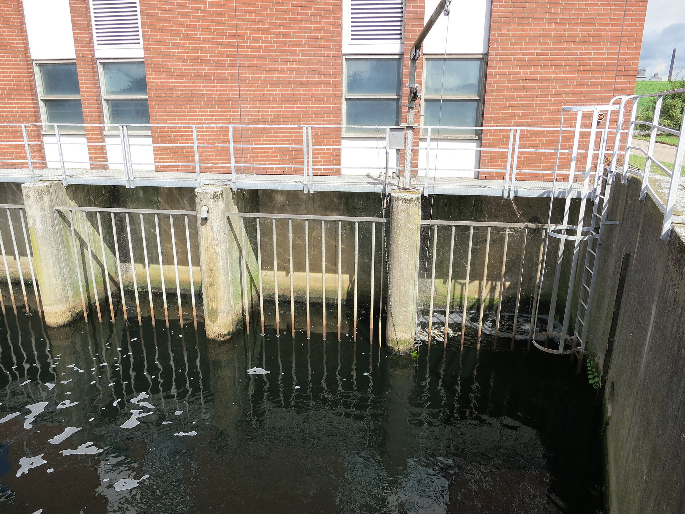
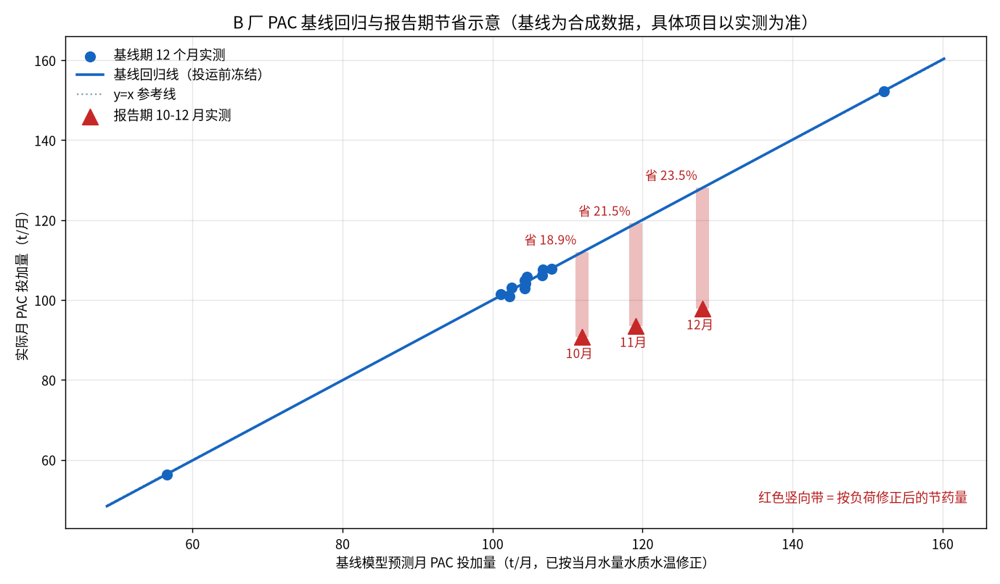
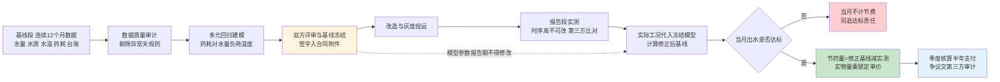

# 08-5 节能率怎么算：效益测量与验证 M&V

> 本章讲什么：节药率为什么是甲乙方最容易扯皮的数字；国际通用的 IPMVP 测量与验证规程怎么用大白话落到污水厂；基线回归模型怎么建、报告期怎么按负荷修正；最后给一份防作弊条款和对赌/EMC 合同的关键条款建议。
>
> 读完能干什么：用多元回归独立算出一个可信的节药率并一步步复算；审查合同里节费条款的漏洞；看懂"修正后基线""选项 A/C""基线冻结"这些术语到底在说什么。
>
> 阅读时间：约 28 分钟。

---

## 场景导入：同一个月，算出两个节药率

B 厂投运后的第一个冬天，甲方运行科和乙方项目经理在会议室里对着同一组数字发愣。12 月 PAC 实际用了 97.9 t，台账显示去年 12 月用了 132.0 t。乙方说："（132−97.9）÷132 = 25.8%，节药率 25.8%，按合同打钱。"甲方财务科说："今年 12 月水量比去年多 8.5%、进水磷还高了 12%，你们多用点药是应该的，这么算节药率虚高，我只认 15%。"

两个人都不算撒谎，但都错了：乙方错在拿"去年某月"当基线，忽略了水量水质水温全变了；甲方错在凭感觉压价，没有可复算的修正方法。**正确答案 23.5%** 藏在第三个算法里——先按今年 12 月的实际负荷，用冻结的基线模型算出"如果还是老办法操作，这个月该投多少"（128.0 t），再和实测 97.9 t 比。本章就把这个算法从头到尾讲清楚。

*真实照片：德国 Bremen-Seehausen 污水厂达标出水经溢流堰和排放口汇入威悉河。M&V 的流量计量与采样点就设在这类位置。图片来源：Wikimedia Commons，作者 C. Löser，CC BY 3.0 DE。*

---

## 一、节药率为什么最容易扯皮

因为分子分母每年都在自己动，直接拿"今年比去年少花多少"根本不成立：

1. **水量在变**：雨季水量大但污染物被稀释，旱季反之；管网改造、人口迁入也会改变基准水量。今年 12 月比去年多来 8% 的水，老办法操作也得多投药。
2. **水质在变**：上游工业园区排什么、接管了几家新企业，进水 TP/TN 负荷可以年差 20% 以上；[03-2](../03-问题与成本篇/03-2-污水厂成本账本-药剂到底花了多少钱.md) 那张台账里，最高月和最低月药费差 43%，主因就是水温与负荷。
3. **药价在变**：框架价一年一签，PAC 可能从 1800 涨到 1950 元/t，用量降了金额不一定降——所以节药率必须**按实物量（吨）算、按约定价格折金额**。
4. **季节和工况在变**：12 月只能和"冬季工况"比，不能和 7 月比；大修停产、极端暴雨、事故投加这些异常天要有明文剔除规则。

> 💡 **一句话记住 M&V**：不是"今年比去年省多少"，而是"**今年的活儿如果让去年的老办法干，会花多少**——减去今年实际花的，才是真省的"。

---

## 二、IPMVP 四种选项：大白话版

IPMVP（International Performance Measurement and Verification Protocol，国际节能效果测量与验证规程）是节能服务行业全球通用的规矩，核心思想就一句：**改造前先定基线，改造后按实际工况把基线修正到可比状态**。它给了四种测量"选项"，用大白话翻译如下：

| 选项 | 洋名字面意思 | 大白话 | 水厂加药适用性 |
|---|---|---|---|
| 选项 A | 隔离改造部分，测量关键参数 | 只管改造的那台设备/回路，关键参数实测、次要参数估定 | **最常用**：单个 PAC/碳源闭环回路，流量计+泵排量+关键水质实测 |
| 选项 B | 隔离改造部分，参数全部实测 | 同 A，但所有参数都装表实测，不做估算 | 示范项目、科研项目；计量改造成本高，商务项目少见 |
| 选项 C | 整体设施计量 | 不拆回路，用全厂电表/药剂总账评估整体效果 | 多药剂+曝气打包 EMC 适用，但账单噪声大，需要回归把无关因素剔干净 |
| 选项 D | 校准模拟 | 基线数据拿不到，用经校准的模型"还原"老办法表现 | 基线数据缺失厂的补救手段，模型要双方认可校准，费用高、周期长 |

补一句行业背景：IPMVP 不是认证体系、也不卖软件，它是一份国际节能服务行业的方法论共识（国内对应的标准思路与 GB/T 28750 等节能量计算导则相通）。污水厂加药项目不必照搬其全部文书格式，但『先冻结基线、后按工况修正、用实测说话』的逻辑必须照做——法院和审计认的从来是可复算，不是谁嗓门大。

本教程三个案例（[08-4](08-4-三个典型厂案例-方案BOM与ROI.md)）的推荐做法：**A、B 两厂用选项 A**（隔离加药回路，逐药剂算实物量节药率）；**C 厂加药部分用选项 A、含曝气的总效益用选项 C**（全厂电费账单做整体回归）。无论哪个选项，规程文件都包含同一套四件套：节能计划（改造前签）、基线模型、测量计划、报告期报告。

---

## 三、基线怎么建：多长、什么模型、怎么冻结

### 3.1 基线期长度

- **最少 3~6 个月**：覆盖一个明显的负荷变化段，适合工期紧、且有完整在线数据的厂；
- **理想 12 个月**：完整覆盖春夏秋冬一轮水温周期——加药（尤其碳源和除磷）季节性极强（[03-2](../03-问题与成本篇/03-2-污水厂成本账本-药剂到底花了多少钱.md) 台账冬夏差 43%），没有冬季数据的基线，第一个冬天必然吵架；
- 基线数据不足怎么办：先用在线采集补 4~6 周高频数据应急（选项 A 可接受），同时把第一个运行年作为"滚动基线年"，次年再正式考核——这就是 IPMVP 选项 D 的常见用法。

### 3.2 基线回归模型（以 B 厂 PAC 为例）

把"老办法下该投多少药"建成一个多元线性方程，自变量就是三个天天在变的运行条件：

> **PAC（t/月）= β₀ + β₁·Q + β₂·L_TP + β₃·(20 − T)**
>
> Q＝当月水量（万 m³）；L_TP＝进水总磷负荷（水量×进水 TP）；T＝月均水温（℃）；β 为回归系数

用基线 12 个月的日数据（本教程配套脚本按 [03-2](../03-问题与成本篇/03-2-污水厂成本账本-药剂到底花了多少钱.md) 台账结构生成的合成数据）做最小二乘拟合，得到：

> **PAC（t/d）= 0.563 + 0.0934·Q_d + 0.4497·TP_in + 0.0591·(20 − T)**
>
> 日数据 R² ≈ 0.45，基线年合计 1253.3 t（与 03-2 台账 1250.9 t 一致）

符号读法（单位：Q_d 为万 m³/d、TP_in 为 mg/L、T 为 ℃，具体项目以实测拟合为准）：每天基础投加 0.563 t；每万方水加约 0.093 t；进水 TP 每高 1 mg/L 多加约 0.45 t；水温比 20 ℃ 每低 1 ℃ 再加约 0.059 t。日级 R² 只有 0.45 不丢人——残差里一大块是**老师傅人工操作本身的随意性**（冲击日加倍找补、平稳日凭感觉），这部分恰恰是 AI 要消灭的对象；按月聚合后，点几乎贴着回归线走（见本章图），用于月度结算是足够的。基线模型上线前双方书面确认三件事：用哪些变量、用哪段数据、异常天怎么剔除——签字后**冻结**，报告期不许回头改模型参数。

### 3.3 报告期修正公式

> **修正后基线投加量 B_adj = f(Q_报告， TP_报告， T_报告)**（把报告期实际工况代入冻结模型）
>
> **节药量 S = B_adj − A_real**（A_real 为报告期实测投加量）
>
> **节药率 = S ÷ B_adj ×100%**；折金额 = S × 框架协议单价

### 3.4 测量边界：先圈清楚"改了什么、就算什么"

建模前还要在节能计划里画一张边界图：哪些药剂回路属于改造范围、计量点装在哪、哪些共用费用（如一台泵同时服务两条线）怎么分摊。三条实操规则：

- **边界跟着 BOM 走**：改造清单（[08-4](08-4-三个典型厂案例-方案BOM与ROI.md) 里动了的泵和仪表）覆盖到哪个加药点，节费就算到哪个点；没改造的回路用药波动不进考核；
- **共用回路按实测比例分摊**：一套 PAC 装置同时供生物段和深度段时，用各自加药支管流量计读数分摊，拍脑袋五五开最容易留争议；
- **污泥与电费连锁收益单列**：少产化学泥饼、PAM 联动节省、曝气协同节电要作为独立科目，各自写清计算口径（本教程统一取每少投 1 t 液体除磷剂约少产 1.8 t 含水率 80% 泥饼），不混进药剂节药率里凑数。

---

## 四、完整算例：B 厂报告期三个月（一步步算）

投运后第一年 10~12 月（均为冬季工况），实测水量、进水 TP、水温逐月不同。把这三个月的实际工况代入冻结模型，得到"老办法该投多少"，再与实测对比：

| 月份 | 水量（万 m³） | 进水 TP（mg/L） | 水温（℃） | 修正后基线 B_adj（t） | 报告期实测（t） | 节药量（t） | **节药率** | 折金额（万元，1800 元/t） |
|---|---|---|---|---|---|---|---|---|
| 10 月 | 316.2 | 4.2 | 16.5 | 111.9 | 90.7 | 21.2 | **18.9%** | 3.82 |
| 11 月 | 297.0 | 4.6 | 13.0 | 119.1 | 93.5 | 25.6 | **21.5%** | 4.61 |
| 12 月 | 325.5 | 4.7 | 12.0 | 128.0 | 97.9 | 30.1 | **23.5%** | 5.42 |
| **合计** | 938.7 | — | — | **359.0** | **282.1** | **76.9** | **21.4%** | **13.85** |

*表中数字由配套脚本 fig08_05_mv_compare.py 实算输出（基线为合成数据，具体项目以实测为准）。*

以 12 月为例分步复算：① 日均水量 10.5 万 m³、进水 TP 4.7 mg/L、水温 12 ℃ 代入冻结方程，日基线 = 0.563 + 0.0934×10.5 + 0.4497×4.7 + 0.0591×8 ≈ 4.13 t/d；② 乘 31 天得修正后基线 **128.0 t**；③ 报告期实测 **97.9 t**；④ 节药量 = 128.0 − 97.9 = **30.1 t**，节药率 = 30.1 ÷ 128.0 = **23.5%**；⑤ 折金额 = 30.1×1800 = **5.42 万元**。

对照开头的三种算法就明白差在哪：直接比去年 12 月（132.0 t）得 25.8%——虚高，因为今年水量更大；拍脑袋砍到 15%——没依据；按负荷修正后的 **23.5%** 才是双方都能复算的数。三个月综合节药率 **21.4%**，落在 15%~30% 的行业口径区间内。基线月均药费参考值：基线年月均 PAC 104.4 t、约 18.80 万元/月——注意它只能用来感受量级，不能直接当某月基线，某月基线必须用当月工况修正。

*数据为合成基线实算（具体项目以实测为准）：蓝点是基线期 12 个月，蓝线是冻结的基线回归线；红三角是报告期三个月，全部落在回归线下方，竖向红色带就是按当月负荷修正出来的节药量（18.9%~23.5%）。*

> ⚠️ **老工程师的坑**：三种最常见的"节药率魔术"：① 只报最好的一个月（12 月 23.5%），不报雨季低负荷月份——考核必须按连续 3~12 个月累计算（76.9÷359.0）；② 报告期偷偷调低仪表量程或换化验方法让数据变好看——计量与检测方法必须与基线期一致；③ 把药剂单价下跌说成节能效果——合同必须约定节费按实物量乘基期锁定单价结算，或对单价差另行调价。

---

## 五、防作弊条款：写进节能计划的八条规矩

M&V 的本质不是算数学，是**提前把双方能钻的空子都堵死**。下列条款建议在改造前的节能计划（节能服务合同附件）中逐条写明：

| 条款 | 约定内容 |
|---|---|
| 1. 基线冻结 | 基线数据区间、回归变量、异常剔除规则、回归系数经双方签字后冻结，报告期不得修改 |
| 2. 异常数据处理 | 停产大修、极端天气、事故投加、仪表故障日的认定标准与剔除/插补方法事先列明，双方数据员共同签字确认 |
| 3. 计量一致性 | 报告期流量计、泵排量标定方法与基线期一致；泵排量每季度抽测一次，偏差超 ±3% 重新标定 |
| 4. 第三方化验比对 | 在线 TP/氨氮仪每月与第三方检测机构国标法至少比对 1~2 次，偏差超限以第三方数据为准 |
| 5. 数据防篡改 | 用边缘侧时序库归档数据，时间戳与操作日志不可改；双方各持一份只读账号 |
| 6. 超标即不计节费 | 考核期内发生排放超标或被行政处罚的月份，当月药剂节费不予计列，且不影响甲方追究达标责任 |
| 7. 单价口径 | 节费金额 = 节药实物量 × 基期锁定框架价；采购价波动由甲方自行承担或按价格指数另行调整 |
| 8. 争议解决 | 对数据有争议时以共同委托的第三方计量审计为准，费用由偏离方承担 |

第 6 条尤其要说透：**节药永远从属于达标**。任何月份的节能数字都不能建立在出水冒险之上——这和 [08-3](08-3-安全联锁与人工接管.md) 的红线是同一条，只是从商务角度再钉一遍。

---

## 六、对赌/EMC 合同关键条款建议

EMC（合同能源管理，Energy Management Contract）模式在水厂加药里的玩法：乙方先垫资建设，从经 M&V 确认的年节费里按比例分成回收投资。合同谈判时以下九条是真正的胜负手：

1. **保底节药率（对赌线）**：建议按保守值约定，如 PAC 年节药率 ≥15%、碳源 ≥10%（口径下沿），达不到由乙方以现金或延长免费服务补足；承诺超过 30% 的方案要警惕，大概率基线被做高或拿达标冒险。
2. **分成比例**：行业常见乙方在合同前 1~2 年拿节费的 50%~70%、之后逐年递减至 30%~40%；节费确认与支付周期建议季度核算、半年支付。
3. **达不到怎么办**：分档处理——达到保底线正常分成；低于保底线但系统正常，乙方补足差额或免费延长服务期；因乙方系统故障导致节费损失，按故障天数扣减；出水超标相关损失不设上限。
4. **节费天花板**：设单月节费计列上限（如不超过修正基线的 30%），防止极端数据月份双方分了不该分的钱。
5. **投资与资产归属**：合同期内硬件归乙方或归甲方（两种模式税负与会计处理不同，先问财务）；**模型、数据与账号的归属必须写明归甲方或合同期满无偿移交**，防止乙方离场后系统变砖头。
6. **合同期限**：典型 3~5 年，与设备折旧、仪表寿命匹配；期满后年运维费按市场价另行约定。
7. **甲方配合义务**：停水窗口、数据账号、化验比对、人员培训配合时限写成条款，因甲方不配合导致工期/效果不达标，责任与基线顺延。
8. **退出与接管**：提前终止时硬件残值公式、数据导出格式、源代码/模型包托管（第三方存证）都要有约定。
9. **M&V 方法入合同正文**：把选项类型、基线模型、计量点、第三方机构、报表模板作为合同附件，不能只写"节药率不低于 15%"一句空话。

> 💡 **现场经验**：见过最稳的一份合同把节费分成写成"双触发"：当月节药率达标 **且** 出水达标率 100% 才计列；同时乙方为超标购买了环境责任险。甲方厂长签字时说了一句话，值得抄进每个项目——"我买的是安全地省钱，不是省钱本身。"

---

## 七、碳源、PAM、电费的基线有什么不同

PAC 基线靠水量+磷负荷+水温三个量就能解释大头，但厂里其他几本账的"驱动变量"不同，不能套同一个模型：

| 考核对象 | 基线模型该抓的自变量 | 特殊注意点 |
|---|---|---|
| 碳源（乙酸钠等） | 水量、进水 TN/硝态氮、进水碳氮比（BOD 或 COD/TN）、水温、内回流比 | 冬季硝化差时碳源最敏感；必须把『冲击日过量找补』从基线残差里识别出来，否则把浪费当成了合理需求 |
| PAM | 绝干污泥量（不是湿泥饼车数）、进泥浓度、脱水机型与开机时长 | 泥饼车数含水率天天变，用它做基线误差极大；[03-2](../03-问题与成本篇/03-2-污水厂成本账本-药剂到底花了多少钱.md) 讲过化学泥随除磷剂增减，PAM 模型里应把 PAC 投加量也列为自变量 |
| 曝气电耗 | 水量、进水负荷、水温、DO 设定值、鼓风机运行组合 | 选项 C 整体账单回归时要剔除非生产电耗提升（新增设备、办公空调改造），并把降雨量作为雨季修正项 |
| 次氯酸钠 | 水量、水温（夏季可压低）、粪大肠菌群抽检结果、接触时间达标情况 | 消毒裕度直接关系卫生安全，考核节药前先确认余氯/粪大肠菌群留足安全边界 |

> ⚠️ **老工程师的坑**：碳源项目最常见的基线陷阱是『内生变量』——碳源投多了会推高好氧段负荷、改变硝化状态，模型若把『投药后才产生的数据』当自变量，就是自己解释自己，节药率可以算出 40% 的假数。基线变量只能取投药决策前可获得的量：进水水质、水量、水温、设备状态。这条规则在 [06-3](../06-AI建模篇/06-3-加药量预测建模完整实战.md) 叫特征穿越，在 M&V 里叫内生性，本质是同一个坑。

---

## 八、基线建模的四个常见错误与月度报表模板

### 8.1 四个常见错误

1. **变量贪多过拟合**：把十几个仪表都塞进回归，R² 在基线期漂亮得不像话，报告期一换工况就失准。基线模型自变量控制在 3~5 个物理上说得通的量，宁可粗、不可假。
2. **拿月台账硬回归**：12 个月只有 12 个样本点，回归自由度所剩无几。正确做法是用日数据（365 个点）建模、按月累加结算——本章算例脚本就是这么做的。
3. **异常天不剔除**：大修停水、上游偷排冲击、应急投加的天数若留在基线里，等于把事故也算成了"正常需求"。剔除规则必须改造前定，不能报告期看心情删。
4. **只有 R² 没有残差检查**：R² 高不代表模型好，还要看残差有没有随季节规律性偏斜（系统性高估冬季会让乙方吃亏、低估冬季会让甲方吃亏），残差应大致围绕零随机分布。

### 8.2 月度 M&V 报表最小字段模板

| 字段组 | 具体字段 | 数据来源 |
|---|---|---|
| 工况 | 月水量、进水 TP/TN/COD 均值与峰值、月均水温、异常天清单 | 时序库+化验记录 |
| 计量 | 各药剂月初库存、入库、月末盘点、泵排量反推值 | 仓库台账+采集系统 |
| 基线 | 冻结模型版本号、各回归系数、修正后基线投加量 | M&V 计算书（自动生成） |
| 实测 | 报告期实物消耗量、与泵排量交叉验证结果 | 时序库+抽测标定 |
| 结果 | 节药量、节药率、锁定单价、折金额、达标率与超标事件 | 计算书+在线监测 |
| 签署 | 甲方运行/财务、乙方项目经理、第三方（如有）签字 | 纸质+电子归档 |

报表每月 5 日前由系统自动生成草表，双方数据员核对原始凭证后签字；任何手工修改都在表内留痕并注明原因。连续三个月无人对草表提出异议，视为确认——既防篡改，也防拖延。

---

## 九、M&V 全流程一张图

---

## 十、三类人的 M&V 行动清单

同一份 M&V 文件，不同角色关心的事完全不同，进场前各自先把自己的功课做掉：

**甲方厂长/生产科：**
1. 改造前留好基线——至少提前 3~6 个月规范台账（出入库、泵运行、化验记录），数据越扎实，乙方报价越不敢虚高；
2. 坚持第三方化验比对和超标不计费两条，这是甲方最有力的两个安全阀；
3. 合同里锁死模型与数据归属，防止乙方离场后系统无人能维护。

**乙方项目经理：**
1. 阶段②的数据审计做扎实，基线是乙方自己的收款依据——基线数据被甲方后期质疑，伤的是乙方；
2. 保底线取口径下沿（除磷 15%、碳源 10%），把超预期部分留给运营惊喜，而不是写进对赌；
3. 月度报表自动生成、双方数据员常态化签字，别攒到年底一次性算账，攒得越久越难谈。

**第三方机构/集团审计：**
1. 重点查三件事：冻结模型有没有被偷改、异常天剔除是否符合事先规则、在线数据与化验/泵排量能否对上；
2. 抽测不打招呼，抽泵排量、抽库存盘点、抽化验平行样三个动作各做一次，大部分水分当场现形。

> 💡 **现场经验**：判断一份节能合同成不成熟，不用看长篇法律文字，翻到 M&V 附件找三个东西：有没有冻结的回归公式（而不是一句『按实际工况调整』）、有没有超标不计费条款、有没有第三方机构名字。三样齐全的合同，执行阶段通常风平浪静；三样缺一样，省下来的钱最后多半变成律师费和差旅费。

---

## 本章小结

1. 节药率扯皮的根源是水量、水质、药价、季节全在变；正确问题不是"今年比去年省多少"，而是"今年的活儿让老办法干会花多少"。
2. IPMVP 四选项：单回路加药用**选项 A**（关键参数实测）、多系统打包用**选项 C**（整体账单回归）、基线缺失用**选项 D**（校准模拟），选项 B 用于高要求示范项目。
3. 基线期最少 3~6 个月、理想 12 个月；B 厂 PAC 基线模型为 0.563+0.0934·Q+0.4497·TP+0.0591·(20−T)，基线必须双方签字冻结。
4. 完整算例：报告期 10~12 月修正后基线 359.0 t、实测 282.1 t、节药 76.9 t、综合节药率 21.4%、折金额 13.85 万元（单月 18.9%~23.5%），数字全部脚本实算、可复算。
5. 商务上记住两条硬约定：**超标月份不计节费**、**模型与数据资产合同期满归甲方**；保底节药率取口径下沿（除磷 15%、碳源 10%），吹到 30% 以上的承诺要打问号。

---

上一章：[08-4 三个典型厂案例：方案 BOM 与 ROI](08-4-三个典型厂案例-方案BOM与ROI.md) ｜ 下一章：[08-6 行业十道天花板](08-6-行业十道天花板-做不到的事与现实的凑合方案.md)
