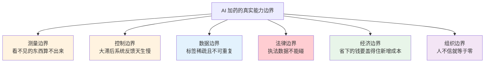

# 08-6 行业十道天花板：AI 加药做不到什么，现实中大家怎么凑合

> 本章讲什么：前面四十多章都在讲"怎么做成"，这一章反过来讲"做不到什么"。把污水厂加药智能化行业里公认的十道天花板逐一说透——每道天花板的物理根因是什么、工程上的极限在哪、买不起或做不到时一线现在用什么土办法凑合，以及销售话术中哪些承诺本质上是撞天花板。
>
> 读完能干什么：听到"全流程无人值守""进水预测准确率 95%""投资回收期半年"这类话术时能立刻判断真假；在预算有限、仪表不全、数据稀疏的现实厂子里知道什么方案可落地、哪些指标该让步；给自己的项目设定一套不翻车的合理预期。
>
> 阅读时间：约 28 分钟。建议在写方案或听汇报之前先读一遍。

---

## 场景导入：验收酒桌上的三个"为什么"

某集团智慧水务项目验收，酒过三巡，运行总监问了供应商三个问题：

1. "你们能预测进水，那为什么上游工业区昨晚偷排，我们还是挨了一闷棍？"
2. "总磷在线仪十五分钟才出一个数，你们的秒级 AI 闭环，闭的到底是谁的环？"
3. "这套系统一年省 80 万，可光在线仪表的试剂、校准和运维费就要 40 万，省的钱是不是有一半本来就是给仪表厂打工？"

供应商答得支支吾吾。这三个问题都不是实施没做好——它们撞上的是**行业天花板**：受物理规律、测量原理、生物特性、法律和经济规律限制，不是换个大模型、多买几台服务器就能突破的东西。

承认天花板不是泄气。恰恰相反，优秀的工程师和产品经理的价值，就在于清楚天花板在哪、能把"天花板以下的每一分钱"都挣到，并在撞墙的地方用土办法把日子过下去。

---

## 一、天花板①：进水水质基本不可观测，前馈"无米下锅"

**物理根因**：前馈控制的理想输入是进水的流量和污染物浓度（[07-2](../07-控制优化篇/07-2-前馈加反馈控制器设计实例.md) 讲过前馈比反馈快一个滞后周期）。但现实是，**全国 90% 以上的市政污水厂进水口没有 COD、氨氮、总磷在线分析仪**，有的甚至连进水流量计都长期不准。原因很实在：

- 进水垃圾多、含砂含油，分析仪取样预处理系统一周堵三回，仪表班修不过来；
- 一台靠谱的进水多参数分析小屋投资 30 万~80 万元，年试剂和维护费 5 万~10 万元，而进水数据不参与环保考核，厂长没有花钱动力；
- 进水组分一天三变，分析仪测的还是"十五分钟前的进水"，等结果出来水早就进池了。

**工程极限**：进水水质的"测量值"在时序上永远滞后于水流本身，不存在一种便宜可靠的办法在污染物进厂前测准它。

**现实中的凑合办法**（从糙到精，按预算选）：

| 凑合层级 | 做法 | 成本 | 实际效果 |
|---|---|---|---|
| L0 经验档 | 进水流量 + 提升泵运行台数估算水量峰谷；雨季看泵房液位和雨水泵启泵信号 | 几乎为零 | 能预判水量冲击 30~90 分钟，预判不了浓度 |
| L1 调度档 | 与上游泵站、管网调度建立电话/微信群报量机制；关注片区工业用户的生产和排水规律 | 沟通成本 | 工业区偷排、学校放假、餐厨复工等事件型冲击能提前知道 |
| L2 廉价探头档 | 进水电导率、pH、ORP、温度四件套（几千到两三万元），电导率对工业废水混入相当敏感 | 低 | 浓度变化方向能感知，具体污染物浓度测不出，适合做"有异常"触发器 |
| L3 远端前哨档 | 在上游提升泵站装简易探头或取样点，把预警时间从"进厂"提前到"管网途中" | 中 | 多换 1~3 小时反应时间，性价比常高于厂口装分析仪 |
| L4 正规档 | 进水 COD/氨氮在线仪 + 良好预处理与维护制度 | 高 | 数据全，但维护跟不上就是摆设，不少厂的进水分析仪最后只当个趋势看 |

> **穿透话术**："AI 预测进水负荷"在没有任何进水测量的厂，本质只是用历史流量曲线做外推——它能预测早晚高峰这种**规律性**波动，预测不了偷排这种**信息外事件**。把前者说成 90% 准确率不算撒谎，把后者也包进去就是。

---

## 二、天花板②：在线水质分析有测量周期，"秒级闭环"是个误会

**物理根因**：总磷、总氮、氨氮、COD 在线分析仪用的是试剂比色法，本质是"把化验员的动作装进机器"——取样、加试剂、消解显色、比色、清洗，一个周期 15~60 分钟（总磷总氮往往还要消解，更长）。它给控制回路的反馈节奏就是**一刻钟到一小时一拍**，而且结果反映的是取样那一刻的水。

**工程极限**：化学测量原理决定了周期不可能无限缩短。这意味着拿总磷仪做秒级 PID 反馈在物理上不成立；DO、流量、液位、pH 这类电极/电磁仪表确实秒级可得，但它们测的是"过程状态"不是"最终成绩单"。

**现实中的凑合办法**：

1. **快慢分层**：秒级过程仪表（流量、DO、ORP、MLSS）负责快环，水质分析仪负责慢环校正——这正是 [07-2](../07-控制优化篇/07-2-前馈加反馈控制器设计实例.md) "前馈打主力、反馈修偏差"的物理原因，不是算法偏好，是测量节奏逼出来的；
2. **看趋势不跳变**：分析仪单点跳变不动作，连续 2~3 个周期同向才确认（[08-3](08-3-安全联锁与人工接管.md) 联锁也是这么定的）；
3. **用过程量推断成分量**：DO 下降速率、ORP 拐点、比耗氧速率等都能在分析仪出数之前反映负荷变化，这是廉价而有效的"半个分析仪"；
4. **分析仪维护期挂标志位**：测量、校准、清洗、故障四种状态必须上传，系统在非"测量"状态冻结该路反馈，否则控制回路会拿清洗水的读数当出水水质。

> **穿透话术**：宣传"毫秒级 AI 加药闭环"的方案，问一句"闭环反馈信号来自哪台表、测量周期多少"——如果答案是总磷仪，对方要么不懂行，要么故意混淆执行层节拍和测量层节拍。

---

## 三、天花板③：标签一天只有 1~3 个，监督学习"吃不饱"

**物理根因**：AI 数据驱动模型最馋的是"输入 X 时刻的工况 → 输出 Y 时刻的出水结果"成对标签。可全工艺最权威的标签来自化验室，而国内市政厂化验频次普遍是出水 COD/氨氮/总磷/总氮每天 1~3 次，进水和过程指标更低。一个厂一年攒下来的高质量标签只有几百到一两千个，还高度集中在平稳工况——冲击样本本来就少，落在化验取样点上的更少。

**工程极限**：标签密度不可能靠软件补；在线分析仪数据可以当"伪标签"扩样，但伪标签含测量噪声且自身周期长，不能当真值用。

**现实中的凑合办法**：

- **在线仪伪标签 + 化验校准**：用在线仪 15 分钟一拍的数据扩样训练，再用化验真值定期校正其偏差，承认伪标签噪声大、只用于模式学习不用于精确标定；
- **对齐做厚**：把"投加时刻 → 水力停留 → 化验时刻"的时间对齐做扎实（[05-2](../05-数据篇/05-2-数据质量治理-脏数据的九种死法.md) 讲过时钟坑），几百个对齐良好的标签胜过几万个错位标签；
- **软测量先行**：用秒级过程量预测分钟级水质（[05-3](../05-数据篇/05-3-软测量-用便宜仪表猜贵指标.md)），本质就是绕开标签稀缺；
- **机理兜底、数据只做修正**：灰箱模型（[06-6](../06-AI建模篇/06-7-模型上线监控与迭代运维.md) 前一章）对标签数量最不敏感，是小数据厂的主力形态；
- **专项加密取样**：验收或建模期安排 2~4 周加密化验（每 2 小时一次），花小钱买关键标签，比堆模型有效得多。

---

## 四、天花板④：加药到出水滞后 4~12 小时，反馈控制天生慢半拍

**物理根因**：药剂投在进水端或生化池前端，要经过混合、反应、沉淀、二沉，出水仪表才看得见结果，市政厂典型纯滞后加惯性时间常数合计 4~12 小时，工艺扩建或低负荷时更长。控制理论里有个冷酷结论：**纯滞后越大，反馈回路越不敢调快，调快必然振荡**（[04-5](../04-机理公式篇/04-5-加药过程动态特性-PID前馈与反馈.md) 已讲过）。这不是 PID 参数没调好，是方程决定的。

**工程极限**：任何反馈策略对"此刻"进水冲击都无能为力——等出水报警再调药，最坏情况已经发生。

**现实中的凑合办法**：

1. **前馈扛 80%**：进水流量、泵机状态、上游信号一有动作就同步调药，不等结果；
2. **反馈只修慢偏差**：反馈增益压低、周期拉长（15~60 分钟一拍甚至更慢），让它只纠"药剂量程漂移、季节转换"这类慢趋势，不追快波动；
3. **加药点尽量后移**：深度除磷改在二沉后/深度处理段投加，滞后可从 8 小时缩到 20~40 分钟——工艺设计上的一个选择，比控制算法值钱；
4. **缓冲靠池子**：调节池、事故池用足，削峰填谷本身就是最好的"控制器"；
5. **接受次优**：大滞后系统追求的不是"恰好"，是"八九不离十且不振荡"。追求曲线贴得太紧的方案，往往三个月内被运行员切回手动。

---

## 五、天花板⑤：极端工况样本永远缺，模型在最关键时刻最没把握

**物理根因**：寒潮、春节复工、暴雨合流制溢流、工业偷排、污泥膨胀——这些正是最需要 AI 的时刻，但十年一遇的事历史数据里就那么几条，甚至一条都没有。机器学习在训练分布之外没有外推保证，而事故工况全部落在分布之外。

**工程极限**：不可能为没发生过的事故预先训练出可靠模型；合成数据和仿真（BSM，[07-4](../07-控制优化篇/07-4-数字孪生与仿真验证-BSM基准平台.md)）能补一部分，但仿真与真实生物系统之间永远有缝。

**现实中的凑合办法**（行业共识：极端工况不交给模型）：

- **规则兜底**：已知极端工况（雨量计报警、进水 pH 越限、温度骤降）用硬规则直接切保守预案，不经过模型判断；
- **适用域白名单**：系统实时判断"当前工况在不在模型训练分布内"，出域即报警并降级到 L1 建议或定值（[06-7](../06-AI建模篇/06-7-模型上线监控与迭代运维.md) 的 PSI 监控）；
- **限值与速率永远在线**：就算模型给出荒唐值，物理限幅和变化率限制把后果封在小范围（[08-3](08-3-安全联锁与人工接管.md)）；
- **把事故写成预案卡**：每经历一次异常，复盘后固化成一条规则或一张响应卡——系统的极端工况能力是**长出来的**，不是上线时买来的。

> 一句行话：**平稳工况比人省，极端工况比人怂**——这才是工业 AI 该有的性格。宣传"全工况自适应"的，让他拿历史事故数据回放看结果。

---

## 六、天花板⑥：生物系统不可重复，模型会"过期"

**物理根因**：化工塔今天和昨天基本一样，活性污泥系统不一样——菌群随温度、泥龄、进水毒物、季节在演替，设备在老化衰减，曝气盘会堵，内回流泵会磨损。去年训出来的模型今年自动失效，这叫**概念漂移**（[06-7](../06-AI建模篇/06-7-模型上线监控与迭代运维.md) 详述了修法）。模型是"活物"，不是交付一次的设备。

**工程极限**：不存在"交付即永久有效"的模型；漂移只能监控、延缓、定期重训，不能消灭。

**现实中的凑合办法**：把模型当汽车而不是当彩电——买来必须持续养。最低配的养护是：每月一次残差体检、每季一次精度复核、每半年到一年一次再训练，并把这笔费用和责任人写进合同（[08-8](08-8-上线之后-运维制度与组织保障怎么建.md)）。没有运维预算的项目，最好的选择是不上复杂模型，用机理+前馈规则这类"不需要喂养"的方案。

---

## 七、天花板⑦：效益在统计上难归因，节能率永远吵不完

**物理根因**：要算"AI 省了多少药"，理想情况是来两批完全相同的污水，一批用 AI、一批不用——不存在。进水量、浓度、温度、雨情天天变，药剂、设备、人的操作也同时在变，效益无法做严格对照实验，只能用基线模型做统计扣除（[08-5](08-5-节能率怎么算-效益测量与验证MV.md) 的 IPMVP）。模型再好，基线也有 ±几个百分点的不确定带。

**工程极限**：5% 以内的节药率差异，在大多数厂的数据质量下无法与噪声区分，谁报"98% 置信度下省 3%"都要打个问号。

**现实中的凑合办法**：

- 口径冻结在投运前，基线模型和防作弊条款双方签字，事后谁都不许改算法；
- 节能率超过 8%~10% 再拿出来宣传，3%~5% 的结果只当趋势参考；
- 用"药耗单耗（kg 药/千吨水或 kg 药/kg 去除污染物）"而非绝对药费对比，剔除水量影响；
- 合同里约定争议处理机制（第三方复核、取多年滚动平均），把丑话说在前面。

---

## 八、天花板⑧：出水在线数据是执法证据，AI 碰不得

**法律根因**：排污口的 COD、氨氮、总磷、总氮在线监测数据直传环保平台，是**执法证据**。《环境保护法》《水污染防治法》及数据造假相关司法解释规定：篡改、伪造监测数据，或故意干扰采样、稀释样水，可以按污染环境罪追究刑事责任，单位与个人双罚，相关责任人还可能被行政拘留。这不是厂规，是刑法问题。

**工程含义**：

- AI/控制系统与环保在线监测系统之间必须保持隔离：模型只能**读取**监测数据用于判断，绝不允许任何控制指令回写到监测设备，更不许在超标风险时动取样系统的脑筋；
- 加药系统的优化目标是"在合法监测数据下达标且省药"，而不是"让监测数据好看"；
- 系统所有建议、确认、手动覆盖动作全程留痕——留痕既保护老板也保护运行员：证明超标时系统已尽提示义务、人按规程处置。

> 行业里确有因为"在采样头附近加药、稀释样水"被定性为数据造假判刑的案例。给团队划这道红线时，措辞不需要任何修饰：**监测数据的真实性，高于任何节能指标和任何领导指示。**

---

## 九、天花板⑨：经济性天花板——小厂省的药可能不够养仪表

**经济根因**：AI 加药的收益主要来自药剂费节约，成本除了建设费，还包括在线仪表试剂耗材、校准、备件、网络、模型运维。对小厂，账可能倒挂。粗算给你看（数量级估算，具体随地区）：

| 项目 | 5 万吨/日典型厂 | 1 万吨/日小厂 |
|---|---|---|
| 年药剂费总盘子（PAC+碳源+PAM+消毒） | 300 万~800 万元 | 60 万~150 万元 |
| AI 优化实际可节约空间（8%~15%） | 30 万~90 万元/年 | 5 万~18 万元/年 |
| 新增/托底的仪表试剂与校准费 | 8 万~20 万元/年 | 4 万~10 万元/年（一样省不掉） |
| 模型与系统年运维费 | 5 万~15 万元/年 | 3 万~8 万元/年 |
| **经济结论** | 通常成立 | **经常倒挂或勉强打平** |

仪表试剂和运维有大量**固定成本**，不按水量缩放——这是小厂吃亏的根本原因。

**现实中的凑合办法**：

- 小厂不上大而全：优先做**除磷单回路建议系统**（药剂费占比高、见效快），碳源优化等有余力再说；
- L1 开环建议起步，不做闭环、不新增过多仪表，用已有 SCADA 数据 + 廉价过程探头；
- 集团化打包：十几个小厂共用一个云端模型和一支运维队伍摊薄固定成本，单厂算账都不成立的事，集中起来可能成立；
- 运维托管/EMC 模式让专业方承担仪表养护（但 [08-5](08-5-节能率怎么算-效益测量与验证MV.md) 讲过的对赌条款要写清）。

> **穿透话术**：不论厂大小一律推同一套"智慧水厂全栈方案"的供应商，没替你算账。年药剂费低于 100 万、仪表基础又薄弱的厂，第一步永远是先补仪表和计量，而不是上 AI。

---

## 十、天花板⑩：组织与信任——人不用，一切归零

**根因**：再准的建议，运行员不采纳就是零；再安全的系统，班长半夜切回手动就回到原点。运行员不信任系统有极其现实的理由：超标挨罚的是他不是算法工程师，而系统出过一次荒唐建议的记忆，能盖过一百次正确建议。

**现实数据与经验**：行业里大量"验收即巅峰"的智慧水务项目，技术失败只占小头，多数死于：

- 考核没配套——药耗考核奖不给班组，达标责任却全压在班组，理性选择当然是多投保险；
- 培训走过场——只会点确认、看不懂建议依据，心里没底就不用；
- 领导工程——剪彩完没人推，供应商撤场三个月即闲置；
- 责任真空——系统建议错了谁负责没有书面说法，运行员默认"用了算我的，不用算老办法的"。

**现实中的凑合办法**（详见 [08-8](08-8-上线之后-运维制度与组织保障怎么建.md)）：长期停在 L2 半自动而不追求 L3 全自动，把人留在回路里；药耗节约收益切一块到班组绩效；每一条建议附"为什么"（依据数据+置信度）；厂长亲自盯前三个月的采纳率。技术方案最多决定系统的上限，组织保障决定它的下限——而下限才决定项目死活。

---

## 十一、十道天花板速查表

| # | 天花板 | 根因类型 | 工程极限 | 现实凑合 | 撞墙话术警报 |
|---|---|---|---|---|---|
| ① | 进水不可观测 | 测量/成本 | 进厂前测不准浓度 | 流量+调度+电导率+泵站前哨 | "全要素进水预测" |
| ② | 分析仪表周期长 | 化学原理 | 15~60 min 一拍 | 快慢分层、过程量推断 | "秒级水质闭环" |
| ③ | 标签稀疏 | 化验频次 | 一天 1~3 个真值 | 伪标签+软测量+灰箱+加密取样 | "零样本冷启动自学习" |
| ④ | 大滞后 | 水力过程 | 4~12 h，反馈不敢快 | 前馈为主、加药点后移 | "出水实时反馈精确调节" |
| ⑤ | 极端工况无样本 | 概率稀有 | 分布外无保证 | 规则兜底+适用域+限幅 | "全工况自适应" |
| ⑥ | 概念漂移 | 生物演替 | 模型必然过期 | 监控+定期再训练+预留运维费 | "一次交付永久最优" |
| ⑦ | 效益难归因 | 不可复实验 | ±几个百分点噪声带 | 冻结口径、看单耗、长期对比 | "保证省 3% 还精确可信" |
| ⑧ | 执法数据不可碰 | 法律红线 | 只能读不能写 | 物理隔离+全程留痕 | 任何"帮监测数据变好看" |
| ⑨ | 小厂经济倒挂 | 固定成本 | 收益盖不住养表费 | 单回路、L1、集团打包 | 小厂也推全栈方案 |
| ⑩ | 组织信任 | 人因制度 | 不用等于零 | L2 常驻+绩效配套+建议可解释 | "无人值守全自动水厂" |

记住这张表的用法：**不是用来认输的，是用来在方案阶段就把预期、预算和边界对齐的**。在天花板以下做到扎实的厂，药耗普遍能降 8%~15%、超标风险明显下降——这个成绩不性感，但真金白银，而且今天就能落地。

---

## 本章小结

1. 十道天花板分六类：测量边界（进水不可观测、分析周期长）、数据边界（标签稀疏）、控制边界（大滞后、极端工况无样本）、物理生物边界（概念漂移、效益难归因）、法律边界（执法数据碰不得）、经济与组织边界（小厂倒挂、人不信任）。
2. 每道天花板都有"土办法层级"：先用零成本的流量与调度，再上廉价过程仪表，最后才是贵的分析仪和复杂模型——按预算逐级买，不要跳级。
3. 行业里活得好的 AI 加药系统性格一致：**平稳工况比人省，极端工况比人怂，执法数据不伸手，账本先算再动手**。
4. 对供应商话术的终极检验只有两条：敢不敢把适用边界和失效条件写进合同，敢不敢用历史事故数据回放演示。

---

上一章：[08-5 节能率怎么算：效益测量与验证 M&V](08-5-节能率怎么算-效益测量与验证MV.md) ｜ 下一章：[08-7 现场救火手册：四十个高频故障的临时处置](08-7-现场救火手册-四十个高频故障的临时处置.md)
