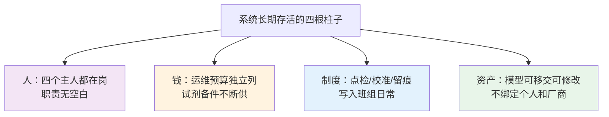

# 08-8 上线之后：运维制度与组织保障怎么建

> 本章讲什么：验收通过只是麻烦的开始。这一章讲系统投运之后长期活着的条件——四类主人怎么分工、预防性维护表怎么排、试剂和备件的钱谁出、第三方运维怎么考核、供应商撤场后模型谁改、班组考核怎么配套、责任怎么界定、台账怎么留，以及怎么防"厂长一换项目就黄"。
>
> 读完能干什么：编制年度运维预算和维保计划；起草运维合同/SLA 与资产移交清单；设计班组采纳率与药耗考核办法；主持月度系统体检会；判断自己的项目在投运半年后会不会变成一块落灰的大屏。
>
> 阅读时间：约 25 分钟。厂长、生产运行负责人和商务人员建议与 [08-5](08-5-节能率怎么算-效益测量与验证MV.md) 一起读。

---

## 场景导入：同一批系统，一年后的两种活法

两个规模相近的厂，同一年上了同一供应商的 AI 加药，验收数据都很漂亮。一年后：

A 厂：系统在线率 96%，运行员有事问"模型怎么建议"，药耗持续低于基线 10% 左右，厂长换了一任，系统照跑。

B 厂：模型服务停在七个月前一次服务器重启后没人会拉起来；两台总磷仪试剂断供后沦为摆设；运行员说"那玩意儿早不用了"；想追责时发现合同只保一年质保，过期报修要按次付费。

差别不在技术。A 厂在验收前就把四件事谈定并写进了文件：**谁天天管、坏了谁修、钱谁出、人走了怎么办**。B 厂一件都没谈。智慧水务项目"验收即巅峰"的死亡模式，根子全在这一章。

---

## 一、四个主人：任何一个缺位，系统都会死

[06-7](../06-AI建模篇/06-7-模型上线监控与迭代运维.md) 提过"模型需要四个主人"，这里把它落成岗位、动作和频次：

| 主人 | 通常岗位 | 管什么 | 最低动作频次 |
|---|---|---|---|
| **运行主人** | 当班运行员/班长 | 按建议操作、确认/覆盖都留痕、发现异常上报、手动期间加密化验 | 每班 |
| **仪表主人** | 仪表班/自控班 | 取样预处理、试剂、校准比对、探头清洗、信号网络、PLC/网关 | 每日巡检 + 周/月保养 |
| **工艺主人** | 工艺主管/技术员 | 判断建议是否合理、季节工况参数调整、月度效益复核、模型再训练需求提出 | 每周看数，每月评审 |
| **模型主人** | 内部种子工程师 + 供应商算法支持 | 模型服务、漂移监控、再训练、版本管理、参数变更 | 远程监控每周，现场每季 |

关键不是设四个新岗位（小厂可以一人身兼两职），而是**每个角色必须有具体名字和电话贴在机柜上**，并满足两条：角色之间不能空白（出了问题知道第一个打给谁）、工艺主人和模型主人不能全在供应商那边（否则乙方一走系统变砖）。

小厂实在没有模型人才，退而求其次的方案见第五节：买多年运维服务的同时，合同强制知识转移，至少培养一个"看得懂、改得动参数、重启得了服务"的内部种子。

---

## 二、预防性维护：把故障消灭在报警之前

 reactive maintenance（坏了再修）在环保考核下是奢侈品——仪表恰好在迎检前夜坏的故事每个厂都有。把下面这张表打印进维保制度：

**日/班度动作（运行+仪表）**：在线分析仪试剂余量与样水流量确认；取样泵、加药泵运行声音与出口压力；各仪表读数是否在物理合理区间；围堰有无积液；当日比对化验取样。

**周度动作**：取样过滤器排污清洗；探头外观检查与自清洗装置确认；加药泵标定罐抽查 1~2 台；网络交换机端口与网关运行日志；UPS 指示灯；备件与试剂库存盘点。

**月度动作**：DO/pH/MLSS 探头清洗+校准；在线水质仪实验室比对（每台至少 1 次/月，重点点位加密）；计量泵实测流量并修正系数；仪表数据质量分统计（[05-2](../05-数据篇/05-2-数据质量治理-脏数据的九种死法.md)）；加药间应急物资点检；月度系统体检会（第六节）。

**季度动作**：脉冲阻尼器气压、背压阀整定核查；膜片运行小时核查；阀位与旁路活动试验；防雷接地抽测；模型残差与 PSI 评审；联锁抽测（与 [08-3](08-3-安全联锁与人工接管.md) 无脚本演练合并）；UPS 带载放电。

**年度动作**：膜片等易损件按运行小时成批更换；电缆桥架与伴热带全检；历史库归档与备份恢复演练；模型年度再训练与基线复核；计量器具送检/校准证书更新。

> 经验数据：在线水质分析仪的故障里约 **60%~70% 出在取样预处理而非仪表本体**；探头类故障大多能靠定期清洗避免。维保人力不足时，钱和时间优先砸在取样系统和清洗制度上。

---

## 三、备件与试剂：断供是最常见也最冤的停机

**备件清单按"停机后果 × 采购周期"分级**，而不是凭印象买：

- **A 类（坏了当天就可能影响达标，必须厂内常备）**：各型号加药泵膜片、单向阀组件、试剂比色仪蠕动泵管与光源灯（部分型号）、关键探头备机（DO/pH 至少各 1）、取样泵、常见熔断器与继电器、通讯模块备件。
- **B 类（采购周期内可维持，备最低量）**：脉冲阻尼器、背压阀、变频器风机、交换机/网关备机。
- **C 类（不坏不买）**：泵整机、罐体、服务器。

**安全库存红线**：试剂和易损件库存 ≥"采购到货周期 × 消耗量 × 1.5"。进口试剂到货常需 4~8 周，红线要按 8 周以上设；双十一式的年底采购断档要有预案。

**试剂管理台账**：品名、批号、配制/到货日期、有效期、领用人、装入哪台仪表——出数据质量问题时要能倒查试剂。试剂费别省：一台总磷仪年试剂费约 0.8 万~2 万元，让它断供等于把十几万元的设备变成水表。

---

## 四、钱谁出：三种运维模式与费用边界

这是验收后扯皮的第一大户。行业常见三种模式，费用边界必须在建设合同里一次谈清：

| 模式 | 谁出人维护 | 钱怎么出 | 适用 | 主要风险与对策 |
|---|---|---|---|---|
| **业主自维** | 厂内仪表班+运行班 | 备件、试剂、校准全进厂里年度预算；供应商按次/按年保修 | 有仪表和自控力量的中大厂 | 模型能力不足→合同含 2~3 年算法远程支持；预算被砍→运维费按系统资产单列，不占生产维修费总盘子 |
| **打包运维（保运）** | 仪表厂商或集成商按合同巡检 | 年度固定运维费（常见为系统投资的 8%~15%/年），含人工和部分耗材 | 自己缺人的厂 | 服务商只换不修、响应慢→SLA 与数据质量分挂钩（第五节） |
| **EMC/节能效益分享** | 节能服务公司全包 | 从节约的药剂费里分成（[08-5](08-5-节能率怎么算-效益测量与验证MV.md)） | 业主不愿前期投入 | 试剂/备件该换不换（换了影响分成）→合同写明维护标准与开机率底线，且仪表数据双方共享 |

**写进合同的七条费用边界建议**：① 质保期（通常 1~2 年）内外的备件清单与单价提前锁；② 试剂耗材谁供、断供责任与时限；③ 远程支持与现场到场时限（关键故障 24/48 小时到场）；④ 模型再训练每年几次、超出怎么计费；⑤ 系统升级（操作系统、SCADA 版本）谁负责、免费几年；⑥ 第三方仪表损坏后的定责与配合义务；⑦ 运维数据和远程账号的归属——**远程维护账号必须业主掌握最高权限，供应商用临时授权**，防止被"账号绑架"。

---

## 五、第三方运维怎么考核：别让月度签到单变成摆拍

外包给仪表厂商/运维公司时，绝大多数合同执行成了"每月来人签个到"。把考核写成三个硬指标加一个抽查：

1. **仪表开机率/数据有效率**：环保考核仪表本身有数据有效率要求（各地规范一般要求 ≥90%，按当地规定执行），直接用平台统计，运维费与有效率分档挂钩；
2. **比对合格率**：每月实验室盲样比对，超差次数与扣款挂钩；连续两月不合格触发整改条款；
3. **故障响应与修复时限**：按 A/B/C 故障分级（A 类影响出水监控/加药闭环的，4 小时响应、24~48 小时修复），超时扣款；
4. **无脚本抽查**：厂方随机调看现场维护记录与试剂台账是否吻合，防止"签了到没干活"。

数据质量分（[05-2](../05-数据篇/05-2-数据质量治理-脏数据的九种死法.md) 第四节）是天然的考核抓手——它自动统计失真、冻结、缺失，比人工查考勤客观得多。建议运维费的 10%~20% 设为绩效尾款，季度结算。

---

## 六、乙方撤场之后：模型资产要能"改嫁"

供应商倒闭、合同到期、关系破裂，系统不能跟着殉葬。验收交付物（[08-1](08-1-项目实施全流程-从调研到验收.md) 已列清单）之外，长期运营还要盯住四样东西：

1. **模型资产三件套**：模型文件与版本说明、特征工程与数据预处理代码/配置、再训练操作手册与一份可复现的训练数据集样本。拿到手要**实测**：换一台干净机器按手册能否独立完成一次再训练，不能复现等于没交付；
2. **参数白名单**：所有允许厂里自己调的工艺参数（限幅、β 值、药剂浓度、预警线、控制周期）集中在一张有权限管理的参数表，改值留痕——区分"厂里能改的"和"需要供应商的"，日常 80% 的调整不需求人；
3. **内部种子工程师**：建设期跟岗、验收时独立操作演示、投运后供应商每季度陪访一次带教，两年形成自主能力；培训记录和考核作为验收尾款条件；
4. **账号与文档主权**：服务器、数据库、PLC 程序、组态工程、云平台、远程通道的最高权限归厂方；账号交接清单逐项签字。

> 采购谈判时就能识别风险：凡是宣称"模型是核心机密不能交付、只能买我们服务"的供应商，要么选开源/白箱程度高的替代方案，要么在合同里约定**服务终止后的源代码/模型托管或第三方存证条款**。数据资产归业主这一条，在国内智慧水务项目中正越来越多地被写进招标文件，这是业主方应该主动提的要求。

---

## 七、考核与责任：组织设计错了，技术全部白费

### 7.1 KPI 互相打架是运行员不用系统的第一原因

典型冲突：运行班组扛达标责任（超标重罚），药耗考核却在另一个科室甚至另一家公司（EMC 节能方）；药剂科管采购单价、运行科管用量、脱水外包按泥量结算——**多加药导致的多产泥成本，没有任何一个能调泵的人在承担**（[03-3](../03-问题与成本篇/03-3-加药管控八大痛点.md) 痛点⑥）。

可行的配套做法：

- 设**厂级统一口径的"加药综合成本"指标**：药剂费 + 因药增加的电费 + 化学污泥增量处置费，由一个负责人（通常生产/工艺副厂长）统管，避免科室各自最优、全厂最差；
- 节约收益切块到班组：从可核实的药耗节约中拿出固定比例（10%~20% 是常见尝试区间）做班组绩效——没有正向分享，"省下来是公司的、超标是自己的"，理性人必选多投；
- 考核看**单耗和建议采纳质量**，不看"是否永远自动"：合理拒绝建议同样该被表扬，盲目服从不该被奖励。

### 7.2 责任界定：听系统的出事算谁的

不界定清楚，运行员的合理选择就是不用。建议在《AI 加药运行管理规程》里写明（让法务和环保管理部门一起过）：

- 系统处于 L2/L3 且输入数据正常、系统无报警时，运行员按规程执行建议，事后证明模型建议错误的，责任不由当班个人承担；
- 系统报警、提示工况出域或数据异常后，运行员未按响应卡处置、未上报的，责任归个人；
- 任何人手动覆盖自动建议都必须填写原因（下拉菜单+备注），覆盖记录不追责但**隐瞒和篡改追责**；
- 环保数据真实性条款单独签署承诺书（呼应 [08-6](08-6-行业十道天花板-做不到的事与现实的凑合方案.md) 第八节）。

### 7.3 怎么防"人走政息"

- 制度 > 能人：把操作、处置、考核写进厂级文件和岗位手册，让系统依附于**岗位**而不是某任厂长或某个工程师；
- 把系统写进集团考核：集团层把数据质量、系统在线率、单耗对标纳入对厂的月度排名（[03-3](../03-问题与成本篇/03-3-加药管控八大痛点.md) 痛点⑧），新来的厂长有动力接着用；
- 交接清单制度化：厂长/主管换岗时，模型运维状况作为资产一样交接，包括待整改问题和供应商合同状态。

---

## 八、合规留痕：日常记录就是最好的迎检材料

环保监管对在线监测的运维台账有明确要求（各地以当地生态环境部门和最新运维规范为准），通用做法：

- **应留尽留**：校准/标液核查记录、试剂更换记录、故障维修与停运报备记录、数采仪参数变更、比对监测报告；在线设备因故障停运通常要求向监管平台报备，不能默默停掉；
- **数采仪与采样系统铅封**：任何人不得擅动，必要维护按规范报备并记录；
- **留痕保存年限**按当地规定（不少地区要求 1~3 年），电子记录做好备份；
- 异常数据的正确姿势是**标记+说明+闭环**，不是删除和平滑——台账能证明"异常已发现、已处置、已恢复"，企业反而安全。

---

## 九、月度系统体检会：半小时防止七个月后变砖

建议固化为每月一次、工艺主人主持、四方参加的例会，只看五张表：

1. 数据质量分与仪表有效率排名（谁拖后腿）；
2. 模型残差/PSI 监控与本月报警清单（模型有没有开始变笨）；
3. 建议采纳率、覆盖原因分类（人不信任还是建议不合理，两类问题的修法完全不同）；
4. 药耗单耗 vs 冻结基线（[08-5](08-5-节能率怎么算-效益测量与验证MV.md) 口径），本月到底省了多少；
5. 备件试剂库存、故障与演练台账、待整改事项销项。

季度会追加：联锁抽测结果、SLA 考核结算、再训练决策。年度追加：基线复核、预算评审、合同续约/再招标。

会议纪要进厂级 OA 闭环——开会本身不难，难的是让问题有责任人、有期限、下月销项。

---

## 十、三年运营路线图（投运后照做）

| 阶段 | 重心 | 标志性动作 |
|---|---|---|
| 第 1~3 个月 | 陪跑养习惯 | 供应商驻场或高频远程；每周复盘采纳/覆盖；班组绩效办法同步落地；权限和参数表定稿 |
| 第 4~12 个月 | 制度固化 | 月度体检会不停；种子工程师独立完成一次再训练；运维合同（自维或外包）正式运转；经历第一个季节转换并沉淀季节参数 |
| 第 2 年 | 自主与扩面 | 模型资产移交实测通过；本厂能独立处置 80% 故障；在单回路成功基础上谨慎扩到第二药剂回路；集团内横向对标 |
| 第 3 年 | 续约决策 | 用三年数据评估续约 SLA/EMC；老旧仪表进入更新周期（分析仪典型寿命 6~10 年，探头耗材化）；模型与基线全面复评 |

---

## 本章小结

1. 系统长期活着靠四根柱子：四个主人都有名字、运维预算独立列支、点检校准留痕写入日常、模型资产可移交改嫁。
2. 预防性维护的钱优先花在取样预处理（占水质仪故障六到七成）和探头清洗；备件按停机后果分级，试剂按 1.5 倍采购周期备安全库存。
3. 运维合同必须锁七件事：质保边界、试剂断供责任、响应时限、再训练次数、升级义务、账号主权、费用单价；第三方考核用数据质量分和开机率挂钩绩效尾款。
4. 组织层面三大杀手是 KPI 打架、责任不清、人走政息——对策是综合成本一个口子管、收益切块到班组、责任写进规程、系统依附岗位而非个人。
5. 项目验收后 90 天的陪跑和每月半小时的体检会，是投入产出比最高的两笔运维投资。

---

上一章：[08-7 现场救火手册：四十个高频故障的临时处置](08-7-现场救火手册-四十个高频故障的临时处置.md) ｜ 返回：[08-1 项目实施全流程](08-1-项目实施全流程-从调研到验收.md) ｜ [教程 README](../README.md)
