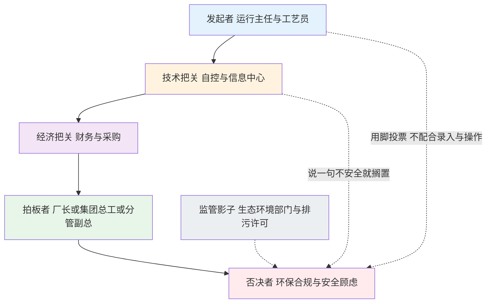

# 09-1 客户画像与需求调研：先找对人，再谈对事

> 前面八章解决"技术上行不行"，从这一章开始解决"客户买不买"。再好的节药算法，找错了说话对象、问错了第一句话，都会在科长办公室里躺三年。本章讲五类客户长什么样、一个项目里谁说了算、进厂第一天该问什么看什么，以及怎么在半天之内判断这个项目是"真商机"还是"陪聊"。
>
> 读完你能：画出目标客户的决策链角色地图，拿着一份 30 问清单独立完成进厂踏勘，用一张 10 项评分表判断某座厂值不值得投入售前资源。
>
> 阅读时间：约 26 分钟。

---

## 场景导入：一顿没谈成的饭

售前工程师小周第一次跑单，关系人是某污水厂运行车间王主任。王主任拍着胸脯说"药投得太粗放，我们太需要 AI 了"，小周热血沸腾，回去做了 80 页方案，报了 120 万。三个月后项目没动静——年度预算早在前年就编完了，王主任只管干活、不管钱；分管副总压根没见过他；财务总监听说"要把生产数据传上云"，当场否了。

饭吃了三顿，方案改了五版，连采购科的门都没摸着。小周没搞懂一件事：**"说需要"的人，和"掏钱包"的人，往往不是同一个人**。客户调研的第一任务不是讲产品，而是把这张人物关系图拼出来。

---

## 一、市场五类主体：钱包厚度不一样，活法也不一样

中国城镇污水处理行业的资产格局，决定了 AI 加药至少有五类买主。他们的钱从哪来、决策要多久、最怕什么，差别比工艺路线的差别还大。

| 客户类型 | 典型构成 | 付费能力 | 决策周期 | 最关心什么 | 典型打法 |
|---|---|---|---|---|---|
| **地方水务集团/城投平台** | 市县城投、水务集团整合的供排水资产，管理几座到几十座厂 | 强，有融资和专项债通道，但流程长 | 6~18 个月，要走年度投资计划 | 集团对标、少人值守、政治安全（不能出事） | 高层切入做"一厂试点+集团框架"，讲集约化 |
| **上市水务公司** | 全国布局的运营商，旗下数十至数百座厂 | 强，看全生命周期成本和报表 | 3~9 个月，有标准化采购和技术评审 | 吨水成本、可复制性、ESG 与双碳叙事 | 进技术白名单，做标杆厂后批量复制 |
| **民营运营厂/BOT 项目公司** | 拿到 20~30 年特许经营权的民企，成本就是利润 | 中等到强，对真金白银最敏感 | 1~4 个月，老板拍板快 | 真能省多少钱、多久回本、别耽误达标 | 直接上 ROI 表和按效分成，账算给他看 |
| **工业园区污水厂** | 园区管委会或第三方运营，来水是工业废水 | 分化大，有钱园区和欠薪园区并存 | 2~8 个月 | 抗冲击负荷、超标罚款、药剂品种复杂 | 先做异常预警与加药安全，再谈优化 |
| **设计院/EPC/设备商** | 你的间接客户：新建或提标项目的总包方 | 项目制，钱在概算里 | 跟随项目前期 3~12 个月 | 方案亮点、投标加分、别增加交付风险 | 做成标准模块被"选配"进图纸和清单 |

> 💡 **销售经验**：同一个城市里，集团总部和下属厂是两种声音。总部要"管得住、看得见、可对标"，厂长要"别添乱、别让我担责"。只搞定一头，项目都会卡壳：总部强推、厂内不配合，系统会被闲置成摆设；厂内热情、总部不立项，永远等不到预算。两头的方案价值主张要分开写。

### 五类客户的"钱袋子"细节

1. **集团/城投**：建设资金常来自专项债、银行贷款或财政补贴，必须进"项目储备库→可研→概算"的笼子。年底突击花钱、年中没钱是常态，踩节奏比讲价值重要。
2. **上市水务公司**：有运行管理部和技术中心两道评审，认数据、认同行案例。一旦进入合格供应商名录，后续厂可以走框架协议快速复制——前期慢、后期快。
3. **民营厂**：没有"公家采购"那套繁文缛节，老板一个人就能定；但砍价凶狠，且对"先掏钱"高度戒备，节能效益分享模式（[09-5](09-5-商务模式招投标与交付话术.md)）最好谈。
4. **工业园区厂**：水质波动是市政厂的几倍，重金属、毒性物质冲击说来就来。他们对"省钱"的排序低于"别超标、别被园区考核"，价值主张要倒过来讲。
5. **设计院/EPC**：不要指望他们替你卖产品，要把你的系统做成图纸上的一行"智慧加药成套装置"和 BOM 清单（物料清单）里的一个编号，让甲方没法轻易抠掉。

---

## 二、一个项目的决策链：五个角色，一句话各打各的

不管哪种客户，一个 AI 加药项目里通常有五种角色。注意是"角色"不是"人"——小厂可能厂长一个人身兼四个角色，大集团则每个角色背后是一个部门。

"否决者"最特殊：他可能不是某个人，而是一种弥漫在空气里的顾虑——"万一 AI 乱投药超标了谁负责？""数据上云泄密怎么办？"。还有监管的影子：生态环境部门从不参加你的采购会，但每次排污许可证检查、在线数据超标预警，都在替你教育客户"安全比省钱重要"。

| 角色 | 典型人物 | 他的 KPI | 他的顾虑 | 能打动他的一句话 |
|---|---|---|---|---|
| 发起者 | 运行主任、工艺员、值班班长 | 出水稳定达标、少熬夜、班组别出事 | AI 是来抢饭碗/抓我错的？操作变复杂 | "系统只出建议、点不点你说了算，夜班它替你盯着" |
| 技术把关 | 自控班长、信息中心主任、集团技术部 | 系统稳定、网络安全、别给自己增加运维烂摊子 | 接口不通、数据外传、供应商倒了没人管 | "只读不写先上线，私有化部署，接口标准全开放" |
| 经济把关 | 财务总监、采购科长 | 预算合规、单价可比、付款条件好 | 价格没法比价、效益说不清、审计难过 | "投资进信息化专项，效益有 M&V 第三方口径" |
| 拍板者 | 厂长、集团总工、分管副总 | 政绩与安全的平衡：不出事+有亮点 | 项目失败影响仕途，领导换了怎么办 | "先在一厂做 30 万的试点，达标兜底、见效再推广" |
| 否决者 | 环保负责人、安全员 + 监管影子 | 零超标、零事故、合规留痕 | AI 投错药导致超标罚款甚至问责 | "异常自动切回人工，超限联锁，每一笔建议留痕可追溯" |

> ⚠️ **老销售的坑**：最常见的死法是"只搞定发起者"。运行主任请你吃饭、加你微信、给你拉数据，但他没有一分钱预算权。判断项目真假的硬标准只有一个——**你有没有见过经济把关和拍板者**。见了三次面还停留在车间层面的商机，默认当培养线索，不要投入定制方案资源。

### 角色地图的三个中国式细节

1. **一把手是动态的**：厂长关心的是任期内（通常 3~5 年）能见效且不出事的事。回收期超过 2 年半的项目，厂长的本能是"留给下一任"——所以 10 万吨以上的大厂反而要把一期做小、回本做快。
2. **老师傅是否决者的隐藏形态**：他不开会、不签字，但他说一句"这玩意儿不灵"，运行主任就不敢用。把老师傅聘为"模型训练顾问"、给他发聘书，比给他讲十次神经网络都管用。
3. **采购的沉默权力**：采购科不评价技术，只问"为什么要选这家？有没有三家比价？是不是唯一来源？"。控标参数要在技术规格书阶段就埋好（[09-5](09-5-商务模式招投标与交付话术.md) 详讲），等挂网再动作就晚了。

---

## 三、调研问题清单：六组 32 问，照着问就不丢东西

第一次进厂，带上这张清单（电子版+纸质夹板）。原则：**先听后说，多问数字，少承诺**。对方说出的每个数字记下来源——"科长说的""台账上的""DCS 历史曲线看到的"，三个来源的可信度完全不同。

### A 组：工艺与水质（8 问）

1. 设计规模多少万吨/日？近一年实际日均水量多少？雨季最大、旱季最低各多少？
2. 主体工艺是什么（AAO、氧化沟、SBR、MBR……）？有没有深度处理（高效沉淀、反硝化深床滤池）？
3. 执行什么排放标准？有没有地方提标要求或准 IV 类内控指标？
4. 近 12 个月进水 COD、氨氮、TN、TP 的范围和季节规律？工业水占比大概多少？
5. 出水哪几个指标最吃紧、贴限值运行？超标过没有？最近一次预警是什么时候？
6. 水温冬夏多少？污泥浓度 MLSS、污泥龄大概控制在多少？
7. 回流比、DO（溶解氧）现在怎么控制？有没有精确曝气？
8. 一天进水负荷曲线什么样？早晚高峰、凌晨低负荷差几倍？

### B 组：加药现状与药耗台账（8 问）

9. 全厂投哪几种药？加药点分别在哪（生物段、深度段、脱水段）？
10. 除磷剂和碳源的品牌、含量（Al₂O₃ 百分比、COD 当量）、采购单价、年用量？
11. 有没有连续 12 个月的分月药耗台账？是采购口径、库存倒挤口径还是泵排量口径？
12. 现在投加量靠什么调——固定值、定时段、还是看化验结果人工调？多久调一次？
13. 班组之间投加习惯差异大不大？交接班怎么交"今天投多少"？
14. 计量泵有没有冲程/频率远传？有没有电磁流量计核实实际投加？
15. 药剂库存怎么盘点？吨桶余量怎么估？一年盘盈盘亏大概多少？
16. PAM 配制浓度、熟化时间多少？脱水机出泥含水率和 PAM 单耗多少？

### C 组：仪表、自动化与网络（6 问）

17. 进出水在线仪表有哪些（COD、氨氮、TP、TN、流量）？什么品牌、用了几年、准不准？
18. 在线仪表维护制度是什么？试剂谁换、多久校准、故障率高吗？
19. PLC 是什么品牌和型号（西门子 S7-1200/1500、施耐德、和利时等）？有没有上位 SCADA？
20. 关键点位历史数据存多久、多久存一个点？能不能导出？
21. 厂区有没有内网到加药间和脱水车间？允许不允许建 4G/5G 专线或 VPN？
22. 信息安全制度卡得严不严？上云要不要过等保评审？有没有现成的私有化机房？

### D 组：人员与制度（4 问）

23. 全厂多少人？运行班几班几倒？工艺员、自控维护各几人？
24. 化验室一天测几次？TP、TN 手工化验多久出结果？
25. 有没有能耗药耗考核？节药了班组有没有奖励？出过事故怎么追责？
26. 老师傅平均年龄多少？对电脑和新系统什么态度？有没有年轻人能接？

### E 组：预算与决策链（4 问）

27. 这个想法是哪一级提的？厂长/集团知道吗？有没有立项文件或会议纪要？
28. 钱打算从哪出——运行费、技改资金、信息化专项还是专项债？今年预算有没有盘子？
29. 集团/公司今年的重点工作是什么（提标、双碳、智慧水务、无人值守）？
30. 采购走什么流程？大概什么时间招标？同类项目一般预算控制在多少？

### F 组：历史上的信息化经历（2 问，最容易被跳过）

31. 以前上过 SCADA、精确曝气、智慧水务平台没有？用得怎么样？哪套闲置了，为什么？
32. 有没有被算法/AI 类项目"伤过"——比如上线热闹三个月、数据不准没人管？

> 💡 **现场经验**：F 组两个问题的答案价值千金。客户说"上过一套智慧平台，现在大屏就在大厅落灰"——你要立刻追问三层：是数据不通、模型不准、还是没人用？谁拍板上的、现在谁尴尬？弄清前任是怎么死的，你才能避免以同样方式死掉。同时这句话本身就是信任红利：**"我们只读不写先跑三个月、验收按 M&V 口径节药率说话"**，专打这种创伤。

---

## 四、首次进厂一日踏勘时间表

售前调研不是闲聊，按一张时间表走，一天能拿到方案所需 80% 的输入。

| 时间 | 安排 | 要看/要拿到的东西 |
|---|---|---|
| 09:00-09:30 | 厂办会议室开场 | 对方参会人名单与职务（现场补全角色地图）；建厂年份、规模、标准三张基本信息 |
| 09:30-10:30 | 中控室看 SCADA | 历史曲线调 3 天：进水流量/TP、加药泵频率、出水 TP；看报警频率和操作记录 |
| 10:30-11:30 | 加药间与储罐区 | 泵的品牌型号与远传情况、流量计有无、吨桶数量与液位、配制方式、管路结垢 |
| 11:30-12:00 | 在线仪表间 | 分析仪品牌、试剂余量、维护记录、上次校准日期、数采仪型号 |
| 12:00-13:30 | 午餐（非正式） | 最好和运行班长、老师傅一起吃：问真实操作习惯、对前任系统的吐槽 |
| 13:30-14:30 | 脱水车间 | 脱水机类型、运行时段、PAM 泡药流程、泥饼堆放和外运计量方式 |
| 14:30-15:30 | 财务/仓库看台账 | 12 个月药剂采购发票、出入库单、盘点表；污泥外运结算单；电费单 |
| 15:30-16:30 | 自控/信息中心 | PLC 点表、网络拓扑、数据导出授权流程、上云与等保红线 |
| 16:30-17:30 | 会议室收口 | 复述你听到的需求和数字请对方纠正；约数据提供时间；试探预算与时间表 |

> ⚠️ **现场经验**：踏勘三必看：① **雨天/凌晨的历史曲线**——敢不敢给看真实工况，反映数据信任度；② **加药间地面**——结晶、积药、湿漉漉说明跑冒滴漏和粗放管理，节能空间往往和脏乱差程度正相关；③ **在线仪表的试剂瓶**——空瓶子、过期试剂、校准标签泛黄，说明"眼睛"是瞎的，这种厂上 AI 前必须先列仪表整改预算，否则模型再好也是盲人摸象。

### 台账数据要哪些：一张数据请求清单

收口时正式提交一份《数据提供清单》，写明字段、粒度、时间跨度：

- 工艺运行数据（小时级，12 个月）：进出水流量、DO、ORP、MLSS、温度、回流比；
- 水质数据（化验+在线，24 个月如有）：COD、氨氮、TN、TP、SS；
- 加药数据（班次/日级，12 个月）：各药剂投加量、泵冲程频率、配药浓度；
- 经营数据（月级，24 个月）：药剂采购量与单价、污泥外运量与处置单价、总电费与电量；
- 管理数据：排班表、超标记录与罚单、设备维修台账。

给不出 12 个月数据的厂不是不能做，而是**基线测量（M&V，详见 [08-5](../08-落地实施篇/08-5-节能率怎么算-效益测量与验证MV.md)）要先补计量**——这句话要在调研阶段就写进纪要，免得验收时为"到底省没省"扯皮。

---

## 五、辨别真需求、伪需求和预算信号

同样一句"我们想上 AI 加药"，背后可能是三种完全不同的东西。

### 需求真假的判别

| 信号 | 真需求 | 伪需求/陷阱 |
|---|---|---|
| 问题来源 | 厂长被药费/超标/考核压得睡不着 | 为了汇报有"智慧水务"四个字，或者应付上级检查 |
| 数据配合 | 愿意导出真实台账，敢让你看差数据 | 只给 PPT 上的漂亮汇总数，明细一律"不好提供" |
| 时间压力 | 提标 deadline、集团对标节点、领导视察是具体日期 | "不急，先了解了解"，且半年内没有任何节点 |
| 钱的着落 | 能说出资金科目和大致盘子 | "钱不是问题"——这四个字几乎总是意味着钱是最大问题 |
| 失败定义 | 双方能说清"做成什么样算成功" | 需求模糊到"越智能越好"，无法验收 |

### 预算信号：听弦外之音

- **强信号**：对方主动问"你们能不能进我们的供应商库""概算阶段能不能帮我们写技术参数""财政局要求提供效益测算"——项目已在笼子里。
- **中信号**：愿意安排厂长/总工见你、愿意签保密协议给数据、主动谈试点边界——有戏，但要帮他找钱。
- **弱信号**：只见车间、只谈技术、反复要方案和报价但从不让你见领导——八成是用你的方案去做内部汇报或给别人陪标压价。

> ⚠️ **防陪标常识**：免费方案被白嫖的典型特征：① 只要文档不要交流；② 催得很急但开完标就失联；③ 对方对价格异常敏感、对效果毫不在意。应对：售前方案给框架和效果逻辑，不给详细 BOM 和点表；深度方案与投标绑定；报价分版本给（[09-4](09-4-竞品分析与产品形态设计.md) 的 V1/V2/V3），把肉留在签合同之后。

---

## 六、调研评分表：这座厂值不值得做（10 项打分）

踏勘结束当晚，按 10 项各打 1~5 分，汇总后决定售前资源投入级别。这张表可以直接打印使用。

| 序号 | 评分项 | 5 分（理想） | 1 分（劝退） | 权重 |
|---|---|---|---|---|
| 1 | 药费体量 | 年药剂费 500 万以上 | 不足 100 万 | ×2 |
| 2 | 管理粗放度 | 固定投加、无动态调整、班组差异大 | 已有精细化调控且考核到位 | ×2 |
| 3 | 数据与仪表基础 | SCADA 齐全、在线表准、历史可导出 | 无 SCADA 或仪表长期失准 | ×2 |
| 4 | 提标/考核压力 | 1~2 年内有明确提标或强考核 | 无外部压力 | ×1 |
| 5 | 预算有着落 | 已入年度计划/专项 | 完全无盘子 | ×2 |
| 6 | 决策链可触达 | 已见到拍板者且态度积极 | 只见得到车间 | ×2 |
| 7 | 客户配合意愿 | 愿给数据、愿定试点边界 | 层层设卡、只索取不投入 | ×1 |
| 8 | 历史信息化创伤 | 没做过或失败原因明确可避 | 对所有厂商高度戒备且归因于技术 | ×1 |
| 9 | 网络与部署条件 | 有机房或可接受边缘盒子 | 一律不许上云也不许加设备 | ×1 |
| 10 | 复制价值 | 集团多厂、可做标杆复制 | 孤厂且无示范效应 | ×1 |

**判读口径（满分 75 分）**：

- **60 分以上：A 级商机**——30 天内出正式方案，资源拉满，可以谈按效分成绑定；
- **45~59 分：B 级培养**——推轻量 V1 试点或边缘盒子（[09-4](09-4-竞品分析与产品形态设计.md)），先补仪表和数据，6 个月后复评；
- **30~44 分：C 级观察**——保持季度拜访，不投定制售前，等提标/换领导/集团统一动作；
- **30 分以下：放弃或转设备商渠道**——典型组合是"药费小+没预算+仪表瞎+见不到领导"，神仙也救不动。

打分不是为了证明自己眼光准，而是为了**把有限的售前工程师，从十个"陪聊"里抽出来，扑在两个真商机上**。

> 💡 **最后一条经验**：评分表第 6 项（决策链可触达）低于 3 分时，无论总分多高都按 C 级处理。技术可以慢慢补、仪表可以整改、预算可以等明年，**见不到拍板者的项目，本质上不是你的项目**。

---

---

## 七、不同规模厂的调研侧重点：别拿一张问卷问所有厂

问卷是骨架，问诊要分人。三类规模厂的资源禀赋不同，同样问题要问出不同的东西。

| 厂型 | 调研重点要偏移到 | 可以适当省略的 | 方案预埋的伏笔 |
|---|---|---|---|
| 2 万吨/日以下小厂 | 人力薄不薄、一人几岗；有没有网络；老板/厂长是否一人拍板 | 复杂点表、等保细节（多数没有专门信息部门） | 边缘一体机+订阅费，别卖百万级项目 |
| 5~10 万吨/日中坚厂 | 药耗台账完整度、仪表健康度、技改资金科目 | ——（这是主力客户，全量调研） | V1 试点→V2 闭环的标准两期路线 |
| 20 万吨/日以上大厂/集团厂 | 集团与厂的权责边界、既有平台对接要求、招投标规矩 | 不必纠结老板态度（决策靠流程不靠个人） | 平台化、多厂对标、进集采框架 |

> 💡 **现场经验**：小厂调研最容易忽略的不是技术而是"人"。一座 1 万吨厂往往全厂二十来个人，真正碰加药的就两个老师傅，你要评估的是**这套系统离了供应商还转不转**——如果每个操作都需要厂家远程支持，订阅一停系统就死，客户早晚会因为"被绑架感"弃用。MVP（最小可用产品）在小厂的第一设计原则是"断电断网也能照常用人工跑"。

调研结束 48 小时内，产出三份内部资产并归档：① 一页《客户画像与角色地图》；② 一张《数据与仪表差距清单》（哪些能直接用、哪些要整改、花多少钱）；③ 一版《机会评分与下一步动作》。同一集团内第二座厂的调研成本常常只有第一座的三分之一——这就是调研资产复利。

## 本章小结

1. 五类客户五种活法：集团讲对标、上市公司讲复制、民企讲回本、工业园讲安全、设计院讲中标——价值主张要按人下菜。
2. 决策链五角色：发起者、技术把关、经济把关、拍板者、否决者；否决者常常不是人，是安全顾虑和监管的影子。
3. 调研六组 32 问覆盖工艺水质、加药台账、仪表网络、人员制度、预算决策、历史失败，配一日踏勘时间表执行。
4. 真需求看四件事：具体压力、真实数据、明确时间、有着落的钱；"钱不是问题"通常是最大的问题信号。
5. 用 10 项评分表（满分 75）给商机分级，A 级才重投入；见不到拍板者，一票降级。

---

上一章：[08-8 上线之后：运维制度与组织保障怎么建](../08-落地实施篇/08-8-上线之后-运维制度与组织保障怎么建.md) ｜ 下一章：[09-2 价值量化与 ROI 测算模型](09-2-价值量化与ROI测算模型.md)
