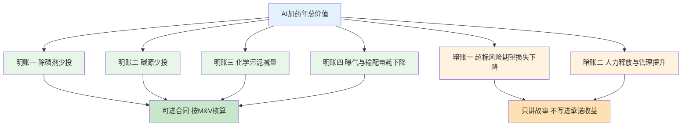
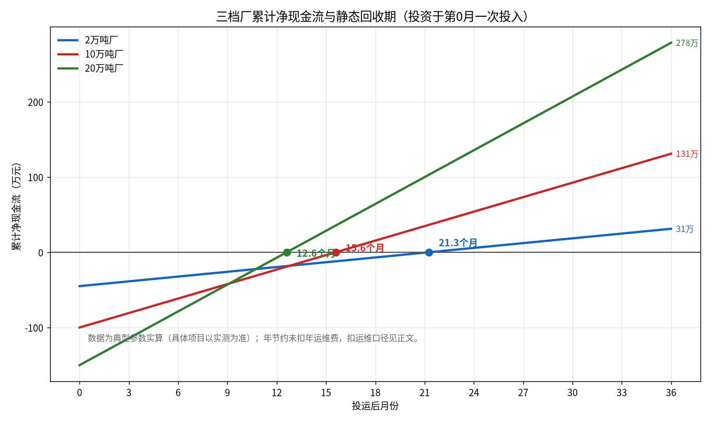
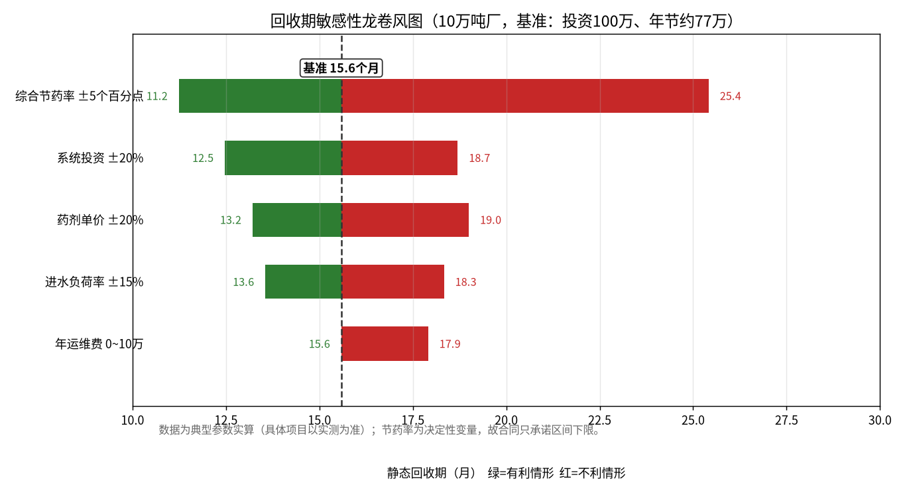

# 09-2 价值量化与 ROI 测算模型：把"能省钱"翻译成"多久回本"

> 厂长听完算法介绍，只问一句："你就说，一百万投进去，多久能回本？"这一章就是教你把前面所有技术能力，拆成四本会计听得懂的收益账、五类算得清的成本，再给出回收期、ROI 和 NPV 三张表。算得保守、讲得明白，比算得漂亮重要十倍。
>
> 读完你能：独立为 2 万/10 万/20 万吨三档厂完成完整效益测算，回答"几年回本、抗不抗风险、达不成怎么办"，并能把技术参数翻译成厂长和局长的语言。
>
> 阅读时间：约 30 分钟。

---

## 场景导入：财务总监桌上的两版测算

某 10 万吨厂立项会上，供应商 A 报"年综合效益 200 万、当年回本"，供应商 B（你们）报"承诺口径年节约 70~85 万、回收期约 14~17 个月"。财务总监一句话把 A 问哑了："你这 200 万里，碳源节省 120 万——我们厂根本不投碳源，你给我解释解释？"

**效益测算最大的雷，不是算错数，而是把别人家厂的账算到了客户头上。**本章所有公式都是"空模板"，每一项都必须用客户调研（[09-1](09-1-客户画像与需求调研.md)）拿回的真实数字替换。模板的价值在于：不漏项、不重复计、口径能被审计复核。

---

## 一、算账的底层逻辑：四本收益账 + 两本风险账

AI 加药的钱从哪里省出来？六本账，四明两暗：

**四本明账**能被 M&V（测量与验证，见 [08-5](../08-落地实施篇/08-5-节能率怎么算-效益测量与验证MV.md)）口径核算，可以写进合同；**两本暗账**真实存在但很难审计，用来帮助拍板者下决心，绝不写进收益承诺——否则你就是下一个被财务问哑的供应商 A。

### 明账一：除磷剂

> 年节约（万元/年）= Q × 365 × C_p × r_p × p_p ÷ 10⁷

- Q：日均水量，m³/d；C_p：改造前除磷剂平均单耗，g/m³（液体 PAC 典型 30~60）；
- r_p：节药率，行业经验区间 **15%~30%**（典型经验值，保守取 15%~20%）；
- p_p：药剂单价，元/t（液体 PAC/PFS 约 1500~2500，按 Al₂O₃ 含量折算，见 [03-2](../03-问题与成本篇/03-2-污水厂成本账本-药剂到底花了多少钱.md)）。

### 明账二：碳源

> 年节约（万元/年）= Q × 365 × C_c × r_c × p_c ÷ 10⁷

- C_c：碳源商品单耗，g/m³（固体乙酸钠口径典型 25~50，液体要折 COD 当量）；
- r_c：节药率，经验区间 **10%~25%**（保守取 9%~12%，因为反硝化是达标题，不敢省狠）；
- p_c：单价，元/t（乙酸钠约 2500~4000）。**不投外加碳源的厂，本账为 0——别硬算。**

### 明账三：污泥处置

少投金属盐和碳源，化学污泥同步减少。经验上每少投 1 t 铝盐/铁盐，约少产生 1.5~2.5 t 含水率 80% 的泥饼（机理见 [04-1](../04-机理公式篇/04-1-化学除磷机理与投加量计算.md)）。

> 年节约（万元/年）= 污泥年外运量（t）× 处置单价（元/t）× r_s ÷ 10⁴

- 泥饼外运处置约 200~500 元/t（地区差异极大，以客户合同价为准）；
- r_s：可减量化比例，经验 **5%~10%**（只是化学泥部分，总泥量降不了太多）。

### 明账四：电耗

浪费的碳源在好氧段被氧化，约 1 kg 多余 COD 多耗 1 kWh 曝气电（典型经验值）；加药泵和搅拌的优化是小头。

> 年节约（万元/年）= 碳源减量（kgCOD/年）× 氧化比例（约 40%~60%）× 电耗系数 1 kWh/kgCOD × 电价（元/kWh）÷ 10⁴

市政厂电价多在 0.55~0.75 元/kWh。这本账通常一年几万块，是"添头"，不要吹成主收益。

### 暗账一：超标风险

> 期望损失下降 = P（超标事件概率）×（罚款 + 限产/通报损失 + 应急药剂溢价）

一次 TP/TN 超标，罚款加整改常达 20~50 万元量级，代价更大的是问责和排污许可记录。没上系统时也许"几年一遇"，年化 5~15 万元只是概率估算——**讲给局长听，不写进合同**。

### 暗账二：人力与管理

减少人工抄表、配药盯守、反复化验和台账整理，约释放 0.5~1 个人力（折合 8~12 万元/年）。国企基本不会因此裁员，所以这不是现金账，真正价值是"少出事、数据自动留痕、班长少熬夜"。

> ⚠️ **算账纪律**：① 只投一种药的厂，其余药剂的账一律取 0；② 节药率一律取区间下限做承诺值，中值做测算值，上限只做"努力空间"口头说明；③ 所有单价用客户近 12 个月加权平均采购价，不用网上的、不用你以为的；④ 测算表注明日期、数据来源和假设，随合同归档——验收时它就是你的"免责证据"。

---

## 二、三档厂代入数表：2 万 / 10 万 / 20 万吨

下面三张表用同一套模板、典型经验参数实算（配套脚本为 scripts 目录下的 fig09_02_roi.py，可复算全部数字）。**它们是教具，不是对任何具体厂的承诺；真实项目以调研实测参数为准。**

### 基础参数（典型经验值）

| 参数 | 2 万吨厂 | 10 万吨厂 | 20 万吨厂 |
|---|---|---|---|
| 年水量（万 m³） | 730 | 3650 | 7300 |
| PAC 单耗/单价 | 50 g/m³ / 1900 元/t | 34 g/m³ / 1800 元/t | 30 g/m³ / 1750 元/t |
| 乙酸钠单耗/单价 | 28 g/m³ / 3000 元/t | 34 g/m³ / 3000 元/t | 30 g/m³ / 2900 元/t |
| 泥饼单产/处置价 | 0.8 t/万m³ / 350 元/t | 0.75 t/万m³ / 350 元/t | 0.7 t/万m³ / 340 元/t |
| 基准药剂费合计 | 约 131 万/年 | 约 596 万/年 | 约 1018 万/年 |

### 四本明账实算结果（万元/年）

| 收益账 | 2 万吨厂 | 10 万吨厂 | 20 万吨厂 |
|---|---|---|---|
| ① 除磷剂（节药率） | 69.4 × 20% = **13.9** | 223.4 × 16% = **35.7** | 383.3 × 17% = **65.1** |
| ② 碳源（节药率） | 61.3 × 14% = **8.6** | 372.3 × 9% = **33.5** | 635.1 × 10% = **63.5** |
| ③ 污泥处置（减量率） | 20.4 × 7% = **1.4** | 95.8 × 5% = **4.8** | 173.7 × 5% = **8.7** |
| ④ 电耗 | **1.5** | **3.0** | **5.5** |
| **四账合计（中性测算）** | **25.4** | **77.0** | **142.8** |
| 对应综合节药幅度 | 约 17% | 约 13% | 约 14% |
| 合同承诺口径（取下限） | 约 20 | 70 | 约 120 |

10 万吨厂第④本账的算法演示：碳源少投 34 × 9% = 3.06 g/m³ 乙酸钠，折 COD 3.06 × 0.78 = 2.39 g/m³，全年 2.39 × 3650 × 10⁴ ÷ 10⁶ ≈ 87 t COD；按一半在好氧段氧化、1 kWh/kgCOD、0.65 元/kWh，87 × 50% × 1 × 0.65 ≈ **2.8 万元**，取整 3 万。小账更要一步一步算给客户看——**可信度是靠小账攒出来的**。

> 💡 **销售经验**：小厂算账容易"看着不划算"——2 万吨厂年省 25 万，卖 45 万要 21 个月才回本。这不是产品问题，是产品形态问题：小厂别卖重系统，卖 15~20 万的边缘盒子 + 每年 3~5 万订阅（[09-4](09-4-竞品分析与产品形态设计.md)），把硬件投资压下去，回收期立刻好看。把客户错配到错误形态，再好的账也签不下来。

---

## 三、成本侧：一次性投入和持续性投入都要摊上桌

收益对面是成本，少算任何一项，验收后都会变成客户嘴里的"你们当时怎么不说"。

### 一次性投资构成（以 10 万吨厂 100 万为例）

| 成本项 | 2 万吨厂 | 10 万吨厂 | 20 万吨厂 | 说明 |
|---|---|---|---|---|
| 硬件采购 | 18 万 | 35 万 | 55 万 | 边缘服务器/网关、加装流量计、网络与机柜 |
| 软件授权 | 12 万 | 40 万 | 55 万 | 模型、软测量、看板，按药剂回路与厂规模计价 |
| 实施集成 | 10 万 | 18 万 | 28 万 | 点表对接、PLC 联调、历史数据清洗、试运行 |
| 首年服务 | 5 万 | 7 万 | 12 万 | 驻场调参、培训、基线建模与验收支持 |
| **合计** | **45 万** | **100 万** | **150 万** | 与全篇口径"10 万吨级 50~150 万"一致 |

### 持续性成本（第 2 年起）

- **年运维/云服务费**：2 万吨厂约 4 万、10 万吨约 8 万、20 万吨约 12 万/年（含模型季度迭代、远程值守、云资源）；
- **仪表试剂与校准增加量**：在线表若加密检测频次，试剂耗材每年多 1~3 万；
- **客户隐性成本**：配合调研和试运行的人力（2~3 人月）、内部协调成本、旧系统接口改造——不花钱但花政治资本，要在启动会上讲透。

---

## 四、回收期、ROI、NPV：三张表过关斩将

### 4.1 静态回收期

> 静态回收期（月）= 一次性投资 ÷ 年净收益 × 12

- **2 万吨厂**：45 ÷ 25.4 × 12 ≈ **21.3 个月**；
- **10 万吨厂**：100 ÷ 77 × 12 ≈ **15.6 个月**；若按合同承诺下限 70 万则 17.1 个月，按乐观 85 万则 14.1 个月——对外统一口径"**约 14~17 个月**"；
- **20 万吨厂**：150 ÷ 142.8 × 12 ≈ **12.6 个月**。

*数据为典型参数实算（合成示例，具体项目以实测为准）。投资在第 0 月一次投入，年节约按月平均；未扣年运维费。曲线穿过 0 轴的位置就是静态回收期，36 个月累计净收益分别为 31 万、131 万、278 万。*

两个口径都要主动交代：合同常见口径用"毛节约"算，回收期如上；若把第 2 年起 8 万/年运维扣除，10 万吨厂回收期约 17~20 个月。**自己先说，别等客户的财务问出来。**

> 💡 **与 [08-4](../08-落地实施篇/08-4-三个典型厂案例-方案BOM与ROI.md) 三厂案例的关系**：08-4 的 B 厂是"高基线准 IV 内控厂"（年药剂费 807 万、投资 125 万、年省 106.9 万、1.17 年回本）的具体案例；本章用的是教学型中性参数（基准药费约 596 万、标准配置 100 万、年省 70~85 万、14~17 个月）。两组数都落在全篇统一口径"10 万吨级投资 50~150 万、回本 1~2.5 年"之内，差别只在基线药费和配置档次——**基线越高、账越好看；对未知客户报价时用中性模板，尽调后再替换成实测数。**

### 4.2 简单投资回报率 ROI

> ROI = 年净收益 ÷ 一次性投资 × 100%

10 万吨厂中性口径：年净收益 = 77 − 8（运维）= 69 万，ROI ≈ **69%**；保守口径（年省 70、运维 10）净 60 万，ROI ≈ **60%**。给客户报"**第一年 ROI 不低于 60%**"，比报"ROI 100%"安全得多。

### 4.3 三年 NPV（净现值）算例

未来的钱不如今天的钱值钱，折现率取水务行业常用的 8%（具体以集团内部收益率要求为准）：

> NPV = −初始投资 + Σ（第 t 年净现金流 ÷ (1 + 8%)ᵗ）

10 万吨厂三年现金流（万元）：

| 口径 | 第 0 年 | 第 1 年 | 第 2 年 | 第 3 年 | 3 年 NPV（折现率 8%） |
|---|---|---|---|---|---|
| 保守（年净 60） | −100 | +60 | +60 | +60 | **+54.6** |
| 中性（年净 69） | −100 | +69 | +69 | +69 | **+77.8** |

验算中性口径：−100 + 69÷1.08 + 69÷1.08² + 69÷1.08³ = −100 + 63.9 + 59.2 + 54.8 ≈ **+77.9 万**（与脚本输出 77.8 的尾差为四舍五入）。NPV 为正且在两年内由负转正，财务就没有否决理由。

> 💡 **经验提示**：很多厂的财务模型按 5~8 年设备寿命算 IRR（内部收益率），你只算 3 年是"自缚手脚换信任"——把 4~8 年的延展收益放在敏感性附录里，正文只展示 3 年保守版，既专业又不显得急着吹牛。

---

## 五、敏感性分析：哪些变量一变，项目就黄

单点测算一定会被追问："药价跌了怎么办？负荷没那么高怎么办？"主动做敏感性分析，是专业选手和江湖郎中的分水岭。

*数据为典型参数实算（合成示例，具体项目以实测为准）。绿色有利、红色不利；条越长表示该因素对回收期的杠杆越大。*

以 10 万吨厂基准（投资 100 万、年省 77 万、回收期 15.6 个月）为例：

| 变动因素 | 变动幅度 | 回收期范围 | 结论 |
|---|---|---|---|
| 两种药剂综合节药率 | 同时 ±5 个百分点（极端组合压力测试） | **11.2~25.4 个月** | 决定性变量，必须按区间下限签合同 |
| 系统投资 | ±20% | 12.5~18.7 个月 | 硬件砍价和标准化交付价值大 |
| 药剂单价 | ±20% | 13.2~19.0 个月 | 药价跌了节约金额缩水，但客户没多花钱 |
| 进水负荷率 | ±15% | 13.6~18.3 个月 | 水量越低省得越少，合同要做负荷修正 |
| 年运维费 | 0~10 万 | 15.6~17.9 个月 | 影响最小，但决定长期续费率 |

读这张图的三个要点：

1. **节药率是天王山**：±5 个百分点就能让回收期在 11~25 个月之间摆动。所以技术验收方法（[08-5](../08-落地实施篇/08-5-节能率怎么算-效益测量与验证MV.md)）和合同承诺值是整个商业模式的命门；
2. **药价风险要双向讲**：药价涨 20%，客户省的钱更多、你更好验收；药价跌 20%，绝对节约缩水——可合同里加"药价联动条款"（[09-5](09-5-商务模式招投标与交付话术.md)）；
3. **负荷率写进修正公式**：实测水量低于基准 85% 时按比例修正承诺节费额，避免"没水进厂导致项目背锅"。

---

## 六、保守原则：下限承诺，上限画饼的边界在哪里

行业里被坏账和口碑拖死的公司，十有八九死于"拿上限签合同"。推荐三档话术纪律：

| 数字档 | 怎么用 | 10 万吨厂对应说法 |
|---|---|---|
| 下限（承诺值） | 写进合同验收条款，达不到按比例补偿 | "年节约不低于 70 万，第三方 M&V 核算" |
| 中值（测算值） | 写进可研和内部立项材料 | "典型年节约约 77 万，回收期 16 个月" |
| 上限（愿景值） | 只口头讲趋势，不落任何文字 | "管理改善到位、工况配合，乐观能到 85 万以上" |

> ⚠️ **老工程师的坑**：两种过度承诺最常见。一是**拿新建提标厂的"设计药耗"当基准**——设计值本来就偏保守，显得节约巨大，实际运行根本不是那么回事；二是**把污泥、人力、避免罚款全折成现金承诺**——审计一核全是糊涂账。基准只能用"改造前连续 12 个月实测台账"，且要冻结、要双方签字（[08-5](../08-落地实施篇/08-5-节能率怎么算-效益测量与验证MV.md) 的基准冻结规则）。

---

## 七、翻译对照表：技术语言 → 厂长/局长语言

同一件事，对总工和对局长要用两套词。左栏在车间说，右栏在会议室说。

| 技术语言（对总工/自控） | 厂长语言（对厂长） | 局长/董事长语言（对政府/集团） |
|---|---|---|
| 前馈+反馈混合控制，节药率 15%~30% | "该多投时多投、该少投时少投，一年药费少花七十万" | "吨水药剂成本下降多少分钱，行业对标能前进几名" |
| 出水 TP/TN 软测量 | "两小时才知道的化验结果，系统每一分钟都替你盯着" | "超标风险提前预警，环保问责的压力小一大截" |
| 模型 RMSE 0.03 mg/L | "估的数和化验室测的几乎一样准" | "决策有数据依据，检查拿得出完整记录" |
| 边缘部署、只读不写 | "不动你们原来的控制系统，不行随时切回人工" | "生产安全一分不碰，投入可控、退出无负担" |
| 14~17 个月静态回收期 | "一年半回本，之后都是净赚" | "不新增财政供养负担，第二年起反哺运行经费" |
| 模型季度迭代运维 | "水质变了有人管，不是装完就跑" | "长期陪伴，按效果续费，供应商和我们一条船" |
| 多厂数据对标平台 | "集团随时看到各厂药耗排名" | "集约化管理抓手，双碳考核有台账支撑" |

讲效益的最后一招是**让客户自己算账**：把空白模板留给他，让他用自己的单价、自己的水量填。人只会相信自己算出来的数字——你填好的表，再严谨也是"供应商的表"。

---

## 本章小结

1. 六本价值账：除磷剂、碳源、污泥、电耗四本明账进合同；超标风险、人力释放两本暗账只帮决策、不做承诺。
2. 三档厂中性年节约约 25 万 / 77 万 / 143 万，投资 45 / 100 / 150 万，回收期 21 / 16 / 13 个月；10 万吨厂承诺口径统一为年省 70~85 万、约 14~17 个月。
3. 三张财务表：静态回收期、首年 ROI（约 60%~69%）、三年 NPV（+55~+78 万，折现率 8%）。
4. 节药率是回收期的决定性变量（11~25 个月摆幅），故按区间下限承诺、按 M&V 口径验收、合同加药价与负荷联动。
5. 对不同人说不同话：车间讲控制，厂长讲回本，局长讲对标与安全；最好的测算表是客户亲手填的那一张。

---

上一章：[09-1 客户画像与需求调研](09-1-客户画像与需求调研.md) ｜ 下一章：[09-3 市场规模、政策与需求量测算](09-3-市场规模政策与需求量测算.md)
