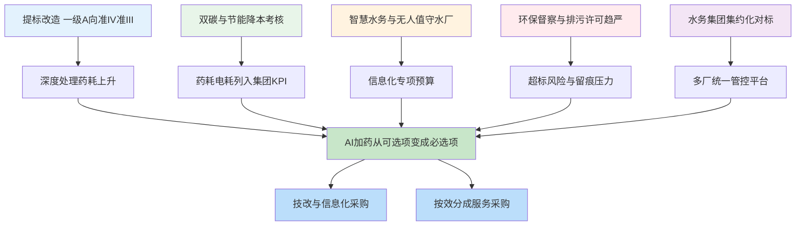
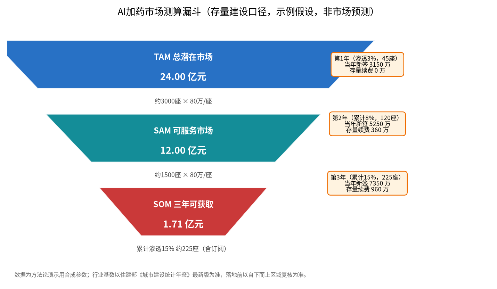

# 09-3 市场规模、政策与需求量测算：政策给风口，数字给纪律

> "这个市场有多大？"投资人、老板、销售总监每个季度都要问一遍。正确答案不是拍一个万亿数字，而是用两种方法各算一遍、互相校验，并诚实标注每个数字的出处和有效期。这一章给你行业底数、政策风向、TAM/SAM/SOM 漏斗算法和一个三年测算样板。
>
> 读完你能：说清 AI 加药需求的五个政策来源和三个制约因素，用自上而下和自下而上两种方法独立测算区域市场，并看懂市面上各类"百亿千亿"报告的水分在哪里。
>
> 阅读时间：约 25 分钟。

---

## 场景导入：BP 里那个刺眼的"500 亿"

一家创业公司融资 BP（商业计划书）写道："全国污水处理智慧化市场规模超 500 亿元，公司三年目标市占率 5%。"投资人只问了三个问题：500 亿是建设额还是运营额？几年累计还是单年？市占率 5% 意味着要交付多少座厂、需要多少实施工程师？创始人一个都答不上来，会就结束了。

市场数字的作用不是壮胆，而是**决定你要养多少销售、铺多少交付、融多少钱**。算错方向，比没有数字还危险。

---

## 一、行业底数：先弄明白"棋盘上有多少颗子"

据近年行业公开统计，全国城市（县城）已投入运营的城镇污水处理厂数量在 **2800 座以上**，总处理能力约 **2 亿 m³/日** 的量级；若加上建制镇污水处理设施，数量级还会显著放大。

> ⚠️ **口径声明（重要）**：以上为行业公开统计的量级表述，并非精确到个位的实时数字。污水处理能力、厂数每年都在变化，**正式报告与对外材料一律以住房和城乡建设部《城市建设统计年鉴》最新版（及《城乡建设统计年鉴》县城部分）为准**；各省数据以省级住建/水务主管部门发布为准。写 BP 时正确姿势是"据《XX 年鉴（20XX 版）》，全国城市污水处理能力 X.XX 亿 m³/日"，而不是引用不知转了几手的公众号数字。

棋盘上除了市政厂，还有三类设施别漏算：

1. **工业园区污水处理厂**：数量没有统一权威口径，数千座量级，水质复杂、付费分化，但单厂药费高、优化空间大；
2. **建制镇/小型处理设施**：数量以万计但单体极小，多数养不起重系统，只适合订阅制轻产品（[09-4](09-4-竞品分析与产品形态设计.md)）；
3. **新建与提标项目**：每年新增和改造产能本身带来增量市场，跟着环评批复和专项债项目清单走。

需求不是均匀分布的。下面这张图把五个政策驱动因素如何传导成"客户口袋里的预算"画清楚：

### 五个驱动因素逐个拆

| 驱动力 | 具体机制 | 对加药优化的影响量级 |
|---|---|---|
| 提标改造 | 一级 A（TP 0.5 mg/L）向准 IV 类（TP≤0.3、氨氮≤1.5）收紧，新建深度处理单元 | 越接近零限值边际药耗越陡，吨水药剂费可上升 50%~90%（[03-2](../03-问题与成本篇/03-2-污水厂成本账本-药剂到底花了多少钱.md)），优化刚需化 |
| 双碳与节能降本 | 国企能耗双控、集团对下水厂的成本对标排名 | 药剂费、电费成为可量化压降指标，直接挂运行主任奖金 |
| 智慧水务/无人值守 | 各地"智慧水厂""少人值守"示范建设 | AI 加药是智慧水务里少有的"直接省钱"模块，容易被立项 |
| 环保督察与排污许可 | 在线数据联网、按证排污、超标即处罚并公开 | 风险厌恶驱动——软测量预警、留痕追溯成了安全投入 |
| 集团集约化 | 大型水务集团并购整合后需要统一管控和对标 | 一次签约多厂复制，SaaS 与平台型产品的主战场 |

> 💡 **销售经验**：跟五类客户（[09-1](09-1-客户画像与需求调研.md)）聊天，政策话术要换：对政府/集团讲"提标、双碳、督察"，对上市公司讲"对标、ESG 披露"，对民企老板只讲一句"药价和罚单"。政策不是用来背文件号的，是用来帮客户找到**预算科目**的——提标走工程概算，智慧水务走信息化专项，双碳走节能技改。

---

## 二、三个制约因素：风口下面有三道坎

只讲驱动不讲制约的市场分析是耍流氓。签单率低，多半死在这三件事上。

1. **财政紧张与付费能力分化**：部分县市污水处理费征缴率低、财政补贴到位慢，甲方对新增资本开支极其谨慎。这解释了为什么按效分成（零首付、从节约里分成）近两年比买断更好谈。
2. **仪表与数据基础薄弱**：大量厂在线仪表失准、SCADA 数据不完整（[02-3](../02-加药系统篇/02-3-在线仪表-污水厂的传感器眼睛.md)、[05-2](../05-数据篇/05-2-数据质量治理-脏数据的九种死法.md)）。AI 项目预算里常常要先切出一块做仪表整改，拉长周期、摊薄毛利。
3. **失败案例透支信任**：早期一批"智慧水务大屏"演示完就闲置，部分厂一提算法就摇头。信任修复只能靠小步快跑：只读开环 → 建议被采纳率 → 闭环验收，每步都用 M&V 数字说话（[08-5](../08-落地实施篇/08-5-节能率怎么算-效益测量与验证MV.md)）。

> ⚠️ **老工程师的坑**：测算市场时最容易犯的错，是把"所有污水厂"都当成客户。没有加药成本的厂（极小规模、几乎不投药）、没有数据基础的厂、付不起钱的厂，都不是你的 SOM（可获取市场），连 SAM（可服务市场）都算不上。**市场测算的艺术是敢于划掉大部分棋盘。**

---

## 二之二、提标为什么直接变成药：一笔小账算给你看

政策文件不会写"请购买 AI 加药系统"，预算是沿着工艺路径流出来的。以 10 万吨厂从一级 A 提到准 IV 类内控为例（限值口径与 [03-2](../03-问题与成本篇/03-2-污水厂成本账本-药剂到底花了多少钱.md) 一致：TP 由 0.5 收到 0.3 mg/L、氨氮由 5 收到 1.5 mg/L）：

| 科目 | 一级 A 口径（典型） | 准 IV 内控（典型） | 变化 |
|---|---|---|---|
| 吨水药剂费 | 0.07~0.18 元/m³ | 0.12~0.28 元/m³ | +55%~70% |
| 碳源年费用（示意） | 250~300 万 | 380~420 万 | 新增百万级刚性支出 |
| 除磷剂年费用（示意） | 180~220 万 | 220~260 万 | 深度除磷段再投一路药 |
| 运行主任的真实状态 | 贴线运行，偶尔紧张 | 全年贴 0.3 走，天天紧张 | 人工调控信心崩溃 |

最后一行才是商机的本质：**当工艺窗口窄到人工经验盖不住时，客户买的不是"AI 概念"，是"睡得着觉"**。这也是为什么提标项目的深度处理单元招标时，智慧加药模块从"选配"变成"好意思写进评分项"的时间点，通常就在提标通水后的第一个冬天——低温硝化一变差，全厂都会想起那份被搁置的方案。

---

## 二之三、市场报告里的三种"注水套路"

读行业报告，先挤三遍水再引用：

1. **口径注水**：把建设市场、运营市场、设备制造、管网投资甚至整个环保产业打包成"万亿赛道"，再让 AI 加药去"沾光"。挤水方法：只问一句——这笔钱里有多少是付给软件与优化服务的？
2. **年限注水**：把"五年累计市场"和"年度市场"混用，动辄"年均增速 30%"。挤水方法：自己用年鉴基数乘单厂均价复核一次，10 分钟戳穿。
3. **渗透率注水**：假设三年渗透 50%——这意味着两年要改造上千座厂，全行业实施工程师加起来都不够用。挤水方法：渗透率假设必须配交付产能测算（多少组人、每组一年交付几座厂）。

> 💡 **尽调经验**：投资人尽调市场章节时，会拿你的 SAM 去除以你申报的销售人数。SOM 除以人均年产能差出三倍以上的 BP，会被直接归入"团队不懂行业"。市场测算表后面永远附一张"为拿到这个 SOM 需要的组织能力表"——销售编制、交付小组、运维坐席、样板厂数量，这才是成年人的商业计划。

---

## 三、自上而下法：TAM/SAM/SOM 漏斗

三个词先用人话解释：

- **TAM（总潜在市场）**：理论上所有可能买单的厂，全换成你的产品，一年/存量总共值多少钱；
- **SAM（可服务市场）**：你的产品当前真正能用、且你能触达的那部分；
- **SOM（可获取市场）**：未来 3 年，考虑你的销售和交付能力，现实中能签下来的那部分。

### 3.1 示例假设（方法论演示，非市场预测）

| 参数 | 取值 | 理由 |
|---|---|---|
| 有效目标厂基数 | 约 3000 座 | 2800+ 城镇厂中 1 万吨/日以上的主体，加可比工业园区厂；以年鉴最新版校准 |
| 单厂一次性均价 | 80 万元 | 三档厂加权（小厂盒子十几~几十万元，大厂百万级），典型经验值 |
| SAM 筛选率 | 约 50%（1500 座） | 仪表自控基础达标、近三年有提标或智慧化任务、付费能力合格 |
| 三年累计渗透率 | 3% → 8% → 15% | 早期行业渗透节奏的谨慎假设，非对任何公司的预测 |
| 首年单厂建设价 | 70 万元 | 竞争初期价格略低于加权均价 |
| 次年起订阅/运维 | 8 万元/年·厂 | 软件续费+模型运维，按 [09-2](09-2-价值量化与ROI测算模型.md) 成本口径 |

### 3.1.1 单厂均价 80 万是怎么来的：自己拆一遍才敢用

均价不是拍脑袋，用厂档结构加权算给你看（结构比例为示例假设）：

| 厂档 | 结构占比 | 单厂建设均价 | 加权贡献 |
|---|---|---|---|
| ≥10 万吨/日 | 15% | 130 万 | 19.5 万 |
| 5~10 万吨/日 | 25% | 90 万 | 22.5 万 |
| 2~5 万吨/日 | 35% | 60 万 | 21.0 万 |
| 1~2 万吨/日 | 25% | 30 万 | 7.5 万（盒子+轻实施） |
| 加权均价 | 100% | —— | 约 70.5 万 |

算出来约 70 万，考虑深度提标厂双药剂回路溢价，取 **70~80 万区间**——漏斗 TAM 用 80 万的偏上沿（乐观天花板），三年 SOM 用 70 万的现实成交价。**一个数字在乐观场景和现实场景里取不同位置，这不是矛盾，是情景分析的基本规矩。**

### 3.2 漏斗结果（脚本实算）

*数据为方法论演示用合成参数（非预测）；厂数基数以住建部《城市建设统计年鉴》最新版为准。*

- **TAM = 3000 × 80 万 = 24 亿元**（存量一次性建设口径，不是年度收入）；
- **SAM = 1500 × 80 万 = 12 亿元**；
- **SOM：三年累计渗透 15%（约 225 座）**，建设费 + 订阅合计约 **1.71 亿元**。

### 3.3 三年 SOM 逐年测算表

| 年度 | 当年新增（座） | 累计（座） | 渗透率 | 新签建设费 | 存量订阅续费 | 当年合同额 |
|---|---|---|---|---|---|---|
| 第 1 年 | 45 | 45 | 3% | 3150 万 | 0 | **0.32 亿** |
| 第 2 年 | 75 | 120 | 8% | 5250 万 | 360 万 | **0.56 亿** |
| 第 3 年 | 105 | 225 | 15% | 7350 万 | 960 万 | **0.83 亿** |
| 合计 | 225 | —— | —— | 1.58 亿 | 0.13 亿 | **1.71 亿** |

读表要点：① 这是**全行业可被一家进取型公司吃下的存量节奏**，不是全市场每年都这么大；② 第 2 年起订阅续费开始出现，第 3 年接近千万，这是 SaaS 转型的真正意义（[09-4](09-4-竞品分析与产品形态设计.md)）；③ 交付侧要倒推产能——第 3 年 105 座厂意味着全国要有 10 个以上并行交付小组，**销售扩张必须和实施产能同步**，否则签得越多死得越快。

---

## 四、自下而上法：按区域逐档加总，给漏斗"验票"

漏斗法容易自嗨，用区域加总交叉验证才踏实。以某中部省份为例（纯示例，约 150 座万吨级以上厂）：

| 厂档 | 座数 | 单厂合同均价 | 该档存量金额 |
|---|---|---|---|
| ≥10 万吨/日 | 20 | 120 万 | 2400 万 |
| 5~10 万吨/日 | 40 | 80 万 | 3200 万 |
| 2~5 万吨/日 | 60 | 50 万 | 3000 万 |
| 1~2 万吨/日（盒子+订阅为主） | 30 | 15 万 | 450 万 |
| **全省存量合计** | **150** | —— | **约 9050 万** |

若该省属于重点投入区域、三年可获取 15%，约 1350 万存量合同额，加每年续费滚动。把目标省份逐省这样算一遍加总，就是自下而上版 SOM。**两版结果差一倍以上时，相信自下而上**，并回头修正漏斗里的厂均价格或渗透率假设。

> ⚠️ **容易漏算的两类"伪目标厂"**：① 刚完成提标、药耗尚在重新爬坡期的厂，建议运行满一个水文年再做基线，否则基线失真，双方扯皮；② 一年内有迁建、扩建或工艺大改计划的厂，改造对象本身要变，模型刚训好就要推倒重来。这两类从 SAM 里划掉，等窗口过了再回来。

> 💡 **经验提示**：区域市场还要乘三个系数：① 提标覆盖率（查该省地表水考核断面要求）；② 财政健康度（污水处理费拨付情况）；③ 竞争烈度（已有几家在做样板）。三个系数都低于 0.5 的省份，先不进，让同行去教育市场——晚一年进场捡成熟客户，常常比自己烧钱开荒划算。

---

## 五、相邻市场：三扇后门的进入时机

| 相邻市场 | 与主业的复用度 | 差异点 | 建议进入时机 |
|---|---|---|---|
| 工业废水（化工、印染、食品、制药园区） | 中：建模框架可复用 | 药剂品种完全不同（破乳、中和、重金属捕集），冲击负荷更凶，验收按园区纳管标准 | V2 之后，选 1~2 个行业做专用模板 |
| 自来水厂（加矾、加氯、石灰、高锰酸钾） | 高：仪表与 SCADA 基础更好 | 达标的是浊度/余氯而非 TP/TN，安全联锁要求更严 | V1 末期即可用边缘盒子试探，交付最快 |
| 污泥处理处置（PAM 调理、脱水优化） | 高：本就是加药家族成员 | 跟脱水设备工况强绑定，需要和脱水机厂家配合 | 随主业捆绑交付，不单独建销售线 |

> ⚠️ **战略提醒**：相邻市场最大的陷阱不是做不成，而是"每个都顺手做一点"。工业废水开一个行业坑，就要配懂那个行业的工艺工程师；三条线同时开，10 个人的团队会立刻散架。纪律是：**主战场（市政加药）单厂模型和交付 SOP 完全跑顺、续费率站稳之前，相邻市场只做客户主动找上门的单子。**

这三扇门也建议写进公司故事和 V3 路线图（[09-4](09-4-竞品分析与产品形态设计.md)），让投资人看到天花板，但经营资源按上面的时机纪律投放。

---

## 五之二、预算日历与情报源：在客户有钱的那个月敲门

市场总量之外，还有一个维度决定签单——**时间分布**。政府与国企的钱不是匀速花出去的，踩准"预算日历"，同样的方案命中率差几倍。

| 时间窗口 | 客户在干什么 | 销售该干什么 |
|---|---|---|
| 每年 6~9 月 | 各厂/部门报下一年度项目需求和预算盘子 | 帮技术口写立项材料、效益测算（拿出 [09-2](09-2-价值量化与ROI测算模型.md) 的模板） |
| 10~12 月 | 预算评审、专项债项目入库 | 配合可研、对接设计院，把模块写进图纸和清单 |
| 次年 1~3 月 | 预算批复、招标计划排期 | 技术交流、控标参数沟通、备标 |
| 4~8 月 | 招标与实施旺季 | 全力投标、交付样板厂 |
| 11~12 月（另一层） | 当年预算结余必须花完 | 小额盒子、订阅、增补模块最容易快速成交 |

每月固定花半天跟踪以下公开情报（全部免费，贵在坚持）：① 住建/生态环境部门的提标与考核文件；② 各地专项债和中央预算内投资项目清单（污水处理类）；③ 公共资源交易平台的智慧水务/加药招标公告（同时能看到竞品价格和参数）；④ 目标集团的年度工作会报道和 ESG/社会责任报告。把这些信号与 [09-1](09-1-客户画像与需求调研.md) 的商机评分表联动：一个 B 级线索一旦出现在专项债清单里，立刻升 A；
反之，提标窗口关闭、连续两年未进项目库的线索，及时降级，别让销售抱着旧线索自我安慰。

> 💡 **情报经验**：招标公告是最诚实的市场数据。连续记录半年"智慧加药/精准加药"相关公告的数量、预算金额、技术参数、中标人和中标价，你会得到一份比任何付费报告都真实的区域市场地图——而且它直接告诉你竞品在用什么价格、什么参数、绑定了哪个设计院。这个习惯一个人一周花两小时就能做，坚持一年就是团队最值钱的数据库。

### 需求信号的领先/滞后之分

- **领先信号（提前 6~12 个月）**：提标文件发布、集团工作会提"智慧水务/无人值守"、设计院开始做可研；
- **同步信号（提前 1~3 个月）**：预算批复、招标预告、技术交流邀请；
- **滞后信号（已经晚了）**：挂网招标。等到挂网才知道的项目，参数早已被对手写好，中标的概率不到自然中标率。

---

## 六、市场数字的使用纪律：对外怎么说、对内怎么用

1. **对外（BP/政府汇报）**：底数引用年鉴并标注年份；TAM/SAM/SOM 标注"示例测算假设，不构成业绩预测"；渗透率引用行业早期可比领域（如精确曝气、在线监测）的渗透节奏做类比。
2. **对内（经营计划）**：SOM 必须翻译成三件具体的事——新增客户名单数量、交付小组编制数、区域费用预算；不能翻译成行动的数字一律不写。
3. **对销售（配额）**：省域配额用自下而上表，按季度用实际签约滚动修正；漏斗数字只用于判断"天花板够不够高"，不用于压指标。
4. **数字留痕**：每个测算版本标注日期、假设来源和修改记录。招标价、年鉴新数据出来后滚动更新，半年前的测算不要继续引用而不更新。
5. **区分一次性与经常性收入**：建设费看三年，订阅续费看五年现金流；给公司估值时两种收入的倍数完全不同，混用会同时误导投资人和自己。

> ⚠️ **最后提醒**：市场大小决定公司的上限，但单个项目的死活只取决于 [09-1](09-1-客户画像与需求调研.md) 的评分表和 [09-2](09-2-价值量化与ROI测算模型.md) 的账。风口上摔死的，大多是天天研究 TAM、从不认真踏勘一座厂的团队。

---

## 本章小结

1. 行业底数：城镇污水处理厂 2800 座以上、处理能力约 2 亿 m³/日量级，以住建部《城市建设统计年鉴》最新版为准；另有工业园区与镇级设施。
2. 五个需求驱动：提标改造、双碳考核、智慧水务、督察许可、集团对标，它们分别对应工程概算、节能技改、信息化专项等不同预算科目。
3. 三个制约因素：财政紧张、仪表基础差、失败案例透支信任；SAM 测算时要敢于把不具备条件的厂划掉。
4. 漏斗示例：TAM 24 亿（3000 座×80 万）→ SAM 12 亿（1500 座）→ 三年 SOM 约 1.71 亿（225 座，渗透 15%），明确为方法论演示。
5. 自下而上按省分档加总（示例省 150 座约 9050 万），两法打架时相信自下而上。
6. 工业废水、自来水加药、污泥处置是三扇相邻后门，V3 之后再推；市场数字必须能翻译成客户数、交付编制和预算。

---

上一章：[09-2 价值量化与 ROI 测算模型](09-2-价值量化与ROI测算模型.md) ｜ 下一章：[09-4 竞品分析与产品形态设计](09-4-竞品分析与产品形态设计.md)
