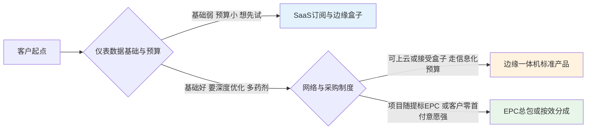
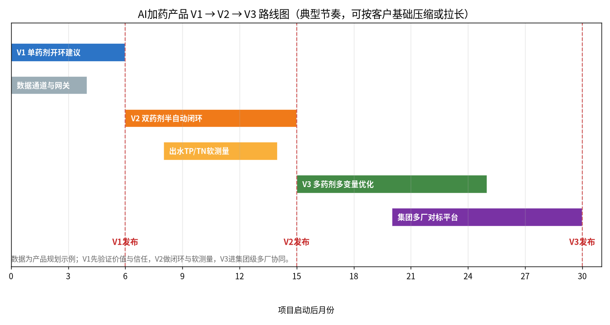

# 09-4 竞品分析与产品形态设计：知己知彼，把能力装进能卖的壳

> 技术团队最容易犯两个相反的错误：要么觉得自己天下无敌、眼里没有竞品；要么看谁都觉得打不过。竞品分析的目的不是给对手写差评，而是找到"客户为什么买他、为什么不买你"的真实原因，然后决定自己的产品做成什么形态、卖多少钱。这一章讲五类玩家怎么看、三种产品壳怎么选、MVP 怎么切、版本怎么走。
>
> 读完你能：搭一张竞品维度表并合规地填满它，在 SaaS、边缘盒子、EPC/按效分成三种形态里为不同客户选型，用 MoSCoW 定义 MVP 并讲清 V1→V3 路线与定价逻辑。
>
> 阅读时间：约 27 分钟。

---

## 场景导入：评标会上的三个"都能做"

某集团智慧加药招标，三家应标：国际大厂讲全球案例和平台愿景，报价 280 万；本地自动化商承诺"PLC 里加个回路就行"，报价 60 万；一家 AI 创业公司报价 90 万并愿按效分成。评标时三家在 PPT 上都写"智能优化、降本增效"——技术分居然拉不开。最后集团选了报价居中、愿意接受节药率对赌、且能与现有 SCADA 做只读对接的那家。

**客户不是在选"谁的算法强"，是在选"谁让我风险最小、账目最清楚"。**产品形态和商务结构，往往比技术参数更早决定胜负。

---

## 一、竞争格局：五类玩家，各有各的活法

中性描述，不褒不贬——每类玩家能活下来都有它的结构性优势，也都有它转不过弯的地方。

| 玩家类型 | 代表方向 | 技术路线特点 | 交付模式 | 标杆案例 | 价格带 | 典型弱点 |
|---|---|---|---|---|---|---|
| 国际水务技术公司 | 苏伊士（SUEZ）、赛莱默（Xylem）等方向 | 工艺包+优化器体系成熟，机理扎实，全球项目多 | 随集团方案/本地化伙伴交付，周期长 | 国际国内大型项目多 | 高（常 200 万~数百万/厂） | 本地化响应慢、价格高、深度定制弱 |
| 国内水务集团科技子公司 | 大水务集团孵化的数科/智慧水务公司 | 懂自家工艺和数据，平台与集团体系绑定深 | 集团内部协同+对外复制 | 集团内标杆强，外部少 | 中高 | 外部客户天然警惕"竞争对手的子公司" |
| 传统自动化/仪表商延伸 | PLC、SCADA、加药装置、在线仪表厂商 | 自控与硬件是主场，AI 多为合作或加装模块 | 随设备/EPC 出货，渠道强 | 硬件存量客户海量 | 中（捆绑后隐蔽） | 软件与数据科学能力偏弱，优化深度有限 |
| AI 与工业互联网创业公司 | 算法+工业互联网团队 | 机器学习、软测量灵活，迭代快，敢按效分成 | 轻量 SaaS/盒子+驻场，速度快 | 单点样板亮眼 | 中低，商务灵活 | 工程化与长期运维存疑，资金与存续风险 |
| 高校/研究院团队 | 给排水强校、环科院所 | 论文与机理深，前沿算法多 | 课题/示范项目制 | 学术声誉高 | 低到中（课题经费口径） | 产品化、售后和商务连续性最弱 |

> 💡 **竞争经验**：你的真正对手常常不是"同类 AI 公司"，而是**客户自己的惯性**——"老师傅经验投加"和"PLC 里现成的 PID 回路"是两个零报价的竞品。竞品分析第一行应该写这两个，因为它们占着 90% 的现状市场。卖产品本质上是让客户相信"比零报价的选项更值"。

### 竞品调研的合规方法：什么能做，什么不能做

可以做、且必须做：

1. **公开标讯分析**：公共资源交易平台的招标公告、中标公示、技术文件（公开部分），记录价格、参数、品牌、评分项；
2. **公开材料研读**：对手官网、招股书、专利、论文、展会手册、标准编制单位名单；
3. **客户侧访谈**：用过竞品的厂，问"再选一次还选不选、为什么"，只问体验事实，不诱导贬损；
4. **合作渠道侧面了解**：集成商、设计院、药剂商掌握的真实交付口碑。

不能做、做了既违法又毁口碑：

- 商业贿赂、买通客户内部人员偷标书和报价；
- 冒充客户/学生套取对手方案、代码、报价单；
- 公开材料里直接点名抹黑、断章取义；
- 离职员工违反竞业/保密约定带资料入职。

> ⚠️ **纪律提示**：竞品对比表内部用可以含名称和判断；**对外 PPT 一律做匿名化处理**（"国际厂商 A""传统自动化集成商"），只对比能力维度，不出现可识别的贬损表述。靠踩对手赢单，赢了也会被行业记住吃相。

### 一张填好的竞品作战表（匿名示例）

方法学会了，给一张内部用的半成品质感样表（数字为示例，实际用标讯与访谈填）：

| 对比维度 | 国际厂商 A | 自动化集成商 B | 同行创业公司 C | 我们 |
|---|---|---|---|---|
| 技术路线 | 机理模型+平台套件 | PID 回路+规则表 | 纯黑箱机器学习 | 机理+数据灰箱（[06-6](../06-AI建模篇/06-6-机理加数据-灰箱混合模型最落地.md)） |
| 单药剂效果证据 | 有白皮书，本地案例少 | 承诺值模糊 | 单厂 PPT 数据 | 承诺 M&V 口径下限并写入合同 |
| 闭环方式 | 支持深度闭环 | 直接闭环 | 半自动 | 只读开环起步，分阶梯升级 |
| 本地响应 | 城市级代理，响应以天计 | 本地团队，小时级 | 远程为主 | 本地驻场+远程双通道 |
| 公开中标价区间 | 200~350 万 | 50~90 万 | 70~120 万 | 80~150 万/盒子 20~60 万 |
| 客户最可能选他的理由 | 品牌与集团关系 | 便宜且领导放心 | 商务灵活敢对赌 | 效果可验证、退出无负担 |
| 我们的反制话术 | "全球案例不等于本地工况，先看省内同规模运行数据" | "规则表是把老师傅写死，换个工况就失灵" | "黑箱说不清为什么，验收和事故时谁背书" | —— |

> 💡 **用法提示**：这张表的价值不在"我们"那一列多好看，而在逼团队回答最后一行——**客户选对手的理由是什么，我们怎么一句话接住**。接不住的维度，要么补产品，要么绕开客户，不要在投标现场才第一次面对它。

---

## 二、三种产品形态：轻、快、稳，选壳先于选算法

### 形态①：SaaS/订阅服务

系统部署在云端或轻网关上，按厂/按年订阅付费（典型 3~10 万元/站·年）。

- **优点**：客户门槛低、开通快；供应商有持续收入（ARR，年度经常性收入），模型可集中迭代；一套平台多厂复用，边际成本递减。
- **软肋**：依赖稳定数据通道和客户上云许可；等保/数据出境顾虑多；断网即断服务，客户有"被卡脖子"焦虑；首单金额小，养不住重售前。
- **适用**：小厂、集团多厂统一管理、试点先行客户；民企和集团数科化部门接受度最高。

### 形态②：边缘一体机/盒子产品

工业级边缘服务器部署在厂内，数据不出厂，标准化软硬件打包，一次性 20~60 万元 + 少量年维保。

- **优点**：标准化交付快（数周而非数月）、毛利结构清晰、规避上云红线、可复制；对自控团队来说就是"新增一台设备"，采购好走。
- **软肋**：算力和模型更新受限，需要远程运维通道；硬件库存与版本管理是新成本；定制需求一旦多起来，"标准产品"会被项目化拖死。
- **适用**：2~10 万吨中坚厂的主力形态；网络安全敏感、有机房条件的厂；随设备商渠道铺货。

### 形态③：EPC 总包 / 按效分成

深度绑定提标改造或节能项目，供应商包设计、设备、实施，投资靠总包里的一块或"零首付从节约分成"回收（[09-5](09-5-商务模式招投标与交付话术.md) 详讲）。

- **优点**：客户绑定最深、单合同额最大、壁垒最高；按效分成几乎消除客户决策阻力。
- **软肋**：重资产、回款周期长、占用现金流；交付和验收风险全部压在自己身上；做成项目公司而非产品公司，难以规模化。
- **适用**：标杆厂攻坚、预算紧张但药费体量大的民企/BOT 厂、与 EPC 院绑定的提标项目。

### 三句选型口诀

- 客户连数据都不敢给：先卖盒子，别提云；
- 客户连首付都不愿出：谈按效分成，把信任变成合同；
- 客户要的是集团统一看板：SaaS 多租户才是正解，别在厂里堆十台服务器。

### 三形态速查表

| 维度 | SaaS 订阅 | 边缘盒子 | EPC/按效分成 |
|---|---|---|---|
| 典型价格 | 3~10 万/站·年 | 20~60 万一次性+维保 | 80~300 万或零首付分成 |
| 交付周期 | 1~3 周 | 4~10 周 | 3~12 个月 |
| 收入结构 | 经常性，复利 | 一次性为主 | 大额定单/长期分期 |
| 毛利率特征 | 初期低、成熟期高 | 稳定中等 | 高均值、高方差 |
| 规模化能力 | 最强 | 强 | 弱 |
| 客户决策难度 | 低 | 中 | 高（但按效分成可逆转） |
| 主要风险 | 数据通道与续费 | 定制化侵蚀标准 | 现金流与验收扯皮 |

> 💡 **产品经验**：三种形态不是三选一，而是**漏斗的三段**——用低成本 SaaS/试点让客户上车（V1），用边缘盒子完成标准交付（V2），对旗舰标杆用按效分成绑定（V3 样板）。最怕的是创业公司一上来就接 EPC：三个百万级项目同时垫资交付，公司直接死在"胜利前夜"。

---

## 三、MVP 定义：MoSCoW 切出最小可卖的那一刀

MVP（最小可用产品）不是"功能少的产品"，而是**最小到客户还愿意付钱的产品**。用 MoSCoW 四档管理需求：

| 优先级 | 含义 | 功能项 |
|---|---|---|
| **Must 必须有** | 没有就不能卖/不能验收 | 除磷剂单药剂开环建议；进水/出水/泵数据采集；建议量与执行量留痕；超标风险弹窗；人工一键接管 |
| **Should 应该有** | 重要但可短期替代 | TP 软测量；节药率看板与班组日报；计量泵异常报警；基线与 M&V 报表（[08-5](../08-落地实施篇/08-5-节能率怎么算-效益测量与验证MV.md)） |
| **Could 可以有** | 有余力再做 | 碳源第二回路建议；移动端推送；多用户权限精细化 |
| **Won't（本期不做）** | 明确拒绝写进路线图 V3 | 全自动闭环替人决策；多药剂联合寻优；集团多厂对标；数字孪生大场景 |

**砍掉 Won't 的决心，比设计 Must 的聪明更值钱。**客户每提一个"能不能顺便……"，都对照四档回答：进 Should 的排期，进 Won't 的明确说"V3 有，V1 没有"——含糊的承诺最后全变成免费开发。

> ⚠️ **老工程师的坑**：最危险的 MVP 错误是"V1 就上闭环"。没有建议被采纳率数据、没有和班组建立信任、没有跑过一个完整季节周期的模型，直接接 PLC 写控制，一次异常投加就足以终结项目和口碑。架构上的安全阶梯（只读→建议→半自动→闭环）见 [07-1](../07-控制优化篇/07-1-从开环建议到闭环控制-三种架构.md)，商业上的信任阶梯必须同步走。

---

## 四、V1→V2→V3 路线图：一版只兑现一个承诺

*数据为产品规划示例；各版本节奏可按客户仪表基础压缩或拉长，关键是每一版都要有可独立验收的价值。*

| 版本 | 时间（启动后） | 核心承诺 | 关键功能 | 验收口径 |
|---|---|---|---|---|
| **V1 开环建议** | 0~6 个月 | "建议准、看得懂、敢照着调" | 除磷剂单药剂开环、看板、台账数字化、异常提醒 | 建议采纳率≥70%，节药率按 M&V 达下限 |
| **V2 半自动闭环+软测量** | 6~15 个月 | "系统能动手，但人始终能踩刹车" | 除磷剂+碳源双药剂半自动、TP/TN 软测量、超限自动切人工 | 闭环运行率≥90%，双药剂综合节药率达标 |
| **V3 多变量优化+集团对标** | 15~30 个月 | "全厂多药剂协同+多厂一张网" | 多药剂多变量优化（含 PAM/消毒联动）、集团多厂对标、碳药协同 | 集团吨水药耗排名改善，平台续费 |

V1 卖的是**信任和可见的钱**，V2 卖的是**深度和省人**，V3 卖的是**平台与组织价值**。跨级销售（对没做过 V1 的客户强推 V3）失败率极高——客户为"愿景"付的钱，最后都会变成对"落地"的追责。

### 厂长驾驶舱：V1 就要让钱"看得见"

*真实照片：水厂中控室的大屏与操作席。所谓「AI 加药驾驶舱」最终要落到这样的真实场景：给值班长看什么数字、报警如何呈现、异常时怎样一键切回手动。图片来源：Wikimedia Commons，作者 Z22，CC BY-SA 4.0。*

> 💡 **设计经验**：大屏（驾驶舱）和操作屏是两种产品：大屏给厂长和参观团看，要大字、趋势、省了多少钱；操作屏给值班员用，要建议值、采纳按钮、报警确认和"为什么这么建议"的一句话解释。很多团队把两者做成一个界面，结果领导看不清、班组不会用，两头不讨好。

---

## 五、定价策略：三种报价结构对应三种客户

定价的本质不是成本加成，而是**客户怎么花钱最不痛苦、你怎么收钱最可持续**。

| 定价方式 | 结构 | 最适用客户 | 好处 | 注意点 |
|---|---|---|---|---|
| 一价总包+包年维保 | 软件硬件实施一口价，次年 8%~12% 维保 | 走资本开支/招标的国企、EPC 项目 | 当年确认收入，客户流程熟 | 前期砍价激烈，要留备件与接口费 |
| 按站订阅 | 3~10 万/站·年，按药剂回路数分档 | 小厂、集团多厂、SaaS 客户 | 门槛低、续费复利、绑定久 | 首期现金流薄，要控制实施投入 |
| 按效付费/分成 | 零首付，按 M&V 节约额分成 30%~50%，3~5 年 | 预算紧张但药费体量大的民企/BOT 厂 | 决策阻力最小、客户最易点头 | 基准与药价联动必须严密（[09-5](09-5-商务模式招投标与交付话术.md)） |

定价纪律四条：

1. **锚点先立**：先给客户看一年药费账单（[03-2](../03-问题与成本篇/03-2-污水厂成本账本-药剂到底花了多少钱.md)），系统价格永远对标"他正在花的钱"，而不是你的工时成本；
2. **版本报价**：V1/V2/V3 分档报价，给客户"选择"而不是"买不买"；预算紧时自然滑向 V1，而不是整体流失；
3. **订阅不打折送年份**：宁可降功能档，不破坏续费基准价——今年少收的钱明年还要继续少；
4. **分成设保底**：纯按效分成要谈保底服务费，防止客户工况长期低负荷导致你白干（负荷联动条款）。

> ⚠️ **商务经验**：报价里最贵的东西不要写成"软件授权费"四个字——国企审计很难为"看不见的代码"批钱。拆成"模型系统 + 边缘硬件 + 实施集成 + 一年优化服务"四张清单，硬件和服务有市场价可比，软件被夹在中间，总价就立住了。这也是为什么很多 SaaS 在国内要穿一件"盒子"的外衣。

---

## 六、产品化清单：卖出第 20 台盒子前必须备齐的东西

做一台样机靠工程师，卖一百台靠系统。以下 12 项缺一项，规模化时都会变成事故：

1. 标准 BOM 与硬件规格书（含两个以上可互换供应商，防断供）；
2. 出厂检验与现场开箱验收单（FAT/SAT）模板；
3. 点位表与通讯协议适配清单（4-20mA、Modbus、Profinet、OPC UA，见 [02-4](../02-加药系统篇/02-4-PLC与SCADA-数据怎么采控制怎么做.md)）；
4. 标准实施 SOP 与工期甘特模板（普通工程师照着能交付）；
5. 基线建模与 M&V 作业指导书（[08-5](../08-落地实施篇/08-5-节能率怎么算-效益测量与验证MV.md)）；
6. 安全联锁与人工接管测试用例（[08-3](../08-落地实施篇/08-3-安全联锁与人工接管.md)）；
7. 客户培训教材与考核题（运行员、管理员两版）；
8. 运维手册、故障代码表与远程升级规程；
9. 合同、技术协议、保密协议、数据归属条款模板（[09-5](09-5-商务模式招投标与交付话术.md)）；
10. 标准演示环境与 10 分钟讲解脚本（销售可独立演示）；
11. 续费与版本生命周期政策（V1 维护到什么时候、升级怎么收费）；
12. 客户成功档案模板（每厂的基线、承诺值、采纳率、节药率按月归档）。

> ⚠️ **交付经验**：第 4、6、12 项最容易被技术团队忽略。实施 SOP 决定毛利率（同样的厂，老手 3 周、新手 5 周，差价全是利润）；联锁测试用例决定会不会出事故；客户成功档案决定续费率和第二个、第三个集团厂的信任。产品竞争到最后，比的是这些"不性感的清单"。

---

## 七、渠道：除了自己直销，谁还能帮你卖

| 渠道类型 | 合作方式 | 适合的产品形态 | 管理要点 |
|---|---|---|---|
| 设计院 | 写进图纸与设备清单，按项目付技术服务费 | 盒子、EPC 模块 | 参数要中立开放，帮他降低设计风险 |
| EPC/总包方 | 作为智慧加药分包随总包出货 | EPC 形态、标准成套装置 | 严守界面划分，不替总包背工艺总包责任 |
| 仪表/加药装置商 | 盒子作为其设备智能化选配 | 边缘盒子 | 做好 OEM/白标，接口与品牌规则事先签清 |
| 区域集成商/代理 | 授权区域销售+一线实施，给折扣与培训 | 全形态 | 必须培训认证，验收口径统一，防乱承诺 |
| 药剂服务商 | 联合做"供药+优化"按效合同 | SaaS/分成 | 注意利益冲突：节药会减少他的卖药量，要改成节约分成绑定 |

渠道铁律：**直销打标杆，渠道做复制**。前 5 座样板厂必须自己做，把坑踩完、把 SOP 磨利；渠道放得太早，等于拿客户的现场给别人练兵，口碑会在你看不见的地方崩掉。与药剂商合作时尤其要算清激励——只有让他从"多卖药赚钱"变成"少用药也赚钱、还分你一点"，联盟才稳固（[09-5](09-5-商务模式招投标与交付话术.md) 的效益分享结构）。

---

## 八、产品经理和算法团队的三次必吵

技术驱动的公司里，产品经理（PM）的价值不是写需求文档，而是替客户在内部"吵架"。有三场架几乎必打，提前知道结论，少伤感情：

| 争论 | 算法团队倾向 | 客户真实需要 | 裁决原则 |
|---|---|---|---|
| 要不要上更复杂的模型 | 深度学习、多模型融合，追求极限精度 | 稳定、可解释、出事说得清 | 在验收指标够用时，选简单可解释的模型（[06 篇](../06-AI建模篇/06-1-AI加药能力地图-什么活能交给AI.md)） |
| 要不要为单厂做定制 | 来者不拒，每个厂都想训到最好 | 快速上线、价格可控 | 共性进产品，个性进配置；单厂定制必须单独报价 |
| 效果数据能不能对客户开放 | 担心暴露模型弱点 | 全程看得到才敢信 | 建议值、执行值、偏差全留痕开放，黑箱才是信任杀手 |

> 💡 **管理经验**：判断一个 PM 成熟与否，看他敢不敢对算法团队说"这个需求 V1 不做"，以及敢不敢对销售说"这个效果不能承诺"。两边都讨好的 PM，最后会交付一个谁都不满意、还收不回款的四不像。产品纪律的本质，是替公司守住 [09-2](09-2-价值量化与ROI测算模型.md) 里那条"下限承诺"的底线。

---

## 本章小结

1. 五类玩家（国际技术公司、集团科技子公司、自动化仪表商、AI 创业公司、高校团队）各有优势与软肋；最该研究的竞品是"老师傅经验"和"现成 PID"两个零报价选项。
2. 竞品调研只用公开标讯、公开材料和客户体验访谈，对外材料匿名化，绝不靠不正当手段、不点名贬损。
3. 三种产品形态：SaaS 轻而持续、盒子标准化快交付、EPC/分成深绑定重资产；健康路径是"试点上车→盒子放量→标杆分成"。
4. MVP 用 MoSCoW 切，V1 只做单药剂开环建议；V1 信任、V2 深度、V3 平台，不跨级销售。
5. 定价匹配客户的花钱方式：国企总包、小厂订阅、药费大户按效分成；报价拆成硬件/软件/实施/服务四张清单过审计。
6. 规模化靠 12 项产品化资产和认证渠道，不靠英雄工程师；前 5 座样板厂必须自营踩坑。
7. PM 的核心动作是砍需求与守承诺：简单可解释优先于极限精度，共性进产品、定制单独报价。

---

上一章：[09-3 市场规模、政策与需求量测算](09-3-市场规模政策与需求量测算.md) ｜ 下一章：[09-5 商务模式、招投标与交付话术](09-5-商务模式招投标与交付话术.md)
