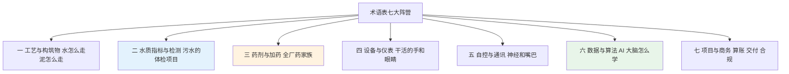

# 10-1 术语表：污水厂 AI 加药行话字典

> **本章讲什么**：把全书出现过的英文缩写、行话、型号词集中翻译成一句大白话，按七大阵营排好，像查字典一样随用随翻。
>
> **读完你能干什么**：早会听到"MLSS 掉了、ORP 上不来、OPC UA 写点、PSI 漂移"不再发懵；写方案、看标书时能说清每个指标的单位和典型值。
>
> **阅读时间**：约 20 分钟通读，更多时候当工具书查。

---

## 一、新人第一天的早会

新入职的运行工程师小周第一天参加早会，班长一口气说了一串："昨晚 MLSS 掉到两千八，SVI 一百六，二沉有点跑泥；缺氧池 ORP 上不来，碳源泵冲程加了十格；算法那边说 PSI 超了要等重训，让我们先别让他们走 OPC UA 写点。"

小周一个词都没接住。这不怪他——污水厂 AI 加药这个交叉领域，把**给排水、化工药剂、电气自控、软件算法、商务合同**五种行话搅在了一起。本章就是给这些词统一发一张"身份证"。

> 💡 **怎么用这张表**：词条格式统一为"**术语（英文缩写）——大白话解释**"，括号里补单位和典型经验值。所有典型值都是市政生活污水厂的常见区间，**具体项目以实测为准**。

## 二、七大阵营关系图

全书术语可以分成七类，正好对应你认识一座厂的顺序：先看池子、再看水、再看药，然后是设备、控制、数据，最后是项目怎么算账。

---

## 三、第①类：水处理工艺与构筑物

就是厂里那些大小池子和它们干活的顺序。

| 术语（缩写） | 大白话解释（单位/典型值） |
|---|---|
| 污水处理厂（WWTP） | 把生活污水、工业废水处理达标后再排回自然水体的工厂；本书专指市政厂，规模常用万 m³/d 表示 |
| 预处理 | 生物池前面的"粗加工"：格栅、提升、沉砂、除油，目的是保护后续水泵和构筑物 |
| 格栅 | 进水口一排铁栅栏：粗格栅栅距约 20~100 mm 拦树枝抹布，细格栅 1~10 mm 拦碎屑 |
| 沉砂池 | 让砂粒、果核、烟头沉下来的池子，防止磨坏水泵、埋住管道 |
| 初沉池 | 生物处理前靠静置沉掉部分 SS 和有机物的池子，停留约 0.5~2 h；不少 AAO 厂不设 |
| 生物反应池（曝气池） | 微生物"吃饭干活"的大水池，是全厂去碳、脱氮、除磷的主场 |
| 厌氧区 | 不曝气且无硝态氮的区段，DO≈0，聚磷菌在这里释放磷，ORP 常低于 −200 mV |
| 缺氧区 | 不曝气但有硝态氮的区段，DO 一般 <0.2 mg/L，反硝化菌在这里把硝氮变成氮气 |
| 好氧区 | 鼓风曝气的区段，DO 多控制在 2 mg/L 上下，负责去碳和硝化 |
| 二沉池 | 生物池后做泥水分离的沉淀池，表面负荷常见 0.6~1.5 m³/(m²·h) |
| 回流污泥（RAS） | 二沉池沉下来的泥泵回生物池继续干活，回流比常见 50%~100% |
| 剩余污泥（WAS） | 系统每天多出来的老泥，排一点送去脱水，用来控制污泥龄 SRT |
| 深度处理 | 二沉之后的"精修工序"：高效沉淀、过滤、消毒等，为一级A 或准IV类把关 |
| 高效沉淀池 | 混凝+泥渣回流+斜管沉淀的快速沉淀池，除磷降 SS 主力，表面负荷可达 10~20 m/h |
| 反硝化深床滤池 | 深砂滤池兼做反硝化：投碳源后在滤料里脱氮，末端同时把关 SS 和 TN |
| AAO（A²/O） | 厌氧-缺氧-好氧三段串联的主流工艺，一套池子同时完成脱氮除磷 |
| AO | 两段工艺：厌氧+好氧主打除磷，或缺氧+好氧主打脱氮，比 AAO 少一段 |
| SBR（序批式活性污泥法） | 一个池子里按时间轮流做"进水-反应-沉淀-排水"，省掉二沉池 |
| CASS（循环活性污泥工艺） | SBR 的改良版，池前加选择区，抗冲击负荷更好，县城小厂常见 |
| 氧化沟 | 推流式环形曝气长沟，泥水在沟里循环几十圈，污泥龄长、抗负荷、管理省心 |
| MBR（膜生物反应器） | 用超滤膜代替二沉池做泥水分离，出水 SS 接近 0；但电耗高、怕膜污堵 |
| MBBR（移动床生物膜） | 池里投悬浮塑料填料，微生物挂在填料上随水漂，提标扩容的常用改造手段 |
| BAF（曝气生物滤池） | 陶粒滤料上挂膜并同时过滤的池子，占地小，关键操作是定期反冲洗 |
| 消毒接触池 | 出水前让消毒液与水充分接触的渠或池，接触时间一般 ≥30 min |
| 污泥浓缩 | 把含水率 99% 以上的稀泥变稠到约 96%~97%，减轻脱水机负担 |
| 污泥脱水 | 把泥含水率降到 80% 左右（板框可到约 60%），泥饼才能装车外运 |
| 硝化 | 好氧自养菌把氨氮氧化成硝态氮，每 kg N 耗碱约 7.14 kg（以 CaCO₃ 计） |
| 反硝化 | 缺氧异养菌吃碳源把硝态氮还原成氮气，每 kg N 可补回约 3.57 kg 碱度 |

## 四、第②类：水质指标与检测

给污水做"体检"的项目，外加几个最核心的运行参数。

| 术语（缩写） | 大白话解释（单位/典型值） |
|---|---|
| 化学需氧量（COD） | 强氧化剂氧化水中有机物所消耗的氧量，mg/L；衡量水脏不脏的头号指标，一级A 限值 50 |
| 五日生化需氧量（BOD₅） | 微生物 5 天吃掉有机物消耗的溶解氧，mg/L；代表"能生物吃掉的脏"，一级A 限值 10 |
| 总有机碳（TOC） | 水中有机碳总量，mg/L；仪器可快速出数，常作 COD 的辅助观察指标 |
| 悬浮物（SS） | 水过滤后 103~105 ℃ 烘干留下的固体，mg/L；一级A 限值 10，直观就是水浑不浑 |
| 挥发性悬浮固体（VSS） | SS 在 550 ℃ 烧掉的部分，代表其中的有机物份额 |
| 混合液悬浮固体（MLSS） | 曝气池每升混合液含多少干固体，mg/L；市政厂典型 3000~5000 mg/L |
| 混合液挥发性悬浮固体（MLVSS） | MLSS 中能烧掉的有机部分，约占 MLSS 的 0.6~0.8，更能代表活微生物量 |
| 污泥体积指数（SVI） | 1 g 干污泥沉降 30 min 占多少 mL，mL/g；70~150 正常，过高膨胀、过低泥太"老" |
| 污泥沉降比（SV30） | 1 L 混合液在量筒里静沉 30 min 泥层所占体积百分比，%；班组 5 分钟自检泥况的土办法 |
| 氨氮（NH₃-N） | 以氨/铵形态存在的氮，mg/L；耗氧且对鱼有毒，一级A 限值 5（水温 ≤12 ℃ 时 8） |
| 硝态氮（NO₃-N） | 硝化产物硝酸盐氮，mg/L；反硝化要消灭的对象 |
| 亚硝态氮（NO₂-N） | 硝化没干完的中间产物，mg/L；明显积累说明工艺受抑制 |
| 凯氏氮（TKN） | 氨氮+有机氮之和，mg/L；老口径指标，做氮物料衡算用 |
| 总氮（TN） | 氨氮+硝氮+亚硝氮+有机氮之和，mg/L；一级A 限值 15，碳源够不够主要看它 |
| 总磷（TP） | 水中所有形态磷之和，mg/L；一级A 限值 0.5，准IV类常见口径 0.3 |
| 正磷酸盐（PO₄-P） | 能直接与铝/铁反应沉淀的溶解态磷，mg/L；化学除磷主要抓它 |
| 碱度 | 水抵抗 pH 波动的缓冲能力，以 CaCO₃ 计 mg/L；低于约 70~100 时硝化易掉 pH |
| 溶解氧（DO） | 水里溶解的氧气，mg/L；好氧区典型 2 左右，缺氧区应 <0.2 |
| 氧化还原电位（ORP） | 水偏氧化还是偏还原的电压，mV；缺氧段约 −100~−50，厌氧段常低于 −200 |
| 酸碱度（pH） | 酸碱性强弱，无量纲；正常运行 6.5~8，排放标准 6~9 |
| pF | 水分能量状态（基质势）取对数的表示，值越大水越难脱；污泥干化研究用，日常运行少见 |
| 水温 | 摄氏温度 ℃；低于 12~15 ℃ 硝化变慢、药耗升高，是冬季提标的大敌 |
| 浊度 | 水透光受阻程度，NTU；在线看 SS 变化的便宜信号 |
| 电导率 | 水导电能力，μS/cm；间接反映盐分和工业偷排冲击 |
| 色度 | 水颜色深浅，用稀释倍数表示；一级A 限值 30 倍 |
| 粪大肠菌群 | 粪便污染指示菌，个/L；一级A ≤10³，靠消毒工序把关 |
| 挥发性脂肪酸（VFA） | 乙酸、丙酸等小分子有机酸，mg/L；聚磷菌和反硝化菌最爱吃的"快碳" |
| 污泥含水率 | 泥中水的质量占比，%；脱水后约 80%（即 4 kg 湿泥里约 3.2 kg 是水） |
| B/C 比 | BOD₅/COD 比值，无量纲；>0.3 可生化性好，<0.2 生物法就吃力 |
| C/N 比 | 进水碳氮比（常用 BOD₅/TKN），无量纲；脱氮一般希望 ≥4，不够就得补碳源 |
| 水力停留时间（HRT） | 水在池子里平均待多久，h=池容/流量；生物段常见 8~18 h |
| 污泥龄（SRT） | 微生物在系统内平均存活天数，d；硝化菌长得慢，冬季常需 15~25 d |
| 食微比（F/M） | 食物 BOD 与微生物 MLVSS 的质量比，kgBOD/(kgMLVSS·d)，典型 0.05~0.15 |
| 容积负荷 | 单位池容每天承受的 BOD/COD，kg/(m³·d)；设计池容大小的核心参数 |

## 五、第③类：药剂与加药

厂里花真金白银买的"药家族"和怎么投的行话。

| 术语（缩写） | 大白话解释（单位/典型值） |
|---|---|
| 聚合氯化铝（PAC） | 最常用的铝系混凝除磷剂，黄褐色液体，以 Al₂O₃ 计含量约 28%~30%，约 1500~2500 元/吨 |
| 聚合硫酸铁（PFS） | 铁系混凝剂，红褐色，除磷脱色强，加多了出水发黄 |
| 聚合氯化铝铁（PAFC） | 铝铁合体的混凝剂，脾气介于 PAC 和 PFS 之间 |
| 硫酸铝/三氯化铁 | 传统铝盐/铁盐，机理与 PAC/PFS 相同，有时综合药剂费更低 |
| 聚丙烯酰胺（PAM） | 高分子有机"胶水"，助凝和污泥脱水用，单价约 1.2 万~3 万元/吨 |
| 阳离子 PAM | 带正电，主要用于污泥脱水，靠电中和抓带负电的污泥颗粒 |
| 阴离子 PAM | 带负电，多用于混凝助凝、增稠，污泥脱水一般不用它 |
| 混凝 | 投药后让稳定悬浮的胶体"脱稳"、开始抱团的过程，需要快速搅拌 |
| 絮凝/矾花 | 脱稳微粒互相碰撞长成的"棉花团"，靠慢速搅拌长大沉降 |
| 助凝 | 帮矾花长得更大更结实的手段，投 PAM、加石灰、调 pH 都算 |
| 投加系数（β） | 实际投药量是理论量的多少倍；除磷铝盐/铁盐 β 多在 1.5~3 |
| Al/P、Fe/P 摩尔比 | 每 mol 磷配多少 mol 铝或铁；理论 1∶1，实际多在 1.5~3 |
| 碳源 | 反硝化时喂给细菌的"饭"，常用乙酸钠、乙酸、甲醇、葡萄糖 |
| 乙酸钠 | 最常见商用碳源，安全、起效快，约 2500~4000 元/吨，COD 当量约 0.78 kgCOD/kg |
| 甲醇 | 便宜高效碳源（约 1.50 kgCOD/kg），但易燃有毒，储罐按危化品和防爆管理 |
| 乙酸 | 液体碳源（约 1.07 kgCOD/kg），反应快，味大、有腐蚀性 |
| 葡萄糖 | 应急碳源（约 1.06 kgCOD/kg），好买但贵、易养杂菌，不宜长期投 |
| 碳源 COD 当量 | 1 kg 药剂能折算多少 kg COD 食物，是比较碳源性价比的统一尺子 |
| 反硝化需碳量 | 还原 1 kg 硝氮实际约需 4~6 kg COD，含 DO 抢夺和冗余常取 4.5~5.5 |
| 次氯酸钠 | 常用消毒液，商品液有效氯约 10%，投加以有效氯计约 1~5 mg/L |
| 有效氯 | 不同消毒剂杀菌能力的统一折算口径，mg/L |
| 二氧化氯（ClO₂） | 强氧化消毒剂，杀菌快、副产物少，需现场制备，注意防爆通风 |
| 紫外消毒（UV） | 用光杀菌不投药，灯管怕结垢，且没有持续抑菌能力 |
| CT 值 | 消毒剂浓度 C（mg/L）× 接触时间 T（min），判断杀菌到不到位的真正指标 |
| 烧碱（NaOH） | 氢氧化钠，调 pH、洗膜用，强腐蚀 |
| 盐酸 | 调 pH、洗膜用，强腐蚀，与次氯酸钠严禁混存混运 |
| 石灰（CaO/Ca(OH)₂） | 便宜的调碱和辅助除磷药，渣多、易结垢堵管 |
| 化学污泥 | 投铝盐/铁盐除磷额外沉出的无机泥；药加得越多泥越多，处置费越高 |
| 配制浓度 | 药稀释到多少再投；PAM 一般配成 0.1%~0.3%，配浓了搅不开还堵管 |
| 熟化时间 | PAM 配好后边搅边"泡"的时间，一般 30~60 min，分子链展开才有效 |
| 投加量 | 单位水量加多少药，mg/L；1 mg/L 对应 10 万吨水每天约 100 kg 药 |
| 吨水药剂费 | 年药剂总费/年处理水量，元/m³；市政厂典型 0.05~0.25 元 |

## 六、第④类：设备与仪表

干活的"手"和看水的"眼睛"。

| 术语（缩写） | 大白话解释（单位/典型值） |
|---|---|
| 计量泵（加药泵） | 能精确调流量的小泵，隔膜式最常见；品牌如 SEKO、普罗名特、帕斯菲达、南方泵业 |
| 冲程 | 计量泵柱塞/隔膜的单次行程，调冲程改单次出药量，现场常调 20%~100% |
| 冲程频率 | 泵每分钟动作多少次，靠变频或脉冲调节，与冲程一起决定总流量 |
| 背压阀 | 泵出口带弹簧的单向阀，保证泵在稳定背压下注药准确、防虹吸倒流 |
| 脉动阻尼器（阻尼器） | 出口串个带气室的小罐子，把一股一股的脉冲流量熨平 |
| 安全阀 | 管路堵死时泄压的保护件，防止憋爆泵头和管道 |
| 静态混合器 | 管内螺旋叶片，水流过时自动把药和水搅匀，不用电 |
| 加药装置（撬装） | 溶药箱+计量泵+搅拌+管路集成在一个底座上，接上水电就能用 |
| 溶药箱/熟化罐 | 配药、泡药的箱子；PAM 常用三槽式（溶药-熟化-投加） |
| 搅拌机 | 溶药箱里防沉降、助熟化；PAM 罐转速一般 100~300 r/min |
| 电磁流量计 | 导电液体过管即测流量，进出水总管和加药管最常见，精度约 ±0.5% |
| 超声波/明渠流量计 | 不接触液面测流量，进水口和巴氏计量槽常用 |
| 浮子流量计 | 玻璃/塑料管里浮子随流量升降，看计量泵瞬时流量的便宜表 |
| DO 仪 | 在线测溶解氧，秒级响应；膜头要定期换液校准，维护不好数就漂 |
| pH 计 | 玻璃电极在线测 pH，怕干怕堵，要定期做两点校准 |
| ORP 仪 | 测氧化还原电位，判断缺氧/厌氧状态，电极和 pH 计长得像哥俩 |
| MLSS 计 | 用光吸收法在池里在线测污泥浓度，秒级但只是近似，要和化验值对 |
| 污泥界面仪 | 用超声波测二沉池泥层厚度，泥位太高报警，防跑泥 |
| COD 在线分析仪 | 试剂法自动测 COD，10~30 min 出一个数，要换试剂、定期比对 |
| 氨氮在线分析仪 | 自动测氨氮，同样 10~30 min 一个数；品牌如哈希 HACH、聚光、力合、E+H |
| 总磷在线仪 | 自动消解显色测 TP，含强碱或钼酸盐试剂，维护工作量不小 |
| 总氮在线仪 | 碱性过硫酸钾消解紫外法等测 TN，试剂贵、光路要稳定 |
| 自动采样器（留样器） | 按时间或流量自动取样、超标冷藏留样，环保检查时的"黑匣子" |
| 余氯仪 | 出水端测剩余有效氯，既防消毒不够也防加多了伤河道 |
| 浊度仪 | 光学法测浊度 NTU，深度处理出水把关用 |
| 液位计 | 超声/雷达/压力式测水池和药箱液位，低液位联锁停泵 |
| 鼓风机 | 向好氧池供气的大设备，是全厂头号耗电户（约占全厂电耗 40%~60%） |
| 电动调节阀/变频器 | 接收 4-20mA 改开度或转速，是 AI 闭环的"手" |
| 叠螺脱水机 | 螺旋轴挤压脱水，占地小、节水、能跑低浓度泥，市政厂普及快 |
| 板框压滤机 | 滤板挤压把泥压成饼，含水率可到约 60%，但间歇运行、费人工 |
| 离心脱水机 | 高速旋转甩干，连续出泥、臭味小，电耗高、转动件磨损大 |
| 带式压滤机（带机） | 两条滤布夹泥挤压走带，便宜直观，跑药跑泥时现场最脏 |
| 螺杆泵 | 输送黏稠 PAM 和污泥的常用泵，严禁空转（会烧定子） |
| 空压机 | 给气动阀门和仪表供气，气动阀多的厂离不了 |

## 七、第⑤类：自控与通讯

数据怎么采、命令怎么发的"神经和嘴巴"。

| 术语（缩写） | 大白话解释（单位/典型值） |
|---|---|
| 可编程控制器（PLC） | 车间现场的"控制大脑"；品牌如西门子 S7-1200/1500、施耐德 M340/M580、罗克韦尔、和利时、汇川 |
| 远程终端（RTU） | 泵站等分散点用的小型控制终端，更耐高低温和恶劣环境 |
| 集散控制系统（DCS） | 大型厂用的整套控制系统；大污水厂常与 PLC 组网混用 |
| 数据采集与监控系统（SCADA） | 上位机画面+历史数据库，运行员盯屏、操作、看报警的那套系统 |
| 人机界面（HMI） | 现场触摸屏或操作画面，泵的启停、给定都在上面点 |
| 模拟量输入（AI） | PLC 接收 4-20mA 仪表信号的通道；注意不是"人工智能"的 AI |
| 模拟量输出（AO） | PLC 向外送出 4-20mA 给定值的通道 |
| 数字量输入（DI） | 接收运行、故障、手自动等干接点开关信号的通道 |
| 数字量输出（DO） | 送出启停等开关命令的通道；注意不是溶解氧 DO |
| 4-20mA | 工业模拟信号标准：4mA 对应量程下限、20mA 对应上限，断线变 0 可被识别 |
| Modbus RTU | 跑在 RS485 双绞线上的经典通讯协议，在线仪表最常见 |
| Modbus TCP | 以太网版 Modbus，走网线，点表用寄存器地址定位 |
| Profinet | 西门子主推的工业以太网，S7 PLC 与远程 IO 常走它 |
| OPC UA | 跨品牌统一数据接口，AI 服务器读数据、写给定的首选通道 |
| 边缘网关 | 装在机柜里的小工控机，负责采集、缓存、跑模型、上传云端 |
| 网闸（单向隔离装置） | 控制网与管理网之间只让数据单向外流的硬件，防止反向入侵 |
| NTP 对时 | 让全厂设备时间统一；时钟不一致，滞后对齐和事故追溯全乱 |
| 点表 | 每个数据点的点名、地址、量程、单位对照表；AI 进场要的第一份资料 |
| 手自动 | 设备由人就地或画面操作叫手动，交给程序叫自动；切换权永远在人 |
| 联锁 | 条件触发的自动保护动作，如低液位停泵、出水逼近限值切保守策略 |
| 开环/闭环 | 系统只给建议不动作是开环；测到结果自动调药是闭环 |
| PID 控制 | 比例-积分-微分反馈控制，按设定值与测量值偏差调节，加药回路基本功 |
| 前馈控制 | 不等结果出来，进水一变就提前调药（看着来水动作） |
| 反馈控制 | 看出水结果回头纠偏，慢但稳；工程上多与前馈搭配 |
| 扫描周期 | PLC 程序从头跑一遍的时间，常见 100~1000 ms，远快于仪表出数 |
| 组态 | 在 SCADA 里搭画面、建变量、连报警的开发工作 |

## 八、第⑥类：数据与算法

AI 大脑怎么学、怎么考、怎么保鲜。

| 术语（缩写） | 大白话解释（单位/典型值） |
|---|---|
| 软测量 | 用 Q/DO/pH 等便宜在线量实时推算 TP、氨氮等贵指标；是巡警不是法官 |
| 特征 | 喂给模型的输入变量，如流量、DO、滞后 30 min 的投加量 |
| 标签 | 模型要学的"答案"，如化验测出的出水 TP |
| 训练集 | 模型用来学习规律的历史数据 |
| 验证集 | 训练过程中用来调参的数据 |
| 测试集 | 最后"考试"用、训练时不许偷看的数据 |
| 过拟合 | 模型把历史噪声都背下来了，离线很准、上线翻车 |
| 欠拟合 | 模型太简单，连基本规律都没学到，训练分就不高 |
| 均方根误差（RMSE） | 预测偏差的"平均罚分"，mg/L，对大误差更敏感 |
| 平均绝对误差（MAE） | 预测平均偏差多少 mg/L，最直观的模型成绩单 |
| 随机森林 | 很多棵决策树一起投票的集成模型，抗噪好上手，加药预测首选之一 |
| 梯度提升（XGBoost/LightGBM） | 一棵树接一棵树地专门补前面的错，表格数据上常拿高分 |
| LSTM | 带记忆的循环神经网络，擅长长时间序列，但更吃数据和算力 |
| 聚类 | 不给答案，让算法按相似性自动把工况分堆（如雨天、高负荷、冬季） |
| 异常检测 | 自动识别偷排冲击、仪表死机、泵堵塞等不正常的数据段 |
| 数据泄漏 | 训练时偷看了当时不可能拿到的未来信息，离线分数虚高、上线失效 |
| 时间序列 | 按时间排列的数据序列；污水数据天然带滞后和昼夜周期 |
| 滞后（纯滞后） | 现在投的药要过 τ≈V/Q 才在出水看到结果，典型几十到几百分钟 |
| 互相关 | 把两个信号错开时间算相关性，用来找投加量与出水指标的最佳滞后 |
| 特征工程 | 从原始数据造变量：滚动均值、滞后项、时段、水温分层等 |
| 归一化 | 把量纲不同的变量压到相近范围，让模型训练更稳 |
| 推理（预测） | 上线后每来一组新数据模型算一次结果，区别于训练阶段 |
| 置信区间 | 预测给出"大概率落在哪段"；区间变宽说明模型自己心里没底 |
| 时间外验证 | 用训练期之后的月份考试，模拟真实上线，是防泄漏的关键动作 |
| 群体稳定性指数（PSI） | 当前数据分布与建模时的差异；<0.1 稳定，0.1~0.25 关注，>0.25 必须处理 |
| 漂移 | 工况随季节、纳管变化而改变，模型慢慢失准，分数据漂移和概念漂移 |
| 影子运行 | 模型只看只算不操控，在 SCADA 上旁听对比 4~8 周再谈闭环 |
| 重训练 | 用新数据更新模型；污水厂常见按季度或年度滚动重训 |
| 灰箱模型 | 机理公式（白箱）+数据拟合（黑箱）结合，可解释、少数据也能跑 |
| 一阶加纯滞后模型（FOPDT） | 加药过程最常用的简化动态模型：一个惯性加一个滞后，整定 PID 用它 |
| 模型预测控制（MPC） | 用模型预判未来几步、带着约束滚动求最优；多变量耦合时比 PID 强 |
| 数字孪生 | 在电脑里搭一座与真厂同步的虚拟厂，先在影子厂试错再动真厂 |
| ASM1 | 国际水协 IWA 的 1 号活性污泥机理模型，8 个过程 13 个组分，仿真通用语言 |
| ASM2d | ASM 家族中加入生物除磷的版本，除磷工艺仿真用 |
| BSM | 污水厂仿真基准平台，用来公平比较不同控制策略的好坏 |
| 出水水质指数（EQI） | BSM 中把各污染物换算成一个综合污染罚款指数，越低越好 |
| 运行成本指数（OCI） | BSM 中曝气、泵送、污泥处置等综合运行成本指数 |

## 九、第⑦类：项目与商务

算账、签合同、交付和合规的词。

| 术语（缩写） | 大白话解释（单位/典型值） |
|---|---|
| 概念验证（POC） | 小范围验证"这事能不能成"，常拿 1~3 个月历史数据先做离线分析 |
| 基线 | 改造前的药耗、电耗基准线；没有基线就没法证明省没省钱 |
| 测量与验证（M&V） | 节能量化的通行方法论，节药项目借用它的口径核算节省 |
| IPMVP | 国际节能效果测量与验证规程，规定测量边界、调整项和报告格式 |
| 合同能源管理（EMC） | 服务商垫资改造、从省下的钱里分成；节水节药项目常借用该模式 |
| 按效付费 | 服务费与实际节药率挂钩，省不到约定值不收或少收 |
| 投资回报率（ROI） | 年净收益/总投资；10 万吨级系统投资约 50~150 万元，回本常见 1~2.5 年 |
| 静态回收期 | 总投资/年净节省，年；不考虑资金时间价值的粗算 |
| CAPEX/OPEX | 资本开支（买设备建系统）/运行开支（药费、电费、维护费） |
| 物料清单（BOM） | 方案里网关、仪表、泵、软件逐项列价的采购清单 |
| TAM/SAM/SOM | 总市场/可服务市场/1~3 年实际能拿下的市场，做市场规模的三层漏斗 |
| 关键绩效指标（KPI） | 考核成效的硬数字，如节药率、出水达标率、系统投用率 |
| 服务等级协议（SLA） | 合同承诺的响应时间、在线率、故障恢复时限 |
| 标准作业规程（SOP） | 一步步照做的操作手册，给运行员的"傻瓜说明书" |
| 节药率 | （基线单耗−实际单耗）/基线单耗，%；除磷剂常见空间 15%~30%、碳源 10%~25% |
| 灰度投运 | 先开环建议、再限幅半自动、最后闭环，逐步放权的上线方式 |
| 试运行 | 验收前的考验期，常见 3~6 个月，能跨季节更有说服力 |
| 验收 | 按合同指标逐项考核、签字移交，是关键收款里程碑 |
| 排污许可证 | 企业合法排污的"身份证"，载明排放口、限值和监测要求 |
| 自行监测 | 企业按规范自己监测、记录并公开，在线+手工双轨 |
| 网络安全等级保护（等保 2.0） | 国家网络安全分级保护制度，工控系统一般按二级或三级备案测评 |
| 工控网络安全 | 防外部入侵 PLC/SCADA，靠网络分区、网闸、白名单、弱口令治理 |
| 招投标 | 政府采购公开流程，按技术方案、业绩、价格综合评分定中标 |
| 化学污泥减量 | 精准投铝/铁盐少产无机泥，典型空间 5%~10%，省的是污泥处置钱 |

---

> ⚠️ **老工程师的坑（撞车缩写）**：同一缩写在两个行当意思完全不同——在自控图纸上 **AI 是模拟量输入、AO 是模拟量输出、DO 是数字量输出**；到了工艺/算法这边，AI 是人工智能、DO 是溶解氧。看到缩写先看上下文，别拿"溶解氧 4-20mA 输出"闹出笑话。

> 💡 **老工程师的坑（单位陷阱）**：谈投加量一定问清三件事——是**商品液量还是折纯量**、浓度以什么计（如 PAC 以 Al₂O₃ 计约 28%~30%）、单位是 mg/L 还是 kg/h。不少"模型算错了"最后查出来都是药剂浓度和单位没对齐。具体项目一律以实测和到货化验单为准。

## 本章小结

1. 全书术语分七大阵营：**工艺构筑物、水质指标、药剂加药、设备仪表、自控通讯、数据算法、项目商务**，对应认识一座厂的顺序。
2. 最容易混的两件事：**AI/AO/DO 缩写撞车**、投加量单位与浓度口径。
3. 数字感先记牢几个锚点：MLSS 3000~5000 mg/L、SVI 70~150、好氧 DO 约 2 mg/L、β 系数 1.5~3、反硝化需碳 4.5~5.5 kgCOD/kg N。
4. 所有"典型值"都是市政生活污水厂经验区间，工业废水和具体项目以实测为准。
5. 查排放限值和标准号，接着看下一章 [10-2 标准规范与排放限值清单](./10-2-标准规范与排放限值清单.md)。

---

上一章：[09-5 商务模式、招投标与交付话术](../09-产品经理篇/09-5-商务模式招投标与交付话术.md)
｜下一章：[10-2 标准规范与排放限值清单](./10-2-标准规范与排放限值清单.md)
