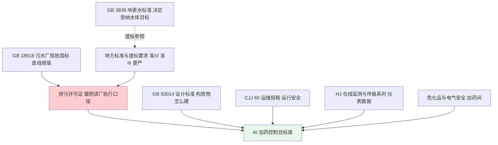

# 10-2 标准规范与排放限值清单

> **本章讲什么**：把 AI 加药项目里最常用到的**排放限值数字**和**标准规范清单**集中列出来：出水要达到多少、参照什么、加药间要守什么规矩、在线仪表怎么比对、排污许可怎么管。
>
> **读完你能干什么**：写方案"设计标准"一页不再到处搜；被客户、监理问"你们按哪本规范"时答得上来；能分清国家标准、地方标准、排污许可证三者的从严关系。
>
> **阅读时间**：约 18 分钟。建议收藏，用的时候直接翻表。

---

## 一、场景：投标前夜被问住

投标前夜，技术负责人问新入行的销售三个问题：

1. 这个厂执行一级A，**氨氮冬季到底按 5 还是 8**？
2. 招标文件写"出水主要指标达**准IV类**"，TP 按 0.3 还是 0.5？
3. 我们 AI 系统读在线仪表数据，要符合哪本**数据传输和比对**规范？

这三个问题的答案全在本章。先记住一条总原则：

> ⚠️ **从严原则**：排放标准不是只看国标。**国家标准是底线，地方标准更严按地标，环评批复和排污许可证写了更严的限值，按许可证执行**。AI 加药控制的目标值必须按该厂排污许可证副本载明的限值来定，而不是凭印象。

## 二、一张图看清标准体系

一句话：**GB 18918 和地标给限值、GB 3838 决定水体目标、GB 50014 管设计、CJJ 60 管运行、HJ 系列管仪表数据、危化品规范管加药间，最后一切落到排污许可证上**。

## 三、GB 18918-2002 常用项目排放限值

《城镇污水处理厂污染物排放标准》是所有城镇污水厂的基本红线，下表为日均值常用项目。

| 项目 | 单位 | 一级A | 一级B | 二级 |
|---|---|---|---|---|
| 化学需氧量 COD | mg/L | 50 | 60 | 100 |
| 五日生化需氧量 BOD₅ | mg/L | 10 | 20 | 30 |
| 悬浮物 SS | mg/L | 10 | 20 | 30 |
| 动植物油 | mg/L | 1 | 3 | 5 |
| 石油类 | mg/L | 1 | 3 | 5 |
| 阴离子表面活性剂 | mg/L | 0.5 | 1 | 2 |
| 总氮 TN | mg/L | 15 | 20 | — |
| 氨氮（水温 >12 ℃） | mg/L | 5 | 8 | 25 |
| 氨氮（水温 ≤12 ℃） | mg/L | 8 | 15 | 30 |
| 总磷 TP（2006-01-01 起建设的单位） | mg/L | 0.5 | 1 | 3 |
| 总磷 TP（2005-12-31 前建设的单位） | mg/L | 1 | 1.5 | 3 |
| pH | 无量纲 | 6~9 | 6~9 | 6~9 |
| 色度 | 稀释倍数 | 30 | 30 | 40 |
| 粪大肠菌群数 | 个/L | 10³ | 10⁴ | 10⁴ |

> 💡 **怎么用这张表**：① 除水温、pH、粪大肠菌群和色度外均为**日均值**，取样和分析按标准规定方法执行；② 氨氮括号规律是"**冬天放宽**"——低温硝化难，限值从 5 放宽到 8，但微生物活性下降得更快，所以冬季运行反而更吃力；③ TP 看厂子建设时间两档限值，新厂 0.5、老厂 1.0；④ 回用水、景观环境用水等还要满足相应再生水标准。

> ⚠️ **老工程师的坑**：标准里还有一类"选择控制项目"（重金属等）和一类要求（如脱水污泥含水率、厂界废气、噪声）。上表只列与加药控制最相关的常用项目，**完整项目、采样规则和特例以 GB 18918-2002 正式文本为准**。

## 四、GB 3838-2002 地表水 III/IV/V 类主要限值

注意：这本是**河流湖泊的"体检标准"**，不是污水厂排放标准；提标时"准IV类"就是参照它。

| 项目 | 单位 | III 类 | IV 类 | V 类 |
|---|---|---|---|---|
| 化学需氧量 COD | mg/L | 20 | 30 | 40 |
| 高锰酸盐指数 | mg/L | 6 | 10 | 15 |
| 五日生化需氧量 BOD₅ | mg/L | 4 | 6 | 10 |
| 氨氮 | mg/L | 1.0 | 1.5 | 2.0 |
| 总磷 TP（河流） | mg/L | 0.2 | 0.3 | 0.4 |
| 总磷 TP（湖库） | mg/L | 0.05 | 0.1 | 0.2 |
| 总氮 TN（湖库，以 N 计） | mg/L | 1.0 | 1.5 | 2.0 |
| pH | 无量纲 | 6~9 | 6~9 | 6~9 |

> 💡 **两个易错点**：① 总磷**河流和湖库限值不同**，湖库更严（III 类只有 0.05），因为湖库怕富营养化；② GB 3838 的 TN 要求主要针对**湖泊、水库**，一般河流不考核 TN，别把湖库值套到河流排放口上。

## 五、"准IV类/准III类"提标口径怎么理解

"准IV类"不是国家标准里的正式名词，而是各地对**污水厂出水主要指标接近 GB 3838 IV 类**的俗称，一般写在地方标准、达标方案或排污许可证里。

- **本书统一口径（常见提标要求）**：COD ≤30、氨氮 ≤1.5、TP ≤0.3 mg/L；SS 常要求 ≤5~10，TN 多沿用 10~15 mg/L。
- 它**不是把地表水标准整套照搬**（地表水标准还管溶解氧、重金属等自然水体指标），通常只指定 COD、氨氮、TP 等几项。
- 项目第一动作：**翻看该厂排污许可证和当地达标方案原件**，按文件里的具体限值做控制目标。

| 地区 | 地方标准（名称仅作查索提示） | 提标看点 |
|---|---|---|
| 北京 | DB11/890-2012《城镇污水处理厂水污染物排放标准》 | 分 A/B 两档限值，敏感水域执行更严档 |
| 天津 | DB12/599-2015《城镇污水处理厂污染物排放标准》 | 新建及现有厂分级提标 |
| 上海 | DB31/199-2018《污水综合排放标准》 | 综合排放标准；城镇厂注意 GB 18918 与当地批复的适用范围 |
| 浙江 | DB33/2169-2018《城镇污水处理厂主要水污染物排放标准》 | COD 40、氨氮 2（冬 4）、TN 12（冬 15）、TP 0.3，其余项目执行一级A |

> ⚠️ 上表标准号与数值仅为**查索提示**，浙江数值为该标准表 1 的公开口径。地方标准更新频繁（各地可能已有新版本或修改单），**务必以当地现行有效版本、环评批复和排污许可证为准**，可在生态环境部"地方标准备案"栏目和各省生态环境厅官网核对。

## 六、相关规范清单（按用途查）

下表是 AI 加药项目从设计、运行、监测数据到加药间安全会引用或被问到的规范。标准号可能被修订替代，**用前在生态环境部官网或"国家标准全文公开系统"核实现行有效版本**。

| 标准号 | 名称 | 与加药 AI 相关的看点 |
|---|---|---|
| GB 18918-2002 | 城镇污水处理厂污染物排放标准 | 排放红线、取样与评价规则，所有控制目标的源头 |
| GB 3838-2002 | 地表水环境质量标准 | 受纳水体类别决定提标口径（准IV/准III） |
| GB 50014-2021 | 室外排水设计标准 | 构筑物、加药设施、再生利用系统的设计依据 |
| CJJ 60-2011 | 城镇污水处理厂运行、维护及安全技术规程 | 日常运行操作、加药间和危险作业安全底线 |
| HJ/T 353-2007 | 水污染源在线监测系统（COD、氨氮等）安装技术规范 | 采样点、站房、安装条件，取数施工前必读 |
| HJ/T 354-2007 | 水污染源在线监测系统验收技术规范 | 在线站验收流程，数据要先验收才"作数" |
| HJ/T 355-2007 | 水污染源在线监测系统运行与考核技术规范 | 数据有效率考核，AI 数据可用率也参照它判断 |
| HJ/T 356-2007 | 水污染源在线监测系统数据有效性判别技术规范 | 哪些时段数据有效，建模筛数据的依据 |
| HJ 377-2019 | 化学需氧量（CODCr）水质在线自动监测仪技术要求及检测方法 | COD 在线仪选型与性能要求 |
| HJ 101-2019 | 氨氮水质在线自动监测仪技术要求及检测方法 | 氨氮在线仪选型与性能要求 |
| HJ/T 103-2003 | 总磷水质自动分析仪技术要求（注意查更新版本） | 总磷在线仪早期技术要求 |
| HJ/T 102-2003 | 总氮水质自动分析仪技术要求（注意查更新版本） | 总氮在线仪早期技术要求 |
| HJ 91.1-2019 | 污水监测技术规范 | 手工采样布点、流量测量、样品保存 |
| HJ 212-2017 | 污染物在线监控（监测）系统数据传输标准 | 数采仪上传环保平台的报文规约，对接参考 |
| HJ 978-2018 | 排污许可证申请与核发技术规范 水处理（试行） | 许可证怎么领、许可限值和台账怎么定 |
| HJ 1083-2020 | 排污单位自行监测技术指南 水处理 | 各排口测什么、测几次、怎么记录公开 |
| HJ 819-2017 | 排污单位自行监测技术指南 总则 | 自行监测通用要求与质量控制 |
| GB 15603-2022 | 危险化学品仓库储存通则 | 甲醇、盐酸、次氯酸钠等储存的通则要求 |
| GB 30000 系列 | 化学品分类和标签规范 | 药剂标签、SDS 安全技术说明书的依据 |
| GB 19106-2013 | 次氯酸钠（产品标准） | 商品次氯酸钠质量与有效氯分级 |
| GB 50058-2014 | 爆炸危险环境电力装置设计规范 | 甲醇等甲类火灾危险场所电气防爆 |
| GB/T 5226.1-2019 | 机械电气安全 机械电气设备 第1部分：通用技术条件 | 加药装置、控制柜电气安全通用要求 |

> 💡 **加药间安全要点提示**：甲醇属易燃危化品，储罐区要按防火防爆设计（防静电、防爆电气、围堰、通风、动火审批）；次氯酸钠怕晒怕热、分解放气，储罐要避光留排气；盐酸与次氯酸钠**严禁同库混存**（接触产生剧毒氯气）；配制 PAM 和投药区域注意防滑、洗眼器等防护。具体执行以应急、消防、卫生主管部门要求和 CJJ 60 为准。

## 七、在线仪表选型与比对监测简表

AI 模型的"原料"是仪表数据，仪表不合格，模型再强也是在沙子上盖楼。

| 仪表 | 常见量程举例 | 出数周期 | 选型/比对关注点 |
|---|---|---|---|
| COD 在线分析仪 | 0~500/1000 mg/L | 10~30 min | 试剂法（重铬酸钾/UV），量程覆盖进水冲击；按 HJ/T 355、HJ/T 356 做实际水样比对 |
| 氨氮在线分析仪 | 0~50/100 mg/L | 10~30 min | 电极法/纳氏比色法，低浓度准IV类考核选精度高的型号 |
| 总磷在线仪 | 0~10/20 mg/L | 10~30 min | 含消解单元，试剂消耗与废液回收要落实 |
| 总氮在线仪 | 0~50/100 mg/L | 10~30 min | 碱性过硫酸钾法试剂贵，看运维成本 |
| DO/pH/ORP 仪 | DO 0~20 mg/L | 秒级 | 定期校准、更换膜头电解液；安装位置代表性 |
| 电磁流量计 | DN 按管径 | 秒级 | 满管、前后直管段、接地；定期检定 |
| 自动采样器 | 冷藏 0~4 ℃ | 按时间/流量 | 与在线仪联动超标留样，留样量满足复测 |

比对监测的通用做法：**零点/量程校准 + 实际水样实验室比对 + 平行样与加标回收**，并保留试剂更换、校准记录；具体比对项目、允许误差和频次按 HJ/T 353~356、HJ 1083 和当地生态环境部门最新要求执行。

> ⚠️ **老工程师的坑**：在线仪和化验室"打架"时，不要简单判定谁坏了。常见原因是**采样点不同、采样时刻不同（在线是周期混合样、化验是瞬时样）、试剂过期或仪器未按期比对**。环保考核数据以通过有效性判别的在线数据为准，争议数据按规范流程复测，AI 建模时要把争议时段打标记。

## 八、排污许可与自行监测：AI 项目的合规边界

1. **排污许可证是执法依据**：证上载明排放口数量位置、污染物限值（可能直接写地标/准IV类值）、监测频次、台账与执行报告要求。AI 控制目标按证载限值倒推安全余量。
2. **自行监测最低口径（HJ 1083-2020 思路）**：城镇厂进水的流量、COD、氨氮为自动监测，总磷、总氮至少每日手工监测；出水按许可证要求执行，在线数据须与生态环境部门监控平台联网。处理量小于 500 m³/d 的生活厂另有简化规定。
3. **台账要留**：药剂采购与消耗量、在线仪校准和试剂更换、污泥处置联单、异常时段说明——这些既是法定义务，也是将来节药核算（M&V）的证据链。
4. **AI 系统三条合规红线**：
   - AI 数据**不能替代**法定在线监测和手工监测；
   - 不得改变自动监控设施的**采样位置、原始数据和联网上传**（只许读，不许改数）；
   - 控制动作全程留日志，超标异常时段的操作记录要可追溯。

> 💡 **现场经验**：进厂调研第一天就请厂方提供三件东西——**排污许可证副本、在线站验收文件、最近半年自行监测与台账记录**。三小时翻完，你对这个厂"按什么标准考、数据可不可信"心里就有八成数了。

## 本章小结

1. 限值层级：**GB 18918 国标兜底 → 地标/准IV类更严 → 排污许可证载明该厂最终口径**，AI 目标按许可证倒推。
2. 一级A 必背：COD 50、BOD₅ 10、SS 10、TN 15、氨氮 5（冬 8）、TP 0.5（老厂 1.0）、pH 6~9；准IV类常用口径 COD ≤30、氨氮 ≤1.5、TP ≤0.3。
3. GB 3838 是**地表水**标准：提标参照它，TP 分河流/湖库，TN 主要考核湖库。
4. 仪表数据按 HJ/T 353~356、HJ 91.1、HJ 212 管选型、比对和传输；危化品按 GB 15603、GB 30000 系列和防爆规范管。
5. 所有标准都可能修订，**用前查生态环境部等官方渠道确认现行有效版本**。搭环境跑通教程代码，看下一章 [10-3 工具链与环境搭建](./10-3-工具链与环境搭建.md)。

---

上一章：[10-1 术语表：污水厂 AI 加药行话字典](./10-1-术语表.md)
｜下一章：[10-3 工具链与环境搭建](./10-3-工具链与环境搭建.md)
