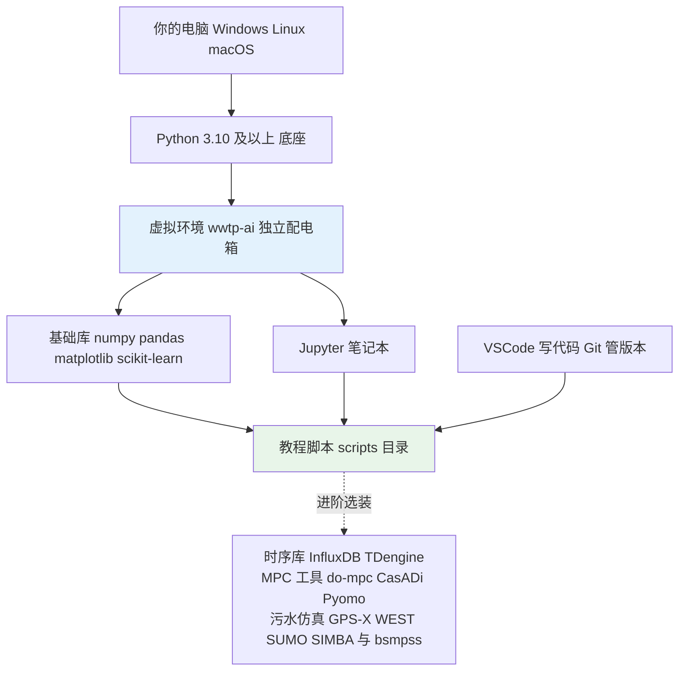
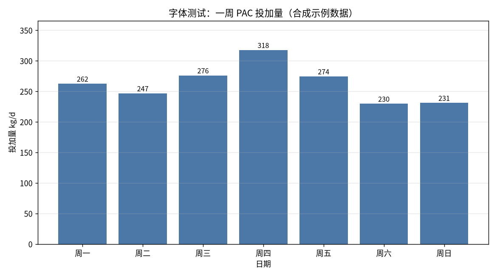

# 10-3 工具链与环境搭建（小白保姆级）

> **本章讲什么**：手把手带你在自己电脑上装好 Python 和教程用到的全部工具，把第一个中文图表跑出来；再送你一张报错急救表。
>
> **读完你能干什么**：独立完成"装 Python → 建虚拟环境 → 装库 → 跑教程脚本 → 开 Jupyter → 用 Git/VSCode 看代码"全流程，遇到 90% 的安装报错能自己救回来。
>
> **阅读时间**：约 25 分钟（含下载安装）。跟着做一遍，以后不再怕"环境"两个字。

---

## 一、场景：被"环境"劝退的小张

小张想跟着教程跑一段数据处理代码，网上教程一会儿叫他装 Anaconda、一会儿又叫他 pip，折腾两天，命令行跳出一堆红字，中文在图里全变成"口口口"方块——电脑没坏，是**环境没配对**。

其实只需一条主线：**装一个 Python → 给本教程开一个独立小环境 → 用国内镜像装 5 个库 → 验证**。装环境就像给工地修一个独立配电箱：这一个项目的工具放一起，互不干扰。

## 二、要装的东西全景图



## 三、第一步：安装 Python 3.10+（三选一）

**路线 A：官网安装包（最推荐，Windows/macOS 省心）**

1. 浏览器打开 python.org → Downloads → 选 **Python 3.10/3.11/3.12**（不要下太新的 3.13，部分库还没跟上）。
2. Windows 安装时**务必勾选最下面的 "Add python.exe to PATH"**，再点 Install Now。
3. 装完打开终端验证（见下文终端打开方法）。

**路线 B：Anaconda（图形界面、一键全家桶，占约 3 GB 磁盘）**

到 anaconda.com/download 下载对应系统安装包，一路下一步即可；它自带 Python、Jupyter 和常用科学计算库，适合完全不想碰命令行的同学。缺点是大、自带库版本更新慢。

**路线 C：Miniconda（轻量版，约 400 MB，Linux 最常用）**

Linux（Ubuntu/Debian）三条命令：

```bash
wget https://repo.anaconda.com/miniconda/Miniconda3-latest-Linux-x86_64.sh
bash Miniconda3-latest-Linux-x86_64.sh -b -p $HOME/miniconda3
$HOME/miniconda3/bin/conda init bash
```

macOS（苹果芯片 M 系列）把第一条的文件名换成 `Miniconda3-latest-MacOSX-arm64.sh`；Windows 下载 `Miniconda3-latest-Windows-x86_64.exe` 双击下一步。

> 💡 其实很多 Linux 自带 `python3`。在终端输入 `python3 --version`，若显示 3.10 以上，可以直接跳到虚拟环境那步，不必重复安装。

**怎么打开终端**：Windows 按 `Win+R` 输入 `cmd` 回车（或用 PowerShell）；macOS 打开"终端"App；Linux 在文件夹里右键"在终端打开"。

```bash
python --version      # Windows/macOS
python3 --version     # Linux 通常用这个
```

看到 `Python 3.10.x` 或更高就成功了。

## 四、第二步：创建并激活虚拟环境

虚拟环境就是给本教程单独开一个"工具抽屉"，装错了删掉重来也不影响系统。

```bash
python -m venv wwtp-ai
```

激活它（不同系统命令不同）：

| 系统/终端 | 激活命令 |
|---|---|
| Windows 命令提示符 cmd | `wwtp-ai\Scripts\activate.bat` |
| Windows PowerShell | `wwtp-ai\Scripts\Activate.ps1` |
| Linux / macOS | `source wwtp-ai/bin/activate` |

激活成功后，命令行最前面会出现 `(wwtp-ai)` 的标记。退出虚拟环境只需输入 `deactivate`。

> ⚠️ **PowerShell 红字不让激活怎么办**：首次使用先执行一次 `Set-ExecutionPolicy -Scope CurrentUser RemoteSigned`，输入 `Y` 回车，再激活即可。这只是允许本机运行本地脚本，安全。

## 五、第三步：用清华镜像装库

先升级 pip，再安装教程所需的五个库（直接复制整行）：

```bash
python -m pip install --upgrade pip
pip install numpy pandas matplotlib scikit-learn jupyter -i https://pypi.tuna.tsinghua.edu.cn/simple
```

参数 `-i` 表示临时走清华镜像源，国内下载速度能从几十 KB/s 提到几 MB/s。想一劳永逸设为默认源：

```bash
pip config set global.index-url https://pypi.tuna.tsinghua.edu.cn/simple
```

各库是干什么的：**numpy** 管数值计算，**pandas** 管表格数据，**matplotlib** 画图，**scikit-learn** 机器学习工具箱，**jupyter** 在浏览器里写代码的笔记本。

## 六、第四步：验证——打印版本+画一张中文测试图

教程仓库自带一个验证脚本 [fig10_03_font_test.py](../scripts/fig10_03_font_test.py)，内容如下（可先扫一眼，不用背）：

```python
import matplotlib
matplotlib.use("Agg")
import sys, platform
import numpy as np, pandas as pd
import matplotlib.pyplot as plt
plt.rcParams["font.sans-serif"] = ["Noto Sans CJK SC"]
plt.rcParams["axes.unicode_minus"] = False

print("Python:", platform.python_version(), "| 系统:", sys.platform)
print("numpy", np.__version__, "| pandas", pd.__version__,
      "| matplotlib", matplotlib.__version__)

rng = np.random.default_rng(42)
days = ["周一", "周二", "周三", "周四", "周五", "周六", "周日"]
dose = np.array([260, 255, 270, 310, 290, 240, 230]) + rng.normal(0, 8, 7)

fig, ax = plt.subplots(figsize=(9, 5), dpi=130)
ax.bar(days, dose, color="#4c78a8")
ax.set_title("字体测试：一周 PAC 投加量（合成示例数据）")
ax.set_xlabel("日期")
ax.set_ylabel("投加量 kg/d")
ax.grid(axis="y", alpha=0.3)
plt.tight_layout()
plt.savefig("../images/fig10_03_font_test.png")
print("中文测试图已生成：images/fig10_03_font_test.png")
```

运行：

```bash
cd scripts
python fig10_03_font_test.py
```

终端打印出各库版本、项目根目录 `images/` 下多出一张 PNG，且图里**中文不是方块**，环境就算彻底配好了。



*数据为合成示例：这张图的唯一目的是确认中文字体配置成功，数字没有任何工程含义。*

### 中文显示方块怎么办（分系统）

matplotlib 默认字体不含中文，缺字就画成方框。除了脚本里已写好的 Linux 写法，其他系统把 `font.sans-serif` 换成本机已有中文字体即可：

```python
# Windows 写法（微软雅黑）
plt.rcParams["font.sans-serif"] = ["Microsoft YaHei"]
# macOS 写法（苹方或黑体）
plt.rcParams["font.sans-serif"] = ["PingFang SC", "Heiti SC"]
# Linux 如果没有 Noto 字体，先装中文字体再运行：
#   sudo apt update && sudo apt install -y fonts-noto-cjk
# 装完若仍不生效，清一下字体缓存：rm -rf ~/.cache/matplotlib
plt.rcParams["axes.unicode_minus"] = False   # 让负号正常显示
```

## 七、怎么运行本教程的代码

教程每章的画图脚本都在 `scripts/` 目录，命名形如 `figXX_YY_主题.py`，输出 PNG 到 `images/`：

```bash
cd scripts                 # 进入脚本目录
python fig04_01_beta_curve.py    # 运行某一章的图；Linux 下用 python3
```

脚本全部遵守统一约定：无界面后端 Agg（服务器也能跑）、`figsize=(9,5)` 左右、`dpi=130`、`plt.tight_layout()`，所以你照着改数据即可，不用动绘图框架。

想用笔记本边看边跑：

```bash
jupyter notebook       # 自动打开浏览器；新版也可用 jupyter lab
```

若 Notebook 下拉菜单找不到 `wwtp-ai` 内核，先在激活的虚拟环境里注册一次：

```bash
pip install ipykernel
python -m ipykernel install --user --name wwtp-ai
```

## 八、Git 与 VSCode 入门

教程代码建议用 Git 管理，改坏了能回到任意历史版本。先记住 5 条命令就够用：

| 命令 | 干什么用 |
|---|---|
| `git clone <仓库地址>` | 第一次把代码仓库下载到本地 |
| `git status` | 查看自己改了哪些文件（最常用的"我刚才干了啥"） |
| `git add .` | 把改动加入待提交清单 |
| `git commit -m "说明改了什么"` | 给当前改动拍一个"存档点" |
| `git pull` | 拉取团队/教程的最新版本 |

VSCode（code.visualstudio.com 免费下载）必装 4 个扩展：**Python、Jupyter、Chinese (Simplified) 中文语言包、Markdown Preview Mermaid Support**。最后这个插件能让你在 Markdown 预览里直接看到本教程的 mermaid 流程图，不用推到网站上。

> 💡 **小白建议**：先用 VSCode"打开文件夹"方式打开整个 `wwtp-ai-dosing-guide` 目录，左下角选择解释器为 `wwtp-ai` 虚拟环境，之后所有终端和运行按钮都会自动用对环境，省去手动激活。

## 九、进阶工具简介（了解即可，不强制安装）

基础库学完后，真正做项目时会遇到下面这些工具，先混个脸熟，需要时再装。

| 工具 | 类别 | 定位 |
|---|---|---|
| InfluxDB | 时序数据库 | 专门存秒级/分钟级仪表数据，自带降采样和保留策略 |
| TDengine | 时序数据库 | 国产时序库，写入压缩率高，适合边缘端海量点位 |
| do-mpc | Python MPC 工具箱 | 基于 CasADi 的模型预测控制框架，可快速搭加药 MPC 原型 |
| CasADi | 优化求解框架 | 符号建模+非线性优化，MPC 和动态优化的底层引擎 |
| Pyomo | 优化建模语言 | 排产、配药调度等线性/整数优化用 |
| GPS-X | 商业污水仿真 | 厂级工艺仿真老牌软件，模型全、上手需培训 |
| WEST | 商业污水仿真 | 活性污泥工艺建模与控制策略验证 |
| SUMO | 商业污水仿真 | 开源模型内核思路+工程化界面，设计院常用 |
| SIMBA# | 商业污水仿真 | 基于 ASM 系列的仿真平台，学术与工程结合 |
| bsmpss | 开源 BSM 仿真代码 | 学习 BSM/EQI/OCI 基准的轻量入口；以开源仓库实际版本为准 |

商业仿真软件价值在于**机理模型库成熟、可做数字孪生**；Python 开源栈价值在于**免费、可和数据模型无缝拼接**。学习阶段先用 Python，工作中遇到客户指定平台再学商业软件。

## 十、常见报错排查表（按现象直接查）

| 序号 | 报错现象 | 原因一句话 | 解决办法 |
|---|---|---|---|
| 1 | pip 下载超时报 Read timed out | 默认源在国外 | 加 `-i https://pypi.tuna.tsinghua.edu.cn/simple`，或 pip config 设默认镜像 |
| 2 | 图里中文全是方块/方框 | matplotlib 没用中文字体 | 按第六节设 font.sans-serif，Linux 装 fonts-noto-cjk 并清 ~/.cache/matplotlib |
| 3 | ModuleNotFoundError: No module named 'xxx' | 库没装或装到了别的 Python | 确认命令行有 (wwtp-ai)，在该环境内重新 pip install |
| 4 | Jupyter 8888 端口被占用 | 上次的 notebook 没关 | 用 `jupyter notebook --port 8889` 换端口，或任务管理器关掉残留进程 |
| 5 | Permission denied / externally-managed-environment | 系统 Python 不让直接 pip | 用 venv/conda 虚拟环境安装，别对系统 Python 加 --break-system-packages |
| 6 | SSL: CERTIFICATE VERIFY FAILED | 公司代理/证书问题 | 临时用可信镜像，或让网管导入根证书，别长期关闭 SSL 校验 |
| 7 | 激活后 python 路径没变 | 没激活成功或用了错误终端 | 看提示符有无 (wwtp-ai)；PowerShell 先设 RemoteSigned 执行策略 |
| 8 | pip 装 numpy/pandas 卡很久或失败 | 在源码编译 | 升级 pip（新 pip 会选预编译 wheel），仍失败换 Python 3.10/3.11 |
| 9 | Notebook 下拉没有 wwtp-ai 内核 | 未注册 ipykernel | `python -m ipykernel install --user --name wwtp-ai` |
| 10 | Windows 跑脚本中文输出 UnicodeEncodeError | 默认 GBK 编码 | 执行 `set PYTHONUTF8=1`（cmd）后再跑，或用 VSCode 内置终端 |
| 11 | 改了脚本结果没变化 | 编辑器没保存/跑错目录 | 先 Ctrl+S 保存，确认终端在 scripts 目录且文件名没打错 |
| 12 | conda 和 pip 混装后环境乱套 | 两个包管理器互相覆盖 | 一个环境尽量只用一种；新建干净环境比重修更快 |
| 13 | jupyter 命令找不到 | 没在激活的环境里安装 | 激活 wwtp-ai 后重新 `pip install jupyter` |
| 14 | 图片保存报 No such file or directory | 输出目录不存在/没在 scripts 下运行 | 确认在 scripts 目录运行，且上级 images 目录存在 |

> ⚠️ **老工程师的坑**：装环境最大的心法是"**一个项目一个虚拟环境**"。见过不少同学把所有库都装进系统 Python，三个月后 A 项目要 numpy 1.x、B 项目要 2.x，互相打架救不回来。虚拟环境删掉重建只要一分钟，系统 Python 搞坏要重装系统。

## 本章小结

1. 主线五步：**装 Python 3.10+ → `python -m venv wwtp-ai` → 激活 → 清华镜像装五件套 → 跑字体测试图**。
2. 中文方块靠 `plt.rcParams["font.sans-serif"]` 指定本机中文字体解决，Linux 装 fonts-noto-cjk。
3. 运行脚本：`cd scripts && python xxx.py`；交互式用 Jupyter Notebook 并注册 wwtp-ai 内核。
4. Git 只需先会 clone/status/add/commit/pull 五条；VSCode 装 Python、Jupyter、中文包、Mermaid 预览四插件。
5. 进阶工具（时序库、MPC、商业仿真）按项目需要再装，学习阶段不折腾。
6. 报错先查第十节急救表，绝大多数问题是镜像、字体、虚拟环境和端口四件事。

---

上一章：[10-2 标准规范与排放限值清单](./10-2-标准规范与排放限值清单.md)
｜下一章：[10-4 FAQ 一百问](./10-4-FAQ一百问.md)
