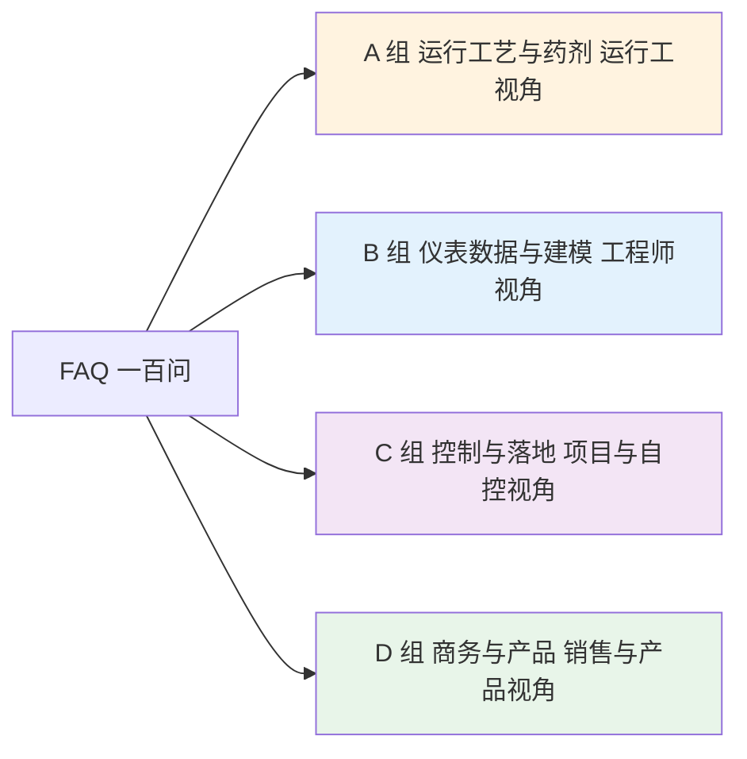

# 10-4 FAQ 一百问：四个角色最常问的 100 个问题

> **本章讲什么**：把教程学习和项目落地中最常被问到的 100 个问题，按四个视角分组，每题给一段 2~5 句直白实用的回答，不绕弯子。
>
> **读完你能干什么**：运行工能应付大部分日常加药异常，工程师能判断数据和模型问题出在哪，项目经理能回答客户的安全与控制疑问，销售能用大白话讲清价值和风险。
>
> **阅读时间**：约 25 分钟。建议先挑自己角色那组读，其余当备查。

---

## 怎么读这 100 问

## A 组：运行工艺与药剂（A1~A25，运行工视角）

**A1. PAC 和 PAM 是不是一回事？**

不是。PAC 是无机铝盐混凝剂，主力除磷和混凝，黄褐色水剂可直接投；PAM 是有机高分子"胶水"，用于助凝和污泥脱水，必须稀释到 0.1%~0.3% 并熟化 30~60 min。前者约 1500~2500 元/吨，后者 1.2 万~3 万元/吨，加错位置不但白花钱还会糊住滤布。

**A2. 总磷突然升高先查什么？**

按"药-混-沉-测"四步排查：先查计量泵是否打空、冲程被改、药液是否换批次浓度稀了；再看静态混合器和矾花是否正常；接着看高效沉淀池/二沉池有没有跑泥、pH 是否过低（铝盐最佳约 6~8）；最后让化验复测排除在线仪误报。进水磷化废水冲击也常见，先确认现象是真的再调药。

**A3. 氨氮超标和 TN 超标有什么区别？**

氨氮超标说明硝化没干完，问题在好氧段：DO 不够、水温低、SRT 太短或有毒物抑制。氨氮合格但 TN 还高，是反硝化没干完，问题在缺氧段：碳源不够、DO 串入、内回流比不对。先化验分清是哪种氮高，治法完全相反。

**A4. 碳源加多了会怎样？**

多余碳源被带进好氧段当普通有机物烧掉，纯浪费碳源钱和曝气电费；还可能推高出水 COD、催长丝状菌引发污泥膨胀。典型合理用量约 4.5~5.5 kg COD/kg 硝氮，跟着硝氮和流量走，盲目多加 20% 就是纯亏。

**A5. 冬天为什么药耗普遍变高？**

低温下硝化菌、反硝化菌活性下降，反应变慢，需要更长泥龄、更多碳源；混凝反应也变慢、矾花沉降差，同样除磷目标要更多铝/铁盐。注意一级A 氨氮限值冬天反而从 5 放宽到 8，但处理能力下降得更多，所以实际更吃力。应对是提前提高 SRT、做冬季工况参数和模型。

**A6. 二沉池跑泥怎么办？**

先看 SVI：大于 150 多为污泥膨胀，要降负荷、停掉过量碳源、镜检丝状菌；再查回流比和泥位，回流不够、排泥不及时泥层太高也会跑。临时可投少量 PAC/PAM 助沉，根本是恢复 MLSS 和负荷平衡。跑泥会同时抬高出水 SS 和 TP，不能拖。

**A7. PAC 加多了出水会怎样？**

矾花过大反而破碎、出水发白发浑，残余铝可能升高；化学污泥多产、活性污泥活性受抑，钱还白花。除磷不是越多越好，实际 Al/P 摩尔比 1.5~3 通常就够，按出水正磷酸盐反馈调，别按"多加保险"的思路。

**A8. 除磷选铝盐还是铁盐？**

PAC 适合常规市政除磷、出水色度要求高；PFS 除磷更猛、还能除臭脱色，但加多出水发黄、腐蚀性略强。先做烧杯搅拌试验确定药剂和 β 值，再综合比较药剂费与多出的污泥处置费，不同厂答案不一样。

**A9. 污泥脱水 PAM 加多少合适？**

经验范围 3~8 kg/t 绝干污泥，配成 0.1%~0.3% 并熟化 30~60 min。看滤液清亮程度和泥饼含水率（目标约 80%）现场微调；阳离子度要和泥性匹配，型号选错加再多泥也是水塌塌的。

**A10. 氨氮合格但 TN 高，怎么调？**

典型反硝化不足：查缺氧池 DO（应 <0.2 mg/L，内回流带氧过多最常见）、碳源投加点是否在缺氧段前端、内回流比（常见 200%~400%）和缺氧段 HRT。碳源千万别投到好氧段，那是喂错了嘴。

**A11. DO 控制在多少合理？**

好氧段出水端约 2 mg/L 是常见经验值：太低硝化受限，太高费电且把溶解氧带进缺氧段破坏脱氮。更合理的做法是让 DO 随氨氮和负荷浮动（曝气优化或 AI 给定），而不是全厂一个恒定值。

**A12. 进水突然变黑变臭、负荷冲击怎么办？**

先调蓄降负荷、加大回流和曝气稳住生物池；化学除磷段暂停自动加量、切手动观察，避免在异常数据上瞎调。事后取进水样查偷排来源，并把这段数据标记为异常，不要让它进模型训练集。

**A13. 次氯酸钠消毒加多少？**

以有效氯计约 1~5 mg/L（商品液有效氯约 10%），接触时间 ≥30 min，靠余氯仪反馈微调。加少了粪大肠菌群超标，加多了余氯进河道危害水生生物，也多花钱。

**A14. 次氯酸钠和盐酸能放一个库吗？**

绝对不能，两者接触会产生剧毒氯气；加药间和库房必须分区、通风、按 GB 15603 等危化品储存要求管理。次氯酸钠还怕晒怕热，分解胀气，储罐要避光并留排气阀。

**A15. 碳源选乙酸钠还是甲醇？**

乙酸钠安全、起效快、管理简单，是国内市政厂主流，约 2500~4000 元/吨；甲醇 COD 当量高（1.50 kgCOD/kg）、长期单耗成本低，但易燃有毒，需要防爆储罐和专门资质。大厂管理到位可算账选择，小厂建议老实用乙酸钠。

**A16. 什么是有效氯和 CT 值？**

有效氯是不同含氯消毒剂杀菌能力的统一折算口径；CT 值是消毒剂浓度 C（mg/L）乘以接触时间 T（min），它才是判断杀菌到不到位的真正指标。接触池短、水量大时，光提高浓度不够，还必须保证接触时间 ≥30 min。

**A17. 池面大量白泡沫是什么问题？**

白色黏稠泡沫多与高负荷、丝状菌增殖或表面活性剂冲击有关；棕黄色厚泡沫常是污泥老化。先查 F/M、SVI 和进水洗涤剂来源，别急着喷消泡剂，消泡只遮症状不治病。

**A18. 碱度不够为什么要补碱？**

硝化每氧化 1 kg 氨氮耗约 7.14 kg 碱度（以 CaCO₃ 计），碱度低于约 70~100 mg/L 时 pH 会掉、硝化崩溃。补纯碱或烧碱前先按物料衡算缺多少，别忘了反硝化还能补回约一半（3.57 kg/kg N），别补过头。

**A19. 高效沉淀池和二沉池前加药有什么不同？**

二沉池前一般只辅助投少量混凝剂保护泥水分离；高效沉淀池有泥渣回流、独立加药点、絮凝搅拌和斜管，是化学除磷的主力位置。做 AI 控药时两个加药点要分别建模、分别控制，不能一个频率带两个点。

**A20. 药剂浓度配错了（配浓或配稀）怎么办？**

立即切手动，按实测浓度修正计量泵冲程和频率；PAM 配浓容易堵管，要稀释并排空熟化罐重配。每批药剂的浓度和到货化验单必须记录——它是 AI 投加量公式的输入，浓度错了，模型再准也白搭。

**A21. 雨季水量暴增，加药要跟着翻倍吗？**

不一定。雨水主要稀释浓度，污染物总量未必翻倍，单纯按流量比例加药会过量。正确做法是"流量前馈+浓度反馈"，同时警惕初期雨水把管网沉积物冲起来造成短时高负荷，盯着在线 COD/TP 趋势调。

**A22. SVI 和 SV30 是什么，运行班怎么用？**

SV30 是 1 L 混合液静沉 30 min 泥层所占体积百分比，5 分钟出结果；SVI=SV30×10/MLSS，70~150 mL/g 正常。每班测一次，数值连续上升就是污泥膨胀预警，比等化验报告快得多。

**A23. 厌氧池、缺氧池、好氧池到底怎么区分？**

不曝气且没有硝态氮是厌氧段（聚磷菌放磷）；不曝气但有硝态氮是缺氧段（反硝化脱氮）；曝气、DO 充足是好氧段（去碳+硝化）。AAO 就是这三段按顺序串起来，靠内回流把硝氮送回缺氧段。

**A24. 化学除磷和生物除磷是什么关系？**

生物除磷靠聚磷菌，便宜但受碳源、温度影响不稳定；化学除磷靠铝/铁盐抓磷，稳但花钱、多产泥。一级A（TP 0.5）多数厂是"生物+化学"组合，到准IV类（TP 0.3）化学兜底的比重明显加大。

**A25. 运行记录每天必须抄哪些数？**

进出水关键指标、各池 DO/ORP/MLSS、药罐液位和实际投加量（要看加药流量计，不能只记泵频率）、剩余污泥量、异常事件和天气。这些记录以后就是 AI 的标签和事故追溯依据，日期时间一定记准。

## B 组：仪表数据与建模（B1~B25，工程师视角）

**B1. 仪表数据不准怎么办？**

按"校准-污染-工况"三步查：电极是否干了脏了、试剂是否过期、量程是否漂移；用实验室方法做实际水样比对；建立定期校准和比对制度。DO、pH 这类秒级电极仪表维护最频繁，确认是脏数据就宁缺毋滥，别喂给模型。

**B2. 没有历史数据能不能上 AI？**

能，但别一上来买"全自动闭环"。先花 1~3 个月补采数据（SCADA 历史库+化验记录电子化），用机理公式和经验规则做开环建议；数据攒够再训练模型。连加药计量设备都没有的厂，先补硬件再谈 AI。

**B3. 一个模型要训练多久？**

离线训练本身只要几分钟到几小时，真正费时间的是准备 3~6 个月以上的干净数据和反复验证。污水厂建模至少要覆盖一个完整季节段，想要冬季好用，训练数据里必须经历过冬天。

**B4. 化验数据少怎么做标签？**

把出水 TP/氨氮等关键点位从每天 1 次提高到 2~4 次，记录精确采样时刻并与在线时间序列对齐；也可以用机理模型生成辅助标签做半监督学习，但最终必须用真实化验校验。标签在精不在多，时刻不准的标签比没有更糟。

**B5. 模型上线后突然不准了怎么办？**

先查数据链：仪表是否故障、量程和点位是否被改、通讯是否丢点；再查工况：季节切换、进水来源变化、工艺检修。用 PSI 监控分布漂移，处置期间切回规则控制或手动，再安排重训练。

**B6. 什么是数据泄漏，为什么可怕？**

训练时模型偷看了当时不可能知道的信息（比如用了未来数据、或把出口指标当入口特征），离线分数虚高、上线必然失效。防范三招：严格按时间切分训练集和测试集、先做滞后对齐再建模、必须做时间外验证。

**B7. RMSE 和 MAE 看哪个？**

MAE 是平均偏差多少 mg/L，最直观，给领导汇报用；RMSE 对大误差惩罚更重，控制场景更怕偶发大偏差，所以两个都看。参考口径：TP 软测量 MAE ≤0.03 mg/L 就足以支撑前馈控药。

**B8. 软测量能替代 COD、氨氮在线仪吗？**

不能。软测量是"巡警"，法定考核和环保联网仍靠合规在线仪；它的价值是填补试剂法仪表 10~30 min 的出数空当、做异常互校和提前预测。软测量还要持续被硬仪表校准，否则越跑越偏。

**B9. 随机森林、XGBoost、LSTM 怎么选？**

表格型数据、样本几千到几万条、还要可解释，优先随机森林或 XGBoost；只有长序列依赖明显且数据量充足时才上 LSTM，否则更容易过拟合。污水厂加药项目八成用树模型就能解决。

**B10. 模型特征一般选哪些？**

进水流量与污染物浓度、DO/ORP/pH/水温、MLSS、实际投加量及其滞后项、液位、降雨、时段班次。先用机理圈定候选变量，再用相关性分析和特征重要性筛选，宁缺毋滥，无关变量只会帮倒忙。

**B11. 投药和出水不同步怎么对齐？**

按水力停留时间 τ≈V/Q 做滞后对齐，再用互相关分析扫描历史数据找到最相关的滞后分钟数（算例曾得约 170 min、相关系数 −0.96），并随流量动态修正。不做对齐就训练，等于把"药"和"果"错配姻缘。

**B12. 数据里常见的坑有哪些？**

常见九类：卡死值、跳变、超量程、全零、时钟错乱、单位不一致、检修期假值、事后补录假值、仪表维护期数据。建模前必须先出数据体检报告，垃圾进必然垃圾出。

**B13. SCADA 没有历史数据库怎么办？**

加装边缘网关，从 PLC 实时采集写入本地时序库（如 InfluxDB、TDengine），断网能缓存、恢复后自动补传，成本不高。这是数据基础最差的厂迈向 AI 的第一步，比直接上模型务实得多。

**B14. 异常检测在厂里能干什么？**

自动识别偷排冲击、仪表死机、泵堵塞、药剂耗尽等异常并报警，还能给数据自动打工况标签。它不直接省药，但能防事故，同时帮模型自动跳过异常时段，避免学到错误规律。

**B15. 模型需要多少数据才够？**

经验上至少 3~6 个月小时级数据，覆盖不同负荷、天气；想跨季节好用最好攒满一年。数据少就用简单模型加机理灰箱，别硬上深度学习——小数据配大模型必过拟合。

**B16. 化验数据和在线仪打架信谁？**

先按规范做实际水样比对找偏差来源；环保考核以通过有效性判别的在线数据为准，模型标签可用化验值但要记录两者偏差。打架时段的数据必须打标记，不能静默地随便挑一个用。

**B17. 什么是 PSI 和漂移？**

PSI 衡量当前数据分布与建模时的差异：小于 0.1 稳定，0.1~0.25 需要关注，大于 0.25 必须处理。季节切换、纳管新工业用户都会引发漂移，漂移后模型要评估并重训。

**B18. 影子运行是什么，要多久？**

模型上线初期只输出建议、不操控设备，和人工操作并行对比 4~8 周，验证精度、稳定性和异常表现。在跑赢老师傅之前，不允许进入闭环，这是对运行负责的基本规矩。

**B19. 聚类分析对污水厂有什么用？**

它不需要标签，能自动把运行工况分成几堆，比如雨天、高负荷、冬季低水温、正常工况。分堆之后可以每堆单独建模或制定控制策略，比用一个模型包打天下更准。

**B20. 模型预测的置信区间有什么用？**

区间窄说明模型有把握，可以放心自动；区间突然变宽就自动降权、提示转人工。对运行员来说，带区间的预测比一个孤零零的数字更诚实，也更容易建立信任。

**B21. 为什么说灰箱模型最落地？**

纯机理模型参数难标定，纯数据模型没数据就抓瞎；灰箱用机理公式打底（如 Al/P 摩尔比 1.5~3、反硝化需碳 4.5~5.5 kgCOD/kg N），再用数据修正系数，数据少也能跑，结果还能向厂长解释清楚。

**B22. 模型上线后还需不需要管？**

需要，运维是长期工作：监控精度和 PSI、仪表故障时自动降级、季度评估、跨季节重训。合同里必须写清运维责任和年限，否则系统半年后就成了屏幕上没人看的摆设。

**B23. 数据采样频率多高合适？**

DO、pH、流量秒级采集、存 1~5 min 均值即可；试剂法仪表 10~30 min 出一个数照单全收；化验值按实际采样时刻打时间戳。频率过高只增加存储、不增加信息，反而放大噪声。

**B24. 怎么向运行员证明模型靠谱？**

让他在画面上同时看到模型预测、实测结果、历史命中率和异常报警；先在影子运行期和老师傅"打擂台"，用连续几周的命中建立信任。推广系统时，培训和透明度比算法精度更重要。

**B25. 没有算法团队的厂怎么维护模型？**

选择带自动重训练和远程运维的产品化方案，厂内只需保证仪表和数据质量；合同约定 SLA（响应时限、年度模型更新次数）。不必为了一座厂养一个算法团队。

## C 组：控制与落地（C1~C25，项目与自控视角）

**C1. AI 会不会把水排超标？**

设计上不应发生：AI 给值后要经过 PLC 限幅、变化速率限制和安全联锁才执行，出水逼近限值自动切保守策略或人工，且闭环必须灰度上线、保留一键接管。AI 是副手，安全阀永远握在 PLC 和人手里。

**C2. 断网了系统怎么办？**

控制权在本地 PLC，本来就不依赖网络；边缘网关断网时缓存数据、恢复后补传，控制按最后安全参数继续运行。记住架构红线：断云不断厂。

**C3. PLC 不让写点怎么办？**

最常见的折中是"AI 读不写"：AI 往 SCADA 写建议值，运行员确认后手动改给定；也可以经网闸或独立通讯卡在 PLC 预留寄存器区写入，但要有厂家配合和业主书面授权。安全责任划清后，多数厂会开放受限写入。

**C4. 试运行要多久？**

节奏通常是影子运行 4~8 周、限幅半自动 1~2 个月、闭环观察 1~3 个月，整体常见 3~6 个月，能跨一个季节更有说服力。节药核算需要完整基线和同口径对比期，时间太短没有公信力。

**C5. 计量泵不支持自动调节怎么办？**

老式泵只有手动冲程，可加冲程控制器或变频改造（单台几千到一两万元），或更换带 4-20mA 输入的电磁隔膜计量泵。预算紧时先做"开环建议+人工调"，照样能拿到一部分节药收益。

**C6. 上 MPC 还是 PID？**

单回路、滞后小、扰动少的用 PID 就够，且好维护；多变量强耦合、约束多（同时协调 DO、投药、回流）才值得上 MPC。除磷加药这类回路"前馈+PID 反馈"通常就能拿到 15%~30% 的节药空间，别为技术而技术。

**C7. 前馈和反馈哪个更重要？**

要配合用。前馈看着进水流量和浓度提前动作，解决加药到出水几十到几百分钟的滞后；反馈用出水实测纠偏，解决偏差积累。只有反馈总是慢半拍，只有前馈则误差会越积越多。

**C8. 闭环控制需要哪些安全设计？**

给定上下限和变化速率限幅、低液位和仪表故障联锁、超标自动切保守、手自动无扰切换、一键切手动、全部操作留日志。所有阈值由工艺工程师确认，不能让算法工程师单方面设定。

**C9. 项目实施第一步干什么？**

进厂调研：摸清工艺路线、加药点和药剂种类、泵与仪表清单、PLC 品牌与接口、SCADA 历史数据情况、网络分区与安全要求。产出点位表、数据流图和改造 BOM 之后，才谈得上建模。

**C10. 老厂改造最容易卡在哪？**

数据基础：没有加药流量计、PLC 太老没有通讯口、历史数据缺失。往往要先补计量、加网关机柜、做数据治理，工期和预算要把这部分算足，否则进场后全是增项。

**C11. AI 服务器放机房还是现场？**

放中控室或机柜间的边缘工控机即可，选宽温、宽压、抗震、双电源型号，不必买昂贵服务器。云端做汇总分析和远程运维，闭环计算必须留在本地。

**C12. 网闸和防火墙是不是一回事？**

不是。防火墙是按规则做逻辑过滤，网闸是物理单向摆渡，控制网数据只能出不能进。环保联网和远程运维场景下，等保 2.0 测评通常要求网络分区加单向隔离。

**C13. 运行员不接受、不按建议操作怎么办？**

前期就让班长参与规则制定，建议要带理由，比如"预计未来 30 min 进水 TP 升高，建议加量 8%"；先在最痛的点打出样板，操作要比原来更省事而不是更费事。系统增加一线工作量，就一定推不动。

**C14. 节药效果怎么测量才可信？**

参照 M&V 和 IPMVP 的思路：先建立归一化基线（按水量、水质、温度修正），改造后同口径对比，扣除产量和天气差异。绝不能简单拿今年总费用除以去年总费用就宣布节省。

**C15. 进水冲击时 AI 怎么处理？**

模型对超出训练范围的工况应明确拒答或报警，自动切到保守规则（按安全比例加药或转人工）。事故时段数据单独标记存储，事后复盘，绝不允许模型在陌生工况下"硬猜"。

**C16. 加药改造要不要动工艺主流程？**

一般不动。主要施工集中在加药间、管路、PLC 和数据侧，大部分工作不停产也能完成；必须碰主管网的碰头作业安排在检修窗口即可。

**C17. 验收一般考哪些指标？**

节药率（除磷剂 15%~30%、碳源 10%~25% 的目标区间）、出水达标率不下降、系统自动投用率、模型精度（MAE/命中率）、联锁测试通过、文档与培训完成。这些指标开工前就要写进合同。

**C18. 多个加药点能同时优化吗？**

技术上可以，但建议分步：先做单回路见效（除磷剂或碳源），再做多回路协同（曝气-碳源-回流）。一上来就全厂闭环，风险大、责任也说不清。

**C19. 数据通讯用 OPC UA 还是 Modbus？**

老仪表和老 PLC 读点用 Modbus RTU/TCP 最通用；AI 服务器与 SCADA 之间推荐 OPC UA，信息模型规范、跨品牌、安全机制全。写控制量时一律走 PLC 预留寄存器并加安全层。

**C20. 项目需要做网络安全等保吗？**

市政污水厂工控系统通常按等保 2.0 二级管理，地方有明确要求时按三级；无论几级，网络分区、主机白名单、弱口令整改和备案都是基础动作，别等出了事再补。

**C21. 碳源优化和曝气优化会不会打架？**

会，而且强相关：好氧段过度曝气会把氧带进缺氧段，逼你多投碳源。做碳源优化最好与曝气 DO 控制协同设计，否则两边各自"最优"，合起来整体浪费。

**C22. 现场调试一般要驻场多久？**

数据已就位的厂，模型调试 2~4 周；需要补仪表、清洗数据的，前后 2~3 个月。冬季效果差往往要怪夏天没留冬季数据，驻场和验收节奏要跟着季节走。

**C23. 怎么防止控制参数被乱改？**

参数分级授权、修改留痕、设定合理范围，运行员只能在画面调整有限设定值；药剂批次浓度等由工艺工程师录入。操作日志同时也是事故追溯和责任划分的依据。

**C24. 试运行期间真的超标了算谁的责任？**

必须在合同里提前写清：影子和半自动阶段控制权在运行方；只有正式闭环移交后服务商才对建议和给定负责，且以安全联锁未被旁路为前提。口头约定事后一定扯皮。

**C25. 一两万吨的小厂值得做吗？**

先看药费盘子：年药剂费只有二三十万，节药 20% 难以覆盖投入，宜选轻量方案（开环建议加少量计量改造）或打包进区域运维。典型好账是 10 万吨级：年药耗数百万元、投资约 50~150 万元、1~2.5 年回本。

## D 组：商务与产品（D1~D25，销售与产品视角）

**D1. 一套 AI 加药系统多少钱？**

10 万吨级典型总投入约 50~150 万元（硬件+软件+实施），取决于加药点数量、仪表和 PLC 改造量。轻量开环版十几万也能起步，全厂多回路加数字孪生则更高，报价前必须先调研 BOM。

**D2. 多久能回本？**

市政厂典型 1~2.5 年：除磷剂节药 15%~30%、碳源 10%~25%，加上化学污泥减量 5%~10%。市政厂吨水药剂费约 0.05~0.25 元，水量越大、药费盘子越大，回本越快。

**D3. 怎么向客户证明真的省钱了？**

按 M&V 方法建立归一化基线（水量、水质、温度可比），改造后同口径对比，每月出节量报告。按效付费项目建议引入第三方核算，谁主张谁举证，但证据要双方都认。

**D4. 客户问数据安全怎么答？**

四句话：数据本地化存储、控制网与管理网单向隔离、传输加密且账号分级留痕、按等保 2.0 备案测评；模型不触碰 PLC 安全层，断网可独立运行。给客户看一张安全架构图，比口头保证十句都管用。

**D5. 按效付费合同怎么签？**

先约定基线测定方法（3~12 个月历史数据）、节量核算公式和第三方确认机制，再定分成比例（节省额三七或四六常见）、保底服务费、设备产权和退出机制。基线不签字，项目不动工。

**D6. 最先卖给什么样的厂最容易成交？**

优先找五项占三项的：水量大（5~10 万吨以上）、药费高（碳源+除磷剂年耗数百万）、有准IV类提标压力、管理层数字化意识强、已有 SCADA 和在线仪表。达标压力和可计量的药费是成交的两个前提。

**D7. 失败项目通常败在哪？**

最常见五个：数据脏且不治理、计量不准无法核算节省、运行员不配合、目标指标没写进合同、上线后无人运维。算法本身排不进失败原因前三名，别把资源都堆在模型上。

**D8. 除了省药费还有什么卖点？**

降低超标风险（环保处罚和约谈代价远超药费）、减少化学污泥（外运处置约 200~500 元/吨）、降低劳动强度和对老师傅个人经验的依赖、沉淀数据资产支撑集团对标。对厂长来说，"睡得着觉"往往比省几十万元更值钱。

**D9. 投标时客户最关心什么？**

同规模业绩案例、节药率承诺及其核算方法、故障时的安全设计、售后响应 SLA、与现有 PLC/SCADA 的兼容性。方案讲再炫，不如给一个同工艺、同规模厂的真实节药数字。

**D10. ROI 怎么粗算给客户听？**

年节药费=年药剂费×节药率（除磷剂按 15%~30%、碳源按 10%~25%），加污泥减量收益，减去年运维费，再除以总投资就是简单回收期。一张 Excel 同口径算清楚，比五十页 PPT 更能打动财务出身的领导。

**D11. TAM/SAM/SOM 是什么？**

市场测算三层漏斗：TAM 是全国市政污水厂药费总盘子，SAM 是你的产品适用厂型对应的药费，SOM 是未来 1~3 年凭团队和渠道实际能拿下的部分。商业计划里必须分层，别拿 TAM 当销售目标。

**D12. 客户说"我们老师傅开得挺好"怎么答？**

先认可经验、不争辩：AI 是把老师傅的经验 7×24 小时固化和量化，老师傅休息、请假时系统不翻车；可以先影子运行打擂台，跑不过不收费。要让老师傅成为项目参与者，而不是被替代者。

**D13. 项目报价包含哪些部分？**

四块：硬件（网关、仪表、泵改造、机柜）、软件许可、实施集成与调试培训、年度运维。千万别漏报长期运维费，否则第一年赚钱、后面年年倒贴。

**D14. 运维费一般怎么收？**

常见为软硬件投资额的 10%~20%/年，或打包进按效分成。合同要写明运维内容：模型精度监控、年度重训次数、现场巡检频次、备件与响应时限，避免"运维"变成一笔糊涂账。

**D15. 准IV类提标对这生意是利好吗？**

是强驱动。TP 从 0.5 收到 0.3、氨氮收到 1.5、COD 收到 30 后，凭经验投药极易过量，精准加药和碳源优化就从"锦上添花"变成"刚需"。提标政策落地的地区应优先布局。

**D16. 拥有几十座厂的集团型水司怎么做？**

总部建统一数据平台和模型工厂，各厂边缘部署、模型按厂微调；先打透一座标杆厂，再按集团框架协议批量复制，边际成本快速下降。逐个厂从零定制的做法在集团客户身上走不通。

**D17. 合同里必须写死的三个数字是什么？**

节药率及基线核算口径、出水达标率不下降的安全承诺、系统自动投用率与 SLA。再补上超标责任划分和退出条款，商务基本盘就稳了。

**D18. 客户要求"保证出水达标"怎么办？**

不能也不应承诺：达标是进水条件、全工艺和运行管理共同决定的，AI 只负责加药环节。可以承诺"不因加药系统导致达标率下降"以及异常工况下的保守处置策略，把能力边界写进合同反而更专业。

**D19. 免费做 POC 合适吗？**

可以做但要设边界：优先用客户历史数据做 4~6 周离线验证，不长周期驻场；POC 成功后费用可抵扣正式合同。无限期免费陪标是销售资源的黑洞。

**D20. 竞品很多怎么差异化？**

三个方向选一个扎透：经过业绩背书的安全闭环能力、零风险的按效付费模式、机理灰箱带来的可解释与少数据可用。别在"我们模型更准"上硬卷，客户根本无法现场验证这句话。

**D21. 做产品化还是项目制定制？**

样板期靠项目制打磨，做过 5 个厂以后必须产品化：标准点位模板、标准模型流水线、标准组态画面和交付文档。每个厂都从零定制，团队永远做不大、也留不下利润。

**D22. 药剂集采降价后，省药空间会缩水吗？**

单价下降不影响节药率这个百分比，只影响节省的绝对金额；同时精准加药还带来污泥减量和超标风险下降的价值。ROI 测算用客户实际采购价，并按年度更新基线即可。

**D23. 到底卖给谁，谁买单？**

买单方是污水厂和水务集团，因为药费记在它的账上；生态环境部门是监管方不是付费方，但提标政策、排污许可是推动客户决策的外部压力。两条线都要维护，但合同和回款盯着前者。

**D24. 项目交付文档要哪些？**

点位表与数据字典、网络安全架构说明、模型说明书（写清适用范围和局限）、SOP 操作手册、联锁测试记录、培训签到、验收报告。文档齐全，运维、回款和二期才有依据。

**D25. 这个赛道的长期价值在哪？**

水务行业正从"建得起"转向"运得省"：药剂、电耗、人工成本在涨，环保监管在收紧，数据基础设施在普及。短期卖节药收益，中期卖达标保障和少人值守，长期是污水厂运行优化的数据平台入口。

---

## 学完之后

读到这里，整本教程就结束了。回到第一天那个在早会上发懵的小周——现在的你应该能听懂全部对话，还能追问三个关键问题：**加药有没有流量计计量、出水指标谁在持续校验、省没省钱按什么口径算**。

知识在纸上，功夫在现场。建议你接下来做三件事：

1. **回厂走一遍**：拿着 [01-3 工艺全流程图解](../01-基础篇/01-3-污水处理工艺全流程图解.md) 和 [02-1 加药系统硬件全景](../02-加药系统篇/02-1-加药系统硬件全景-从药袋到出水口.md)，把本厂每个加药点、每台泵、每块表对上号。
2. **算一笔账**：参照 [03-2 成本账本](../03-问题与成本篇/03-2-污水厂成本账本-药剂到底花了多少钱.md) 和 [09-2 ROI 测算](../09-产品经理篇/09-2-价值量化与ROI测算模型.md)，把本厂年药剂费、节药空间和回本周期算出来。
3. **从小处动手**：按 [08-1 实施全流程](../08-落地实施篇/08-1-项目实施全流程-从调研到验收.md)，先选一个最痛的加药点，做数据体检和影子运行，用一个小胜利建立信心。

> 💡 最后一句叮嘱：AI 不会替代水务人，但**会用 AI 的水务人，会替代不会用的人**。工具会更新换代，"机理吃透、数据较真、安全敬畏、账目清楚"这四样不过时。

- 回到教程总目录：[README 教程首页](../README.md)
- 想从头再走一遍：[00-0 写给小白的话：你将学会什么](../00-导读/00-0-写给小白的话-你将学会什么.md)
- 五分钟快速复盘：[00-2 五分钟看懂污水厂 AI 加药](../00-导读/00-2-五分钟看懂污水厂AI加药.md)
- 按路径查漏补缺：[00-1 教程地图与四条学习路径](../00-导读/00-1-教程地图与四条学习路径.md)

上一章：[10-3 工具链与环境搭建](./10-3-工具链与环境搭建.md)
｜全书完，愿你守护的每一条河都清澈。
